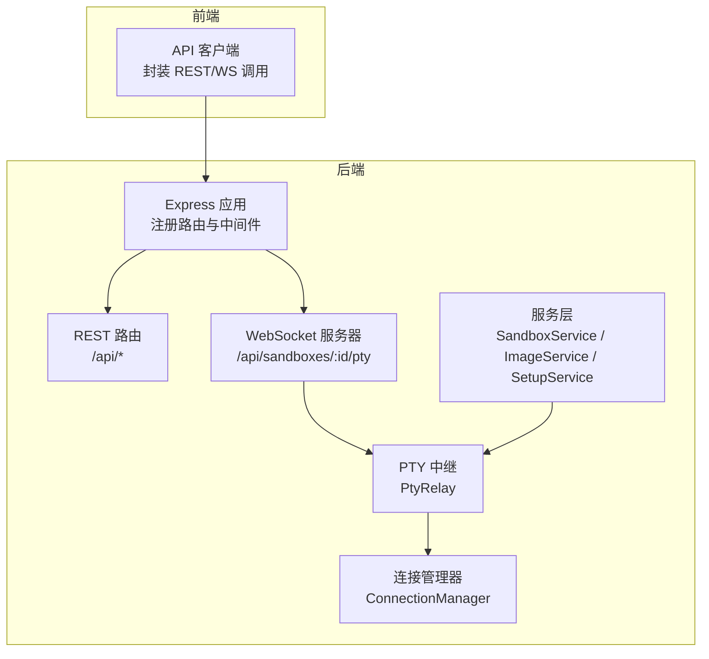
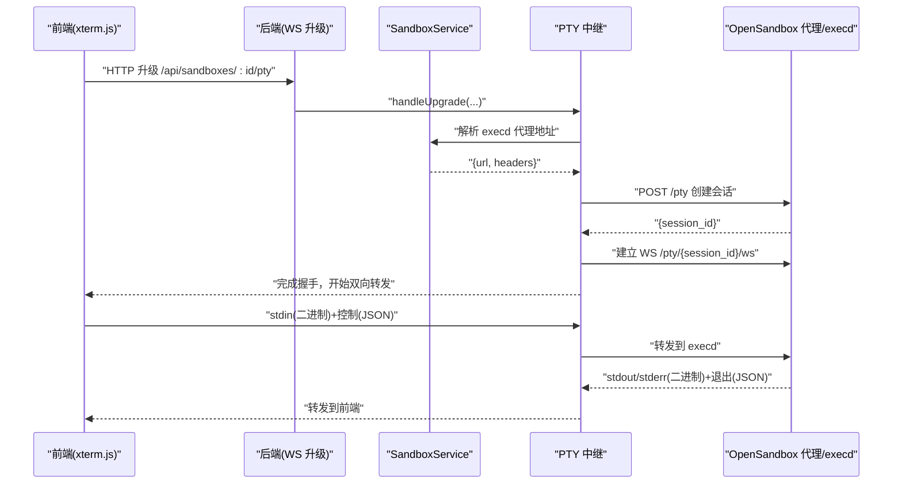
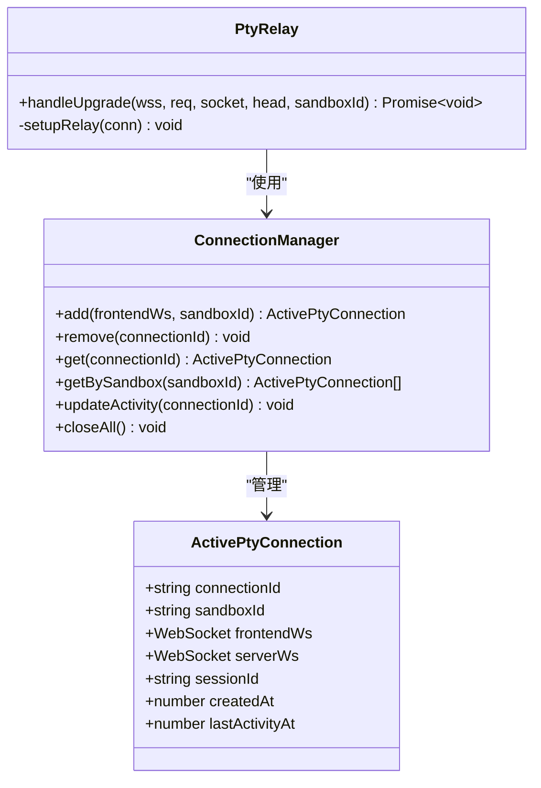
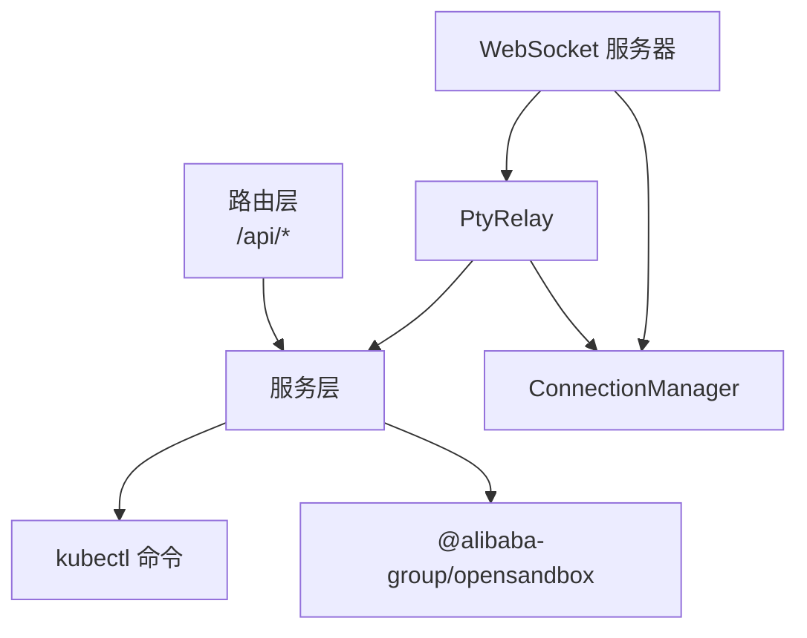

# API参考文档

<cite>
**本文档引用的文件**
- [apps/backend/src/index.ts](file://apps/backend/src/index.ts)
- [apps/backend/src/server.ts](file://apps/backend/src/server.ts)
- [apps/backend/src/routes/index.ts](file://apps/backend/src/routes/index.ts)
- [apps/backend/src/routes/health.ts](file://apps/backend/src/routes/health.ts)
- [apps/backend/src/routes/sandboxes.ts](file://apps/backend/src/routes/sandboxes.ts)
- [apps/backend/src/routes/files.ts](file://apps/backend/src/routes/files.ts)
- [apps/backend/src/routes/commands.ts](file://apps/backend/src/routes/commands.ts)
- [apps/backend/src/routes/images.ts](file://apps/backend/src/routes/images.ts)
- [apps/backend/src/routes/setup.ts](file://apps/backend/src/routes/setup.ts)
- [apps/backend/src/services/sandboxService.ts](file://apps/backend/src/services/sandboxService.ts)
- [apps/backend/src/services/imageService.ts](file://apps/backend/src/services/imageService.ts)
- [apps/backend/src/services/setupService.ts](file://apps/backend/src/services/setupService.ts)
- [apps/backend/src/websocket/connectionManager.ts](file://apps/backend/src/websocket/connectionManager.ts)
- [apps/backend/src/websocket/ptyRelay.ts](file://apps/backend/src/websocket/ptyRelay.ts)
- [apps/backend/src/websocket/types.ts](file://apps/backend/src/websocket/types.ts)
- [apps/backend/src/middleware/error.ts](file://apps/backend/src/middleware/error.ts)
- [apps/backend/src/config.ts](file://apps/backend/src/config.ts)
- [apps/backend/src/logger.ts](file://apps/backend/src/logger.ts)
- [apps/frontend/src/api/client.ts](file://apps/frontend/src/api/client.ts)
- [apps/frontend/src/api/sandboxes.ts](file://apps/frontend/src/api/sandboxes.ts)
- [apps/frontend/src/api/files.ts](file://apps/frontend/src/api/files.ts)
- [apps/frontend/src/api/images.ts](file://apps/frontend/src/api/images.ts)
- [apps/frontend/src/api/setup.ts](file://apps/frontend/src/api/setup.ts)
- [apps/frontend/src/api/types.ts](file://apps/frontend/src/api/types.ts)
</cite>

## 目录
1. [简介](#简介)
2. [项目结构](#项目结构)
3. [核心组件](#核心组件)
4. [架构总览](#架构总览)
5. [详细组件分析](#详细组件分析)
6. [依赖关系分析](#依赖关系分析)
7. [性能考量](#性能考量)
8. [故障排查指南](#故障排查指南)
9. [结论](#结论)
10. [附录](#附录)

## 简介
本文件为 Sandbox Manager 的完整 API 参考文档，覆盖以下内容：
- REST API：列出所有端点的 HTTP 方法、URL 模式、请求/响应结构与认证方式
- WebSocket API：PTY 终端连接、消息格式、事件类型与实时交互流程
- 协议细节：二进制帧协议、控制消息、错误处理策略与安全注意事项
- 版本与兼容性：当前实现的版本语义与向后兼容性说明
- 常见用例：典型 API 调用示例、客户端实现建议与性能优化技巧
- 调试与监控：可用的调试工具与监控方法
- 最佳实践：API 使用规范与常见错误的解决方案

## 项目结构
后端采用 Express + ws 的混合架构，REST API 通过 Express 路由暴露，WebSocket PTY 通过 HTTP 升级机制接入。前端通过统一的 API 客户端封装调用。

图表来源
- [apps/backend/src/server.ts:36-90](file://apps/backend/src/server.ts#L36-L90)
- [apps/backend/src/routes/index.ts:8-13](file://apps/backend/src/routes/index.ts#L8-L13)
- [apps/backend/src/websocket/ptyRelay.ts:22-38](file://apps/backend/src/websocket/ptyRelay.ts#L22-L38)

章节来源
- [apps/backend/src/server.ts:36-90](file://apps/backend/src/server.ts#L36-L90)
- [apps/backend/src/routes/index.ts:8-13](file://apps/backend/src/routes/index.ts#L8-L13)

## 核心组件
- REST 路由注册：在应用启动时注册健康检查、沙箱、镜像、设置等路由前缀
- WebSocket 升级：监听 /api/sandboxes/:id/pty，完成握手后建立 PTY 会话
- 服务层：
  - SandboxService：与 OpenSandbox SDK 交互，提供沙箱生命周期管理与连接缓存
  - ImageService：基于 Kubernetes DaemonSet 预拉取镜像，提供状态查询与清理
  - SetupService：配置保存、连通性测试、本地/远程模式切换
- 连接管理：维护前端 WebSocket 与后端 execd 之间的映射，空闲检测与清理
- 错误处理：全局中间件捕获异常，输出统一响应结构

章节来源
- [apps/backend/src/server.ts:36-90](file://apps/backend/src/server.ts#L36-L90)
- [apps/backend/src/services/sandboxService.ts:11-47](file://apps/backend/src/services/sandboxService.ts#L11-L47)
- [apps/backend/src/services/imageService.ts:95-100](file://apps/backend/src/services/imageService.ts#L95-L100)
- [apps/backend/src/services/setupService.ts:58-66](file://apps/backend/src/services/setupService.ts#L58-L66)
- [apps/backend/src/websocket/connectionManager.ts:7-16](file://apps/backend/src/websocket/connectionManager.ts#L7-L16)
- [apps/backend/src/middleware/error.ts](file://apps/backend/src/middleware/error.ts)

## 架构总览
下图展示从浏览器到 OpenSandbox 后端再到 execd 的数据路径与控制流。

图表来源
- [apps/backend/src/server.ts:75-87](file://apps/backend/src/server.ts#L75-L87)
- [apps/backend/src/websocket/ptyRelay.ts:40-118](file://apps/backend/src/websocket/ptyRelay.ts#L40-L118)
- [apps/backend/src/services/sandboxService.ts:129-138](file://apps/backend/src/services/sandboxService.ts#L129-L138)

## 详细组件分析

### REST API 参考

#### 健康检查
- 方法与路径
  - GET /api/health
- 认证
  - 无需认证
- 请求参数
  - 无
- 成功响应
  - data.status: "ok"
  - data.configured: 是否已配置
  - data.opensandboxReady: OpenSandbox 可达性（已配置时）
  - data.timestamp: ISO 时间戳
  - data.uptime: 进程运行时间（秒）
- 失败响应
  - 返回统一错误结构，success=false

章节来源
- [apps/backend/src/routes/health.ts:6-51](file://apps/backend/src/routes/health.ts#L6-L51)

#### 设置
- 方法与路径
  - GET /api/setup/status
  - POST /api/setup/test-connection
  - POST /api/setup/remote
  - GET /api/setup/local-k8s/stream
  - POST /api/setup/complete
- 认证
  - 无需认证
- 请求体与参数
  - test-connection: { serverUrl, apiKey?, protocol? }
  - remote: { serverUrl, apiKey, protocol }
  - local-k8s/stream: 流式事件（SSE）
  - complete: 无
- 成功响应
  - status: 当前配置状态
  - test-connection: { connected, error? }
  - remote: { configured: true }
  - local-k8s/stream: progress/done/error 事件
  - complete: { configured: true }
- 失败响应
  - SETUP_IN_PROGRESS: 并发设置冲突
  - MISSING_FIELD: 缺少必要字段
  - SETUP_FAILED: 配置保存失败

章节来源
- [apps/backend/src/routes/setup.ts:17-139](file://apps/backend/src/routes/setup.ts#L17-L139)
- [apps/backend/src/services/setupService.ts:68-103](file://apps/backend/src/services/setupService.ts#L68-L103)

#### 镜像
- 方法与路径
  - GET /api/images
  - GET /api/images/cached
  - POST /api/images
  - GET /api/images/:name/status
  - DELETE /api/images/:name
- 认证
  - 无需认证
- 请求体与参数
  - POST /api/images: { image }
  - 其他: 路径参数或查询参数
- 成功响应
  - GET /api/images: 预拉取镜像列表
  - GET /api/images/cached: 节点缓存镜像列表
  - POST /api/images: 创建预拉取任务
  - GET /api/images/:name/status: 镜像状态
  - DELETE /api/images/:name: 204
- 失败响应
  - INVALID_ARGUMENT: 缺少镜像名
- 重要行为
  - 预拉取通过在命名空间中创建 DaemonSet 实现
  - 状态解析结合 DaemonSet 与 Pod 容器状态

章节来源
- [apps/backend/src/routes/images.ts:14-77](file://apps/backend/src/routes/images.ts#L14-L77)
- [apps/backend/src/services/imageService.ts:195-340](file://apps/backend/src/services/imageService.ts#L195-L340)

#### 沙箱
- 方法与路径
  - GET /api/sandboxes
  - POST /api/sandboxes
  - GET /api/sandboxes/:sandboxId
  - DELETE /api/sandboxes/:sandboxId
  - POST /api/sandboxes/:sandboxId/pause
  - POST /api/sandboxes/:sandboxId/resume
  - GET /api/sandboxes/:sandboxId/endpoints/:port
- 子路由
  - /api/sandboxes/:sandboxId/files
  - /api/sandboxes/:sandboxId/commands
- 认证
  - 无需认证
- 请求体与参数
  - POST /api/sandboxes: { image, name?, timeoutSeconds?, env?, metadata?, resource?, networkPolicy? }
  - 其他: 路径参数 :sandboxId, :port
- 成功响应
  - 列表: { items, pagination }
  - 创建: 202 + 沙箱信息（标准化为扁平结构）
  - 获取/暂停/恢复: 200
  - 删除: 204
  - 端点: { url, scheme, host, port }
- 失败响应
  - NOT_CONFIGURED: 尚未配置 OpenSandbox
  - 其他: 统一错误结构
- 重要行为
  - 列表过滤过期沙箱
  - 端点 URL 解析包含 http/https 与默认端口推断

章节来源
- [apps/backend/src/routes/sandboxes.ts:34-175](file://apps/backend/src/routes/sandboxes.ts#L34-L175)

#### 文件操作（子路由）
- 方法与路径
  - GET /api/sandboxes/:sandboxId/files
  - GET /api/sandboxes/:sandboxId/files/content?path=...
  - GET /api/sandboxes/:sandboxId/files/download?path=...
  - POST /api/sandboxes/:sandboxId/files/write
  - POST /api/sandboxes/:sandboxId/files/mkdir
  - POST /api/sandboxes/:sandboxId/files/move
  - DELETE /api/sandboxes/:sandboxId/files/files?path=...
  - DELETE /api/sandboxes/:sandboxId/files/directories?path=...
- 认证
  - 无需认证
- 请求体与参数
  - write: { path, content, mode? }
  - mkdir: { paths[], mode? }
  - move: { entries[] }
  - 其他: 查询参数 path 或数组
- 成功响应
  - 列表: 目录项数组
  - 内容: 文本或二进制
  - 写入/创建/移动: 200
  - 删除: 204
- 失败响应
  - MISSING_PATH/IS_DIRECTORY/MISSING_FIELDS 等具体错误码

章节来源
- [apps/backend/src/routes/files.ts:19-327](file://apps/backend/src/routes/files.ts#L19-L327)

#### 命令执行（子路由）
- 方法与路径
  - POST /api/sandboxes/:sandboxId/commands
  - POST /api/sandboxes/:sandboxId/commands/session
  - POST /api/sandboxes/:sandboxId/commands/session/:sessionId/run
  - DELETE /api/sandboxes/:sandboxId/commands/session/:sessionId
- 认证
  - 无需认证
- 请求体与参数
  - commands: { command, cwd?, timeoutSeconds?, envs? }
  - session: { workingDirectory? }
  - run: { command, cwd?, timeoutSeconds? }
- 成功响应
  - commands: 执行结果对象
  - session: { sessionId }
  - run: 执行结果对象
  - delete: 204
- 失败响应
  - MISSING_COMMAND: 缺少命令

章节来源
- [apps/backend/src/routes/commands.ts:12-95](file://apps/backend/src/routes/commands.ts#L12-L95)

### WebSocket API 参考

#### 连接与升级
- 路径
  - /api/sandboxes/:sandboxId/pty
- 握手
  - 通过 HTTP 升级建立 WebSocket；成功后分配连接标识并创建后端 execd 会话
- 会话生命周期
  - 前端关闭 → 后端清理
  - 后端关闭 → 前端清理
  - 空闲超时自动清理

章节来源
- [apps/backend/src/server.ts:75-87](file://apps/backend/src/server.ts#L75-L87)
- [apps/backend/src/websocket/connectionManager.ts:30-90](file://apps/backend/src/websocket/connectionManager.ts#L30-L90)

#### 消息格式与协议
- 二进制帧
  - 0x00 + UTF-8 字节：stdin（前端→execd）
  - 0x01 + 字节：stdout（execd→前端）
  - 0x02 + 字节：stderr（execd→前端）
- JSON 控制帧
  - resize：{ type: "resize", cols, rows }
  - exit：{ type: "exit", code }
- 透明中继
  - 后端对原始帧进行转发，不解析内容

章节来源
- [apps/backend/src/websocket/ptyRelay.ts:9-21](file://apps/backend/src/websocket/ptyRelay.ts#L9-L21)
- [apps/backend/src/websocket/types.ts:4-9](file://apps/backend/src/websocket/types.ts#L4-L9)

#### 事件类型
- progress：本地 K8s 设置过程事件（SSE）
- done：设置完成
- error：设置过程中的错误

章节来源
- [apps/backend/src/routes/setup.ts:102-116](file://apps/backend/src/routes/setup.ts#L102-L116)

### 数据模型与类型

图表来源
- [apps/backend/src/websocket/connectionManager.ts:7-101](file://apps/backend/src/websocket/connectionManager.ts#L7-L101)
- [apps/backend/src/websocket/ptyRelay.ts:22-38](file://apps/backend/src/websocket/ptyRelay.ts#L22-L38)
- [apps/backend/src/websocket/types.ts:11-19](file://apps/backend/src/websocket/types.ts#L11-L19)

## 依赖关系分析

图表来源
- [apps/backend/src/server.ts:50-56](file://apps/backend/src/server.ts#L50-L56)
- [apps/backend/src/services/sandboxService.ts:31-33](file://apps/backend/src/services/sandboxService.ts#L31-L33)
- [apps/backend/src/services/imageService.ts:106-115](file://apps/backend/src/services/imageService.ts#L106-L115)
- [apps/backend/src/websocket/ptyRelay.ts:96-105](file://apps/backend/src/websocket/ptyRelay.ts#L96-L105)

章节来源
- [apps/backend/src/server.ts:50-56](file://apps/backend/src/server.ts#L50-L56)
- [apps/backend/src/services/sandboxService.ts:31-33](file://apps/backend/src/services/sandboxService.ts#L31-L33)
- [apps/backend/src/services/imageService.ts:106-115](file://apps/backend/src/services/imageService.ts#L106-L115)
- [apps/backend/src/websocket/ptyRelay.ts:96-105](file://apps/backend/src/websocket/ptyRelay.ts#L96-L105)

## 性能考量
- 连接复用与缓存
  - SandboxService 使用 LRU 缓存连接实例，减少重复连接开销
- 路由与降级
  - 文件列表优先使用搜索接口，失败时回退到 ls+stat
- 超时与重试
  - OpenSandbox 请求超时可配置
- 资源限制
  - 前端请求体大小限制为 1MB
- PTY 透明中继
  - 避免额外编码/解码，降低 CPU 开销

章节来源
- [apps/backend/src/services/sandboxService.ts:35-44](file://apps/backend/src/services/sandboxService.ts#L35-L44)
- [apps/backend/src/server.ts:41-41](file://apps/backend/src/server.ts#L41-L41)
- [apps/backend/src/routes/files.ts:30-38](file://apps/backend/src/routes/files.ts#L30-L38)

## 故障排查指南
- 常见错误码
  - NOT_CONFIGURED：尚未配置 OpenSandbox
  - MISSING_FIELD：缺少必要字段
  - INVALID_ARGUMENT：参数非法
  - SETUP_IN_PROGRESS：并发设置冲突
  - SETUP_FAILED：配置保存失败
  - MISSING_PATH/IS_DIRECTORY/MISSING_FIELDS：文件操作参数问题
  - MISSING_COMMAND：命令执行缺少命令
- 日志与可观测性
  - 请求 ID 注入与日志记录
  - PTY 中继调试日志包含数据长度与预览
- 诊断步骤
  - 使用 /api/health 检查配置与可达性
  - 通过 /api/setup/status 与 /api/setup/test-connection 排查连接
  - 查看 PTY 连接是否被空闲清理器移除（默认空闲超时）

章节来源
- [apps/backend/src/routes/sandboxes.ts:34-45](file://apps/backend/src/routes/sandboxes.ts#L34-L45)
- [apps/backend/src/routes/setup.ts:30-43](file://apps/backend/src/routes/setup.ts#L30-L43)
- [apps/backend/src/websocket/ptyRelay.ts:133-143](file://apps/backend/src/websocket/ptyRelay.ts#L133-L143)
- [apps/backend/src/websocket/connectionManager.ts:92-100](file://apps/backend/src/websocket/connectionManager.ts#L92-L100)

## 结论
本参考文档系统性地梳理了 Sandbox Manager 的 REST 与 WebSocket API，明确了端点、消息格式、错误处理与安全注意事项，并提供了性能优化与故障排查建议。建议在生产环境中启用适当的超时与限流策略，确保 PTY 会话的稳定与安全。

## 附录

### 版本与兼容性
- 版本语义
  - 当前实现遵循语义化版本的“功能扩展”原则，新增端点与字段保持向后兼容
- 兼容性说明
  - 响应结构统一为 { success: boolean, data?, error? }
  - 新增字段以可选形式出现，避免破坏既有客户端

章节来源
- [apps/backend/src/middleware/error.ts](file://apps/backend/src/middleware/error.ts)

### 安全与认证
- 认证方式
  - REST 与 WebSocket 均未内置认证；可通过网关或反向代理添加鉴权
- 安全建议
  - 仅在受信网络内暴露后端服务
  - 使用 HTTPS 与 TLS 终止于反向代理
  - 限制请求体大小与路由访问范围

章节来源
- [apps/backend/src/server.ts:40-41](file://apps/backend/src/server.ts#L40-L41)
- [apps/backend/src/websocket/ptyRelay.ts:96-105](file://apps/backend/src/websocket/ptyRelay.ts#L96-L105)

### 常见用例与示例
- 创建沙箱并获取端点
  - POST /api/sandboxes
  - GET /api/sandboxes/:id/endpoints/:port
- 通过 PTY 交互
  - 升级 /api/sandboxes/:id/pty
  - 发送 resize 控制帧调整终端大小
  - 发送 stdin 二进制帧输入命令
- 文件与命令操作
  - 读取目录与文件内容
  - 在沙箱内执行命令或会话式命令

章节来源
- [apps/backend/src/routes/sandboxes.ts:95-175](file://apps/backend/src/routes/sandboxes.ts#L95-L175)
- [apps/backend/src/routes/files.ts:19-94](file://apps/backend/src/routes/files.ts#L19-L94)
- [apps/backend/src/routes/commands.ts:12-95](file://apps/backend/src/routes/commands.ts#L12-L95)
- [apps/backend/src/websocket/ptyRelay.ts:120-169](file://apps/backend/src/websocket/ptyRelay.ts#L120-L169)

### 客户端实现指南
- REST 客户端
  - 使用统一的 API 客户端封装，自动注入请求头与错误处理
- WebSocket 客户端
  - 使用标准 WebSocket API，注意二进制帧与 JSON 控制帧的区分
  - 实现重连与空闲检测逻辑

章节来源
- [apps/frontend/src/api/client.ts](file://apps/frontend/src/api/client.ts)
- [apps/frontend/src/api/sandboxes.ts](file://apps/frontend/src/api/sandboxes.ts)
- [apps/frontend/src/api/files.ts](file://apps/frontend/src/api/files.ts)
- [apps/frontend/src/api/images.ts](file://apps/frontend/src/api/images.ts)
- [apps/frontend/src/api/setup.ts](file://apps/frontend/src/api/setup.ts)
- [apps/frontend/src/api/types.ts](file://apps/frontend/src/api/types.ts)

### 调试与监控
- 调试工具
  - 使用 /api/health 快速验证配置与可达性
  - 通过 /api/setup/local-k8s/stream 观察本地 K8s 设置进度
- 监控指标
  - 连接总数、空闲超时触发次数、错误码分布
  - PTY 会话时延与丢包率（建议在前端采集）

章节来源
- [apps/backend/src/routes/health.ts:6-51](file://apps/backend/src/routes/health.ts#L6-L51)
- [apps/backend/src/routes/setup.ts:69-120](file://apps/backend/src/routes/setup.ts#L69-L120)
- [apps/backend/src/websocket/connectionManager.ts:18-28](file://apps/backend/src/websocket/connectionManager.ts#L18-L28)