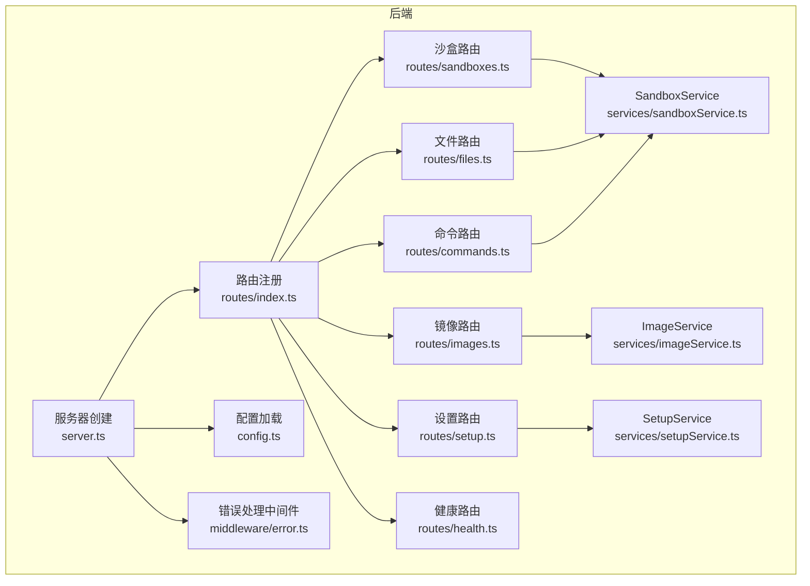
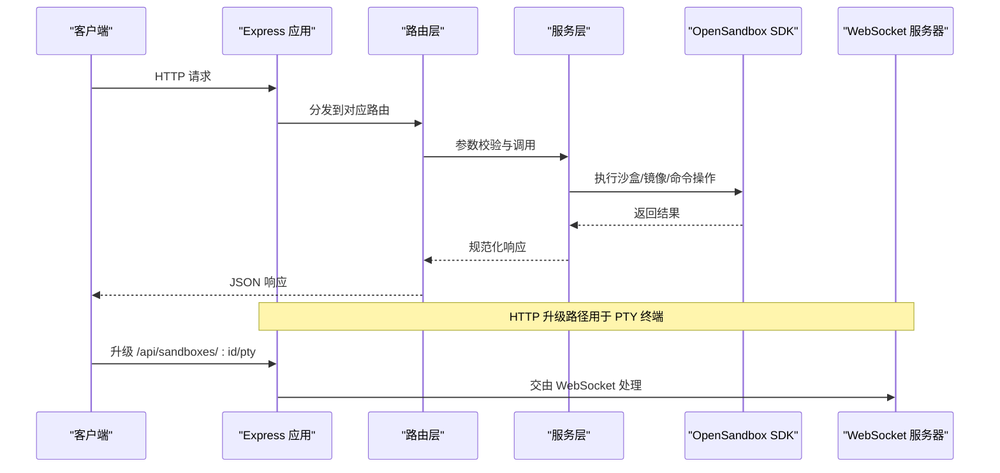
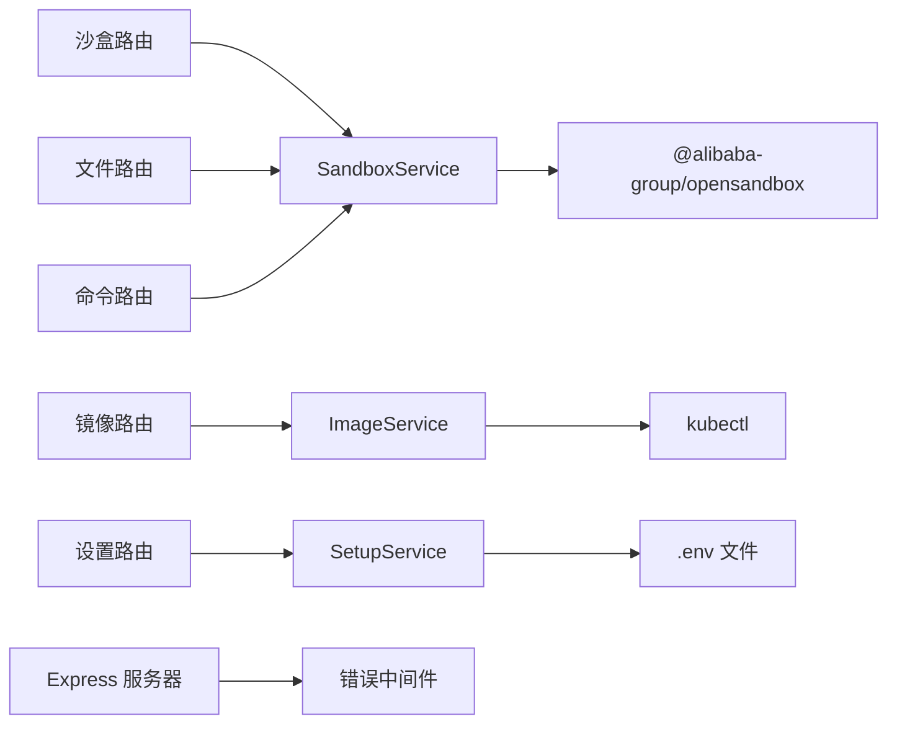

# REST API

<cite>
**本文引用的文件**
- [apps/backend/src/routes/index.ts](file://apps/backend/src/routes/index.ts)
- [apps/backend/src/routes/sandboxes.ts](file://apps/backend/src/routes/sandboxes.ts)
- [apps/backend/src/routes/files.ts](file://apps/backend/src/routes/files.ts)
- [apps/backend/src/routes/commands.ts](file://apps/backend/src/routes/commands.ts)
- [apps/backend/src/routes/setup.ts](file://apps/backend/src/routes/setup.ts)
- [apps/backend/src/routes/health.ts](file://apps/backend/src/routes/health.ts)
- [apps/backend/src/routes/images.ts](file://apps/backend/src/routes/images.ts)
- [apps/backend/src/services/sandboxService.ts](file://apps/backend/src/services/sandboxService.ts)
- [apps/backend/src/services/imageService.ts](file://apps/backend/src/services/imageService.ts)
- [apps/backend/src/services/setupService.ts](file://apps/backend/src/services/setupService.ts)
- [apps/backend/src/types/index.ts](file://apps/backend/src/types/index.ts)
- [apps/backend/src/config.ts](file://apps/backend/src/config.ts)
- [apps/backend/src/server.ts](file://apps/backend/src/server.ts)
- [apps/backend/src/middleware/error.ts](file://apps/backend/src/middleware/error.ts)
- [apps/backend/src/websocket/connectionManager.ts](file://apps/backend/src/websocket/connectionManager.ts)
- [apps/backend/src/websocket/ptyRelay.ts](file://apps/backend/src/websocket/ptyRelay.ts)
- [apps/backend/src/utils/runCommand.ts](file://apps/backend/src/utils/runCommand.ts)
- [apps/backend/package.json](file://apps/backend/package.json)
- [README.md](file://README.md)
</cite>

## 目录
1. [简介](#简介)
2. [项目结构](#项目结构)
3. [核心组件](#核心组件)
4. [架构总览](#架构总览)
5. [详细组件分析](#详细组件分析)
6. [依赖关系分析](#依赖关系分析)
7. [性能考量](#性能考量)
8. [故障排查指南](#故障排查指南)
9. [结论](#结论)
10. [附录](#附录)

## 简介
本文件为 Sandbox Manager 后端 REST API 的权威参考文档，覆盖沙盒管理、文件操作、命令执行、镜像管理与设置向导等全部 HTTP 接口。文档逐项给出端点的 HTTP 方法、URL 模式、请求参数、请求体结构、响应格式、状态码、错误处理机制、认证要求、参数校验规则、业务约束与性能建议，并提供常见用例与最佳实践。

## 项目结构
后端采用 Express + TypeScript 构建，路由按功能模块拆分，服务层封装 OpenSandbox SDK 并提供缓存与连接管理；WebSocket 用于 PTY 终端透传；全局错误中间件统一处理异常与返回格式。

图表来源
- [apps/backend/src/routes/index.ts:8-16](file://apps/backend/src/routes/index.ts#L8-L16)
- [apps/backend/src/server.ts:36-90](file://apps/backend/src/server.ts#L36-L90)
- [apps/backend/src/services/sandboxService.ts:11-47](file://apps/backend/src/services/sandboxService.ts#L11-L47)
- [apps/backend/src/services/imageService.ts:95-100](file://apps/backend/src/services/imageService.ts#L95-L100)
- [apps/backend/src/services/setupService.ts:58-66](file://apps/backend/src/services/setupService.ts#L58-L66)

章节来源
- [apps/backend/src/routes/index.ts:8-16](file://apps/backend/src/routes/index.ts#L8-L16)
- [apps/backend/src/server.ts:36-90](file://apps/backend/src/server.ts#L36-L90)
- [README.md:114-140](file://README.md#L114-L140)

## 核心组件
- 路由层：按模块划分，统一挂载至 /api 前缀，包含沙盒、文件、命令、镜像、设置与健康检查。
- 服务层：
  - SandboxService：封装 OpenSandbox SDK，负责沙盒生命周期、连接缓存与 execd 代理 URL 解析。
  - ImageService：基于 kubectl 与 DaemonSet 预拉取镜像，查询状态与节点缓存。
  - SetupService：保存/测试远程连接，生成本地/远程配置。
- 类型系统：统一 ApiResponse 结构与各端点请求体接口，确保前后端契约一致。
- 错误处理：统一错误分类与 HTTP 映射，保证错误响应一致性。

章节来源
- [apps/backend/src/services/sandboxService.ts:11-47](file://apps/backend/src/services/sandboxService.ts#L11-L47)
- [apps/backend/src/services/imageService.ts:95-100](file://apps/backend/src/services/imageService.ts#L95-L100)
- [apps/backend/src/services/setupService.ts:58-66](file://apps/backend/src/services/setupService.ts#L58-L66)
- [apps/backend/src/types/index.ts:3-11](file://apps/backend/src/types/index.ts#L3-L11)

## 架构总览
后端通过 Express 提供 REST API，同时在升级路径中建立 PTY WebSocket，实现终端二进制帧透传。路由层仅负责编排与参数校验，业务逻辑下沉至服务层；错误统一由中间件处理。

图表来源
- [apps/backend/src/server.ts:63-87](file://apps/backend/src/server.ts#L63-L87)
- [apps/backend/src/websocket/ptyRelay.ts:40-118](file://apps/backend/src/websocket/ptyRelay.ts#L40-L118)
- [apps/backend/src/routes/sandboxes.ts:57-59](file://apps/backend/src/routes/sandboxes.ts#L57-L59)

## 详细组件分析

### 健康检查 API
- 端点
  - 方法：GET
  - 路径：/api/health
- 行为
  - 未配置：返回 configured=false，opensandboxReady=false
  - 已配置：尝试调用 SDK 列表接口探测连通性，返回 opensandboxReady=true/false
- 响应
  - 成功：success=true，data 包含 status、configured、opensandboxReady、timestamp、uptime
- 状态码
  - 200 OK
- 认证
  - 无需认证
- 参数与校验
  - 无
- 性能与约束
  - 仅做轻量探测，避免阻塞
- 示例
  - 请求：GET /api/health
  - 响应：见“响应格式”小节

章节来源
- [apps/backend/src/routes/health.ts:6-51](file://apps/backend/src/routes/health.ts#L6-L51)

### 沙盒管理 API
- 前缀：/api/sandboxes
- 子前缀：/:sandboxId/（下述端点均以此为父路径）

1) 列出沙盒
- 方法：GET
- 路径：/api/sandboxes
- 查询参数
  - state：字符串或数组，过滤状态
  - page/pageSize：分页
- 响应
  - data.items：标准化后的沙盒列表（过滤过期项），字段包括 id、name、image、status、statusDetail、createdAt、expiresAt、entrypoint、metadata、env
  - data.pagination：分页信息
- 状态码
  - 200 OK
  - 503 Service Unavailable（未配置 OpenSandbox）
- 认证
  - 无需认证
- 参数与校验
  - state 支持单值或多值；page/pageSize 转换为数字
- 业务约束
  - 自动过滤已过期沙盒
- 性能与约束
  - 使用 SDK 列表接口，注意分页参数
- 示例
  - 请求：GET /api/sandboxes?page=1&pageSize=20&state=running
  - 响应：见“响应格式”小节

2) 创建沙盒
- 方法：POST
- 路径：/api/sandboxes
- 请求体
  - image：必需，镜像名称
  - name、timeoutSeconds、env、metadata、resource、networkPolicy：可选
- 响应
  - data：标准化后的新建沙盒信息
- 状态码
  - 202 Accepted
  - 400 Bad Request（参数缺失）
  - 503 Service Unavailable（未配置 OpenSandbox）
- 认证
  - 无需认证
- 参数与校验
  - image 必填；timeoutSeconds 默认值由服务层设定
- 业务约束
  - 创建成功后加入连接缓存
- 性能与约束
  - 创建过程可能较慢，建议客户端以异步轮询或 SSE 监听后续流程
- 示例
  - 请求：POST /api/sandboxes
  - 响应：见“响应格式”小节

3) 获取沙盒详情
- 方法：GET
- 路径：/api/sandboxes/:sandboxId
- 响应
  - data：标准化后的沙盒信息
- 状态码
  - 200 OK
  - 404 Not Found（不存在）
- 认证
  - 无需认证
- 参数与校验
  - :sandboxId 必填
- 业务约束
  - 无
- 性能与约束
  - 通过缓存连接减少重复握手
- 示例
  - 请求：GET /api/sandboxes/{sandboxId}
  - 响应：见“响应格式”小节

4) 删除沙盒
- 方法：DELETE
- 路径：/api/sandboxes/:sandboxId
- 响应
  - 204 No Content
- 状态码
  - 204 No Content
  - 404 Not Found（不存在）
- 认证
  - 无需认证
- 参数与校验
  - :sandboxId 必填
- 业务约束
  - 清除缓存中的连接实例
- 性能与约束
  - 异步终止，立即返回
- 示例
  - 请求：DELETE /api/sandboxes/{sandboxId}
  - 响应：204 No Content

5) 暂停沙盒
- 方法：POST
- 路径：/api/sandboxes/:sandboxId/pause
- 响应
  - success=true
- 状态码
  - 200 OK
  - 404 Not Found（不存在）
- 认证
  - 无需认证
- 参数与校验
  - :sandboxId 必填
- 业务约束
  - 清除缓存中的连接实例
- 性能与约束
  - 无额外 IO
- 示例
  - 请求：POST /api/sandboxes/{sandboxId}/pause
  - 响应：见“响应格式”小节

6) 恢复沙盒
- 方法：POST
- 路径：/api/sandboxes/:sandboxId/resume
- 响应
  - success=true
- 状态码
  - 200 OK
  - 404 Not Found（不存在）
- 认证
  - 无需认证
- 参数与校验
  - :sandboxId 必填
- 业务约束
  - 清除缓存中的连接实例
- 性能与约束
  - 无额外 IO
- 示例
  - 请求：POST /api/sandboxes/{sandboxId}/resume
  - 响应：见“响应格式”小节

7) 获取沙盒端点 URL
- 方法：GET
- 路径：/api/sandboxes/:sandboxId/endpoints/:port
- 查询参数
  - :port：端口号（字符串形式）
- 响应
  - data.url：端点完整 URL
  - data.scheme/host/port：根据 URL 推断
- 状态码
  - 200 OK
  - 404 Not Found（不存在）
- 认证
  - 无需认证
- 参数与校验
  - :sandboxId、:port 必填；:port 转换为数字
- 业务约束
  - 无
- 性能与约束
  - 无
- 示例
  - 请求：GET /api/sandboxes/{sandboxId}/endpoints/8080
  - 响应：见“响应格式”小节

章节来源
- [apps/backend/src/routes/sandboxes.ts:62-175](file://apps/backend/src/routes/sandboxes.ts#L62-L175)
- [apps/backend/src/services/sandboxService.ts:112-138](file://apps/backend/src/services/sandboxService.ts#L112-L138)

### 文件操作 API
- 前缀：/api/sandboxes/:sandboxId/files

1) 列目录
- 方法：GET
- 路径：/api/sandboxes/:sandboxId/files
- 查询参数
  - path：目录路径，默认 "/"
- 响应
  - data：条目数组，包含 name、path、isDir、size、modTime
- 状态码
  - 200 OK
  - 400 Bad Request（SDK 搜索失败回退 ls 仍失败）
- 认证
  - 无需认证
- 参数与校验
  - :sandboxId 必填；path 默认根目录
- 业务约束
  - 优先使用 SDK search 递归搜索，再回退 ls -1Ap
- 性能与约束
  - search 结果需过滤直接子项，避免深度遍历
- 示例
  - 请求：GET /api/sandboxes/{sandboxId}/files?path=/home
  - 响应：见“响应格式”小节

2) 读取文本文件内容
- 方法：GET
- 路径：/api/sandboxes/:sandboxId/files/content
- 查询参数
  - path：必需，文件绝对路径
- 响应
  - 文本内容（text/plain）
- 状态码
  - 200 OK
  - 400 Bad Request（缺少 path 或是目录）
- 认证
  - 无需认证
- 参数与校验
  - path 必填且必须为文件
- 业务约束
  - 不允许读取目录
- 性能与约束
  - 适合小文件；大文件建议下载二进制流
- 示例
  - 请求：GET /api/sandboxes/{sandboxId}/files/content?path=/app/startup.sh
  - 响应：文本内容

3) 下载文件（二进制）
- 方法：GET
- 路径：/api/sandboxes/:sandboxId/files/download
- 查询参数
  - path：必需，文件绝对路径
- 响应
  - 二进制流（application/octet-stream）
- 状态码
  - 200 OK
  - 400 Bad Request（缺少 path 或是目录）
- 认证
  - 无需认证
- 参数与校验
  - path 必填且必须为文件
- 业务约束
  - 不允许读取目录
- 性能与约束
  - 适合大文件下载
- 示例
  - 请求：GET /api/sandboxes/{sandboxId}/files/download?path=/app/data.zip
  - 响应：二进制流

4) 写入文件
- 方法：POST
- 路径：/api/sandboxes/:sandboxId/files/write
- 请求体
  - path：必需
  - content：必需（字符串）
  - mode：可选
- 响应
  - success=true
- 状态码
  - 200 OK
  - 400 Bad Request（缺少字段）
- 认证
  - 无需认证
- 参数与校验
  - path、content 必填
- 业务约束
  - 无
- 性能与约束
  - 单文件写入
- 示例
  - 请求：POST /api/sandboxes/{sandboxId}/files/write
  - 响应：见“响应格式”小节

5) 创建目录
- 方法：POST
- 路径：/api/sandboxes/:sandboxId/files/mkdir
- 请求体
  - paths：必需（字符串数组）
  - mode：可选
- 响应
  - success=true
- 状态码
  - 200 OK
  - 400 Bad Request（缺少 paths）
- 认证
  - 无需认证
- 参数与校验
  - paths 必须非空
- 业务约束
  - 无
- 性能与约束
  - 批量创建目录
- 示例
  - 请求：POST /api/sandboxes/{sandboxId}/files/mkdir
  - 响应：见“响应格式”小节

6) 移动/重命名文件
- 方法：POST
- 路径：/api/sandboxes/:sandboxId/files/move
- 请求体
  - entries：必需（数组，每项包含 src、dest）
- 响应
  - success=true
- 状态码
  - 200 OK
  - 400 Bad Request（缺少 entries）
- 认证
  - 无需认证
- 参数与校验
  - entries 必须非空
- 业务约束
  - 无
- 性能与约束
  - 批量移动
- 示例
  - 请求：POST /api/sandboxes/{sandboxId}/files/move
  - 响应：见“响应格式”小节

7) 删除文件
- 方法：DELETE
- 路径：/api/sandboxes/:sandboxId/files/files
- 查询参数
  - path：必需（字符串或数组）
- 响应
  - 204 No Content
- 状态码
  - 204 No Content
  - 400 Bad Request（缺少 path）
- 认证
  - 无需认证
- 参数与校验
  - path 必须非空
- 业务约束
  - 无
- 性能与约束
  - 无
- 示例
  - 请求：DELETE /api/sandboxes/{sandboxId}/files/files?path=/tmp/log.txt
  - 响应：204 No Content

8) 删除目录
- 方法：DELETE
- 路径：/api/sandboxes/:sandboxId/files/directories
- 查询参数
  - path：必需（字符串或数组）
- 响应
  - 204 No Content
- 状态码
  - 204 No Content
  - 400 Bad Request（缺少 path）
- 认证
  - 无需认证
- 参数与校验
  - path 必须非空
- 业务约束
  - 无
- 性能与约束
  - 无
- 示例
  - 请求：DELETE /api/sandboxes/{sandboxId}/files/directories?path=/tmp/cache
  - 响应：204 No Content

章节来源
- [apps/backend/src/routes/files.ts:19-327](file://apps/backend/src/routes/files.ts#L19-L327)

### 命令执行 API
- 前缀：/api/sandboxes/:sandboxId/commands

1) 执行命令（聚合响应）
- 方法：POST
- 路径：/api/sandboxes/:sandboxId/commands
- 请求体
  - command：必需
  - cwd、timeoutSeconds、envs：可选
- 响应
  - data：命令执行结果（stdout、stderr、exitCode、logs 等）
- 状态码
  - 200 OK
  - 400 Bad Request（缺少 command）
- 认证
  - 无需认证
- 参数与校验
  - command 必填
- 业务约束
  - 无
- 性能与约束
  - 受超时限制；建议长任务配合会话
- 示例
  - 请求：POST /api/sandboxes/{sandboxId}/commands
  - 响应：见“响应格式”小节

2) 创建 Bash 会话
- 方法：POST
- 路径：/api/sandboxes/:sandboxId/commands/session
- 请求体
  - workingDirectory：可选
- 响应
  - data.sessionId
- 状态码
  - 200 OK
- 认证
  - 无需认证
- 参数与校验
  - 无强制必填
- 业务约束
  - 无
- 性能与约束
  - 无
- 示例
  - 请求：POST /api/sandboxes/{sandboxId}/commands/session
  - 响应：见“响应格式”小节

3) 在会话中运行命令
- 方法：POST
- 路径：/api/sandboxes/:sandboxId/commands/session/:sessionId/run
- 请求体
  - command：必需
  - cwd、timeoutSeconds：可选
- 响应
  - data：命令执行结果
- 状态码
  - 200 OK
  - 400 Bad Request（缺少 command）
- 认证
  - 无需认证
- 参数与校验
  - command 必填
- 业务约束
  - 无
- 性能与约束
  - 无
- 示例
  - 请求：POST /api/sandboxes/{sandboxId}/commands/session/{sessionId}/run
  - 响应：见“响应格式”小节

4) 删除会话
- 方法：DELETE
- 路径：/api/sandboxes/:sandboxId/commands/session/:sessionId
- 响应
  - 204 No Content
- 状态码
  - 204 No Content
- 认证
  - 无需认证
- 参数与校验
  - :sessionId 必填
- 业务约束
  - 无
- 性能与约束
  - 无
- 示例
  - 请求：DELETE /api/sandboxes/{sandboxId}/commands/session/{sessionId}
  - 响应：204 No Content

章节来源
- [apps/backend/src/routes/commands.ts:12-95](file://apps/backend/src/routes/commands.ts#L12-L95)

### 镜像管理 API
- 前缀：/api/images

1) 列出缓存镜像（节点维度）
- 方法：GET
- 路径：/api/images/cached
- 响应
  - data：缓存在各节点的镜像列表（image、node、sizeBytes）
- 状态码
  - 200 OK
- 认证
  - 无需认证
- 参数与校验
  - 无
- 业务约束
  - 无
- 性能与约束
  - 依赖 kubectl 列表节点镜像
- 示例
  - 请求：GET /api/images/cached
  - 响应：见“响应格式”小节

2) 列出预拉取镜像
- 方法：GET
- 路径：/api/images
- 响应
  - data：预拉取镜像列表（name、image、status、daemonSetName、createdAt、nodesReady/nodesTotal、message）
- 状态码
  - 200 OK
- 认证
  - 无需认证
- 参数与校验
  - 无
- 业务约束
  - 无
- 性能与约束
  - 依赖 kubectl 列表 DaemonSet
- 示例
  - 请求：GET /api/images
  - 响应：见“响应格式”小节

3) 拉取镜像（预缓存）
- 方法：POST
- 路径：/api/images
- 请求体
  - image：必需（去空白）
- 响应
  - data：镜像信息（初始状态为 pulling）
- 状态码
  - 202 Accepted
  - 400 Bad Request（image 为空）
- 认证
  - 无需认证
- 参数与校验
  - image 必填且去除首尾空白
- 业务约束
  - 通过 DaemonSet 在节点上预拉取
- 性能与约束
  - 创建 DaemonSet 后立即返回 202
- 示例
  - 请求：POST /api/images
  - 响应：见“响应格式”小节

4) 查询镜像拉取状态
- 方法：GET
- 路径：/api/images/:name/status
- 响应
  - data：镜像状态（解析 DaemonSet 与 Pod 错误）
- 状态码
  - 200 OK
  - 404 Not Found（找不到 DaemonSet）
- 认证
  - 无需认证
- 参数与校验
  - :name 必填
- 业务约束
  - 无
- 性能与约束
  - 无
- 示例
  - 请求：GET /api/images/{name}/status
  - 响应：见“响应格式”小节

5) 删除预拉取镜像
- 方法：DELETE
- 路径：/api/images/:name
- 响应
  - 204 No Content
- 状态码
  - 204 No Content
  - 404 Not Found（找不到 DaemonSet）
- 认证
  - 无需认证
- 参数与校验
  - :name 必填
- 业务约束
  - 无
- 性能与约束
  - 无
- 示例
  - 请求：DELETE /api/images/{name}
  - 响应：204 No Content

章节来源
- [apps/backend/src/routes/images.ts:14-78](file://apps/backend/src/routes/images.ts#L14-L78)
- [apps/backend/src/services/imageService.ts:196-340](file://apps/backend/src/services/imageService.ts#L196-L340)

### 设置向导 API
- 前缀：/api/setup

1) 获取设置状态
- 方法：GET
- 路径：/api/setup/status
- 响应
  - data：configured、k8sMode、osbServerUrl
- 状态码
  - 200 OK
- 认证
  - 无需认证
- 参数与校验
  - 无
- 业务约束
  - 无
- 性能与约束
  - 无
- 示例
  - 请求：GET /api/setup/status
  - 响应：见“响应格式”小节

2) 测试远程连接
- 方法：POST
- 路径：/api/setup/test-connection
- 请求体
  - serverUrl：必需
  - apiKey：可选
  - protocol：可选，默认 http
- 响应
  - data.connected、data.error（可选）
- 状态码
  - 200 OK
  - 400 Bad Request（缺少 serverUrl）
- 认证
  - 无需认证
- 参数与校验
  - serverUrl 必填
- 业务约束
  - 无
- 性能与约束
  - 10 秒超时
- 示例
  - 请求：POST /api/setup/test-connection
  - 响应：见“响应格式”小节

3) 保存远程配置
- 方法：POST
- 路径：/api/setup/remote
- 请求体
  - serverUrl、apiKey、protocol：必需
- 响应
  - data.configured=true
- 状态码
  - 200 OK
  - 500 Internal Server Error（保存失败）
- 认证
  - 无需认证
- 参数与校验
  - serverUrl、apiKey 必填
- 业务约束
  - 更新 .env 并重新初始化服务
- 性能与约束
  - 无
- 示例
  - 请求：POST /api/setup/remote
  - 响应：见“响应格式”小节

4) 本地 K8s 设置（SSE 流）
- 方法：GET
- 路径：/api/setup/local-k8s/stream
- 响应
  - 事件流：progress（进度）、done（成功）、error（错误）
- 状态码
  - 200 OK（SSE）
  - 409 Conflict（已有设置进行中）
- 认证
  - 无需认证
- 参数与校验
  - 无
- 业务约束
  - 并发保护；断开连接时如未成功则停止端口转发
- 性能与约束
  - 无
- 示例
  - 请求：GET /api/setup/local-k8s/stream
  - 响应：SSE 事件流

5) 完成本地设置
- 方法：POST
- 路径：/api/setup/complete
- 响应
  - data.configured=true
- 状态码
  - 200 OK
  - 500 Internal Server Error（保存失败）
- 认证
  - 无需认证
- 参数与校验
  - 无
- 业务约束
  - 写入本地默认配置并重新初始化服务
- 性能与约束
  - 无
- 示例
  - 请求：POST /api/setup/complete
  - 响应：见“响应格式”小节

章节来源
- [apps/backend/src/routes/setup.ts:17-139](file://apps/backend/src/routes/setup.ts#L17-L139)
- [apps/backend/src/services/setupService.ts:71-145](file://apps/backend/src/services/setupService.ts#L71-L145)

### WebSocket 终端 API（补充）
- 路径：/api/sandboxes/:sandboxId/pty
- 方法：HTTP 升级（GET）→ WebSocket
- 行为
  - 建立前端 WebSocket，解析 execd 代理 URL，创建后端会话，双向透传二进制帧
- 认证
  - 通过 OpenSandbox API Key 与路由头传递
- 参数与校验
  - :sandboxId 必填
- 业务约束
  - 未配置 OpenSandbox 时拒绝
- 性能与约束
  - 二进制帧透传，透明中继；空闲超时由配置控制
- 示例
  - 请求：GET /api/sandboxes/{sandboxId}/pty（升级为 WS）
  - 响应：WS 握手成功，随后为二进制帧与控制帧

章节来源
- [apps/backend/src/server.ts:75-87](file://apps/backend/src/server.ts#L75-L87)
- [apps/backend/src/websocket/ptyRelay.ts:40-118](file://apps/backend/src/websocket/ptyRelay.ts#L40-L118)
- [apps/backend/src/websocket/connectionManager.ts:18-100](file://apps/backend/src/websocket/connectionManager.ts#L18-L100)

## 依赖关系分析
- 路由依赖服务层：沙盒、文件、命令、镜像、设置路由均通过 app.locals 注入的服务对象访问业务能力。
- 服务层依赖 SDK 与外部工具：SandboxService 依赖 OpenSandbox SDK；ImageService 依赖 kubectl；runCommand 提供命令执行能力。
- 中间件依赖日志：错误中间件依赖 pino 日志器输出统一错误日志。
- 版本与兼容性：后端版本号在包配置中声明，当前未发现显式的 API 版本头或路径版本段，建议客户端通过语义化版本与变更日志跟踪兼容性。

图表来源
- [apps/backend/src/server.ts:50-56](file://apps/backend/src/server.ts#L50-L56)
- [apps/backend/src/services/sandboxService.ts:31-33](file://apps/backend/src/services/sandboxService.ts#L31-L33)
- [apps/backend/src/services/imageService.ts:105-115](file://apps/backend/src/services/imageService.ts#L105-L115)
- [apps/backend/src/services/setupService.ts:108-123](file://apps/backend/src/services/setupService.ts#L108-L123)
- [apps/backend/package.json:11-21](file://apps/backend/package.json#L11-L21)

章节来源
- [apps/backend/src/server.ts:50-56](file://apps/backend/src/server.ts#L50-L56)
- [apps/backend/src/services/sandboxService.ts:31-33](file://apps/backend/src/services/sandboxService.ts#L31-L33)
- [apps/backend/src/services/imageService.ts:105-115](file://apps/backend/src/services/imageService.ts#L105-L115)
- [apps/backend/src/services/setupService.ts:108-123](file://apps/backend/src/services/setupService.ts#L108-L123)
- [apps/backend/package.json:11-21](file://apps/backend/package.json#L11-L21)

## 性能考量
- 连接缓存：SandboxService 使用 LRU 缓存连接，降低重复握手成本。
- 超时控制：配置项 OPENSANDBOX_REQUEST_TIMEOUT_SECONDS 控制 SDK 请求超时。
- PTY 空闲：PTY_IDLE_TIMEOUT_MS 控制空闲连接清理，避免资源泄露。
- 文件列举：优先使用 SDK search，失败回退 ls -1Ap，限制输出行数以避免过大响应。
- 命令执行：建议对长任务使用会话方式，避免一次性阻塞。
- 镜像拉取：DaemonSet 预热，避免首次访问延迟。

章节来源
- [apps/backend/src/services/sandboxService.ts:35-44](file://apps/backend/src/services/sandboxService.ts#L35-L44)
- [apps/backend/src/config.ts:61-68](file://apps/backend/src/config.ts#L61-L68)
- [apps/backend/src/websocket/connectionManager.ts:92-100](file://apps/backend/src/websocket/connectionManager.ts#L92-L100)
- [apps/backend/src/routes/files.ts:213-313](file://apps/backend/src/routes/files.ts#L213-L313)

## 故障排查指南
- 常见错误分类与映射
  - SDK 异常：映射为 502 Bad Gateway
  - 超时异常：映射为 504 Gateway Timeout
  - 参数非法：映射为 400 Bad Request
  - 其他：映射为 500 Internal Server Error
- 错误响应结构
  - success=false
  - error.code：HTTP_XXX 或具体异常类名
  - error.message：错误描述
  - error.requestId：请求唯一标识
- 建议排查步骤
  - 检查 /api/health 状态与 OpenSandbox 连通性
  - 查看后端日志（pino 输出）定位异常
  - 对于文件/命令/镜像操作，确认路径与权限
  - 对于镜像拉取，检查 DaemonSet 与 Pod 状态

章节来源
- [apps/backend/src/middleware/error.ts:33-47](file://apps/backend/src/middleware/error.ts#L33-L47)
- [apps/backend/src/routes/health.ts:6-51](file://apps/backend/src/routes/health.ts#L6-L51)

## 结论
本文档系统梳理了 Sandbox Manager 的 REST API，覆盖沙盒、文件、命令、镜像与设置向导的完整接口规范。通过统一的响应结构、严格的参数校验与完善的错误处理，确保接口稳定可靠。建议客户端遵循幂等性与超时策略，在长任务场景使用会话与 SSE 流，以获得更好的用户体验。

## 附录

### 响应格式与通用结构
- 成功响应
  - success: true
  - data: 具体数据（视端点而定）
- 失败响应
  - success: false
  - error: { code, message, requestId? }

章节来源
- [apps/backend/src/types/index.ts:3-11](file://apps/backend/src/types/index.ts#L3-L11)

### 认证与安全
- 当前路由未内置鉴权中间件，OpenSandbox API Key 通过头部或路由头传递给后端，再由后端转发至 SDK。
- 建议在网关或反向代理层增加认证与速率限制。

章节来源
- [apps/backend/src/websocket/ptyRelay.ts:97-105](file://apps/backend/src/websocket/ptyRelay.ts#L97-L105)

### API 版本控制与兼容性
- 后端版本号：参见包配置
- API 版本：未发现显式版本头或路径版本段
- 建议：客户端通过语义化版本与变更日志跟踪兼容性；后端如需演进，建议引入路径版本（如 /api/v1/...）以保障向后兼容

章节来源
- [apps/backend/package.json:3-4](file://apps/backend/package.json#L3-L4)

### 常见用例与最佳实践
- 创建并进入沙盒
  - POST /api/sandboxes（image 必填）
  - GET /api/sandboxes/{id}（确认状态）
  - GET /api/sandboxes/{id}/endpoints/{port}（获取访问地址）
- 文件管理
  - GET /api/sandboxes/{id}/files?path=/app
  - POST /api/sandboxes/{id}/files/write（写入配置）
  - GET /api/sandboxes/{id}/files/download?path=/app/data.zip（下载）
- 命令执行
  - POST /api/sandboxes/{id}/commands（一次性命令）
  - POST /api/sandboxes/{id}/commands/session（创建会话）
  - POST /api/sandboxes/{id}/commands/session/{sid}/run（在会话中执行）
- 镜像管理
  - POST /api/images（拉取镜像）
  - GET /api/images（查看预拉取列表）
  - GET /api/images/{name}/status（查看状态）
- 设置向导
  - GET /api/setup/status（查看状态）
  - POST /api/setup/test-connection（测试连接）
  - POST /api/setup/remote（保存远程配置）
  - GET /api/setup/local-k8s/stream（SSE 流）
  - POST /api/setup/complete（完成本地设置）