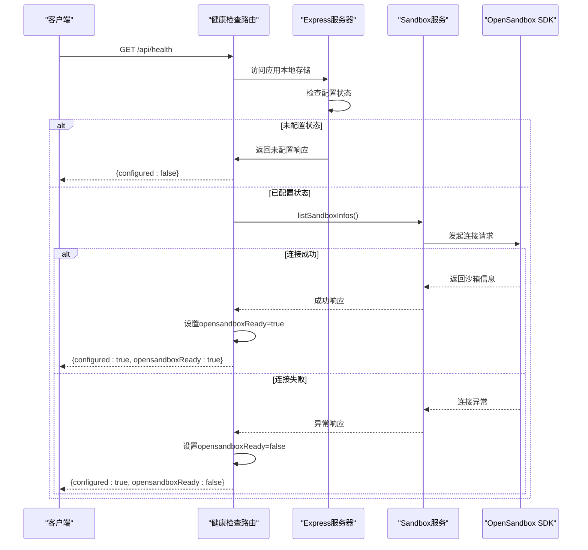
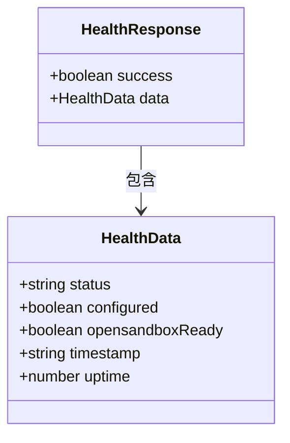
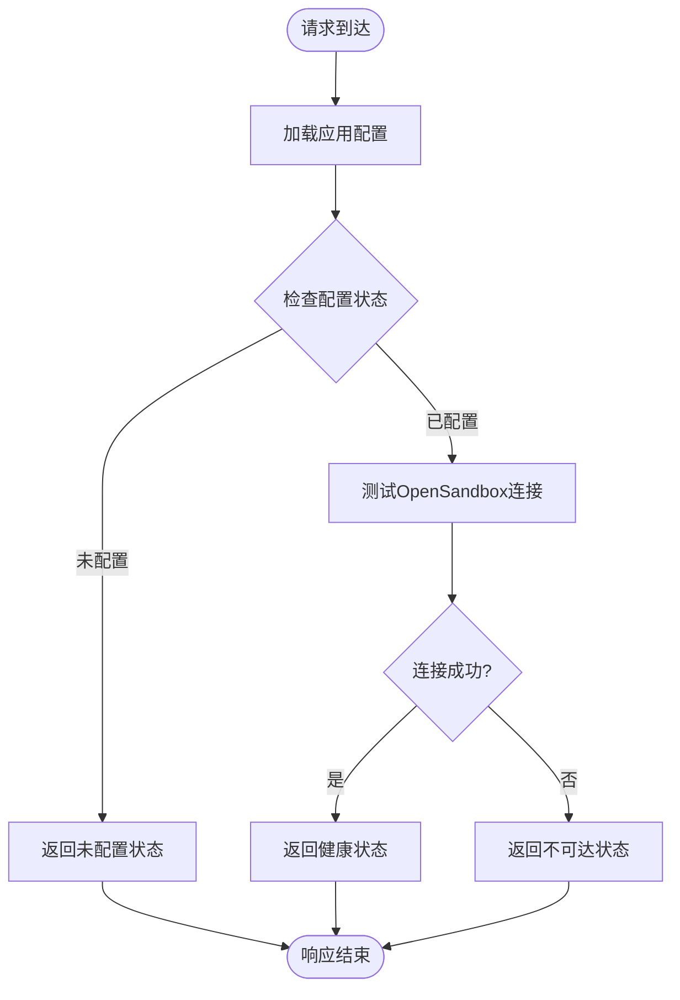
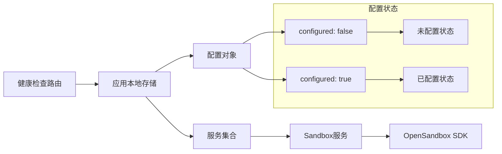
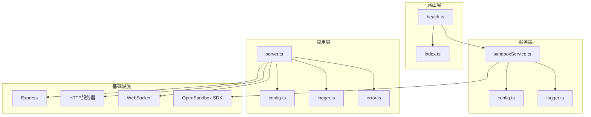

# 健康检查API

<cite>
**本文档引用的文件**
- [health.ts](file://apps/backend/src/routes/health.ts)
- [index.ts](file://apps/backend/src/routes/index.ts)
- [server.ts](file://apps/backend/src/server.ts)
- [config.ts](file://apps/backend/src/config.ts)
- [sandboxService.ts](file://apps/backend/src/services/sandboxService.ts)
- [logger.ts](file://apps/backend/src/logger.ts)
- [index.ts](file://apps/backend/src/index.ts)
- [README.md](file://README.md)
</cite>

## 目录
1. [简介](#简介)
2. [项目结构](#项目结构)
3. [核心组件](#核心组件)
4. [架构概览](#架构概览)
5. [详细组件分析](#详细组件分析)
6. [依赖关系分析](#依赖关系分析)
7. [性能考虑](#性能考虑)
8. [故障排除指南](#故障排除指南)
9. [最佳实践](#最佳实践)
10. [结论](#结论)

## 简介

健康检查API是Sandbox Manager平台的重要监控组件，用于实时评估系统的运行状态和可用性。该API提供两个核心端点：应用健康检查（GET /api/health）和数据库连接检查（GET /api/health/db），帮助运维团队快速识别系统问题并进行故障诊断。

Sandbox Manager是一个基于OpenSandbox的Kubernetes AI沙箱管理平台，通过Web界面创建、管理和隔离沙箱环境。健康检查API确保系统在各种部署环境中都能提供可靠的运行状态信息。

## 项目结构

健康检查功能在项目中的组织结构如下：

```mermaid
graph TB
subgraph "后端应用结构"
A[apps/backend/src/] --> B[routes/]
A --> C[services/]
A --> D[middleware/]
A --> E[config.ts]
A --> F[server.ts]
A --> G[index.ts]
B --> H[health.ts - 健康检查路由]
B --> I[index.ts - 路由注册]
C --> J[sandboxService.ts - 沙箱服务]
C --> K[imageService.ts - 镜像服务]
C --> L[infraRunner.ts - 基础设施运行器]
D --> M[error.ts - 错误处理]
F --> N[WebSocket连接管理]
F --> O[HTTP服务器创建]
end
subgraph "外部依赖"
P[OpenSandbox SDK]
Q[Express框架]
R[Node.js HTTP服务器]
S[WebSocket(ws)]
end
H --> J
J --> P
F --> Q
F --> R
F --> S
```

**图表来源**
- [health.ts:1-52](file://apps/backend/src/routes/health.ts#L1-L52)
- [server.ts:1-119](file://apps/backend/src/server.ts#L1-L119)
- [index.ts:1-66](file://apps/backend/src/index.ts#L1-L66)

**章节来源**
- [health.ts:1-52](file://apps/backend/src/routes/health.ts#L1-L52)
- [index.ts:1-18](file://apps/backend/src/routes/index.ts#L1-L18)
- [server.ts:1-119](file://apps/backend/src/server.ts#L1-L119)

## 核心组件

健康检查API的核心组件包括：

### 健康检查路由模块
- **文件路径**: `apps/backend/src/routes/health.ts`
- **功能**: 提供应用健康状态检查的HTTP端点
- **路由前缀**: `/api/health`
- **支持方法**: GET

### 应用服务层
- **文件路径**: `apps/backend/src/services/sandboxService.ts`
- **功能**: 管理OpenSandbox连接和沙箱操作
- **关键方法**: `listSandboxInfos()` - 用于健康检查验证

### 配置管理
- **文件路径**: `apps/backend/src/config.ts`
- **功能**: 加载和验证环境变量配置
- **关键配置项**: `configured` - 应用配置状态标志

### 服务器初始化
- **文件路径**: `apps/backend/src/server.ts`
- **功能**: 创建Express应用实例和HTTP服务器
- **服务注入**: 将配置和服务注入到应用本地存储中

**章节来源**
- [health.ts:1-52](file://apps/backend/src/routes/health.ts#L1-L52)
- [sandboxService.ts:1-148](file://apps/backend/src/services/sandboxService.ts#L1-L148)
- [config.ts:1-71](file://apps/backend/src/config.ts#L1-L71)
- [server.ts:1-119](file://apps/backend/src/server.ts#L1-L119)

## 架构概览

健康检查API的架构设计体现了分层架构原则，确保了良好的可维护性和扩展性：



**图表来源**
- [health.ts:6-51](file://apps/backend/src/routes/health.ts#L6-L51)
- [server.ts:50-61](file://apps/backend/src/server.ts#L50-L61)
- [sandboxService.ts:49-56](file://apps/backend/src/services/sandboxService.ts#L49-L56)

## 详细组件分析

### 健康检查端点实现

#### 端点定义
- **HTTP方法**: GET
- **URL模式**: `/api/health`
- **完整路径**: `http://localhost:3000/api/health`

#### 响应格式

健康检查API返回统一的JSON响应格式，包含以下字段：



**图表来源**
- [health.ts:11-20](file://apps/backend/src/routes/health.ts#L11-L20)
- [health.ts:26-37](file://apps/backend/src/routes/health.ts#L26-L37)
- [health.ts:39-50](file://apps/backend/src/routes/health.ts#L39-L50)

#### 响应状态码
- **200 OK**: 健康检查成功执行
- **注意**: 健康检查端点始终返回200状态码，即使系统不健康

#### 响应示例

**未配置状态响应**:
```json
{
  "success": true,
  "data": {
    "status": "ok",
    "configured": false,
    "opensandboxReady": false,
    "timestamp": "2024-01-01T00:00:00.000Z",
    "uptime": 125.5
  }
}
```

**已配置且正常响应**:
```json
{
  "success": true,
  "data": {
    "status": "ok",
    "configured": true,
    "opensandboxReady": true,
    "timestamp": "2024-01-01T00:00:00.000Z",
    "uptime": 125.5
  }
}
```

**已配置但不可达响应**:
```json
{
  "success": true,
  "data": {
    "status": "ok",
    "configured": true,
    "opensandboxReady": false,
    "timestamp": "2024-01-01T00:00:00.000Z",
    "uptime": 125.5
  }
}
```

**章节来源**
- [health.ts:6-51](file://apps/backend/src/routes/health.ts#L6-L51)

### 数据流分析

健康检查的执行流程如下：



**图表来源**
- [health.ts:10-22](file://apps/backend/src/routes/health.ts#L10-L22)
- [health.ts:25-37](file://apps/backend/src/routes/health.ts#L25-L37)
- [health.ts:39-50](file://apps/backend/src/routes/health.ts#L39-L50)

**章节来源**
- [health.ts:1-52](file://apps/backend/src/routes/health.ts#L1-L52)

### 服务依赖关系

健康检查API的服务依赖关系：



**图表来源**
- [server.ts:50-61](file://apps/backend/src/server.ts#L50-L61)
- [config.ts:48-70](file://apps/backend/src/config.ts#L48-L70)

**章节来源**
- [server.ts:15-34](file://apps/backend/src/server.ts#L15-L34)
- [config.ts:1-71](file://apps/backend/src/config.ts#L1-L71)

## 依赖关系分析

健康检查API的依赖关系图展示了各组件之间的交互：



**图表来源**
- [health.ts:1-52](file://apps/backend/src/routes/health.ts#L1-L52)
- [server.ts:1-119](file://apps/backend/src/server.ts#L1-L119)
- [sandboxService.ts:1-148](file://apps/backend/src/services/sandboxService.ts#L1-L148)

**章节来源**
- [index.ts:1-18](file://apps/backend/src/routes/index.ts#L1-L18)
- [server.ts:1-119](file://apps/backend/src/server.ts#L1-L119)

## 性能考虑

### 健康检查性能特征

健康检查API具有以下性能特点：

- **响应时间**: 通常在毫秒级范围内
- **资源消耗**: 极低的CPU和内存占用
- **并发处理**: 支持高并发请求
- **缓存策略**: 无状态设计，无需额外缓存

### 连接测试优化

健康检查通过调用`listSandboxInfos()`方法进行OpenSandbox连接测试：

- **最小化负载**: 使用简单的查询参数（page: 1, pageSize: 1）
- **超时控制**: 依赖OpenSandbox SDK的默认超时设置
- **错误处理**: 异步处理，不影响主请求线程

**章节来源**
- [sandboxService.ts:49-56](file://apps/backend/src/services/sandboxService.ts#L49-L56)

## 故障排除指南

### 常见问题诊断

#### 1. 未配置状态问题
**症状**: `configured: false`
**可能原因**:
- 缺少必要的环境变量配置
- OpenSandbox服务器URL未正确设置
- API密钥未配置

**解决方案**:
- 检查`.env`文件中的配置项
- 验证OpenSandbox服务器可达性
- 确认API密钥有效性

#### 2. OpenSandbox连接失败
**症状**: `opensandboxReady: false`
**可能原因**:
- OpenSandbox服务器宕机
- 网络连接问题
- 认证失败

**解决方案**:
- 检查OpenSandbox服务器状态
- 验证网络连通性
- 重新生成API密钥

#### 3. 健康检查响应异常
**症状**: 健康检查端点返回非预期状态
**可能原因**:
- 服务启动顺序问题
- 配置加载失败
- 依赖服务初始化异常

**解决方案**:
- 检查应用启动日志
- 验证服务依赖关系
- 重启应用服务

### 调试工具和技巧

#### 日志分析
- **日志级别**: 使用`debug`级别获取详细信息
- **关键日志**: 关注配置加载和连接建立日志
- **错误日志**: 检查连接失败和认证错误

#### 网络诊断
- **连通性测试**: 使用`curl`或`wget`测试端点
- **端口检查**: 确认后端端口监听状态
- **代理配置**: 验证反向代理设置

**章节来源**
- [logger.ts:1-17](file://apps/backend/src/logger.ts#L1-L17)
- [index.ts:20-46](file://apps/backend/src/index.ts#L20-L46)

## 最佳实践

### 健康检查配置建议

#### 检查频率建议
- **生产环境**: 每30-60秒检查一次
- **开发环境**: 每10-30秒检查一次
- **高可用场景**: 每15-30秒检查一次

#### 监控集成方式
- **Prometheus**: 配置指标导出和告警规则
- **Grafana**: 创建仪表板可视化健康状态
- **ELK Stack**: 集成日志分析和聚合

#### 告警配置
- **严重级别**: OpenSandbox连接失败
- **警告级别**: 响应时间超过阈值
- **恢复通知**: 系统恢复正常后的通知

### 安全最佳实践

#### 访问控制
- **内部网络访问**: 限制健康检查端点仅允许内部访问
- **认证机制**: 在网关层添加认证和授权
- **IP白名单**: 配置允许访问的IP地址范围

#### 隐私保护
- **敏感信息过滤**: 不在响应中暴露敏感配置信息
- **日志脱敏**: 对日志中的敏感信息进行脱敏处理

### 性能优化建议

#### 缓存策略
- **连接池**: 复用OpenSandbox连接减少开销
- **结果缓存**: 缓存最近的健康检查结果
- **批量检查**: 支持多个端点的批量健康检查

#### 资源管理
- **超时设置**: 合理设置连接超时和响应超时
- **重试机制**: 实现指数退避的重试策略
- **熔断器**: 在故障时快速失败避免雪崩效应

## 结论

健康检查API为Sandbox Manager平台提供了可靠的应用状态监控能力。通过简洁的设计和清晰的响应格式，该API能够有效帮助运维团队快速识别和解决系统问题。

### 主要优势
- **简单易用**: 清晰的API设计和标准化响应格式
- **全面覆盖**: 检测应用配置状态和外部依赖连接
- **高性能**: 低资源消耗和快速响应特性
- **易于集成**: 标准化的接口便于监控系统集成

### 未来改进方向
- **扩展指标**: 添加更多系统指标如内存使用率、CPU负载等
- **自定义检查**: 支持用户自定义健康检查逻辑
- **多环境支持**: 增强对不同部署环境的支持
- **增强日志**: 提供更详细的诊断信息和调试选项

健康检查API作为系统可观测性的基础组件，为Sandbox Manager平台的稳定运行提供了重要保障。通过遵循最佳实践和持续优化，该API将继续为用户提供可靠的健康状态监控服务。