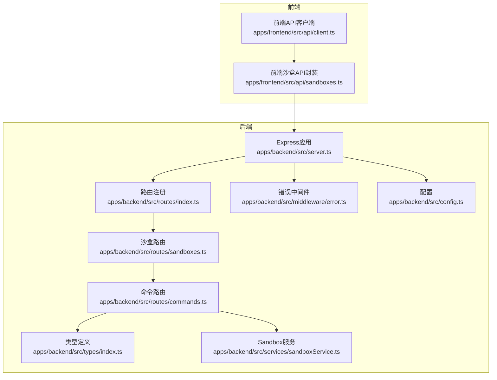
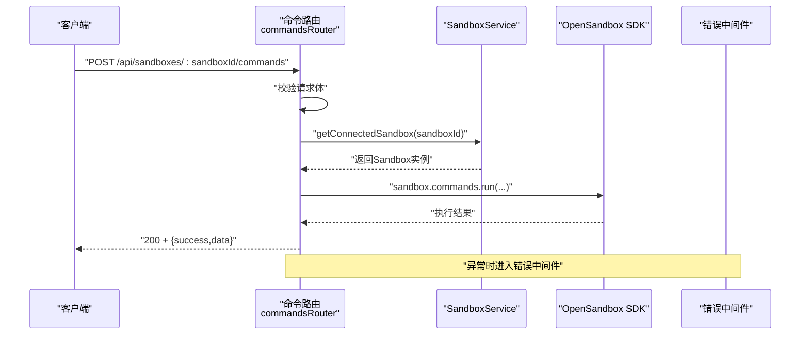
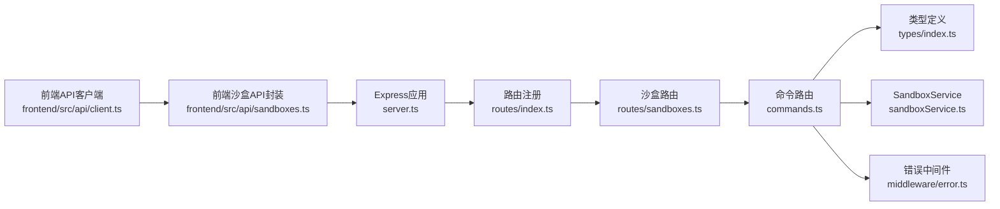

# 命令执行API

<cite>
**本文引用的文件列表**
- [apps/backend/src/routes/commands.ts](file://apps/backend/src/routes/commands.ts)
- [apps/backend/src/services/sandboxService.ts](file://apps/backend/src/services/sandboxService.ts)
- [apps/backend/src/types/index.ts](file://apps/backend/src/types/index.ts)
- [apps/backend/src/middleware/error.ts](file://apps/backend/src/middleware/error.ts)
- [apps/backend/src/server.ts](file://apps/backend/src/server.ts)
- [apps/backend/src/config.ts](file://apps/backend/src/config.ts)
- [apps/backend/src/routes/sandboxes.ts](file://apps/backend/src/routes/sandboxes.ts)
- [apps/backend/src/routes/files.ts](file://apps/backend/src/routes/files.ts)
- [apps/frontend/src/api/client.ts](file://apps/frontend/src/api/client.ts)
- [apps/frontend/src/api/sandboxes.ts](file://apps/frontend/src/api/sandboxes.ts)
</cite>

## 目录
1. [简介](#简介)
2. [项目结构](#项目结构)
3. [核心组件](#核心组件)
4. [架构总览](#架构总览)
5. [详细组件分析](#详细组件分析)
6. [依赖关系分析](#依赖关系分析)
7. [性能考量](#性能考量)
8. [故障排查指南](#故障排查指南)
9. [结论](#结论)
10. [附录：API参考与示例](#附录api参考与示例)

## 简介
本文件为“命令执行API”的权威参考文档，覆盖沙盒内命令执行相关的HTTP端点，包括：
- 执行命令（POST /api/sandboxes/:sandboxId/commands）
- 创建会话（POST /api/sandboxes/:sandboxId/commands/session）
- 在会话中运行命令（POST /api/sandboxes/:sandboxId/commands/session/:sessionId/run）
- 删除会话（DELETE /api/sandboxes/:sandboxId/commands/session/:sessionId）

文档详细说明每个端点的HTTP方法、URL模式、请求参数、请求体结构、响应格式、状态码，并补充安全限制、超时设置、输出流处理与错误处理机制，同时提供使用示例、安全最佳实践与性能优化建议。

## 项目结构
命令执行API位于后端Express应用中，通过路由层暴露REST接口，业务逻辑委托给OpenSandbox SDK进行实际的沙盒命令执行。前端通过统一的API客户端封装调用。

图表来源
- [apps/backend/src/server.ts:36-89](file://apps/backend/src/server.ts#L36-L89)
- [apps/backend/src/routes/index.ts:9-15](file://apps/backend/src/routes/index.ts#L9-L15)
- [apps/backend/src/routes/sandboxes.ts:58-59](file://apps/backend/src/routes/sandboxes.ts#L58-L59)
- [apps/backend/src/routes/commands.ts:6](file://apps/backend/src/routes/commands.ts#L6)
- [apps/backend/src/types/index.ts:3](file://apps/backend/src/types/index.ts#L3)
- [apps/backend/src/services/sandboxService.ts:112-123](file://apps/backend/src/services/sandboxService.ts#L112-L123)
- [apps/backend/src/middleware/error.ts:5-31](file://apps/backend/src/middleware/error.ts#L5-L31)
- [apps/backend/src/config.ts:48-70](file://apps/backend/src/config.ts#L48-L70)

章节来源
- [apps/backend/src/server.ts:36-89](file://apps/backend/src/server.ts#L36-L89)
- [apps/backend/src/routes/index.ts:9-15](file://apps/backend/src/routes/index.ts#L9-L15)
- [apps/backend/src/routes/sandboxes.ts:58-59](file://apps/backend/src/routes/sandboxes.ts#L58-L59)
- [apps/backend/src/routes/commands.ts:6](file://apps/backend/src/routes/commands.ts#L6)
- [apps/backend/src/types/index.ts:3](file://apps/backend/src/types/index.ts#L3)
- [apps/backend/src/services/sandboxService.ts:112-123](file://apps/backend/src/services/sandboxService.ts#L112-L123)
- [apps/backend/src/middleware/error.ts:5-31](file://apps/backend/src/middleware/error.ts#L5-L31)
- [apps/backend/src/config.ts:48-70](file://apps/backend/src/config.ts#L48-L70)

## 核心组件
- 路由层：在命令路由中实现命令执行、会话管理等REST端点。
- 类型系统：统一的响应体结构与请求体结构定义，确保前后端契约一致。
- 服务层：SandboxService负责连接/缓存沙盒实例，并提供execd代理URL解析能力。
- 错误处理：统一错误分类映射到HTTP状态码，保证一致的错误响应格式。
- 配置：OpenSandbox连接参数、请求超时、日志级别等影响命令执行行为的关键配置。

章节来源
- [apps/backend/src/routes/commands.ts:13-35](file://apps/backend/src/routes/commands.ts#L13-L35)
- [apps/backend/src/types/index.ts:3](file://apps/backend/src/types/index.ts#L3)
- [apps/backend/src/services/sandboxService.ts:112-123](file://apps/backend/src/services/sandboxService.ts#L112-L123)
- [apps/backend/src/middleware/error.ts:33-47](file://apps/backend/src/middleware/error.ts#L33-L47)
- [apps/backend/src/config.ts:48-70](file://apps/backend/src/config.ts#L48-L70)

## 架构总览
命令执行的典型流程如下：
- 客户端向后端发送REST请求。
- 路由层解析路径参数与请求体，校验必填字段。
- 通过SandboxService获取已连接的沙盒实例。
- 调用OpenSandbox SDK执行命令或会话操作。
- 返回统一的响应结构；异常交由错误中间件处理。

图表来源
- [apps/backend/src/routes/commands.ts:13-35](file://apps/backend/src/routes/commands.ts#L13-L35)
- [apps/backend/src/services/sandboxService.ts:112-123](file://apps/backend/src/services/sandboxService.ts#L112-L123)

章节来源
- [apps/backend/src/routes/commands.ts:13-35](file://apps/backend/src/routes/commands.ts#L13-L35)
- [apps/backend/src/services/sandboxService.ts:112-123](file://apps/backend/src/services/sandboxService.ts#L112-L123)

## 详细组件分析

### 命令执行端点（POST /api/sandboxes/:sandboxId/commands）
- 方法：POST
- 路径：/api/sandboxes/:sandboxId/commands
- 请求头：Content-Type: application/json
- 请求体字段
  - command: 字符串，必填。要执行的命令字符串。
  - cwd: 字符串，可选。工作目录。
  - timeoutSeconds: 数字，可选。命令超时秒数。
  - envs: 对象，可选。环境变量键值对。
- 成功响应
  - 状态码：200
  - 结构：{ success: true, data: 执行结果对象 }
  - 执行结果对象包含标准输出、标准错误、退出码等字段（具体字段由OpenSandbox SDK返回）。
- 失败响应
  - 状态码：400（缺少command）、400（JSON解析失败）、500/502/504（SDK异常）
  - 结构：{ success: false, error: { code, message, requestId? } }

安全与限制
- 必填校验：若未提供command字段，直接返回400。
- 超时控制：可通过timeoutSeconds参数传入；若未传入，由底层SDK默认策略决定。
- 环境变量：envs可注入自定义环境变量，注意仅允许注入受信任的键值。

错误处理
- 路由层捕获异常并交由全局错误中间件处理，错误中间件根据异常类型映射为HTTP状态码。

章节来源
- [apps/backend/src/routes/commands.ts:13-35](file://apps/backend/src/routes/commands.ts#L13-L35)
- [apps/backend/src/types/index.ts:26](file://apps/backend/src/types/index.ts#L26)
- [apps/backend/src/middleware/error.ts:33-47](file://apps/backend/src/middleware/error.ts#L33-L47)

### 会话管理端点
- 创建会话（POST /api/sandboxes/:sandboxId/commands/session）
  - 请求体：workingDirectory: 字符串，可选。
  - 响应：{ success: true, data: { sessionId: string } }
  - 状态码：200
- 在会话中运行命令（POST /api/sandboxes/:sandboxId/commands/session/:sessionId/run）
  - 请求体：command: 字符串（必填），cwd: 字符串，可选；timeoutSeconds: 数字，可选；envs: 对象，可选。
  - 响应：{ success: true, data: 执行结果对象 }
  - 状态码：200
- 删除会话（DELETE /api/sandboxes/:sandboxId/commands/session/:sessionId）
  - 响应：204 No Content
  - 状态码：204

安全与限制
- 会话生命周期：通过删除会话释放资源，避免长时间占用。
- 会话内命令：支持cwd与envs，便于隔离与定制化执行环境。

章节来源
- [apps/backend/src/routes/commands.ts:38-78](file://apps/backend/src/routes/commands.ts#L38-L78)
- [apps/backend/src/types/index.ts:48](file://apps/backend/src/types/index.ts#L48)
- [apps/backend/src/types/index.ts:53](file://apps/backend/src/types/index.ts#L53)

### 统一响应与错误处理
- 统一响应结构
  - 成功：{ success: true, data: T }
  - 失败：{ success: false, error: { code: string, message: string, requestId?: string } }
- 错误映射规则
  - SDK异常：映射为502或504
  - 参数无效：400
  - JSON解析失败：400
  - 其他：500

章节来源
- [apps/backend/src/types/index.ts:3](file://apps/backend/src/types/index.ts#L3)
- [apps/backend/src/middleware/error.ts:33-47](file://apps/backend/src/middleware/error.ts#L33-L47)

### 沙盒连接与execd代理
- SandboxService负责连接/缓存沙盒实例，并提供execd代理URL解析能力，用于后续会话与PTY场景。
- 连接参数来自配置，包括服务器地址、协议、API Key、请求超时等。

章节来源
- [apps/backend/src/services/sandboxService.ts:112-123](file://apps/backend/src/services/sandboxService.ts#L112-L123)
- [apps/backend/src/services/sandboxService.ts:129-138](file://apps/backend/src/services/sandboxService.ts#L129-L138)
- [apps/backend/src/config.ts:48-70](file://apps/backend/src/config.ts#L48-L70)

## 依赖关系分析
命令执行API的依赖关系如下：

图表来源
- [apps/backend/src/routes/commands.ts:6](file://apps/backend/src/routes/commands.ts#L6)
- [apps/backend/src/types/index.ts:3](file://apps/backend/src/types/index.ts#L3)
- [apps/backend/src/services/sandboxService.ts:112-123](file://apps/backend/src/services/sandboxService.ts#L112-L123)
- [apps/backend/src/middleware/error.ts:5-31](file://apps/backend/src/middleware/error.ts#L5-L31)
- [apps/backend/src/server.ts:36-89](file://apps/backend/src/server.ts#L36-L89)
- [apps/backend/src/routes/index.ts:9-15](file://apps/backend/src/routes/index.ts#L9-L15)
- [apps/backend/src/routes/sandboxes.ts:58-59](file://apps/backend/src/routes/sandboxes.ts#L58-L59)
- [apps/frontend/src/api/client.ts:16-44](file://apps/frontend/src/api/client.ts#L16-L44)
- [apps/frontend/src/api/sandboxes.ts:1-40](file://apps/frontend/src/api/sandboxes.ts#L1-L40)

章节来源
- [apps/backend/src/routes/commands.ts:6](file://apps/backend/src/routes/commands.ts#L6)
- [apps/backend/src/types/index.ts:3](file://apps/backend/src/types/index.ts#L3)
- [apps/backend/src/services/sandboxService.ts:112-123](file://apps/backend/src/services/sandboxService.ts#L112-L123)
- [apps/backend/src/middleware/error.ts:5-31](file://apps/backend/src/middleware/error.ts#L5-L31)
- [apps/backend/src/server.ts:36-89](file://apps/backend/src/server.ts#L36-L89)
- [apps/backend/src/routes/index.ts:9-15](file://apps/backend/src/routes/index.ts#L9-L15)
- [apps/backend/src/routes/sandboxes.ts:58-59](file://apps/backend/src/routes/sandboxes.ts#L58-L59)
- [apps/frontend/src/api/client.ts:16-44](file://apps/frontend/src/api/client.ts#L16-L44)
- [apps/frontend/src/api/sandboxes.ts:1-40](file://apps/frontend/src/api/sandboxes.ts#L1-L40)

## 性能考量
- 超时设置
  - 建议在请求体中显式设置timeoutSeconds，避免默认超时导致长时间阻塞。
  - 可结合配置中的请求超时参数，确保整体链路不被阻塞。
- 输出流处理
  - 命令执行返回聚合结果；若需实时流式输出，建议使用会话+WebSocket的PTY通道（见沙盒路由与PTY Relay）。
- 资源管理
  - 使用会话执行多条命令后及时删除会话，避免资源泄漏。
- 并发与缓存
  - SandboxService对沙盒实例采用LRU缓存，合理利用缓存减少重复连接开销。

章节来源
- [apps/backend/src/config.ts:61](file://apps/backend/src/config.ts#L61)
- [apps/backend/src/services/sandboxService.ts:35-44](file://apps/backend/src/services/sandboxService.ts#L35-L44)

## 故障排查指南
常见问题与定位步骤
- 400 错误（缺少command或JSON解析失败）
  - 检查请求体是否包含command字段，且Content-Type为application/json。
- 500/502/504 错误（SDK异常）
  - 查看请求ID并在后端日志中定位具体异常类型，依据错误中间件映射规则判断。
- OpenSandbox未配置
  - 若返回503，请先完成平台初始化配置。
- 超时问题
  - 提升timeoutSeconds或检查网络连通性与execd代理URL解析。

章节来源
- [apps/backend/src/middleware/error.ts:33-47](file://apps/backend/src/middleware/error.ts#L33-L47)
- [apps/backend/src/routes/sandboxes.ts:34-45](file://apps/backend/src/routes/sandboxes.ts#L34-L45)

## 结论
命令执行API提供了简洁、一致的REST接口，配合OpenSandbox SDK实现安全可控的沙盒命令执行。通过统一的响应结构、完善的错误映射与会话管理，开发者可以快速集成命令执行能力，并在安全性与性能之间取得平衡。

## 附录：API参考与示例

### 端点一览
- POST /api/sandboxes/:sandboxId/commands
  - 请求体字段：command（必填）、cwd（可选）、timeoutSeconds（可选）、envs（可选）
  - 成功响应：200 + { success: true, data: 执行结果 }
  - 失败响应：400 或 SDK异常映射的状态码
- POST /api/sandboxes/:sandboxId/commands/session
  - 请求体字段：workingDirectory（可选）
  - 成功响应：200 + { success: true, data: { sessionId } }
- POST /api/sandboxes/:sandboxId/commands/session/:sessionId/run
  - 请求体字段：command（必填）、cwd（可选）、timeoutSeconds（可选）、envs（可选）
  - 成功响应：200 + { success: true, data: 执行结果 }
- DELETE /api/sandboxes/:sandboxId/commands/session/:sessionId
  - 成功响应：204 No Content

章节来源
- [apps/backend/src/routes/commands.ts:13-94](file://apps/backend/src/routes/commands.ts#L13-L94)
- [apps/backend/src/types/index.ts:26](file://apps/backend/src/types/index.ts#L26)
- [apps/backend/src/types/index.ts:48](file://apps/backend/src/types/index.ts#L48)
- [apps/backend/src/types/index.ts:53](file://apps/backend/src/types/index.ts#L53)

### 前端调用参考
- 前端通过统一的API客户端封装fetch请求，自动处理成功/失败与错误抛出。
- 前端沙盒API封装提供常用操作入口，命令执行可复用该封装。

章节来源
- [apps/frontend/src/api/client.ts:16-44](file://apps/frontend/src/api/client.ts#L16-L44)
- [apps/frontend/src/api/sandboxes.ts:1-40](file://apps/frontend/src/api/sandboxes.ts#L1-L40)

### 安全最佳实践
- 严格校验请求体，确保command非空。
- 限制envs注入范围，避免污染沙盒环境。
- 合理设置timeoutSeconds，防止长时间阻塞。
- 使用会话执行多条命令后及时删除会话。
- 在生产环境启用HTTPS与API Key鉴权。

### 性能优化建议
- 显式设置timeoutSeconds，避免默认超时。
- 对频繁使用的沙盒实例利用LRU缓存。
- 对大体量输出建议使用会话+WebSocket的流式方案（PTY）。
- 控制并发数量，避免过度占用execd资源。