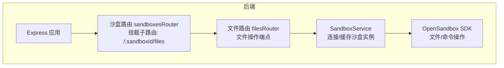
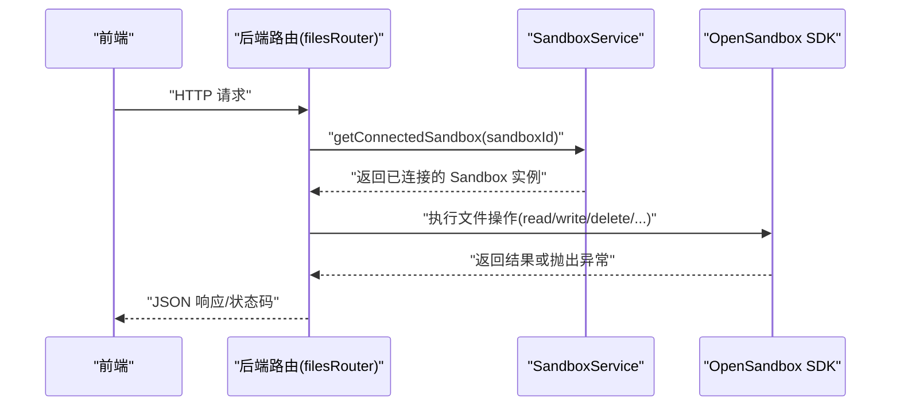
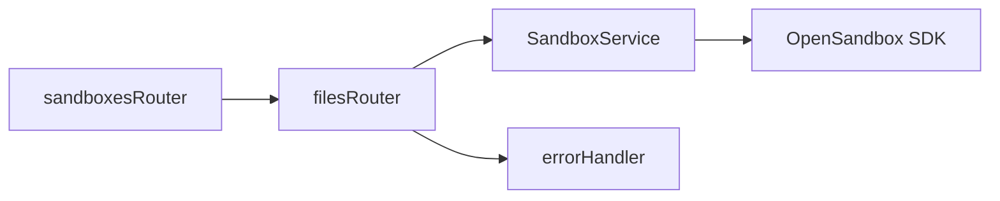
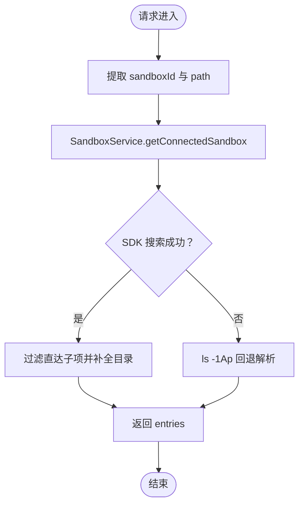
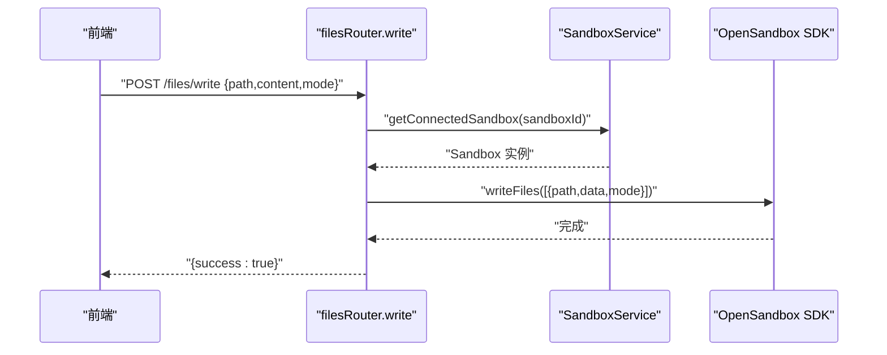

# 文件操作API

<cite>
**本文引用的文件**
- [apps/backend/src/routes/files.ts](file://apps/backend/src/routes/files.ts)
- [apps/backend/src/routes/sandboxes.ts](file://apps/backend/src/routes/sandboxes.ts)
- [apps/backend/src/server.ts](file://apps/backend/src/server.ts)
- [apps/backend/src/middleware/error.ts](file://apps/backend/src/middleware/error.ts)
- [apps/backend/src/services/sandboxService.ts](file://apps/backend/src/services/sandboxService.ts)
- [apps/backend/src/types/index.ts](file://apps/backend/src/types/index.ts)
- [apps/frontend/src/api/files.ts](file://apps/frontend/src/api/files.ts)
- [apps/frontend/src/api/types.ts](file://apps/frontend/src/api/types.ts)
</cite>

## 目录
1. [简介](#简介)
2. [项目结构](#项目结构)
3. [核心组件](#核心组件)
4. [架构总览](#架构总览)
5. [详细组件分析](#详细组件分析)
6. [依赖关系分析](#依赖关系分析)
7. [性能考量](#性能考量)
8. [故障排查指南](#故障排查指南)
9. [结论](#结论)
10. [附录](#附录)

## 简介
本文件操作API面向沙盒内部文件系统的HTTP接口，提供文件树浏览、文件内容读取与下载、文件写入、目录创建、文件/目录删除等能力。后端基于Express路由与OpenSandbox SDK进行封装，前端通过统一的API客户端调用这些接口。

## 项目结构
- 后端路由挂载于沙盒路由之下，文件操作路由位于“/api/sandboxes/:sandboxId/files”下，具体端点如下：
  - GET /api/sandboxes/:sandboxId/files（文件树浏览）
  - GET /api/sandboxes/:sandboxId/files/content（文本内容读取）
  - GET /api/sandboxes/:sandboxId/files/download（二进制下载）
  - POST /api/sandboxes/:sandboxId/files/write（写入文件）
  - POST /api/sandboxes/:sandboxId/files/mkdir（创建目录）
  - POST /api/sandboxes/:sandboxId/files/move（移动/重命名）
  - DELETE /api/sandboxes/:sandboxId/files/files（删除文件）
  - DELETE /api/sandboxes/:sandboxId/files/directories（删除目录）

图表来源
- [apps/backend/src/routes/sandboxes.ts:58](file://apps/backend/src/routes/sandboxes.ts#L58)
- [apps/backend/src/routes/files.ts:8](file://apps/backend/src/routes/files.ts#L8)
- [apps/backend/src/services/sandboxService.ts:112](file://apps/backend/src/services/sandboxService.ts#L112)

章节来源
- [apps/backend/src/routes/sandboxes.ts:58](file://apps/backend/src/routes/sandboxes.ts#L58)
- [apps/backend/src/server.ts:40-48](file://apps/backend/src/server.ts#L40-L48)

## 核心组件
- 路由层：在沙盒路由下挂载文件子路由，暴露文件操作端点。
- 服务层：SandboxService负责连接/缓存沙盒实例，并提供getConnectedSandbox以供文件操作使用。
- 中间件：统一错误处理，将SDK异常映射为HTTP状态码。
- 类型定义：统一的响应结构ApiResponse及各端点请求体类型（WriteFileBody、MkdirBody、MoveFilesBody）。

章节来源
- [apps/backend/src/routes/files.ts:8](file://apps/backend/src/routes/files.ts#L8)
- [apps/backend/src/services/sandboxService.ts:112](file://apps/backend/src/services/sandboxService.ts#L112)
- [apps/backend/src/middleware/error.ts:5](file://apps/backend/src/middleware/error.ts#L5)
- [apps/backend/src/types/index.ts:3](file://apps/backend/src/types/index.ts#L3)

## 架构总览
文件操作端点通过Express路由进入，经SandboxService获取已连接的沙盒实例，再调用OpenSandbox SDK执行文件操作；错误通过统一中间件转换为标准响应。

图表来源
- [apps/backend/src/routes/files.ts:20](file://apps/backend/src/routes/files.ts#L20)
- [apps/backend/src/services/sandboxService.ts:112](file://apps/backend/src/services/sandboxService.ts#L112)

## 详细组件分析

### 端点一览与规范
以下为文件操作API的端点清单与规范，涵盖HTTP方法、URL模式、查询参数/请求体、响应格式与典型状态码。

- 文件树浏览
  - 方法与路径：GET /api/sandboxes/:sandboxId/files
  - 查询参数
    - path: 字符串，目标目录路径，默认“/”
  - 成功响应：data为条目数组，元素包含 name、path、isDir、size、modTime
  - 典型状态码：200
  - 失败场景：当SDK搜索失败时回退到ls+stat策略；若无权限或路径不存在，可能返回4xx/5xx（由SDK异常映射）
  - 章节来源
    - [apps/backend/src/routes/files.ts:20](file://apps/backend/src/routes/files.ts#L20)
    - [apps/backend/src/routes/files.ts:213](file://apps/backend/src/routes/files.ts#L213)
    - [apps/backend/src/routes/files.ts:281](file://apps/backend/src/routes/files.ts#L281)

- 文本内容读取
  - 方法与路径：GET /api/sandboxes/:sandboxId/files/content
  - 查询参数
    - path: 字符串，必填
  - 成功响应：text/plain，返回文件内容字符串
  - 典型状态码：200；当path缺失或为目录时返回400
  - 章节来源
    - [apps/backend/src/routes/files.ts:47](file://apps/backend/src/routes/files.ts#L47)
    - [apps/backend/src/routes/files.ts:53](file://apps/backend/src/routes/files.ts#L53)

- 二进制下载
  - 方法与路径：GET /api/sandboxes/:sandboxId/files/download
  - 查询参数
    - path: 字符串，必填
  - 成功响应：application/octet-stream，返回二进制字节流
  - 典型状态码：200；当path缺失或为目录时返回400
  - 章节来源
    - [apps/backend/src/routes/files.ts:72](file://apps/backend/src/routes/files.ts#L72)
    - [apps/backend/src/routes/files.ts:78](file://apps/backend/src/routes/files.ts#L78)

- 写入文件
  - 方法与路径：POST /api/sandboxes/:sandboxId/files/write
  - 请求体：WriteFileBody
    - path: 字符串，必填
    - content: 字符串，必填
    - mode: 数字，可选（文件权限）
  - 成功响应：success=true
  - 典型状态码：200；缺少字段返回400
  - 章节来源
    - [apps/backend/src/routes/files.ts:97](file://apps/backend/src/routes/files.ts#L97)
    - [apps/backend/src/types/index.ts:33](file://apps/backend/src/types/index.ts#L33)

- 创建目录
  - 方法与路径：POST /api/sandboxes/:sandboxId/files/mkdir
  - 请求体：MkdirBody
    - paths: 字符串数组，必填
    - mode: 数字，可选
  - 成功响应：success=true
  - 典型状态码：200；paths为空返回400
  - 章节来源
    - [apps/backend/src/routes/files.ts:118](file://apps/backend/src/routes/files.ts#L118)
    - [apps/backend/src/types/index.ts:39](file://apps/backend/src/types/index.ts#L39)

- 移动/重命名
  - 方法与路径：POST /api/sandboxes/:sandboxId/files/move
  - 请求体：MoveFilesBody
    - entries: 数组，每项含src与dest，必填
  - 成功响应：success=true
  - 典型状态码：200；entries为空返回400
  - 章节来源
    - [apps/backend/src/routes/files.ts:139](file://apps/backend/src/routes/files.ts#L139)
    - [apps/backend/src/types/index.ts:44](file://apps/backend/src/types/index.ts#L44)

- 删除文件
  - 方法与路径：DELETE /api/sandboxes/:sandboxId/files/files
  - 查询参数
    - path: 字符串或数组，必填
  - 成功响应：204 No Content
  - 典型状态码：204；缺少path返回400
  - 章节来源
    - [apps/backend/src/routes/files.ts:160](file://apps/backend/src/routes/files.ts#L160)

- 删除目录
  - 方法与路径：DELETE /api/sandboxes/:sandboxId/files/directories
  - 查询参数
    - path: 字符串或数组，必填
  - 成功响应：204 No Content
  - 典型状态码：204；缺少path返回400
  - 章节来源
    - [apps/backend/src/routes/files.ts:185](file://apps/backend/src/routes/files.ts#L185)

### 数据模型与类型
- 统一响应结构 ApiResponse
  - 字段：success（布尔）、data（任意）、error（对象，含code、message、requestId）
  - 章节来源
    - [apps/backend/src/types/index.ts:3](file://apps/backend/src/types/index.ts#L3)

- 文件条目 FileEntry（用于文件树）
  - 字段：name、path、isDir、size、modTime
  - 章节来源
    - [apps/frontend/src/api/types.ts:27](file://apps/frontend/src/api/types.ts#L27)

- 请求体类型
  - WriteFileBody：path、content、mode
  - MkdirBody：paths、mode
  - MoveFilesBody：entries（src、dest）
  - 章节来源
    - [apps/backend/src/types/index.ts:33](file://apps/backend/src/types/index.ts#L33)
    - [apps/backend/src/types/index.ts:39](file://apps/backend/src/types/index.ts#L39)
    - [apps/backend/src/types/index.ts:44](file://apps/backend/src/types/index.ts#L44)

### 错误处理机制
- 统一错误中间件将SDK异常映射为HTTP状态码：
  - SandboxApiException/SandboxException → 502
  - SandboxReadyTimeoutException → 504
  - InvalidArgumentException → 400
  - JSON解析失败 → 400
  - 其他 → 500
- 响应结构包含success=false与error对象（含code、message、requestId）
- 章节来源
  - [apps/backend/src/middleware/error.ts:5](file://apps/backend/src/middleware/error.ts#L5)
  - [apps/backend/src/middleware/error.ts:33](file://apps/backend/src/middleware/error.ts#L33)

### 文件路径处理规则
- 列表目录时优先使用SDK搜索接口，回退到ls -1Ap命令解析；对路径进行安全转义，避免注入风险
- 检测是否为目录采用test -d命令
- 章节来源
  - [apps/backend/src/routes/files.ts:213](file://apps/backend/src/routes/files.ts#L213)
  - [apps/backend/src/routes/files.ts:281](file://apps/backend/src/routes/files.ts#L281)
  - [apps/backend/src/routes/files.ts:322](file://apps/backend/src/routes/files.ts#L322)

### 编码格式要求
- 文本读取端点返回text/plain，内容为字符串
- 二进制下载端点返回application/octet-stream，内容为字节流
- 章节来源
  - [apps/backend/src/routes/files.ts:65](file://apps/backend/src/routes/files.ts#L65)
  - [apps/backend/src/routes/files.ts:90](file://apps/backend/src/routes/files.ts#L90)

### 大文件上传限制
- 后端JSON解析限制为1MB（express.json({ limit: "1mb" })），因此直接以JSON携带大文件内容的写入方式不适用
- 建议使用二进制下载/上传或分块策略（当前仓库未提供专门的大文件上传端点）
- 章节来源
  - [apps/backend/src/server.ts:41](file://apps/backend/src/server.ts#L41)

### 前端调用示例（参考）
- 列出文件：GET /api/sandboxes/:sandboxId/files?path=...
- 读取文本：GET /api/sandboxes/:sandboxId/files/content?path=...
- 写入文件：POST /api/sandboxes/:sandboxId/files/write
- 删除文件：DELETE /api/sandboxes/:sandboxId/files/files?path=...
- 创建目录：POST /api/sandboxes/:sandboxId/files/mkdir
- 章节来源
  - [apps/frontend/src/api/files.ts:4](file://apps/frontend/src/api/files.ts#L4)
  - [apps/frontend/src/api/files.ts:8](file://apps/frontend/src/api/files.ts#L8)
  - [apps/frontend/src/api/files.ts:16](file://apps/frontend/src/api/files.ts#L16)
  - [apps/frontend/src/api/files.ts:23](file://apps/frontend/src/api/files.ts#L23)
  - [apps/frontend/src/api/files.ts:27](file://apps/frontend/src/api/files.ts#L27)

## 依赖关系分析
- 路由挂载关系
  - sandboxesRouter 使用 mergeParams 将 :sandboxId 注入子路由
  - 在 /:sandboxId/files 下挂载 filesRouter
- 服务依赖
  - filesRouter 通过 app.locals 获取 AppServices，进而访问 SandboxService
  - SandboxService 提供 getConnectedSandbox，负责连接/缓存沙盒实例
- 错误处理
  - errorHandler 将SDK异常映射为HTTP状态码，并输出统一响应

图表来源
- [apps/backend/src/routes/sandboxes.ts:58](file://apps/backend/src/routes/sandboxes.ts#L58)
- [apps/backend/src/routes/files.ts:14](file://apps/backend/src/routes/files.ts#L14)
- [apps/backend/src/services/sandboxService.ts:112](file://apps/backend/src/services/sandboxService.ts#L112)
- [apps/backend/src/middleware/error.ts:5](file://apps/backend/src/middleware/error.ts#L5)

章节来源
- [apps/backend/src/routes/sandboxes.ts:58](file://apps/backend/src/routes/sandboxes.ts#L58)
- [apps/backend/src/routes/files.ts:14](file://apps/backend/src/routes/files.ts#L14)
- [apps/backend/src/services/sandboxService.ts:112](file://apps/backend/src/services/sandboxService.ts#L112)
- [apps/backend/src/middleware/error.ts:5](file://apps/backend/src/middleware/error.ts#L5)

## 性能考量
- 文件列表策略
  - 优先使用SDK搜索接口，仅在失败时回退到ls+stat，减少命令调用次数
  - 对深层路径进行目录推断，避免多次遍历
- 连接复用
  - SandboxService使用LRU缓存连接，降低重复连接开销
- 建议
  - 大量小文件操作建议合并请求（如批量创建目录、批量移动）
  - 避免在高频刷新中重复请求相同路径
  - 对超大文件采用分块策略或外部存储对接
- 章节来源
  - [apps/backend/src/routes/files.ts:213](file://apps/backend/src/routes/files.ts#L213)
  - [apps/backend/src/services/sandboxService.ts:35](file://apps/backend/src/services/sandboxService.ts#L35)

## 故障排查指南
- 常见错误与定位
  - 400错误：请求参数缺失（如缺少path或entries），检查前端传参与后端校验
  - 400错误：path为目录而非文件（读取文本/二进制时），确认路径指向文件
  - 400错误：JSON解析失败（请求体过大或格式错误），检查请求体大小与格式
  - 502错误：SDK调用异常（网络/鉴权/资源不可用），查看日志中的requestId
  - 504错误：沙盒准备超时，稍后重试或检查OpenSandbox服务状态
- 日志与追踪
  - 后端为每个请求生成x-request-id，便于跨服务追踪
  - 错误中间件会记录方法、路径、状态码与错误详情
- 章节来源
  - [apps/backend/src/middleware/error.ts:18](file://apps/backend/src/middleware/error.ts#L18)
  - [apps/backend/src/server.ts:44](file://apps/backend/src/server.ts#L44)

## 结论
该文件操作API围绕沙盒内部文件系统提供了完整的增删改查能力，具备良好的错误映射与统一响应格式。通过SDK搜索与命令回退相结合的目录列举策略、以及连接缓存，兼顾了可用性与性能。对于大文件与高并发场景，建议结合分块策略与前端缓存优化进一步提升体验。

## 附录

### 端点流程图（文件树浏览）

图表来源
- [apps/backend/src/routes/files.ts:20](file://apps/backend/src/routes/files.ts#L20)
- [apps/backend/src/routes/files.ts:213](file://apps/backend/src/routes/files.ts#L213)
- [apps/backend/src/routes/files.ts:281](file://apps/backend/src/routes/files.ts#L281)

### 端到端序列图（写入文件）

图表来源
- [apps/backend/src/routes/files.ts:97](file://apps/backend/src/routes/files.ts#L97)
- [apps/backend/src/services/sandboxService.ts:112](file://apps/backend/src/services/sandboxService.ts#L112)