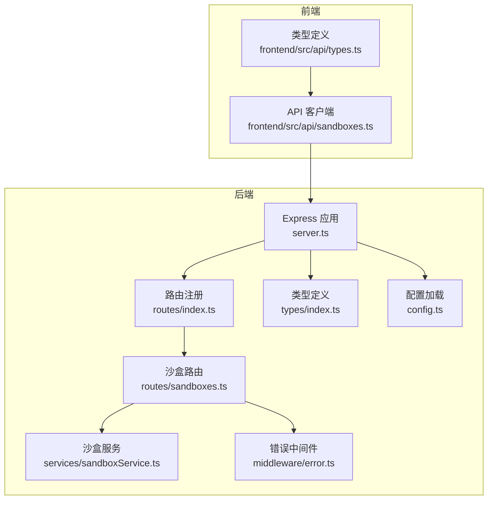
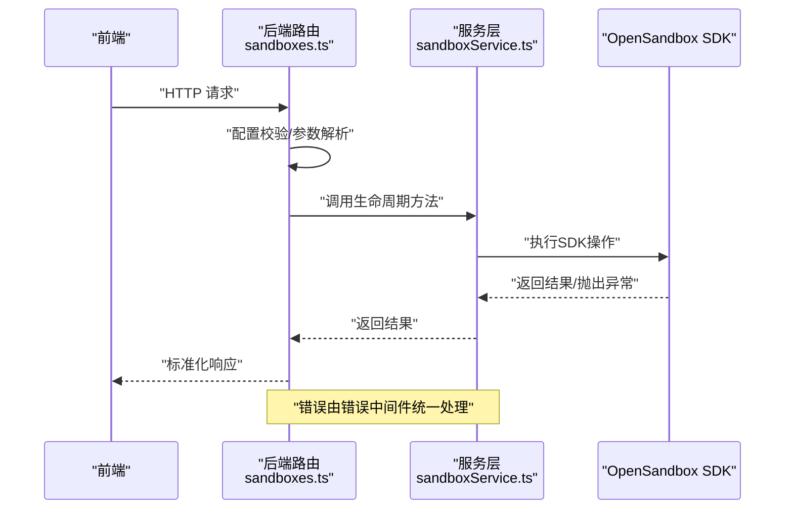
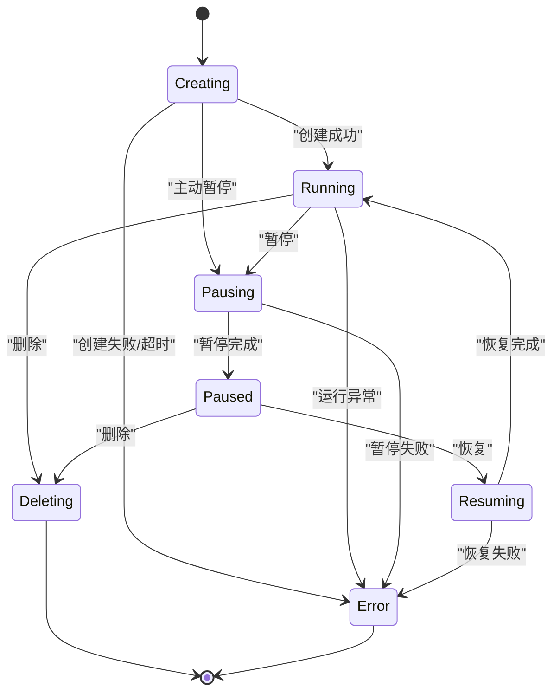
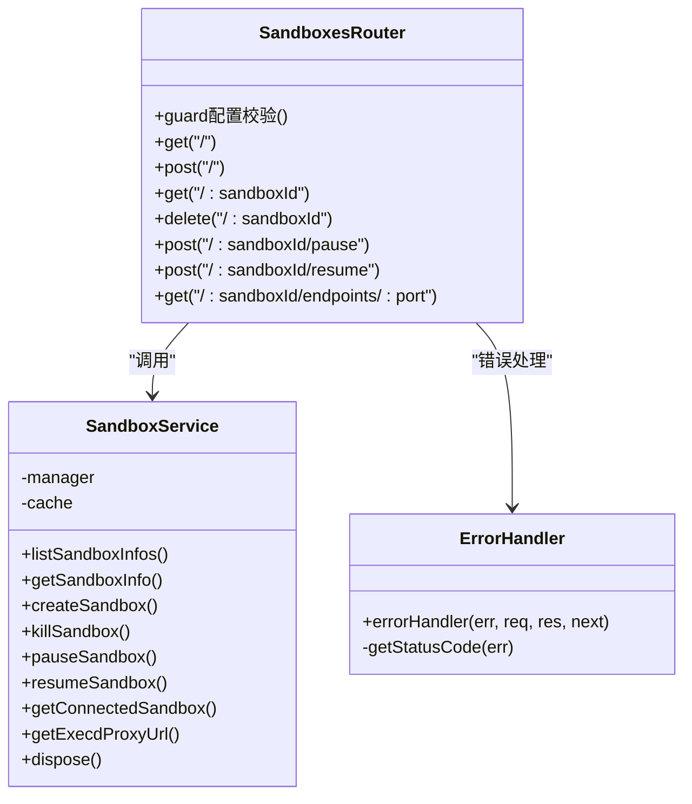

# 沙盒管理API

<cite>
**本文引用的文件**
- [apps/backend/src/routes/sandboxes.ts](file://apps/backend/src/routes/sandboxes.ts)
- [apps/backend/src/services/sandboxService.ts](file://apps/backend/src/services/sandboxService.ts)
- [apps/backend/src/types/index.ts](file://apps/backend/src/types/index.ts)
- [apps/backend/src/middleware/error.ts](file://apps/backend/src/middleware/error.ts)
- [apps/backend/src/server.ts](file://apps/backend/src/server.ts)
- [apps/backend/src/config.ts](file://apps/backend/src/config.ts)
- [apps/backend/src/routes/index.ts](file://apps/backend/src/routes/index.ts)
- [apps/frontend/src/api/sandboxes.ts](file://apps/frontend/src/api/sandboxes.ts)
- [apps/frontend/src/api/types.ts](file://apps/frontend/src/api/types.ts)
- [README.md](file://README.md)
</cite>

## 目录
1. [简介](#简介)
2. [项目结构](#项目结构)
3. [核心组件](#核心组件)
4. [架构总览](#架构总览)
5. [详细组件分析](#详细组件分析)
6. [依赖关系分析](#依赖关系分析)
7. [性能考虑](#性能考虑)
8. [故障排查指南](#故障排查指南)
9. [结论](#结论)
10. [附录](#附录)

## 简介
本文件为“沙盒管理API”的权威参考文档，覆盖沙盒生命周期管理的所有HTTP端点，包括：
- 获取沙盒列表：GET /api/sandboxes
- 创建沙盒：POST /api/sandboxes
- 获取单个沙盒信息：GET /api/sandboxes/:sandboxId
- 删除沙盒：DELETE /api/sandboxes/:sandboxId
- 暂停沙盒：POST /api/sandboxes/:sandboxId/pause
- 恢复沙盒：POST /api/sandboxes/:sandboxId/resume
- 获取沙箱端点：GET /api/sandboxes/:sandboxId/endpoints/:port

文档详细说明每个端点的HTTP方法、URL模式、请求参数、请求体结构、响应格式、状态码、错误处理机制、业务逻辑约束，并提供状态转换流程图与最佳实践建议。

## 项目结构
后端采用Express + OpenSandbox SDK，路由集中于 /api/sandboxes，服务层封装SDK调用并提供LRU缓存；前端通过统一API客户端发起REST请求。

图表来源
- [apps/backend/src/server.ts:36-90](file://apps/backend/src/server.ts#L36-L90)
- [apps/backend/src/routes/index.ts:9-15](file://apps/backend/src/routes/index.ts#L9-L15)
- [apps/backend/src/routes/sandboxes.ts:9-175](file://apps/backend/src/routes/sandboxes.ts#L9-L175)
- [apps/backend/src/services/sandboxService.ts:11-147](file://apps/backend/src/services/sandboxService.ts#L11-L147)
- [apps/backend/src/middleware/error.ts:5-47](file://apps/backend/src/middleware/error.ts#L5-L47)
- [apps/backend/src/types/index.ts:3-89](file://apps/backend/src/types/index.ts#L3-L89)
- [apps/backend/src/config.ts:48-70](file://apps/backend/src/config.ts#L48-L70)
- [apps/frontend/src/api/sandboxes.ts:1-40](file://apps/frontend/src/api/sandboxes.ts#L1-L40)
- [apps/frontend/src/api/types.ts:1-146](file://apps/frontend/src/api/types.ts#L1-L146)

章节来源
- [apps/backend/src/server.ts:36-90](file://apps/backend/src/server.ts#L36-L90)
- [apps/backend/src/routes/index.ts:9-15](file://apps/backend/src/routes/index.ts#L9-L15)
- [README.md:114-140](file://README.md#L114-L140)

## 核心组件
- 路由层：负责解析HTTP请求、参数校验、调用服务层并返回标准化响应。
- 服务层：封装OpenSandbox SDK，提供沙盒生命周期操作、连接缓存与清理。
- 类型系统：统一前后端数据契约，确保请求体、响应体与错误结构一致。
- 错误处理：将SDK异常映射为HTTP状态码，统一输出结构化错误响应。
- 配置系统：从环境变量加载OpenSandbox连接参数，控制服务初始化与行为。

章节来源
- [apps/backend/src/routes/sandboxes.ts:9-175](file://apps/backend/src/routes/sandboxes.ts#L9-L175)
- [apps/backend/src/services/sandboxService.ts:11-147](file://apps/backend/src/services/sandboxService.ts#L11-L147)
- [apps/backend/src/types/index.ts:3-89](file://apps/backend/src/types/index.ts#L3-L89)
- [apps/backend/src/middleware/error.ts:5-47](file://apps/backend/src/middleware/error.ts#L5-L47)
- [apps/backend/src/config.ts:48-70](file://apps/backend/src/config.ts#L48-L70)

## 架构总览
后端通过Express提供REST接口，路由层在进入业务逻辑前进行OpenSandbox配置校验；服务层负责与OpenSandbox SDK交互，并对沙盒实例进行LRU缓存；错误中间件统一捕获异常并返回标准错误结构。

图表来源
- [apps/backend/src/routes/sandboxes.ts:34-45](file://apps/backend/src/routes/sandboxes.ts#L34-L45)
- [apps/backend/src/services/sandboxService.ts:11-47](file://apps/backend/src/services/sandboxService.ts#L11-L47)
- [apps/backend/src/middleware/error.ts:5-47](file://apps/backend/src/middleware/error.ts#L5-L47)

## 详细组件分析

### GET /api/sandboxes
- 功能：分页查询沙盒列表，支持按状态过滤；自动过滤已过期的沙盒。
- 请求参数
  - 查询参数
    - state: 字符串数组，过滤指定状态
    - page: 整数，页码
    - pageSize: 整数，每页大小
- 请求体：无
- 成功响应
  - 状态码：200 OK
  - 数据字段
    - items: 数组，每个元素为标准化后的沙盒对象
    - pagination: 分页元信息
- 异常
  - 未配置OpenSandbox：503 Service Unavailable
  - SDK异常：映射为HTTP状态码（见错误处理）
- 业务约束
  - 返回的沙盒对象中status为字符串，image为字符串，包含额外状态细节字段
  - 已过期沙盒不会出现在结果中
- 前端对接
  - 前端通过URLSearchParams拼接查询参数

章节来源
- [apps/backend/src/routes/sandboxes.ts:61-93](file://apps/backend/src/routes/sandboxes.ts#L61-L93)
- [apps/backend/src/types/index.ts:3-11](file://apps/backend/src/types/index.ts#L3-L11)
- [apps/frontend/src/api/sandboxes.ts:4-15](file://apps/frontend/src/api/sandboxes.ts#L4-L15)

### POST /api/sandboxes
- 功能：创建新沙盒。
- 请求体
  - 字段
    - image: 字符串，镜像名称
    - name: 字符串，可选
    - timeoutSeconds: 整数，可选，默认600
    - env: 对象，键值对，可选
    - metadata: 对象，键值对，可选
    - resource: 对象，可选
      - cpu: 字符串
      - memory: 字符串
    - networkPolicy: 对象，可选
      - defaultAction: 字符串
      - egress: 数组，元素为{action, target}
- 成功响应
  - 状态码：202 Accepted
  - 数据字段：标准化后的沙盒对象
- 异常
  - 未配置OpenSandbox：503 Service Unavailable
  - SDK异常：映射为HTTP状态码
- 业务约束
  - timeoutSeconds默认600秒
  - 创建成功后，服务层将沙盒实例加入LRU缓存
- 前端对接
  - 前端调用POST /api/sandboxes并传入上述请求体

章节来源
- [apps/backend/src/routes/sandboxes.ts:95-105](file://apps/backend/src/routes/sandboxes.ts#L95-L105)
- [apps/backend/src/services/sandboxService.ts:62-88](file://apps/backend/src/services/sandboxService.ts#L62-L88)
- [apps/backend/src/types/index.ts:13-24](file://apps/backend/src/types/index.ts#L13-L24)
- [apps/frontend/src/api/sandboxes.ts:21-23](file://apps/frontend/src/api/sandboxes.ts#L21-L23)

### GET /api/sandboxes/:sandboxId
- 功能：获取单个沙盒的详细信息。
- 路径参数
  - sandboxId: 字符串，沙盒ID
- 请求体：无
- 成功响应
  - 状态码：200 OK
  - 数据字段：标准化后的沙盒对象
- 异常
  - 未配置OpenSandbox：503 Service Unavailable
  - SDK异常：映射为HTTP状态码
- 业务约束
  - 返回的沙盒对象中status为字符串，image为字符串
- 前端对接
  - 前端调用GET /api/sandboxes/:id

章节来源
- [apps/backend/src/routes/sandboxes.ts:107-116](file://apps/backend/src/routes/sandboxes.ts#L107-L116)
- [apps/frontend/src/api/sandboxes.ts:17-19](file://apps/frontend/src/api/sandboxes.ts#L17-L19)

### DELETE /api/sandboxes/:sandboxId
- 功能：删除沙盒（终止并清理）。
- 路径参数
  - sandboxId: 字符串，沙盒ID
- 请求体：无
- 成功响应
  - 状态码：204 No Content
- 异常
  - 未配置OpenSandbox：503 Service Unavailable
  - SDK异常：映射为HTTP状态码
- 业务约束
  - 删除时会从LRU缓存中移除对应沙盒实例
- 前端对接
  - 前端调用DELETE /api/sandboxes/:id

章节来源
- [apps/backend/src/routes/sandboxes.ts:118-127](file://apps/backend/src/routes/sandboxes.ts#L118-L127)
- [apps/frontend/src/api/sandboxes.ts:25-27](file://apps/frontend/src/api/sandboxes.ts#L25-L27)

### POST /api/sandboxes/:sandboxId/pause
- 功能：暂停沙盒。
- 路径参数
  - sandboxId: 字符串，沙盒ID
- 请求体：无
- 成功响应
  - 状态码：200 OK
  - 数据字段：仅success标志
- 异常
  - 未配置OpenSandbox：503 Service Unavailable
  - SDK异常：映射为HTTP状态码
- 业务约束
  - 暂停时会从LRU缓存中移除对应沙盒实例
- 前端对接
  - 前端调用POST /api/sandboxes/:id/pause

章节来源
- [apps/backend/src/routes/sandboxes.ts:129-138](file://apps/backend/src/routes/sandboxes.ts#L129-L138)
- [apps/frontend/src/api/sandboxes.ts:29-31](file://apps/frontend/src/api/sandboxes.ts#L29-L31)

### POST /api/sandboxes/:sandboxId/resume
- 功能：恢复沙盒。
- 路径参数
  - sandboxId: 字符串，沙盒ID
- 请求体：无
- 成功响应
  - 状态码：200 OK
  - 数据字段：仅success标志
- 异常
  - 未配置OpenSandbox：503 Service Unavailable
  - SDK异常：映射为HTTP状态码
- 业务约束
  - 恢复时会从LRU缓存中移除对应沙盒实例
- 前端对接
  - 前端调用POST /api/sandboxes/:id/resume

章节来源
- [apps/backend/src/routes/sandboxes.ts:140-149](file://apps/backend/src/routes/sandboxes.ts#L140-L149)
- [apps/frontend/src/api/sandboxes.ts:33-35](file://apps/frontend/src/api/sandboxes.ts#L33-L35)

### GET /api/sandboxes/:sandboxId/endpoints/:port
- 功能：获取沙盒指定端口的访问端点URL及解析后的scheme/host/port。
- 路径参数
  - sandboxId: 字符串，沙盒ID
  - port: 字符串，端口号
- 请求体：无
- 成功响应
  - 状态码：200 OK
  - 数据字段
    - url: 字符串，完整URL
    - scheme: 字符串，http或https
    - host: 字符串，去掉协议头的主机部分
    - port: 整数，80或443
- 异常
  - 未配置OpenSandbox：503 Service Unavailable
  - SDK异常：映射为HTTP状态码
- 业务约束
  - 通过SDK获取端点URL并解析scheme/host/port
- 前端对接
  - 前端调用GET /api/sandboxes/:id/endpoints/:port

章节来源
- [apps/backend/src/routes/sandboxes.ts:151-174](file://apps/backend/src/routes/sandboxes.ts#L151-L174)
- [apps/backend/src/types/index.ts:60-65](file://apps/backend/src/types/index.ts#L60-L65)
- [apps/frontend/src/api/sandboxes.ts:37-39](file://apps/frontend/src/api/sandboxes.ts#L37-L39)

### 请求/响应示例（基于类型定义）
- 请求体结构
  - 创建沙盒请求体：参见 [CreateSandboxBody:13-24](file://apps/backend/src/types/index.ts#L13-L24)
  - 前端请求体：参见 [CreateSandboxRequest:19-25](file://apps/frontend/src/api/types.ts#L19-L25)
- 响应体结构
  - 通用响应：参见 [ApiResponse:3-11](file://apps/backend/src/types/index.ts#L3-L11)
  - 沙盒端点响应：参见 [SandboxEndpointResponse:60-65](file://apps/backend/src/types/index.ts#L60-L65)
- 错误响应
  - 通用错误响应：参见 [ApiErrorResponse:49-56](file://apps/frontend/src/api/types.ts#L49-L56)

章节来源
- [apps/backend/src/types/index.ts:3-89](file://apps/backend/src/types/index.ts#L3-L89)
- [apps/frontend/src/api/types.ts:49-61](file://apps/frontend/src/api/types.ts#L49-L61)

### 错误处理机制
- 配置校验
  - 若未配置OpenSandbox，路由中间件直接返回503，提示先完成设置
- SDK异常映射
  - 将SDK异常映射为HTTP状态码，如SandboxApiException映射为502，SandboxReadyTimeoutException映射为504，InvalidArgumentException映射为400等
- 统一错误响应
  - 输出结构化错误对象，包含code、message、requestId

章节来源
- [apps/backend/src/routes/sandboxes.ts:34-45](file://apps/backend/src/routes/sandboxes.ts#L34-L45)
- [apps/backend/src/middleware/error.ts:5-47](file://apps/backend/src/middleware/error.ts#L5-L47)
- [apps/frontend/src/api/types.ts:49-56](file://apps/frontend/src/api/types.ts#L49-L56)

### 沙盒状态转换流程
沙盒状态包括但不限于：Creating、Running、Paused、Error、Deleting。暂停与恢复操作会触发状态变更；创建时若超时则可能进入Error状态；删除会进入Deleting状态。

图表来源
- [apps/backend/src/routes/sandboxes.ts:107-116](file://apps/backend/src/routes/sandboxes.ts#L107-L116)
- [apps/frontend/src/api/types.ts:1-17](file://apps/frontend/src/api/types.ts#L1-L17)

## 依赖关系分析
- 路由依赖服务层：沙盒路由在执行业务逻辑前，通过app.locals注入的服务实例调用具体方法
- 服务层依赖OpenSandbox SDK：封装SDK的连接、创建、暂停、恢复、删除等操作，并维护LRU缓存
- 类型系统贯穿前后端：统一请求体、响应体与错误结构，保证契约一致性
- 错误中间件独立于业务：统一捕获异常并输出标准错误响应

图表来源
- [apps/backend/src/routes/sandboxes.ts:9-175](file://apps/backend/src/routes/sandboxes.ts#L9-L175)
- [apps/backend/src/services/sandboxService.ts:11-147](file://apps/backend/src/services/sandboxService.ts#L11-L147)
- [apps/backend/src/middleware/error.ts:5-47](file://apps/backend/src/middleware/error.ts#L5-L47)

章节来源
- [apps/backend/src/routes/sandboxes.ts:9-175](file://apps/backend/src/routes/sandboxes.ts#L9-L175)
- [apps/backend/src/services/sandboxService.ts:11-147](file://apps/backend/src/services/sandboxService.ts#L11-L147)
- [apps/backend/src/middleware/error.ts:5-47](file://apps/backend/src/middleware/error.ts#L5-L47)

## 性能考虑
- LRU缓存：服务层对已连接的沙盒实例进行LRU缓存，提升频繁操作的性能，同时设置TTL避免长期占用
- 请求限制：Express JSON解析限制为1MB，防止过大请求导致内存压力
- 超时配置：OpenSandbox请求超时可通过环境变量配置
- 过滤策略：列表接口自动过滤过期沙盒，减少前端渲染负担

章节来源
- [apps/backend/src/services/sandboxService.ts:17-44](file://apps/backend/src/services/sandboxService.ts#L17-L44)
- [apps/backend/src/server.ts:40-41](file://apps/backend/src/server.ts#L40-L41)
- [apps/backend/src/config.ts:48-70](file://apps/backend/src/config.ts#L48-L70)

## 故障排查指南
- 未配置OpenSandbox
  - 现象：调用沙盒相关接口返回503
  - 处理：先完成平台设置，确保配置项齐全
- SDK异常
  - 现象：根据异常类型映射为不同HTTP状态码
  - 处理：检查网络连通性、API密钥、OpenSandbox Server状态
- 参数错误
  - 现象：400 Bad Request
  - 处理：核对请求体字段类型与必填项
- 超时
  - 现象：504 Gateway Timeout
  - 处理：调整请求超时时间或重试

章节来源
- [apps/backend/src/routes/sandboxes.ts:34-45](file://apps/backend/src/routes/sandboxes.ts#L34-L45)
- [apps/backend/src/middleware/error.ts:33-47](file://apps/backend/src/middleware/error.ts#L33-L47)

## 结论
本文档系统性地梳理了沙盒管理API的端点设计、数据契约、错误处理与业务约束，并结合服务层实现与前端对接给出最佳实践建议。遵循本文档的规范，可确保沙盒生命周期管理的稳定性与一致性。

## 附录
- 环境变量参考
  - OPENSANDBOX_SERVER_URL：OpenSandbox Server地址
  - OPENSANDBOX_API_KEY：OpenSandbox API密钥
  - OPENSANDBOX_PROTOCOL：连接协议（http/https）
  - PORT：后端监听端口
  - CORS_ORIGIN：CORS允许来源
  - LOG_LEVEL：日志级别
  - OPENSANDBOX_REQUEST_TIMEOUT_SECONDS：请求超时秒数
- 前端API客户端
  - 列表、详情、创建、删除、暂停、恢复、端点获取均通过统一客户端封装

章节来源
- [apps/backend/src/config.ts:48-70](file://apps/backend/src/config.ts#L48-L70)
- [apps/frontend/src/api/sandboxes.ts:1-40](file://apps/frontend/src/api/sandboxes.ts#L1-L40)
- [README.md:177-187](file://README.md#L177-L187)