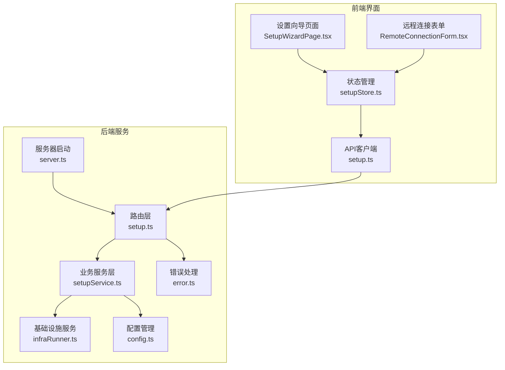
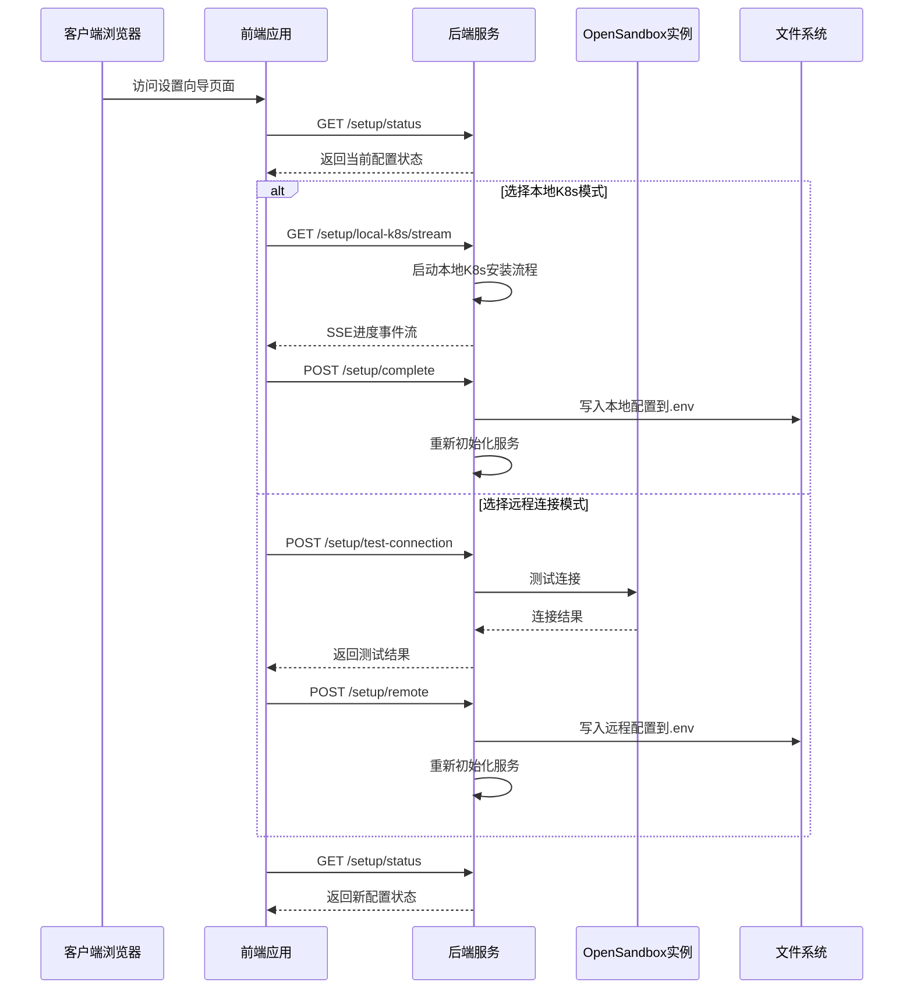
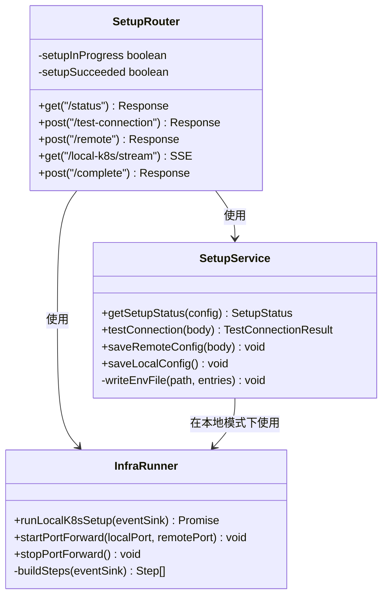
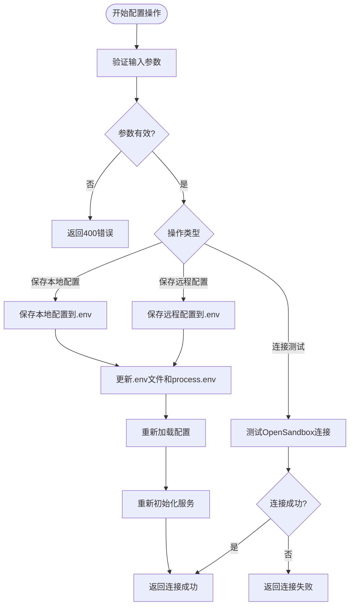
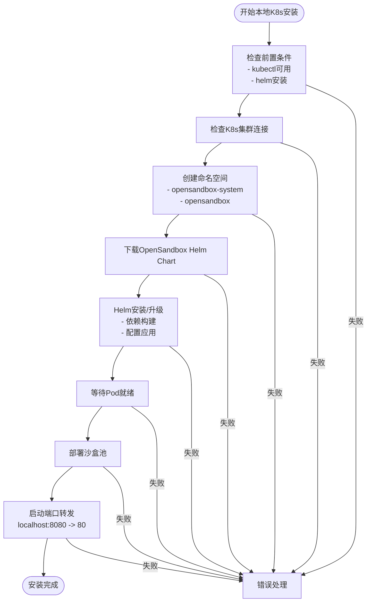
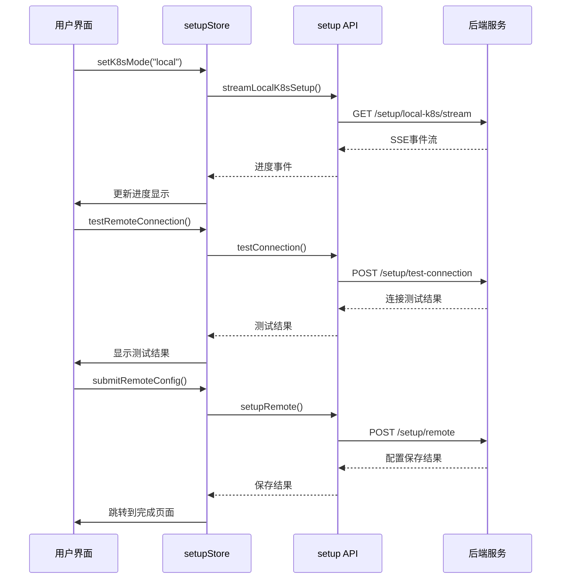
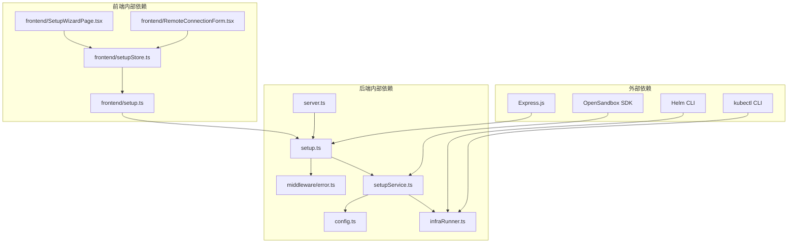

# 设置向导API

<cite>
**本文档引用的文件**
- [apps/backend/src/routes/setup.ts](file://apps/backend/src/routes/setup.ts)
- [apps/backend/src/services/setupService.ts](file://apps/backend/src/services/setupService.ts)
- [apps/backend/src/services/infraRunner.ts](file://apps/backend/src/services/infraRunner.ts)
- [apps/backend/src/config.ts](file://apps/backend/src/config.ts)
- [apps/backend/src/middleware/error.ts](file://apps/backend/src/middleware/error.ts)
- [apps/backend/src/server.ts](file://apps/backend/src/server.ts)
- [apps/frontend/src/api/setup.ts](file://apps/frontend/src/api/setup.ts)
- [apps/frontend/src/api/types.ts](file://apps/frontend/src/api/types.ts)
- [apps/frontend/src/stores/setupStore.ts](file://apps/frontend/src/stores/setupStore.ts)
- [apps/frontend/src/pages/SetupWizardPage.tsx](file://apps/frontend/src/pages/SetupWizardPage.tsx)
- [apps/frontend/src/components/setup/RemoteConnectionForm.tsx](file://apps/frontend/src/components/setup/RemoteConnectionForm.tsx)
</cite>

## 目录
1. [简介](#简介)
2. [项目结构](#项目结构)
3. [核心组件](#核心组件)
4. [架构概览](#架构概览)
5. [详细组件分析](#详细组件分析)
6. [依赖关系分析](#依赖关系分析)
7. [性能考虑](#性能考虑)
8. [故障排除指南](#故障排除指南)
9. [结论](#结论)

## 简介

设置向导API是RabbitAI-Lab OpenSandbox平台的核心配置接口，负责管理OpenSandbox实例的初始化配置和连接设置。该API提供了两种部署模式：本地Docker Kubernetes集群安装和远程OpenSandbox实例连接。系统通过HTTP端点实现完整的设置向导流程，包括环境检测、配置验证、连接测试和最终配置保存。

## 项目结构

设置向导功能分布在前后端两个主要部分：



**图表来源**
- [apps/backend/src/routes/setup.ts:1-139](file://apps/backend/src/routes/setup.ts#L1-L139)
- [apps/backend/src/services/setupService.ts:1-147](file://apps/backend/src/services/setupService.ts#L1-L147)
- [apps/frontend/src/api/setup.ts:1-73](file://apps/frontend/src/api/setup.ts#L1-L73)

**章节来源**
- [apps/backend/src/routes/setup.ts:1-139](file://apps/backend/src/routes/setup.ts#L1-L139)
- [apps/frontend/src/api/setup.ts:1-73](file://apps/frontend/src/api/setup.ts#L1-L73)

## 核心组件

设置向导API由以下核心组件构成：

### 后端路由组件
- **setupRouter**: 主要路由处理器，提供所有设置向导相关的HTTP端点
- **SetupService**: 核心业务逻辑服务，处理配置保存、连接测试等操作
- **InfraRunner**: 基础设施执行器，负责本地K8s集群的安装和配置

### 前端组件
- **setupStore**: Zustand状态管理，维护设置向导的状态和用户交互
- **setup API**: 前端HTTP客户端，封装所有后端API调用
- **SetupWizardPage**: 主界面组件，展示设置向导的各个步骤

**章节来源**
- [apps/backend/src/services/setupService.ts:58-147](file://apps/backend/src/services/setupService.ts#L58-L147)
- [apps/backend/src/services/infraRunner.ts:26-488](file://apps/backend/src/services/infraRunner.ts#L26-L488)
- [apps/frontend/src/stores/setupStore.ts:41-157](file://apps/frontend/src/stores/setupStore.ts#L41-L157)

## 架构概览

设置向导采用分层架构设计，确保了清晰的关注点分离和可维护性：



**图表来源**
- [apps/backend/src/routes/setup.ts:17-139](file://apps/backend/src/routes/setup.ts#L17-L139)
- [apps/backend/src/services/setupService.ts:85-145](file://apps/backend/src/services/setupService.ts#L85-L145)
- [apps/frontend/src/api/setup.ts:13-27](file://apps/frontend/src/api/setup.ts#L13-L27)

## 详细组件分析

### 路由层组件

#### SetupRouter类结构



**图表来源**
- [apps/backend/src/routes/setup.ts:7-15](file://apps/backend/src/routes/setup.ts#L7-L15)
- [apps/backend/src/services/setupService.ts:58-66](file://apps/backend/src/services/setupService.ts#L58-L66)
- [apps/backend/src/services/infraRunner.ts:26-33](file://apps/backend/src/services/infraRunner.ts#L26-L33)

#### 端点定义和行为

| 端点 | 方法 | 描述 | 请求体 | 响应体 |
|------|------|------|--------|--------|
| `/setup/status` | GET | 获取当前设置状态 | 无 | SetupStatus |
| `/setup/test-connection` | POST | 测试OpenSandbox连接 | TestConnectionBody | TestConnectionResult |
| `/setup/remote` | POST | 保存远程配置 | RemoteSetupBody | {configured: boolean} |
| `/setup/local-k8s/stream` | GET | 本地K8s安装进度流 | 无 | SSE事件流 |
| `/setup/complete` | POST | 完成本地K8s安装 | 无 | {configured: boolean} |

**章节来源**
- [apps/backend/src/routes/setup.ts:17-139](file://apps/backend/src/routes/setup.ts#L17-L139)

### 业务服务层

#### SetupService类详细分析

SetupService是设置向导的核心业务逻辑组件，负责处理所有配置相关的操作：



**图表来源**
- [apps/backend/src/services/setupService.ts:85-145](file://apps/backend/src/services/setupService.ts#L85-L145)

#### 配置数据模型

```mermaid
erDiagram
SetupStatus {
boolean configured
string k8sMode
string osbServerUrl
}
RemoteSetupBody {
string serverUrl
string apiKey
string protocol
}
TestConnectionResult {
boolean connected
string error
}
Config {
string osbServerUrl
string osbApiKey
string osbProtocol
boolean osbUseServerProxy
number osbRequestTimeoutSeconds
boolean configured
}
SetupStatus ||--|| Config : "基于配置生成"
RemoteSetupBody --> Config : "用于保存配置"
```

**图表来源**
- [apps/backend/src/services/setupService.ts:6-21](file://apps/backend/src/services/setupService.ts#L6-L21)
- [apps/backend/src/config.ts:3-23](file://apps/backend/src/config.ts#L3-L23)

**章节来源**
- [apps/backend/src/services/setupService.ts:58-147](file://apps/backend/src/services/setupService.ts#L58-L147)

### 基础设施执行层

#### InfraRunner类分析

InfraRunner负责处理本地K8s集群的完整安装流程，包含多个预定义的步骤：



**图表来源**
- [apps/backend/src/services/infraRunner.ts:155-188](file://apps/backend/src/services/infraRunner.ts#L155-L188)

**章节来源**
- [apps/backend/src/services/infraRunner.ts:26-488](file://apps/backend/src/services/infraRunner.ts#L26-L488)

### 前端集成层

#### 状态管理和API集成



**图表来源**
- [apps/frontend/src/stores/setupStore.ts:61-97](file://apps/frontend/src/stores/setupStore.ts#L61-L97)
- [apps/frontend/src/api/setup.ts:33-72](file://apps/frontend/src/api/setup.ts#L33-L72)

**章节来源**
- [apps/frontend/src/stores/setupStore.ts:41-157](file://apps/frontend/src/stores/setupStore.ts#L41-L157)
- [apps/frontend/src/api/setup.ts:1-73](file://apps/frontend/src/api/setup.ts#L1-L73)

## 依赖关系分析

设置向导API的依赖关系展现了清晰的分层架构：



**图表来源**
- [apps/backend/src/routes/setup.ts:1-6](file://apps/backend/src/routes/setup.ts#L1-L6)
- [apps/backend/src/services/infraRunner.ts:1-4](file://apps/backend/src/services/infraRunner.ts#L1-L4)

**章节来源**
- [apps/backend/src/server.ts:1-119](file://apps/backend/src/server.ts#L1-L119)

## 性能考虑

设置向导API在设计时充分考虑了性能和用户体验：

### 并发控制
- 单次设置操作的互斥保护，防止并发设置导致的配置冲突
- SSE流的优雅断开处理，自动清理资源

### 超时管理
- OpenSandbox连接测试超时设置为10秒
- Helm安装操作设置较长超时时间（6分钟）以适应网络环境
- kubectl命令执行设置合理的超时限制

### 资源管理
- 自动重启机制：端口转发进程意外退出时自动重启
- 进程清理：客户端断开连接时自动停止端口转发进程

## 故障排除指南

### 常见问题及解决方案

#### 连接测试失败
**症状**: 远程连接测试显示连接失败
**可能原因**:
- 服务器URL格式不正确
- API密钥无效或过期
- 网络连接问题
- 服务器防火墙阻止访问

**解决步骤**:
1. 验证服务器URL格式：`hostname:port` 或 `https://hostname:port`
2. 检查API密钥的有效性
3. 确认网络连通性
4. 检查服务器防火墙设置

#### 本地K8s安装失败
**症状**: 本地K8s安装过程中出现错误
**可能原因**:
- 缺少必要的CLI工具（kubectl、helm）
- Docker Desktop Kubernetes未启用
- 网络环境限制访问GitHub

**解决步骤**:
1. 安装并验证kubectl可用性
2. 安装并验证helm可用性
3. 启用Docker Desktop中的Kubernetes功能
4. 检查网络代理设置

#### 端口转发问题
**症状**: 本地端口转发无法建立
**可能原因**:
- 端口8080被其他进程占用
- Kubernetes集群中缺少必要的服务
- 权限不足

**解决步骤**:
1. 检查端口8080占用情况
2. 验证opensandbox-system命名空间中的服务
3. 以管理员权限运行应用

#### 配置文件写入失败
**症状**: 配置保存后重启失效
**可能原因**:
- 文件权限不足
- 磁盘空间不足
- .env文件被其他进程锁定

**解决步骤**:
1. 检查后端进程对.env文件的写入权限
2. 确保磁盘有足够的剩余空间
3. 关闭可能锁定该文件的其他程序

**章节来源**
- [apps/backend/src/services/setupService.ts:27-56](file://apps/backend/src/services/setupService.ts#L27-L56)
- [apps/backend/src/services/infraRunner.ts:38-82](file://apps/backend/src/services/infraRunner.ts#L38-L82)

## 结论

设置向导API提供了一个完整、健壮且用户友好的配置解决方案。通过清晰的分层架构、完善的错误处理机制和丰富的状态反馈，系统能够支持多种部署场景，包括本地开发环境和生产级远程部署。

### 主要优势
- **多模式支持**: 同时支持本地K8s集群和远程OpenSandbox实例
- **实时反馈**: 通过SSE提供详细的安装进度
- **错误恢复**: 自动重试和优雅降级机制
- **安全配置**: 支持HTTPS协议和API密钥认证

### 技术特点
- 基于Express.js的RESTful API设计
- 使用Zustand进行轻量级状态管理
- 采用TypeScript确保类型安全
- 完整的错误处理和日志记录

该API为RabbitAI-Lab OpenSandbox平台提供了可靠的配置基础，简化了用户的初始设置过程，为后续的沙盒管理和开发工作奠定了坚实的基础。