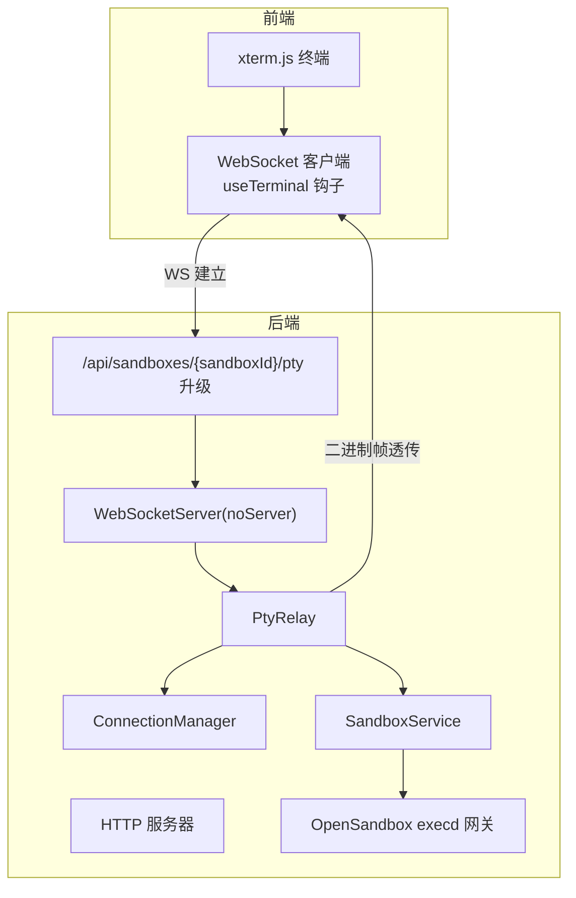
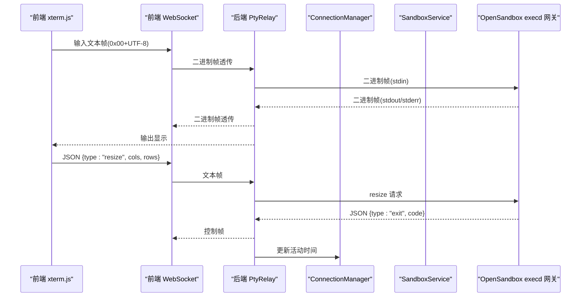
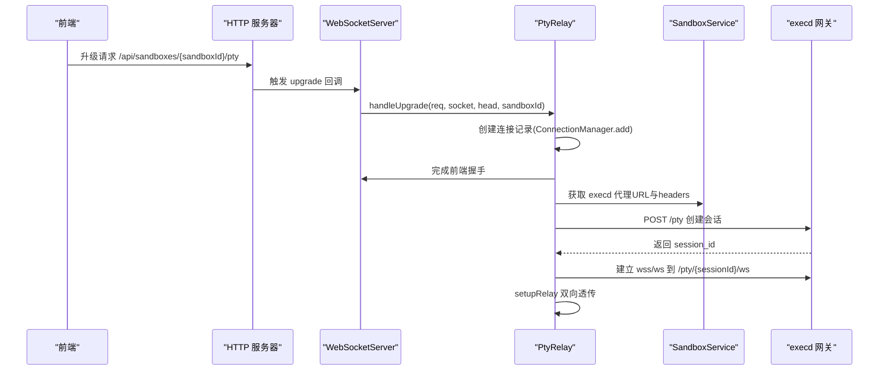
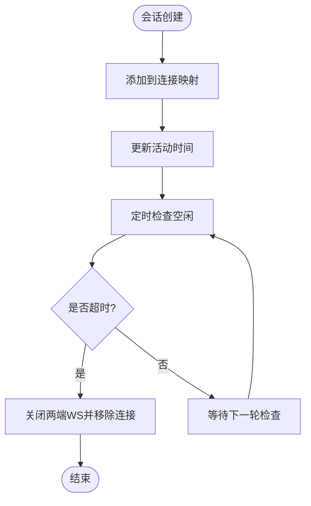
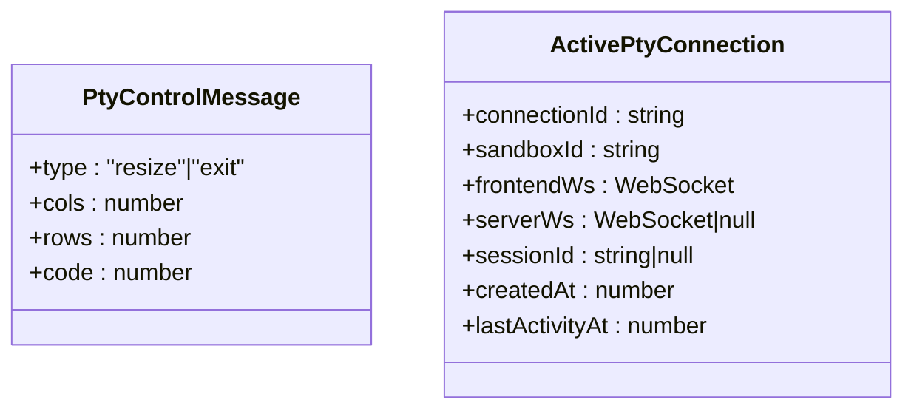
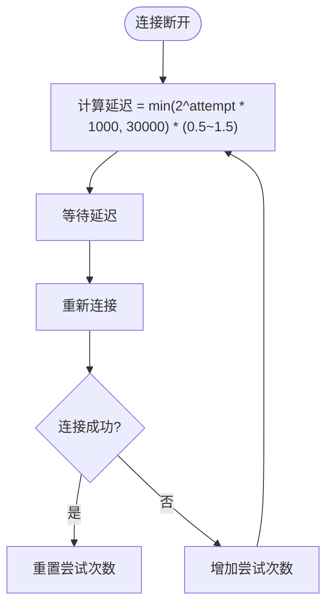
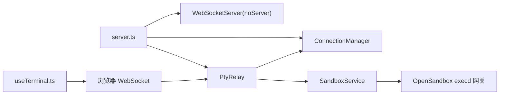

# WebSocket API

<cite>
**本文引用的文件**
- [apps/backend/src/websocket/connectionManager.ts](file://apps/backend/src/websocket/connectionManager.ts)
- [apps/backend/src/websocket/ptyRelay.ts](file://apps/backend/src/websocket/ptyRelay.ts)
- [apps/backend/src/websocket/types.ts](file://apps/backend/src/websocket/types.ts)
- [apps/backend/src/server.ts](file://apps/backend/src/server.ts)
- [apps/backend/src/config.ts](file://apps/backend/src/config.ts)
- [apps/backend/src/services/sandboxService.ts](file://apps/backend/src/services/sandboxService.ts)
- [apps/frontend/src/hooks/useTerminal.ts](file://apps/frontend/src/hooks/useTerminal.ts)
- [apps/frontend/src/components/terminal/TerminalPane.tsx](file://apps/frontend/src/components/terminal/TerminalPane.tsx)
- [apps/frontend/src/stores/terminalStore.ts](file://apps/frontend/src/stores/terminalStore.ts)
- [apps/backend/src/logger.ts](file://apps/backend/src/logger.ts)
- [apps/backend/src/middleware/error.ts](file://apps/backend/src/middleware/error.ts)
</cite>

## 目录
1. [简介](#简介)
2. [项目结构](#项目结构)
3. [核心组件](#核心组件)
4. [架构总览](#架构总览)
5. [详细组件分析](#详细组件分析)
6. [依赖关系分析](#依赖关系分析)
7. [性能考量](#性能考量)
8. [故障排查指南](#故障排查指南)
9. [结论](#结论)
10. [附录：协议与实现要点](#附录协议与实现要点)

## 简介
本文件为 Sandbox Manager 的 WebSocket API 协议文档，聚焦于实时终端连接（PTY）的建立、消息格式与数据帧结构、PTYSessions 生命周期管理、连接状态转换与会话超时处理、二进制帧透传机制、文本消息协议与控制消息格式、握手流程、认证与权限验证、错误处理与自动重连、异常恢复、事件类型与状态同步机制，并提供客户端实现示例、调试工具与性能优化建议。

## 项目结构
后端通过 HTTP 升级机制在特定路径上建立 WebSocket 连接，随后由 PTY 中继器完成双向数据透传与控制消息处理；前端使用 xterm.js 通过 WebSocket 与后端交互，实现终端输入输出与自适应窗口大小。

图表来源
- [apps/backend/src/server.ts:72-87](file://apps/backend/src/server.ts#L72-L87)
- [apps/backend/src/websocket/ptyRelay.ts:40-118](file://apps/backend/src/websocket/ptyRelay.ts#L40-L118)
- [apps/backend/src/websocket/connectionManager.ts:30-46](file://apps/backend/src/websocket/connectionManager.ts#L30-L46)
- [apps/backend/src/services/sandboxService.ts:129-138](file://apps/backend/src/services/sandboxService.ts#L129-L138)

章节来源
- [apps/backend/src/server.ts:36-90](file://apps/backend/src/server.ts#L36-L90)

## 核心组件
- WebSocket 升级与路由：后端监听 HTTP 升级事件，匹配 /api/sandboxes/{sandboxId}/pty 路径，调用 PTY 中继器完成握手与会话创建。
- PTY 中继器：负责前端 WebSocket 与 OpenSandbox execd 网关之间的透明二进制帧透传，同时处理控制消息（resize、exit）。
- 连接管理器：维护活跃连接映射、活动时间戳、空闲检测与清理。
- SandboxService：解析 execd 代理地址与请求头，用于构建后端到 execd 的 WebSocket。
- 前端终端钩子：负责连接建立、二进制帧解析、文本控制消息解析、自动重连与窗口适配。

章节来源
- [apps/backend/src/websocket/ptyRelay.ts:22-118](file://apps/backend/src/websocket/ptyRelay.ts#L22-L118)
- [apps/backend/src/websocket/connectionManager.ts:7-101](file://apps/backend/src/websocket/connectionManager.ts#L7-L101)
- [apps/backend/src/services/sandboxService.ts:112-138](file://apps/backend/src/services/sandboxService.ts#L112-L138)
- [apps/frontend/src/hooks/useTerminal.ts:12-179](file://apps/frontend/src/hooks/useTerminal.ts#L12-L179)

## 架构总览
WebSocket 终端数据通路如下：
- 前端 xterm.js 将用户输入编码为二进制帧（前缀 0x00），并将窗口尺寸变化以 JSON 文本帧发送。
- 后端 PTY 中继器将前端帧原样转发至 execd 网关。
- execd 将标准输出/错误以二进制帧回传（前缀 0x01/0x02），后端再回传给前端。
- 后端在收到退出码时，向前端发送 JSON 控制帧 {type:"exit", code:N}。

图表来源
- [apps/backend/src/websocket/ptyRelay.ts:120-169](file://apps/backend/src/websocket/ptyRelay.ts#L120-L169)
- [apps/backend/src/websocket/connectionManager.ts:80-83](file://apps/backend/src/websocket/connectionManager.ts#L80-L83)
- [apps/frontend/src/hooks/useTerminal.ts:127-144](file://apps/frontend/src/hooks/useTerminal.ts#L127-L144)

## 详细组件分析

### WebSocket 握手与升级流程
- 路径匹配：后端监听 HTTP 升级事件，仅对 /api/sandboxes/{sandboxId}/pty 放行。
- 前端握手：前端使用当前页面协议（ws/wss）拼接 /api/sandboxes/{sandboxId}/pty。
- 后端握手：后端完成前端 WebSocket 握手后，创建 PTY 会话，解析 execd 代理地址与请求头，建立到 execd 的 WebSocket，最后启动双向透传。

图表来源
- [apps/backend/src/server.ts:75-87](file://apps/backend/src/server.ts#L75-L87)
- [apps/backend/src/websocket/ptyRelay.ts:40-118](file://apps/backend/src/websocket/ptyRelay.ts#L40-L118)
- [apps/backend/src/services/sandboxService.ts:129-138](file://apps/backend/src/services/sandboxService.ts#L129-L138)

章节来源
- [apps/backend/src/server.ts:75-87](file://apps/backend/src/server.ts#L75-L87)
- [apps/backend/src/websocket/ptyRelay.ts:40-118](file://apps/backend/src/websocket/ptyRelay.ts#L40-L118)

### PTY 会话生命周期与状态管理
- 活跃连接映射：ConnectionManager 使用 Map 存储连接，包含连接 ID、沙箱 ID、前后端 WebSocket、会话 ID、创建与最后活动时间。
- 活动更新：每次收到消息即更新 lastActivityAt，用于空闲检测。
- 空闲检测：每分钟检查一次，超过 ptyIdleTimeoutMs 自动关闭并清理。
- 清理策略：连接关闭或错误时，确保两端 WebSocket 都被关闭，避免资源泄漏。

图表来源
- [apps/backend/src/websocket/connectionManager.ts:18-100](file://apps/backend/src/websocket/connectionManager.ts#L18-L100)

章节来源
- [apps/backend/src/websocket/connectionManager.ts:7-101](file://apps/backend/src/websocket/connectionManager.ts#L7-L101)

### 数据帧与消息协议
- 二进制帧透传（透明中继）
  - 前缀 0x00：stdin（客户端→execd）
  - 前缀 0x01：stdout（execd→客户端）
  - 前缀 0x02：stderr（execd→客户端）
- 文本帧控制
  - resize：{type:"resize", cols:number, rows:number}
  - exit：{type:"exit", code:number}

图表来源
- [apps/backend/src/websocket/types.ts:4-19](file://apps/backend/src/websocket/types.ts#L4-L19)

章节来源
- [apps/backend/src/websocket/ptyRelay.ts:15-21](file://apps/backend/src/websocket/ptyRelay.ts#L15-L21)
- [apps/backend/src/websocket/types.ts:4-19](file://apps/backend/src/websocket/types.ts#L4-L19)

### 认证与权限验证
- OpenSandbox 访问凭据：后端从环境变量加载 OPENSANDBOX_SERVER_URL、OPENSANDBOX_API_KEY，并在请求 execd 时携带 OPEN-SANDBOX-API-KEY 头。
- 代理请求头：SandboxService 解析 execd 端点时会合并返回的 headers，确保中继器能正确转发。
- 前端无显式认证：前端直接连接后端 WebSocket，后端负责与 OpenSandbox 通信。

章节来源
- [apps/backend/src/config.ts:48-70](file://apps/backend/src/config.ts#L48-L70)
- [apps/backend/src/services/sandboxService.ts:129-138](file://apps/backend/src/services/sandboxService.ts#L129-L138)
- [apps/backend/src/websocket/ptyRelay.ts:96-105](file://apps/backend/src/websocket/ptyRelay.ts#L96-L105)

### 错误处理与异常恢复
- 握手超时：前端握手超时或后端握手超时（10 秒）将导致连接失败并清理。
- 连接错误：任一侧 WebSocket 出错或关闭，后端均会移除连接并记录日志。
- 服务不可用：当未配置 OpenSandbox 时，REST 路由返回 503，避免无效操作。
- 日志与可观测性：后端使用 pino 记录详细上下文，便于定位问题。

章节来源
- [apps/backend/src/websocket/ptyRelay.ts:64-66](file://apps/backend/src/websocket/ptyRelay.ts#L64-L66)
- [apps/backend/src/websocket/ptyRelay.ts:110-117](file://apps/backend/src/websocket/ptyRelay.ts#L110-L117)
- [apps/backend/src/websocket/ptyRelay.ts:146-166](file://apps/backend/src/websocket/ptyRelay.ts#L146-L166)
- [apps/backend/src/middleware/error.ts:4-47](file://apps/backend/src/middleware/error.ts#L4-L47)
- [apps/backend/src/logger.ts:3-14](file://apps/backend/src/logger.ts#L3-L14)

### 自动重连机制
- 前端指数退避重连：断线后按 2^n 的延迟进行重连，最大不超过 30 秒，并加入抖动防止风暴。
- 连接状态反馈：前端显示连接状态、重连中与错误提示，便于用户感知。

图表来源
- [apps/frontend/src/hooks/useTerminal.ts:79-95](file://apps/frontend/src/hooks/useTerminal.ts#L79-L95)

章节来源
- [apps/frontend/src/hooks/useTerminal.ts:79-95](file://apps/frontend/src/hooks/useTerminal.ts#L79-L95)

### 状态同步与事件类型
- 前端事件：onopen/onmessage/onclose/onerror，分别处理连接建立、消息接收、断开与错误。
- 后端事件：前端/后端 WebSocket 的 message/close/error 事件驱动透传与清理。
- 退出事件：后端收到 execd 的退出控制帧后，向前端广播退出信息并关闭连接。

章节来源
- [apps/frontend/src/hooks/useTerminal.ts:35-95](file://apps/frontend/src/hooks/useTerminal.ts#L35-L95)
- [apps/backend/src/websocket/ptyRelay.ts:120-169](file://apps/backend/src/websocket/ptyRelay.ts#L120-L169)

## 依赖关系分析

图表来源
- [apps/backend/src/server.ts:36-90](file://apps/backend/src/server.ts#L36-L90)
- [apps/backend/src/websocket/ptyRelay.ts:22-38](file://apps/backend/src/websocket/ptyRelay.ts#L22-L38)
- [apps/backend/src/services/sandboxService.ts:112-138](file://apps/backend/src/services/sandboxService.ts#L112-L138)
- [apps/frontend/src/hooks/useTerminal.ts:25-95](file://apps/frontend/src/hooks/useTerminal.ts#L25-L95)

章节来源
- [apps/backend/src/server.ts:36-90](file://apps/backend/src/server.ts#L36-L90)

## 性能考量
- 二进制帧透传：避免额外编码/解码开销，降低 CPU 占用。
- 窗口自适应：前端在 onResize 时发送 JSON resize，减少不必要的渲染与缓冲区调整。
- 空闲超时：合理设置 ptyIdleTimeoutMs，避免长时间占用资源。
- 日志级别：生产环境建议使用 info 或更高级别，避免 debug 造成 IO 压力。
- 缓存与连接复用：SandboxService 对 Sandbox 实例使用 LRU 缓存，减少重复连接成本。

章节来源
- [apps/backend/src/config.ts:68-68](file://apps/backend/src/config.ts#L68-L68)
- [apps/backend/src/logger.ts:3-14](file://apps/backend/src/logger.ts#L3-L14)
- [apps/backend/src/services/sandboxService.ts:35-44](file://apps/backend/src/services/sandboxService.ts#L35-L44)

## 故障排查指南
- 握手失败
  - 检查 /api/sandboxes/{sandboxId}/pty 路径是否正确。
  - 查看后端日志中的握手超时与错误信息。
- PTY 会话创建失败
  - 确认 OpenSandbox 已配置且可访问。
  - 检查 execd 代理 URL 与请求头是否正确返回。
- 连接频繁断开
  - 检查网络稳定性与防火墙策略。
  - 查看前端重连日志与退避参数。
- 输出乱码或无输出
  - 确认二进制帧前缀与文本帧格式正确。
  - 检查终端字体与字符集设置。
- 资源泄漏
  - 确认连接关闭时两端 WebSocket 都被关闭。
  - 检查空闲检测是否正常运行。

章节来源
- [apps/backend/src/websocket/ptyRelay.ts:64-66](file://apps/backend/src/websocket/ptyRelay.ts#L64-L66)
- [apps/backend/src/websocket/ptyRelay.ts:110-117](file://apps/backend/src/websocket/ptyRelay.ts#L110-L117)
- [apps/backend/src/websocket/ptyRelay.ts:146-166](file://apps/backend/src/websocket/ptyRelay.ts#L146-L166)
- [apps/backend/src/websocket/connectionManager.ts:48-66](file://apps/backend/src/websocket/connectionManager.ts#L48-L66)

## 结论
该 WebSocket API 通过透明二进制帧透传与简洁的文本控制帧，实现了高效的终端交互。后端采用连接管理与空闲检测保障资源健康，前端提供完善的自动重连与状态反馈。整体设计清晰、扩展性强，适合在容器化与云原生环境中稳定运行。

## 附录：协议与实现要点

### WebSocket 路径与握手
- 路径：/api/sandboxes/{sandboxId}/pty
- 前端协议：根据页面协议选择 ws/wss
- 握手超时：10 秒

章节来源
- [apps/backend/src/server.ts:75-87](file://apps/backend/src/server.ts#L75-L87)
- [apps/frontend/src/hooks/useTerminal.ts:28-31](file://apps/frontend/src/hooks/useTerminal.ts#L28-L31)

### 二进制帧格式
- 0x00 + UTF-8 字节：stdin（客户端→execd）
- 0x01 + 字节流：stdout（execd→客户端）
- 0x02 + 字节流：stderr（execd→客户端）

章节来源
- [apps/backend/src/websocket/ptyRelay.ts:15-21](file://apps/backend/src/websocket/ptyRelay.ts#L15-L21)
- [apps/frontend/src/hooks/useTerminal.ts:51-62](file://apps/frontend/src/hooks/useTerminal.ts#L51-L62)

### 文本控制帧
- resize：{type:"resize", cols:number, rows:number}
- exit：{type:"exit", code:number}

章节来源
- [apps/backend/src/websocket/ptyRelay.ts:20-21](file://apps/backend/src/websocket/ptyRelay.ts#L20-L21)
- [apps/frontend/src/hooks/useTerminal.ts:64-77](file://apps/frontend/src/hooks/useTerminal.ts#L64-L77)

### 认证与权限
- OpenSandbox API Key：通过 OPEN-SANDBOX-API-KEY 头传递
- 代理请求头：SandboxService 合并 execd 返回的 headers

章节来源
- [apps/backend/src/config.ts:48-70](file://apps/backend/src/config.ts#L48-L70)
- [apps/backend/src/services/sandboxService.ts:129-138](file://apps/backend/src/services/sandboxService.ts#L129-L138)
- [apps/backend/src/websocket/ptyRelay.ts:96-105](file://apps/backend/src/websocket/ptyRelay.ts#L96-L105)

### 连接状态与生命周期
- 活动更新：每次收到消息更新 lastActivityAt
- 空闲超时：ptyIdleTimeoutMs，默认 300000ms
- 清理：关闭两端 WebSocket 并从映射中移除

章节来源
- [apps/backend/src/websocket/connectionManager.ts:80-100](file://apps/backend/src/websocket/connectionManager.ts#L80-L100)

### 前端实现要点
- 终端初始化：xterm.js + FitAddon + WebLinksAddon
- 输入处理：将输入编码为 0x00 前缀的二进制帧
- 窗口适配：onResize 发送 JSON resize
- 重连策略：指数退避 + 抖动，最大 30 秒

章节来源
- [apps/frontend/src/hooks/useTerminal.ts:102-144](file://apps/frontend/src/hooks/useTerminal.ts#L102-L144)
- [apps/frontend/src/hooks/useTerminal.ts:79-95](file://apps/frontend/src/hooks/useTerminal.ts#L79-L95)

### 状态同步与 UI 反馈
- 连接状态：connected/reconnecting/error
- UI 展示：TerminalPane 显示连接状态与重连指示

章节来源
- [apps/frontend/src/components/terminal/TerminalPane.tsx:8-37](file://apps/frontend/src/components/terminal/TerminalPane.tsx#L8-L37)
- [apps/frontend/src/hooks/useTerminal.ts:21-24](file://apps/frontend/src/hooks/useTerminal.ts#L21-L24)