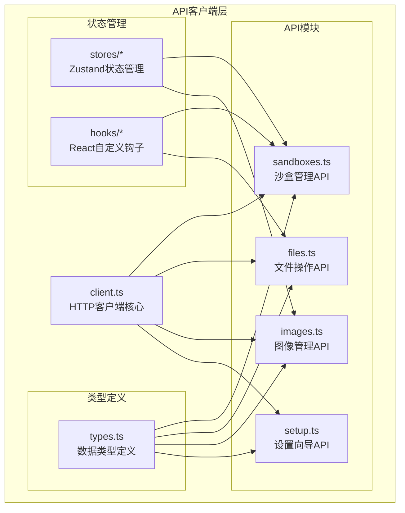
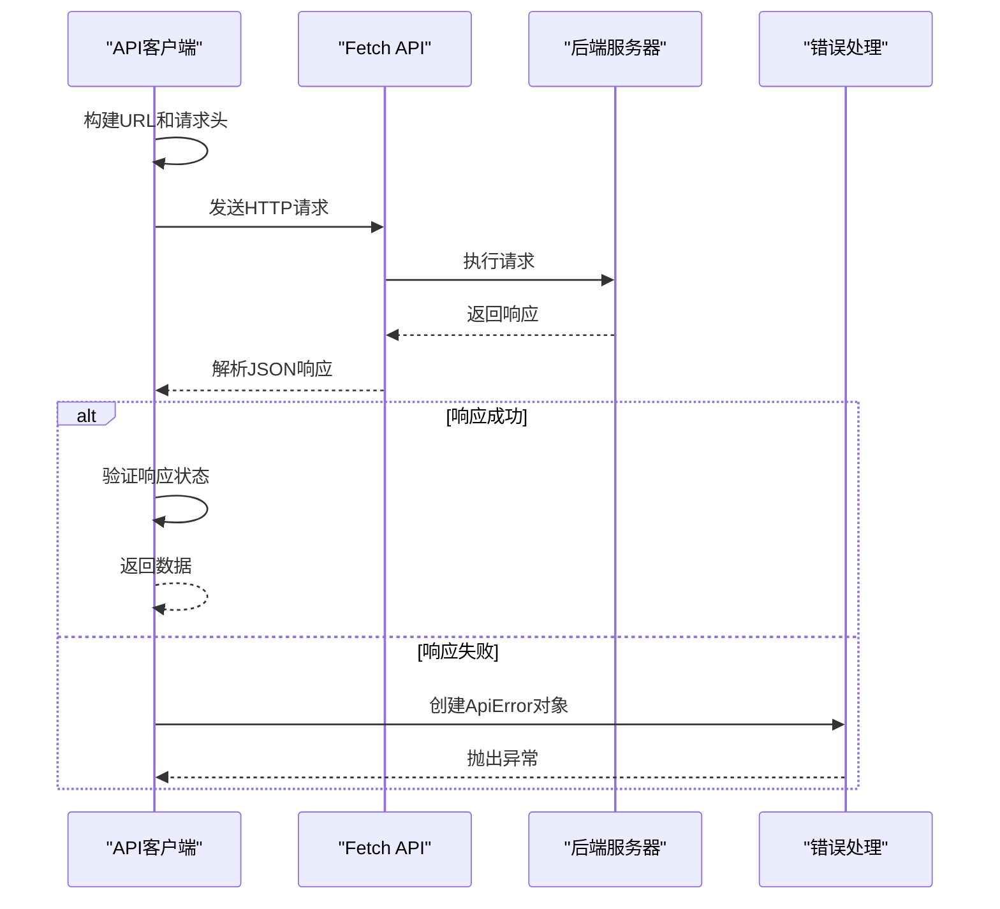
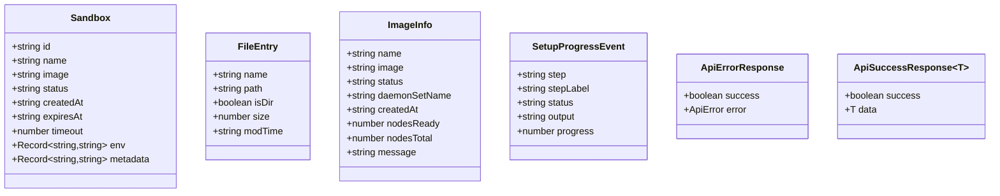
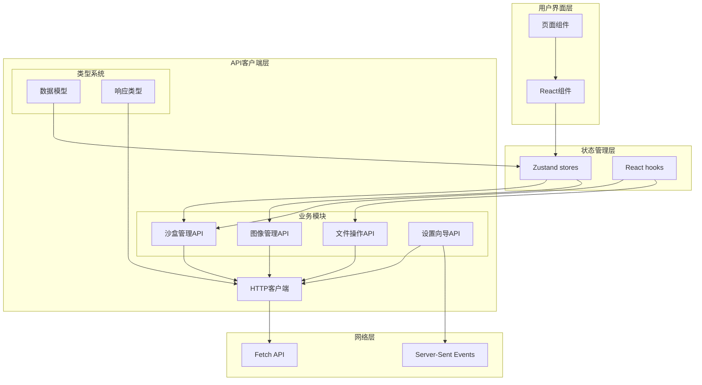
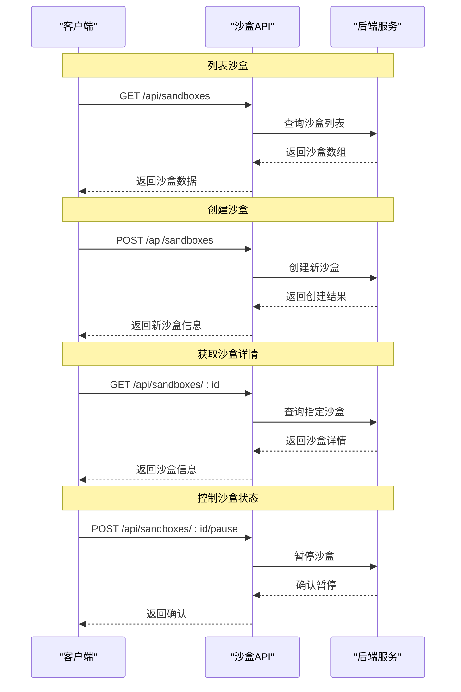
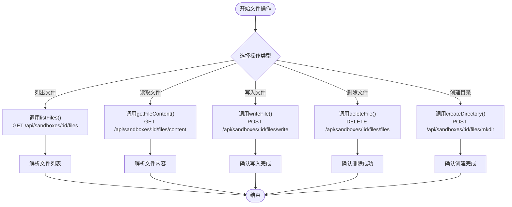
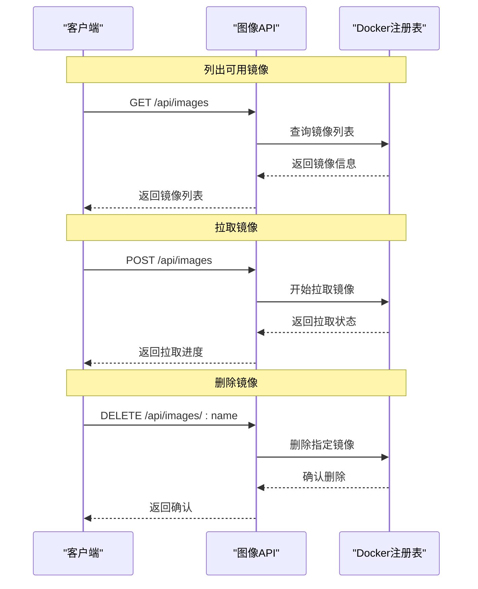
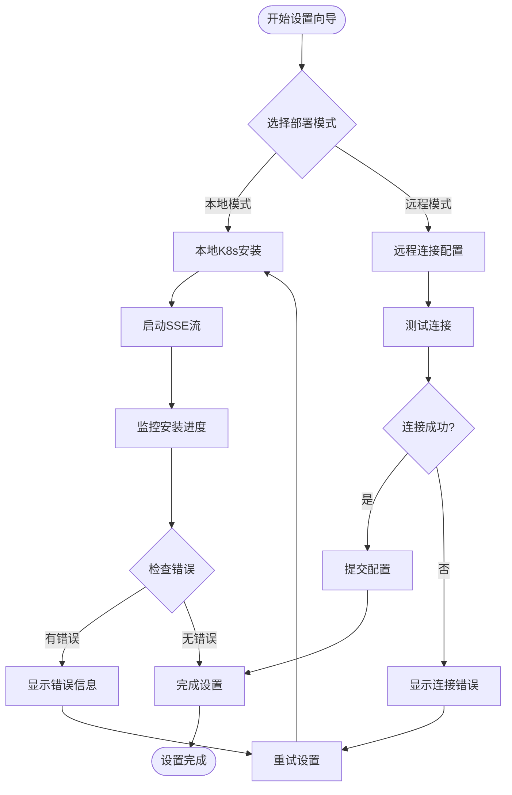
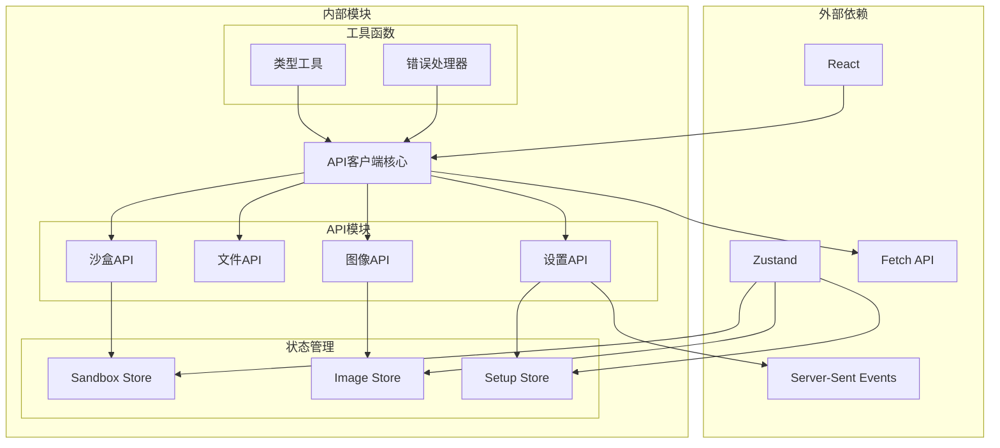

# API客户端层

<cite>
**本文档引用的文件**
- [apps/frontend/src/api/client.ts](file://apps/frontend/src/api/client.ts)
- [apps/frontend/src/api/types.ts](file://apps/frontend/src/api/types.ts)
- [apps/frontend/src/api/sandboxes.ts](file://apps/frontend/src/api/sandboxes.ts)
- [apps/frontend/src/api/files.ts](file://apps/frontend/src/api/files.ts)
- [apps/frontend/src/api/images.ts](file://apps/frontend/src/api/images.ts)
- [apps/frontend/src/api/setup.ts](file://apps/frontend/src/api/setup.ts)
- [apps/frontend/src/stores/sandboxStore.ts](file://apps/frontend/src/stores/sandboxStore.ts)
- [apps/frontend/src/hooks/useSandbox.ts](file://apps/frontend/src/hooks/useSandbox.ts)
- [apps/frontend/src/stores/imageStore.ts](file://apps/frontend/src/stores/imageStore.ts)
- [apps/frontend/src/hooks/useFileTree.ts](file://apps/frontend/src/hooks/useFileTree.ts)
- [apps/frontend/src/stores/setupStore.ts](file://apps/frontend/src/stores/setupStore.ts)
- [apps/frontend/src/pages/SandboxPage.tsx](file://apps/frontend/src/pages/SandboxPage.tsx)
- [apps/frontend/src/pages/ImagesPage.tsx](file://apps/frontend/src/pages/ImagesPage.tsx)
- [apps/frontend/src/pages/SetupWizardPage.tsx](file://apps/frontend/src/pages/SetupWizardPage.tsx)
</cite>

## 目录
1. [简介](#简介)
2. [项目结构](#项目结构)
3. [核心组件](#核心组件)
4. [架构概览](#架构概览)
5. [详细组件分析](#详细组件分析)
6. [依赖关系分析](#依赖关系分析)
7. [性能考虑](#性能考虑)
8. [故障排除指南](#故障排除指南)
9. [结论](#结论)

## 简介

Sandbox Manager前端API客户端层是一个基于TypeScript构建的现代化HTTP客户端系统，专为管理Kubernetes AI沙盒环境而设计。该系统采用模块化架构，提供了完整的API封装、类型安全的接口定义、以及完善的错误处理机制。

本API客户端层的核心特点包括：
- 基于原生fetch的轻量级HTTP客户端
- 完整的TypeScript类型定义和验证
- 模块化的API模块设计（沙盒管理、文件操作、图像管理、设置向导）
- 实时数据流支持（SSE）
- 组件级别的状态管理和缓存策略

## 项目结构

API客户端层位于前端应用的`src/api`目录下，采用按功能模块组织的架构模式：



**图表来源**
- [apps/frontend/src/api/client.ts:1-45](file://apps/frontend/src/api/client.ts#L1-L45)
- [apps/frontend/src/api/sandboxes.ts:1-40](file://apps/frontend/src/api/sandboxes.ts#L1-L40)
- [apps/frontend/src/api/files.ts:1-32](file://apps/frontend/src/api/files.ts#L1-L32)
- [apps/frontend/src/api/images.ts:1-23](file://apps/frontend/src/api/images.ts#L1-L23)
- [apps/frontend/src/api/setup.ts:1-73](file://apps/frontend/src/api/setup.ts#L1-L73)

**章节来源**
- [apps/frontend/src/api/client.ts:1-45](file://apps/frontend/src/api/client.ts#L1-L45)
- [apps/frontend/src/api/types.ts:1-146](file://apps/frontend/src/api/types.ts#L1-L146)

## 核心组件

### HTTP客户端核心

API客户端层的核心是一个基于原生fetch的轻量级HTTP客户端，提供了统一的请求处理机制：

#### 请求处理流程



**图表来源**
- [apps/frontend/src/api/client.ts:16-44](file://apps/frontend/src/api/client.ts#L16-L44)

#### 错误处理机制

API客户端实现了专门的错误处理机制，通过自定义的`ApiError`类提供详细的错误信息：

- **错误类型**：`ApiError`继承自原生Error类
- **错误属性**：包含错误代码、HTTP状态码和消息
- **错误传播**：在请求失败时抛出异常，供上层处理

**章节来源**
- [apps/frontend/src/api/client.ts:5-14](file://apps/frontend/src/api/client.ts#L5-L14)
- [apps/frontend/src/api/client.ts:38-41](file://apps/frontend/src/api/client.ts#L38-L41)

### 类型系统

API客户端层采用了完整的TypeScript类型系统，确保了类型安全和开发体验：

#### 数据模型层次结构



**图表来源**
- [apps/frontend/src/api/types.ts:1-146](file://apps/frontend/src/api/types.ts#L1-L146)

**章节来源**
- [apps/frontend/src/api/types.ts:1-146](file://apps/frontend/src/api/types.ts#L1-L146)

## 架构概览

API客户端层采用分层架构设计，从底层的HTTP客户端到高层的业务逻辑模块：



**图表来源**
- [apps/frontend/src/api/client.ts:1-45](file://apps/frontend/src/api/client.ts#L1-L45)
- [apps/frontend/src/api/sandboxes.ts:1-40](file://apps/frontend/src/api/sandboxes.ts#L1-L40)
- [apps/frontend/src/api/files.ts:1-32](file://apps/frontend/src/api/files.ts#L1-L32)
- [apps/frontend/src/api/images.ts:1-23](file://apps/frontend/src/api/images.ts#L1-L23)
- [apps/frontend/src/api/setup.ts:1-73](file://apps/frontend/src/api/setup.ts#L1-L73)

## 详细组件分析

### 沙盒管理API模块

沙盒管理API模块负责管理Kubernetes沙盒的生命周期，提供了完整的CRUD操作和状态控制功能。

#### API端点设计



**图表来源**
- [apps/frontend/src/api/sandboxes.ts:4-39](file://apps/frontend/src/api/sandboxes.ts#L4-L39)

#### 状态管理集成

沙盒API与状态管理系统紧密集成，提供了自动刷新和状态同步功能：

- **自动轮询**：对于创建中、暂停中、恢复中的沙盒，每3秒自动刷新状态
- **实时更新**：状态变更时立即更新本地状态
- **错误处理**：网络错误时提供清晰的错误信息

**章节来源**
- [apps/frontend/src/api/sandboxes.ts:1-40](file://apps/frontend/src/api/sandboxes.ts#L1-L40)
- [apps/frontend/src/stores/sandboxStore.ts:16-62](file://apps/frontend/src/stores/sandboxStore.ts#L16-L62)
- [apps/frontend/src/hooks/useSandbox.ts:12-55](file://apps/frontend/src/hooks/useSandbox.ts#L12-L55)

### 文件操作API模块

文件操作API模块提供了对沙盒内文件系统的完整访问能力，支持文件浏览、读取、写入和删除操作。

#### 文件系统操作流程



**图表来源**
- [apps/frontend/src/api/files.ts:4-31](file://apps/frontend/src/api/files.ts#L4-L31)

#### 文件树管理策略

文件树组件实现了智能的懒加载和缓存机制：

- **延迟加载**：仅在展开目录时才加载子文件
- **失败重试**：记录失败的目录，允许用户重新尝试
- **状态跟踪**：跟踪加载状态和展开状态
- **错误隔离**：单个目录的错误不影响其他目录

**章节来源**
- [apps/frontend/src/api/files.ts:1-32](file://apps/frontend/src/api/files.ts#L1-L32)
- [apps/frontend/src/hooks/useFileTree.ts:12-32](file://apps/frontend/src/hooks/useFileTree.ts#L12-L32)

### 图像管理API模块

图像管理API模块专注于Docker镜像的生命周期管理，提供了完整的镜像操作功能。

#### 镜像管理流程



**图表来源**
- [apps/frontend/src/api/images.ts:4-22](file://apps/frontend/src/api/images.ts#L4-L22)

#### 状态监控机制

图像API提供了实时的状态监控功能：

- **拉取状态**：实时跟踪镜像拉取进度
- **节点分布**：显示镜像在集群中的分布情况
- **缓存管理**：查询节点上的镜像缓存信息

**章节来源**
- [apps/frontend/src/api/images.ts:1-23](file://apps/frontend/src/api/images.ts#L1-L23)
- [apps/frontend/src/stores/imageStore.ts:17-59](file://apps/frontend/src/stores/imageStore.ts#L17-L59)

### 设置向导API模块

设置向导API模块提供了完整的系统配置和连接测试功能，支持本地和远程两种部署模式。

#### 设置向导工作流程



**图表来源**
- [apps/frontend/src/api/setup.ts:29-72](file://apps/frontend/src/api/setup.ts#L29-L72)

#### 实时进度监控

设置向导使用Server-Sent Events (SSE) 实现实时进度监控：

- **事件流**：持续接收安装进度事件
- **错误处理**：优雅处理连接中断和错误事件
- **状态同步**：实时更新UI状态和进度条
- **清理机制**：自动关闭连接和清理资源

**章节来源**
- [apps/frontend/src/api/setup.ts:1-73](file://apps/frontend/src/api/setup.ts#L1-L73)
- [apps/frontend/src/stores/setupStore.ts:41-97](file://apps/frontend/src/stores/setupStore.ts#L41-L97)

## 依赖关系分析

API客户端层的依赖关系体现了清晰的分层架构和模块化设计：



**图表来源**
- [apps/frontend/src/api/client.ts:1-45](file://apps/frontend/src/api/client.ts#L1-L45)
- [apps/frontend/src/api/sandboxes.ts:1-40](file://apps/frontend/src/api/sandboxes.ts#L1-L40)
- [apps/frontend/src/api/files.ts:1-32](file://apps/frontend/src/api/files.ts#L1-L32)
- [apps/frontend/src/api/images.ts:1-23](file://apps/frontend/src/api/images.ts#L1-L23)
- [apps/frontend/src/api/setup.ts:1-73](file://apps/frontend/src/api/setup.ts#L1-L73)

### 模块间耦合度分析

API客户端层实现了低耦合的模块设计：

- **API模块独立性**：每个API模块都完全独立，可单独使用
- **共享依赖最小化**：只有HTTP客户端核心被多个模块共享
- **类型系统解耦**：通过TypeScript类型定义实现编译时解耦
- **状态管理分离**：业务逻辑与状态管理职责明确分离

**章节来源**
- [apps/frontend/src/api/types.ts:1-146](file://apps/frontend/src/api/types.ts#L1-L146)
- [apps/frontend/src/stores/sandboxStore.ts:1-63](file://apps/frontend/src/stores/sandboxStore.ts#L1-L63)

## 性能考虑

API客户端层在设计时充分考虑了性能优化和用户体验：

### 缓存策略

- **智能缓存**：沙盒状态使用Zustand进行内存缓存
- **失效策略**：沙盒状态定期刷新，避免过期数据
- **增量更新**：状态变更时只更新相关部分
- **持久化支持**：可扩展为支持本地存储

### 网络优化

- **批量请求**：支持查询参数过滤，减少不必要的数据传输
- **并发控制**：合理控制并发请求数量
- **超时处理**：为长耗时操作设置合理的超时时间
- **重试机制**：对临时性错误提供自动重试

### 内存管理

- **资源清理**：SSE连接在组件卸载时自动清理
- **状态释放**：不再使用的状态及时释放内存
- **事件监听器**：正确移除事件监听器避免内存泄漏

## 故障排除指南

### 常见问题诊断

#### 连接问题

**症状**：API请求返回网络错误或超时
**可能原因**：
- 后端服务不可达
- CORS配置问题
- 网络连接不稳定

**解决方案**：
- 检查后端服务状态
- 验证CORS配置
- 使用浏览器开发者工具检查网络请求

#### 认证问题

**症状**：API返回401或403错误
**可能原因**：
- 缺少必要的认证头
- 会话过期
- 权限不足

**解决方案**：
- 检查认证头是否正确设置
- 实现会话刷新机制
- 验证用户权限

#### 数据格式错误

**症状**：API返回400错误或数据解析失败
**可能原因**：
- 请求体格式不正确
- 缺少必需字段
- 数据类型不匹配

**解决方案**：
- 使用TypeScript类型定义验证数据
- 实现前端数据验证
- 检查API文档的参数要求

### 调试技巧

#### 开发者工具使用

- **Network面板**：监控HTTP请求和响应
- **Console面板**：查看错误日志和警告
- **Sources面板**：设置断点调试异步代码

#### 日志记录

```typescript
// 建议的日志记录模式
const logRequest = (method: string, url: string, body?: any) => {
  console.debug(`API Request: ${method} ${url}`, {
    body: body ? JSON.stringify(body) : undefined,
    timestamp: Date.now()
  });
};

const logResponse = (url: string, response: any) => {
  console.debug(`API Response: ${url}`, {
    status: response.status,
    data: response.data,
    timestamp: Date.now()
  });
};
```

**章节来源**
- [apps/frontend/src/api/client.ts:38-41](file://apps/frontend/src/api/client.ts#L38-L41)
- [apps/frontend/src/stores/sandboxStore.ts:23-30](file://apps/frontend/src/stores/sandboxStore.ts#L23-L30)

## 结论

Sandbox Manager前端API客户端层展现了现代前端开发的最佳实践，通过以下关键特性实现了高质量的API封装：

### 设计优势

- **类型安全**：完整的TypeScript类型系统确保编译时类型检查
- **模块化设计**：清晰的功能模块划分便于维护和扩展
- **状态管理**：集成Zustand提供高效的状态管理方案
- **错误处理**：完善的错误处理机制提升用户体验
- **实时通信**：支持SSE实现实时数据流

### 技术亮点

- **轻量级架构**：基于原生fetch，避免额外依赖
- **响应式设计**：支持自动轮询和状态同步
- **缓存策略**：智能缓存和失效机制
- **性能优化**：合理的网络请求和内存管理

### 扩展建议

未来可以考虑的改进方向：
- 添加请求重试和指数退避策略
- 实现更精细的缓存控制
- 增加请求取消功能
- 支持API版本管理
- 添加离线模式支持

这个API客户端层为Sandbox Manager提供了坚实的技术基础，为后续的功能扩展和性能优化奠定了良好的基础。