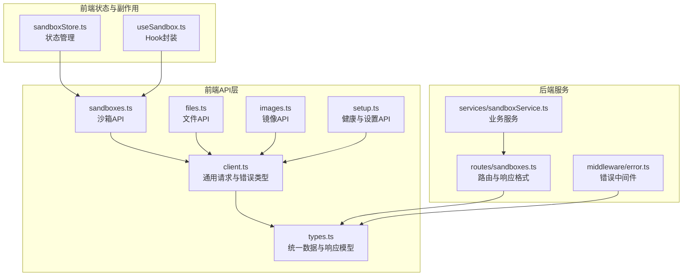
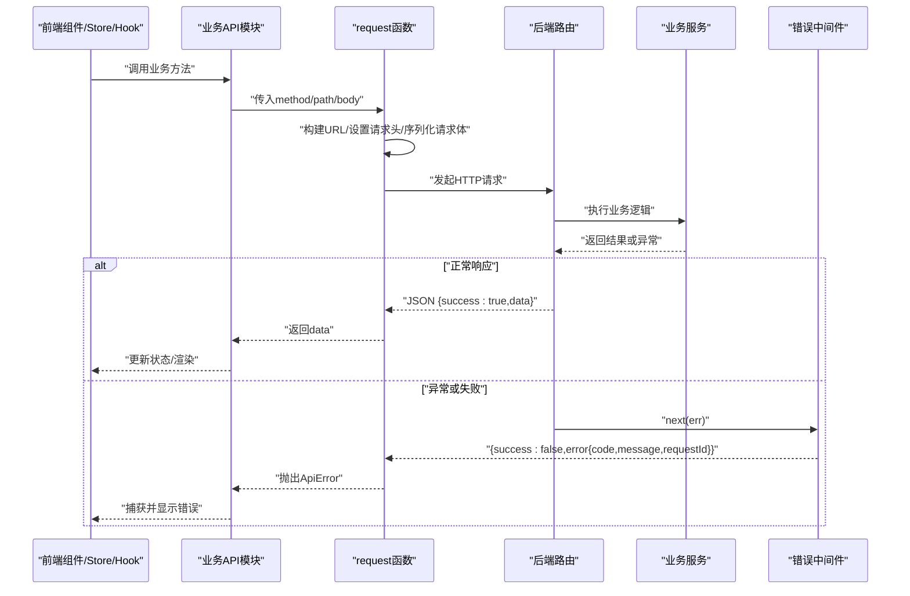
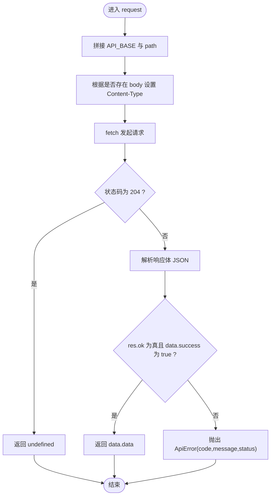
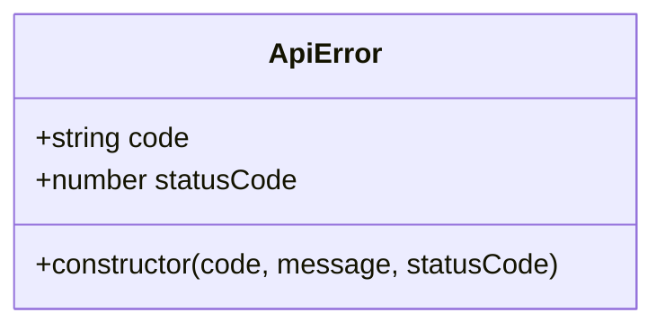
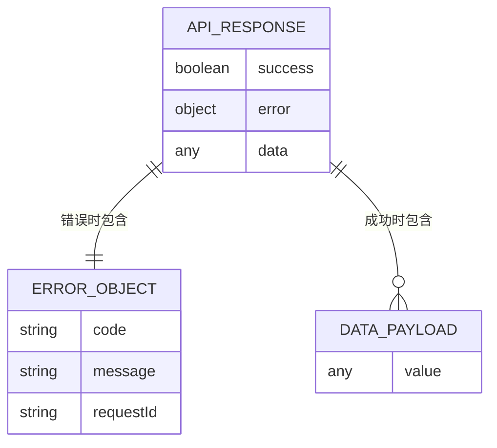
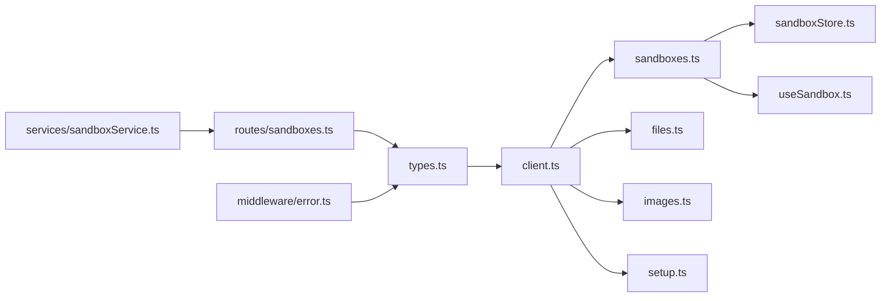

# HTTP客户端核心

<cite>
**本文档引用的文件**
- [apps/frontend/src/api/client.ts](file://apps/frontend/src/api/client.ts)
- [apps/frontend/src/api/types.ts](file://apps/frontend/src/api/types.ts)
- [apps/frontend/src/api/sandboxes.ts](file://apps/frontend/src/api/sandboxes.ts)
- [apps/frontend/src/api/files.ts](file://apps/frontend/src/api/files.ts)
- [apps/frontend/src/api/images.ts](file://apps/frontend/src/api/images.ts)
- [apps/frontend/src/api/setup.ts](file://apps/frontend/src/api/setup.ts)
- [apps/frontend/src/stores/sandboxStore.ts](file://apps/frontend/src/stores/sandboxStore.ts)
- [apps/frontend/src/hooks/useSandbox.ts](file://apps/frontend/src/hooks/useSandbox.ts)
- [apps/backend/src/middleware/error.ts](file://apps/backend/src/middleware/error.ts)
- [apps/backend/src/routes/sandboxes.ts](file://apps/backend/src/routes/sandboxes.ts)
- [apps/backend/src/services/sandboxService.ts](file://apps/backend/src/services/sandboxService.ts)
</cite>

## 目录
1. [简介](#简介)
2. [项目结构](#项目结构)
3. [核心组件](#核心组件)
4. [架构总览](#架构总览)
5. [详细组件分析](#详细组件分析)
6. [依赖关系分析](#依赖关系分析)
7. [性能考虑](#性能考虑)
8. [故障排除指南](#故障排除指南)
9. [结论](#结论)
10. [附录](#附录)

## 简介
本文件聚焦于Sandbox Manager前端API客户端的核心实现，系统性阐述HTTP请求封装、统一响应格式、错误类型与错误处理机制，并给出最佳实践、拦截器设计思路与调试技巧。目标是帮助开发者在不深入源码的情况下也能正确使用与扩展该HTTP客户端。

## 项目结构
前端API客户端位于apps/frontend/src/api目录，采用按功能模块拆分的组织方式：
- client.ts：通用HTTP客户端与统一错误类型
- types.ts：前后端统一的数据模型与响应结构定义
- 各业务模块文件（如sandboxes.ts、files.ts、images.ts、setup.ts）：基于client.ts封装具体API方法
- 前端状态与副作用层（stores与hooks）：消费API并处理UI状态

**图表来源**
- [apps/frontend/src/api/client.ts:1-45](file://apps/frontend/src/api/client.ts#L1-L45)
- [apps/frontend/src/api/types.ts:1-146](file://apps/frontend/src/api/types.ts#L1-L146)
- [apps/frontend/src/api/sandboxes.ts:1-40](file://apps/frontend/src/api/sandboxes.ts#L1-L40)
- [apps/frontend/src/api/files.ts:1-32](file://apps/frontend/src/api/files.ts#L1-L32)
- [apps/frontend/src/api/images.ts:1-23](file://apps/frontend/src/api/images.ts#L1-L23)
- [apps/frontend/src/api/setup.ts:1-73](file://apps/frontend/src/api/setup.ts#L1-L73)
- [apps/frontend/src/stores/sandboxStore.ts:1-63](file://apps/frontend/src/stores/sandboxStore.ts#L1-L63)
- [apps/frontend/src/hooks/useSandbox.ts:1-59](file://apps/frontend/src/hooks/useSandbox.ts#L1-L59)
- [apps/backend/src/routes/sandboxes.ts:1-175](file://apps/backend/src/routes/sandboxes.ts#L1-L175)
- [apps/backend/src/middleware/error.ts:1-48](file://apps/backend/src/middleware/error.ts#L1-L48)
- [apps/backend/src/services/sandboxService.ts:1-148](file://apps/backend/src/services/sandboxService.ts#L1-L148)

**章节来源**
- [apps/frontend/src/api/client.ts:1-45](file://apps/frontend/src/api/client.ts#L1-L45)
- [apps/frontend/src/api/types.ts:1-146](file://apps/frontend/src/api/types.ts#L1-L146)
- [apps/frontend/src/api/sandboxes.ts:1-40](file://apps/frontend/src/api/sandboxes.ts#L1-L40)
- [apps/frontend/src/api/files.ts:1-32](file://apps/frontend/src/api/files.ts#L1-L32)
- [apps/frontend/src/api/images.ts:1-23](file://apps/frontend/src/api/images.ts#L1-L23)
- [apps/frontend/src/api/setup.ts:1-73](file://apps/frontend/src/api/setup.ts#L1-L73)
- [apps/frontend/src/stores/sandboxStore.ts:1-63](file://apps/frontend/src/stores/sandboxStore.ts#L1-L63)
- [apps/frontend/src/hooks/useSandbox.ts:1-59](file://apps/frontend/src/hooks/useSandbox.ts#L1-L59)
- [apps/backend/src/routes/sandboxes.ts:1-175](file://apps/backend/src/routes/sandboxes.ts#L1-L175)
- [apps/backend/src/middleware/error.ts:1-48](file://apps/backend/src/middleware/error.ts#L1-L48)
- [apps/backend/src/services/sandboxService.ts:1-148](file://apps/backend/src/services/sandboxService.ts#L1-L148)

## 核心组件
- 统一请求函数request：封装URL拼接、请求头设置、JSON序列化与响应解析，支持204无内容返回与统一错误抛出
- 错误类型ApiError：承载后端错误码、HTTP状态码与错误消息，便于上层统一处理
- 统一响应模型：ApiErrorResponse与ApiSuccessResponse，确保前后端一致的响应结构
- 业务API模块：基于request封装具体REST接口，如沙箱、文件、镜像、设置等

关键实现要点：
- URL构建：固定前缀/API_BASE + 路径参数，自动拼接查询字符串
- 请求头：仅当存在请求体时添加Content-Type: application/json
- JSON序列化：对请求体进行JSON.stringify，响应体通过res.json解析
- 成功与错误分支：204视为无返回体；非204且success=false或res.ok为false时抛出ApiError
- 错误消息：优先使用后端error对象的code与message，兜底为“UNKNOWN”和“Request failed”

**章节来源**
- [apps/frontend/src/api/client.ts:16-44](file://apps/frontend/src/api/client.ts#L16-L44)
- [apps/frontend/src/api/types.ts:49-61](file://apps/frontend/src/api/types.ts#L49-L61)

## 架构总览
下图展示从前端API调用到后端路由与错误处理的整体流程，以及错误在两端的映射关系。

**图表来源**
- [apps/frontend/src/api/sandboxes.ts:1-40](file://apps/frontend/src/api/sandboxes.ts#L1-L40)
- [apps/frontend/src/api/client.ts:16-44](file://apps/frontend/src/api/client.ts#L16-L44)
- [apps/backend/src/routes/sandboxes.ts:62-175](file://apps/backend/src/routes/sandboxes.ts#L62-L175)
- [apps/backend/src/middleware/error.ts:5-31](file://apps/backend/src/middleware/error.ts#L5-L31)

## 详细组件分析

### request函数实现原理
- URL构建：将API_BASE与path拼接，查询参数由各业务模块自行构造并附加到路径
- 请求头设置：仅在存在body时设置Content-Type
- JSON序列化：请求体序列化，响应体解析为JSON对象
- 响应处理：
  - 204直接返回undefined
  - 非204时检查success字段与res.ok，失败则抛出ApiError
  - 成功时返回data字段

**图表来源**
- [apps/frontend/src/api/client.ts:16-44](file://apps/frontend/src/api/client.ts#L16-L44)

**章节来源**
- [apps/frontend/src/api/client.ts:16-44](file://apps/frontend/src/api/client.ts#L16-L44)

### ApiError类设计与错误处理机制
- 设计目的：统一前端错误表示，包含错误码、消息与HTTP状态码
- 错误码映射：后端错误中间件将异常分类映射为HTTP状态码，前端通过ApiError.statusCode获取
- 消息格式化：优先使用后端error对象的code与message，兜底为“UNKNOWN”和“Request failed”
- 使用建议：在UI层根据code与message进行本地化与用户提示，结合状态码做重试策略

**图表来源**
- [apps/frontend/src/api/client.ts:5-14](file://apps/frontend/src/api/client.ts#L5-L14)

**章节来源**
- [apps/frontend/src/api/client.ts:5-14](file://apps/frontend/src/api/client.ts#L5-L14)
- [apps/backend/src/middleware/error.ts:33-47](file://apps/backend/src/middleware/error.ts#L33-L47)

### 统一响应格式处理
- 成功响应：{success:true,data:T}
- 错误响应：{success:false,error:{code,message,requestId?}}
- 解析逻辑：request函数在非204情况下读取data并判断success字段，失败即抛出ApiError
- 后端规范：路由层严格返回统一结构，错误通过中间件转换

**图表来源**
- [apps/frontend/src/api/types.ts:49-61](file://apps/frontend/src/api/types.ts#L49-L61)
- [apps/backend/src/middleware/error.ts:23-30](file://apps/backend/src/middleware/error.ts#L23-L30)

**章节来源**
- [apps/frontend/src/api/types.ts:49-61](file://apps/frontend/src/api/types.ts#L49-L61)
- [apps/backend/src/middleware/error.ts:23-30](file://apps/backend/src/middleware/error.ts#L23-L30)

### 请求拦截器与响应拦截器设计思路
- 请求拦截器：可在request函数中注入通用头部（如鉴权）、请求ID、超时控制、重试策略
- 响应拦截器：在request函数中统一处理204、success字段、错误抛出与日志记录
- 实现细节：
  - 在request内部增加headers扩展点，支持在业务模块中传入额外头部
  - 在响应解析后增加可插拔的后处理钩子，用于统计、埋点或缓存
  - 对特定状态码（如401、403）进行全局登出处理

[本节为概念性设计说明，未直接分析具体文件，故不附“章节来源”]

### API调用最佳实践
- 参数校验：在业务模块中对输入参数进行校验，减少无效请求
- 查询参数：使用URLSearchParams构造查询串，避免手动拼接
- 幂等性：对幂等操作（GET/HEAD/PUT/DELETE）可启用重试，对非幂等操作谨慎重试
- 错误分类：区分网络错误、业务错误与未知错误，分别处理
- 用户反馈：结合ApiError.code与message进行本地化提示，必要时提供重试按钮
- 缓存策略：对只读数据（如镜像列表、健康状态）可引入缓存与失效策略

**章节来源**
- [apps/frontend/src/api/sandboxes.ts:4-15](file://apps/frontend/src/api/sandboxes.ts#L4-L15)
- [apps/frontend/src/api/setup.ts:33-72](file://apps/frontend/src/api/setup.ts#L33-L72)

### 调试技巧
- 开发工具：使用浏览器网络面板观察请求头、响应体与状态码
- 日志：在request函数中增加日志输出，记录URL、方法、请求体与响应摘要
- 错误定位：优先查看ApiError.statusCode与后端错误中间件生成的requestId
- 后端联调：通过后端日志与错误中间件输出，确认异常分类与状态码映射

**章节来源**
- [apps/frontend/src/api/client.ts:16-44](file://apps/frontend/src/api/client.ts#L16-L44)
- [apps/backend/src/middleware/error.ts:18-21](file://apps/backend/src/middleware/error.ts#L18-L21)

## 依赖关系分析
- 前端API模块依赖client.ts提供的request与ApiError
- 前端状态与副作用层（store与hook）依赖各业务API模块
- 后端路由依赖统一响应模型，错误通过中间件统一转换
- 业务服务负责实际调用外部SDK并返回数据给路由

**图表来源**
- [apps/frontend/src/api/types.ts:1-146](file://apps/frontend/src/api/types.ts#L1-L146)
- [apps/frontend/src/api/client.ts:1-45](file://apps/frontend/src/api/client.ts#L1-L45)
- [apps/frontend/src/api/sandboxes.ts:1-40](file://apps/frontend/src/api/sandboxes.ts#L1-L40)
- [apps/frontend/src/api/files.ts:1-32](file://apps/frontend/src/api/files.ts#L1-L32)
- [apps/frontend/src/api/images.ts:1-23](file://apps/frontend/src/api/images.ts#L1-L23)
- [apps/frontend/src/api/setup.ts:1-73](file://apps/frontend/src/api/setup.ts#L1-L73)
- [apps/frontend/src/stores/sandboxStore.ts:1-63](file://apps/frontend/src/stores/sandboxStore.ts#L1-L63)
- [apps/frontend/src/hooks/useSandbox.ts:1-59](file://apps/frontend/src/hooks/useSandbox.ts#L1-L59)
- [apps/backend/src/routes/sandboxes.ts:1-175](file://apps/backend/src/routes/sandboxes.ts#L1-L175)
- [apps/backend/src/middleware/error.ts:1-48](file://apps/backend/src/middleware/error.ts#L1-L48)
- [apps/backend/src/services/sandboxService.ts:1-148](file://apps/backend/src/services/sandboxService.ts#L1-L148)

**章节来源**
- [apps/frontend/src/api/client.ts:1-45](file://apps/frontend/src/api/client.ts#L1-L45)
- [apps/frontend/src/api/types.ts:1-146](file://apps/frontend/src/api/types.ts#L1-L146)
- [apps/frontend/src/api/sandboxes.ts:1-40](file://apps/frontend/src/api/sandboxes.ts#L1-L40)
- [apps/frontend/src/api/files.ts:1-32](file://apps/frontend/src/api/files.ts#L1-L32)
- [apps/frontend/src/api/images.ts:1-23](file://apps/frontend/src/api/images.ts#L1-L23)
- [apps/frontend/src/api/setup.ts:1-73](file://apps/frontend/src/api/setup.ts#L1-L73)
- [apps/frontend/src/stores/sandboxStore.ts:1-63](file://apps/frontend/src/stores/sandboxStore.ts#L1-L63)
- [apps/frontend/src/hooks/useSandbox.ts:1-59](file://apps/frontend/src/hooks/useSandbox.ts#L1-L59)
- [apps/backend/src/routes/sandboxes.ts:1-175](file://apps/backend/src/routes/sandboxes.ts#L1-L175)
- [apps/backend/src/middleware/error.ts:1-48](file://apps/backend/src/middleware/error.ts#L1-L48)
- [apps/backend/src/services/sandboxService.ts:1-148](file://apps/backend/src/services/sandboxService.ts#L1-L148)

## 性能考虑
- 减少不必要的请求：对只读数据使用缓存，合理设置过期时间
- 批量请求：合并多个小请求为批量请求，降低网络开销
- 压缩与分页：后端已支持分页参数，前端应配合使用
- 连接复用：浏览器fetch默认复用连接，避免频繁创建销毁
- 超时与重试：为关键请求设置合理超时与指数退避重试

[本节提供一般性指导，未直接分析具体文件，故不附“章节来源”]

## 故障排除指南
- 网络错误：检查API_BASE与代理配置，确认CORS与跨域设置
- 业务错误：查看ApiError.code与message，结合后端日志定位问题
- 204无内容：确认后端是否按约定返回204，前端无需解析data
- 请求头问题：确保仅在有body时设置Content-Type
- SSE连接：setup模块的SSE流需正确处理error事件与JSON解析

**章节来源**
- [apps/frontend/src/api/client.ts:16-44](file://apps/frontend/src/api/client.ts#L16-L44)
- [apps/frontend/src/api/setup.ts:33-72](file://apps/frontend/src/api/setup.ts#L33-L72)
- [apps/backend/src/middleware/error.ts:18-21](file://apps/backend/src/middleware/error.ts#L18-L21)

## 结论
该HTTP客户端通过简洁的request函数与统一的响应/错误模型，实现了前后端一致的交互体验。结合后端严格的错误中间件与路由规范，整体具备良好的可维护性与可扩展性。建议在现有基础上增强拦截器能力与缓存策略，进一步提升用户体验与性能表现。

## 附录
- 常见错误码映射参考（后端中间件）
  - SandboxApiException/SandboxReadyTimeoutException/InvalidArgumentException/SandboxException/SandboxInternalException：映射至4xx/5xx
  - JSON解析失败：映射至400
  - 其他：默认500

**章节来源**
- [apps/backend/src/middleware/error.ts:33-47](file://apps/backend/src/middleware/error.ts#L33-L47)