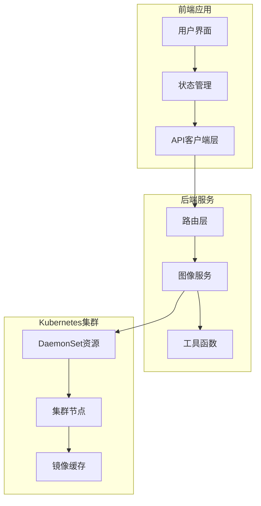
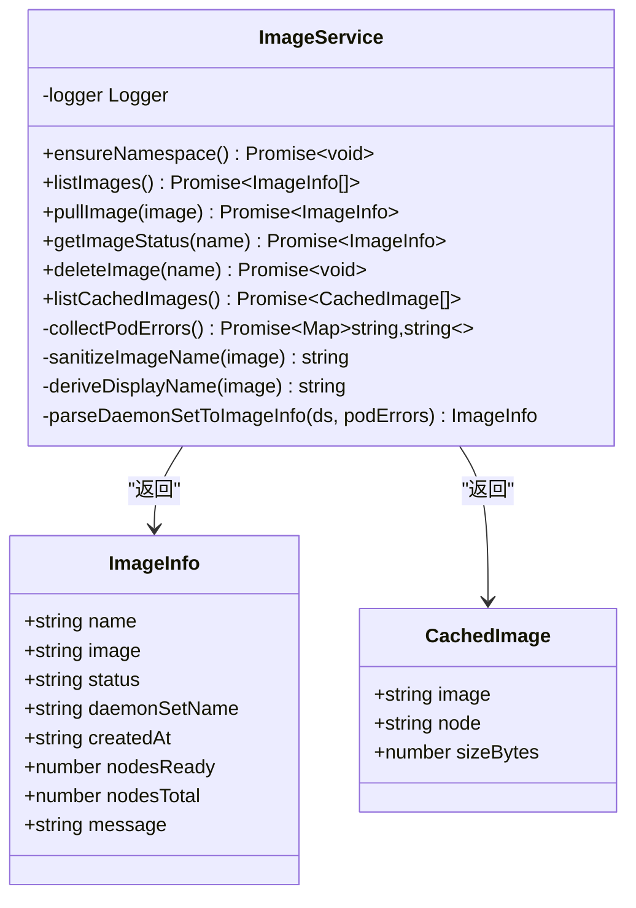
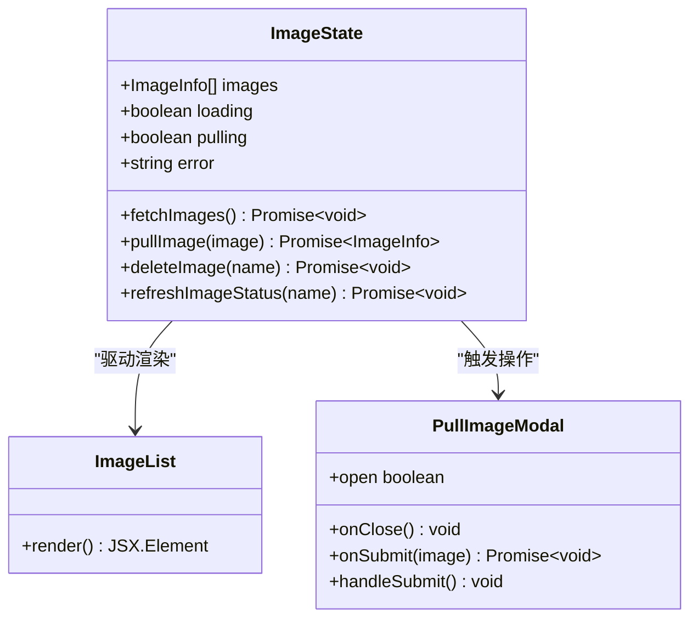
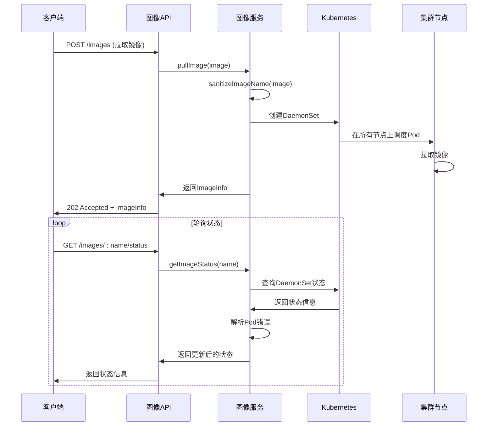
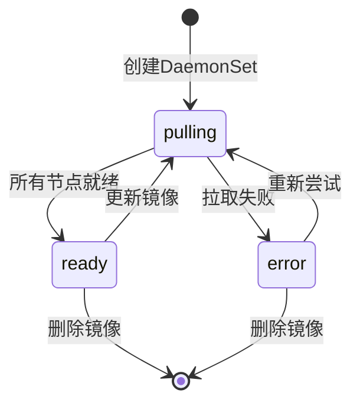
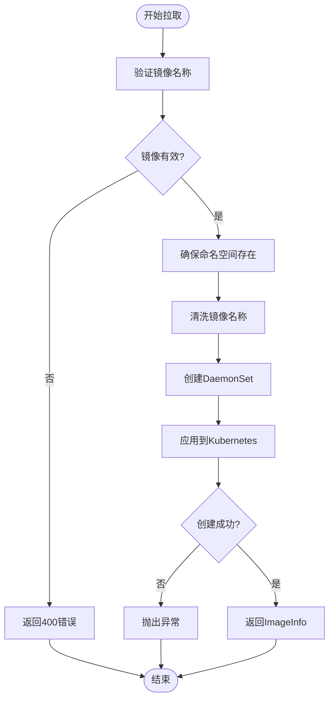
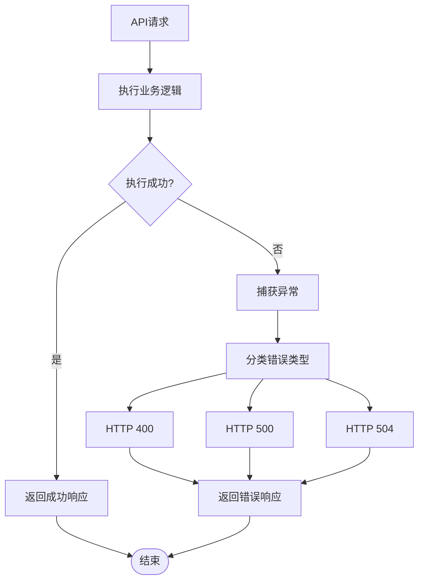
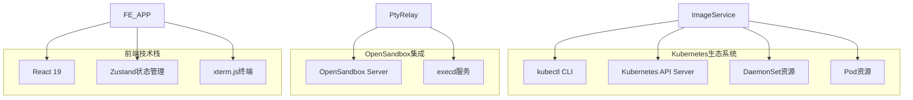
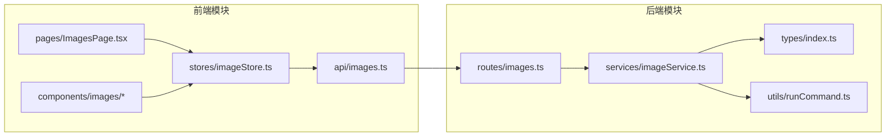
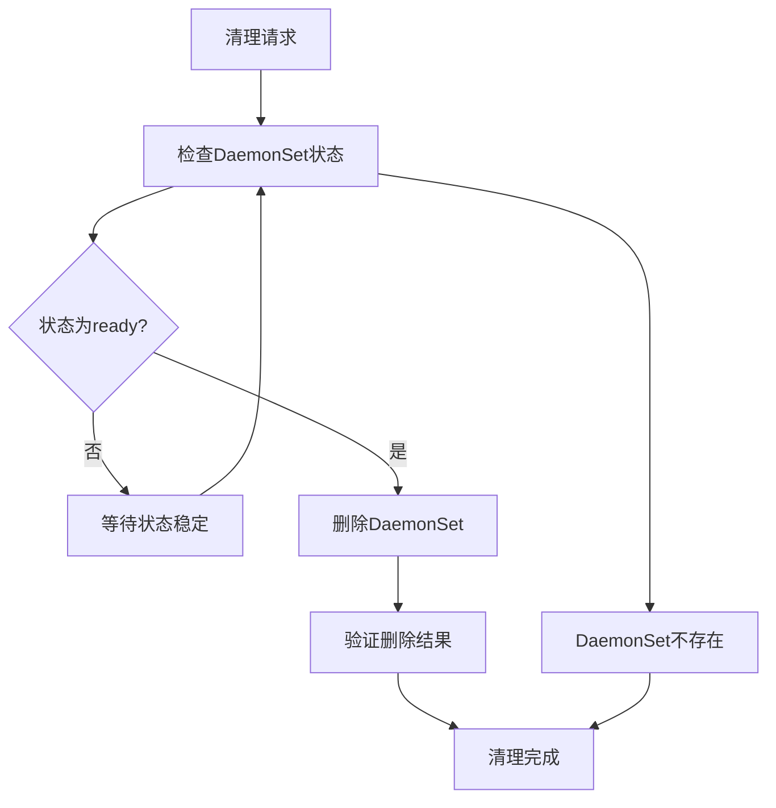

# 图像管理API

<cite>
**本文档引用的文件**
- [apps/backend/src/routes/images.ts](file://apps/backend/src/routes/images.ts)
- [apps/backend/src/services/imageService.ts](file://apps/backend/src/services/imageService.ts)
- [apps/backend/src/types/index.ts](file://apps/backend/src/types/index.ts)
- [apps/backend/src/utils/runCommand.ts](file://apps/backend/src/utils/runCommand.ts)
- [apps/frontend/src/api/images.ts](file://apps/frontend/src/api/images.ts)
- [apps/frontend/src/stores/imageStore.ts](file://apps/frontend/src/stores/imageStore.ts)
- [apps/frontend/src/pages/ImagesPage.tsx](file://apps/frontend/src/pages/ImagesPage.tsx)
- [apps/frontend/src/components/images/ImageList.tsx](file://apps/frontend/src/components/images/ImageList.tsx)
- [apps/frontend/src/components/images/PullImageModal.tsx](file://apps/frontend/src/components/images/PullImageModal.tsx)
- [apps/backend/src/config.ts](file://apps/backend/src/config.ts)
- [apps/backend/src/middleware/error.ts](file://apps/backend/src/middleware/error.ts)
- [README.md](file://README.md)
</cite>

## 目录
1. [简介](#简介)
2. [项目结构](#项目结构)
3. [核心组件](#核心组件)
4. [架构概览](#架构概览)
5. [详细组件分析](#详细组件分析)
6. [依赖关系分析](#依赖关系分析)
7. [性能考虑](#性能考虑)
8. [故障排除指南](#故障排除指南)
9. [结论](#结论)

## 简介

图像管理API是Sandbox Manager平台的核心功能模块，负责管理Kubernetes集群中的容器镜像预拉取和缓存。该模块通过创建DaemonSet资源在所有集群节点上预拉取指定的容器镜像，从而确保沙箱创建时的快速启动和良好的用户体验。

该API提供了完整的镜像生命周期管理功能，包括镜像列表查询、拉取操作、删除和状态监控。系统采用Kubernetes原生的DaemonSet机制来实现镜像的分布式预拉取，确保每个节点都拥有所需的镜像副本。

## 项目结构

Sandbox Manager采用前后端分离的架构设计，图像管理功能分布在后端服务和前端界面中：

**图表来源**
- [apps/backend/src/routes/images.ts:1-78](file://apps/backend/src/routes/images.ts#L1-L78)
- [apps/backend/src/services/imageService.ts:1-386](file://apps/backend/src/services/imageService.ts#L1-L386)
- [apps/frontend/src/api/images.ts:1-23](file://apps/frontend/src/api/images.ts#L1-L23)

**章节来源**
- [README.md:114-140](file://README.md#L114-L140)

## 核心组件

### 后端服务架构

后端图像管理服务基于Express框架构建，采用分层架构设计：

**图表来源**
- [apps/backend/src/services/imageService.ts:95-385](file://apps/backend/src/services/imageService.ts#L95-L385)
- [apps/backend/src/types/index.ts:69-88](file://apps/backend/src/types/index.ts#L69-L88)

### 前端组件架构

前端采用React + Zustand的状态管理模式：

**图表来源**
- [apps/frontend/src/stores/imageStore.ts:5-59](file://apps/frontend/src/stores/imageStore.ts#L5-L59)
- [apps/frontend/src/components/images/ImageList.tsx:1-51](file://apps/frontend/src/components/images/ImageList.tsx#L1-L51)
- [apps/frontend/src/components/images/PullImageModal.tsx:1-99](file://apps/frontend/src/components/images/PullImageModal.tsx#L1-L99)

**章节来源**
- [apps/backend/src/services/imageService.ts:95-385](file://apps/backend/src/services/imageService.ts#L95-L385)
- [apps/frontend/src/stores/imageStore.ts:1-60](file://apps/frontend/src/stores/imageStore.ts#L1-L60)

## 架构概览

图像管理系统采用事件驱动的架构模式，通过DaemonSet实现镜像的分布式预拉取：

**图表来源**
- [apps/backend/src/routes/images.ts:36-65](file://apps/backend/src/routes/images.ts#L36-L65)
- [apps/backend/src/services/imageService.ts:227-317](file://apps/backend/src/services/imageService.ts#L227-L317)

## 详细组件分析

### API端点定义

系统提供以下主要的图像管理API端点：

#### 镜像列表查询

**端点**: `GET /images`
**功能**: 获取所有已预拉取的镜像列表
**响应**: `ApiResponse<ImageInfo[]>`

#### 镜像拉取操作

**端点**: `POST /images`
**功能**: 在所有集群节点上预拉取指定镜像
**请求体**: `PullImageBody`
**响应**: `ApiResponse<ImageInfo>`
**状态码**: 202 Accepted (异步处理)

#### 镜像状态查询

**端点**: `GET /images/:name/status`
**功能**: 获取特定镜像的拉取状态
**参数**: `name` (DaemonSet名称)
**响应**: `ApiResponse<ImageInfo>`

#### 镜像删除操作

**端点**: `DELETE /images/:name`
**功能**: 删除已预拉取的镜像
**参数**: `name` (DaemonSet名称)
**响应**: 204 No Content

#### 集群缓存查询

**端点**: `GET /images/cached`
**功能**: 获取所有节点上的镜像缓存信息
**响应**: `ApiResponse<CachedImage[]>`

**章节来源**
- [apps/backend/src/routes/images.ts:14-77](file://apps/backend/src/routes/images.ts#L14-L77)
- [apps/backend/src/types/index.ts:80-88](file://apps/backend/src/types/index.ts#L80-L88)

### 数据模型定义

#### ImageInfo 数据模型

| 字段名 | 类型 | 描述 | 状态转换 |
|--------|------|------|----------|
| name | string | 显示名称 | 从镜像引用派生 |
| image | string | 完整镜像引用 | 原始镜像名称 |
| status | "pulling" \| "ready" \| "error" | 拉取状态 | 状态机转换 |
| daemonSetName | string | DaemonSet名称 | 从镜像名称生成 |
| createdAt | string | 创建时间 | ISO格式时间戳 |
| nodesReady | number | 就绪节点数 | 当前就绪数量 |
| nodesTotal | number | 总节点数 | 集群总节点数 |
| message | string | 错误消息 | 失败时的详细信息 |

#### CachedImage 数据模型

| 字段名 | 类型 | 描述 |
|--------|------|------|
| image | string | 镜像名称 |
| node | string | 节点名称 |
| sizeBytes | number | 镜像大小(字节) |

#### PullImageBody 数据模型

| 字段名 | 类型 | 必填 | 描述 |
|--------|------|------|------|
| image | string | 是 | 完整镜像引用(如: ubuntu:22.04) |

**章节来源**
- [apps/backend/src/types/index.ts:69-88](file://apps/backend/src/types/index.ts#L69-L88)

### 状态管理机制

图像状态采用有限状态机模式：

**图表来源**
- [apps/backend/src/services/imageService.ts:54-92](file://apps/backend/src/services/imageService.ts#L54-L92)

### 镜像拉取流程

系统通过创建DaemonSet实现镜像的分布式拉取：

**图表来源**
- [apps/backend/src/services/imageService.ts:227-294](file://apps/backend/src/services/imageService.ts#L227-L294)

**章节来源**
- [apps/backend/src/services/imageService.ts:12-32](file://apps/backend/src/services/imageService.ts#L12-L32)
- [apps/backend/src/services/imageService.ts:227-294](file://apps/backend/src/services/imageService.ts#L227-L294)

### 错误处理机制

系统实现了完善的错误处理和状态管理：

**图表来源**
- [apps/backend/src/middleware/error.ts:5-47](file://apps/backend/src/middleware/error.ts#L5-L47)

**章节来源**
- [apps/backend/src/middleware/error.ts:1-48](file://apps/backend/src/middleware/error.ts#L1-L48)

## 依赖关系分析

### 外部依赖

系统依赖以下关键外部组件：

**图表来源**
- [apps/backend/src/services/imageService.ts:105-116](file://apps/backend/src/services/imageService.ts#L105-L116)
- [apps/backend/src/websocket/ptyRelay.ts:70-93](file://apps/backend/src/websocket/ptyRelay.ts#L70-L93)

### 内部模块依赖

**图表来源**
- [apps/frontend/src/api/images.ts:1-23](file://apps/frontend/src/api/images.ts#L1-L23)
- [apps/backend/src/routes/images.ts:1-7](file://apps/backend/src/routes/images.ts#L1-L7)
- [apps/backend/src/services/imageService.ts:1-3](file://apps/backend/src/services/imageService.ts#L1-L3)

**章节来源**
- [apps/frontend/src/api/images.ts:1-23](file://apps/frontend/src/api/images.ts#L1-L23)
- [apps/backend/src/routes/images.ts:1-7](file://apps/backend/src/routes/images.ts#L1-L7)

## 性能考虑

### 缓存策略

系统采用多层缓存策略来优化性能：

1. **集群级镜像缓存**: 通过Kubernetes节点的镜像缓存减少重复拉取
2. **状态缓存**: 前端Zustand状态管理器缓存图像状态
3. **DNS缓存**: kubectl命令的DNS解析缓存

### 存储优化

- **镜像大小限制**: 每个镜像的sizeBytes字段用于监控存储使用情况
- **命名空间隔离**: 所有图像资源都在独立的`opensandbox-images`命名空间中管理
- **资源配额**: initContainer使用最小化的CPU和内存配额

### 清理机制

系统提供了完整的清理机制：

**图表来源**
- [apps/backend/src/services/imageService.ts:322-339](file://apps/backend/src/services/imageService.ts#L322-L339)

**章节来源**
- [apps/backend/src/services/imageService.ts:344-384](file://apps/backend/src/services/imageService.ts#L344-L384)

## 故障排除指南

### 常见问题及解决方案

#### 镜像拉取失败

**症状**: 状态显示为"error"且包含错误消息
**可能原因**:
- 镜像名称无效
- 认证凭据缺失
- 网络连接问题
- 镜像仓库不可访问

**解决步骤**:
1. 检查镜像名称格式
2. 验证镜像仓库认证配置
3. 确认网络连通性
4. 查看Pod错误详情

#### DaemonSet创建失败

**症状**: 创建DaemonSet时抛出异常
**可能原因**:
- 权限不足
- 命名空间不存在
- 资源冲突

**解决步骤**:
1. 检查Kubernetes权限
2. 确认命名空间存在
3. 检查资源名称唯一性

#### 状态查询超时

**症状**: 获取状态时出现超时错误
**可能原因**:
- kubectl命令超时
- Kubernetes API延迟
- 网络问题

**解决步骤**:
1. 增加超时时间配置
2. 检查网络连接
3. 重试请求

**章节来源**
- [apps/backend/src/services/imageService.ts:122-191](file://apps/backend/src/services/imageService.ts#L122-L191)
- [apps/backend/src/middleware/error.ts:33-47](file://apps/backend/src/middleware/error.ts#L33-L47)

### 调试工具

系统提供了多种调试和监控工具：

1. **日志记录**: 使用pino日志库记录详细的执行信息
2. **状态轮询**: 前端定期轮询图像状态
3. **错误分类**: 按HTTP状态码分类错误类型
4. **超时控制**: 各种操作都有合理的超时设置

**章节来源**
- [apps/backend/src/config.ts:66-68](file://apps/backend/src/config.ts#L66-L68)

## 结论

图像管理API为Sandbox Manager平台提供了强大的容器镜像管理能力。通过Kubernetes原生的DaemonSet机制，系统能够高效地在所有集群节点上预拉取和缓存镜像，显著提升了沙箱创建的响应速度和用户体验。

该API的设计充分考虑了生产环境的需求，包括：
- 完善的错误处理和状态管理
- 可扩展的架构设计
- 详细的日志记录和监控
- 用户友好的前端界面
- 安全的镜像缓存策略

未来可以考虑的功能增强包括：
- 镜像签名验证集成
- 安全扫描结果展示
- 镜像版本管理和回滚
- 更细粒度的缓存控制
- 多租户镜像隔离