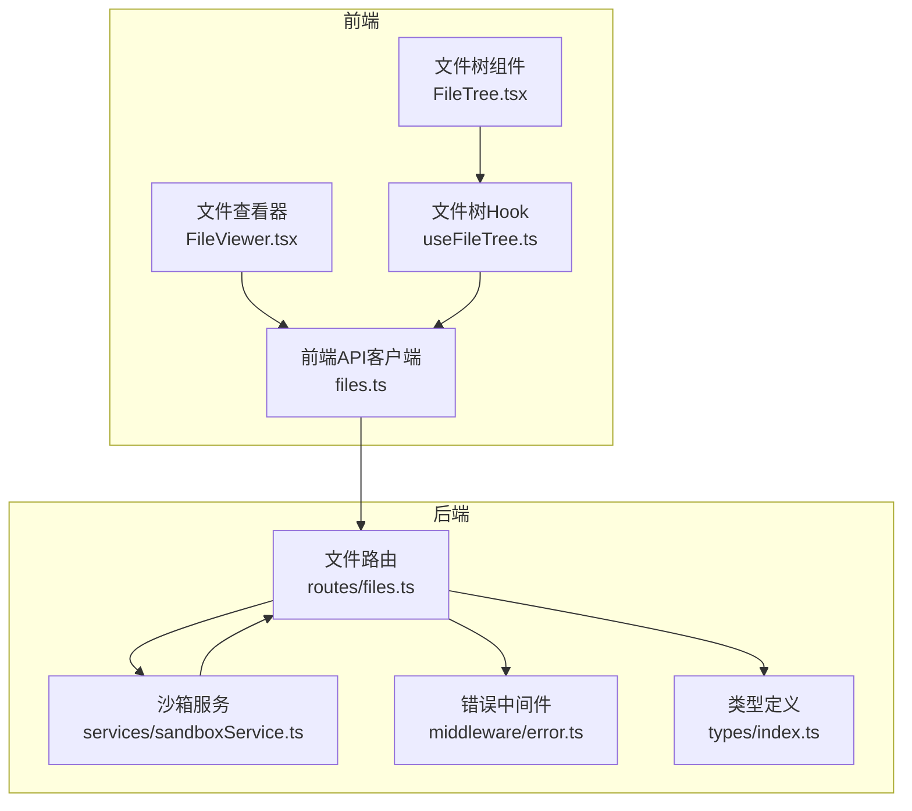
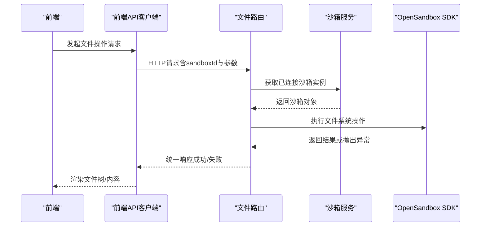
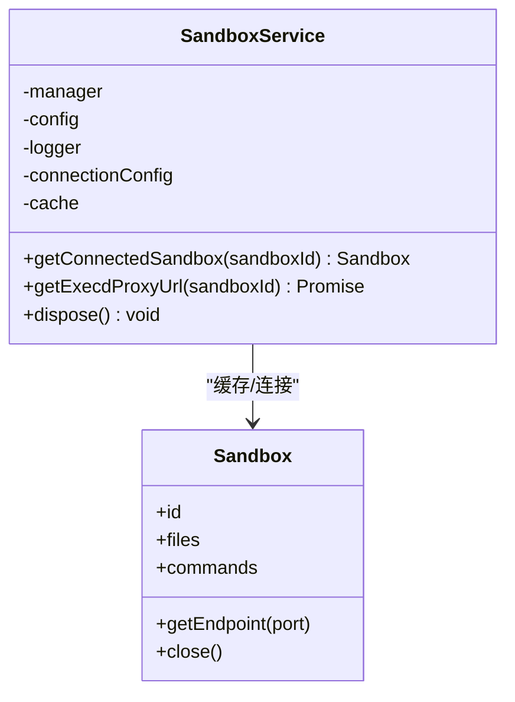
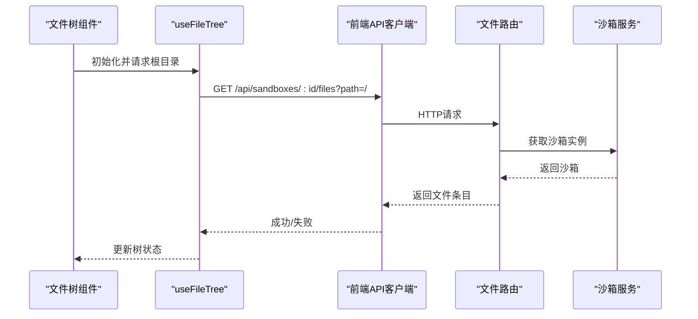
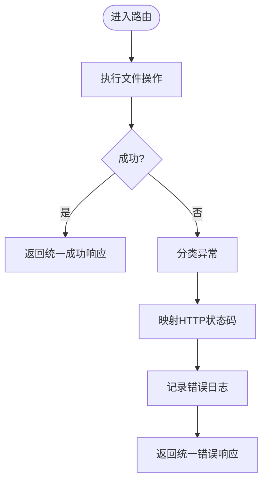
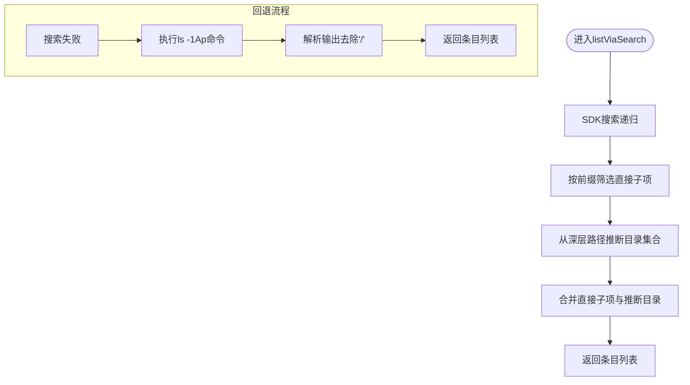
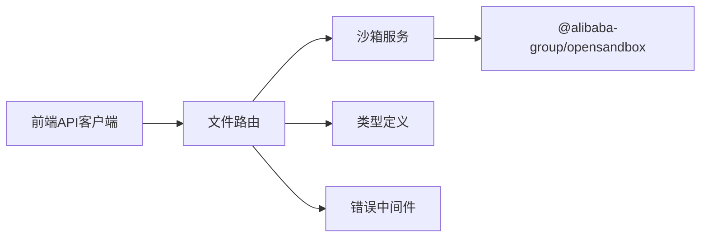

# 文件操作API

<cite>
**本文引用的文件**
- [apps/backend/src/routes/files.ts](file://apps/backend/src/routes/files.ts)
- [apps/backend/src/services/sandboxService.ts](file://apps/backend/src/services/sandboxService.ts)
- [apps/backend/src/middleware/error.ts](file://apps/backend/src/middleware/error.ts)
- [apps/backend/src/types/index.ts](file://apps/backend/src/types/index.ts)
- [apps/backend/src/config.ts](file://apps/backend/src/config.ts)
- [apps/backend/src/logger.ts](file://apps/backend/src/logger.ts)
- [apps/frontend/src/api/files.ts](file://apps/frontend/src/api/files.ts)
- [apps/frontend/src/api/types.ts](file://apps/frontend/src/api/types.ts)
- [apps/frontend/src/components/files/FileTree.tsx](file://apps/frontend/src/components/files/FileTree.tsx)
- [apps/frontend/src/hooks/useFileTree.ts](file://apps/frontend/src/hooks/useFileTree.ts)
- [apps/frontend/src/components/files/FileViewer.tsx](file://apps/frontend/src/components/files/FileViewer.tsx)
- [apps/backend/src/routes/sandboxes.ts](file://apps/backend/src/routes/sandboxes.ts)
- [README.md](file://README.md)
</cite>

## 目录
1. [简介](#简介)
2. [项目结构](#项目结构)
3. [核心组件](#核心组件)
4. [架构总览](#架构总览)
5. [详细组件分析](#详细组件分析)
6. [依赖关系分析](#依赖关系分析)
7. [性能考量](#性能考量)
8. [故障排查指南](#故障排查指南)
9. [结论](#结论)
10. [附录：API端点规范](#附录api端点规范)

## 简介
本文件操作API围绕“沙箱内文件系统”的浏览、读取、写入、移动重命名、删除以及下载等能力展开，提供文件树结构的递归查询与回退策略、内容读取与二进制下载、批量操作与错误处理机制。同时，结合前端文件树组件与Hook，实现按需加载、展开折叠与文件内容预览。

## 项目结构
- 后端Express路由集中于文件路由模块，负责解析请求参数、调用沙箱服务、执行文件操作并返回统一响应格式。
- 沙箱服务封装OpenSandbox SDK，提供LRU连接缓存、连接生命周期管理与端点URL生成。
- 前端提供文件树UI、文件内容预览组件及用于与后端交互的API客户端。
- 中间件统一错误处理，将SDK异常映射为HTTP状态码与标准化错误响应。
- 类型定义统一了请求体、响应体与文件条目结构。

图表来源
- [apps/backend/src/routes/files.ts:1-327](file://apps/backend/src/routes/files.ts#L1-L327)
- [apps/backend/src/services/sandboxService.ts:1-148](file://apps/backend/src/services/sandboxService.ts#L1-L148)
- [apps/backend/src/middleware/error.ts:1-48](file://apps/backend/src/middleware/error.ts#L1-L48)
- [apps/frontend/src/api/files.ts:1-32](file://apps/frontend/src/api/files.ts#L1-L32)
- [apps/frontend/src/components/files/FileTree.tsx:1-55](file://apps/frontend/src/components/files/FileTree.tsx#L1-L55)
- [apps/frontend/src/components/files/FileViewer.tsx:1-68](file://apps/frontend/src/components/files/FileViewer.tsx#L1-L68)
- [apps/frontend/src/hooks/useFileTree.ts:1-62](file://apps/frontend/src/hooks/useFileTree.ts#L1-L62)

章节来源
- [apps/backend/src/routes/files.ts:1-327](file://apps/backend/src/routes/files.ts#L1-L327)
- [apps/backend/src/services/sandboxService.ts:1-148](file://apps/backend/src/services/sandboxService.ts#L1-L148)
- [apps/frontend/src/api/files.ts:1-32](file://apps/frontend/src/api/files.ts#L1-L32)
- [apps/frontend/src/components/files/FileTree.tsx:1-55](file://apps/frontend/src/components/files/FileTree.tsx#L1-L55)
- [apps/frontend/src/components/files/FileViewer.tsx:1-68](file://apps/frontend/src/components/files/FileViewer.tsx#L1-L68)
- [apps/frontend/src/hooks/useFileTree.ts:1-62](file://apps/frontend/src/hooks/useFileTree.ts#L1-L62)

## 核心组件
- 文件路由模块：提供目录浏览、文件内容读取、二进制下载、写入、创建目录、移动/重命名、删除文件与目录等端点；内置参数校验与错误处理。
- 沙箱服务：封装OpenSandbox SDK，提供LRU连接缓存、连接建立与释放、端点URL生成。
- 前端API与组件：提供文件树按需加载、文件内容预览、目录展开/收起与错误提示。
- 错误处理中间件：将SDK异常映射为HTTP状态码与统一错误响应结构。
- 类型定义：统一响应体、请求体与文件条目结构，便于前后端契约一致。

章节来源
- [apps/backend/src/routes/files.ts:1-327](file://apps/backend/src/routes/files.ts#L1-L327)
- [apps/backend/src/services/sandboxService.ts:1-148](file://apps/backend/src/services/sandboxService.ts#L1-L148)
- [apps/frontend/src/api/files.ts:1-32](file://apps/frontend/src/api/files.ts#L1-L32)
- [apps/frontend/src/api/types.ts:27-33](file://apps/frontend/src/api/types.ts#L27-L33)
- [apps/backend/src/middleware/error.ts:1-48](file://apps/backend/src/middleware/error.ts#L1-L48)
- [apps/backend/src/types/index.ts:3-46](file://apps/backend/src/types/index.ts#L3-L46)

## 架构总览
文件操作API采用“前端请求—后端路由—沙箱服务—OpenSandbox SDK”的分层架构。前端通过API客户端与后端交互，后端通过沙箱服务获取已连接的沙箱实例，再调用SDK进行文件系统操作。错误通过中间件统一处理并记录日志。

图表来源
- [apps/backend/src/routes/files.ts:19-207](file://apps/backend/src/routes/files.ts#L19-L207)
- [apps/backend/src/services/sandboxService.ts:112-123](file://apps/backend/src/services/sandboxService.ts#L112-L123)
- [apps/frontend/src/api/files.ts:4-31](file://apps/frontend/src/api/files.ts#L4-L31)

章节来源
- [apps/backend/src/routes/files.ts:1-327](file://apps/backend/src/routes/files.ts#L1-L327)
- [apps/backend/src/services/sandboxService.ts:1-148](file://apps/backend/src/services/sandboxService.ts#L1-L148)
- [apps/frontend/src/api/files.ts:1-32](file://apps/frontend/src/api/files.ts#L1-L32)

## 详细组件分析

### 文件路由模块（filesRouter）
- 目录浏览
  - 端点：GET /api/sandboxes/:sandboxId/files
  - 查询参数：path（默认根路径）
  - 处理逻辑：优先使用SDK搜索API获取直接子项，若失败则回退至ls -1Ap命令解析；对深层路径推断目录存在性。
  - 返回：统一响应，包含文件条目数组（名称、路径、是否目录、大小、修改时间）。
- 文件内容读取
  - 端点：GET /api/sandboxes/:sandboxId/files/content
  - 查询参数：path（必填）
  - 校验：若路径为目录则拒绝；否则读取文本内容并以纯文本类型返回。
- 二进制下载
  - 端点：GET /api/sandboxes/:sandboxId/files/download
  - 查询参数：path（必填）
  - 校验：若路径为目录则拒绝；否则读取字节流并以octet-stream返回。
- 写入文件
  - 端点：POST /api/sandboxes/:sandboxId/files/write
  - 请求体：path、content（必填），mode（可选）
  - 处理：调用SDK写入单个文件。
- 创建目录
  - 端点：POST /api/sandboxes/:sandboxId/files/mkdir
  - 请求体：paths（必填，字符串数组）、mode（可选）
  - 处理：调用SDK批量创建目录。
- 移动/重命名
  - 端点：POST /api/sandboxes/:sandboxId/files/move
  - 请求体：entries（必填，数组，每项包含src与dest）
  - 处理：调用SDK批量移动/重命名。
- 删除文件
  - 端点：DELETE /api/sandboxes/:sandboxId/files/files
  - 查询参数：path（必填，单个或数组）
  - 处理：调用SDK批量删除文件，返回204。
- 删除目录
  - 端点：DELETE /api/sandboxes/:sandboxId/files/directories
  - 查询参数：path（必填，单个或数组）
  - 处理：调用SDK批量删除目录，返回204。

章节来源
- [apps/backend/src/routes/files.ts:19-207](file://apps/backend/src/routes/files.ts#L19-L207)
- [apps/backend/src/types/index.ts:33-46](file://apps/backend/src/types/index.ts#L33-L46)

### 沙箱服务（SandboxService）
- 连接缓存：LRU缓存已连接的沙箱实例，默认容量50，TTL 10分钟；淘汰时尝试关闭连接并记录日志。
- 连接管理：根据sandboxId从缓存获取或新建连接；提供端点URL生成方法供终端WebSocket透传。
- 生命周期：提供kill、pause、resume等管理方法，均会清理缓存。

图表来源
- [apps/backend/src/services/sandboxService.ts:11-147](file://apps/backend/src/services/sandboxService.ts#L11-L147)

章节来源
- [apps/backend/src/services/sandboxService.ts:1-148](file://apps/backend/src/services/sandboxService.ts#L1-L148)

### 前端文件树与内容预览
- 文件树组件：基于Hook按需加载子节点，支持展开/收起、加载状态与错误提示。
- 文件内容预览：选择文件后异步拉取内容并渲染。
- API客户端：封装GET/POST/DELETE请求，统一处理路径编码与错误。

图表来源
- [apps/frontend/src/components/files/FileTree.tsx:11-54](file://apps/frontend/src/components/files/FileTree.tsx#L11-L54)
- [apps/frontend/src/hooks/useFileTree.ts:12-32](file://apps/frontend/src/hooks/useFileTree.ts#L12-L32)
- [apps/frontend/src/api/files.ts:4-6](file://apps/frontend/src/api/files.ts#L4-L6)
- [apps/backend/src/routes/files.ts:20-44](file://apps/backend/src/routes/files.ts#L20-L44)
- [apps/backend/src/services/sandboxService.ts:112-123](file://apps/backend/src/services/sandboxService.ts#L112-L123)

章节来源
- [apps/frontend/src/components/files/FileTree.tsx:1-55](file://apps/frontend/src/components/files/FileTree.tsx#L1-L55)
- [apps/frontend/src/hooks/useFileTree.ts:1-62](file://apps/frontend/src/hooks/useFileTree.ts#L1-L62)
- [apps/frontend/src/components/files/FileViewer.tsx:1-68](file://apps/frontend/src/components/files/FileViewer.tsx#L1-L68)
- [apps/frontend/src/api/files.ts:1-32](file://apps/frontend/src/api/files.ts#L1-L32)

### 错误处理与日志
- 统一错误中间件：根据异常类型映射HTTP状态码（如SDK异常、参数解析失败、超时等），并将请求ID、方法、路径、状态码等信息记录到日志。
- 响应格式：统一为包含success与error.code/message/requestId的结构。

图表来源
- [apps/backend/src/middleware/error.ts:5-47](file://apps/backend/src/middleware/error.ts#L5-L47)
- [apps/backend/src/routes/files.ts:41-43](file://apps/backend/src/routes/files.ts#L41-L43)

章节来源
- [apps/backend/src/middleware/error.ts:1-48](file://apps/backend/src/middleware/error.ts#L1-L48)
- [apps/backend/src/types/index.ts:3-11](file://apps/backend/src/types/index.ts#L3-L11)

### 文件树结构API设计与递归查询
- 直接子项提取：SDK搜索返回的是递归结果，需要通过前缀匹配与相对路径判断筛选出直接子项；同时通过深层路径反推出缺失的目录。
- 回退策略：当SDK搜索失败时，使用ls -1Ap命令输出解析，追加'/'以可靠识别目录；限制输出行数避免过大响应。
- 目录判定：提供isDirectory辅助函数，通过test -d命令判断路径是否为目录。

图表来源
- [apps/backend/src/routes/files.ts:213-275](file://apps/backend/src/routes/files.ts#L213-L275)
- [apps/backend/src/routes/files.ts:281-313](file://apps/backend/src/routes/files.ts#L281-L313)
- [apps/backend/src/routes/files.ts:321-326](file://apps/backend/src/routes/files.ts#L321-L326)

章节来源
- [apps/backend/src/routes/files.ts:213-326](file://apps/backend/src/routes/files.ts#L213-L326)

### 权限控制与访问控制
- 当前实现未在文件路由中显式进行细粒度权限校验；建议在路由层增加鉴权与授权中间件，结合沙箱元数据或用户上下文限制对特定沙箱的文件操作。
- OpenSandbox侧的网络策略与资源配额可作为边界防护，但API层仍需补充业务级权限控制。

[本节为概念性讨论，不直接分析具体文件]

### 编码处理、大文件传输与断点续传
- 编码处理：内容读取以文本形式返回，二进制下载以字节流返回，前端按需转码或直接下载。
- 大文件传输：当前实现未提供分块/并发/断点续传支持；建议在后续版本引入Range请求、分片上传与进度回调机制。
- 断点续传：当前未实现；可基于文件大小与偏移量扩展/PUT端点以支持续传。

[本节为概念性讨论，不直接分析具体文件]

### 文件搜索、过滤与排序
- 搜索：SDK搜索支持模式匹配，前端可扩展为路径前缀/通配符过滤。
- 过滤：可在前端对返回的条目进行过滤（如按扩展名、大小范围）。
- 排序：可在前端对条目数组进行排序（名称、大小、修改时间）。

[本节为概念性讨论，不直接分析具体文件]

### 文件缓存机制与预览
- 后端缓存：沙箱连接采用LRU缓存，减少重复连接开销。
- 前端缓存：文件树Hook维护展开状态、加载状态与失败目录集合，避免重复请求。
- 预览：文件内容预览组件在选择文件后发起请求并渲染，适合小/中型文本文件。

章节来源
- [apps/backend/src/services/sandboxService.ts:35-44](file://apps/backend/src/services/sandboxService.ts#L35-L44)
- [apps/frontend/src/hooks/useFileTree.ts:12-32](file://apps/frontend/src/hooks/useFileTree.ts#L12-L32)
- [apps/frontend/src/components/files/FileViewer.tsx:14-31](file://apps/frontend/src/components/files/FileViewer.tsx#L14-L31)

### 批量操作
- 批量创建目录：一次请求传入多个路径。
- 批量移动/重命名：一次请求传入多组src/dest。
- 批量删除：支持单个或数组路径的文件/目录删除。

章节来源
- [apps/backend/src/routes/files.ts:118-157](file://apps/backend/src/routes/files.ts#L118-L157)
- [apps/backend/src/types/index.ts:39-46](file://apps/backend/src/types/index.ts#L39-L46)

## 依赖关系分析
- 文件路由依赖沙箱服务与统一类型定义；错误中间件贯穿所有路由。
- 前端API客户端依赖类型定义与后端路由约定。
- 沙箱服务依赖OpenSandbox SDK与LRU缓存库。

图表来源
- [apps/backend/src/routes/files.ts:1-8](file://apps/backend/src/routes/files.ts#L1-L8)
- [apps/backend/src/services/sandboxService.ts:1-10](file://apps/backend/src/services/sandboxService.ts#L1-L10)
- [apps/frontend/src/api/files.ts:1-2](file://apps/frontend/src/api/files.ts#L1-L2)

章节来源
- [apps/backend/src/routes/files.ts:1-8](file://apps/backend/src/routes/files.ts#L1-L8)
- [apps/backend/src/services/sandboxService.ts:1-10](file://apps/backend/src/services/sandboxService.ts#L1-L10)
- [apps/frontend/src/api/files.ts:1-2](file://apps/frontend/src/api/files.ts#L1-L2)

## 性能考量
- 连接缓存：LRU缓存降低重复连接成本，建议根据实际并发调整容量与TTL。
- 目录列举：优先使用SDK搜索，失败回退ls命令；注意限制输出行数，避免超大响应。
- 前端按需加载：文件树仅在展开时请求子节点，减少初始负载。
- 大文件：当前未做分片/并发处理，建议后续引入分块与进度反馈。

[本节为通用指导，不直接分析具体文件]

## 故障排查指南
- 参数缺失：目录浏览与文件操作均对关键参数进行校验，缺失时返回400与明确错误码。
- 路径为目录：读取内容或下载时若路径为目录，返回400。
- SDK异常：统一通过错误中间件映射为HTTP状态码（如502/504）并记录日志。
- OpenSandbox未配置：沙箱路由层提供保护，未配置时返回503。

章节来源
- [apps/backend/src/routes/files.ts:53-62](file://apps/backend/src/routes/files.ts#L53-L62)
- [apps/backend/src/routes/files.ts:78-87](file://apps/backend/src/routes/files.ts#L78-L87)
- [apps/backend/src/middleware/error.ts:33-47](file://apps/backend/src/middleware/error.ts#L33-L47)
- [apps/backend/src/routes/sandboxes.ts:34-45](file://apps/backend/src/routes/sandboxes.ts#L34-L45)

## 结论
文件操作API以Express路由为核心，结合沙箱服务与OpenSandbox SDK实现了对沙箱内文件系统的完整覆盖。前端通过文件树与内容预览组件提供直观的交互体验。当前实现具备参数校验、错误统一处理与连接缓存等基础能力；建议后续增强权限控制、大文件分片与断点续传、搜索过滤与排序等高级特性。

[本节为总结性内容，不直接分析具体文件]

## 附录：API端点规范

- 目录浏览
  - 方法：GET
  - 路径：/api/sandboxes/{sandboxId}/files
  - 查询参数：path（默认“/”）
  - 成功响应：data为文件条目数组（name、path、isDir、size、modTime）
  - 失败响应：400/500（统一错误结构）

- 读取文件内容
  - 方法：GET
  - 路径：/api/sandboxes/{sandboxId}/files/content
  - 查询参数：path（必填）
  - 成功响应：text/plain，文件内容
  - 失败响应：400（路径为目录或缺失）、500（其他错误）

- 下载文件（二进制）
  - 方法：GET
  - 路径：/api/sandboxes/{sandboxId}/files/download
  - 查询参数：path（必填）
  - 成功响应：application/octet-stream，文件字节流
  - 失败响应：400（路径为目录或缺失）、500（其他错误）

- 写入文件
  - 方法：POST
  - 路径：/api/sandboxes/{sandboxId}/files/write
  - 请求体：path（必填）、content（必填）、mode（可选）
  - 成功响应：success为true
  - 失败响应：400（字段缺失）、500（其他错误）

- 创建目录
  - 方法：POST
  - 路径：/api/sandboxes/{sandboxId}/files/mkdir
  - 请求体：paths（必填，字符串数组）、mode（可选）
  - 成功响应：success为true
  - 失败响应：400（paths为空）、500（其他错误）

- 移动/重命名
  - 方法：POST
  - 路径：/api/sandboxes/{sandboxId}/files/move
  - 请求体：entries（必填，数组，每项含src与dest）
  - 成功响应：success为true
  - 失败响应：400（entries为空）、500（其他错误）

- 删除文件
  - 方法：DELETE
  - 路径：/api/sandboxes/{sandboxId}/files/files
  - 查询参数：path（必填，单个或数组）
  - 成功响应：204 No Content
  - 失败响应：400（path缺失）、500（其他错误）

- 删除目录
  - 方法：DELETE
  - 路径：/api/sandboxes/{sandboxId}/files/directories
  - 查询参数：path（必填，单个或数组）
  - 成功响应：204 No Content
  - 失败响应：400（path缺失）、500（其他错误）

章节来源
- [apps/backend/src/routes/files.ts:19-207](file://apps/backend/src/routes/files.ts#L19-L207)
- [apps/backend/src/types/index.ts:3-46](file://apps/backend/src/types/index.ts#L3-L46)
- [README.md:153-170](file://README.md#L153-L170)