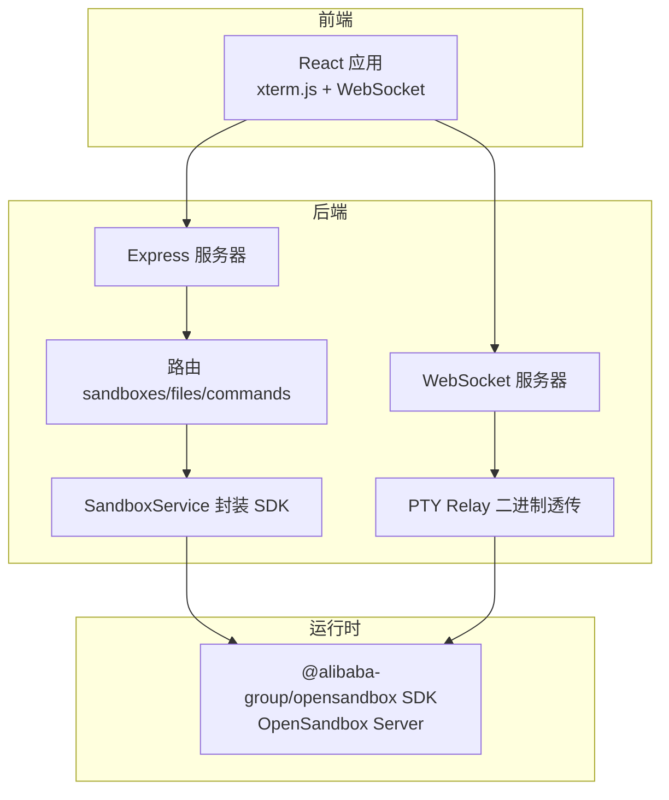
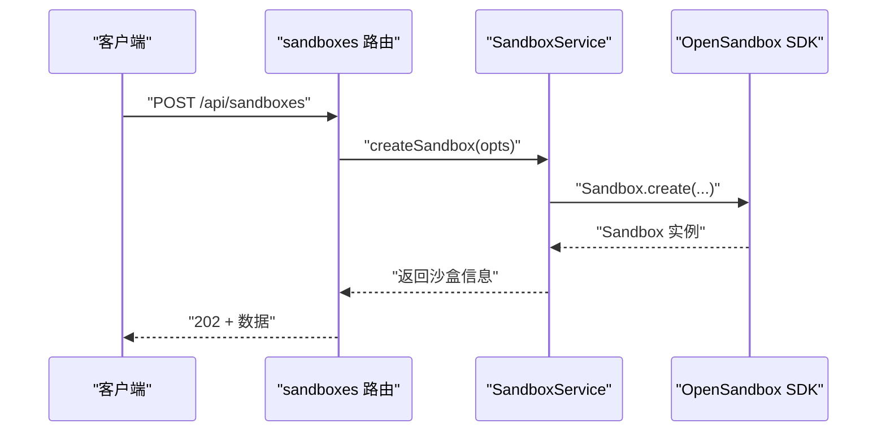
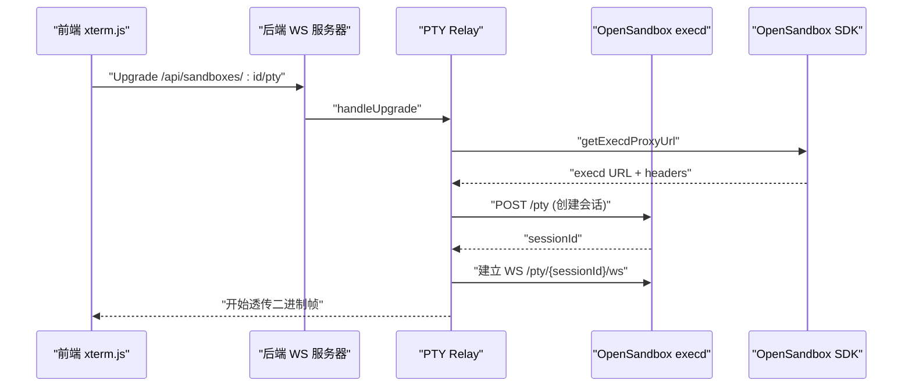
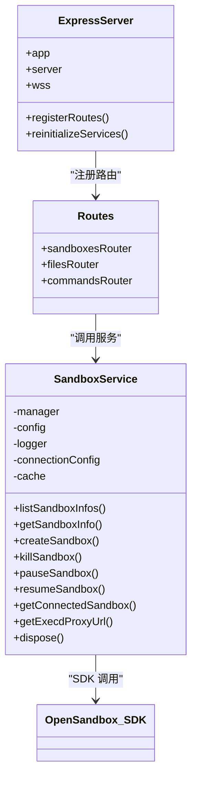

# 沙盒管理API

<cite>
**本文引用的文件**
- [apps/backend/src/routes/sandboxes.ts](file://apps/backend/src/routes/sandboxes.ts)
- [apps/backend/src/services/sandboxService.ts](file://apps/backend/src/services/sandboxService.ts)
- [apps/backend/src/types/index.ts](file://apps/backend/src/types/index.ts)
- [apps/backend/src/middleware/error.ts](file://apps/backend/src/middleware/error.ts)
- [apps/backend/src/routes/index.ts](file://apps/backend/src/routes/index.ts)
- [apps/backend/src/config.ts](file://apps/backend/src/config.ts)
- [apps/backend/src/server.ts](file://apps/backend/src/server.ts)
- [apps/backend/src/routes/files.ts](file://apps/backend/src/routes/files.ts)
- [apps/backend/src/routes/commands.ts](file://apps/backend/src/routes/commands.ts)
- [apps/backend/src/websocket/ptyRelay.ts](file://apps/backend/src/websocket/ptyRelay.ts)
- [apps/frontend/src/api/sandboxes.ts](file://apps/frontend/src/api/sandboxes.ts)
- [apps/frontend/src/api/types.ts](file://apps/frontend/src/api/types.ts)
- [README.md](file://README.md)
</cite>

## 目录
1. [简介](#简介)
2. [项目结构](#项目结构)
3. [核心组件](#核心组件)
4. [架构总览](#架构总览)
5. [详细组件分析](#详细组件分析)
6. [依赖关系分析](#依赖关系分析)
7. [性能考虑](#性能考虑)
8. [故障排查指南](#故障排查指南)
9. [结论](#结论)
10. [附录](#附录)

## 简介
本文件为基于 OpenSandbox 的沙盒管理API提供全面的技术文档，覆盖沙盒生命周期管理的所有REST接口与WebSocket终端能力，包括创建、获取、暂停/恢复、删除、状态查询、端点解析、文件系统操作、命令执行以及PTM终端透传。文档同时解释数据模型字段、类型约束、业务规则、并发控制与事务管理策略、错误处理与性能优化建议，并给出实际调用示例与最佳实践。

## 项目结构
后端采用 Express + WebSocket(ws) + OpenSandbox SDK 的架构，前端使用 React + xterm.js + WebSocket 二进制帧透传，通过统一的 /api 前缀暴露REST与WebSocket服务。OpenSandbox SDK负责与 Kubernetes 上的 OpenSandbox 控制器通信，实现沙盒生命周期与资源管理。

图表来源
- [apps/backend/src/server.ts:36-90](file://apps/backend/src/server.ts#L36-L90)
- [apps/backend/src/routes/index.ts:9-15](file://apps/backend/src/routes/index.ts#L9-L15)
- [apps/backend/src/websocket/ptyRelay.ts:22-38](file://apps/backend/src/websocket/ptyRelay.ts#L22-L38)

章节来源
- [README.md:114-140](file://README.md#L114-L140)
- [apps/backend/src/server.ts:36-90](file://apps/backend/src/server.ts#L36-L90)

## 核心组件
- 路由层：提供 REST 接口与子路由挂载，负责参数提取、请求校验与响应封装。
- 服务层：SandboxService 封装 OpenSandbox SDK，提供沙盒生命周期操作与连接缓存。
- 类型系统：统一的 ApiResponse 与请求/响应数据模型，确保前后端契约一致。
- 中间件：全局错误处理，将 SDK 异常映射为 HTTP 状态码。
- WebSocket：PTY Relay 透明转发二进制帧，支持终端 resize 与退出事件。

章节来源
- [apps/backend/src/routes/sandboxes.ts:9-175](file://apps/backend/src/routes/sandboxes.ts#L9-L175)
- [apps/backend/src/services/sandboxService.ts:11-147](file://apps/backend/src/services/sandboxService.ts#L11-L147)
- [apps/backend/src/types/index.ts:3-89](file://apps/backend/src/types/index.ts#L3-L89)
- [apps/backend/src/middleware/error.ts:5-47](file://apps/backend/src/middleware/error.ts#L5-L47)

## 架构总览
后端启动时根据配置决定是否初始化 SandboxService；当未配置 OpenSandbox 时，沙盒相关路由返回 503 表示未配置。路由层通过中间件保证服务可用性，错误中间件统一处理异常并输出标准错误响应。

图表来源
- [apps/backend/src/routes/sandboxes.ts:96-105](file://apps/backend/src/routes/sandboxes.ts#L96-L105)
- [apps/backend/src/services/sandboxService.ts:62-88](file://apps/backend/src/services/sandboxService.ts#L62-L88)

章节来源
- [apps/backend/src/server.ts:50-67](file://apps/backend/src/server.ts#L50-L67)
- [apps/backend/src/routes/sandboxes.ts:34-45](file://apps/backend/src/routes/sandboxes.ts#L34-L45)

## 详细组件分析

### 沙盒生命周期API
- 列表沙盒
  - 方法：GET
  - 路径：/api/sandboxes
  - 查询参数：state[]（过滤状态）、page、pageSize
  - 响应：包含 items 与 pagination 的数组，前端会过滤过期项
  - 处理：调用 SandboxService.listSandboxInfos，再进行 SDK 结果扁平化与过期过滤
- 创建沙盒
  - 方法：POST
  - 路径：/api/sandboxes
  - 请求体：CreateSandboxBody（镜像、名称、超时、环境变量、元数据、资源、网络策略）
  - 响应：202 + 沙盒信息（已标准化）
  - 处理：Sandbox.create，连接后写入 LRU 缓存，返回 getInfo
- 获取沙盒详情
  - 方法：GET
  - 路径：/api/sandboxes/:sandboxId
  - 响应：标准化后的沙盒信息
  - 处理：SandboxService.getSandboxInfo
- 删除沙盒
  - 方法：DELETE
  - 路径：/api/sandboxes/:sandboxId
  - 响应：204 No Content
  - 处理：SandboxService.killSandbox，清理缓存
- 暂停沙盒
  - 方法：POST
  - 路径：/api/sandboxes/:sandboxId/pause
  - 响应：200 + 成功标记
  - 处理：SandboxService.pauseSandbox，清理缓存
- 恢复沙盒
  - 方法：POST
  - 路径：/api/sandboxes/:sandboxId/resume
  - 响应：200 + 成功标记
  - 处理：SandboxService.resumeSandbox，清理缓存
- 获取沙盒端点URL
  - 方法：GET
  - 路径：/api/sandboxes/:sandboxId/endpoints/:port
  - 响应：包含 url、scheme、host、port 的对象
  - 处理：SandboxService.getConnectedSandbox + sandbox.getEndpointUrl

章节来源
- [apps/backend/src/routes/sandboxes.ts:61-175](file://apps/backend/src/routes/sandboxes.ts#L61-L175)
- [apps/backend/src/services/sandboxService.ts:49-138](file://apps/backend/src/services/sandboxService.ts#L49-L138)
- [apps/backend/src/types/index.ts:13-24](file://apps/backend/src/types/index.ts#L13-L24)
- [apps/frontend/src/api/sandboxes.ts:4-39](file://apps/frontend/src/api/sandboxes.ts#L4-L39)

### 文件系统API（子路由）
- 列目录
  - 方法：GET
  - 路径：/api/sandboxes/:sandboxId/files
  - 查询参数：path（默认“/”）
  - 响应：条目数组（名称、路径、是否目录、大小、修改时间）
  - 处理：优先使用 search API 获取直接子项，失败回退 ls -1Ap
- 读取文本文件
  - 方法：GET
  - 路径：/api/sandboxes/:sandboxId/files/content
  - 查询参数：path（必填）
  - 响应：纯文本
  - 处理：校验非目录，读取文件内容
- 下载二进制文件
  - 方法：GET
  - 路径：/api/sandboxes/:sandboxId/files/download
  - 查询参数：path（必填）
  - 响应：application/octet-stream
  - 处理：校验非目录，读取字节流
- 写入文件
  - 方法：POST
  - 路径：/api/sandboxes/:sandboxId/files/write
  - 请求体：WriteFileBody（path、content、mode）
  - 响应：200 + 成功标记
  - 处理：写入文件
- 创建目录
  - 方法：POST
  - 路径：/api/sandboxes/:sandboxId/files/mkdir
  - 请求体：MkdirBody（paths、mode）
  - 响应：200 + 成功标记
  - 处理：批量创建目录
- 移动/重命名
  - 方法：POST
  - 路径：/api/sandboxes/:sandboxId/files/move
  - 请求体：MoveFilesBody（entries）
  - 响应：200 + 成功标记
  - 处理：批量移动/重命名
- 删除文件
  - 方法：DELETE
  - 路径：/api/sandboxes/:sandboxId/files/files
  - 查询参数：path[]（必填）
  - 响应：204 No Content
  - 处理：批量删除文件
- 删除目录
  - 方法：DELETE
  - 路径：/api/sandboxes/:sandboxId/files/directories
  - 查询参数：path[]（必填）
  - 响应：204 No Content
  - 处理：批量删除目录

章节来源
- [apps/backend/src/routes/files.ts:19-207](file://apps/backend/src/routes/files.ts#L19-L207)

### 命令执行API（子路由）
- 执行命令（一次性聚合结果）
  - 方法：POST
  - 路径：/api/sandboxes/:sandboxId/commands
  - 请求体：RunCommandBody（command、cwd、timeoutSeconds、envs）
  - 响应：包含 exitCode、stdout、stderr、executionTimeMs 的对象
- 创建 Bash 会话
  - 方法：POST
  - 路径：/api/sandboxes/:sandboxId/commands/session
  - 请求体：CreateSessionBody（workingDirectory）
  - 响应：sessionId
- 在会话中执行命令
  - 方法：POST
  - 路径：/api/sandboxes/:sandboxId/commands/session/:sessionId/run
  - 请求体：RunInSessionBody（command、cwd、timeoutSeconds）
  - 响应：执行结果
- 删除会话
  - 方法：DELETE
  - 路径：/api/sandboxes/:sandboxId/commands/session/:sessionId
  - 响应：204 No Content

章节来源
- [apps/backend/src/routes/commands.ts:12-94](file://apps/backend/src/routes/commands.ts#L12-L94)

### PTY 终端WebSocket（升级路径）
- 路径：/api/sandboxes/:id/pty
- 握手流程：前端建立 WS -> 后端完成握手 -> 解析 execd 代理URL -> HTTP POST 创建 PTY 会话 -> 建立后端到 OpenSandbox Server 的 WS -> 双向二进制透传
- 协议：二进制帧 0x00/0x01/0x02 分别表示 stdin、stdout、stderr；JSON 控制帧用于 resize/exit
- 超时与清理：连接空闲超时由配置控制，关闭时清理连接与会话

图表来源
- [apps/backend/src/websocket/ptyRelay.ts:40-118](file://apps/backend/src/websocket/ptyRelay.ts#L40-L118)
- [apps/backend/src/services/sandboxService.ts:129-138](file://apps/backend/src/services/sandboxService.ts#L129-L138)

章节来源
- [apps/backend/src/websocket/ptyRelay.ts:22-171](file://apps/backend/src/websocket/ptyRelay.ts#L22-L171)
- [apps/backend/src/server.ts:75-87](file://apps/backend/src/server.ts#L75-L87)

### 数据模型与类型约束
- ApiResponse
  - 字段：success（布尔）、data（可选）、error（可选，含 code、message、requestId）
- CreateSandboxBody
  - 字段：image（字符串，必填）、name（字符串，可选）、timeoutSeconds（数字，可选）、env（键值对，可选）、metadata（键值对，可选）、resource（cpu/memory，可选）、networkPolicy（defaultAction、egress，可选）
- SandboxEndpointResponse
  - 字段：url（字符串）、scheme（http/https）、host（字符串）、port（数字）
- 前端 Sandbox 类型
  - 字段：id、name、image、status（枚举或字符串）、statusDetail（可选）、createdAt、expiresAt、timeout、env、metadata

章节来源
- [apps/backend/src/types/index.ts:3-65](file://apps/backend/src/types/index.ts#L3-L65)
- [apps/frontend/src/api/types.ts:1-40](file://apps/frontend/src/api/types.ts#L1-L40)

### 并发控制与事务管理
- 连接缓存：LRU 缓存 Sandbox 实例，默认容量 50，TTL 10 分钟，释放时尝试关闭连接
- 并发访问：每个沙盒操作均通过 SandboxService.getConnectedSandbox 获取实例，避免重复连接
- 事务语义：OpenSandbox SDK 提供的生命周期操作（创建/暂停/恢复/删除）在 SDK 层面保证幂等与一致性；后端不引入额外事务层
- 资源回收：缓存淘汰时记录日志并尝试关闭连接，防止资源泄漏

章节来源
- [apps/backend/src/services/sandboxService.ts:17-44](file://apps/backend/src/services/sandboxService.ts#L17-L44)
- [apps/backend/src/services/sandboxService.ts:112-123](file://apps/backend/src/services/sandboxService.ts#L112-L123)

### 错误处理策略
- 路由层：沙盒未配置时返回 503，其余错误交由全局中间件
- 中间件：根据异常类型映射 HTTP 状态码
  - SDK 异常：映射 statusCode 或 502
  - 超时异常：504
  - 参数错误：400
  - 其他：500
- 请求追踪：注入 x-request-id，日志包含方法、路径、状态码与请求ID

章节来源
- [apps/backend/src/middleware/error.ts:5-47](file://apps/backend/src/middleware/error.ts#L5-L47)
- [apps/backend/src/server.ts:44-48](file://apps/backend/src/server.ts#L44-L48)

### 性能优化建议
- 连接复用：通过 LRU 缓存复用 Sandbox 实例，减少重复连接开销
- 列目录降级：优先使用 search API，失败回退 ls -1Ap，避免大量 stat 调用
- PTY 透传：二进制帧直通，最小化序列化/反序列化成本
- 超时控制：合理设置请求超时与 PTY 空闲超时，避免资源占用
- 前端分页：后端支持分页参数，前端按需加载

章节来源
- [apps/backend/src/services/sandboxService.ts:35-44](file://apps/backend/src/services/sandboxService.ts#L35-L44)
- [apps/backend/src/routes/files.ts:30-38](file://apps/backend/src/routes/files.ts#L30-L38)
- [apps/backend/src/config.ts:21-23](file://apps/backend/src/config.ts#L21-L23)

## 依赖关系分析

图表来源
- [apps/backend/src/server.ts:36-90](file://apps/backend/src/server.ts#L36-L90)
- [apps/backend/src/routes/index.ts:9-15](file://apps/backend/src/routes/index.ts#L9-L15)
- [apps/backend/src/services/sandboxService.ts:11-147](file://apps/backend/src/services/sandboxService.ts#L11-L147)

章节来源
- [apps/backend/src/server.ts:36-90](file://apps/backend/src/server.ts#L36-L90)
- [apps/backend/src/routes/index.ts:9-15](file://apps/backend/src/routes/index.ts#L9-L15)

## 性能考虑
- 连接缓存：LRU 缓存提升频繁操作的吞吐，TTL 防止长时间占用
- 列目录策略：优先搜索直接子项，避免递归扫描；失败回退 ls 命令，限制输出行数
- PTY 透传：二进制帧直通，降低 CPU 与内存消耗
- 超时与清理：请求超时与 PTY 空闲超时，及时释放资源
- 前端分页：后端支持分页参数，避免一次性返回过多数据

## 故障排查指南
- 503 未配置：检查 OPENSANDBOX_SERVER_URL 与 OPENSANDBOX_API_KEY 是否正确设置
- 400 参数错误：检查请求体字段是否完整（如命令、路径、会话ID等）
- 504 超时：调整 OPENSANDBOX_REQUEST_TIMEOUT_SECONDS 或命令超时参数
- PTY 无法连接：确认 /api/sandboxes/:id/pty 升级成功，检查 execd 代理URL解析与会话创建
- 文件操作失败：确认路径存在且权限允许，目录/文件类型判断逻辑

章节来源
- [apps/backend/src/middleware/error.ts:33-47](file://apps/backend/src/middleware/error.ts#L33-L47)
- [apps/backend/src/websocket/ptyRelay.ts:78-93](file://apps/backend/src/websocket/ptyRelay.ts#L78-L93)

## 结论
本沙盒管理API以 OpenSandbox SDK 为核心，提供从生命周期管理到文件系统与命令执行的完整能力，并通过 PTY Relay 实现高性能终端交互。通过连接缓存、降级策略与统一错误处理，系统在可用性与性能之间取得平衡。建议在生产环境中合理配置超时与缓存参数，并结合前端分页与按需加载优化用户体验。

## 附录

### API 端点一览（摘要）
- GET /api/sandboxes
  - 查询参数：state[]、page、pageSize
  - 响应：items（标准化沙盒信息数组）、pagination
- POST /api/sandboxes
  - 请求体：CreateSandboxBody
  - 响应：202 + 标准化沙盒信息
- GET /api/sandboxes/:id
  - 响应：标准化沙盒信息
- DELETE /api/sandboxes/:id
  - 响应：204
- POST /api/sandboxes/:id/pause
  - 响应：200
- POST /api/sandboxes/:id/resume
  - 响应：200
- GET /api/sandboxes/:id/endpoints/:port
  - 响应：SandboxEndpointResponse
- 子路由
  - /api/sandboxes/:id/files
  - /api/sandboxes/:id/files/content
  - /api/sandboxes/:id/files/download
  - /api/sandboxes/:id/files/write
  - /api/sandboxes/:id/files/mkdir
  - /api/sandboxes/:id/files/move
  - /api/sandboxes/:id/files/files
  - /api/sandboxes/:id/files/directories
  - /api/sandboxes/:id/commands
  - /api/sandboxes/:id/commands/session
  - /api/sandboxes/:id/commands/session/:sessionId/run
  - /api/sandboxes/:id/commands/session/:sessionId/delete
- WebSocket
  - /api/sandboxes/:id/pty

章节来源
- [README.md:153-170](file://README.md#L153-L170)
- [apps/backend/src/routes/sandboxes.ts:57-175](file://apps/backend/src/routes/sandboxes.ts#L57-L175)
- [apps/backend/src/routes/files.ts:19-207](file://apps/backend/src/routes/files.ts#L19-L207)
- [apps/backend/src/routes/commands.ts:12-94](file://apps/backend/src/routes/commands.ts#L12-L94)

### 实际调用示例（路径指引）
- 列表沙盒
  - 前端调用：参见 [apps/frontend/src/api/sandboxes.ts:4-15](file://apps/frontend/src/api/sandboxes.ts#L4-L15)
- 创建沙盒
  - 前端调用：参见 [apps/frontend/src/api/sandboxes.ts:21-23](file://apps/frontend/src/api/sandboxes.ts#L21-L23)
- 获取沙盒端点
  - 前端调用：参见 [apps/frontend/src/api/sandboxes.ts:37-39](file://apps/frontend/src/api/sandboxes.ts#L37-L39)
- 文件读取
  - 前端调用：参见 [apps/frontend/src/api/sandboxes.ts:17-19](file://apps/frontend/src/api/sandboxes.ts#L17-L19)
- 命令执行
  - 前端调用：参见 [apps/frontend/src/api/sandboxes.ts:17-19](file://apps/frontend/src/api/sandboxes.ts#L17-L19)