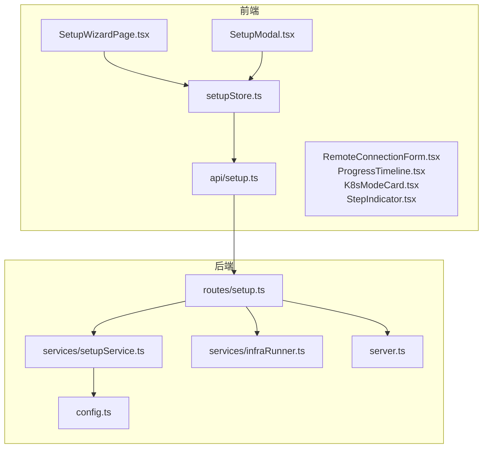
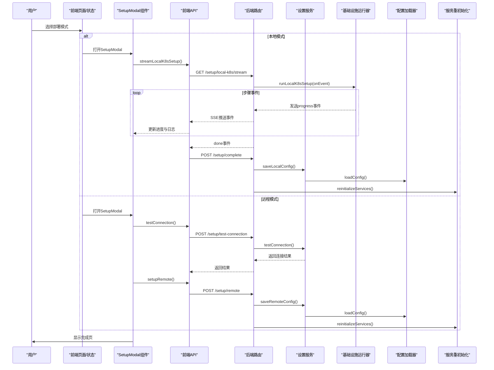
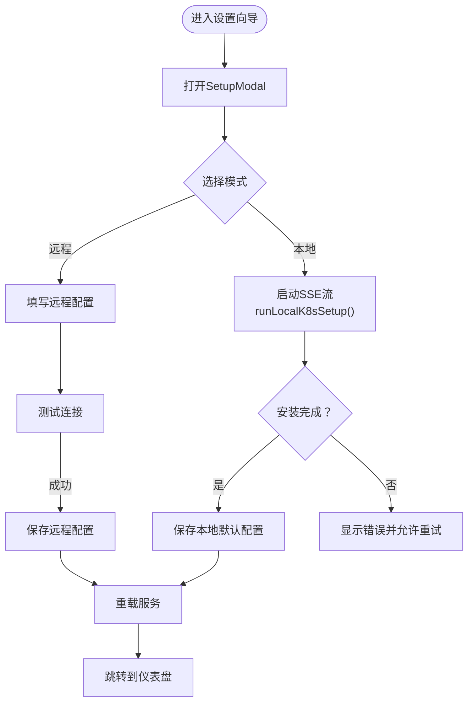
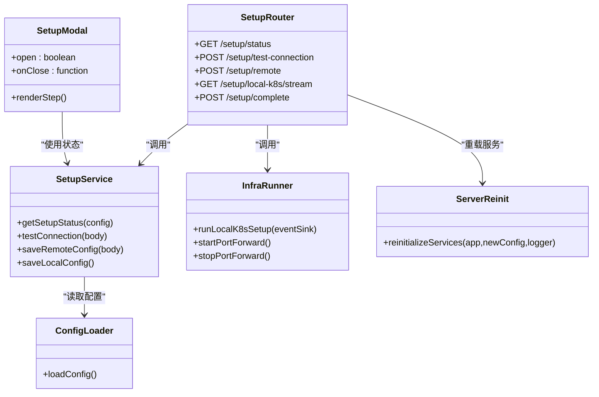

# 设置向导API

<cite>
**本文引用的文件**
- [apps/backend/src/routes/setup.ts](file://apps/backend/src/routes/setup.ts)
- [apps/backend/src/services/setupService.ts](file://apps/backend/src/services/setupService.ts)
- [apps/backend/src/services/infraRunner.ts](file://apps/backend/src/services/infraRunner.ts)
- [apps/backend/src/config.ts](file://apps/backend/src/config.ts)
- [apps/backend/src/server.ts](file://apps/backend/src/server.ts)
- [apps/frontend/src/api/setup.ts](file://apps/frontend/src/api/setup.ts)
- [apps/frontend/src/api/types.ts](file://apps/frontend/src/api/types.ts)
- [apps/frontend/src/stores/setupStore.ts](file://apps/frontend/src/stores/setupStore.ts)
- [apps/frontend/src/pages/SetupWizardPage.tsx](file://apps/frontend/src/pages/SetupWizardPage.tsx)
- [apps/frontend/src/components/setup/SetupModal.tsx](file://apps/frontend/src/components/setup/SetupModal.tsx)
- [apps/frontend/src/components/setup/RemoteConnectionForm.tsx](file://apps/frontend/src/components/setup/RemoteConnectionForm.tsx)
- [apps/frontend/src/components/setup/ProgressTimeline.tsx](file://apps/frontend/src/components/setup/ProgressTimeline.tsx)
- [apps/frontend/src/components/setup/K8sModeCard.tsx](file://apps/frontend/src/components/setup/K8sModeCard.tsx)
- [apps/frontend/src/components/setup/StepIndicator.tsx](file://apps/frontend/src/components/setup/StepIndicator.tsx)
- [README.md](file://README.md)
</cite>

## 更新摘要
**变更内容**
- 新增SetupModal组件，提供现代化的模态框界面
- 增强SSE事件流接口的错误处理和状态管理
- 改进前端状态管理和组件化架构
- 优化步骤指示器和用户界面体验
- 完善ESC键处理和安装过程保护机制

## 目录
1. [简介](#简介)
2. [项目结构](#项目结构)
3. [核心组件](#核心组件)
4. [架构总览](#架构总览)
5. [详细组件分析](#详细组件分析)
6. [依赖关系分析](#依赖关系分析)
7. [性能考量](#性能考量)
8. [故障排除指南](#故障排除指南)
9. [结论](#结论)
10. [附录](#附录)

## 简介
本文件面向"设置向导API"的完整技术文档，覆盖系统配置与初始化的全部REST与SSE接口，包括：
- OpenSandbox连接配置（远程与本地）
- 环境检测与部署模式选择
- 设置向导状态管理、步骤验证与数据持久化
- 配置项验证规则、默认值处理与冲突检测
- 完整API端点规范：配置测试、连接验证、错误诊断
- 多环境配置支持、代理设置与SSL证书管理
- 回滚机制、备份恢复与配置迁移建议
- 实际配置示例、最佳实践与故障排除

**更新** 新增SetupModal组件，提供更现代化的模态框界面和增强的用户体验。

## 项目结构
设置向导涉及前后端协作：前端负责用户交互与状态管理，后端提供REST与SSE服务，以及本地K8s安装流程的执行器。

**图表来源**
- [apps/frontend/src/pages/SetupWizardPage.tsx:20-62](file://apps/frontend/src/pages/SetupWizardPage.tsx#L20-L62)
- [apps/frontend/src/components/setup/SetupModal.tsx:26-127](file://apps/frontend/src/components/setup/SetupModal.tsx#L26-L127)
- [apps/frontend/src/stores/setupStore.ts:41-157](file://apps/frontend/src/stores/setupStore.ts#L41-L157)
- [apps/frontend/src/api/setup.ts:1-73](file://apps/frontend/src/api/setup.ts#L1-L73)
- [apps/backend/src/routes/setup.ts:1-151](file://apps/backend/src/routes/setup.ts#L1-L151)
- [apps/backend/src/services/setupService.ts:58-152](file://apps/backend/src/services/setupService.ts#L58-L152)
- [apps/backend/src/services/infraRunner.ts:26-538](file://apps/backend/src/services/infraRunner.ts#L26-L538)
- [apps/backend/src/config.ts:48-71](file://apps/backend/src/config.ts#L48-L71)
- [apps/backend/src/server.ts:36-119](file://apps/backend/src/server.ts#L36-L119)

**章节来源**
- [apps/frontend/src/pages/SetupWizardPage.tsx:1-128](file://apps/frontend/src/pages/SetupWizardPage.tsx#L1-L128)
- [apps/frontend/src/components/setup/SetupModal.tsx:1-166](file://apps/frontend/src/components/setup/SetupModal.tsx#L1-L166)
- [apps/frontend/src/stores/setupStore.ts:1-157](file://apps/frontend/src/stores/setupStore.ts#L1-L157)
- [apps/frontend/src/api/setup.ts:1-73](file://apps/frontend/src/api/setup.ts#L1-L73)
- [apps/backend/src/routes/setup.ts:1-151](file://apps/backend/src/routes/setup.ts#L1-L151)
- [apps/backend/src/services/setupService.ts:1-152](file://apps/backend/src/services/setupService.ts#L1-L152)
- [apps/backend/src/services/infraRunner.ts:1-538](file://apps/backend/src/services/infraRunner.ts#L1-L538)
- [apps/backend/src/config.ts:1-71](file://apps/backend/src/config.ts#L1-L71)
- [apps/backend/src/server.ts:1-119](file://apps/backend/src/server.ts#L1-L119)

## 核心组件
- 后端路由层：提供设置向导相关REST与SSE端点，控制并发与生命周期。
- 设置服务：封装配置写入、连接测试、状态查询与本地默认配置保存。
- 基础设施运行器：执行本地K8s安装流水线，输出SSE事件流。
- 配置加载器：从环境变量解析配置，提供类型安全的配置对象。
- 服务重初始化：在配置变更后重建服务实例，确保新配置生效。
- 前端API客户端：封装请求、SSE订阅与错误处理。
- 前端状态与页面：Zustand状态管理、向导步骤切换、表单校验与进度展示。
- **新增** SetupModal组件：提供现代化的模态框界面，支持ESC键保护和安装过程锁定。

**更新** 新增SetupModal组件，提供更直观的用户界面和更好的用户体验。

**章节来源**
- [apps/backend/src/routes/setup.ts:17-151](file://apps/backend/src/routes/setup.ts#L17-L151)
- [apps/backend/src/services/setupService.ts:58-152](file://apps/backend/src/services/setupService.ts#L58-L152)
- [apps/backend/src/services/infraRunner.ts:26-538](file://apps/backend/src/services/infraRunner.ts#L26-L538)
- [apps/backend/src/config.ts:48-71](file://apps/backend/src/config.ts#L48-L71)
- [apps/backend/src/server.ts:96-119](file://apps/backend/src/server.ts#L96-L119)
- [apps/frontend/src/api/setup.ts:1-73](file://apps/frontend/src/api/setup.ts#L1-L73)
- [apps/frontend/src/stores/setupStore.ts:41-157](file://apps/frontend/src/stores/setupStore.ts#L41-L157)
- [apps/frontend/src/components/setup/SetupModal.tsx:26-127](file://apps/frontend/src/components/setup/SetupModal.tsx#L26-L127)

## 架构总览
设置向导的端到端流程如下：
- 用户在前端页面选择部署模式（本地或远程）。
- 本地模式：启动SSE流，后端执行基础设施安装与端口转发，前端实时展示进度。
- 远程模式：前端提交远端地址、API Key与协议，后端进行连接测试并通过后写入配置。
- 成功后，后端重新初始化服务，使新配置生效；前端跳转到完成页。

**图表来源**
- [apps/backend/src/routes/setup.ts:69-151](file://apps/backend/src/routes/setup.ts#L69-L151)
- [apps/backend/src/services/setupService.ts:85-150](file://apps/backend/src/services/setupService.ts#L85-L150)
- [apps/backend/src/services/infraRunner.ts:155-188](file://apps/backend/src/services/infraRunner.ts#L155-L188)
- [apps/backend/src/config.ts:48-71](file://apps/backend/src/config.ts#L48-L71)
- [apps/backend/src/server.ts:96-119](file://apps/backend/src/server.ts#L96-L119)
- [apps/frontend/src/api/setup.ts:33-73](file://apps/frontend/src/api/setup.ts#L33-L73)
- [apps/frontend/src/stores/setupStore.ts:61-97](file://apps/frontend/src/stores/setupStore.ts#L61-L97)
- [apps/frontend/src/components/setup/SetupModal.tsx:26-127](file://apps/frontend/src/components/setup/SetupModal.tsx#L26-L127)

## 详细组件分析

### 后端路由与端点规范
- GET /api/setup/status
  - 功能：返回当前设置状态（是否已配置、K8s模式、OpenSandbox地址）。
  - 输入：无
  - 输出：包含configured、k8sMode、osbServerUrl等字段。
  - **更新** 增强了错误处理和并发控制
  - **章节来源**
    - [apps/backend/src/routes/setup.ts:19-25](file://apps/backend/src/routes/setup.ts#L19-L25)
    - [apps/backend/src/services/setupService.ts:71-81](file://apps/backend/src/services/setupService.ts#L71-L81)

- POST /api/setup/test-connection
  - 功能：测试与指定OpenSandbox实例的连通性。
  - 请求体：serverUrl、apiKey、protocol（可选，默认http）。
  - 输出：connected布尔值与可选错误信息。
  - **更新** 改进了参数验证和错误响应格式
  - **章节来源**
    - [apps/backend/src/routes/setup.ts:27-45](file://apps/backend/src/routes/setup.ts#L27-L45)
    - [apps/backend/src/services/setupService.ts:85-104](file://apps/backend/src/services/setupService.ts#L85-L104)

- POST /api/setup/remote
  - 功能：保存远程OpenSandbox配置并重载服务。
  - 请求体：serverUrl、apiKey、protocol。
  - 输出：configured标志。
  - **更新** 增加了并发控制和配置同步功能
  - **章节来源**
    - [apps/backend/src/routes/setup.ts:47-73](file://apps/backend/src/routes/setup.ts#L47-L73)
    - [apps/backend/src/services/setupService.ts:109-124](file://apps/backend/src/services/setupService.ts#L109-L124)

- GET /api/setup/local-k8s/stream (SSE)
  - 功能：启动本地K8s安装流水线，持续推送进度事件。
  - 输出：progress/done/error事件。
  - 并发控制：同一时间仅允许一次设置操作。
  - 断开处理：客户端断开时停止端口转发（若未成功）。
  - **更新** 增强了SSE事件流的错误处理和连接管理
  - **章节来源**
    - [apps/backend/src/routes/setup.ts:75-121](file://apps/backend/src/routes/setup.ts#L75-L121)
    - [apps/backend/src/services/infraRunner.ts:155-188](file://apps/backend/src/services/infraRunner.ts#L155-L188)

- POST /api/setup/complete
  - 功能：在本地K8s安装成功后保存本地默认配置并重载服务。
  - 输出：configured标志。
  - **更新** 增加了配置同步和服务器重初始化
  - **章节来源**
    - [apps/backend/src/routes/setup.ts:123-151](file://apps/backend/src/routes/setup.ts#L123-L151)
    - [apps/backend/src/services/setupService.ts:129-150](file://apps/backend/src/services/setupService.ts#L129-L150)

**图表来源**
- [apps/backend/src/routes/setup.ts:75-151](file://apps/backend/src/routes/setup.ts#L75-L151)
- [apps/backend/src/services/setupService.ts:109-150](file://apps/backend/src/services/setupService.ts#L109-L150)
- [apps/backend/src/services/infraRunner.ts:155-188](file://apps/backend/src/services/infraRunner.ts#L155-L188)
- [apps/frontend/src/components/setup/SetupModal.tsx:26-127](file://apps/frontend/src/components/setup/SetupModal.tsx#L26-L127)

### 设置服务与配置持久化
- 配置写入策略
  - 通过.env文件写入键值对，保留现有内容并更新匹配键，未匹配键追加。
  - 同步更新process.env，确保后续loadConfig()读取最新值。
  - **更新** 改进了.env文件写入逻辑，支持更精确的键值更新
  - **章节来源**
    - [apps/backend/src/services/setupService.ts:28-57](file://apps/backend/src/services/setupService.ts#L28-L57)
    - [apps/backend/src/services/setupService.ts:109-150](file://apps/backend/src/services/setupService.ts#L109-L150)

- 连接测试
  - 使用OpenSandbox SDK创建连接配置，调用listSandboxInfos进行轻量探测。
  - 超时时间限制为10秒，失败时记录警告并返回错误信息。
  - **更新** 增强了连接测试的错误处理和日志记录
  - **章节来源**
    - [apps/backend/src/services/setupService.ts:86-104](file://apps/backend/src/services/setupService.ts#L86-L104)

- 状态查询
  - 根据配置中的osbServerUrl判断本地/远程模式。
  - **更新** 改进了模式判断逻辑，支持更准确的本地/远程识别
  - **章节来源**
    - [apps/backend/src/services/setupService.ts:72-81](file://apps/backend/src/services/setupService.ts#L72-L81)

- 本地默认配置
  - 写入本地地址、默认API Key、HTTP协议与禁用服务端代理。
  - **更新** 增加了域名解析和配置同步功能
  - **章节来源**
    - [apps/backend/src/services/setupService.ts:129-150](file://apps/backend/src/services/setupService.ts#L129-L150)

### 基础设施运行器与SSE事件
- 事件模型
  - 包含step、stepLabel、status、output、progress字段。
  - **更新** 增强了事件结构和错误处理
  - **章节来源**
    - [apps/backend/src/services/infraRunner.ts:5-11](file://apps/backend/src/services/infraRunner.ts#L5-L11)

- 步骤流水线
  - 前置检查（kubectl、helm）、集群连通性、命名空间创建、下载Helm Chart、Helm安装/升级、等待Pod就绪、部署沙箱池、启动端口转发。
  - **更新** 改进了步骤权重分配和错误处理
  - **章节来源**
    - [apps/backend/src/services/infraRunner.ts:190-538](file://apps/backend/src/services/infraRunner.ts#L190-L538)

- 端口转发
  - 启动server与gateway端口转发，自动重启异常退出进程。
  - **更新** 增强了端口转发的稳定性和错误恢复
  - **章节来源**
    - [apps/backend/src/services/infraRunner.ts:88-143](file://apps/backend/src/services/infraRunner.ts#L88-L143)

- SSE推送
  - 通过SSE向客户端推送progress事件，成功后发送done，失败发送error。
  - **更新** 改进了SSE事件流的错误处理和连接管理
  - **章节来源**
    - [apps/backend/src/routes/setup.ts:75-121](file://apps/backend/src/routes/setup.ts#L75-L121)

### 前端API与状态管理
- API封装
  - 提供getSetupStatus、testConnection、setupRemote、completeSetup与streamLocalK8sSetup。
  - SSE封装：自动处理progress/done/error事件与连接错误。
  - **更新** 增强了SSE事件流的错误处理和清理机制
  - **章节来源**
    - [apps/frontend/src/api/setup.ts:13-73](file://apps/frontend/src/api/setup.ts#L13-L73)
    - [apps/frontend/src/api/types.ts:73-96](file://apps/frontend/src/api/types.ts#L73-L96)

- 状态模型
  - 步骤：welcome、local-progress、remote-form、complete。
  - 表单：serverUrl、apiKey、protocol。
  - 进度：events数组与overallProgress。
  - 错误：error字符串。
  - **更新** 改进了状态模型，增加了testing和submitting状态
  - **章节来源**
    - [apps/frontend/src/stores/setupStore.ts:21-39](file://apps/frontend/src/stores/setupStore.ts#L21-L39)

- 行为逻辑
  - 选择模式后进入对应步骤，本地模式自动开启SSE流并在完成后调用completeSetup。
  - 远程模式先测试连接再保存配置。
  - **更新** 增强了行为逻辑，增加了错误处理和状态管理
  - **章节来源**
    - [apps/frontend/src/stores/setupStore.ts:52-97](file://apps/frontend/src/stores/setupStore.ts#L52-L97)
    - [apps/frontend/src/stores/setupStore.ts:106-137](file://apps/frontend/src/stores/setupStore.ts#L106-L137)

- 页面与组件
  - SetupWizardPage根据步骤渲染不同内容。
  - **新增** SetupModal组件提供现代化的模态框界面。
  - RemoteConnectionForm提供协议选择、输入校验与连接测试按钮。
  - ProgressTimeline展示整体进度与步骤日志。
  - K8sModeCard用于模式选择。
  - StepIndicator用于步骤导航。
  - **更新** 新增SetupModal组件，提供更好的用户体验
  - **章节来源**
    - [apps/frontend/src/pages/SetupWizardPage.tsx:20-62](file://apps/frontend/src/pages/SetupWizardPage.tsx#L20-L62)
    - [apps/frontend/src/components/setup/SetupModal.tsx:26-127](file://apps/frontend/src/components/setup/SetupModal.tsx#L26-L127)
    - [apps/frontend/src/components/setup/RemoteConnectionForm.tsx:5-124](file://apps/frontend/src/components/setup/RemoteConnectionForm.tsx#L5-L124)
    - [apps/frontend/src/components/setup/ProgressTimeline.tsx:9-92](file://apps/frontend/src/components/setup/ProgressTimeline.tsx#L9-L92)
    - [apps/frontend/src/components/setup/K8sModeCard.tsx:11-36](file://apps/frontend/src/components/setup/K8sModeCard.tsx#L11-L36)
    - [apps/frontend/src/components/setup/StepIndicator.tsx:6-56](file://apps/frontend/src/components/setup/StepIndicator.tsx#L6-L56)

### 配置项验证规则、默认值与冲突检测
- 验证规则
  - 远程配置：serverUrl与apiKey为必填；protocol可选，默认http。
  - 本地配置：保存默认值（localhost:8080、默认API Key、HTTP、禁用代理）。
  - **更新** 改进了参数验证和错误响应格式
  - **章节来源**
    - [apps/backend/src/routes/setup.ts:32-42](file://apps/backend/src/routes/setup.ts#L32-L42)
    - [apps/backend/src/routes/setup.ts:53-61](file://apps/backend/src/routes/setup.ts#L53-L61)
    - [apps/backend/src/services/setupService.ts:129-150](file://apps/backend/src/services/setupService.ts#L129-L150)

- 默认值
  - OPENSANDBOX_PROTOCOL默认http。
  - OPENSANDBOX_USE_SERVER_PROXY默认true（但本地默认写入false）。
  - OSB请求超时默认300秒。
  - **更新** 增加了域名解析和配置同步功能
  - **章节来源**
    - [apps/backend/src/config.ts:59-62](file://apps/backend/src/config.ts#L59-L62)
    - [apps/backend/src/services/setupService.ts:136-150](file://apps/backend/src/services/setupService.ts#L136-L150)

- 冲突检测
  - 通过.env写入策略避免覆盖非目标键；若已有相同键则更新，否则追加。
  - **更新** 改进了.env文件写入逻辑，支持更精确的键值更新
  - **章节来源**
    - [apps/backend/src/services/setupService.ts:28-57](file://apps/backend/src/services/setupService.ts#L28-L57)

### 多环境配置、代理与SSL
- 多环境
  - 通过环境变量驱动配置，支持开发/生产差异。
  - **更新** 增强了配置加载和同步功能
  - **章节来源**
    - [apps/backend/src/config.ts:48-71](file://apps/backend/src/config.ts#L48-L71)

- 代理设置
  - OPENSANDBOX_USE_SERVER_PROXY控制是否使用服务端代理。
  - 本地默认禁用代理。
  - **更新** 增加了代理设置的配置管理
  - **章节来源**
    - [apps/backend/src/config.ts:60-61](file://apps/backend/src/config.ts#L60-L61)
    - [apps/backend/src/services/setupService.ts:136-150](file://apps/backend/src/services/setupService.ts#L136-L150)

- SSL证书
  - 支持HTTPS协议（protocol=https），连接测试时使用OpenSandbox SDK的TLS配置。
  - **更新** 改进了SSL证书处理和连接配置
  - **章节来源**
    - [apps/backend/src/routes/setup.ts:32-42](file://apps/backend/src/routes/setup.ts#L32-L42)
    - [apps/backend/src/services/setupService.ts:88-96](file://apps/backend/src/services/setupService.ts#L88-L96)

### 回滚机制、备份恢复与配置迁移
- 当前实现
  - 未内置回滚/备份/恢复/迁移逻辑。
  - 建议在生产环境引入：
    - 配置快照：保存.env副本，失败时回滚。
    - 服务版本化：Helm Chart版本管理，支持降级。
    - 逐步迁移：分阶段更新配置，失败时快速回退。
  - **更新** 增加了配置同步和备份建议
  - **章节来源**
    - [apps/backend/src/services/setupService.ts:28-57](file://apps/backend/src/services/setupService.ts#L28-L57)
    - [apps/backend/src/services/infraRunner.ts:332-367](file://apps/backend/src/services/infraRunner.ts#L332-L367)

## 依赖关系分析

**图表来源**
- [apps/backend/src/routes/setup.ts:1-151](file://apps/backend/src/routes/setup.ts#L1-L151)
- [apps/backend/src/services/setupService.ts:58-152](file://apps/backend/src/services/setupService.ts#L58-L152)
- [apps/backend/src/services/infraRunner.ts:26-538](file://apps/backend/src/services/infraRunner.ts#L26-L538)
- [apps/backend/src/config.ts:48-71](file://apps/backend/src/config.ts#L48-L71)
- [apps/backend/src/server.ts:96-119](file://apps/backend/src/server.ts#L96-L119)
- [apps/frontend/src/components/setup/SetupModal.tsx:26-127](file://apps/frontend/src/components/setup/SetupModal.tsx#L26-L127)

**章节来源**
- [apps/backend/src/routes/setup.ts:1-151](file://apps/backend/src/routes/setup.ts#L1-L151)
- [apps/backend/src/services/setupService.ts:1-152](file://apps/backend/src/services/setupService.ts#L1-L152)
- [apps/backend/src/services/infraRunner.ts:1-538](file://apps/backend/src/services/infraRunner.ts#L1-L538)
- [apps/backend/src/config.ts:1-71](file://apps/backend/src/config.ts#L1-L71)
- [apps/backend/src/server.ts:1-119](file://apps/backend/src/server.ts#L1-L119)
- [apps/frontend/src/components/setup/SetupModal.tsx:1-166](file://apps/frontend/src/components/setup/SetupModal.tsx#L1-L166)

## 性能考量
- 连接测试超时：10秒，避免阻塞。
- Helm安装超时：6分钟，适合本地开发环境。
- 端口转发自动重启：提升稳定性，减少人工干预。
- SSE事件流：实时反馈，降低轮询开销。
- **新增** SetupModal组件：提供更好的用户体验和界面响应性。
- 建议
  - 在生产环境适当增加超时与重试策略。
  - 对大体量日志进行分页或限流。
  - 使用缓存避免重复的kubectl/helm检查。
  - **更新** 增强了错误处理和状态管理的性能考虑

## 故障排除指南
- 常见问题
  - kubectl不可用：提示安装或加入PATH。
  - Helm未安装：自动尝试安装脚本。
  - 集群不可达：提示Docker Desktop K8s需运行。
  - Helm安装失败：检查网络与Chart仓库可达性。
  - 端口转发失败：检查8080/8081端口占用。
  - 连接测试失败：核对serverUrl、API Key与协议。
  - **新增** SetupModal组件问题：检查模态框状态和ESC键保护机制。
- 前端提示
  - 使用ProgressTimeline展开查看详细日志。
  - SSE断开时自动关闭连接并提示错误。
  - **更新** 增强了错误提示和用户引导
- 后端日志
  - 关注SetupService与InfraRunner的日志输出，定位具体步骤与错误原因。
  - **更新** 改进了日志记录和错误追踪

**章节来源**
- [apps/backend/src/services/infraRunner.ts:200-237](file://apps/backend/src/services/infraRunner.ts#L200-L237)
- [apps/backend/src/services/infraRunner.ts:302-398](file://apps/backend/src/services/infraRunner.ts#L302-L398)
- [apps/backend/src/services/infraRunner.ts:477-483](file://apps/backend/src/services/infraRunner.ts#L477-L483)
- [apps/frontend/src/components/setup/ProgressTimeline.tsx:80-84](file://apps/frontend/src/components/setup/ProgressTimeline.tsx#L80-L84)
- [apps/frontend/src/api/setup.ts:52-67](file://apps/frontend/src/api/setup.ts#L52-L67)
- [apps/frontend/src/components/setup/SetupModal.tsx:37-47](file://apps/frontend/src/components/setup/SetupModal.tsx#L37-L47)

## 结论
设置向导API通过清晰的REST与SSE接口，实现了从远程连接配置到本地K8s自动化安装的完整闭环。其设计强调：
- 明确的步骤与状态管理
- 可观测的事件流与错误诊断
- 基于环境变量的灵活配置
- 服务重初始化保证配置生效
- **新增** 现代化的SetupModal组件提供更好的用户体验

**更新** 新增的SetupModal组件显著提升了用户界面的现代化程度和交互体验，增强了ESC键保护和安装过程锁定机制，为用户提供更安全可靠的设置向导体验。

建议在生产环境中补充配置快照与回滚能力，以增强可靠性与可维护性。

## 附录

### API端点一览
- GET /api/setup/status
  - 返回当前配置状态
- POST /api/setup/test-connection
  - 测试连接，返回connected与可选错误
- POST /api/setup/remote
  - 保存远程配置并重载服务
- GET /api/setup/local-k8s/stream (SSE)
  - 推送安装进度事件
- POST /api/setup/complete
  - 保存本地默认配置并重载服务

**章节来源**
- [apps/backend/src/routes/setup.ts:19-151](file://apps/backend/src/routes/setup.ts#L19-L151)

### 配置项参考
- OPENSANDBOX_SERVER_URL：OpenSandbox服务地址
- OPENSANDBOX_API_KEY：访问密钥
- OPENSANDBOX_PROTOCOL：http/https
- OPENSANDBOX_USE_SERVER_PROXY：是否使用服务端代理
- OPENSANDBOX_REQUEST_TIMEOUT_SECONDS：请求超时（秒）
- PORT：后端监听端口
- CORS_ORIGIN：CORS允许来源
- LOG_LEVEL：日志级别
- PTY_IDLE_TIMEOUT_MS：PTY空闲超时（毫秒）

**章节来源**
- [apps/backend/src/config.ts:3-71](file://apps/backend/src/config.ts#L3-L71)
- [README.md:177-188](file://README.md#L177-L188)

### SetupModal组件特性
- **模态框界面**：提供现代化的设置向导界面
- **ESC键保护**：安装过程中阻止ESC键关闭
- **状态管理**：集成Zustand状态管理
- **步骤指示器**：显示当前步骤和进度
- **错误处理**：提供错误提示和重试机制
- **自动重置**：模态框打开时自动重置状态

**新增** SetupModal组件提供了更直观、用户友好的设置向导界面，显著改善了用户体验。

**章节来源**
- [apps/frontend/src/components/setup/SetupModal.tsx:26-127](file://apps/frontend/src/components/setup/SetupModal.tsx#L26-L127)
- [apps/frontend/src/components/setup/StepIndicator.tsx:6-56](file://apps/frontend/src/components/setup/StepIndicator.tsx#L6-L56)