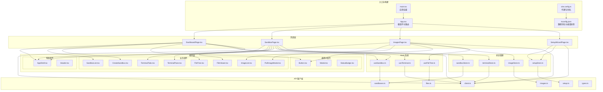
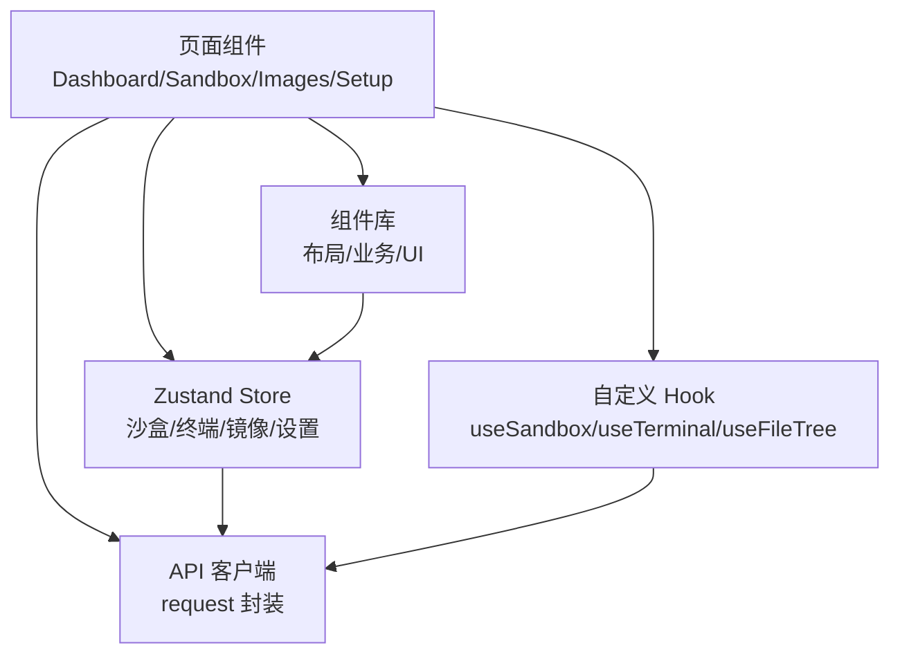
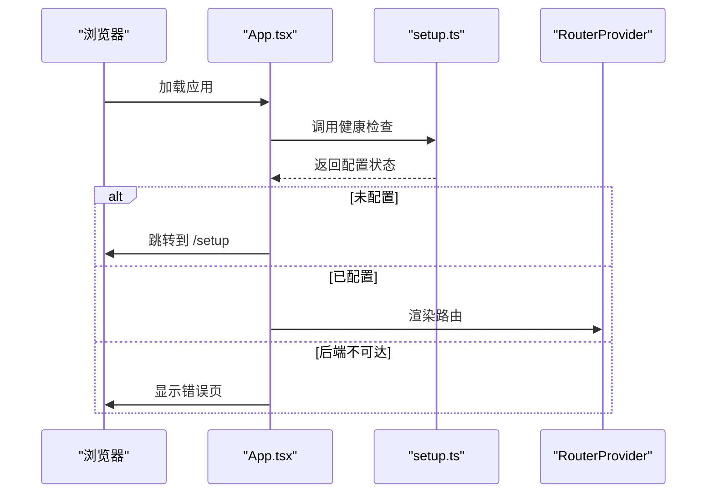
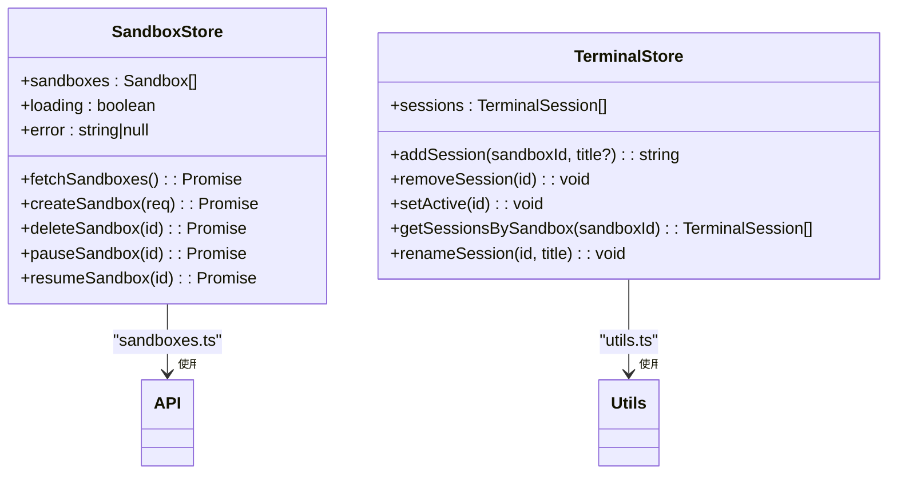
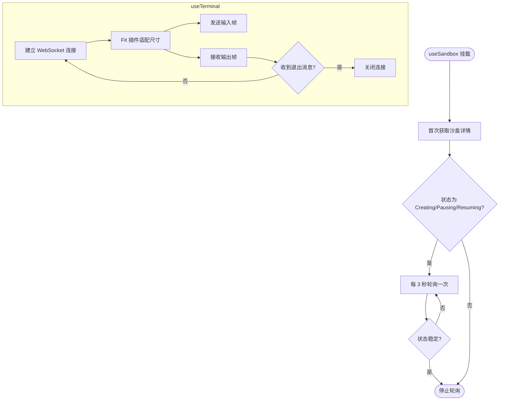
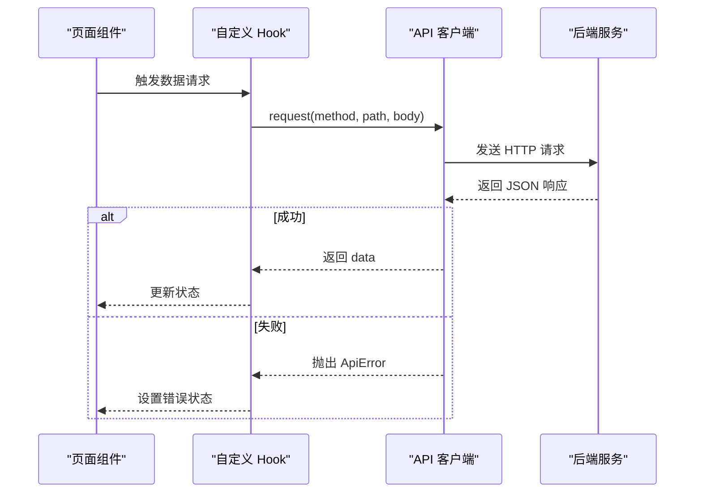
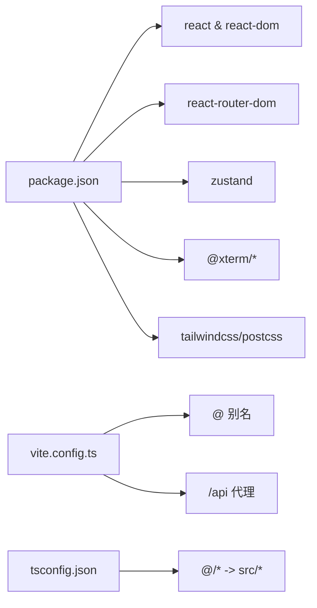

# 前端应用架构

<cite>
**本文档引用的文件**
- [main.tsx](file://apps/frontend/src/main.tsx)
- [App.tsx](file://apps/frontend/src/App.tsx)
- [package.json](file://apps/frontend/package.json)
- [tsconfig.json](file://apps/frontend/tsconfig.json)
- [vite.config.ts](file://apps/frontend/vite.config.ts)
- [DashboardPage.tsx](file://apps/frontend/src/pages/DashboardPage.tsx)
- [SandboxPage.tsx](file://apps/frontend/src/pages/SandboxPage.tsx)
- [ImagesPage.tsx](file://apps/frontend/src/pages/ImagesPage.tsx)
- [SetupWizardPage.tsx](file://apps/frontend/src/pages/SetupWizardPage.tsx)
- [client.ts](file://apps/frontend/src/api/client.ts)
- [useSandbox.ts](file://apps/frontend/src/hooks/useSandbox.ts)
- [useTerminal.ts](file://apps/frontend/src/hooks/useTerminal.ts)
- [useFileTree.ts](file://apps/frontend/src/hooks/useFileTree.ts)
- [sandboxStore.ts](file://apps/frontend/src/stores/sandboxStore.ts)
- [terminalStore.ts](file://apps/frontend/src/stores/terminalStore.ts)
</cite>

## 目录
1. [简介](#简介)
2. [项目结构](#项目结构)
3. [核心组件](#核心组件)
4. [架构总览](#架构总览)
5. [详细组件分析](#详细组件分析)
6. [依赖关系分析](#依赖关系分析)
7. [性能考虑](#性能考虑)
8. [故障排除指南](#故障排除指南)
9. [结论](#结论)
10. [附录](#附录)

## 简介
本文件为 Sandbox Manager 前端应用的架构文档，聚焦于 React 应用的初始化流程、路由与导航系统、组件体系（布局组件、业务组件、UI 组件）、状态管理（Zustand）、自定义 Hook 设计（useSandbox、useTerminal、useFileTree）、API 客户端层（请求封装、错误处理、响应解析），以及性能优化与用户体验设计建议。文档旨在帮助开发者快速理解系统设计与实现细节，并提供可操作的最佳实践。

## 项目结构
前端采用 Vite + React 19 + TypeScript 构建，使用 TailwindCSS 进行样式管理，Zustand 实现轻量级全局状态管理。项目通过路径别名 @/* 指向 src 目录，便于模块化组织与导入。

图表来源
- [main.tsx:1-12](file://apps/frontend/src/main.tsx#L1-L12)
- [App.tsx:1-114](file://apps/frontend/src/App.tsx#L1-L114)
- [vite.config.ts:1-22](file://apps/frontend/vite.config.ts#L1-L22)
- [tsconfig.json:1-15](file://apps/frontend/tsconfig.json#L1-L15)

章节来源
- [main.tsx:1-12](file://apps/frontend/src/main.tsx#L1-L12)
- [App.tsx:1-114](file://apps/frontend/src/App.tsx#L1-L114)
- [vite.config.ts:1-22](file://apps/frontend/vite.config.ts#L1-L22)
- [tsconfig.json:1-15](file://apps/frontend/tsconfig.json#L1-L15)

## 核心组件
- 应用入口与初始化：在入口文件中创建根节点并渲染根组件，同时加载全局样式与终端主题覆盖样式。
- 根组件与路由：根组件负责健康检查与后端可达性判断，根据结果决定渲染占位页或 RouterProvider；定义多页面路由，支持重定向到仪表盘。
- 页面组件：DashboardPage、SandboxPage、ImagesPage、SetupWizardPage 分别承载不同业务域的数据展示与交互。
- 组件分层：布局组件（AppShell/Header）统一页面骨架；业务组件（列表、卡片、模态框）承载具体功能；通用 UI 组件（按钮、状态徽章、模态框）复用性强。
- 状态管理：Zustand Store 负责沙盒、终端会话、镜像、安装向导等状态的集中管理，提供原子化的读写与派生逻辑。
- Hook 系统：useSandbox、useTerminal、useFileTree 封装数据获取、连接建立、树形目录展开与文件查看等复杂交互。
- API 客户端：统一的 request 封装，处理 Content-Type、JSON 解析、成功/失败分支与错误抛出，类型安全的响应模型。

章节来源
- [main.tsx:1-12](file://apps/frontend/src/main.tsx#L1-L12)
- [App.tsx:1-114](file://apps/frontend/src/App.tsx#L1-L114)
- [DashboardPage.tsx:1-54](file://apps/frontend/src/pages/DashboardPage.tsx#L1-L54)
- [SandboxPage.tsx:1-164](file://apps/frontend/src/pages/SandboxPage.tsx#L1-L164)
- [ImagesPage.tsx:1-43](file://apps/frontend/src/pages/ImagesPage.tsx#L1-L43)
- [SetupWizardPage.tsx:1-128](file://apps/frontend/src/pages/SetupWizardPage.tsx#L1-L128)
- [client.ts:1-45](file://apps/frontend/src/api/client.ts#L1-L45)

## 架构总览
前端采用“页面组件 + 组件库 + 状态管理 + Hook + API 客户端”的分层架构。页面组件负责业务编排与用户交互；组件库提供可复用的 UI 元素；Zustand Store 提供跨组件共享的状态；自定义 Hook 抽象复杂副作用；API 客户端统一处理网络请求与错误。

图表来源
- [DashboardPage.tsx:1-54](file://apps/frontend/src/pages/DashboardPage.tsx#L1-L54)
- [SandboxPage.tsx:1-164](file://apps/frontend/src/pages/SandboxPage.tsx#L1-L164)
- [ImagesPage.tsx:1-43](file://apps/frontend/src/pages/ImagesPage.tsx#L1-L43)
- [SetupWizardPage.tsx:1-128](file://apps/frontend/src/pages/SetupWizardPage.tsx#L1-L128)
- [sandboxStore.ts:1-63](file://apps/frontend/src/stores/sandboxStore.ts#L1-L63)
- [terminalStore.ts:1-68](file://apps/frontend/src/stores/terminalStore.ts#L1-L68)
- [useSandbox.ts:1-59](file://apps/frontend/src/hooks/useSandbox.ts#L1-L59)
- [useTerminal.ts:1-180](file://apps/frontend/src/hooks/useTerminal.ts#L1-L180)
- [useFileTree.ts:1-62](file://apps/frontend/src/hooks/useFileTree.ts#L1-L62)
- [client.ts:1-45](file://apps/frontend/src/api/client.ts#L1-L45)

## 详细组件分析

### 应用初始化与路由系统
- 初始化流程：入口文件创建根节点并渲染根组件，加载全局样式与终端主题覆盖样式。
- 路由配置：使用 createBrowserRouter 定义多页面路由，包含仪表盘、沙盒详情、镜像管理、安装向导；默认重定向至仪表盘。
- 后端可达性检查：根组件在挂载时调用健康检查接口，根据返回的配置状态决定是否跳转到安装向导或进入正常路由；若后端不可达则显示错误提示页。

图表来源
- [App.tsx:1-114](file://apps/frontend/src/App.tsx#L1-L114)
- [client.ts:1-45](file://apps/frontend/src/api/client.ts#L1-L45)

章节来源
- [main.tsx:1-12](file://apps/frontend/src/main.tsx#L1-L12)
- [App.tsx:1-114](file://apps/frontend/src/App.tsx#L1-L114)

### 组件系统设计模式
- 布局组件：AppShell/Header 提供统一的页面骨架、标题、返回按钮与操作区，确保各页面风格一致。
- 业务组件：如 SandboxList、CreateSandbox、ImageList、PullImageModal、TerminalTabs、TerminalPane、FileTree、FileViewer 等，承担具体业务职责。
- UI 组件：Button、Modal、StatusBadge 等通用组件，提供一致的交互与视觉体验。
- 层次结构：页面组件组合布局与业务组件；业务组件再组合通用 UI 组件；通过 props 传递数据与回调，保持低耦合高内聚。

章节来源
- [DashboardPage.tsx:1-54](file://apps/frontend/src/pages/DashboardPage.tsx#L1-L54)
- [SandboxPage.tsx:1-164](file://apps/frontend/src/pages/SandboxPage.tsx#L1-L164)
- [ImagesPage.tsx:1-43](file://apps/frontend/src/pages/ImagesPage.tsx#L1-L43)
- [SetupWizardPage.tsx:1-128](file://apps/frontend/src/pages/SetupWizardPage.tsx#L1-L128)

### 状态管理系统（Zustand）
- 沙盒状态管理：提供列表拉取、创建、删除、暂停/恢复等操作；对后端返回的分页结构进行兼容处理；在创建后自动刷新列表。
- 终端状态管理：维护会话集合，支持新增、激活、重命名、按沙盒筛选与移除；新增会话时自动将其他会话置为非激活。
- 镜像与设置状态：分别对应镜像列表与安装向导流程状态，页面组件通过对应的 Store Hook 进行读写。

图表来源
- [sandboxStore.ts:1-63](file://apps/frontend/src/stores/sandboxStore.ts#L1-L63)
- [terminalStore.ts:1-68](file://apps/frontend/src/stores/terminalStore.ts#L1-L68)

章节来源
- [sandboxStore.ts:1-63](file://apps/frontend/src/stores/sandboxStore.ts#L1-L63)
- [terminalStore.ts:1-68](file://apps/frontend/src/stores/terminalStore.ts#L1-L68)

### 自定义 Hook 设计
- useSandbox：封装沙盒详情的获取与轮询刷新，避免缓存过期导致的陈旧数据；在创建/暂停/恢复状态下定时轮询直到稳定。
- useTerminal：封装 xterm 终端实例、WebLinks 插件与 Fit 插件；建立 WebSocket 连接，处理输入输出帧格式、尺寸调整与断线重连；提供连接状态与错误信息。
- useFileTree：封装文件树的懒加载、展开/折叠、根目录刷新与错误处理；基于 Map 结构缓存目录子项，避免重复请求。

图表来源
- [useSandbox.ts:1-59](file://apps/frontend/src/hooks/useSandbox.ts#L1-L59)
- [useTerminal.ts:1-180](file://apps/frontend/src/hooks/useTerminal.ts#L1-L180)
- [useFileTree.ts:1-62](file://apps/frontend/src/hooks/useFileTree.ts#L1-L62)

章节来源
- [useSandbox.ts:1-59](file://apps/frontend/src/hooks/useSandbox.ts#L1-L59)
- [useTerminal.ts:1-180](file://apps/frontend/src/hooks/useTerminal.ts#L1-L180)
- [useFileTree.ts:1-62](file://apps/frontend/src/hooks/useFileTree.ts#L1-L62)

### API 客户端层设计
- 请求封装：统一的 request 函数，自动拼接 /api 前缀，设置 Content-Type，处理 204 无内容与 JSON 解析。
- 错误处理：当响应非 ok 或 success=false 时，抛出自定义 ApiError，包含 code、message、statusCode。
- 响应解析：成功时提取 data 字段，失败时从 error 对象中读取错误信息。
- 类型安全：结合 types.ts 中的 ApiErrorResponse 与 ApiSuccessResponse，保证请求与响应的类型一致性。

图表来源
- [client.ts:1-45](file://apps/frontend/src/api/client.ts#L1-L45)

章节来源
- [client.ts:1-45](file://apps/frontend/src/api/client.ts#L1-L45)

### 组件使用示例与最佳实践
- 页面到状态：DashboardPage 通过 useSandboxStore 获取沙盒列表并在挂载时触发拉取；ImagesPage 通过 useImageStore 拉取镜像并支持拉取新镜像。
- 页面到 Hook：SandboxPage 使用 useSandbox 获取沙盒详情，useTerminalStore 管理终端会话，useTerminal 在终端面板中建立连接。
- 页面到组件：SandboxPage 通过拖拽分割面板实现左右布局，文件树与终端面板并存；文件选择后以模态框形式展示文件内容。
- 最佳实践：页面组件仅负责编排与交互，将数据获取与副作用下沉到 Hook；状态集中在 Store，避免跨组件重复请求；对后端返回的非数组结构进行兼容处理；对可能过期的数据主动轮询刷新。

章节来源
- [DashboardPage.tsx:1-54](file://apps/frontend/src/pages/DashboardPage.tsx#L1-L54)
- [SandboxPage.tsx:1-164](file://apps/frontend/src/pages/SandboxPage.tsx#L1-L164)
- [ImagesPage.tsx:1-43](file://apps/frontend/src/pages/ImagesPage.tsx#L1-L43)

## 依赖关系分析
- 构建与工具链：Vite 提供开发服务器与代理配置，支持路径别名；TypeScript 通过 tsconfig.json 配置路径映射与 JSX 编译选项。
- 运行时依赖：React 19、react-router-dom 7.x、Zustand 5.x、@xterm/* 插件、TailwindCSS。
- 开发依赖：@vitejs/plugin-react、tailwindcss、postcss、typescript、vite。

图表来源
- [package.json:1-32](file://apps/frontend/package.json#L1-L32)
- [vite.config.ts:1-22](file://apps/frontend/vite.config.ts#L1-L22)
- [tsconfig.json:1-15](file://apps/frontend/tsconfig.json#L1-L15)

章节来源
- [package.json:1-32](file://apps/frontend/package.json#L1-L32)
- [vite.config.ts:1-22](file://apps/frontend/vite.config.ts#L1-L22)
- [tsconfig.json:1-15](file://apps/frontend/tsconfig.json#L1-L15)

## 性能考虑
- 组件渲染优化：页面组件在加载与错误状态下及时返回轻量级占位，避免不必要的计算；SandboxPage 中通过绝对定位切换终端面板可见性，减少重复挂载。
- 数据获取策略：useSandbox 主动轮询不稳定状态，避免长时间阻塞 UI；useFileTree 对已失败目录进行缓存，防止重复请求。
- 终端性能：xterm 配置 scrollback 与字体大小，ResizeObserver 与 Fit 插件动态适配容器尺寸，降低重绘成本。
- 状态更新：Zustand 通过原子化更新减少无关订阅者的重渲染；TerminalStore 新增会话时批量更新其他会话的激活状态。
- 资源释放：useTerminal 在卸载时清理 WebSocket、事件监听器与插件资源，避免内存泄漏。

## 故障排除指南
- 后端不可达：根组件检测到异常时显示错误页，提供“重试”按钮与启动命令提示；建议优先确认后端服务是否启动。
- 安装向导未配置：健康检查返回未配置时自动跳转到 /setup；若无法进入，请检查后端配置接口返回值。
- 终端连接失败：useTerminal 提供连接状态与错误信息，断线时指数退避重连；检查 WebSocket 地址与代理配置。
- 文件树加载失败：useFileTree 记录失败目录并显示错误信息；可尝试重新展开或刷新根目录。
- 沙盒状态不更新：useSandbox 在不稳定状态时定时轮询，若长时间未变化，请检查后端状态推送与网络延迟。

章节来源
- [App.tsx:1-114](file://apps/frontend/src/App.tsx#L1-L114)
- [useTerminal.ts:1-180](file://apps/frontend/src/hooks/useTerminal.ts#L1-L180)
- [useFileTree.ts:1-62](file://apps/frontend/src/hooks/useFileTree.ts#L1-L62)
- [useSandbox.ts:1-59](file://apps/frontend/src/hooks/useSandbox.ts#L1-L59)

## 结论
该前端应用通过清晰的分层架构与模块化设计，实现了从初始化、路由导航到状态管理与 API 交互的完整闭环。Zustand 的轻量与 Hook 的可复用性显著降低了状态与副作用的复杂度；页面组件专注于业务编排，配合通用组件库提升了开发效率与一致性。建议在后续迭代中持续完善错误边界与性能监控，进一步提升用户体验与稳定性。

## 附录
- 开发与构建：使用 Vite 进行本地开发与构建，支持热更新与代理；TypeScript 提供类型安全保障。
- 样式体系：TailwindCSS 提供实用类，结合全局样式与终端主题覆盖实现一致的视觉风格。
- 路由扩展：可在现有路由基础上增加更多页面与嵌套路由，保持 AppShell 的统一布局。