# 应用入口与路由系统

<cite>
**本文档引用的文件**
- [main.tsx](file://apps/frontend/src/main.tsx)
- [App.tsx](file://apps/frontend/src/App.tsx)
- [DashboardPage.tsx](file://apps/frontend/src/pages/DashboardPage.tsx)
- [SandboxPage.tsx](file://apps/frontend/src/pages/SandboxPage.tsx)
- [ImagesPage.tsx](file://apps/frontend/src/pages/ImagesPage.tsx)
- [SetupWizardPage.tsx](file://apps/frontend/src/pages/SetupWizardPage.tsx)
- [setup.ts](file://apps/frontend/src/api/setup.ts)
- [client.ts](file://apps/frontend/src/api/client.ts)
- [types.ts](file://apps/frontend/src/api/types.ts)
- [AppShell.tsx](file://apps/frontend/src/components/layout/AppShell.tsx)
- [Header.tsx](file://apps/frontend/src/components/layout/Header.tsx)
- [useSandbox.ts](file://apps/frontend/src/hooks/useSandbox.ts)
- [sandboxStore.ts](file://apps/frontend/src/stores/sandboxStore.ts)
- [setupStore.ts](file://apps/frontend/src/stores/setupStore.ts)
</cite>

## 目录
1. [简介](#简介)
2. [项目结构](#项目结构)
3. [核心组件](#核心组件)
4. [架构概览](#架构概览)
5. [详细组件分析](#详细组件分析)
6. [依赖关系分析](#依赖关系分析)
7. [性能考虑](#性能考虑)
8. [故障排除指南](#故障排除指南)
9. [结论](#结论)

## 简介

Sandbox Manager 是一个基于 React 的前端应用，采用现代前端技术栈构建。该应用的核心功能是管理 Kubernetes 环境中的 AI 沙盒实例，提供完整的开发和测试环境。

本应用采用以下关键技术栈：
- **React 18**: 使用最新的 React 特性，包括并发渲染和 Suspense
- **React Router 6**: 基于函数式的路由系统，支持动态路由和嵌套路由
- **TypeScript**: 提供完整的类型安全和开发体验
- **Zustand**: 轻量级状态管理库，替代 Redux
- **Tailwind CSS**: 实用优先的 CSS 框架，快速构建响应式界面
- **Vite**: 现代化的构建工具和开发服务器

## 项目结构

应用采用按功能模块组织的目录结构，主要分为以下几个核心部分：

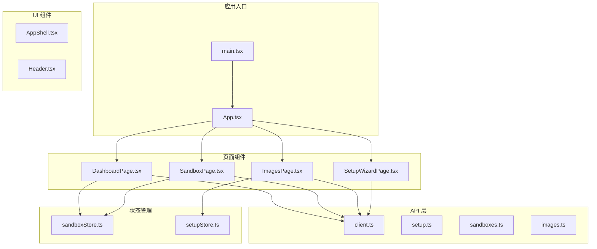

**图表来源**
- [main.tsx:1-12](file://apps/frontend/src/main.tsx#L1-L12)
- [App.tsx:1-114](file://apps/frontend/src/App.tsx#L1-L114)

**章节来源**
- [main.tsx:1-12](file://apps/frontend/src/main.tsx#L1-L12)
- [App.tsx:1-114](file://apps/frontend/src/App.tsx#L1-L114)

## 核心组件

### 应用入口初始化

应用的启动流程从根入口文件开始，采用最小化的初始化策略：

1. **严格模式包装**: 使用 React.StrictMode 确保组件符合最佳实践
2. **样式导入**: 加载全局样式和终端主题覆盖
3. **根节点渲染**: 将 App 组件挂载到 DOM 中

### 路由系统设计

应用使用 createBrowserRouter 创建集中式路由配置，包含以下路由表：

| 路径模式 | 组件 | 描述 | 参数 |
|---------|------|------|------|
| `/` | 重定向 | 根路径重定向到仪表板 | 无 |
| `/dashboard` | DashboardPage | 主仪表板页面 | 无 |
| `/sandbox/:id` | SandboxPage | 沙盒详情页面 | `id`: 沙盒标识符 |
| `/images` | ImagesPage | 镜像管理页面 | 无 |
| `/setup` | SetupWizardPage | 设置向导页面 | 无 |

### 健康检查机制

应用实现了完整的启动时健康检查流程，确保后端服务可用性：

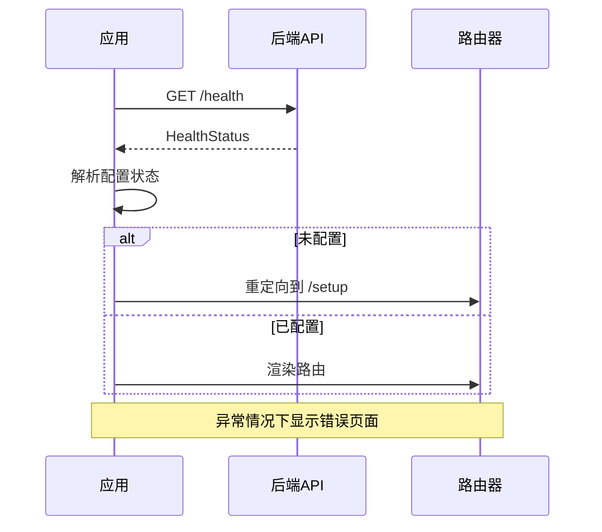

**图表来源**
- [App.tsx:37-68](file://apps/frontend/src/App.tsx#L37-L68)
- [setup.ts:9-11](file://apps/frontend/src/api/setup.ts#L9-L11)

**章节来源**
- [App.tsx:9-30](file://apps/frontend/src/App.tsx#L9-L30)
- [App.tsx:34-68](file://apps/frontend/src/App.tsx#L34-L68)

## 架构概览

应用采用分层架构设计，清晰分离关注点：

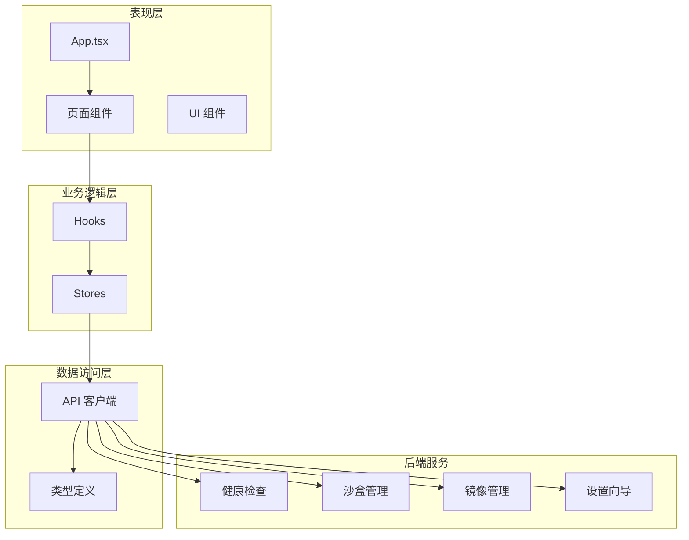

**图表来源**
- [App.tsx:1-114](file://apps/frontend/src/App.tsx#L1-L114)
- [client.ts:16-44](file://apps/frontend/src/api/client.ts#L16-L44)

## 详细组件分析

### 应用主组件 (App.tsx)

App.tsx 是整个应用的核心组件，负责应用初始化和路由控制：

#### 状态管理

应用维护三种核心状态：
- `checking`: 启动检查中
- `ready`: 应用准备就绪
- `backend-unreachable`: 后端服务不可达

#### 健康检查流程

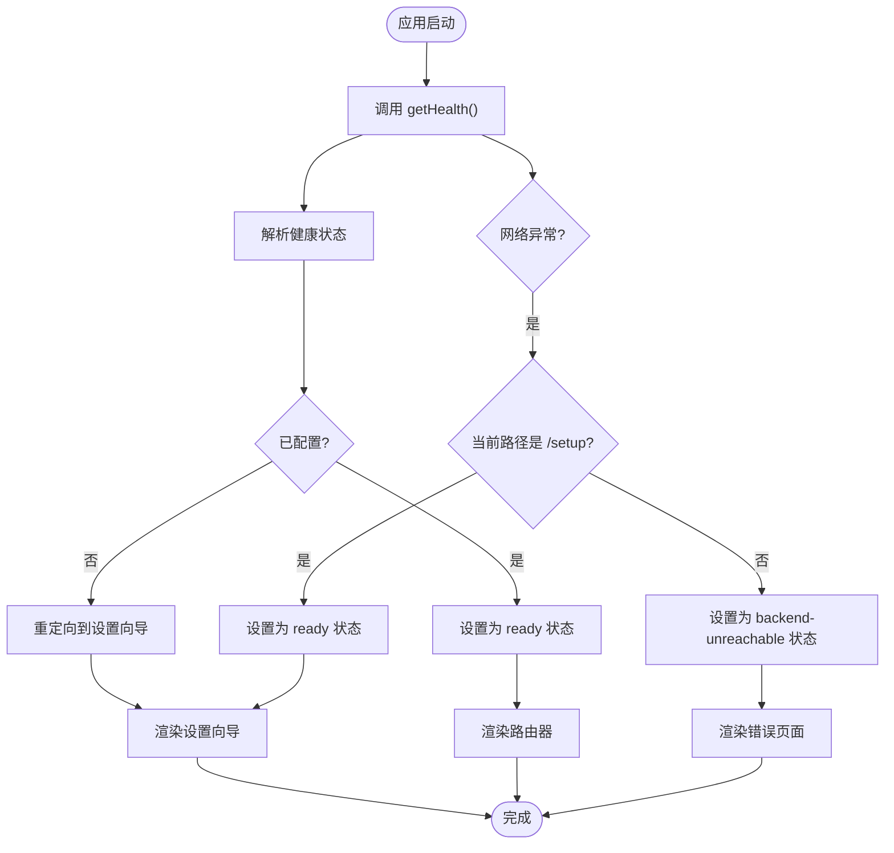

**图表来源**
- [App.tsx:37-68](file://apps/frontend/src/App.tsx#L37-L68)

#### 条件渲染逻辑

应用根据不同的状态渲染相应的界面：

1. **检查状态**: 显示加载动画，提示用户等待
2. **后端不可达**: 显示错误信息和重试按钮
3. **正常状态**: 渲染实际的路由内容

**章节来源**
- [App.tsx:32-114](file://apps/frontend/src/App.tsx#L32-L114)

### 页面组件详解

#### 仪表板页面 (DashboardPage)

仪表板是应用的主要工作界面，提供沙盒管理和创建功能：

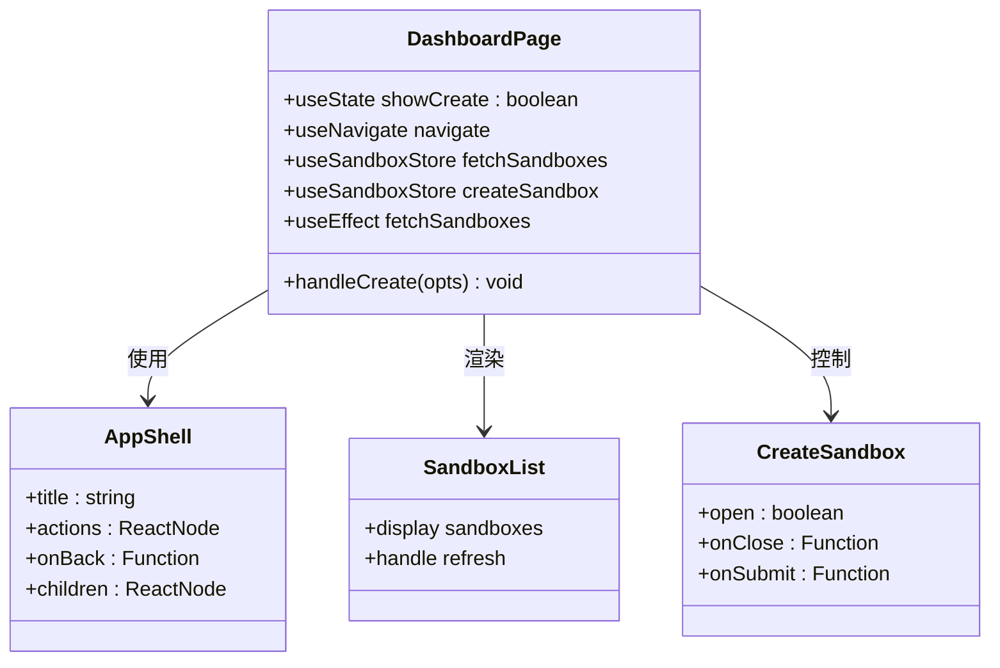

**图表来源**
- [DashboardPage.tsx:10-53](file://apps/frontend/src/pages/DashboardPage.tsx#L10-L53)
- [AppShell.tsx:11-18](file://apps/frontend/src/components/layout/AppShell.tsx#L11-L18)

##### 功能特性

1. **沙盒列表展示**: 实时显示所有可用的沙盒实例
2. **创建沙盒**: 提供表单界面创建新的沙盒
3. **镜像管理**: 快速跳转到镜像管理页面
4. **自动刷新**: 定期更新沙盒状态

**章节来源**
- [DashboardPage.tsx:1-54](file://apps/frontend/src/pages/DashboardPage.tsx#L1-L54)

#### 沙盒详情页面 (SandboxPage)

沙盒详情页面提供完整的沙盒管理界面：

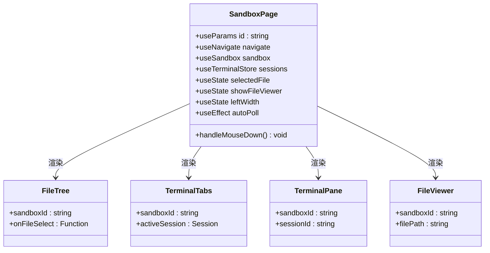

**图表来源**
- [SandboxPage.tsx:13-163](file://apps/frontend/src/pages/SandboxPage.tsx#L13-L163)

##### 核心功能

1. **文件管理系统**: 可视化文件树和文件查看器
2. **终端集成**: 多标签页终端会话管理
3. **拖拽分割**: 可调整的左右面板布局
4. **实时状态**: 自动轮询沙盒状态变化

**章节来源**
- [SandboxPage.tsx:1-164](file://apps/frontend/src/pages/SandboxPage.tsx#L1-L164)

#### 镜像管理页面 (ImagesPage)

镜像管理页面专注于容器镜像的管理：

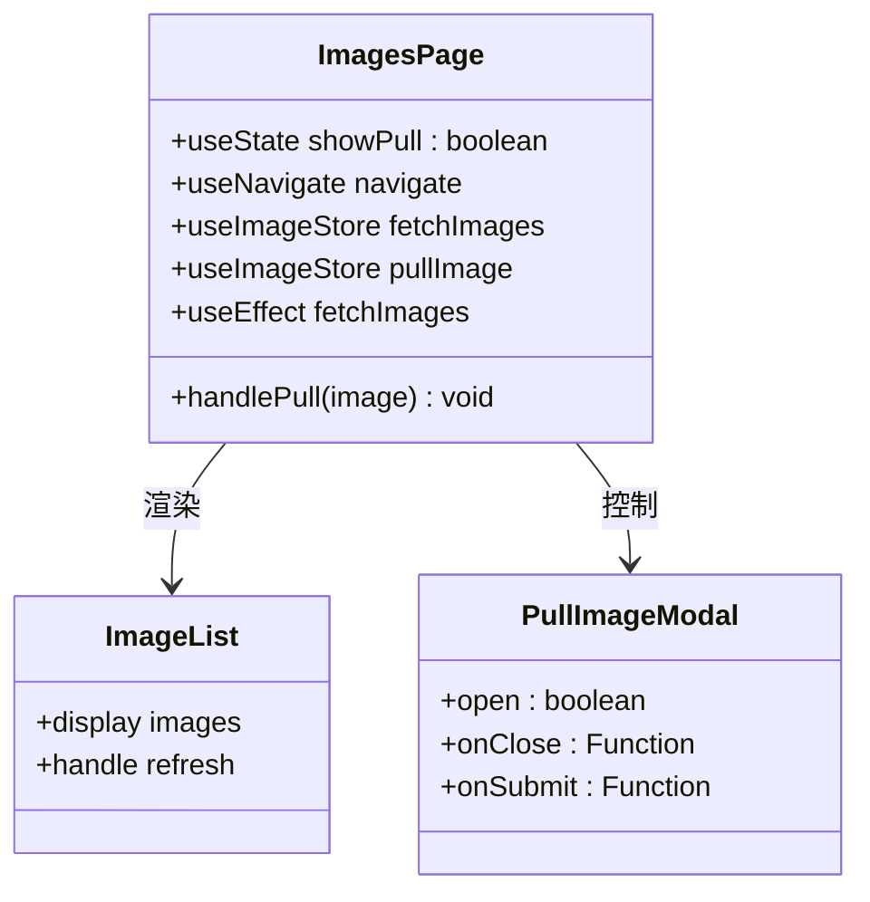

**图表来源**
- [ImagesPage.tsx:9-42](file://apps/frontend/src/pages/ImagesPage.tsx#L9-L42)

##### 功能特性

1. **镜像列表**: 显示所有可用的容器镜像
2. **拉取镜像**: 支持从远程仓库拉取新镜像
3. **缓存管理**: 查看镜像在各节点的缓存状态
4. **进度跟踪**: 实时显示镜像拉取进度

**章节来源**
- [ImagesPage.tsx:1-43](file://apps/frontend/src/pages/ImagesPage.tsx#L1-L43)

#### 设置向导页面 (SetupWizardPage)

设置向导提供完整的环境配置流程：

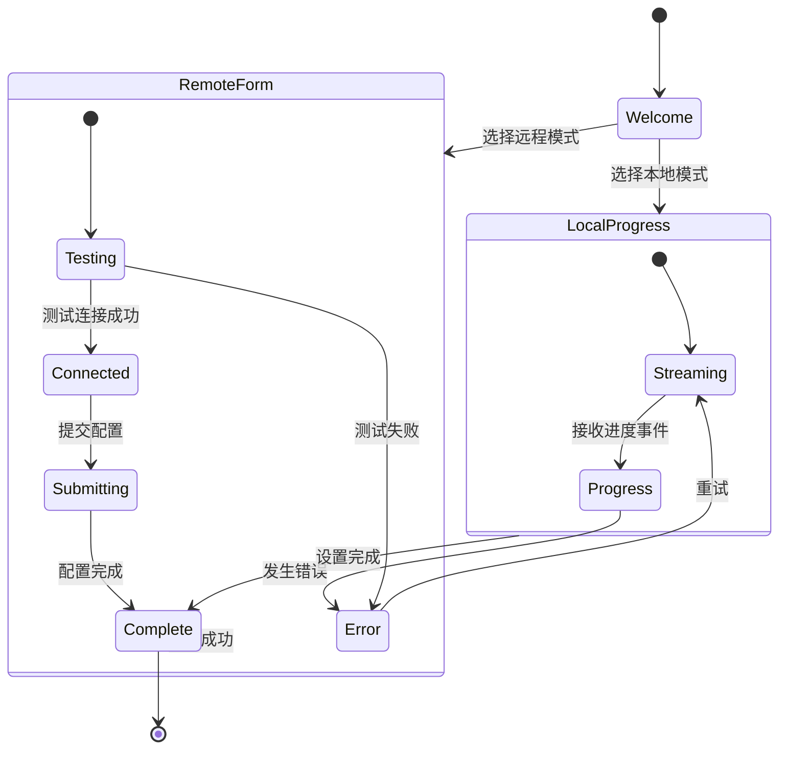

**图表来源**
- [SetupWizardPage.tsx:20-62](file://apps/frontend/src/pages/SetupWizardPage.tsx#L20-L62)
- [setupStore.ts:41-156](file://apps/frontend/src/stores/setupStore.ts#L41-L156)

##### 步骤流程

1. **欢迎页面**: 选择部署模式
2. **本地设置**: 流式安装 Kubernetes
3. **远程连接**: 配置远程服务器连接
4. **完成页面**: 显示设置结果

**章节来源**
- [SetupWizardPage.tsx:1-128](file://apps/frontend/src/pages/SetupWizardPage.tsx#L1-L128)

### API 客户端架构

应用的 API 层采用统一的请求封装：

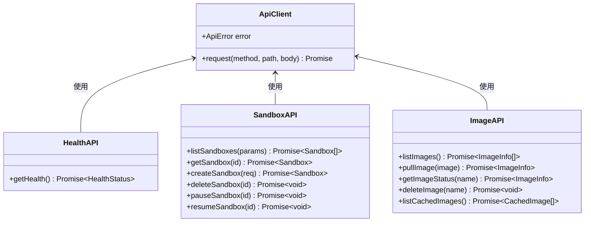

**图表来源**
- [client.ts:16-44](file://apps/frontend/src/api/client.ts#L16-L44)
- [setup.ts:9-27](file://apps/frontend/src/api/setup.ts#L9-L27)
- [sandboxes.ts:4-39](file://apps/frontend/src/api/sandboxes.ts#L4-L39)
- [images.ts:4-22](file://apps/frontend/src/api/images.ts#L4-L22)

**章节来源**
- [client.ts:1-45](file://apps/frontend/src/api/client.ts#L1-L45)
- [setup.ts:1-73](file://apps/frontend/src/api/setup.ts#L1-L73)

### 状态管理架构

应用使用 Zustand 实现轻量级状态管理：

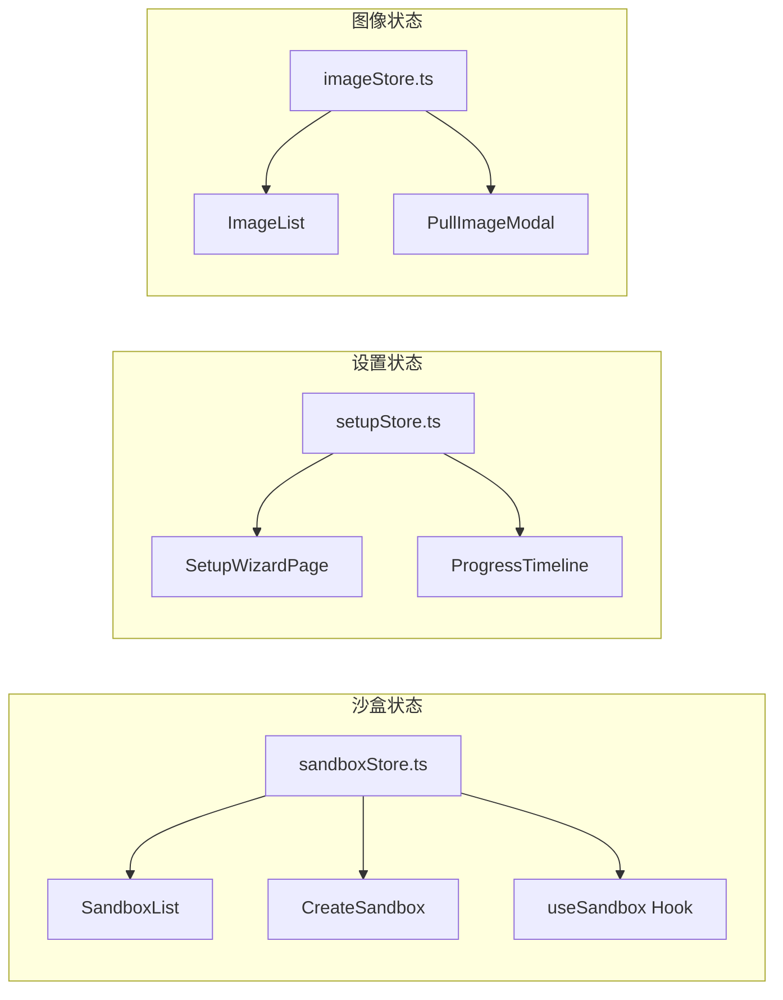

**图表来源**
- [sandboxStore.ts:16-62](file://apps/frontend/src/stores/sandboxStore.ts#L16-L62)
- [setupStore.ts:41-156](file://apps/frontend/src/stores/setupStore.ts#L41-L156)

**章节来源**
- [sandboxStore.ts:1-63](file://apps/frontend/src/stores/sandboxStore.ts#L1-L63)
- [setupStore.ts:1-157](file://apps/frontend/src/stores/setupStore.ts#L1-L157)

## 依赖关系分析

应用的依赖关系清晰且模块化：

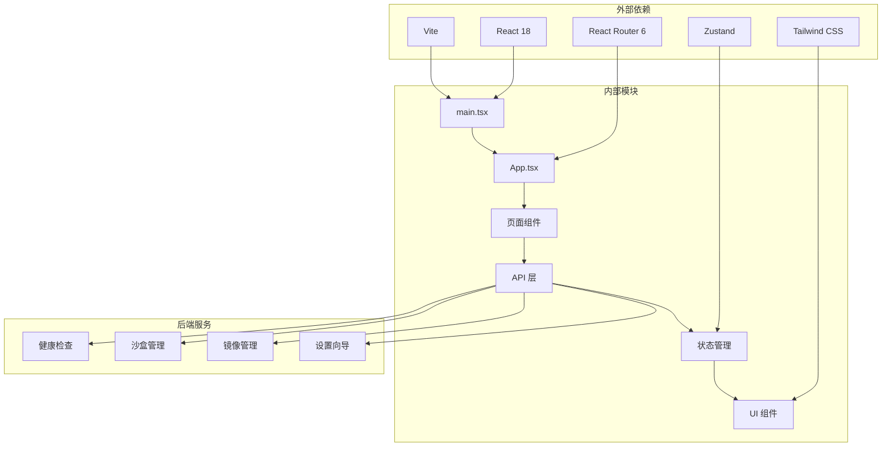

**图表来源**
- [main.tsx:1-12](file://apps/frontend/src/main.tsx#L1-L12)
- [App.tsx:1-114](file://apps/frontend/src/App.tsx#L1-L114)

**章节来源**
- [main.tsx:1-12](file://apps/frontend/src/main.tsx#L1-L12)
- [App.tsx:1-114](file://apps/frontend/src/App.tsx#L1-L114)

## 性能考虑

### 路由性能优化

1. **懒加载策略**: 虽然当前所有页面都直接导入，但可以考虑实现路由级别的代码分割
2. **状态缓存**: 在沙盒状态管理中实现智能缓存策略
3. **渲染优化**: 使用 React.memo 和 useMemo 优化频繁更新的组件

### API 调用优化

1. **请求去重**: 实现请求去重机制避免重复 API 调用
2. **超时处理**: 为 API 请求设置合理的超时时间
3. **错误重试**: 实现指数退避的错误重试机制

### 内存管理

1. **清理机制**: 确保所有定时器和事件监听器在组件卸载时正确清理
2. **状态清理**: 在路由切换时清理不必要的状态
3. **资源释放**: 及时关闭 WebSocket 和 EventSource 连接

## 故障排除指南

### 常见问题诊断

#### 后端服务不可达

**症状**: 应用显示错误页面，提示后端服务不可达

**解决方案**:
1. 确认后端服务正在运行
2. 检查网络连接和防火墙设置
3. 验证 API 端点可达性

#### 路由重定向问题

**症状**: 应用无法正确重定向到设置向导或仪表板

**解决方案**:
1. 检查路由配置是否正确
2. 验证健康检查 API 返回值
3. 确认状态管理逻辑正常工作

#### 组件渲染异常

**症状**: 页面组件无法正确渲染或显示空白

**解决方案**:
1. 检查组件依赖是否正确导入
2. 验证 TypeScript 类型定义
3. 确认样式文件加载正常

**章节来源**
- [App.tsx:84-110](file://apps/frontend/src/App.tsx#L84-L110)

### 开发调试技巧

1. **浏览器开发者工具**: 使用 React DevTools 检查组件树和状态
2. **网络面板**: 监控 API 请求和响应
3. **控制台日志**: 添加适当的日志输出进行调试
4. **状态检查**: 使用 Zustand DevTools 检查状态变化

## 结论

Sandbox Manager 的前端应用展现了现代 React 应用的最佳实践：

### 技术优势

1. **清晰的架构**: 分层设计使代码易于理解和维护
2. **类型安全**: 完整的 TypeScript 支持提供了编译时错误检测
3. **现代化工具链**: Vite 提供了快速的开发体验
4. **组件化设计**: 可复用的组件提高了开发效率

### 设计亮点

1. **用户体验**: 流畅的路由切换和状态管理
2. **响应式设计**: 适配不同屏幕尺寸的界面
3. **错误处理**: 完善的错误边界和降级策略
4. **可扩展性**: 模块化的架构便于功能扩展

### 改进建议

1. **性能优化**: 实现路由级别的代码分割
2. **测试覆盖**: 增加单元测试和集成测试
3. **文档完善**: 补充详细的 API 文档和使用指南
4. **监控集成**: 添加应用性能监控和错误追踪

该应用为 Kubernetes 环境下的 AI 沙盒管理提供了一个功能完整、用户体验优秀的前端解决方案，展现了现代前端开发的技术水平和最佳实践。