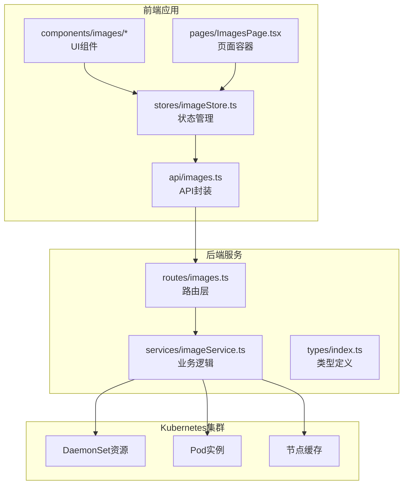
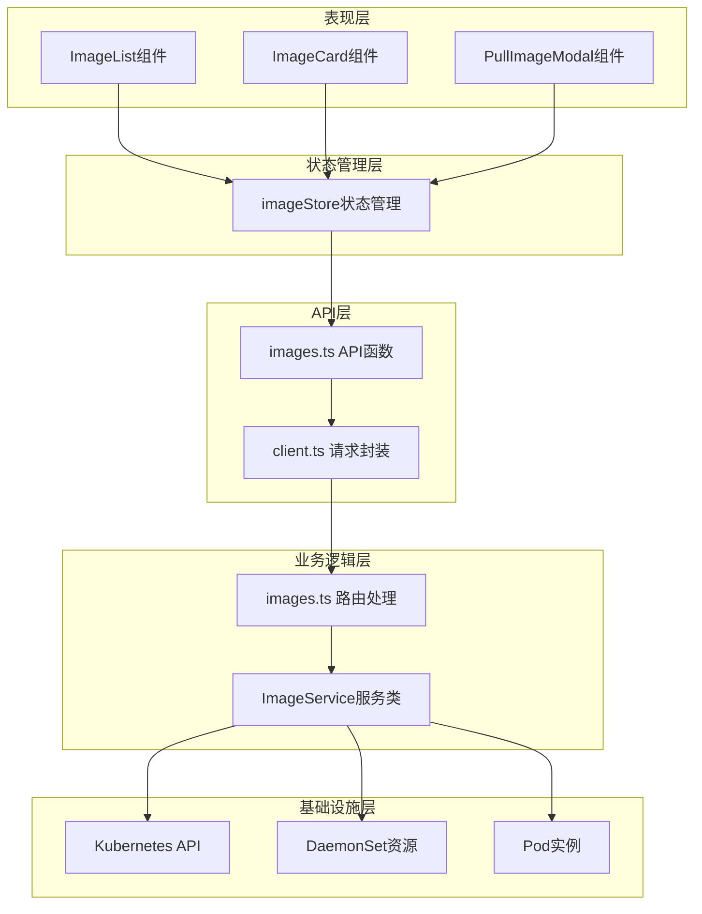
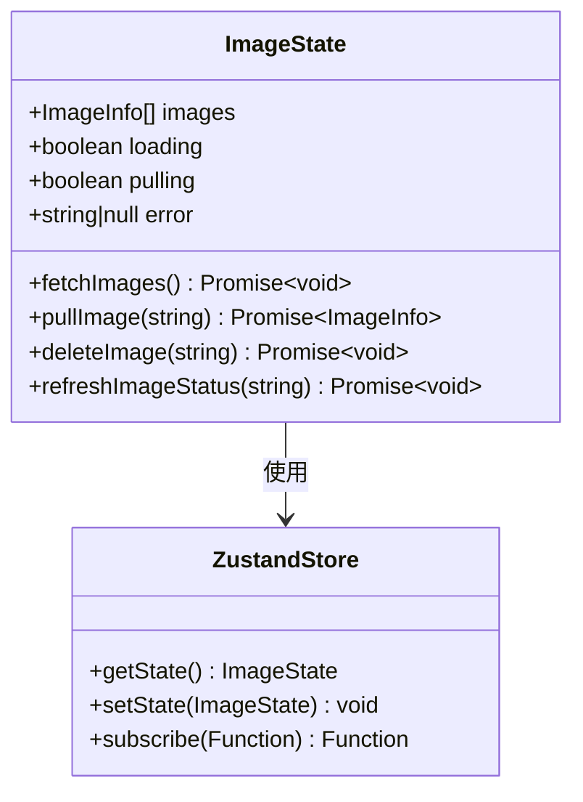
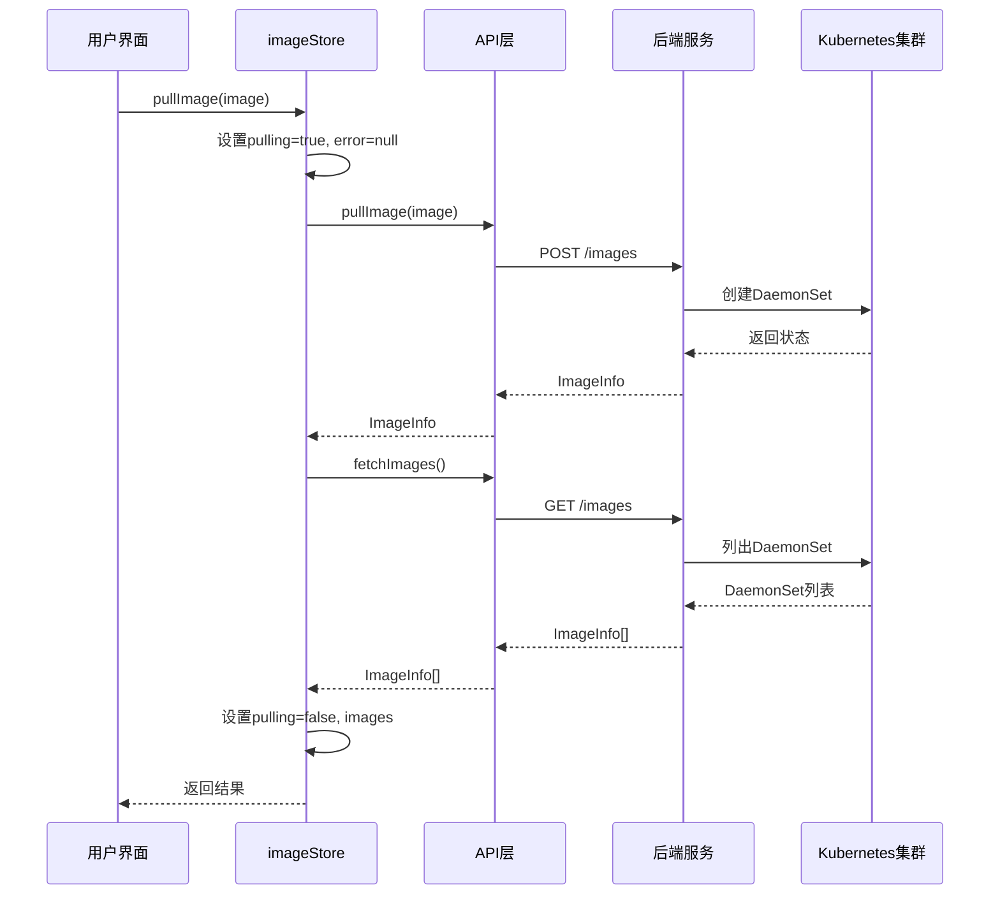
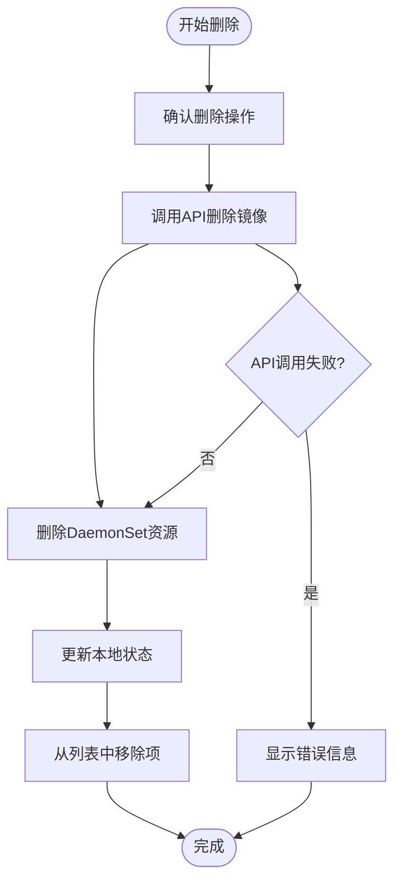
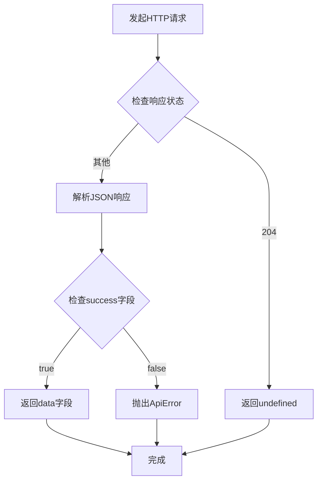
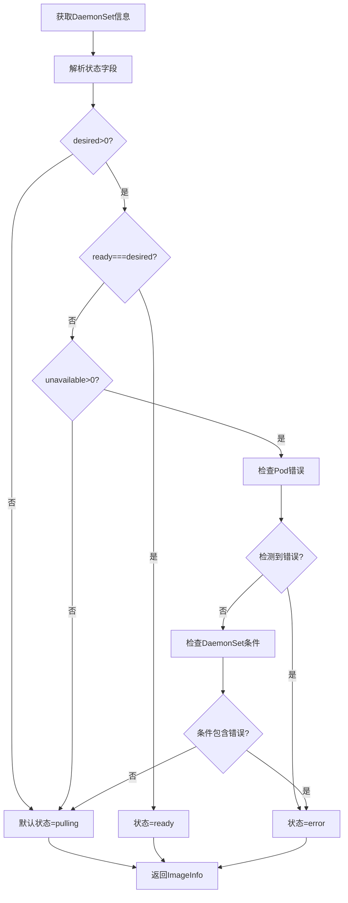
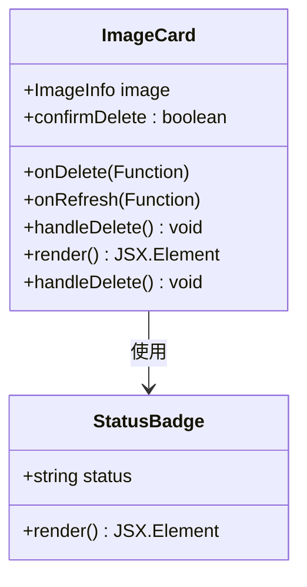
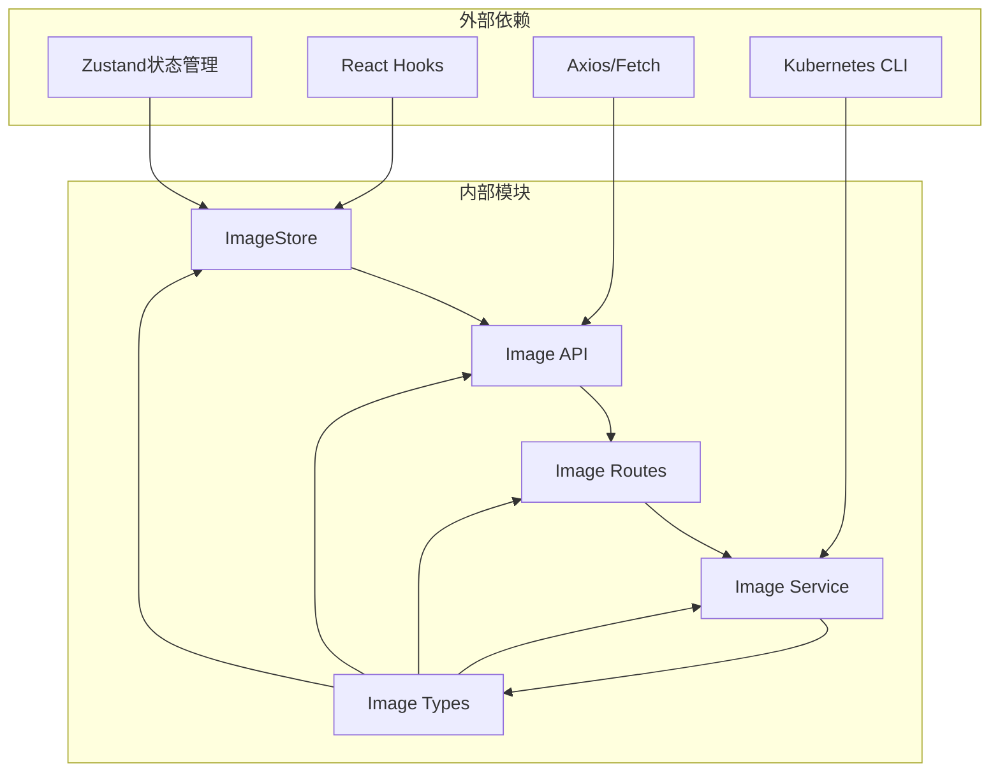
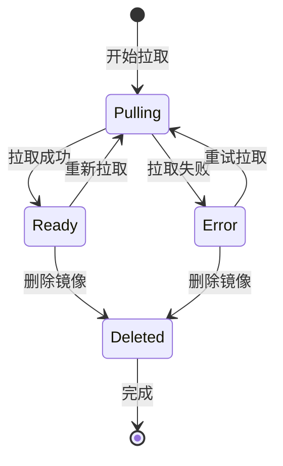

# 图像状态管理

<cite>
**本文档引用的文件**
- [imageStore.ts](file://apps/frontend/src/stores/imageStore.ts)
- [images.ts](file://apps/frontend/src/api/images.ts)
- [client.ts](file://apps/frontend/src/api/client.ts)
- [images.ts](file://apps/backend/src/routes/images.ts)
- [imageService.ts](file://apps/backend/src/services/imageService.ts)
- [types.ts](file://apps/frontend/src/api/types.ts)
- [types.ts](file://apps/backend/src/types/index.ts)
- [ImageList.tsx](file://apps/frontend/src/components/images/ImageList.tsx)
- [ImageCard.tsx](file://apps/frontend/src/components/images/ImageCard.tsx)
- [PullImageModal.tsx](file://apps/frontend/src/components/images/PullImageModal.tsx)
- [ImagesPage.tsx](file://apps/frontend/src/pages/ImagesPage.tsx)
- [StatusBadge.tsx](file://apps/frontend/src/components/common/StatusBadge.tsx)
- [utils.ts](file://apps/frontend/src/lib/utils.ts)
</cite>

## 目录
1. [简介](#简介)
2. [项目结构](#项目结构)
3. [核心组件](#核心组件)
4. [架构概览](#架构概览)
5. [详细组件分析](#详细组件分析)
6. [依赖关系分析](#依赖关系分析)
7. [性能考虑](#性能考虑)
8. [故障排除指南](#故障排除指南)
9. [结论](#结论)
10. [附录](#附录)

## 简介

图像状态管理模块是Sandbox Manager系统中的关键组件，负责管理Docker/Kubernetes镜像的生命周期。该模块实现了完整的镜像状态管理功能，包括镜像列表状态管理、拉取状态跟踪和缓存策略。通过前端状态管理和后端服务层的协同工作，用户可以直观地查看和管理集群中预拉取的镜像。

本模块采用现代化的前端状态管理模式，使用Zustand作为状态管理库，结合TypeScript接口定义确保类型安全。后端服务层基于Express框架，通过Kubernetes DaemonSet实现镜像的分布式预拉取。

## 项目结构

图像状态管理模块在项目中的组织结构如下：



**图表来源**
- [imageStore.ts:1-60](file://apps/frontend/src/stores/imageStore.ts#L1-L60)
- [images.ts:1-23](file://apps/frontend/src/api/images.ts#L1-L23)
- [images.ts:1-78](file://apps/backend/src/routes/images.ts#L1-L78)
- [imageService.ts:1-386](file://apps/backend/src/services/imageService.ts#L1-L386)

**章节来源**
- [imageStore.ts:1-60](file://apps/frontend/src/stores/imageStore.ts#L1-L60)
- [images.ts:1-23](file://apps/frontend/src/api/images.ts#L1-L23)
- [images.ts:1-78](file://apps/backend/src/routes/images.ts#L1-L78)

## 核心组件

### 前端状态管理器

图像状态管理的核心是Zustand状态存储，提供了以下关键功能：

- **镜像列表管理**: 维护当前所有预拉取镜像的完整列表
- **加载状态控制**: 管理数据加载过程中的UI反馈
- **操作状态跟踪**: 跟踪镜像拉取、删除等操作的执行状态
- **错误处理**: 统一处理API调用和业务逻辑中的异常情况

### API层设计

前端API层提供了标准化的HTTP请求封装，支持：
- GET/POST/DELETE等标准HTTP方法
- 自动化的JSON序列化和反序列化
- 错误响应的统一处理和转换
- 请求头的自动设置（如Content-Type）

### 后端服务层

后端服务层实现了复杂的业务逻辑：
- **镜像拉取**: 通过Kubernetes DaemonSet实现分布式镜像预拉取
- **状态解析**: 将Kubernetes资源状态转换为统一的镜像状态模型
- **缓存查询**: 查询集群节点上的镜像缓存信息
- **资源管理**: 创建、删除和监控DaemonSet资源

**章节来源**
- [imageStore.ts:5-15](file://apps/frontend/src/stores/imageStore.ts#L5-L15)
- [images.ts:4-22](file://apps/frontend/src/api/images.ts#L4-L22)
- [imageService.ts:95-385](file://apps/backend/src/services/imageService.ts#L95-L385)

## 架构概览

图像状态管理采用分层架构设计，确保了清晰的关注点分离：



**图表来源**
- [ImageList.tsx:1-51](file://apps/frontend/src/components/images/ImageList.tsx#L1-L51)
- [imageStore.ts:17-59](file://apps/frontend/src/stores/imageStore.ts#L17-L59)
- [images.ts:1-23](file://apps/frontend/src/api/images.ts#L1-L23)
- [images.ts:1-78](file://apps/backend/src/routes/images.ts#L1-L78)
- [imageService.ts:95-385](file://apps/backend/src/services/imageService.ts#L95-L385)

## 详细组件分析

### 状态管理器设计

imageStore是整个图像状态管理的核心，采用了函数式状态管理模式：

#### 状态结构定义



**图表来源**
- [imageStore.ts:5-15](file://apps/frontend/src/stores/imageStore.ts#L5-L15)

#### 操作流程分析

##### 镜像拉取流程



**图表来源**
- [imageStore.ts:33-44](file://apps/frontend/src/stores/imageStore.ts#L33-L44)
- [images.ts:8-10](file://apps/frontend/src/api/images.ts#L8-L10)
- [images.ts:37-53](file://apps/backend/src/routes/images.ts#L37-L53)

##### 删除镜像流程



**图表来源**
- [imageStore.ts:46-49](file://apps/frontend/src/stores/imageStore.ts#L46-L49)
- [images.ts:16-18](file://apps/frontend/src/api/images.ts#L16-L18)

**章节来源**
- [imageStore.ts:17-59](file://apps/frontend/src/stores/imageStore.ts#L17-L59)

### API层实现

#### 请求封装机制

API层提供了统一的请求封装，确保了错误处理的一致性：



**图表来源**
- [client.ts:16-44](file://apps/frontend/src/api/client.ts#L16-L44)

#### 类型安全保证

前后端使用统一的类型定义，确保了数据传输的完整性：

**章节来源**
- [client.ts:1-45](file://apps/frontend/src/api/client.ts#L1-L45)
- [types.ts:100-115](file://apps/frontend/src/api/types.ts#L100-L115)
- [types.ts:69-88](file://apps/backend/src/types/index.ts#L69-L88)

### 后端服务层

#### 镜像状态解析

后端服务层实现了复杂的镜像状态解析逻辑：



**图表来源**
- [imageService.ts:38-93](file://apps/backend/src/services/imageService.ts#L38-L93)

#### 缓存查询机制

后端服务层还提供了集群节点镜像缓存的查询功能：

**章节来源**
- [imageService.ts:196-222](file://apps/backend/src/services/imageService.ts#L196-L222)
- [imageService.ts:344-384](file://apps/backend/src/services/imageService.ts#L344-L384)

### UI组件集成

#### 图像卡片组件

ImageCard组件提供了丰富的状态展示功能：



**图表来源**
- [ImageCard.tsx:7-11](file://apps/frontend/src/components/images/ImageCard.tsx#L7-L11)
- [StatusBadge.tsx:3-5](file://apps/frontend/src/components/common/StatusBadge.tsx#L3-L5)

#### 页面容器

ImagesPage作为页面容器，协调了状态管理器和UI组件：

**章节来源**
- [ImageList.tsx:1-51](file://apps/frontend/src/components/images/ImageList.tsx#L1-L51)
- [ImagesPage.tsx:1-44](file://apps/frontend/src/pages/ImagesPage.tsx#L1-L44)

## 依赖关系分析

图像状态管理模块的依赖关系呈现清晰的层次化结构：



**图表来源**
- [imageStore.ts:1-3](file://apps/frontend/src/stores/imageStore.ts#L1-L3)
- [images.ts:1-2](file://apps/frontend/src/api/images.ts#L1-L2)
- [images.ts:1-6](file://apps/backend/src/routes/images.ts#L1-L6)
- [imageService.ts:1-3](file://apps/backend/src/services/imageService.ts#L1-L3)

### 关键依赖特性

1. **状态管理**: 使用Zustand替代Redux，减少样板代码
2. **类型安全**: TypeScript确保编译时类型检查
3. **异步处理**: Promise和async/await模式统一
4. **错误边界**: 全局错误处理和用户友好的错误提示

**章节来源**
- [imageStore.ts:1-60](file://apps/frontend/src/stores/imageStore.ts#L1-L60)
- [images.ts:1-23](file://apps/frontend/src/api/images.ts#L1-L23)

## 性能考虑

### 状态更新优化

1. **批量状态更新**: 使用Zustand的原子性状态更新避免不必要的重渲染
2. **选择性订阅**: 只订阅需要的状态片段，减少组件重渲染
3. **缓存策略**: 后端服务层对Pod错误信息进行缓存，避免重复查询

### 网络请求优化

1. **请求去重**: 避免同时发起多个相同的请求
2. **超时控制**: 合理设置请求超时时间，防止长时间阻塞
3. **错误重试**: 对临时性错误实施智能重试机制

### UI性能优化

1. **虚拟滚动**: 大量镜像时考虑使用虚拟滚动技术
2. **懒加载**: 图片和组件的懒加载策略
3. **防抖节流**: 输入验证和搜索功能的防抖处理

## 故障排除指南

### 常见问题及解决方案

#### 镜像拉取失败

**症状**: 镜像状态长时间保持"pulling"状态或变为"error"

**诊断步骤**:
1. 检查网络连接和镜像仓库访问权限
2. 查看Kubernetes集群的事件日志
3. 验证镜像名称格式是否正确

**解决方法**:
1. 确认镜像名称符合规范
2. 检查镜像仓库的可用性和认证配置
3. 查看详细的错误消息以确定具体原因

#### 状态不同步

**症状**: 前端显示的状态与实际集群状态不一致

**诊断步骤**:
1. 检查API响应是否正常
2. 验证状态更新逻辑
3. 查看WebSocket连接状态

**解决方法**:
1. 实施定期状态刷新机制
2. 添加手动刷新按钮
3. 实现状态回退机制

#### 内存泄漏

**症状**: 应用内存使用持续增长

**诊断步骤**:
1. 检查Zustand状态存储的清理
2. 验证事件监听器的正确移除
3. 查看组件卸载时的清理逻辑

**解决方法**:
1. 确保状态订阅的正确清理
2. 实施组件卸载时的状态清理
3. 使用React DevTools检查组件树

**章节来源**
- [imageService.ts:54-92](file://apps/backend/src/services/imageService.ts#L54-L92)
- [client.ts:38-41](file://apps/frontend/src/api/client.ts#L38-L41)

## 结论

图像状态管理模块展现了现代Web应用开发的最佳实践：

1. **架构清晰**: 分层设计确保了职责分离和可维护性
2. **类型安全**: 完整的TypeScript类型定义提供了编译时安全保障
3. **用户体验**: 丰富的状态反馈和错误处理提升了用户满意度
4. **扩展性强**: 模块化设计便于功能扩展和维护

该模块成功地将复杂的Kubernetes镜像管理抽象为简洁易用的用户界面，为开发者提供了强大的工具来管理容器镜像的生命周期。

## 附录

### API调用示例

#### 获取镜像列表
```javascript
// 前端调用
const images = await imageApi.listImages();

// 后端响应
{
  "success": true,
  "data": [
    {
      "name": "code-sandbox:latest",
      "image": "rabbitai-lab/code-sandbox:latest",
      "status": "ready",
      "daemonSetName": "pull-rabbitai-lab-code-sandbox-latest",
      "createdAt": "2024-01-01T00:00:00Z",
      "nodesReady": 3,
      "nodesTotal": 3
    }
  ]
}
```

#### 拉取新镜像
```javascript
// 前端调用
await imageApi.pullImage("nginx:latest");

// 后端响应
{
  "success": true,
  "data": {
    "name": "nginx:latest",
    "image": "nginx:latest",
    "status": "pulling",
    "daemonSetName": "pull-nginx-latest",
    "createdAt": "2024-01-01T00:00:00Z",
    "nodesReady": 0,
    "nodesTotal": 0
  }
}
```

#### 删除镜像
```javascript
// 前端调用
await imageApi.deleteImage("pull-nginx-latest");

// 后端响应
// HTTP 204 No Content
```

### 状态流转图



### 最佳实践建议

1. **状态持久化**: 考虑将重要状态持久化到localStorage或IndexedDB
2. **缓存优化**: 实施多级缓存策略，包括内存缓存和持久化缓存
3. **错误恢复**: 提供自动重试和手动重试机制
4. **性能监控**: 实施性能指标收集和告警机制
5. **用户体验**: 提供详细的进度指示和状态反馈