# 沙盒状态管理

<cite>
**本文档引用的文件**
- [sandboxStore.ts](file://apps/frontend/src/stores/sandboxStore.ts)
- [useSandbox.ts](file://apps/frontend/src/hooks/useSandbox.ts)
- [sandboxes.ts](file://apps/frontend/src/api/sandboxes.ts)
- [types.ts](file://apps/frontend/src/api/types.ts)
- [sandboxService.ts](file://apps/backend/src/services/sandboxService.ts)
- [sandboxes.ts](file://apps/backend/src/routes/sandboxes.ts)
- [SandboxCard.tsx](file://apps/frontend/src/components/sandbox/SandboxCard.tsx)
- [SandboxList.tsx](file://apps/frontend/src/components/sandbox/SandboxList.tsx)
- [SandboxPage.tsx](file://apps/frontend/src/pages/SandboxPage.tsx)
- [CreateSandbox.tsx](file://apps/frontend/src/components/sandbox/CreateSandbox.tsx)
- [utils.ts](file://apps/frontend/src/lib/utils.ts)
</cite>

## 目录
1. [简介](#简介)
2. [项目结构](#项目结构)
3. [核心组件](#核心组件)
4. [架构概览](#架构概览)
5. [详细组件分析](#详细组件分析)
6. [依赖关系分析](#依赖关系分析)
7. [性能考虑](#性能考虑)
8. [故障排除指南](#故障排除指南)
9. [结论](#结论)

## 简介

沙盒状态管理模块是沙盒管理系统的核心组件，负责管理沙盒实例的生命周期、状态同步和用户界面交互。该模块采用前端状态管理与后端服务分离的设计模式，通过Zustand状态库实现高效的本地状态管理，并通过API层与后端OpenSandbox服务进行通信。

本模块主要功能包括：
- 沙盒状态的实时同步和更新
- 沙盒生命周期管理（创建、暂停、恢复、删除）
- 异步操作的状态管理和错误处理
- 用户界面的状态订阅和响应式更新
- 沙盒状态的自动轮询和刷新机制

## 项目结构

沙盒状态管理模块在项目中的组织结构如下：

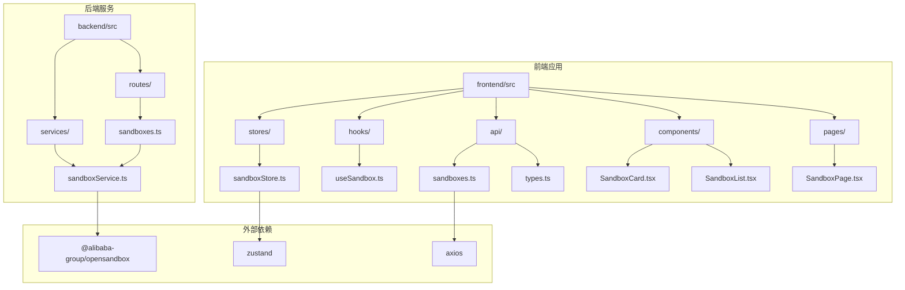

**图表来源**
- [sandboxStore.ts:1-63](file://apps/frontend/src/stores/sandboxStore.ts#L1-L63)
- [useSandbox.ts:1-59](file://apps/frontend/src/hooks/useSandbox.ts#L1-L59)
- [sandboxes.ts:1-40](file://apps/frontend/src/api/sandboxes.ts#L1-L40)
- [sandboxService.ts:1-148](file://apps/backend/src/services/sandboxService.ts#L1-L148)
- [sandboxes.ts:1-175](file://apps/backend/src/routes/sandboxes.ts#L1-L175)

**章节来源**
- [sandboxStore.ts:1-63](file://apps/frontend/src/stores/sandboxStore.ts#L1-L63)
- [useSandbox.ts:1-59](file://apps/frontend/src/hooks/useSandbox.ts#L1-L59)
- [sandboxes.ts:1-40](file://apps/frontend/src/api/sandboxes.ts#L1-L40)
- [sandboxService.ts:1-148](file://apps/backend/src/services/sandboxService.ts#L1-L148)
- [sandboxes.ts:1-175](file://apps/backend/src/routes/sandboxes.ts#L1-L175)

## 核心组件

### Zustand 状态存储

沙盒状态存储基于Zustand库实现，提供了轻量级的状态管理解决方案。核心状态结构包括：

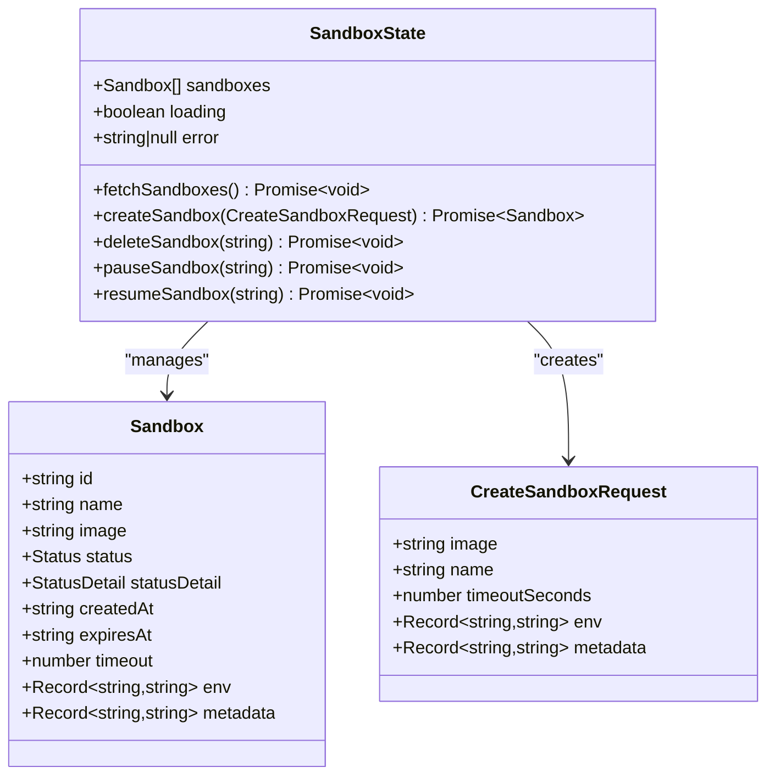

**图表来源**
- [sandboxStore.ts:5-14](file://apps/frontend/src/stores/sandboxStore.ts#L5-L14)
- [types.ts:1-25](file://apps/frontend/src/api/types.ts#L1-L25)

### React Hook 集成

useSandbox Hook 提供了沙盒状态的实时订阅和管理能力：

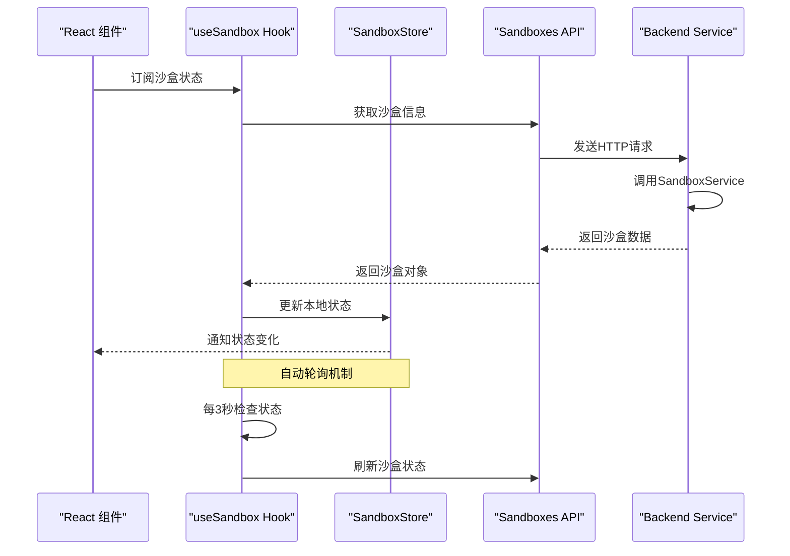

**图表来源**
- [useSandbox.ts:12-55](file://apps/frontend/src/hooks/useSandbox.ts#L12-L55)
- [sandboxStore.ts:16-62](file://apps/frontend/src/stores/sandboxStore.ts#L16-L62)

**章节来源**
- [sandboxStore.ts:16-62](file://apps/frontend/src/stores/sandboxStore.ts#L16-L62)
- [useSandbox.ts:6-58](file://apps/frontend/src/hooks/useSandbox.ts#L6-L58)
- [types.ts:1-25](file://apps/frontend/src/api/types.ts#L1-L25)

## 架构概览

沙盒状态管理采用分层架构设计，确保前后端分离和职责清晰：

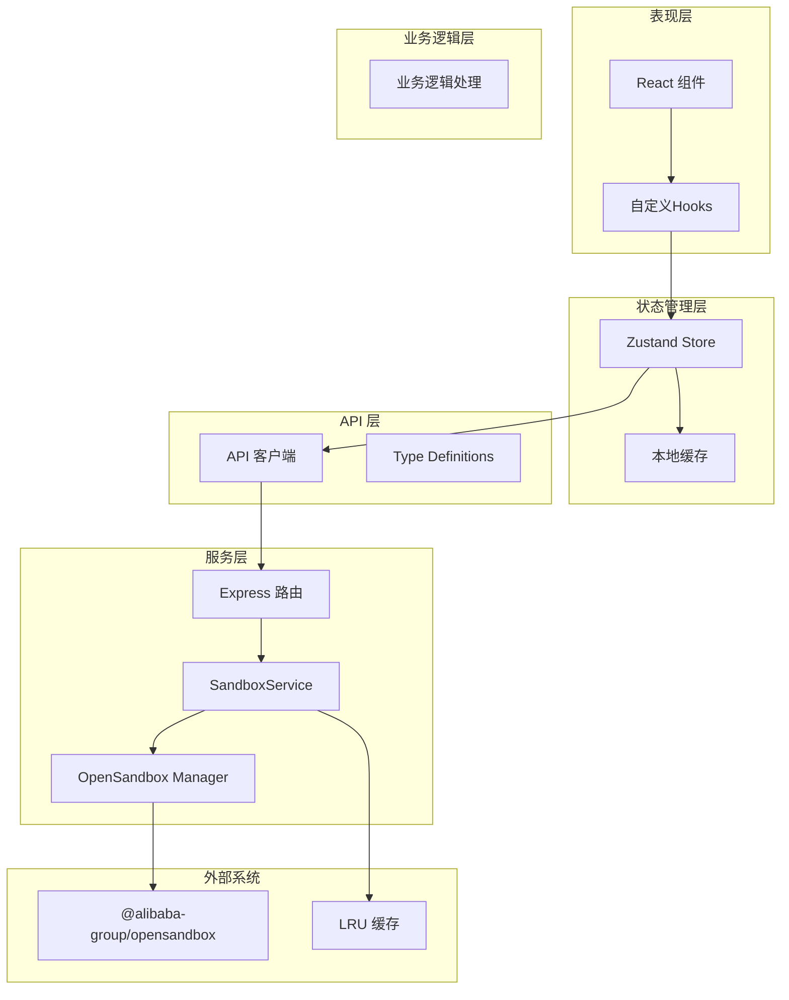

**图表来源**
- [sandboxStore.ts:1-63](file://apps/frontend/src/stores/sandboxStore.ts#L1-L63)
- [useSandbox.ts:1-59](file://apps/frontend/src/hooks/useSandbox.ts#L1-L59)
- [sandboxes.ts:1-40](file://apps/frontend/src/api/sandboxes.ts#L1-L40)
- [sandboxService.ts:1-148](file://apps/backend/src/services/sandboxService.ts#L1-L148)
- [sandboxes.ts:1-175](file://apps/backend/src/routes/sandboxes.ts#L1-L175)

## 详细组件分析

### 沙盒状态数据结构

沙盒状态管理的核心数据结构定义如下：

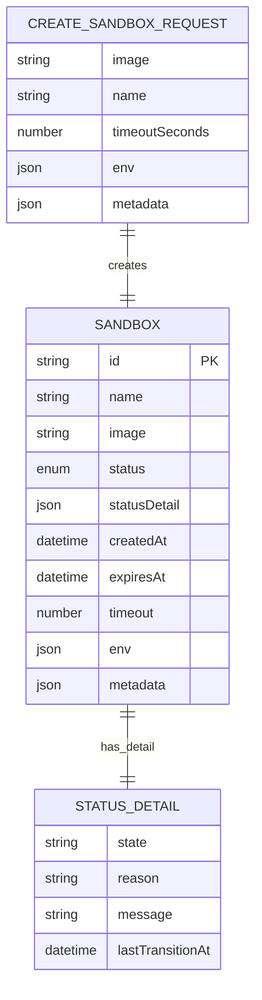

**图表来源**
- [types.ts:1-25](file://apps/frontend/src/api/types.ts#L1-L25)

#### 状态枚举定义

沙盒支持以下状态类型：
- `Creating`: 创建中
- `Running`: 运行中  
- `Paused`: 已暂停
- `Error`: 错误状态
- `Deleting`: 删除中

#### 生命周期状态流转

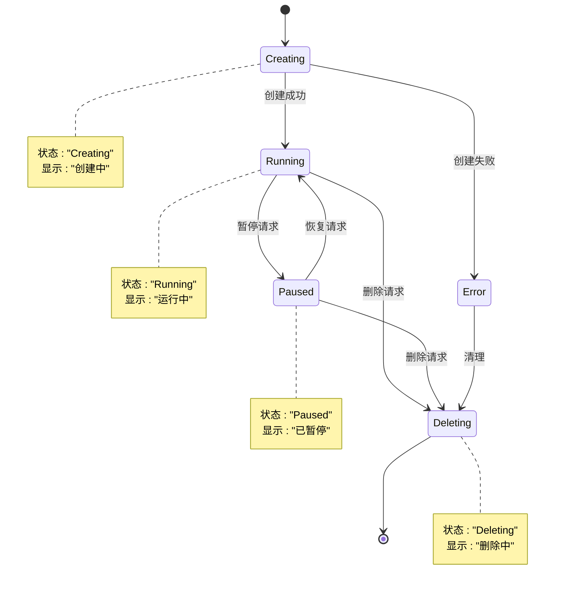

**图表来源**
- [types.ts:5](file://apps/frontend/src/api/types.ts#L5)

**章节来源**
- [types.ts:1-17](file://apps/frontend/src/api/types.ts#L1-L17)

### 状态更新逻辑

#### 同步更新机制

沙盒状态更新采用同步和异步相结合的方式：

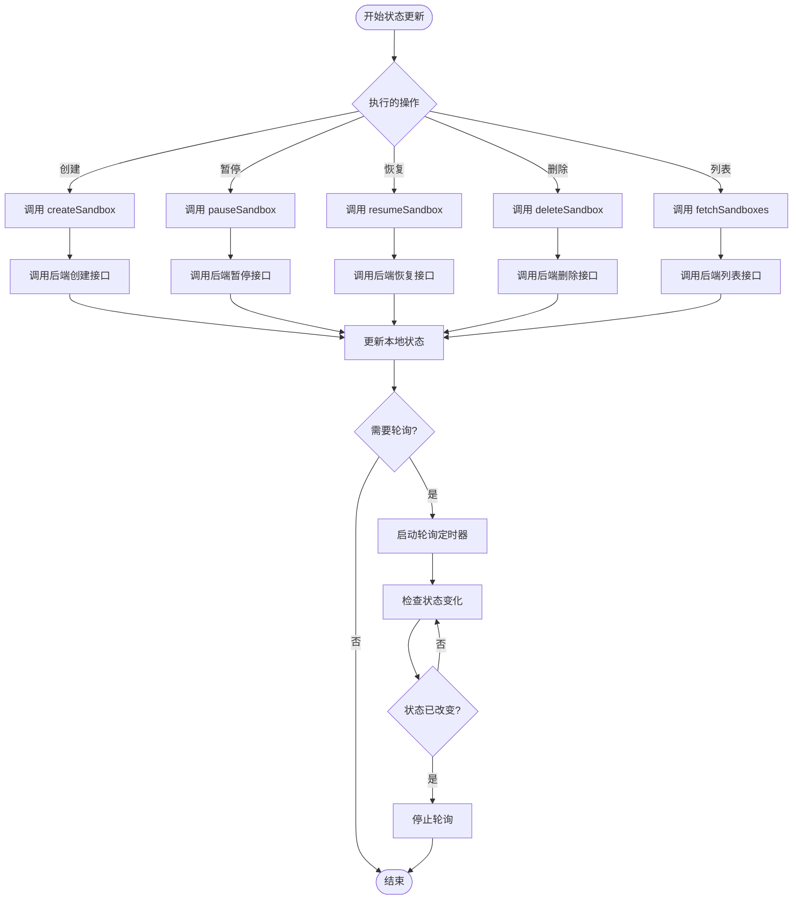

**图表来源**
- [sandboxStore.ts:21-61](file://apps/frontend/src/stores/sandboxStore.ts#L21-L61)
- [useSandbox.ts:42-55](file://apps/frontend/src/hooks/useSandbox.ts#L42-L55)

#### 异步操作处理

异步操作通过Promise链式调用处理，确保操作的原子性和一致性：

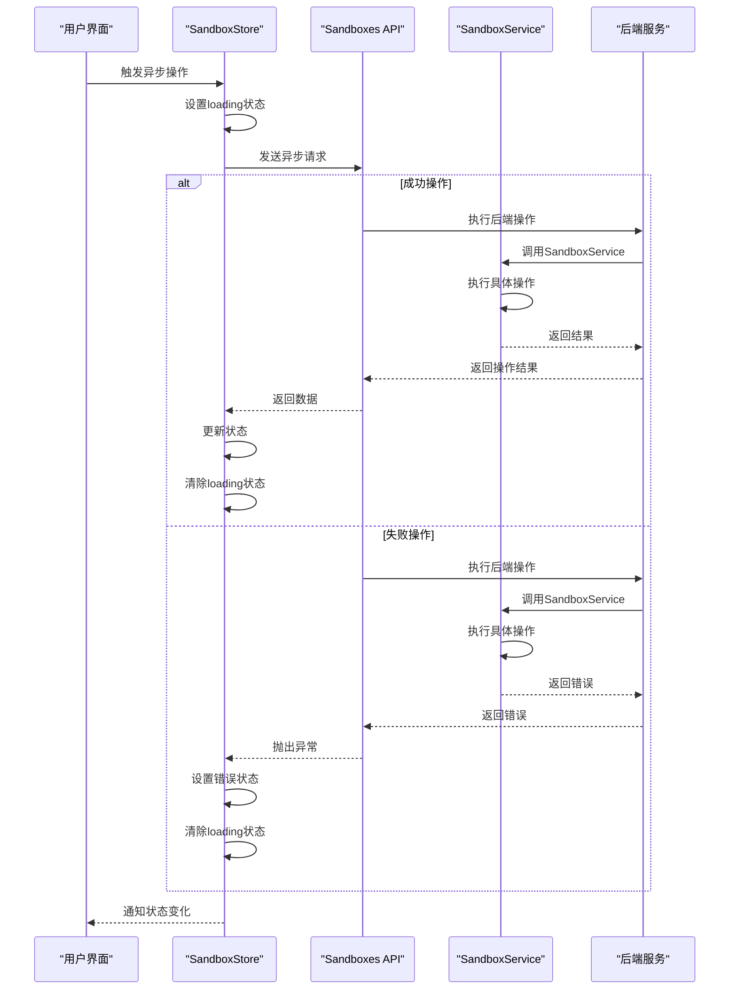

**图表来源**
- [sandboxStore.ts:21-61](file://apps/frontend/src/stores/sandboxStore.ts#L21-L61)
- [sandboxes.ts:1-40](file://apps/frontend/src/api/sandboxes.ts#L1-L40)

**章节来源**
- [sandboxStore.ts:21-61](file://apps/frontend/src/stores/sandboxStore.ts#L21-L61)
- [useSandbox.ts:12-55](file://apps/frontend/src/hooks/useSandbox.ts#L12-L55)

### useSandbox Hook 实现模式

useSandbox Hook 提供了沙盒状态的完整生命周期管理：

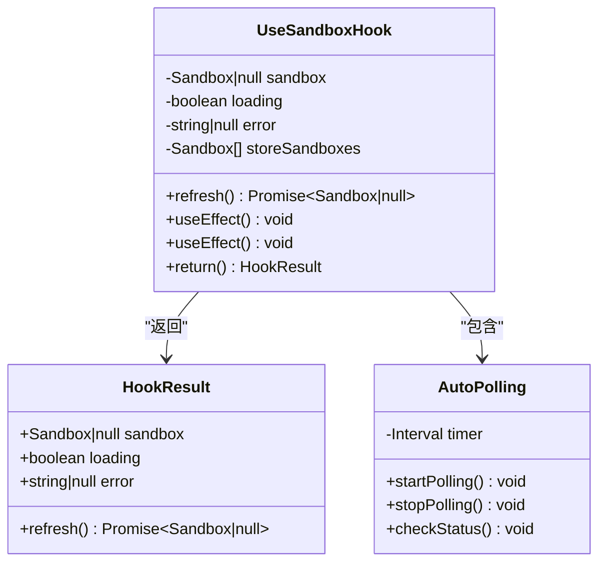

**图表来源**
- [useSandbox.ts:6-58](file://apps/frontend/src/hooks/useSandbox.ts#L6-L58)

#### 使用场景

useSandbox Hook 主要用于以下场景：

1. **单个沙盒详情页面**: 在沙盒详情页中实时显示和管理特定沙盒的状态
2. **沙盒连接管理**: 提供沙盒连接的自动重连和状态监控
3. **终端和文件管理**: 为终端会话和文件浏览提供沙盒状态依赖

#### 状态订阅机制

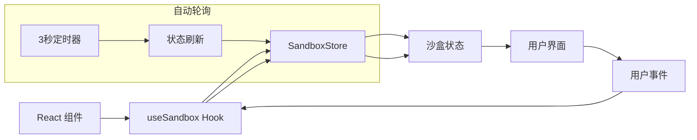

**图表来源**
- [useSandbox.ts:24-55](file://apps/frontend/src/hooks/useSandbox.ts#L24-L55)

**章节来源**
- [useSandbox.ts:6-58](file://apps/frontend/src/hooks/useSandbox.ts#L6-L58)

### 组件集成模式

#### 沙盒卡片组件

SandboxCard 组件展示了沙盒状态的可视化展示：

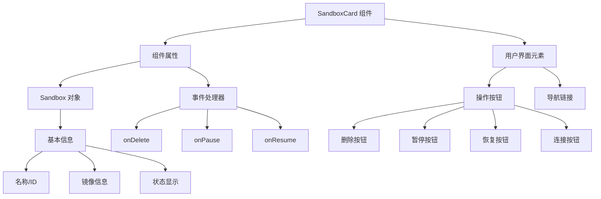

**图表来源**
- [SandboxCard.tsx:14-66](file://apps/frontend/src/components/sandbox/SandboxCard.tsx#L14-L66)

#### 沙盒列表组件

SandboxList 组件管理多个沙盒的展示和操作：

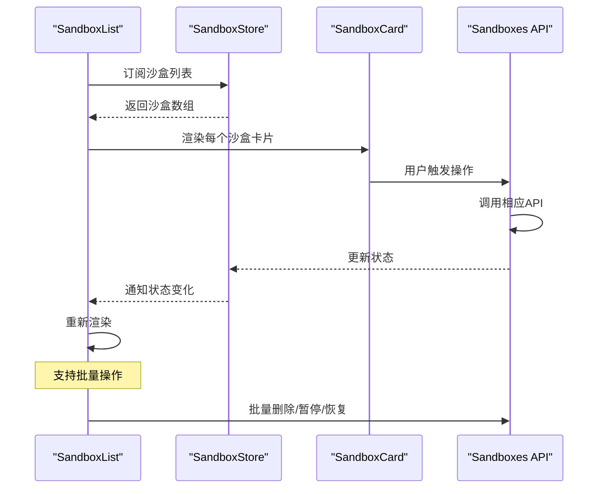

**图表来源**
- [SandboxList.tsx:6-52](file://apps/frontend/src/components/sandbox/SandboxList.tsx#L6-L52)

**章节来源**
- [SandboxCard.tsx:14-66](file://apps/frontend/src/components/sandbox/SandboxCard.tsx#L14-L66)
- [SandboxList.tsx:6-52](file://apps/frontend/src/components/sandbox/SandboxList.tsx#L6-L52)

## 依赖关系分析

### 前端依赖关系

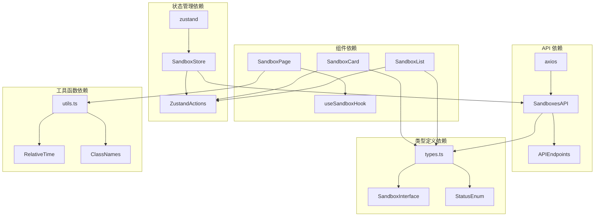

**图表来源**
- [sandboxStore.ts:1](file://apps/frontend/src/stores/sandboxStore.ts#L1)
- [sandboxes.ts:1](file://apps/frontend/src/api/sandboxes.ts#L1)
- [types.ts:1](file://apps/frontend/src/api/types.ts#L1)
- [utils.ts:1](file://apps/frontend/src/lib/utils.ts#L1)

### 后端依赖关系

```mermaid
graph TB
subgraph "服务层依赖"
SandboxService --> OpenSandboxSDK[@alibaba-group/opensandbox]
SandboxService --> LRUCache[lru-cache]
end
subgraph "路由层依赖"
SandboxesRouter --> Express[express]
SandboxesRouter --> SandboxService
end
subgraph "类型定义依赖"
RoutesTypes --> ApiResponse
RoutesTypes --> CreateSandboxBody
RoutesTypes --> SandboxEndpointResponse
end
subgraph "中间件依赖"
GuardMiddleware --> ConfigGuard
GuardMiddleware --> LoggerMiddleware
end
SandboxesRouter --> SandboxService
SandboxService --> OpenSandboxSDK
SandboxService --> LRUCache
GuardMiddleware --> RoutesTypes
```

**图表来源**
- [sandboxService.ts:1-148](file://apps/backend/src/services/sandboxService.ts#L1-L148)
- [sandboxes.ts:1-175](file://apps/backend/src/routes/sandboxes.ts#L1-L175)

**章节来源**
- [sandboxStore.ts:1](file://apps/frontend/src/stores/sandboxStore.ts#L1)
- [sandboxes.ts:1](file://apps/frontend/src/api/sandboxes.ts#L1)
- [sandboxService.ts:1-148](file://apps/backend/src/services/sandboxService.ts#L1-L148)
- [sandboxes.ts:1-175](file://apps/backend/src/routes/sandboxes.ts#L1-L175)

## 性能考虑

### 状态缓存策略

沙盒状态管理采用了多层缓存策略以提升性能：

1. **本地状态缓存**: 使用Zustand存储当前活跃的沙盒状态
2. **自动轮询缓存**: 对于正在创建、暂停或恢复中的沙盒，使用定时器进行状态轮询
3. **后端服务缓存**: SandboxService内部使用LRU缓存管理连接的沙盒实例

### 性能优化技巧

#### 1. 懒加载和按需加载
- 沙盒详情页面采用懒加载，仅在需要时才获取完整的沙盒信息
- 文件树和终端组件按需渲染，避免不必要的DOM操作

#### 2. 状态更新优化
- 使用不可变更新模式，确保状态更新的可预测性
- 批量状态更新，减少组件重渲染次数

#### 3. 网络请求优化
- 对于频繁的状态查询，采用3秒间隔的轮询机制
- 错误重试机制，确保网络波动时的稳定性

#### 4. 内存管理
- LRU缓存限制最大50个沙盒实例
- 缓存超时时间为10分钟，自动清理过期实例

**章节来源**
- [sandboxService.ts:35-44](file://apps/backend/src/services/sandboxService.ts#L35-L44)
- [useSandbox.ts:42-55](file://apps/frontend/src/hooks/useSandbox.ts#L42-L55)

## 故障排除指南

### 常见问题和解决方案

#### 1. 状态不同步问题

**症状**: 沙盒状态显示不正确或延迟更新

**原因分析**:
- 前端状态缓存未及时刷新
- 后端状态更新延迟
- 网络请求失败导致状态丢失

**解决方案**:
- 检查自动轮询机制是否正常工作
- 验证API请求的响应时间
- 确认状态更新的错误处理逻辑

#### 2. 沙盒连接失败

**症状**: 无法连接到沙盒或连接不稳定

**原因分析**:
- OpenSandbox服务配置错误
- 网络连接问题
- 沙盒实例已过期

**解决方案**:
- 验证OpenSandbox服务器配置
- 检查网络连接和防火墙设置
- 重新创建沙盒实例

#### 3. 性能问题

**症状**: 页面加载缓慢或内存占用过高

**原因分析**:
- 过多的沙盒实例同时运行
- 缓存策略不当
- 频繁的状态更新

**解决方案**:
- 优化LRU缓存参数
- 实施更智能的状态更新策略
- 添加虚拟滚动等性能优化

### 调试方法

#### 1. 前端调试
- 使用浏览器开发者工具监控网络请求
- 检查Zustand状态变化日志
- 监控组件渲染性能

#### 2. 后端调试
- 查看SandboxService的日志输出
- 监控LRU缓存的命中率
- 检查OpenSandbox SDK的调用情况

#### 3. 端到端测试
- 验证沙盒生命周期的完整流程
- 测试异常情况下的错误处理
- 确保状态的一致性和完整性

**章节来源**
- [sandboxService.ts:38-43](file://apps/backend/src/services/sandboxService.ts#L38-L43)
- [useSandbox.ts:12-39](file://apps/frontend/src/hooks/useSandbox.ts#L12-L39)

## 结论

沙盒状态管理模块通过精心设计的架构和实现，为沙盒管理系统提供了稳定可靠的状态管理能力。该模块的主要优势包括：

1. **清晰的架构分离**: 前后端职责明确，便于维护和扩展
2. **高效的性能表现**: 多层缓存策略和优化的更新机制
3. **完善的错误处理**: 全面的异常捕获和恢复机制
4. **良好的用户体验**: 实时状态更新和流畅的用户交互

未来可以考虑的改进方向：
- 实现更智能的状态预测和预加载
- 添加更多的性能监控和分析功能
- 优化移动端的用户体验
- 增强沙盒状态的历史记录和审计功能

通过持续的优化和完善，该模块将继续为沙盒管理系统提供强大的技术支持。