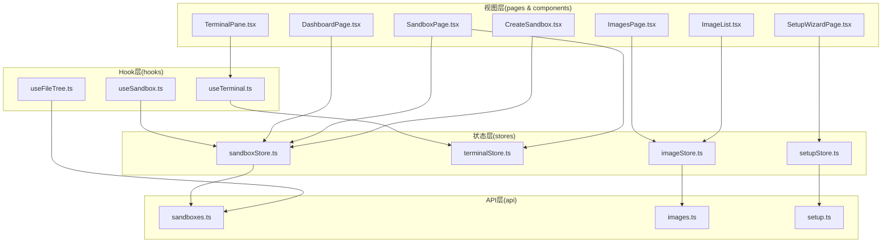
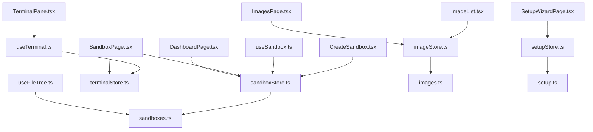
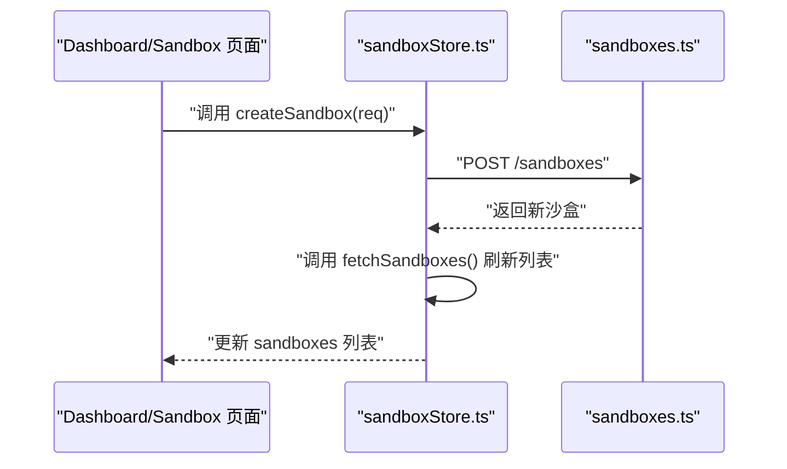
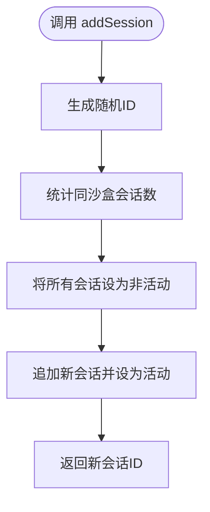
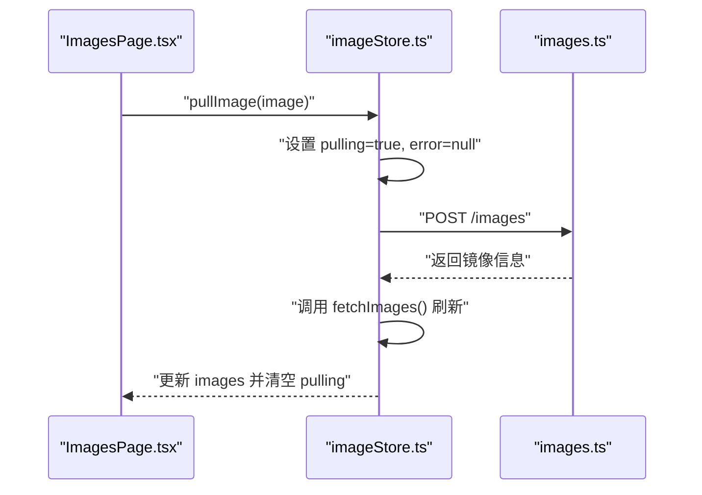
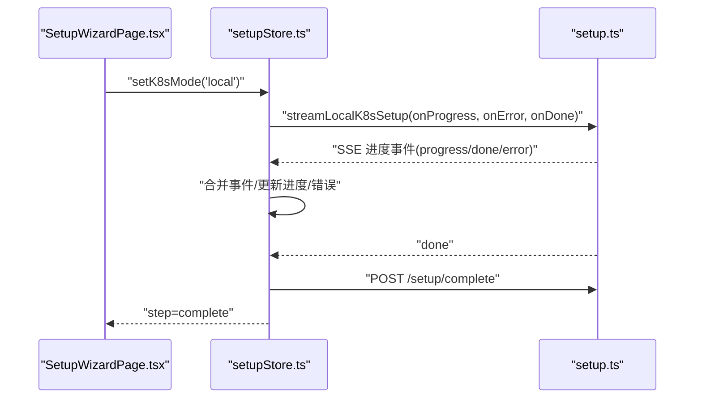
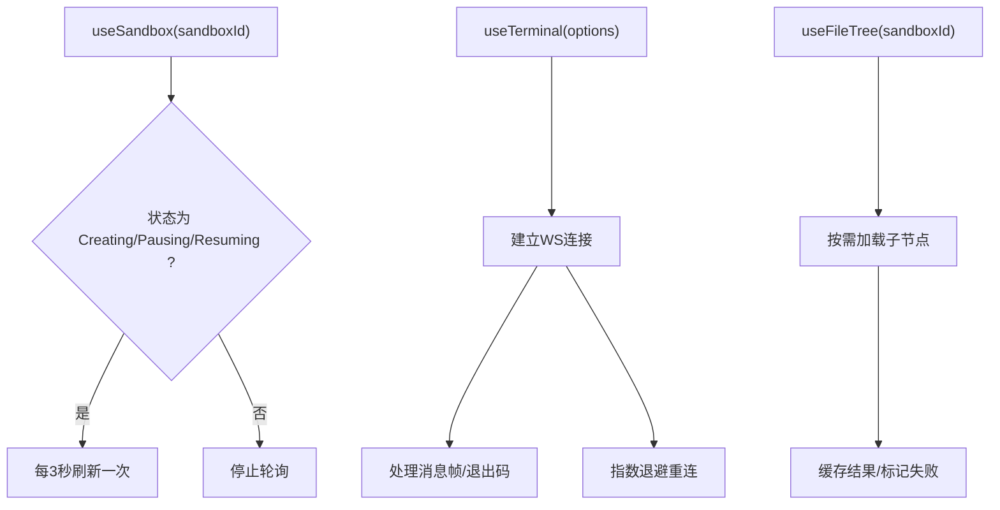
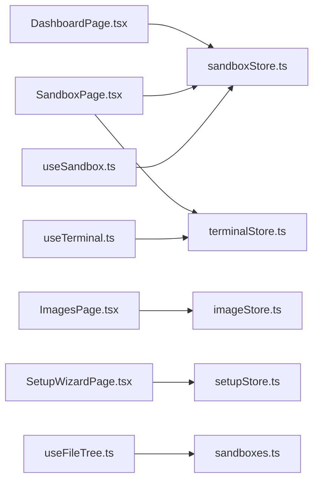
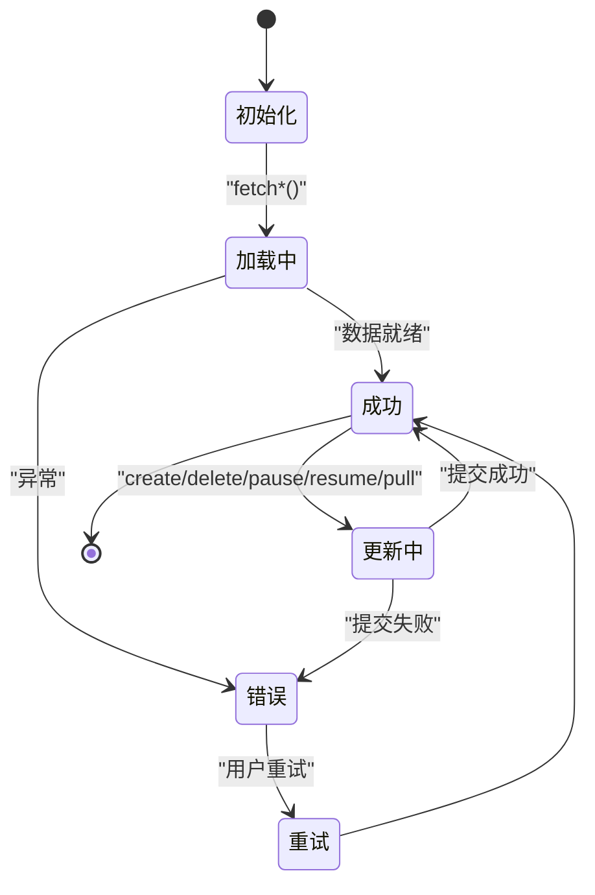

# 状态管理系统

<cite>
**本文引用的文件**
- [apps/frontend/src/stores/sandboxStore.ts](file://apps/frontend/src/stores/sandboxStore.ts)
- [apps/frontend/src/stores/terminalStore.ts](file://apps/frontend/src/stores/terminalStore.ts)
- [apps/frontend/src/stores/imageStore.ts](file://apps/frontend/src/stores/imageStore.ts)
- [apps/frontend/src/stores/setupStore.ts](file://apps/frontend/src/stores/setupStore.ts)
- [apps/frontend/src/hooks/useSandbox.ts](file://apps/frontend/src/hooks/useSandbox.ts)
- [apps/frontend/src/hooks/useTerminal.ts](file://apps/frontend/src/hooks/useTerminal.ts)
- [apps/frontend/src/hooks/useFileTree.ts](file://apps/frontend/src/hooks/useFileTree.ts)
- [apps/frontend/src/api/sandboxes.ts](file://apps/frontend/src/api/sandboxes.ts)
- [apps/frontend/src/api/images.ts](file://apps/frontend/src/api/images.ts)
- [apps/frontend/src/api/setup.ts](file://apps/frontend/src/api/setup.ts)
- [apps/frontend/src/components/sandbox/CreateSandbox.tsx](file://apps/frontend/src/components/sandbox/CreateSandbox.tsx)
- [apps/frontend/src/components/terminal/TerminalPane.tsx](file://apps/frontend/src/components/terminal/TerminalPane.tsx)
- [apps/frontend/src/components/images/ImageList.tsx](file://apps/frontend/src/components/images/ImageList.tsx)
- [apps/frontend/src/pages/DashboardPage.tsx](file://apps/frontend/src/pages/DashboardPage.tsx)
- [apps/frontend/src/pages/ImagesPage.tsx](file://apps/frontend/src/pages/ImagesPage.tsx)
- [apps/frontend/src/pages/SandboxPage.tsx](file://apps/frontend/src/pages/SandboxPage.tsx)
- [apps/frontend/src/pages/SetupWizardPage.tsx](file://apps/frontend/src/pages/SetupWizardPage.tsx)
</cite>

## 目录
1. [简介](#简介)
2. [项目结构](#项目结构)
3. [核心组件](#核心组件)
4. [架构总览](#架构总览)
5. [详细组件分析](#详细组件分析)
6. [依赖分析](#依赖分析)
7. [性能考虑](#性能考虑)
8. [故障排查指南](#故障排查指南)
9. [结论](#结论)
10. [附录](#附录)

## 简介
本文件面向Sandbox Manager前端的状态管理系统，系统基于Zustand构建，围绕四大store展开：沙盒状态管理（sandboxStore）、终端会话管理（terminalStore）、镜像状态管理（imageStore）与设置向导状态管理（setupStore）。文档将从store设计模式、状态结构、Action定义、Hook系统、持久化策略、异步更新与状态同步机制等方面进行深入解析，并提供最佳实践、性能优化与调试建议。

## 项目结构
前端状态管理位于apps/frontend/src目录下，采用按功能域划分的模块化组织方式：
- stores：Zustand状态容器，封装业务状态与副作用逻辑
- hooks：React自定义Hook，负责UI侧的生命周期与资源管理
- api：统一的HTTP客户端与类型定义，屏蔽后端接口细节
- pages与components：页面与组件消费store与hook，驱动UI渲染

图表来源
- [apps/frontend/src/stores/sandboxStore.ts:1-63](file://apps/frontend/src/stores/sandboxStore.ts#L1-L63)
- [apps/frontend/src/stores/terminalStore.ts:1-68](file://apps/frontend/src/stores/terminalStore.ts#L1-L68)
- [apps/frontend/src/stores/imageStore.ts:1-60](file://apps/frontend/src/stores/imageStore.ts#L1-L60)
- [apps/frontend/src/stores/setupStore.ts:1-157](file://apps/frontend/src/stores/setupStore.ts#L1-L157)
- [apps/frontend/src/hooks/useSandbox.ts:1-59](file://apps/frontend/src/hooks/useSandbox.ts#L1-L59)
- [apps/frontend/src/hooks/useTerminal.ts:1-180](file://apps/frontend/src/hooks/useTerminal.ts#L1-L180)
- [apps/frontend/src/hooks/useFileTree.ts:1-62](file://apps/frontend/src/hooks/useFileTree.ts#L1-L62)
- [apps/frontend/src/api/sandboxes.ts:1-40](file://apps/frontend/src/api/sandboxes.ts#L1-L40)
- [apps/frontend/src/api/images.ts:1-23](file://apps/frontend/src/api/images.ts#L1-L23)
- [apps/frontend/src/api/setup.ts:1-73](file://apps/frontend/src/api/setup.ts#L1-L73)
- [apps/frontend/src/pages/DashboardPage.tsx:1-54](file://apps/frontend/src/pages/DashboardPage.tsx#L1-L54)
- [apps/frontend/src/pages/SandboxPage.tsx:1-164](file://apps/frontend/src/pages/SandboxPage.tsx#L1-L164)
- [apps/frontend/src/pages/ImagesPage.tsx:1-43](file://apps/frontend/src/pages/ImagesPage.tsx#L1-L43)
- [apps/frontend/src/pages/SetupWizardPage.tsx:1-128](file://apps/frontend/src/pages/SetupWizardPage.tsx#L1-L128)
- [apps/frontend/src/components/terminal/TerminalPane.tsx:1-38](file://apps/frontend/src/components/terminal/TerminalPane.tsx#L1-L38)
- [apps/frontend/src/components/images/ImageList.tsx:1-51](file://apps/frontend/src/components/images/ImageList.tsx#L1-L51)
- [apps/frontend/src/components/sandbox/CreateSandbox.tsx:1-180](file://apps/frontend/src/components/sandbox/CreateSandbox.tsx#L1-L180)

章节来源
- [apps/frontend/src/stores/sandboxStore.ts:1-63](file://apps/frontend/src/stores/sandboxStore.ts#L1-L63)
- [apps/frontend/src/stores/terminalStore.ts:1-68](file://apps/frontend/src/stores/terminalStore.ts#L1-L68)
- [apps/frontend/src/stores/imageStore.ts:1-60](file://apps/frontend/src/stores/imageStore.ts#L1-L60)
- [apps/frontend/src/stores/setupStore.ts:1-157](file://apps/frontend/src/stores/setupStore.ts#L1-L157)

## 核心组件
本节概述四大store的设计目标、状态字段与关键Action，帮助快速把握整体职责边界。

- 沙盒状态管理（sandboxStore）
  - 职责：维护沙盒列表、加载状态与错误信息；提供创建、删除、暂停、恢复等操作
  - 关键状态：沙盒数组、loading、error
  - 关键Action：fetchSandboxes、createSandbox、deleteSandbox、pauseSandbox、resumeSandbox
  - 数据来源：通过API模块的沙盒接口完成读写

- 终端状态管理（terminalStore）
  - 职责：维护每个沙盒的终端会话集合，支持新增、删除、激活、重命名与按沙盒筛选
  - 关键状态：会话数组
  - 关键Action：addSession、removeSession、setActive、getSessionsBySandbox、renameSession
  - 数据来源：纯内存态，不直接持久化

- 镜像状态管理（imageStore）
  - 职责：维护镜像列表、拉取状态与错误信息；提供拉取、删除与状态刷新
  - 关键状态：镜像数组、loading、pulling、error
  - 关键Action：fetchImages、pullImage、deleteImage、refreshImageStatus
  - 数据来源：通过API模块的镜像接口完成读写

- 设置状态管理（setupStore）
  - 职责：管理K8s安装向导步骤、进度事件、远程连接测试与提交、错误处理
  - 关键状态：步骤、K8s模式、表单、进度事件、总体进度、错误、测试/提交状态
  - 关键Action：setK8sMode、startLocalSetup、updateRemoteForm、testRemoteConnection、submitRemoteConfig、goToDashboard、reset
  - 数据来源：通过API模块的setup接口完成读写与SSE流式事件

章节来源
- [apps/frontend/src/stores/sandboxStore.ts:5-14](file://apps/frontend/src/stores/sandboxStore.ts#L5-L14)
- [apps/frontend/src/stores/terminalStore.ts:4-18](file://apps/frontend/src/stores/terminalStore.ts#L4-L18)
- [apps/frontend/src/stores/imageStore.ts:5-15](file://apps/frontend/src/stores/imageStore.ts#L5-L15)
- [apps/frontend/src/stores/setupStore.ts:21-39](file://apps/frontend/src/stores/setupStore.ts#L21-L39)

## 架构总览
Zustand在本项目中承担“单页应用状态中枢”的角色，各store通过API层与后端交互，页面与组件通过store或自定义Hook订阅状态变化，实现UI与业务状态的解耦。

图表来源
- [apps/frontend/src/pages/DashboardPage.tsx:1-54](file://apps/frontend/src/pages/DashboardPage.tsx#L1-L54)
- [apps/frontend/src/pages/SandboxPage.tsx:1-164](file://apps/frontend/src/pages/SandboxPage.tsx#L1-L164)
- [apps/frontend/src/pages/ImagesPage.tsx:1-43](file://apps/frontend/src/pages/ImagesPage.tsx#L1-L43)
- [apps/frontend/src/pages/SetupWizardPage.tsx:1-128](file://apps/frontend/src/pages/SetupWizardPage.tsx#L1-L128)
- [apps/frontend/src/stores/sandboxStore.ts:1-63](file://apps/frontend/src/stores/sandboxStore.ts#L1-L63)
- [apps/frontend/src/stores/terminalStore.ts:1-68](file://apps/frontend/src/stores/terminalStore.ts#L1-L68)
- [apps/frontend/src/stores/imageStore.ts:1-60](file://apps/frontend/src/stores/imageStore.ts#L1-L60)
- [apps/frontend/src/stores/setupStore.ts:1-157](file://apps/frontend/src/stores/setupStore.ts#L1-L157)
- [apps/frontend/src/hooks/useSandbox.ts:1-59](file://apps/frontend/src/hooks/useSandbox.ts#L1-L59)
- [apps/frontend/src/hooks/useTerminal.ts:1-180](file://apps/frontend/src/hooks/useTerminal.ts#L1-L180)
- [apps/frontend/src/hooks/useFileTree.ts:1-62](file://apps/frontend/src/hooks/useFileTree.ts#L1-L62)
- [apps/frontend/src/api/sandboxes.ts:1-40](file://apps/frontend/src/api/sandboxes.ts#L1-L40)
- [apps/frontend/src/api/images.ts:1-23](file://apps/frontend/src/api/images.ts#L1-L23)
- [apps/frontend/src/api/setup.ts:1-73](file://apps/frontend/src/api/setup.ts#L1-L73)
- [apps/frontend/src/components/terminal/TerminalPane.tsx:1-38](file://apps/frontend/src/components/terminal/TerminalPane.tsx#L1-L38)
- [apps/frontend/src/components/images/ImageList.tsx:1-51](file://apps/frontend/src/components/images/ImageList.tsx#L1-L51)
- [apps/frontend/src/components/sandbox/CreateSandbox.tsx:1-180](file://apps/frontend/src/components/sandbox/CreateSandbox.tsx#L1-L180)

## 详细组件分析

### 沙盒状态管理（sandboxStore）
- 设计模式
  - 使用Zustand的create函数定义store，内部通过set与get访问与更新状态、调用其他Action
  - Action内部封装API调用与状态更新，保证UI层只关心store暴露的方法
- 状态结构
  - sandboxes：沙盒对象数组
  - loading：是否正在加载
  - error：错误信息
- 关键Action
  - fetchSandboxes：获取沙盒列表，兼容SDK返回格式
  - createSandbox：创建后主动刷新列表
  - deleteSandbox：删除后本地过滤
  - pauseSandbox/resumeSandbox：变更状态显示，随后由轮询或后端事件驱动真实状态更新
- 异步与同步
  - 异步：API请求、状态切换
  - 同步：本地即时UI反馈（如暂停/恢复时的中间态）

图表来源
- [apps/frontend/src/stores/sandboxStore.ts:33-38](file://apps/frontend/src/stores/sandboxStore.ts#L33-L38)
- [apps/frontend/src/api/sandboxes.ts:21-23](file://apps/frontend/src/api/sandboxes.ts#L21-L23)

章节来源
- [apps/frontend/src/stores/sandboxStore.ts:5-14](file://apps/frontend/src/stores/sandboxStore.ts#L5-L14)
- [apps/frontend/src/stores/sandboxStore.ts:16-62](file://apps/frontend/src/stores/sandboxStore.ts#L16-L62)
- [apps/frontend/src/api/sandboxes.ts:1-40](file://apps/frontend/src/api/sandboxes.ts#L1-L40)

### 终端状态管理（terminalStore）
- 设计模式
  - 会话集合为纯内存态，不涉及持久化
  - 新增会话时自动将旧活动会话置为非活动，确保同一沙盒仅有一个活动会话
- 状态结构
  - sessions：TerminalSession数组
- 关键Action
  - addSession：生成唯一ID，统计同沙盒会话数量决定标题，默认激活
  - removeSession：移除指定会话，若存在剩余会话则激活最后一个
  - setActive：切换活动会话
  - getSessionsBySandbox：按沙盒筛选会话
  - renameSession：重命名指定会话

图表来源
- [apps/frontend/src/stores/terminalStore.ts:23-38](file://apps/frontend/src/stores/terminalStore.ts#L23-L38)

章节来源
- [apps/frontend/src/stores/terminalStore.ts:4-18](file://apps/frontend/src/stores/terminalStore.ts#L4-L18)
- [apps/frontend/src/stores/terminalStore.ts:20-67](file://apps/frontend/src/stores/terminalStore.ts#L20-L67)

### 镜像状态管理（imageStore）
- 设计模式
  - 通过API获取镜像列表，支持拉取镜像、删除镜像与按名称刷新状态
  - 拉取流程：设置拉取状态 -> 调用API -> 刷新列表 -> 清理拉取状态
- 状态结构
  - images：镜像信息数组
  - loading/pulling/error：加载与拉取状态及错误信息
- 关键Action
  - fetchImages：获取镜像列表
  - pullImage：触发拉取并刷新
  - deleteImage：删除后本地过滤
  - refreshImageStatus：按名称替换最新状态

图表来源
- [apps/frontend/src/stores/imageStore.ts:33-44](file://apps/frontend/src/stores/imageStore.ts#L33-L44)
- [apps/frontend/src/api/images.ts:8-10](file://apps/frontend/src/api/images.ts#L8-L10)

章节来源
- [apps/frontend/src/stores/imageStore.ts:5-15](file://apps/frontend/src/stores/imageStore.ts#L5-L15)
- [apps/frontend/src/stores/imageStore.ts:17-59](file://apps/frontend/src/stores/imageStore.ts#L17-L59)
- [apps/frontend/src/api/images.ts:1-23](file://apps/frontend/src/api/images.ts#L1-L23)

### 设置状态管理（setupStore）
- 设计模式
  - 基于步骤机（welcome/local-progress/remote-form/complete）推进向导
  - 本地K8s安装通过SSE流实时推送进度事件，完成后自动保存配置并进入完成步骤
  - 远程连接先测试连通性，再提交配置
- 状态结构
  - step/k8sMode/remoteForm/progressEvents/overallProgress/error/testing/testResult/submitting
- 关键Action
  - setK8sMode：选择本地或远程模式并启动对应流程
  - startLocalSetup：打开SSE流，合并事件，更新总体进度与错误
  - updateRemoteForm：更新远程表单字段并清除测试结果
  - testRemoteConnection：发送测试请求并更新测试结果
  - submitRemoteConfig：提交远程配置并进入完成步骤
  - goToDashboard/reset：导航与重置

图表来源
- [apps/frontend/src/stores/setupStore.ts:61-97](file://apps/frontend/src/stores/setupStore.ts#L61-L97)
- [apps/frontend/src/api/setup.ts:33-72](file://apps/frontend/src/api/setup.ts#L33-L72)

章节来源
- [apps/frontend/src/stores/setupStore.ts:21-39](file://apps/frontend/src/stores/setupStore.ts#L21-L39)
- [apps/frontend/src/stores/setupStore.ts:41-156](file://apps/frontend/src/stores/setupStore.ts#L41-L156)
- [apps/frontend/src/api/setup.ts:1-73](file://apps/frontend/src/api/setup.ts#L1-L73)

### Hook系统实现
- useSandbox
  - 职责：为单个沙盒提供实时数据与轮询刷新能力，避免信任store缓存
  - 行为：首次挂载与参数变化时发起请求；当沙盒处于Creating/Pausing/Resuming时每3秒轮询一次，直至状态稳定
- useTerminal
  - 职责：管理xterm实例、WebSocket连接、自适应布局与断线重连
  - 行为：建立WS连接，处理消息帧（字符串退出码、二进制输出），发送输入与尺寸调整；指数退避重连
- useFileTree
  - 职责：管理文件树的懒加载、展开状态与错误处理
  - 行为：按需加载子节点，记录失败目录，避免重复请求

图表来源
- [apps/frontend/src/hooks/useSandbox.ts:42-55](file://apps/frontend/src/hooks/useSandbox.ts#L42-L55)
- [apps/frontend/src/hooks/useTerminal.ts:25-95](file://apps/frontend/src/hooks/useTerminal.ts#L25-L95)
- [apps/frontend/src/hooks/useFileTree.ts:12-32](file://apps/frontend/src/hooks/useFileTree.ts#L12-L32)

章节来源
- [apps/frontend/src/hooks/useSandbox.ts:1-59](file://apps/frontend/src/hooks/useSandbox.ts#L1-L59)
- [apps/frontend/src/hooks/useTerminal.ts:1-180](file://apps/frontend/src/hooks/useTerminal.ts#L1-L180)
- [apps/frontend/src/hooks/useFileTree.ts:1-62](file://apps/frontend/src/hooks/useFileTree.ts#L1-L62)

## 依赖分析
- 组件与store的依赖关系
  - DashboardPage与SandboxPage依赖sandboxStore与terminalStore
  - ImagesPage依赖imageStore
  - SetupWizardPage依赖setupStore
- Hook与store/API的依赖关系
  - useSandbox依赖sandboxStore与API沙盒接口
  - useTerminal依赖terminalStore与WebSocket
  - useFileTree依赖API沙盒接口
- 外部依赖
  - xterm与addons用于终端渲染
  - EventSource用于本地K8s安装的SSE流

图表来源
- [apps/frontend/src/pages/DashboardPage.tsx:1-54](file://apps/frontend/src/pages/DashboardPage.tsx#L1-L54)
- [apps/frontend/src/pages/SandboxPage.tsx:1-164](file://apps/frontend/src/pages/SandboxPage.tsx#L1-L164)
- [apps/frontend/src/pages/ImagesPage.tsx:1-43](file://apps/frontend/src/pages/ImagesPage.tsx#L1-L43)
- [apps/frontend/src/pages/SetupWizardPage.tsx:1-128](file://apps/frontend/src/pages/SetupWizardPage.tsx#L1-L128)
- [apps/frontend/src/stores/sandboxStore.ts:1-63](file://apps/frontend/src/stores/sandboxStore.ts#L1-L63)
- [apps/frontend/src/stores/terminalStore.ts:1-68](file://apps/frontend/src/stores/terminalStore.ts#L1-L68)
- [apps/frontend/src/stores/imageStore.ts:1-60](file://apps/frontend/src/stores/imageStore.ts#L1-L60)
- [apps/frontend/src/stores/setupStore.ts:1-157](file://apps/frontend/src/stores/setupStore.ts#L1-L157)
- [apps/frontend/src/hooks/useSandbox.ts:1-59](file://apps/frontend/src/hooks/useSandbox.ts#L1-L59)
- [apps/frontend/src/hooks/useTerminal.ts:1-180](file://apps/frontend/src/hooks/useTerminal.ts#L1-L180)
- [apps/frontend/src/hooks/useFileTree.ts:1-62](file://apps/frontend/src/hooks/useFileTree.ts#L1-L62)
- [apps/frontend/src/api/sandboxes.ts:1-40](file://apps/frontend/src/api/sandboxes.ts#L1-L40)

章节来源
- [apps/frontend/src/pages/DashboardPage.tsx:1-54](file://apps/frontend/src/pages/DashboardPage.tsx#L1-L54)
- [apps/frontend/src/pages/SandboxPage.tsx:1-164](file://apps/frontend/src/pages/SandboxPage.tsx#L1-L164)
- [apps/frontend/src/pages/ImagesPage.tsx:1-43](file://apps/frontend/src/pages/ImagesPage.tsx#L1-L43)
- [apps/frontend/src/pages/SetupWizardPage.tsx:1-128](file://apps/frontend/src/pages/SetupWizardPage.tsx#L1-L128)

## 性能考虑
- 状态粒度与订阅范围
  - 将不同业务域拆分为独立store，避免无关UI订阅导致的无谓重渲染
  - 在页面级使用选择器订阅所需字段，减少全局广播
- 异步操作的批处理与去抖
  - 对频繁触发的Action（如终端resize）可引入节流/去抖，降低网络与渲染压力
- 缓存与轮询策略
  - useSandbox对易过期的沙盒数据采用“每次挂载都请求”，避免陈旧状态；对稳定数据（如镜像列表）可结合本地缓存与定时刷新
- 终端性能
  - 合理设置scrollback与字体大小，避免过大文本导致渲染卡顿
  - 使用ResizeObserver与fit插件动态适配，减少手动计算
- SSE与WS
  - SSE事件合并与去重，避免重复渲染
  - WS断线重连指数退避，上限控制，防止风暴

## 故障排查指南
- 沙盒状态异常
  - 现象：沙盒状态长时间停留在中间态（如Pausing/Resuming）
  - 排查：确认后端事件是否正常推送；检查useSandbox轮询逻辑是否被清理
- 镜像拉取失败
  - 现象：pullImage后列表未更新或报错
  - 排查：检查API返回与错误提示；确认fetchImages是否被调用；查看pulling状态是否正确复位
- 终端连接问题
  - 现象：无法连接或频繁断开
  - 排查：确认WS地址协议与主机；观察重连日志与延迟；检查服务端PTY通道
- 设置向导卡住
  - 现象：本地安装SSE无事件或中途报错
  - 排查：检查SSE流URL与权限；确认onError回调是否捕获到错误消息；验证completeSetup是否成功

章节来源
- [apps/frontend/src/hooks/useSandbox.ts:42-55](file://apps/frontend/src/hooks/useSandbox.ts#L42-L55)
- [apps/frontend/src/stores/imageStore.ts:33-44](file://apps/frontend/src/stores/imageStore.ts#L33-L44)
- [apps/frontend/src/hooks/useTerminal.ts:79-95](file://apps/frontend/src/hooks/useTerminal.ts#L79-L95)
- [apps/frontend/src/api/setup.ts:33-72](file://apps/frontend/src/api/setup.ts#L33-L72)

## 结论
本状态管理系统以Zustand为核心，结合自定义Hook与API层，实现了清晰的职责分离与高效的UI响应。通过将业务域拆分为独立store、在Hook中处理生命周期与资源管理、在store中封装异步与同步逻辑，系统具备良好的可维护性与扩展性。建议在后续迭代中进一步完善缓存策略、Action批处理与可视化调试工具，以提升用户体验与开发效率。

## 附录
- 状态流转图（概念示意）
