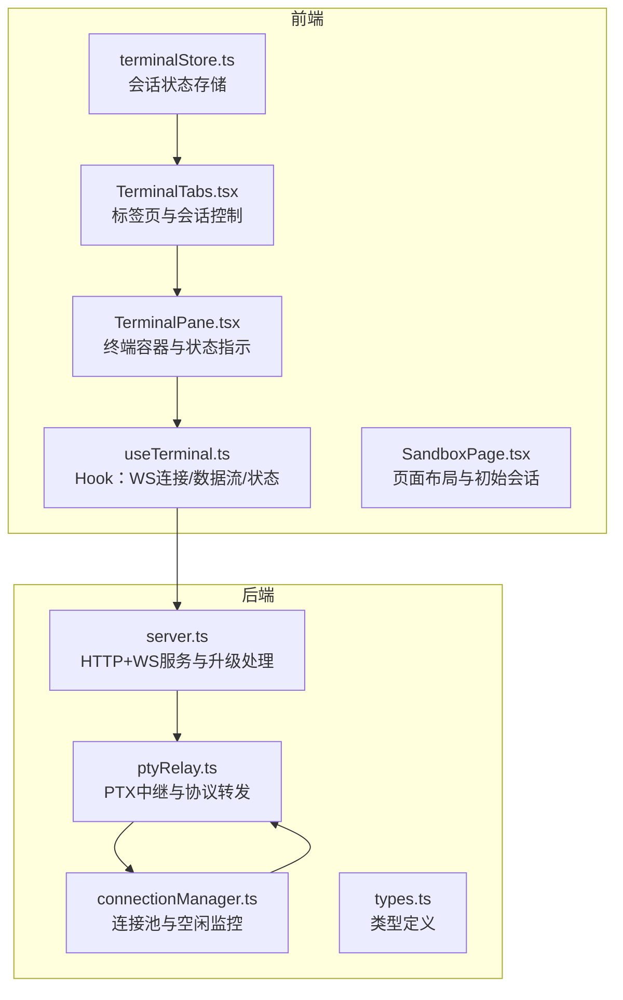
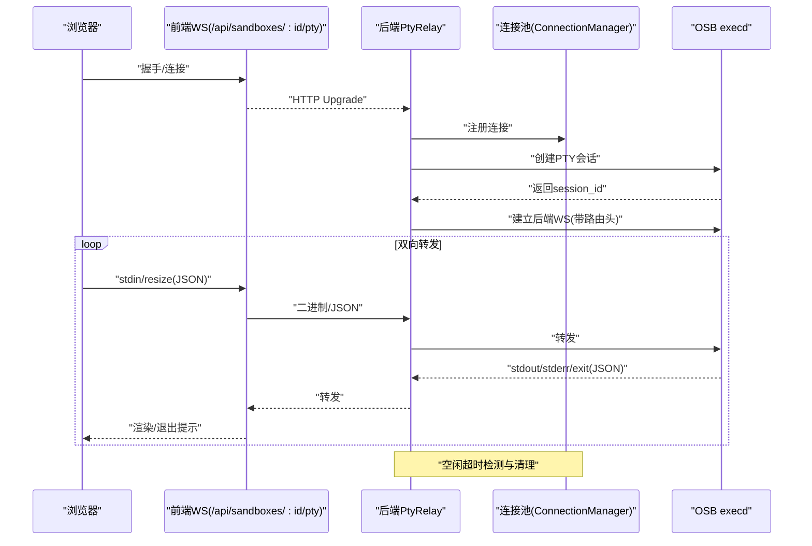
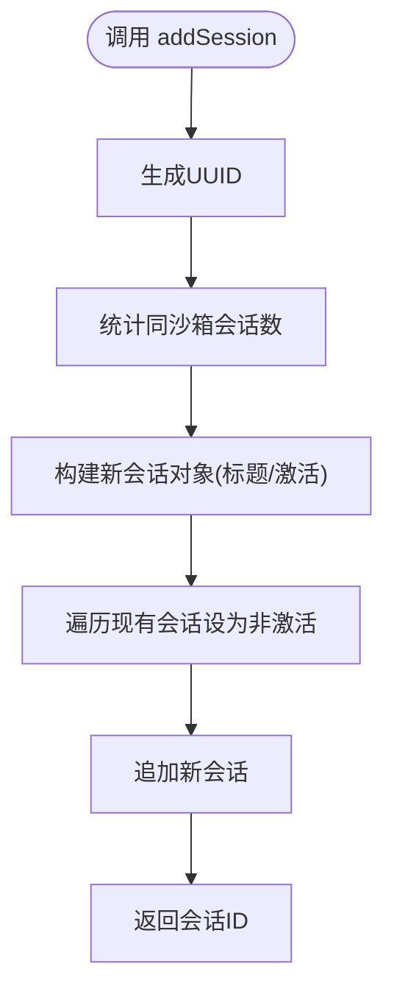
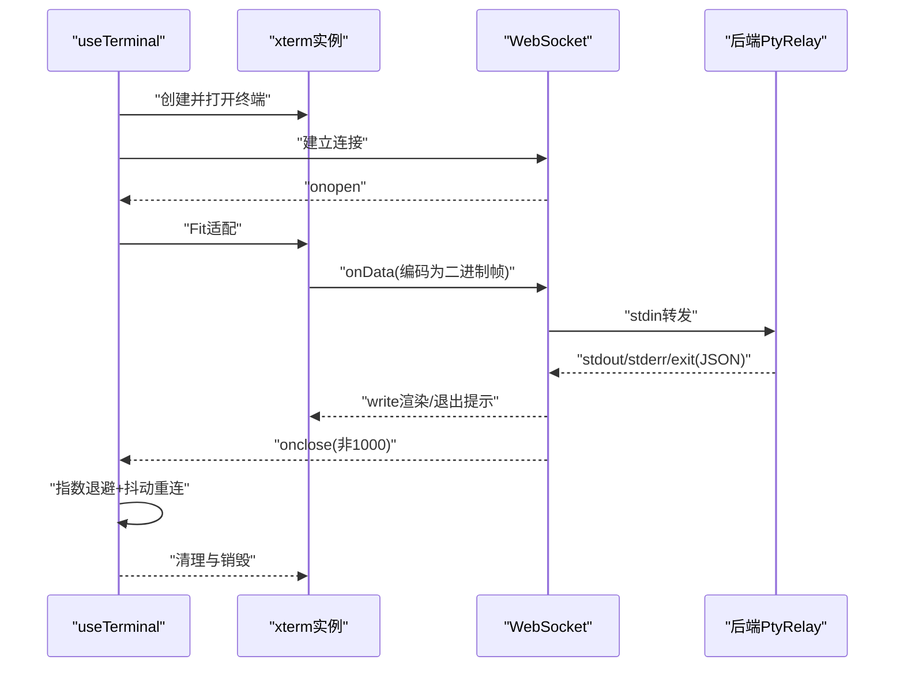
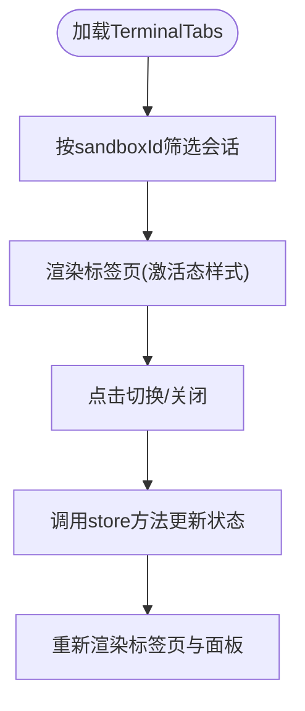
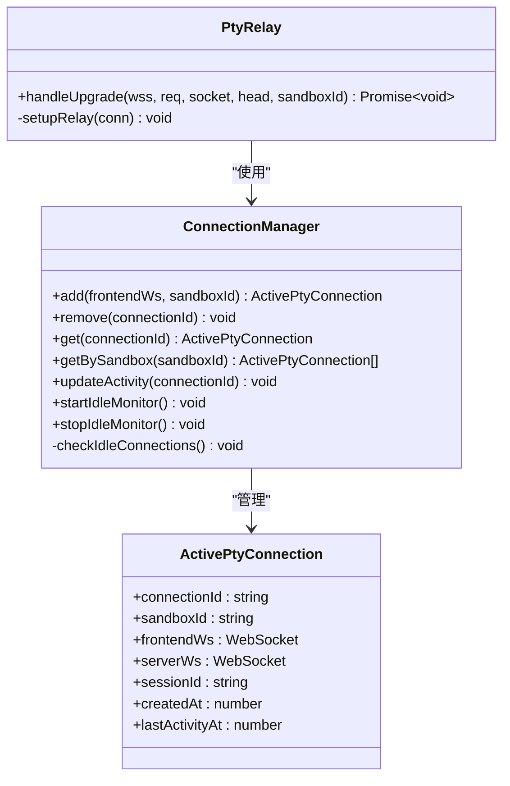
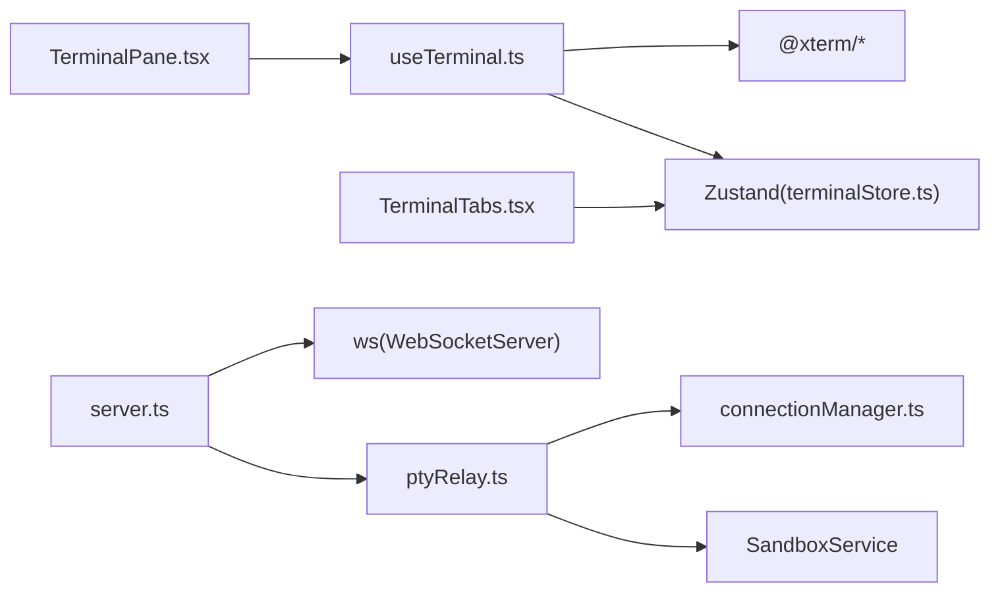
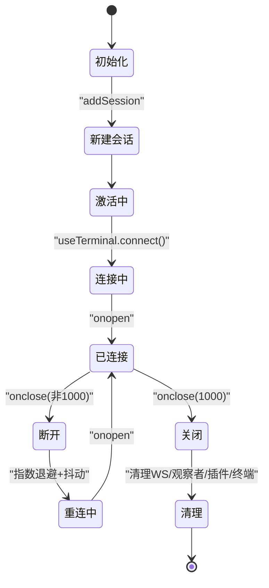

# 终端状态管理

<cite>
**本文引用的文件**
- [terminalStore.ts](file://apps/frontend/src/stores/terminalStore.ts)
- [useTerminal.ts](file://apps/frontend/src/hooks/useTerminal.ts)
- [TerminalPane.tsx](file://apps/frontend/src/components/terminal/TerminalPane.tsx)
- [TerminalTabs.tsx](file://apps/frontend/src/components/terminal/TerminalTabs.tsx)
- [connectionManager.ts](file://apps/backend/src/websocket/connectionManager.ts)
- [ptyRelay.ts](file://apps/backend/src/websocket/ptyRelay.ts)
- [types.ts](file://apps/backend/src/websocket/types.ts)
- [server.ts](file://apps/backend/src/server.ts)
- [utils.ts](file://apps/frontend/src/lib/utils.ts)
- [SandboxPage.tsx](file://apps/frontend/src/pages/SandboxPage.tsx)
</cite>

## 目录
1. [简介](#简介)
2. [项目结构](#项目结构)
3. [核心组件](#核心组件)
4. [架构总览](#架构总览)
5. [详细组件分析](#详细组件分析)
6. [依赖关系分析](#依赖关系分析)
7. [性能考量](#性能考量)
8. [故障排查指南](#故障排查指南)
9. [结论](#结论)
10. [附录](#附录)

## 简介
本技术文档聚焦于终端状态管理模块，涵盖前端终端会话状态管理、连接状态跟踪与消息队列处理，以及后端 WebSocket 连接池与 PTY 中继的实现。文档详细说明了终端会话生命周期（连接建立、会话维护、断开重连、清理）、useTerminal Hook 的实现模式（WebSocket 管理、数据流处理、状态同步），并提供最佳实践（连接池管理、错误恢复策略、性能优化）与实时通信示例。

## 项目结构
终端状态管理由前后端协同完成：
- 前端负责会话标签页与状态存储、终端实例与 WebSocket 生命周期管理、UI 状态展示与交互。
- 后端负责 WebSocket 升级、连接池管理、PTX 会话创建与双向中继、空闲检测与清理。

图表来源
- [terminalStore.ts:1-68](file://apps/frontend/src/stores/terminalStore.ts#L1-L68)
- [useTerminal.ts:1-180](file://apps/frontend/src/hooks/useTerminal.ts#L1-L180)
- [TerminalPane.tsx:1-38](file://apps/frontend/src/components/terminal/TerminalPane.tsx#L1-L38)
- [TerminalTabs.tsx:1-57](file://apps/frontend/src/components/terminal/TerminalTabs.tsx#L1-L57)
- [server.ts:75-87](file://apps/backend/src/server.ts#L75-L87)
- [ptyRelay.ts:40-118](file://apps/backend/src/websocket/ptyRelay.ts#L40-L118)
- [connectionManager.ts:30-100](file://apps/backend/src/websocket/connectionManager.ts#L30-L100)
- [types.ts:4-19](file://apps/backend/src/websocket/types.ts#L4-L19)

章节来源
- [terminalStore.ts:1-68](file://apps/frontend/src/stores/terminalStore.ts#L1-L68)
- [useTerminal.ts:1-180](file://apps/frontend/src/hooks/useTerminal.ts#L1-L180)
- [TerminalPane.tsx:1-38](file://apps/frontend/src/components/terminal/TerminalPane.tsx#L1-L38)
- [TerminalTabs.tsx:1-57](file://apps/frontend/src/components/terminal/TerminalTabs.tsx#L1-L57)
- [server.ts:75-87](file://apps/backend/src/server.ts#L75-L87)
- [ptyRelay.ts:40-118](file://apps/backend/src/websocket/ptyRelay.ts#L40-L118)
- [connectionManager.ts:30-100](file://apps/backend/src/websocket/connectionManager.ts#L30-L100)
- [types.ts:4-19](file://apps/backend/src/websocket/types.ts#L4-L19)

## 核心组件
- 终端会话状态存储（Zustand）
  - 负责会话列表、新增/删除/激活/重命名、按沙箱过滤等操作。
  - 提供会话唯一标识生成与标题命名逻辑。
- useTerminal Hook
  - 负责终端实例创建、WebSocket 连接、输入输出数据流、窗口大小调整、断线重连与清理。
  - 管理连接状态（已连接/重连中/错误）与 UI 展示。
- 终端面板与标签页
  - TerminalPane 渲染终端容器与连接状态指示。
  - TerminalTabs 管理多标签页、双击重命名、添加/关闭标签。
- 后端连接池与 PTY 中继
  - ConnectionManager 维护连接映射、空闲检测与清理。
  - PtyRelay 完成前端 WS 与 execd 之间的透明二进制转发与控制帧处理。

章节来源
- [terminalStore.ts:11-67](file://apps/frontend/src/stores/terminalStore.ts#L11-L67)
- [useTerminal.ts:12-179](file://apps/frontend/src/hooks/useTerminal.ts#L12-L179)
- [TerminalPane.tsx:8-37](file://apps/frontend/src/components/terminal/TerminalPane.tsx#L8-L37)
- [TerminalTabs.tsx:7-56](file://apps/frontend/src/components/terminal/TerminalTabs.tsx#L7-L56)
- [connectionManager.ts:7-101](file://apps/backend/src/websocket/connectionManager.ts#L7-L101)
- [ptyRelay.ts:22-170](file://apps/backend/src/websocket/ptyRelay.ts#L22-L170)

## 架构总览
终端通信链路从浏览器到后端再到 OSB execd 的完整路径如下：

图表来源
- [server.ts:75-87](file://apps/backend/src/server.ts#L75-L87)
- [ptyRelay.ts:40-118](file://apps/backend/src/websocket/ptyRelay.ts#L40-L118)
- [connectionManager.ts:18-100](file://apps/backend/src/websocket/connectionManager.ts#L18-L100)

## 详细组件分析

### 终端会话状态存储（terminalStore）
- 数据模型
  - TerminalSession：包含会话唯一标识、所属沙箱标识、标题、是否激活。
- 核心能力
  - 新增会话：自动生成 UUID，计算同沙箱会话数量以命名“Terminal N”，自动激活新会话并使其他会话失活。
  - 删除会话：移除指定会话；若该沙箱仍有会话，则激活最后一个会话。
  - 激活切换：仅保留目标会话激活。
  - 按沙箱筛选：用于标签页渲染与页面布局。
  - 重命名：更新会话标题。
- 复杂度
  - 列表操作均为 O(n)，适合少量会话场景；如需大规模会话管理可考虑 Map 结构优化查找。

图表来源
- [terminalStore.ts:23-39](file://apps/frontend/src/stores/terminalStore.ts#L23-L39)

章节来源
- [terminalStore.ts:4-18](file://apps/frontend/src/stores/terminalStore.ts#L4-L18)
- [terminalStore.ts:20-67](file://apps/frontend/src/stores/terminalStore.ts#L20-L67)
- [utils.ts:1-3](file://apps/frontend/src/lib/utils.ts#L1-L3)

### useTerminal Hook 实现模式
- 终端实例与插件
  - 创建 xterm 实例，加载 FitAddon 与 WebLinksAddon，并在容器打开。
  - 使用 ResizeObserver 自适应容器尺寸。
- WebSocket 连接与协议
  - 动态构造 ws/wss URL，设置二进制类型为 ArrayBuffer。
  - onopen：清零重连计数、置连接状态、触发 FitAddon 适配。
  - onmessage：区分二进制帧（stdin→stdout/stderr）与文本帧（JSON 控制：exit）。
  - onclose：非正常关闭触发指数退避重连，带抖动；正常关闭不重连。
  - onerror：记录错误信息。
- 输入/输出与窗口调整
  - onData：将输入数据编码为二进制帧（前缀 0x00）发送至后端。
  - onResize：发送 JSON 控制帧（type: "resize", cols, rows）。
- 生命周期与清理
  - 组件卸载时取消重连定时器、关闭 WS、释放观察者与插件、销毁终端实例。

图表来源
- [useTerminal.ts:25-95](file://apps/frontend/src/hooks/useTerminal.ts#L25-L95)
- [useTerminal.ts:127-144](file://apps/frontend/src/hooks/useTerminal.ts#L127-L144)
- [useTerminal.ts:156-176](file://apps/frontend/src/hooks/useTerminal.ts#L156-L176)

章节来源
- [useTerminal.ts:12-179](file://apps/frontend/src/hooks/useTerminal.ts#L12-L179)

### 终端面板与标签页
- TerminalPane
  - 渲染终端容器，显示连接状态（错误/重连中/已连接）。
  - 通过 ref 将容器传递给 useTerminal。
- TerminalTabs
  - 读取 terminalStore，渲染当前沙箱的会话标签。
  - 支持点击切换激活、双击重命名、点击关闭并自动激活剩余会话或保持空状态。

图表来源
- [TerminalTabs.tsx:7-56](file://apps/frontend/src/components/terminal/TerminalTabs.tsx#L7-L56)
- [TerminalPane.tsx:8-37](file://apps/frontend/src/components/terminal/TerminalPane.tsx#L8-L37)

章节来源
- [TerminalPane.tsx:8-37](file://apps/frontend/src/components/terminal/TerminalPane.tsx#L8-L37)
- [TerminalTabs.tsx:7-56](file://apps/frontend/src/components/terminal/TerminalTabs.tsx#L7-L56)

### 后端连接池与 PTY 中继
- WebSocket 升级与握手
  - server.ts 在 upgrade 事件中匹配 /api/sandboxes/:id/pty，交由 PtyRelay.handleUpgrade 完成。
  - 握手成功后注册到 ConnectionManager 并启动空闲监控。
- PTY 会话创建与中继
  - 通过 SandboxService 获取 execd 代理地址与请求头。
  - POST /pty 创建会话并获取 session_id，随后连接 execd 的 /pty/{sessionId}/ws。
  - setupRelay 双向转发：前端 WS → 后端 WS（stdin/resize），后端 WS → 前端 WS（stdout/stderr/exit）。
- 空闲检测与清理
  - ConnectionManager 定期检查 lastActivityAt，超过配置阈值则关闭并清理两端 WS。
  - 当连接数归零时停止空闲监控。

图表来源
- [connectionManager.ts:7-101](file://apps/backend/src/websocket/connectionManager.ts#L7-L101)
- [ptyRelay.ts:22-170](file://apps/backend/src/websocket/ptyRelay.ts#L22-L170)
- [types.ts:11-19](file://apps/backend/src/websocket/types.ts#L11-L19)

章节来源
- [server.ts:75-87](file://apps/backend/src/server.ts#L75-L87)
- [ptyRelay.ts:40-118](file://apps/backend/src/websocket/ptyRelay.ts#L40-L118)
- [connectionManager.ts:30-100](file://apps/backend/src/websocket/connectionManager.ts#L30-L100)
- [types.ts:11-19](file://apps/backend/src/websocket/types.ts#L11-L19)

## 依赖关系分析
- 前端依赖
  - Zustand：集中式状态管理，避免全局状态污染。
  - @xterm/*：终端渲染与插件（适配、链接）。
  - React Hooks：生命周期与副作用管理。
- 后端依赖
  - ws：WebSocket 服务器与客户端。
  - SandboxService：与 OSB 平台交互，解析 execd 代理地址与会话。
  - 日志与配置：统一日志与配置注入，便于调试与运维。

图表来源
- [useTerminal.ts:1-180](file://apps/frontend/src/hooks/useTerminal.ts#L1-L180)
- [terminalStore.ts:1-68](file://apps/frontend/src/stores/terminalStore.ts#L1-L68)
- [TerminalPane.tsx:1-38](file://apps/frontend/src/components/terminal/TerminalPane.tsx#L1-L38)
- [TerminalTabs.tsx:1-57](file://apps/frontend/src/components/terminal/TerminalTabs.tsx#L1-L57)
- [server.ts:72-90](file://apps/backend/src/server.ts#L72-L90)
- [ptyRelay.ts:1-171](file://apps/backend/src/websocket/ptyRelay.ts#L1-L171)
- [connectionManager.ts:1-102](file://apps/backend/src/websocket/connectionManager.ts#L1-L102)

章节来源
- [useTerminal.ts:1-180](file://apps/frontend/src/hooks/useTerminal.ts#L1-L180)
- [terminalStore.ts:1-68](file://apps/frontend/src/stores/terminalStore.ts#L1-L68)
- [TerminalPane.tsx:1-38](file://apps/frontend/src/components/terminal/TerminalPane.tsx#L1-L38)
- [TerminalTabs.tsx:1-57](file://apps/frontend/src/components/terminal/TerminalTabs.tsx#L1-L57)
- [server.ts:72-90](file://apps/backend/src/server.ts#L72-L90)
- [ptyRelay.ts:1-171](file://apps/backend/src/websocket/ptyRelay.ts#L1-L171)
- [connectionManager.ts:1-102](file://apps/backend/src/websocket/connectionManager.ts#L1-L102)

## 性能考量
- 前端
  - 终端滚动回溯与字体/主题：合理设置 scrollback 与主题，避免过度渲染。
  - ResizeObserver 与 FitAddon：在容器尺寸变化时触发适配，减少闪烁。
  - 输入编码：使用 TextEncoder 编码，避免字符串拼接带来的额外开销。
  - 重连退避：指数退避+抖动，防止雪崩效应；最大延迟限制避免过长等待。
- 后端
  - 透明转发：保持二进制帧直通，降低协议解析成本。
  - 空闲检测：定期扫描与清理长时间无活动的连接，释放资源。
  - 请求头透传：确保 execd 认证与路由正确性，减少鉴权失败导致的重试。

[本节为通用性能建议，无需特定文件引用]

## 故障排查指南
- 前端常见问题
  - 连接失败：检查 ws/wss 协议与主机名，确认后端 upgrade 路由匹配。
  - 无法输入：确认 WebSocket 状态为 OPEN，且未被 disposed。
  - 退出提示：后端发送 exit 控制帧时，前端会写入提示并标记断开。
  - 重连异常：检查指数退避与抖动参数，避免频繁重连。
- 后端常见问题
  - 握手超时：handleUpgrade 设置了 10 秒超时，检查网络与 SandboxService 可用性。
  - PTY 会话创建失败：检查 execd 地址与认证头，确认返回状态码与响应体。
  - 空闲连接未清理：确认 idleCheckInterval 已启动，ptyIdleTimeoutMs 配置合理。
- 日志定位
  - 前端：onerror 记录错误信息，onclose 触发重连。
  - 后端：upgrade、relay、close/error、idle 检测均有日志输出。

章节来源
- [useTerminal.ts:92-95](file://apps/frontend/src/hooks/useTerminal.ts#L92-L95)
- [useTerminal.ts:79-90](file://apps/frontend/src/hooks/useTerminal.ts#L79-L90)
- [ptyRelay.ts:110-118](file://apps/backend/src/websocket/ptyRelay.ts#L110-L118)
- [ptyRelay.ts:146-166](file://apps/backend/src/websocket/ptyRelay.ts#L146-L166)
- [connectionManager.ts:18-28](file://apps/backend/src/websocket/connectionManager.ts#L18-L28)

## 结论
终端状态管理模块通过前端 Zustand 会话状态与 useTerminal Hook 的 WebSocket 生命周期管理，结合后端 ConnectionManager 与 PtyRelay 的连接池与透明中继，实现了稳定、可扩展的终端会话体验。遵循本文的最佳实践与排错指南，可在高并发与复杂网络环境下保持良好的性能与可靠性。

[本节为总结性内容，无需特定文件引用]

## 附录

### 终端会话生命周期图

图表来源
- [terminalStore.ts:23-50](file://apps/frontend/src/stores/terminalStore.ts#L23-L50)
- [useTerminal.ts:25-95](file://apps/frontend/src/hooks/useTerminal.ts#L25-L95)
- [useTerminal.ts:156-176](file://apps/frontend/src/hooks/useTerminal.ts#L156-L176)

### 实时通信示例（关键流程）
- 前端
  - 终端输入 → 编码为二进制帧（前缀 0x00）→ 发送至后端。
  - 终端窗口调整 → 发送 JSON 控制帧（type: "resize"）。
  - 接收后端数据 → 区分 stdout/stderr（0x01/0x02）与 exit 控制帧。
- 后端
  - 前端 WS → execd WS：stdin/resize 直通。
  - execd WS → 前端 WS：stdout/stderr/exit 直通。
  - 空闲检测：超过阈值自动清理。

章节来源
- [useTerminal.ts:127-144](file://apps/frontend/src/hooks/useTerminal.ts#L127-L144)
- [ptyRelay.ts:124-144](file://apps/backend/src/websocket/ptyRelay.ts#L124-L144)
- [types.ts:4-9](file://apps/backend/src/websocket/types.ts#L4-L9)