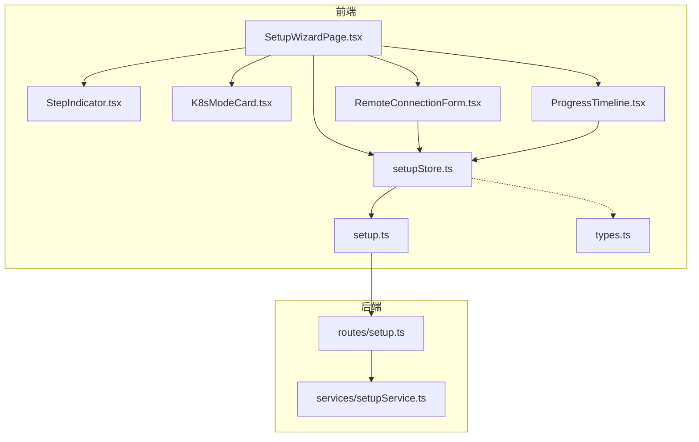
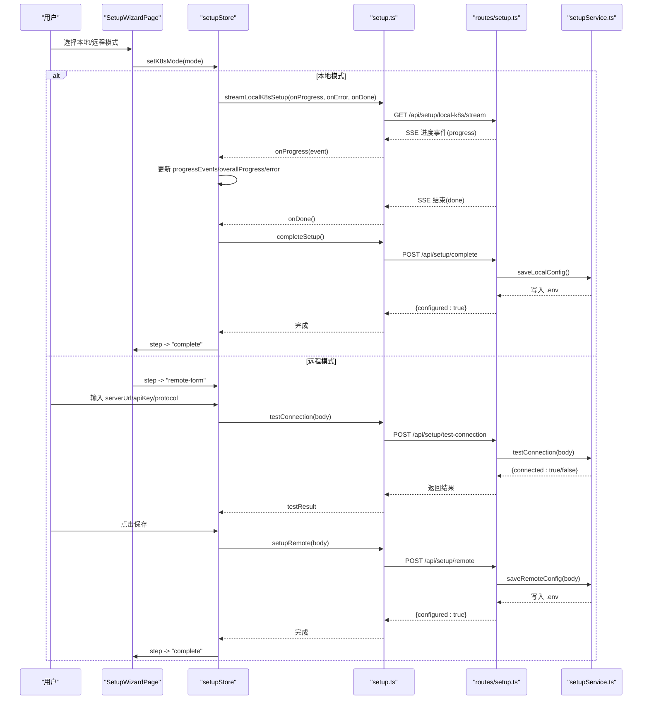
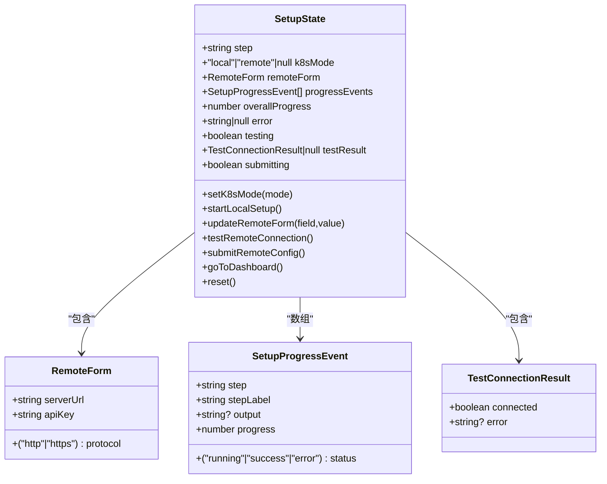
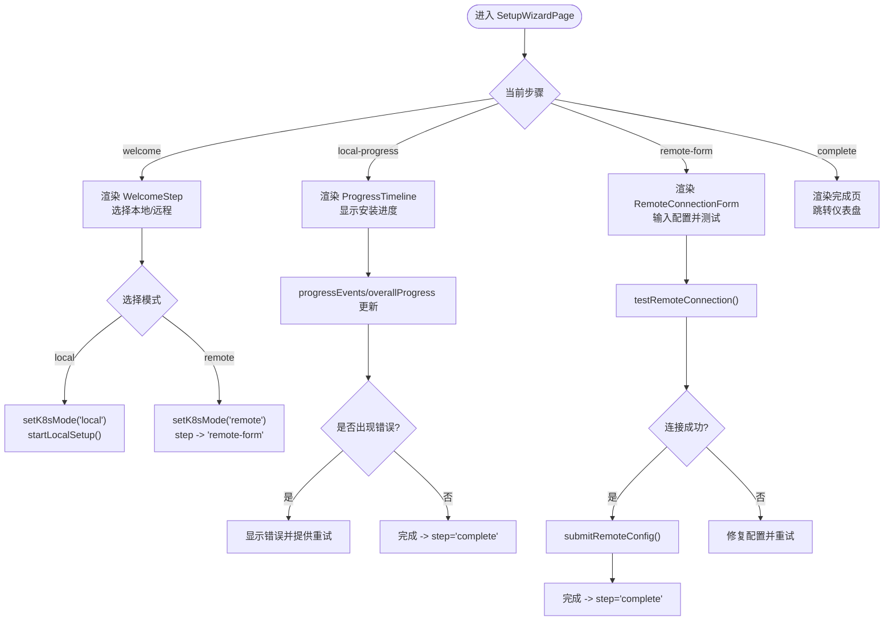
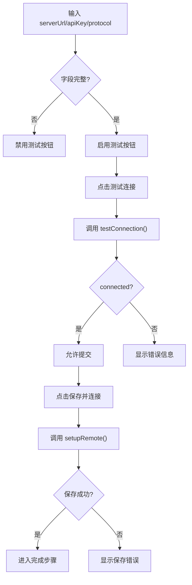
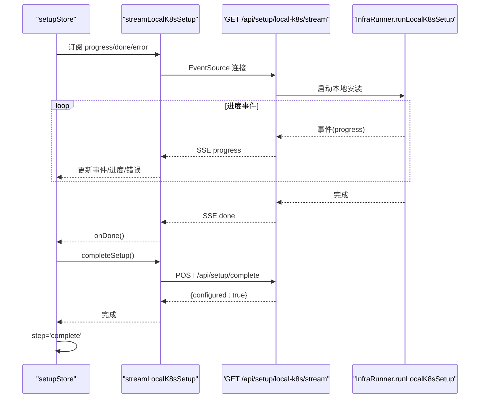
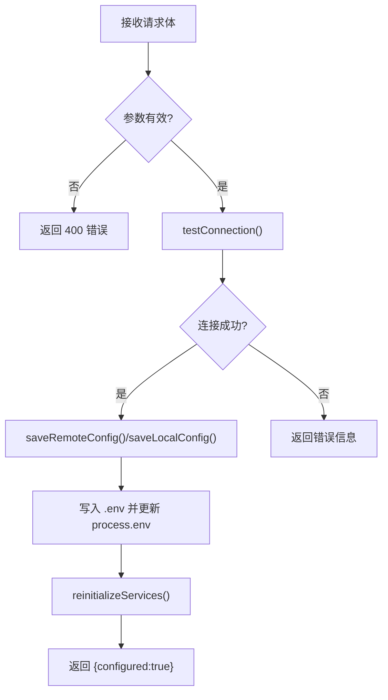
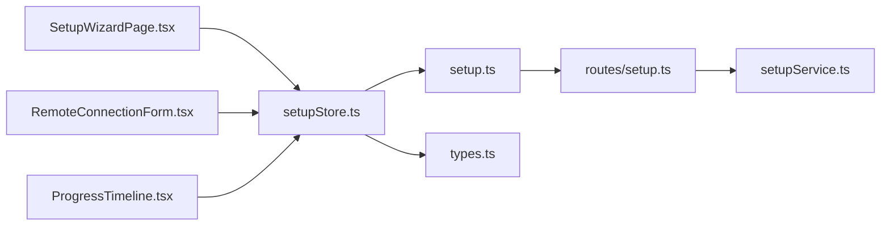

# 设置状态管理

<cite>
**本文引用的文件**
- [setupStore.ts](file://apps/frontend/src/stores/setupStore.ts)
- [SetupWizardPage.tsx](file://apps/frontend/src/pages/SetupWizardPage.tsx)
- [RemoteConnectionForm.tsx](file://apps/frontend/src/components/setup/RemoteConnectionForm.tsx)
- [ProgressTimeline.tsx](file://apps/frontend/src/components/setup/ProgressTimeline.tsx)
- [StepIndicator.tsx](file://apps/frontend/src/components/setup/StepIndicator.tsx)
- [K8sModeCard.tsx](file://apps/frontend/src/components/setup/K8sModeCard.tsx)
- [setup.ts](file://apps/frontend/src/api/setup.ts)
- [types.ts](file://apps/frontend/src/api/types.ts)
- [setup.ts](file://apps/backend/src/routes/setup.ts)
- [setupService.ts](file://apps/backend/src/services/setupService.ts)
</cite>

## 目录
1. [简介](#简介)
2. [项目结构](#项目结构)
3. [核心组件](#核心组件)
4. [架构总览](#架构总览)
5. [详细组件分析](#详细组件分析)
6. [依赖关系分析](#依赖关系分析)
7. [性能考虑](#性能考虑)
8. [故障排查指南](#故障排查指南)
9. [结论](#结论)
10. [附录](#附录)

## 简介
本文件围绕“设置状态管理”模块进行深入技术文档编写，重点解释前端设置向导的状态设计与实现，涵盖环境检测、配置输入、连接测试、应用配置等流程的状态处理机制；同时阐述设置状态与向导组件的绑定方式（步骤导航、表单验证、错误提示），并提供状态重置、配置持久化与用户体验优化的最佳实践。文档还包含设置向导状态流程图与配置验证示例，帮助开发者快速理解与扩展该模块。

## 项目结构
设置状态管理位于前端 Zustand 状态库中，配合页面与多个 UI 组件共同构成完整的设置向导体验。后端提供 REST API 与 SSE 流，支撑本地 Kubernetes 安装进度推送与远程连接测试。

图表来源
- [SetupWizardPage.tsx:1-128](file://apps/frontend/src/pages/SetupWizardPage.tsx#L1-L128)
- [setupStore.ts:1-157](file://apps/frontend/src/stores/setupStore.ts#L1-L157)
- [RemoteConnectionForm.tsx:1-124](file://apps/frontend/src/components/setup/RemoteConnectionForm.tsx#L1-L124)
- [ProgressTimeline.tsx:1-92](file://apps/frontend/src/components/setup/ProgressTimeline.tsx#L1-L92)
- [StepIndicator.tsx:1-57](file://apps/frontend/src/components/setup/StepIndicator.tsx#L1-L57)
- [K8sModeCard.tsx:1-36](file://apps/frontend/src/components/setup/K8sModeCard.tsx#L1-L36)
- [setup.ts:1-73](file://apps/frontend/src/api/setup.ts#L1-L73)
- [types.ts:1-146](file://apps/frontend/src/api/types.ts#L1-L146)
- [setup.ts:1-139](file://apps/backend/src/routes/setup.ts#L1-L139)
- [setupService.ts:1-147](file://apps/backend/src/services/setupService.ts#L1-L147)

章节来源
- [SetupWizardPage.tsx:1-128](file://apps/frontend/src/pages/SetupWizardPage.tsx#L1-L128)
- [setupStore.ts:1-157](file://apps/frontend/src/stores/setupStore.ts#L1-L157)

## 核心组件
- 状态存储：Zustand store 提供设置向导的全局状态与动作，包括步骤、K8s 模式、远程表单、进度事件、总体进度、错误信息、连接测试与提交状态等。
- 页面容器：SetupWizardPage 负责根据当前步骤渲染不同内容，绑定步骤指示器与各子组件。
- 表单组件：RemoteConnectionForm 负责远程连接配置输入、协议选择、连接测试与保存。
- 进度组件：ProgressTimeline 展示本地 Kubernetes 安装的分步进度与日志。
- 步骤指示器：StepIndicator 渲染向导步骤的可视化进度。
- API 层：封装健康检查、设置状态查询、连接测试、远程配置保存、本地配置完成与 SSE 流。
- 后端服务：路由负责并发保护、SSE 推送、连接测试与配置持久化；服务层负责 .env 文件写入与连接验证。

章节来源
- [setupStore.ts:1-157](file://apps/frontend/src/stores/setupStore.ts#L1-L157)
- [SetupWizardPage.tsx:1-128](file://apps/frontend/src/pages/SetupWizardPage.tsx#L1-L128)
- [RemoteConnectionForm.tsx:1-124](file://apps/frontend/src/components/setup/RemoteConnectionForm.tsx#L1-L124)
- [ProgressTimeline.tsx:1-92](file://apps/frontend/src/components/setup/ProgressTimeline.tsx#L1-L92)
- [StepIndicator.tsx:1-57](file://apps/frontend/src/components/setup/StepIndicator.tsx#L1-L57)
- [setup.ts:1-73](file://apps/frontend/src/api/setup.ts#L1-L73)
- [setup.ts:1-139](file://apps/backend/src/routes/setup.ts#L1-L139)
- [setupService.ts:1-147](file://apps/backend/src/services/setupService.ts#L1-L147)

## 架构总览
设置向导采用“前端状态驱动 + 后端 API/SSE”的架构模式。前端通过 Zustand 管理状态，页面与组件订阅状态变化；后端提供 REST 接口与 SSE 流，分别用于远程连接测试与本地安装进度推送。

图表来源
- [setupStore.ts:41-157](file://apps/frontend/src/stores/setupStore.ts#L41-L157)
- [setup.ts:1-73](file://apps/frontend/src/api/setup.ts#L1-L73)
- [setup.ts:1-139](file://apps/backend/src/routes/setup.ts#L1-L139)
- [setupService.ts:1-147](file://apps/backend/src/services/setupService.ts#L1-L147)

## 详细组件分析

### 状态模型与数据流
- 状态键
  - 步骤：welcome、local-progress、remote-form、complete
  - K8s 模式：local、remote、null
  - 远程表单：serverUrl、apiKey、protocol
  - 进度事件：数组，包含 step、stepLabel、status、output、progress
  - 总体进度：百分比
  - 错误：字符串或 null
  - 测试/提交状态：testing、submitting
  - 连接测试结果：testResult
- 动作
  - setK8sMode：切换模式并进入对应步骤
  - startLocalSetup：启动本地安装流，更新事件与进度，失败时记录错误，成功后调用完成接口
  - updateRemoteForm：更新远程表单字段并清除上次测试结果
  - testRemoteConnection：调用后端连接测试，设置 testing 状态，返回 testResult
  - submitRemoteConfig：保存远程配置，切换到完成步骤
  - goToDashboard：跳转到仪表盘
  - reset：重置所有状态回到欢迎页

图表来源
- [setupStore.ts:13-39](file://apps/frontend/src/stores/setupStore.ts#L13-L39)
- [types.ts:79-96](file://apps/frontend/src/api/types.ts#L79-L96)

章节来源
- [setupStore.ts:1-157](file://apps/frontend/src/stores/setupStore.ts#L1-L157)
- [types.ts:79-96](file://apps/frontend/src/api/types.ts#L79-L96)

### 步骤导航与组件绑定
- 步骤索引映射：根据当前 step 计算 StepIndicator 的当前步骤索引，确保 UI 与状态一致。
- 组件绑定：
  - WelcomeStep：通过 K8sModeCard 触发 setK8sMode，进入本地/远程流程。
  - local-progress：渲染 ProgressTimeline，展示 progressEvents 与 overallProgress，错误时提供重试按钮。
  - remote-form：渲染 RemoteConnectionForm，绑定表单字段、测试与提交动作。
  - complete：显示成功状态并提供跳转按钮。

图表来源
- [SetupWizardPage.tsx:10-62](file://apps/frontend/src/pages/SetupWizardPage.tsx#L10-L62)
- [setupStore.ts:52-97](file://apps/frontend/src/stores/setupStore.ts#L52-L97)

章节来源
- [SetupWizardPage.tsx:1-128](file://apps/frontend/src/pages/SetupWizardPage.tsx#L1-L128)
- [setupStore.ts:1-157](file://apps/frontend/src/stores/setupStore.ts#L1-L157)

### 远程连接表单与验证
- 字段与行为
  - 协议选择：支持 http/https，点击切换样式与状态。
  - 服务器地址：必填校验，禁用测试按钮直到非空。
  - API Key：密码输入，支持显示/隐藏。
  - 测试连接：仅在表单完整且未处于测试中时可用；测试成功后允许提交。
  - 提交保存：仅在测试成功且未提交中时可用；提交成功后进入完成步骤。
- 错误提示
  - 测试结果：成功/失败状态与错误信息展示。
  - 通用错误：提交失败时显示错误信息。
- 用户体验
  - 加载态：测试/提交按钮显示 loading 状态。
  - 可访问性：按钮禁用逻辑与视觉反馈一致。

图表来源
- [RemoteConnectionForm.tsx:1-124](file://apps/frontend/src/components/setup/RemoteConnectionForm.tsx#L1-L124)
- [setupStore.ts:99-137](file://apps/frontend/src/stores/setupStore.ts#L99-L137)
- [setup.ts:17-27](file://apps/frontend/src/api/setup.ts#L17-L27)
- [setup.ts:25-43](file://apps/backend/src/routes/setup.ts#L25-L43)
- [setupService.ts:82-103](file://apps/backend/src/services/setupService.ts#L82-L103)

章节来源
- [RemoteConnectionForm.tsx:1-124](file://apps/frontend/src/components/setup/RemoteConnectionForm.tsx#L1-L124)
- [setupStore.ts:99-137](file://apps/frontend/src/stores/setupStore.ts#L99-L137)

### 本地 Kubernetes 安装流程
- 启动与流式进度
  - setK8sMode('local') 后立即触发 startLocalSetup()。
  - 通过 streamLocalK8sSetup 建立 SSE 连接，接收 progress 事件并更新 progressEvents 与 overallProgress。
  - 支持错误事件：解析 SSE 错误消息并设置 error。
  - 流结束后调用 completeSetup()，保存本地配置并切换到完成步骤。
- 并发控制与清理
  - 后端对 setupInProgress 进行互斥保护，避免重复执行。
  - 客户端断开连接时，若未成功则停止端口转发并重置状态。

图表来源
- [setupStore.ts:61-97](file://apps/frontend/src/stores/setupStore.ts#L61-L97)
- [setup.ts:33-72](file://apps/frontend/src/api/setup.ts#L33-L72)
- [setup.ts:69-120](file://apps/backend/src/routes/setup.ts#L69-L120)
- [setupService.ts:125-145](file://apps/backend/src/services/setupService.ts#L125-L145)

章节来源
- [setupStore.ts:61-97](file://apps/frontend/src/stores/setupStore.ts#L61-L97)
- [setup.ts:33-72](file://apps/frontend/src/api/setup.ts#L33-L72)
- [setup.ts:69-120](file://apps/backend/src/routes/setup.ts#L69-L120)

### 后端服务与配置持久化
- 连接测试
  - 使用 OpenSandbox SDK 创建连接配置并尝试拉取沙箱列表，返回连接结果。
- 远程配置保存
  - 将 serverUrl、apiKey、protocol 写入 .env 文件，同时更新进程环境变量，随后重新初始化服务。
- 本地配置保存
  - 写入本地默认配置（localhost:8080、http、关闭代理），并更新进程环境变量。

图表来源
- [setup.ts:25-67](file://apps/backend/src/routes/setup.ts#L25-L67)
- [setupService.ts:82-145](file://apps/backend/src/services/setupService.ts#L82-L145)

章节来源
- [setup.ts:25-67](file://apps/backend/src/routes/setup.ts#L25-L67)
- [setupService.ts:82-145](file://apps/backend/src/services/setupService.ts#L82-L145)

## 依赖关系分析
- 前端依赖
  - setupStore 依赖 API 层（setup.ts）与类型定义（types.ts）。
  - 页面与组件依赖 store 的状态与动作，形成单向数据流。
- 后端依赖
  - routes/setup.ts 依赖 setupService.ts 与 InfraRunner。
  - setupService.ts 依赖 OpenSandbox SDK 与文件系统操作。

图表来源
- [setupStore.ts:1-157](file://apps/frontend/src/stores/setupStore.ts#L1-L157)
- [setup.ts:1-73](file://apps/frontend/src/api/setup.ts#L1-L73)
- [types.ts:1-146](file://apps/frontend/src/api/types.ts#L1-L146)
- [SetupWizardPage.tsx:1-128](file://apps/frontend/src/pages/SetupWizardPage.tsx#L1-L128)
- [RemoteConnectionForm.tsx:1-124](file://apps/frontend/src/components/setup/RemoteConnectionForm.tsx#L1-L124)
- [ProgressTimeline.tsx:1-92](file://apps/frontend/src/components/setup/ProgressTimeline.tsx#L1-L92)
- [setup.ts:1-139](file://apps/backend/src/routes/setup.ts#L1-L139)
- [setupService.ts:1-147](file://apps/backend/src/services/setupService.ts#L1-L147)

章节来源
- [setupStore.ts:1-157](file://apps/frontend/src/stores/setupStore.ts#L1-L157)
- [setup.ts:1-73](file://apps/frontend/src/api/setup.ts#L1-L73)
- [setup.ts:1-139](file://apps/backend/src/routes/setup.ts#L1-L139)

## 性能考虑
- SSE 流式进度
  - 使用 EventSource 接收增量事件，避免轮询带来的网络与 CPU 开销。
  - 前端按事件更新局部状态，减少不必要的重渲染。
- 并发保护
  - 后端对 setupInProgress 进行互斥，防止重复安装任务。
- 状态最小化
  - 仅存储必要的 UI 状态与进度事件，避免冗余数据导致内存膨胀。
- 错误恢复
  - 流中断时及时关闭连接并清理状态，避免资源泄漏。

## 故障排查指南
- 连接测试失败
  - 检查 serverUrl、apiKey、protocol 是否正确填写。
  - 查看 testResult.error 或通用 error 显示的具体错误信息。
  - 确认后端路由 /api/setup/test-connection 已正确返回结果。
- 本地安装流异常
  - 查看 ProgressTimeline 中的错误事件与日志输出。
  - 确认 SSE 连接已建立且未提前断开。
  - 检查后端 setupInProgress 并发标志与 InfraRunner 状态。
- 配置保存失败
  - 检查 .env 文件权限与路径是否正确。
  - 确认 reinitializeServices 成功加载新配置。
- 状态重置
  - 使用 reset 动作回到 welcome 步骤，清空表单与错误信息，便于重新开始。

章节来源
- [setupStore.ts:106-137](file://apps/frontend/src/stores/setupStore.ts#L106-L137)
- [setup.ts:33-72](file://apps/frontend/src/api/setup.ts#L33-L72)
- [setup.ts:69-120](file://apps/backend/src/routes/setup.ts#L69-L120)
- [setupService.ts:27-56](file://apps/backend/src/services/setupService.ts#L27-L56)

## 结论
设置状态管理模块通过 Zustand 将设置向导的多步骤流程、表单输入、连接测试与进度推送整合为统一的状态模型，前端组件以声明式方式订阅状态变化，后端提供 REST 与 SSE 支撑，实现了清晰、可维护且用户体验良好的设置流程。遵循本文的最佳实践与排错建议，可进一步提升系统的稳定性与可扩展性。

## 附录
- 最佳实践清单
  - 状态重置：提供 reset 动作，确保用户可随时重新开始。
  - 配置持久化：后端写入 .env 并更新进程环境，随后重新初始化服务。
  - 用户体验：在关键操作中显示 loading 状态，提供明确的成功/失败反馈与重试入口。
  - 错误处理：区分连接测试错误与提交错误，分别展示在对应区域。
  - 并发控制：后端互斥保护，前端断开连接时清理资源。
- 配置验证示例
  - 远程连接测试：输入 serverUrl、apiKey、protocol，点击测试，根据返回结果决定是否允许提交。
  - 本地安装：启动后持续接收进度事件，错误时显示并允许重试。