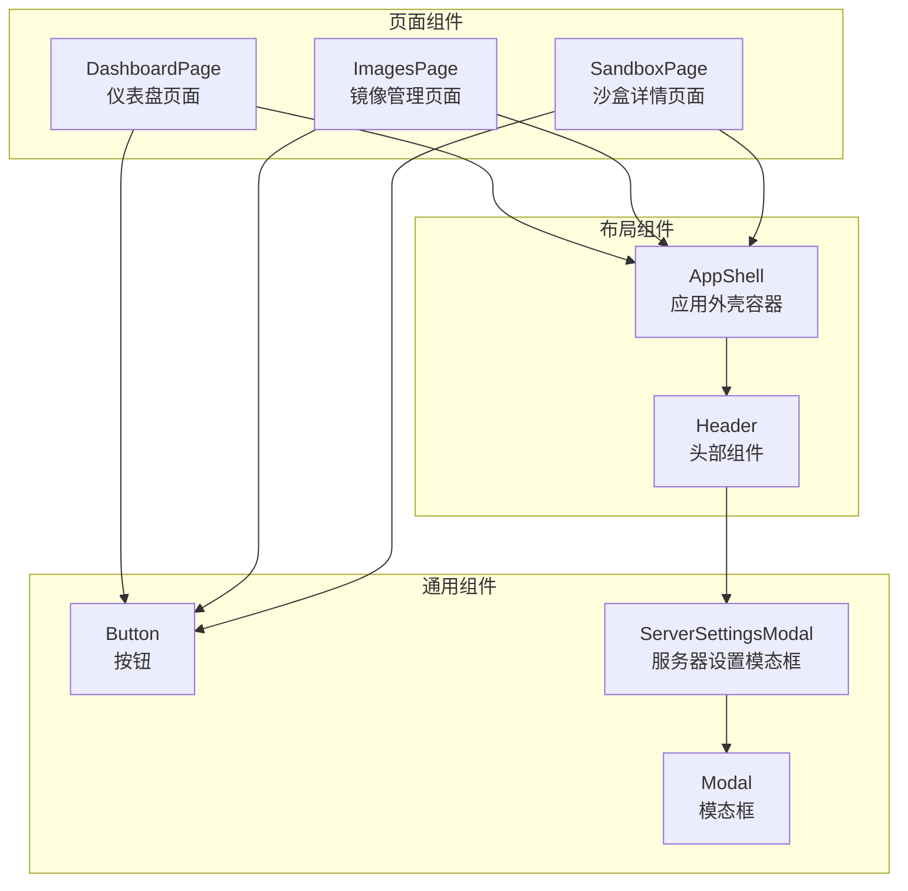
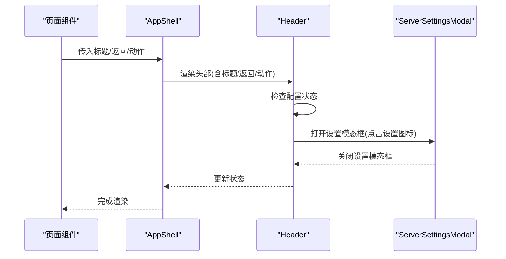
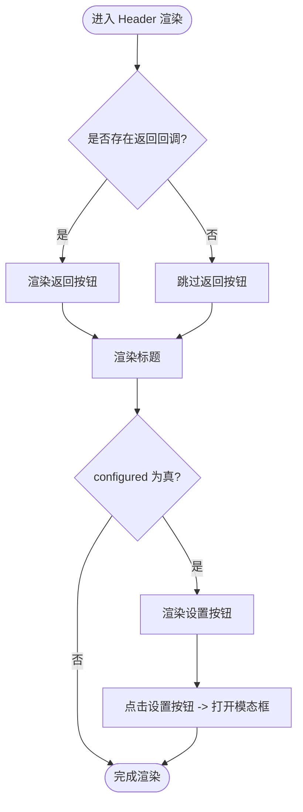
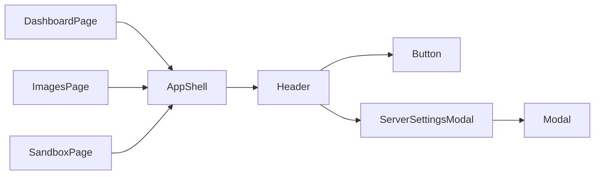

# 布局组件

<cite>
**本文引用的文件**
- [apps/frontend/src/components/layout/AppShell.tsx](file://apps/frontend/src/components/layout/AppShell.tsx)
- [apps/frontend/src/components/layout/Header.tsx](file://apps/frontend/src/components/layout/Header.tsx)
- [apps/frontend/src/components/settings/ServerSettingsModal.tsx](file://apps/frontend/src/components/settings/ServerSettingsModal.tsx)
- [apps/frontend/src/components/common/Button.tsx](file://apps/frontend/src/components/common/Button.tsx)
- [apps/frontend/src/components/common/Modal.tsx](file://apps/frontend/src/components/common/Modal.tsx)
- [apps/frontend/src/pages/DashboardPage.tsx](file://apps/frontend/src/pages/DashboardPage.tsx)
- [apps/frontend/src/pages/ImagesPage.tsx](file://apps/frontend/src/pages/ImagesPage.tsx)
- [apps/frontend/src/pages/SandboxPage.tsx](file://apps/frontend/src/pages/SandboxPage.tsx)
- [apps/frontend/src/App.tsx](file://apps/frontend/src/App.tsx)
- [apps/frontend/src/styles/globals.css](file://apps/frontend/src/styles/globals.css)
- [apps/frontend/tailwind.config.js](file://apps/frontend/tailwind.config.js)
</cite>

## 目录
1. [简介](#简介)
2. [项目结构](#项目结构)
3. [核心组件](#核心组件)
4. [架构总览](#架构总览)
5. [详细组件分析](#详细组件分析)
6. [依赖关系分析](#依赖关系分析)
7. [性能考虑](#性能考虑)
8. [故障排查指南](#故障排查指南)
9. [结论](#结论)
10. [附录](#附录)

## 简介
本设计文档聚焦于 Sandbox Manager 前端的布局组件体系，重点解析 AppShell 应用外壳与 Header 头部组件的整体布局架构。文档将从以下维度展开：
- 整体布局：头部区域、主内容区域与侧边栏的组织方式
- Header 组件：导航功能、标题显示、返回按钮与操作按钮的实现机制
- 响应式设计策略、主题适配与屏幕尺寸兼容性
- 使用示例、自定义配置选项与样式覆盖方法
- 在不同页面中的应用场景与最佳实践

## 项目结构
布局组件位于前端应用的组件层，围绕页面级容器 AppShell 与头部 Header 构建统一的视觉与交互规范，并通过页面组件进行组合使用。

图表来源
- [apps/frontend/src/components/layout/AppShell.tsx:12-19](file://apps/frontend/src/components/layout/AppShell.tsx#L12-L19)
- [apps/frontend/src/components/layout/Header.tsx:11-52](file://apps/frontend/src/components/layout/Header.tsx#L11-L52)
- [apps/frontend/src/pages/DashboardPage.tsx:30-54](file://apps/frontend/src/pages/DashboardPage.tsx#L30-L54)
- [apps/frontend/src/pages/ImagesPage.tsx:23-43](file://apps/frontend/src/pages/ImagesPage.tsx#L23-L43)
- [apps/frontend/src/pages/SandboxPage.tsx:77-164](file://apps/frontend/src/pages/SandboxPage.tsx#L77-L164)
- [apps/frontend/src/components/common/Button.tsx:24-55](file://apps/frontend/src/components/common/Button.tsx#L24-L55)
- [apps/frontend/src/components/common/Modal.tsx:11-43](file://apps/frontend/src/components/common/Modal.tsx#L11-L43)
- [apps/frontend/src/components/settings/ServerSettingsModal.tsx:10-344](file://apps/frontend/src/components/settings/ServerSettingsModal.tsx#L10-L344)

章节来源
- [apps/frontend/src/components/layout/AppShell.tsx:1-20](file://apps/frontend/src/components/layout/AppShell.tsx#L1-L20)
- [apps/frontend/src/components/layout/Header.tsx:1-53](file://apps/frontend/src/components/layout/Header.tsx#L1-L53)
- [apps/frontend/src/pages/DashboardPage.tsx:1-55](file://apps/frontend/src/pages/DashboardPage.tsx#L1-L55)
- [apps/frontend/src/pages/ImagesPage.tsx:1-44](file://apps/frontend/src/pages/ImagesPage.tsx#L1-L44)
- [apps/frontend/src/pages/SandboxPage.tsx:1-165](file://apps/frontend/src/pages/SandboxPage.tsx#L1-L165)

## 核心组件
- AppShell：提供全屏高度布局容器，包含头部与主内容区域，负责整体背景与外层结构。
- Header：承载标题、返回按钮与右侧操作区（如“服务器设置”入口），支持根据配置状态动态展示设置入口。

章节来源
- [apps/frontend/src/components/layout/AppShell.tsx:4-19](file://apps/frontend/src/components/layout/AppShell.tsx#L4-L19)
- [apps/frontend/src/components/layout/Header.tsx:4-52](file://apps/frontend/src/components/layout/Header.tsx#L4-L52)

## 架构总览
AppShell 作为页面级容器，内部固定高度的 Header 与可滚动的主内容区构成基础骨架；Header 内部通过 props 接收标题、返回回调与右侧动作节点；当应用处于已配置状态时，Header 展示服务器设置入口，点击后弹出 ServerSettingsModal。

图表来源
- [apps/frontend/src/components/layout/AppShell.tsx:12-19](file://apps/frontend/src/components/layout/AppShell.tsx#L12-L19)
- [apps/frontend/src/components/layout/Header.tsx:11-52](file://apps/frontend/src/components/layout/Header.tsx#L11-L52)
- [apps/frontend/src/components/settings/ServerSettingsModal.tsx:10-344](file://apps/frontend/src/components/settings/ServerSettingsModal.tsx#L10-L344)

## 详细组件分析

### AppShell 组件
- 职责：提供统一的页面外壳容器，固定头部高度，主内容区自动占满剩余空间。
- 结构：外层容器设定全屏高度与背景色；头部由 Header 组件承担；主内容区通过 flex-1 自动扩展。
- 可配置项：title（标题）、onBack（返回回调）、actions（右侧操作节点）、configured（是否已配置）。

章节来源
- [apps/frontend/src/components/layout/AppShell.tsx:4-19](file://apps/frontend/src/components/layout/AppShell.tsx#L4-L19)

### Header 组件
- 标题显示：默认标题为固定文案，可通过 props 覆盖。
- 返回按钮：当存在 onBack 回调时显示，点击触发返回逻辑。
- 操作按钮：右侧 actions 区域透传给 Header，用于放置业务按钮。
- 配置入口：configured 为真时显示“服务器设置”按钮，点击打开 ServerSettingsModal。

图表来源
- [apps/frontend/src/components/layout/Header.tsx:11-52](file://apps/frontend/src/components/layout/Header.tsx#L11-L52)

章节来源
- [apps/frontend/src/components/layout/Header.tsx:4-52](file://apps/frontend/src/components/layout/Header.tsx#L4-L52)

### ServerSettingsModal 组件
- 功能：集中管理服务端配置（名称、协议、地址、API Key），支持连接测试、切换与删除。
- 表单验证：表单项非空校验，提交与测试过程中的加载状态。
- 错误处理：错误信息展示与重试机制。

章节来源
- [apps/frontend/src/components/settings/ServerSettingsModal.tsx:10-344](file://apps/frontend/src/components/settings/ServerSettingsModal.tsx#L10-L344)

### 页面集成示例
- DashboardPage：展示“镜像”与“创建沙盒”等操作按钮，标题为固定文案。
- ImagesPage：带返回到仪表盘的返回按钮，右侧为“拉取镜像”按钮。
- SandboxPage：根据沙盒状态动态生成标题与操作按钮，包含文件树与终端面板的复杂布局。

章节来源
- [apps/frontend/src/pages/DashboardPage.tsx:30-54](file://apps/frontend/src/pages/DashboardPage.tsx#L30-L54)
- [apps/frontend/src/pages/ImagesPage.tsx:23-43](file://apps/frontend/src/pages/ImagesPage.tsx#L23-L43)
- [apps/frontend/src/pages/SandboxPage.tsx:77-164](file://apps/frontend/src/pages/SandboxPage.tsx#L77-L164)

## 依赖关系分析
- AppShell 依赖 Header。
- Header 依赖 Button 与 ServerSettingsModal。
- 页面组件依赖 AppShell 与 Button。
- ServerSettingsModal 依赖 Modal。

图表来源
- [apps/frontend/src/components/layout/AppShell.tsx:1-20](file://apps/frontend/src/components/layout/AppShell.tsx#L1-L20)
- [apps/frontend/src/components/layout/Header.tsx:1-53](file://apps/frontend/src/components/layout/Header.tsx#L1-L53)
- [apps/frontend/src/components/common/Button.tsx:1-56](file://apps/frontend/src/components/common/Button.tsx#L1-L56)
- [apps/frontend/src/components/common/Modal.tsx:1-44](file://apps/frontend/src/components/common/Modal.tsx#L1-L44)
- [apps/frontend/src/components/settings/ServerSettingsModal.tsx:1-345](file://apps/frontend/src/components/settings/ServerSettingsModal.tsx#L1-L345)
- [apps/frontend/src/pages/DashboardPage.tsx:1-55](file://apps/frontend/src/pages/DashboardPage.tsx#L1-L55)
- [apps/frontend/src/pages/ImagesPage.tsx:1-44](file://apps/frontend/src/pages/ImagesPage.tsx#L1-L44)
- [apps/frontend/src/pages/SandboxPage.tsx:1-165](file://apps/frontend/src/pages/SandboxPage.tsx#L1-L165)

章节来源
- [apps/frontend/src/components/layout/AppShell.tsx:1-20](file://apps/frontend/src/components/layout/AppShell.tsx#L1-L20)
- [apps/frontend/src/components/layout/Header.tsx:1-53](file://apps/frontend/src/components/layout/Header.tsx#L1-L53)
- [apps/frontend/src/components/common/Button.tsx:1-56](file://apps/frontend/src/components/common/Button.tsx#L1-L56)
- [apps/frontend/src/components/common/Modal.tsx:1-44](file://apps/frontend/src/components/common/Modal.tsx#L1-L44)
- [apps/frontend/src/components/settings/ServerSettingsModal.tsx:1-345](file://apps/frontend/src/components/settings/ServerSettingsModal.tsx#L1-L345)
- [apps/frontend/src/pages/DashboardPage.tsx:1-55](file://apps/frontend/src/pages/DashboardPage.tsx#L1-L55)
- [apps/frontend/src/pages/ImagesPage.tsx:1-44](file://apps/frontend/src/pages/ImagesPage.tsx#L1-L44)
- [apps/frontend/src/pages/SandboxPage.tsx:1-165](file://apps/frontend/src/pages/SandboxPage.tsx#L1-L165)

## 性能考虑
- 布局层级扁平：AppShell 仅包含 Header 与主内容区，避免深层嵌套带来的重排成本。
- 主内容区滚动：通过 flex-1 与 overflow 控制滚动边界，减少不必要的滚动容器。
- 模态框按需渲染：ServerSettingsModal 仅在需要时打开，降低 DOM 占用。
- 图标与按钮采用轻量 SVG 与 Tailwind 工具类，避免额外资源加载。

## 故障排查指南
- 设置入口不显示
  - 检查 AppShell 的 configured 参数是否为真。
  - 确认 Header 的 configured 透传正确。
- 设置模态框无法关闭
  - 确认 onClose 回调是否正确传递至 ServerSettingsModal。
  - 检查 Modal 的 ESC 关闭事件绑定。
- 返回按钮无效
  - 确认 onBack 回调是否传入且有效。
  - 检查路由或导航逻辑是否正确执行。
- 样式异常
  - 检查 Tailwind 配置与全局样式是否生效。
  - 确认未被上层容器覆盖关键样式（如高度、滚动）。

章节来源
- [apps/frontend/src/components/layout/Header.tsx:11-52](file://apps/frontend/src/components/layout/Header.tsx#L11-L52)
- [apps/frontend/src/components/settings/ServerSettingsModal.tsx:10-344](file://apps/frontend/src/components/settings/ServerSettingsModal.tsx#L10-L344)
- [apps/frontend/src/components/common/Modal.tsx:11-43](file://apps/frontend/src/components/common/Modal.tsx#L11-L43)
- [apps/frontend/src/styles/globals.css:1-23](file://apps/frontend/src/styles/globals.css#L1-L23)
- [apps/frontend/tailwind.config.js:1-9](file://apps/frontend/tailwind.config.js#L1-L9)

## 结论
AppShell 与 Header 共同构建了简洁一致的页面骨架，配合页面组件与通用组件形成清晰的职责分层。通过 props 透传与模态框联动，实现了可配置、可扩展的布局体系。建议在新增页面时遵循现有模式，确保一致的用户体验与维护性。

## 附录

### 响应式设计策略与主题适配
- 响应式策略
  - 使用 Tailwind 的断点工具类（如 md、lg）在列表与布局中实现多列自适应。
  - 页面内容区通过最大宽度与居中容器控制在大屏下的阅读体验。
- 主题适配
  - 全局样式统一字体、文本颜色与滚动条样式，保证一致的主题风格。
  - 按钮与模态框等通用组件提供变体与尺寸，便于在不同场景下复用。

章节来源
- [apps/frontend/src/pages/DashboardPage.tsx:44-46](file://apps/frontend/src/pages/DashboardPage.tsx#L44-L46)
- [apps/frontend/src/pages/ImagesPage.tsx:33-35](file://apps/frontend/src/pages/ImagesPage.tsx#L33-L35)
- [apps/frontend/src/styles/globals.css:1-23](file://apps/frontend/src/styles/globals.css#L1-L23)
- [apps/frontend/tailwind.config.js:1-9](file://apps/frontend/tailwind.config.js#L1-L9)

### 使用示例与最佳实践
- 在页面中引入 AppShell 并传入必要参数
  - 示例路径：[DashboardPage 使用 AppShell:30-54](file://apps/frontend/src/pages/DashboardPage.tsx#L30-L54)
  - 示例路径：[ImagesPage 使用 AppShell:23-43](file://apps/frontend/src/pages/ImagesPage.tsx#L23-L43)
  - 示例路径：[SandboxPage 使用 AppShell:77-164](file://apps/frontend/src/pages/SandboxPage.tsx#L77-L164)
- 自定义配置选项
  - 标题：通过 title 覆盖默认文案
  - 返回：通过 onBack 提供返回逻辑
  - 操作区：通过 actions 注入业务按钮
  - 配置入口：通过 configured 控制设置入口显隐
- 样式覆盖方法
  - 使用 Tailwind 工具类对容器与元素进行样式定制
  - 全局样式通过 [globals.css:1-23](file://apps/frontend/src/styles/globals.css#L1-L23) 进行统一调整
  - 组件样式优先使用变体与尺寸属性，避免内联样式的过度耦合

章节来源
- [apps/frontend/src/pages/DashboardPage.tsx:30-54](file://apps/frontend/src/pages/DashboardPage.tsx#L30-L54)
- [apps/frontend/src/pages/ImagesPage.tsx:23-43](file://apps/frontend/src/pages/ImagesPage.tsx#L23-L43)
- [apps/frontend/src/pages/SandboxPage.tsx:77-164](file://apps/frontend/src/pages/SandboxPage.tsx#L77-L164)
- [apps/frontend/src/styles/globals.css:1-23](file://apps/frontend/src/styles/globals.css#L1-L23)
- [apps/frontend/src/components/common/Button.tsx:11-22](file://apps/frontend/src/components/common/Button.tsx#L11-L22)