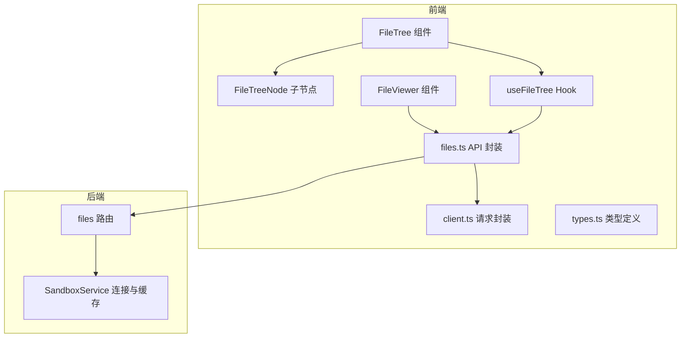
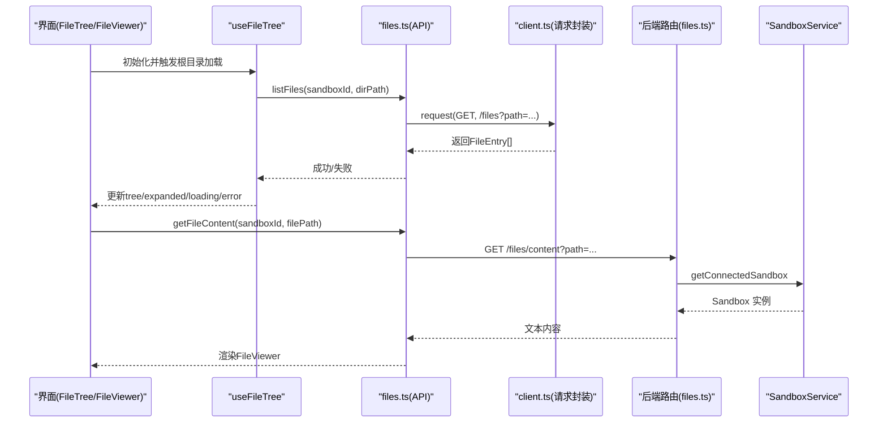
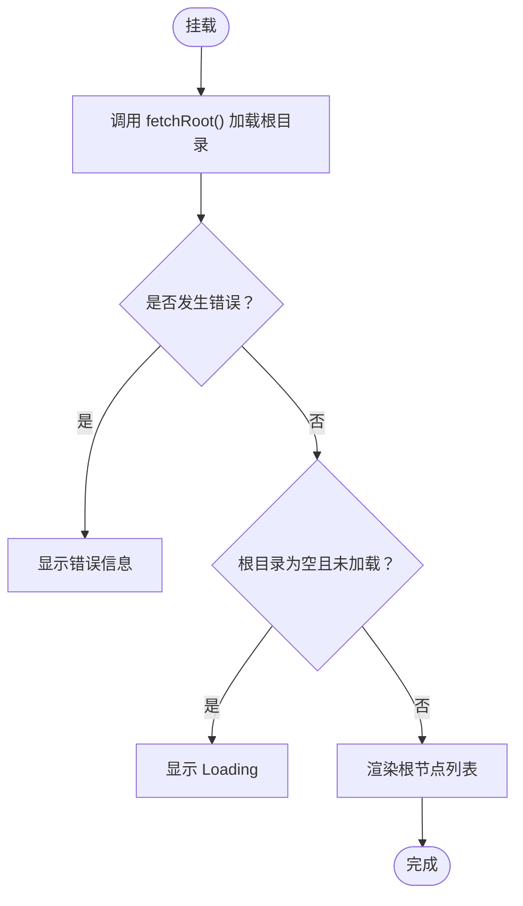
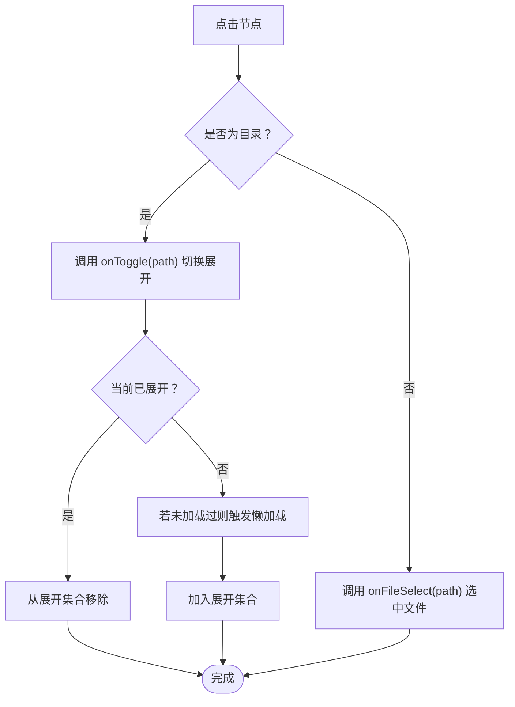
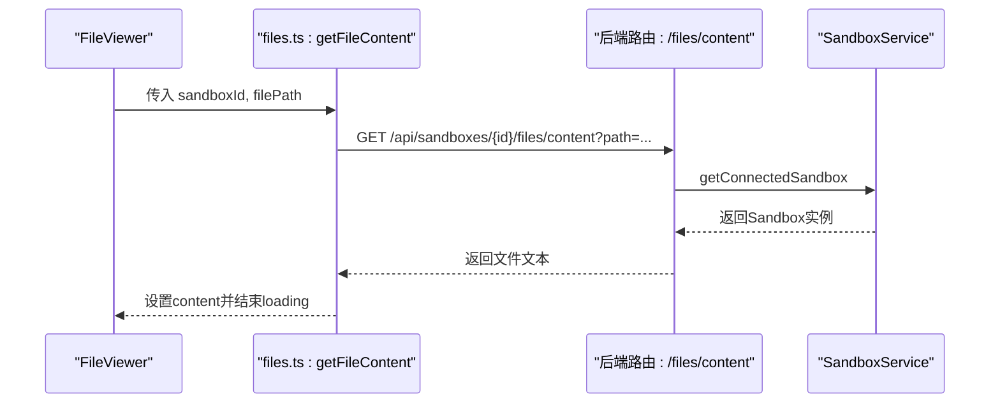
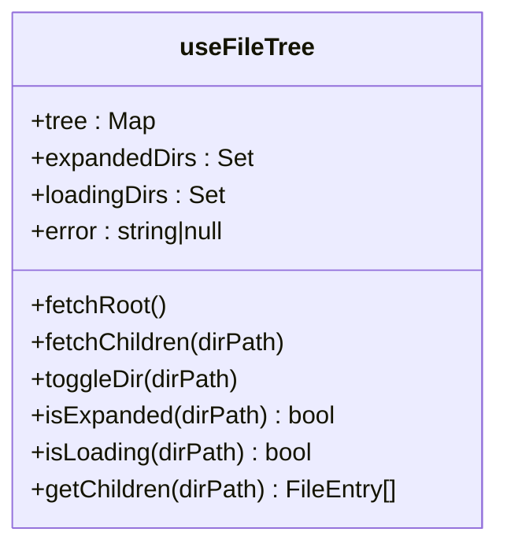
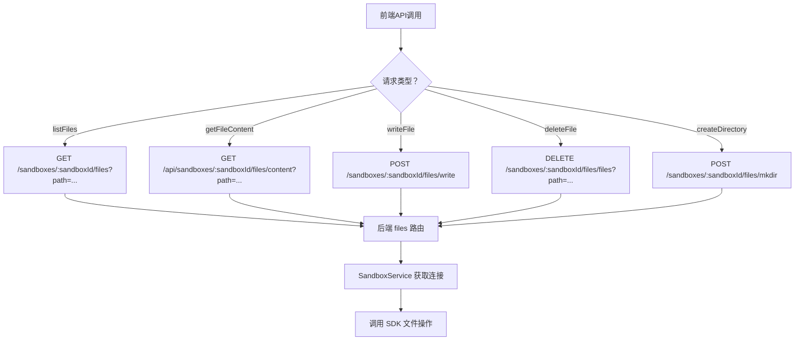
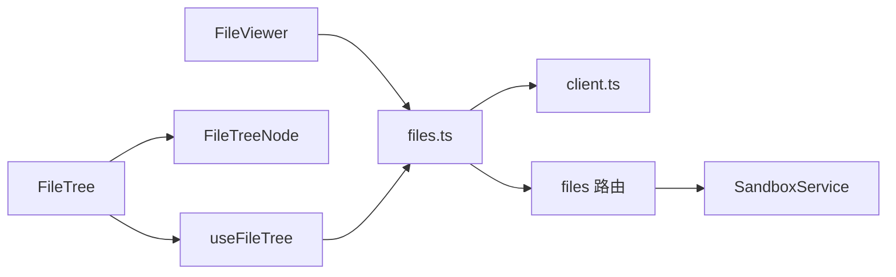

# 文件操作组件

<cite>
**本文引用的文件**
- [apps/frontend/src/components/files/FileTree.tsx](file://apps/frontend/src/components/files/FileTree.tsx)
- [apps/frontend/src/components/files/FileTreeNode.tsx](file://apps/frontend/src/components/files/FileTreeNode.tsx)
- [apps/frontend/src/components/files/FileViewer.tsx](file://apps/frontend/src/components/files/FileViewer.tsx)
- [apps/frontend/src/hooks/useFileTree.ts](file://apps/frontend/src/hooks/useFileTree.ts)
- [apps/frontend/src/api/files.ts](file://apps/frontend/src/api/files.ts)
- [apps/frontend/src/api/types.ts](file://apps/frontend/src/api/types.ts)
- [apps/frontend/src/api/client.ts](file://apps/frontend/src/api/client.ts)
- [apps/backend/src/routes/files.ts](file://apps/backend/src/routes/files.ts)
- [apps/backend/src/services/sandboxService.ts](file://apps/backend/src/services/sandboxService.ts)
</cite>

## 目录
1. [简介](#简介)
2. [项目结构](#项目结构)
3. [核心组件](#核心组件)
4. [架构总览](#架构总览)
5. [详细组件分析](#详细组件分析)
6. [依赖关系分析](#依赖关系分析)
7. [性能与缓存策略](#性能与缓存策略)
8. [故障排查指南](#故障排查指南)
9. [结论](#结论)
10. [附录：使用示例与配置](#附录使用示例与配置)

## 简介
本文件面向Sandbox Manager的“文件操作组件”，聚焦以下能力：
- 文件树展示：FileTree与FileTreeNode负责目录递归渲染、节点展开/折叠、懒加载子项。
- 文件内容查看：FileViewer负责按路径读取文本内容并渲染。
- 文件系统操作：前端通过API模块调用后端路由，实现文件读取、写入、删除、创建目录、移动/重命名、下载等。
- 异步与错误处理：统一的请求封装与错误类型化抛出，避免阻塞UI。
- 性能与可扩展性：基于useFileTree的内存态管理、懒加载与失败重试标记；后端LRU缓存连接实例。

## 项目结构
文件操作组件位于前端组件与API层，并由后端路由与服务层承接具体文件系统操作。

**图表来源**
- [apps/frontend/src/components/files/FileTree.tsx:1-55](file://apps/frontend/src/components/files/FileTree.tsx#L1-L55)
- [apps/frontend/src/components/files/FileTreeNode.tsx:1-89](file://apps/frontend/src/components/files/FileTreeNode.tsx#L1-L89)
- [apps/frontend/src/components/files/FileViewer.tsx:1-68](file://apps/frontend/src/components/files/FileViewer.tsx#L1-L68)
- [apps/frontend/src/hooks/useFileTree.ts:1-62](file://apps/frontend/src/hooks/useFileTree.ts#L1-L62)
- [apps/frontend/src/api/files.ts:1-32](file://apps/frontend/src/api/files.ts#L1-L32)
- [apps/frontend/src/api/client.ts:1-45](file://apps/frontend/src/api/client.ts#L1-L45)
- [apps/backend/src/routes/files.ts:1-327](file://apps/backend/src/routes/files.ts#L1-L327)
- [apps/backend/src/services/sandboxService.ts:1-148](file://apps/backend/src/services/sandboxService.ts#L1-L148)

**章节来源**
- [apps/frontend/src/components/files/FileTree.tsx:1-55](file://apps/frontend/src/components/files/FileTree.tsx#L1-L55)
- [apps/frontend/src/components/files/FileTreeNode.tsx:1-89](file://apps/frontend/src/components/files/FileTreeNode.tsx#L1-L89)
- [apps/frontend/src/components/files/FileViewer.tsx:1-68](file://apps/frontend/src/components/files/FileViewer.tsx#L1-L68)
- [apps/frontend/src/hooks/useFileTree.ts:1-62](file://apps/frontend/src/hooks/useFileTree.ts#L1-L62)
- [apps/frontend/src/api/files.ts:1-32](file://apps/frontend/src/api/files.ts#L1-L32)
- [apps/frontend/src/api/client.ts:1-45](file://apps/frontend/src/api/client.ts#L1-L45)
- [apps/backend/src/routes/files.ts:1-327](file://apps/backend/src/routes/files.ts#L1-L327)
- [apps/backend/src/services/sandboxService.ts:1-148](file://apps/backend/src/services/sandboxService.ts#L1-L148)

## 核心组件
- FileTree：负责根目录加载、错误提示、空状态、以及将根节点交给FileTreeNode渲染。
- FileTreeNode：单个节点渲染，区分目录/文件图标、深度缩进、展开指示、点击行为（目录切换、文件选择）。
- FileViewer：根据选中文件路径异步拉取内容并渲染，支持加载中、错误、无文件选择三种状态。
- useFileTree：集中管理树结构Map、展开集合、加载中集合、失败集合，提供懒加载子节点、切换展开、查询状态等能力。
- API层：listFiles、getFileContent、writeFile、deleteFile、createDirectory等，统一通过client封装的request或原生fetch。
- 后端路由：filesRouter提供列表、读取文本、下载二进制、写入、创建目录、移动/重命名、删除文件/目录等接口。
- 后端服务：SandboxService对Sandbox实例做LRU缓存，提升连接复用与性能。

**章节来源**
- [apps/frontend/src/components/files/FileTree.tsx:1-55](file://apps/frontend/src/components/files/FileTree.tsx#L1-L55)
- [apps/frontend/src/components/files/FileTreeNode.tsx:1-89](file://apps/frontend/src/components/files/FileTreeNode.tsx#L1-L89)
- [apps/frontend/src/components/files/FileViewer.tsx:1-68](file://apps/frontend/src/components/files/FileViewer.tsx#L1-L68)
- [apps/frontend/src/hooks/useFileTree.ts:1-62](file://apps/frontend/src/hooks/useFileTree.ts#L1-L62)
- [apps/frontend/src/api/files.ts:1-32](file://apps/frontend/src/api/files.ts#L1-L32)
- [apps/frontend/src/api/client.ts:1-45](file://apps/frontend/src/api/client.ts#L1-L45)
- [apps/backend/src/routes/files.ts:1-327](file://apps/backend/src/routes/files.ts#L1-L327)
- [apps/backend/src/services/sandboxService.ts:1-148](file://apps/backend/src/services/sandboxService.ts#L1-L148)

## 架构总览
从前端到后端的数据流与职责划分如下：

**图表来源**
- [apps/frontend/src/hooks/useFileTree.ts:1-62](file://apps/frontend/src/hooks/useFileTree.ts#L1-L62)
- [apps/frontend/src/api/files.ts:1-32](file://apps/frontend/src/api/files.ts#L1-L32)
- [apps/frontend/src/api/client.ts:1-45](file://apps/frontend/src/api/client.ts#L1-L45)
- [apps/backend/src/routes/files.ts:1-327](file://apps/backend/src/routes/files.ts#L1-L327)
- [apps/backend/src/services/sandboxService.ts:1-148](file://apps/backend/src/services/sandboxService.ts#L1-L148)

## 详细组件分析

### FileTree 组件
- 负责：
  - 首次挂载时拉取根目录。
  - 错误状态显示与空状态提示。
  - 将根节点交由FileTreeNode进行递归渲染。
- 关键点：
  - 使用useFileTree提供的状态与方法：fetchRoot、isExpanded、isLoading、getChildren、toggleDir、tree、error。
  - 对于根目录不存在且未加载的情况，显示“Loading...”。

**图表来源**
- [apps/frontend/src/components/files/FileTree.tsx:1-55](file://apps/frontend/src/components/files/FileTree.tsx#L1-L55)
- [apps/frontend/src/hooks/useFileTree.ts:1-62](file://apps/frontend/src/hooks/useFileTree.ts#L1-L62)

**章节来源**
- [apps/frontend/src/components/files/FileTree.tsx:1-55](file://apps/frontend/src/components/files/FileTree.tsx#L1-L55)
- [apps/frontend/src/hooks/useFileTree.ts:1-62](file://apps/frontend/src/hooks/useFileTree.ts#L1-L62)

### FileTreeNode 组件
- 负责：
  - 单节点渲染：目录/文件图标、名称、深度缩进。
  - 展开/收起：目录点击切换展开状态；已展开则渲染子节点。
  - 加载指示：正在加载子项时显示旋转指示器。
- 交互逻辑：
  - 目录：触发toggleDir；文件：触发onFileSelect。
  - 子节点递归渲染，深度+1。

**图表来源**
- [apps/frontend/src/components/files/FileTreeNode.tsx:1-89](file://apps/frontend/src/components/files/FileTreeNode.tsx#L1-L89)
- [apps/frontend/src/hooks/useFileTree.ts:1-62](file://apps/frontend/src/hooks/useFileTree.ts#L1-L62)

**章节来源**
- [apps/frontend/src/components/files/FileTreeNode.tsx:1-89](file://apps/frontend/src/components/files/FileTreeNode.tsx#L1-L89)
- [apps/frontend/src/hooks/useFileTree.ts:1-62](file://apps/frontend/src/hooks/useFileTree.ts#L1-L62)

### FileViewer 组件
- 负责：
  - 接收sandboxId与filePath，异步读取文件内容。
  - 渲染文件路径标题与内容区域。
  - 处理“未选择文件”、“加载中”、“错误”三种状态。
- 数据来源：
  - 通过getFileContent(sandboxId, filePath)调用API层，最终由后端路由/files/content返回纯文本。

**图表来源**
- [apps/frontend/src/components/files/FileViewer.tsx:1-68](file://apps/frontend/src/components/files/FileViewer.tsx#L1-L68)
- [apps/frontend/src/api/files.ts:1-32](file://apps/frontend/src/api/files.ts#L1-L32)
- [apps/backend/src/routes/files.ts:46-69](file://apps/backend/src/routes/files.ts#L46-L69)
- [apps/backend/src/services/sandboxService.ts:112-123](file://apps/backend/src/services/sandboxService.ts#L112-L123)

**章节来源**
- [apps/frontend/src/components/files/FileViewer.tsx:1-68](file://apps/frontend/src/components/files/FileViewer.tsx#L1-L68)
- [apps/frontend/src/api/files.ts:1-32](file://apps/frontend/src/api/files.ts#L1-L32)
- [apps/backend/src/routes/files.ts:46-69](file://apps/backend/src/routes/files.ts#L46-L69)
- [apps/backend/src/services/sandboxService.ts:112-123](file://apps/backend/src/services/sandboxService.ts#L112-L123)

### useFileTree Hook
- 状态管理：
  - tree：Map<目录路径, FileEntry[]>，缓存已加载的子项。
  - expandedDirs：Set<目录路径>，记录展开状态。
  - loadingDirs：Set<目录路径>，记录正在加载的目录。
  - error：最近一次错误信息。
  - failedDirs：Ref<Set>，记录加载失败的目录，避免重复尝试。
- 方法：
  - fetchRoot：清理失败标记并加载根目录“/”。
  - fetchChildren：防抖重复加载，成功设置tree并清空错误，失败记录失败目录并设置错误。
  - toggleDir：切换展开状态；若首次展开且未加载，则触发懒加载。
  - isExpanded/isLoading/getChildren：查询状态与子项。

**图表来源**
- [apps/frontend/src/hooks/useFileTree.ts:1-62](file://apps/frontend/src/hooks/useFileTree.ts#L1-L62)

**章节来源**
- [apps/frontend/src/hooks/useFileTree.ts:1-62](file://apps/frontend/src/hooks/useFileTree.ts#L1-L62)

### API 层与后端路由
- 前端API：
  - listFiles：获取目录子项。
  - getFileContent：获取文件文本内容。
  - writeFile/deleteFile/createDirectory：写入、删除、创建目录。
- 后端路由：
  - GET /：列出目录子项，优先使用SDK search API，回退到ls+stat。
  - GET /content：读取文件文本。
  - GET /download：下载二进制内容。
  - POST /write：写入文件。
  - POST /mkdir：创建目录。
  - POST /move：移动/重命名。
  - DELETE /files、DELETE /directories：删除文件/目录。
- 错误处理：
  - 缺少参数、路径为目录等情况返回明确错误码与消息。
- 安全与权限：
  - 所有操作均在指定sandbox上下文中执行，路径校验防止越权访问。

**图表来源**
- [apps/frontend/src/api/files.ts:1-32](file://apps/frontend/src/api/files.ts#L1-L32)
- [apps/backend/src/routes/files.ts:1-327](file://apps/backend/src/routes/files.ts#L1-L327)
- [apps/backend/src/services/sandboxService.ts:112-123](file://apps/backend/src/services/sandboxService.ts#L112-L123)

**章节来源**
- [apps/frontend/src/api/files.ts:1-32](file://apps/frontend/src/api/files.ts#L1-L32)
- [apps/backend/src/routes/files.ts:1-327](file://apps/backend/src/routes/files.ts#L1-L327)
- [apps/backend/src/services/sandboxService.ts:112-123](file://apps/backend/src/services/sandboxService.ts#L112-L123)

## 依赖关系分析
- 组件依赖：
  - FileTree依赖useFileTree与FileTreeNode。
  - FileViewer依赖files.ts API。
- Hook与API：
  - useFileTree内部调用listFiles，files.ts封装了listFiles与getFileContent等。
- API与后端：
  - files.ts通过client.ts封装的request或原生fetch调用后端。
- 后端：
  - files路由依赖SandboxService获取Sandbox实例，再调用SDK文件操作。

**图表来源**
- [apps/frontend/src/components/files/FileTree.tsx:1-55](file://apps/frontend/src/components/files/FileTree.tsx#L1-L55)
- [apps/frontend/src/components/files/FileTreeNode.tsx:1-89](file://apps/frontend/src/components/files/FileTreeNode.tsx#L1-L89)
- [apps/frontend/src/components/files/FileViewer.tsx:1-68](file://apps/frontend/src/components/files/FileViewer.tsx#L1-L68)
- [apps/frontend/src/hooks/useFileTree.ts:1-62](file://apps/frontend/src/hooks/useFileTree.ts#L1-L62)
- [apps/frontend/src/api/files.ts:1-32](file://apps/frontend/src/api/files.ts#L1-L32)
- [apps/frontend/src/api/client.ts:1-45](file://apps/frontend/src/api/client.ts#L1-L45)
- [apps/backend/src/routes/files.ts:1-327](file://apps/backend/src/routes/files.ts#L1-L327)
- [apps/backend/src/services/sandboxService.ts:1-148](file://apps/backend/src/services/sandboxService.ts#L1-L148)

**章节来源**
- [apps/frontend/src/components/files/FileTree.tsx:1-55](file://apps/frontend/src/components/files/FileTree.tsx#L1-L55)
- [apps/frontend/src/components/files/FileTreeNode.tsx:1-89](file://apps/frontend/src/components/files/FileTreeNode.tsx#L1-L89)
- [apps/frontend/src/components/files/FileViewer.tsx:1-68](file://apps/frontend/src/components/files/FileViewer.tsx#L1-L68)
- [apps/frontend/src/hooks/useFileTree.ts:1-62](file://apps/frontend/src/hooks/useFileTree.ts#L1-L62)
- [apps/frontend/src/api/files.ts:1-32](file://apps/frontend/src/api/files.ts#L1-L32)
- [apps/frontend/src/api/client.ts:1-45](file://apps/frontend/src/api/client.ts#L1-L45)
- [apps/backend/src/routes/files.ts:1-327](file://apps/backend/src/routes/files.ts#L1-L327)
- [apps/backend/src/services/sandboxService.ts:1-148](file://apps/backend/src/services/sandboxService.ts#L1-L148)

## 性能与缓存策略
- 前端：
  - 懒加载：仅在节点展开且未加载时才请求子项，减少初始负载。
  - 内存缓存：useFileTree以Map缓存目录子项，避免重复请求。
  - 防抖：loadingDirs与failedDirs避免重复请求与失败风暴。
- 后端：
  - Sandbox实例LRU缓存：SandboxService维护LRU缓存，降低连接建立成本，超时自动回收。
  - 目录枚举回退：优先使用SDK search API，失败时回退ls+stat，兼顾性能与兼容性。
- 大文件支持：
  - 提供二进制下载接口，适合大文件场景；文本内容接口用于小/中等文件的快速预览。
- 编码与类型：
  - 文本读取返回纯文本；二进制下载返回octet-stream。
  - 类型定义集中在types.ts，确保前后端一致。

**章节来源**
- [apps/frontend/src/hooks/useFileTree.ts:1-62](file://apps/frontend/src/hooks/useFileTree.ts#L1-L62)
- [apps/backend/src/services/sandboxService.ts:17-47](file://apps/backend/src/services/sandboxService.ts#L17-L47)
- [apps/backend/src/routes/files.ts:213-313](file://apps/backend/src/routes/files.ts#L213-L313)
- [apps/frontend/src/api/types.ts:27-33](file://apps/frontend/src/api/types.ts#L27-L33)

## 故障排查指南
- 常见错误与定位：
  - 缺少必要参数：如缺失path、缺少entries数组等，后端会返回明确错误码与消息。
  - 路径为目录：读取内容时若路径为目录，后端拒绝并返回错误。
  - 请求失败：前端client.ts会将非200响应与success=false的响应抛出ApiError，包含code与message。
- 建议排查步骤：
  - 检查sandboxId与路径合法性。
  - 查看前端错误提示与网络面板响应。
  - 确认后端路由是否正确转发至SandboxService。
- 可用的错误类型：
  - ApiError：包含code、message、statusCode，便于UI友好提示与日志追踪。

**章节来源**
- [apps/frontend/src/api/client.ts:5-14](file://apps/frontend/src/api/client.ts#L5-L14)
- [apps/backend/src/routes/files.ts:53-62](file://apps/backend/src/routes/files.ts#L53-L62)
- [apps/frontend/src/api/files.ts:8-14](file://apps/frontend/src/api/files.ts#L8-L14)

## 结论
文件操作组件通过清晰的分层设计实现了：
- 目录树的高效懒加载与展开控制；
- 文件内容的快速渲染与错误处理；
- 与后端路由及Sandbox SDK的稳定对接；
- 前后端的缓存与回退策略，兼顾性能与可靠性。
后续可在以下方面进一步增强：
- FileViewer增加语法高亮与编辑模式（需引入编辑器库与保存流程）；
- 支持文件上传与批量操作；
- 增强文件类型识别与大文件断点续传能力。

## 附录：使用示例与配置
- 使用示例（概念性说明）：
  - 在页面中渲染FileTree并绑定onFileSelect回调，当用户选择文件时传入FileViewer的filePath。
  - FileViewer会在filePath变化时自动发起请求并渲染内容。
- 配置选项（概念性说明）：
  - sandboxId：目标沙箱标识。
  - 路径参数：listFiles与getFileContent均依赖path查询参数。
  - 写入参数：writeFile需要path与content，可选mode。
  - 删除参数：deleteFile需要path查询参数。
  - 创建目录：createDirectory需要paths数组，可选mode。
- 扩展建议（概念性说明）：
  - 为FileViewer增加编辑模式：调用writeFile保存；增加撤销/重做；集成语法高亮库。
  - 增加拖拽上传：结合后端SDK的写入能力与进度反馈。
  - 文件类型识别：根据扩展名或MIME类型决定渲染方式（文本/图片/二进制）。
  - 大文件支持：采用分块上传与断点续传，结合后端SDK的多块写入能力。