# 沙盒管理组件

<cite>
**本文档引用的文件**
- [SandboxList.tsx](file://apps/frontend/src/components/sandbox/SandboxList.tsx)
- [CreateSandbox.tsx](file://apps/frontend/src/components/sandbox/CreateSandbox.tsx)
- [SandboxCard.tsx](file://apps/frontend/src/components/sandbox/SandboxCard.tsx)
- [sandboxStore.ts](file://apps/frontend/src/stores/sandboxStore.ts)
- [useSandbox.ts](file://apps/frontend/src/hooks/useSandbox.ts)
- [types.ts](file://apps/frontend/src/api/types.ts)
- [sandboxes.ts](file://apps/frontend/src/api/sandboxes.ts)
- [SandboxPage.tsx](file://apps/frontend/src/pages/SandboxPage.tsx)
- [sandboxService.ts](file://apps/backend/src/services/sandboxService.ts)
- [StatusBadge.tsx](file://apps/frontend/src/components/common/StatusBadge.tsx)
- [Button.tsx](file://apps/frontend/src/components/common/Button.tsx)
- [utils.ts](file://apps/frontend/src/lib/utils.ts)
</cite>

## 目录
1. [简介](#简介)
2. [项目结构](#项目结构)
3. [核心组件](#核心组件)
4. [架构概览](#架构概览)
5. [详细组件分析](#详细组件分析)
6. [依赖关系分析](#依赖关系分析)
7. [性能考虑](#性能考虑)
8. [故障排除指南](#故障排除指南)
9. [结论](#结论)

## 简介

Sandbox Manager 是一个基于 OpenSandbox 平台构建的沙盒管理系统，提供了完整的沙盒生命周期管理功能。本文档专注于沙盒管理组件的设计与实现，包括沙盒列表展示、沙盒创建、沙盒卡片显示等核心功能模块。

该系统采用前后端分离架构，前端使用 React + TypeScript 构建，后端基于 Node.js 和 OpenSandbox SDK 实现。组件间通过清晰的接口进行通信，实现了良好的可维护性和扩展性。

## 项目结构

沙盒管理组件位于前端应用的组件目录中，主要包含以下文件：

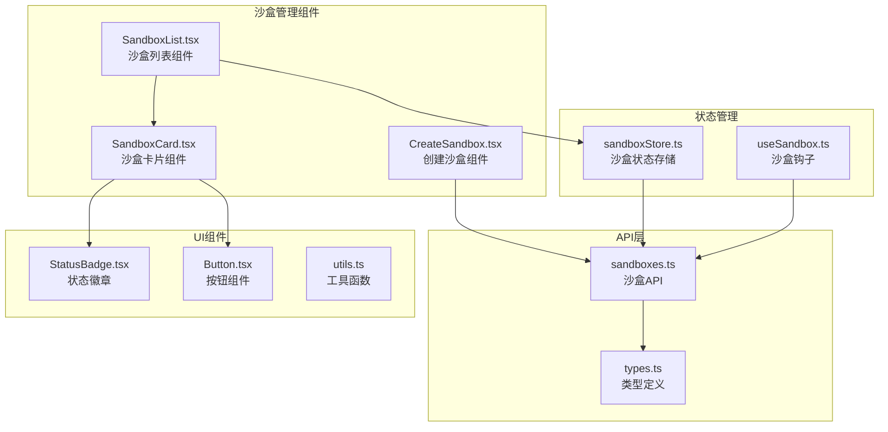

**图表来源**
- [SandboxList.tsx:1-53](file://apps/frontend/src/components/sandbox/SandboxList.tsx#L1-L53)
- [CreateSandbox.tsx:1-180](file://apps/frontend/src/components/sandbox/CreateSandbox.tsx#L1-L180)
- [SandboxCard.tsx:1-67](file://apps/frontend/src/components/sandbox/SandboxCard.tsx#L1-L67)

**章节来源**
- [SandboxList.tsx:1-53](file://apps/frontend/src/components/sandbox/SandboxList.tsx#L1-L53)
- [CreateSandbox.tsx:1-180](file://apps/frontend/src/components/sandbox/CreateSandbox.tsx#L1-L180)
- [SandboxCard.tsx:1-67](file://apps/frontend/src/components/sandbox/SandboxCard.tsx#L1-L67)

## 核心组件

### 沙盒状态存储 (Zustand Store)

沙盒状态管理采用 Zustand 库实现，提供了集中式的状态管理机制：

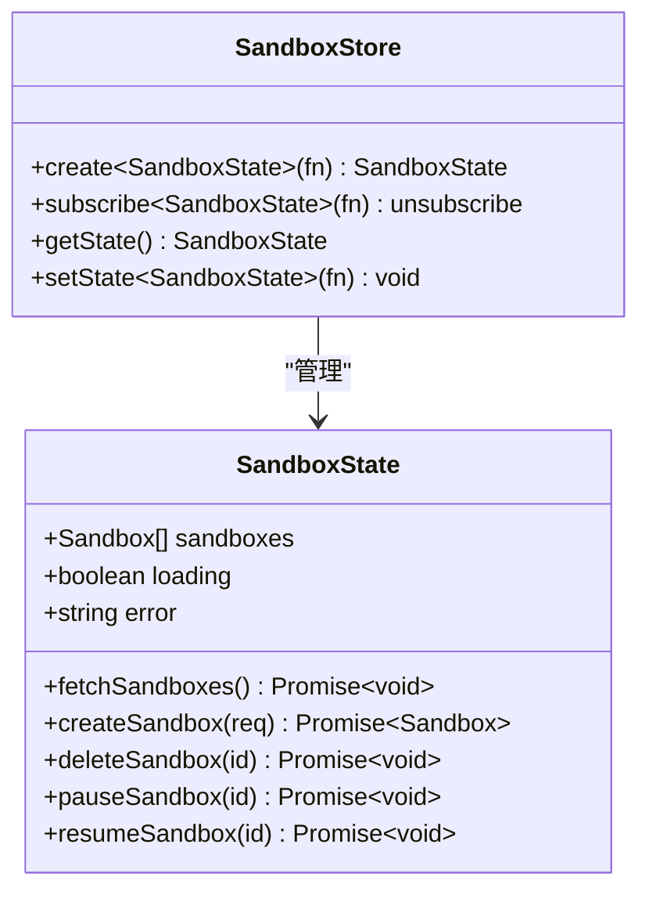

**图表来源**
- [sandboxStore.ts:16-62](file://apps/frontend/src/stores/sandboxStore.ts#L16-L62)

### 沙盒数据模型

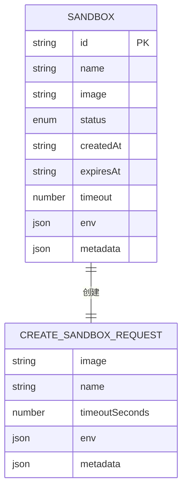

**图表来源**
- [types.ts:1-17](file://apps/frontend/src/api/types.ts#L1-L17)
- [types.ts:19-25](file://apps/frontend/src/api/types.ts#L19-L25)

**章节来源**
- [sandboxStore.ts:1-63](file://apps/frontend/src/stores/sandboxStore.ts#L1-L63)
- [types.ts:1-146](file://apps/frontend/src/api/types.ts#L1-L146)

## 架构概览

系统采用分层架构设计，各层职责明确：

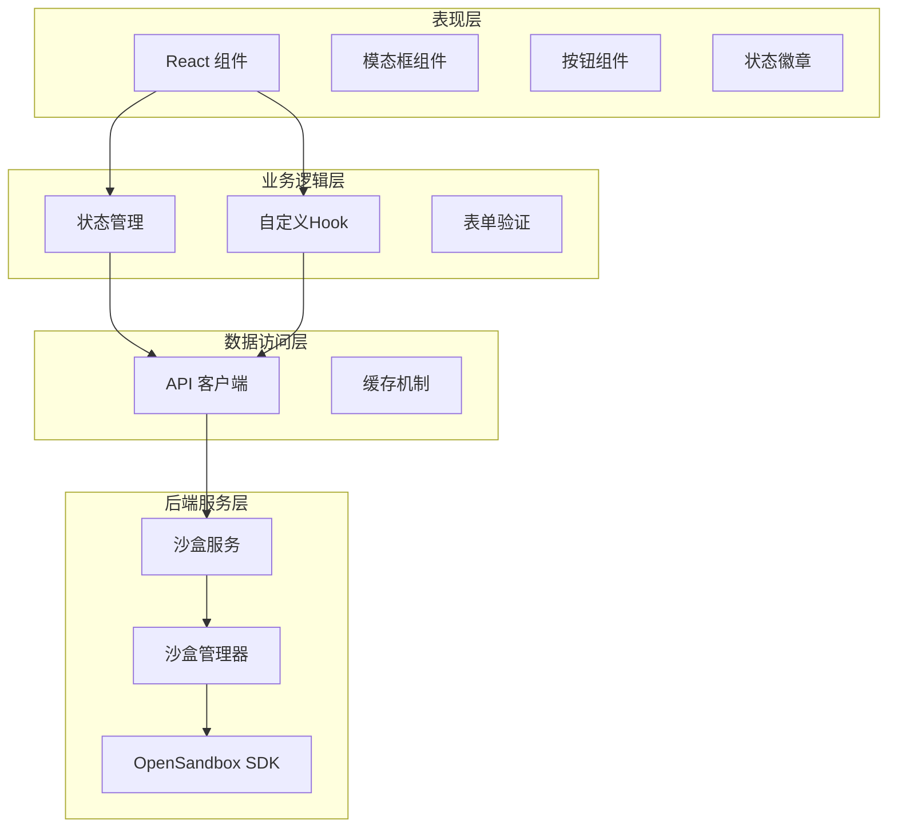

**图表来源**
- [SandboxList.tsx:1-53](file://apps/frontend/src/components/sandbox/SandboxList.tsx#L1-L53)
- [CreateSandbox.tsx:1-180](file://apps/frontend/src/components/sandbox/CreateSandbox.tsx#L1-L180)
- [SandboxCard.tsx:1-67](file://apps/frontend/src/components/sandbox/SandboxCard.tsx#L1-L67)

## 详细组件分析

### SandboxList 组件

SandboxList 组件负责沙盒列表的展示和管理，实现了响应式布局和状态指示：

#### 渲染逻辑

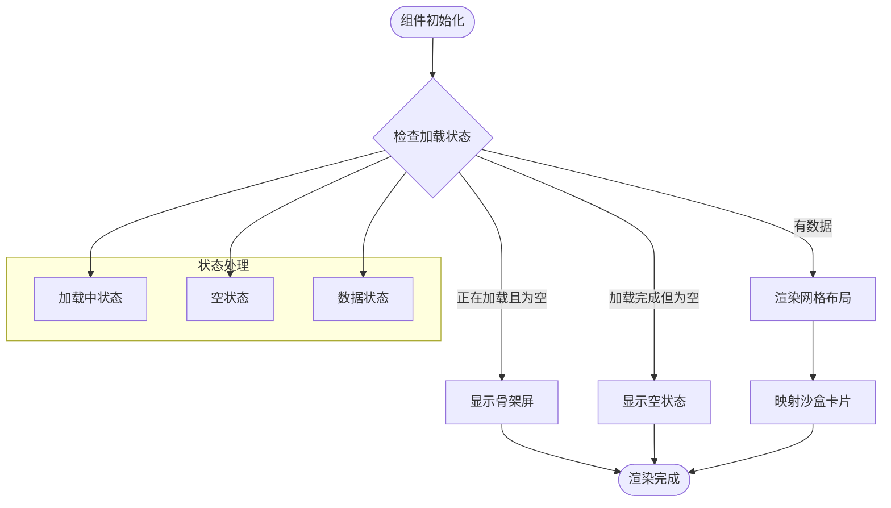

**图表来源**
- [SandboxList.tsx:5-52](file://apps/frontend/src/components/sandbox/SandboxList.tsx#L5-L52)

#### 数据流处理

组件通过 `useSandboxStore` 获取沙盒数据，并直接调用 store 中的方法处理用户操作：

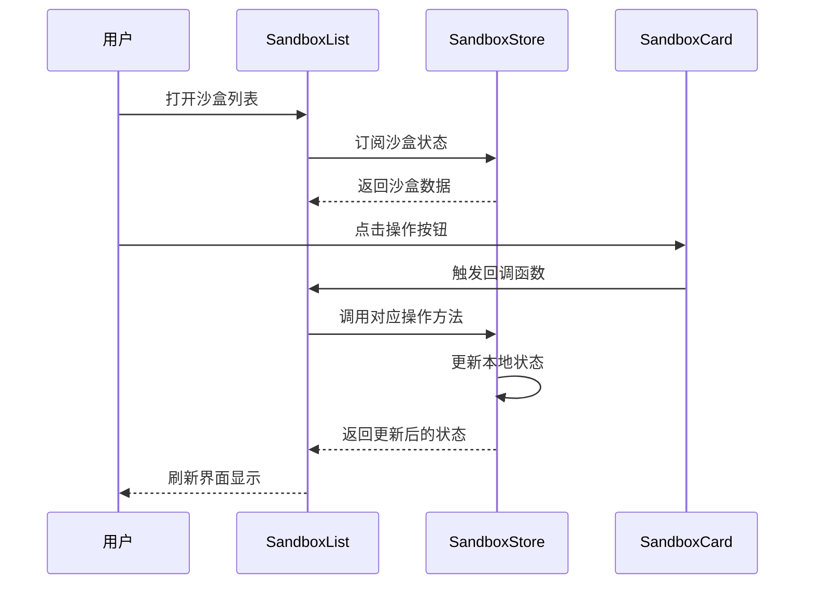

**图表来源**
- [SandboxList.tsx:6-48](file://apps/frontend/src/components/sandbox/SandboxList.tsx#L6-L48)
- [sandboxStore.ts:16-62](file://apps/frontend/src/stores/sandboxStore.ts#L16-L62)

**章节来源**
- [SandboxList.tsx:1-53](file://apps/frontend/src/components/sandbox/SandboxList.tsx#L1-L53)

### CreateSandbox 组件

CreateSandbox 组件提供了完整的沙盒创建表单，包含表单验证和错误处理机制：

#### 表单设计

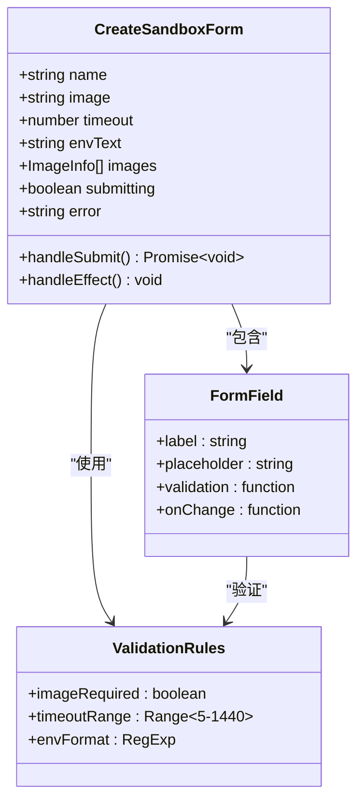

**图表来源**
- [CreateSandbox.tsx:18-71](file://apps/frontend/src/components/sandbox/CreateSandbox.tsx#L18-L71)

#### 参数验证流程

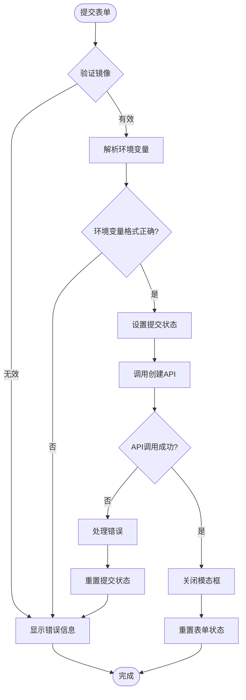

**图表来源**
- [CreateSandbox.tsx:40-71](file://apps/frontend/src/components/sandbox/CreateSandbox.tsx#L40-L71)

#### 沙盒创建流程

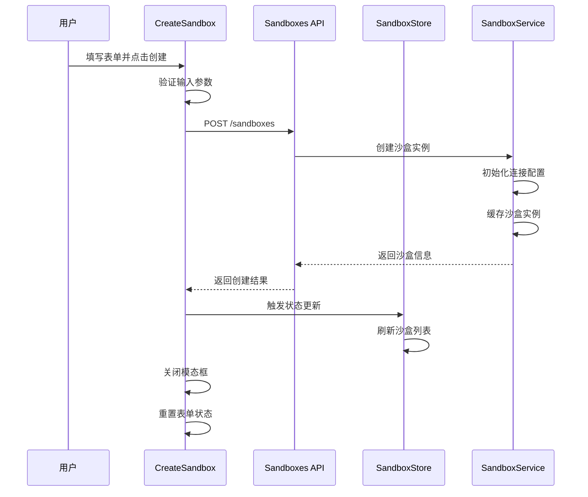

**图表来源**
- [CreateSandbox.tsx:58-64](file://apps/frontend/src/components/sandbox/CreateSandbox.tsx#L58-L64)
- [sandboxStore.ts:33-37](file://apps/frontend/src/stores/sandboxStore.ts#L33-L37)

**章节来源**
- [CreateSandbox.tsx:1-180](file://apps/frontend/src/components/sandbox/CreateSandbox.tsx#L1-L180)

### SandboxCard 组件

SandboxCard 组件负责单个沙盒的可视化展示和交互操作：

#### 状态显示机制

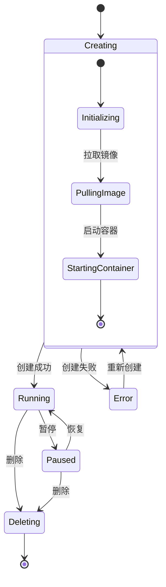

**图表来源**
- [SandboxCard.tsx:16-18](file://apps/frontend/src/components/sandbox/SandboxCard.tsx#L16-L18)

#### 交互操作处理

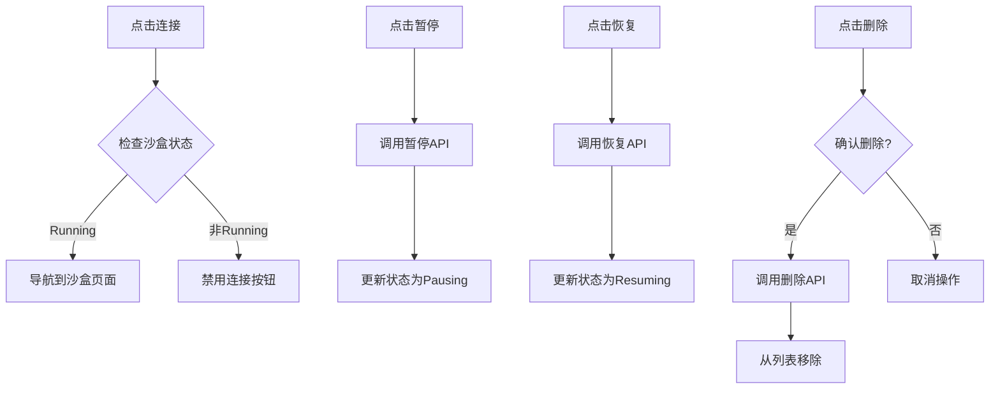

**图表来源**
- [SandboxCard.tsx:34-63](file://apps/frontend/src/components/sandbox/SandboxCard.tsx#L34-L63)

**章节来源**
- [SandboxCard.tsx:1-67](file://apps/frontend/src/components/sandbox/SandboxCard.tsx#L1-L67)

### 状态管理与数据同步

#### 自动轮询机制

useSandbox Hook 实现了智能的自动轮询功能，用于监控沙盒状态变化：

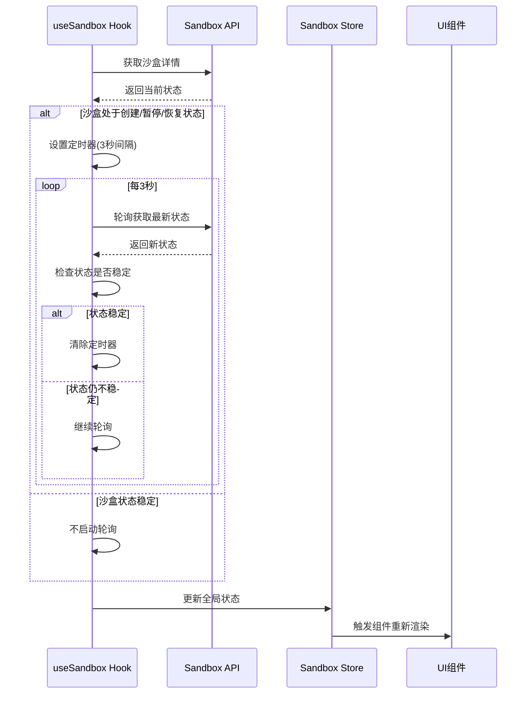

**图表来源**
- [useSandbox.ts:42-55](file://apps/frontend/src/hooks/useSandbox.ts#L42-L55)

#### 错误处理策略

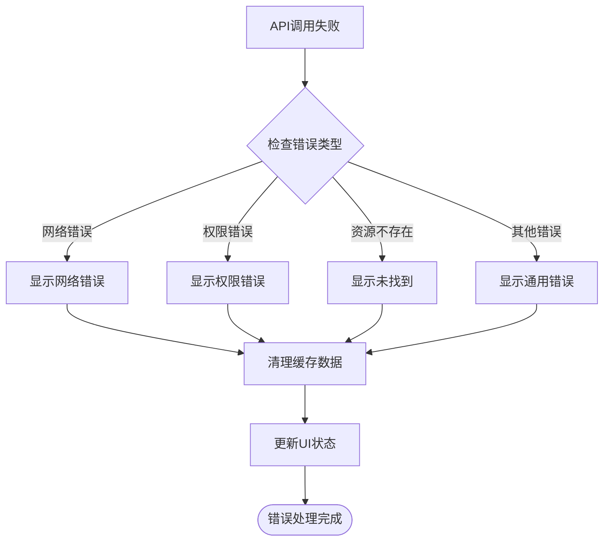

**图表来源**
- [useSandbox.ts:18-21](file://apps/frontend/src/hooks/useSandbox.ts#L18-L21)

**章节来源**
- [useSandbox.ts:1-59](file://apps/frontend/src/hooks/useSandbox.ts#L1-L59)

## 依赖关系分析

### 组件间依赖关系

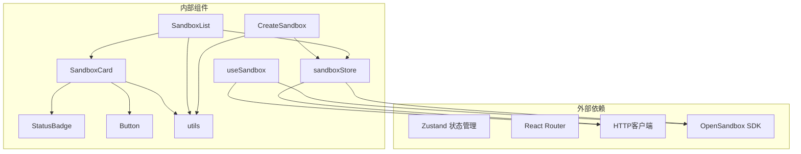

**图表来源**
- [SandboxList.tsx:1-2](file://apps/frontend/src/components/sandbox/SandboxList.tsx#L1-L2)
- [CreateSandbox.tsx:1-5](file://apps/frontend/src/components/sandbox/CreateSandbox.tsx#L1-L5)
- [SandboxCard.tsx:1-5](file://apps/frontend/src/components/sandbox/SandboxCard.tsx#L1-L5)

### 数据流依赖

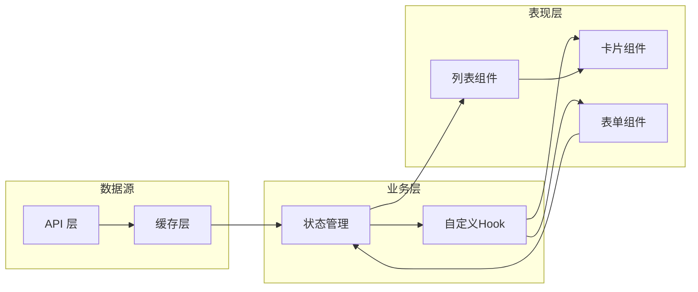

**图表来源**
- [sandboxes.ts:1-40](file://apps/frontend/src/api/sandboxes.ts#L1-L40)
- [sandboxStore.ts:21-31](file://apps/frontend/src/stores/sandboxStore.ts#L21-L31)

**章节来源**
- [sandboxService.ts:1-148](file://apps/backend/src/services/sandboxService.ts#L1-L148)

## 性能考虑

### 缓存策略

系统实现了多层缓存机制来提升性能：

1. **LRU缓存**: 后端使用 LRU 缓存管理已连接的沙盒实例，默认缓存50个实例，10分钟TTL
2. **状态缓存**: 前端使用 Zustand 管理沙盒状态，避免重复请求
3. **自动轮询**: 只对处于不稳定状态的沙盒进行轮询，减少不必要的API调用

### 渲染优化

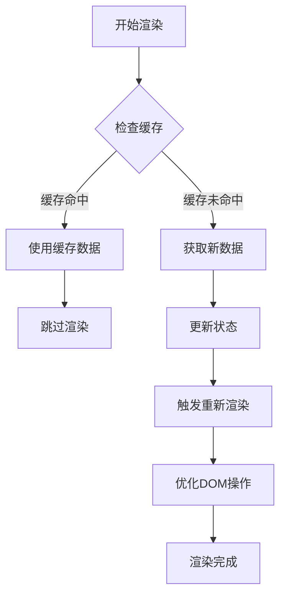

### 内存管理

- **自动清理**: LRU缓存自动清理过期的沙盒连接
- **事件监听器清理**: 组件卸载时自动清理定时器和事件监听器
- **状态清理**: 错误发生时清理相关状态，防止内存泄漏

## 故障排除指南

### 常见问题及解决方案

#### 沙盒创建失败

**症状**: 创建沙盒时出现错误提示

**可能原因**:
1. 镜像名称不正确
2. 网络连接问题
3. 权限不足
4. 资源限制

**解决步骤**:
1. 检查镜像名称格式
2. 验证网络连接状态
3. 确认用户权限
4. 查看后端日志

#### 沙盒状态不同步

**症状**: UI显示的沙盒状态与实际状态不符

**解决步骤**:
1. 检查自动轮询是否正常工作
2. 查看网络请求状态
3. 重启浏览器或刷新页面
4. 检查后端服务状态

#### 性能问题

**症状**: 页面加载缓慢或响应迟钝

**优化建议**:
1. 减少同时打开的沙盒数量
2. 清理浏览器缓存
3. 检查网络带宽
4. 优化沙盒配置

**章节来源**
- [sandboxStore.ts:28-30](file://apps/frontend/src/stores/sandboxStore.ts#L28-L30)
- [useSandbox.ts:34-38](file://apps/frontend/src/hooks/useSandbox.ts#L34-L38)

## 结论

Sandbox Manager 的沙盒管理组件展现了优秀的架构设计和实现质量。通过合理的组件拆分、清晰的状态管理和完善的错误处理机制，系统实现了良好的用户体验和可维护性。

### 主要优势

1. **模块化设计**: 组件职责明确，便于测试和维护
2. **状态管理**: 使用 Zustand 实现轻量级状态管理
3. **响应式设计**: 支持多种屏幕尺寸的自适应布局
4. **错误处理**: 完善的错误处理和用户反馈机制
5. **性能优化**: 多层缓存和智能轮询机制

### 改进建议

1. **国际化支持**: 添加多语言支持
2. **主题定制**: 允许用户自定义界面主题
3. **批量操作**: 支持沙盒的批量管理操作
4. **搜索过滤**: 增加沙盒搜索和过滤功能
5. **导出功能**: 支持沙盒信息的导出

该组件体系为后续的功能扩展奠定了坚实的基础，能够满足不断增长的业务需求。