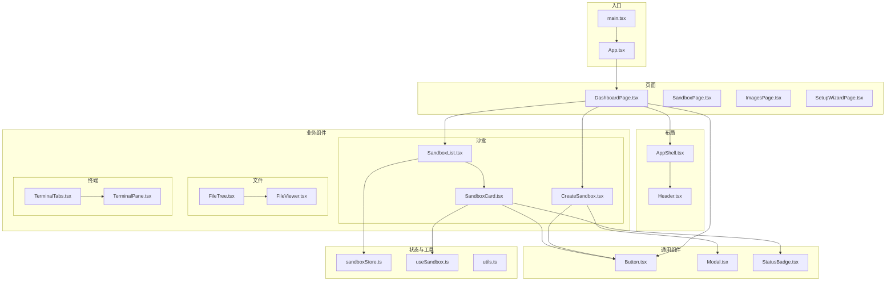
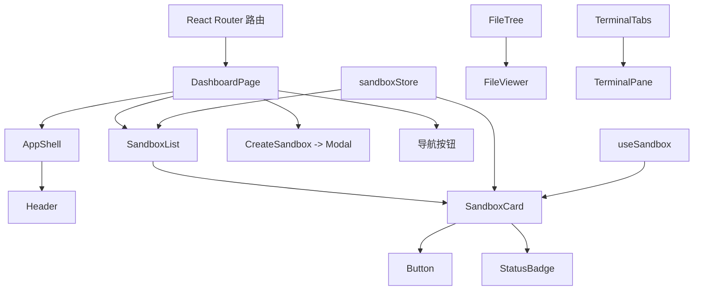
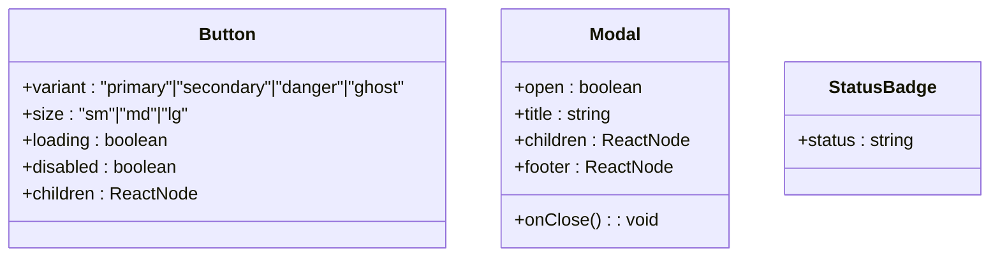
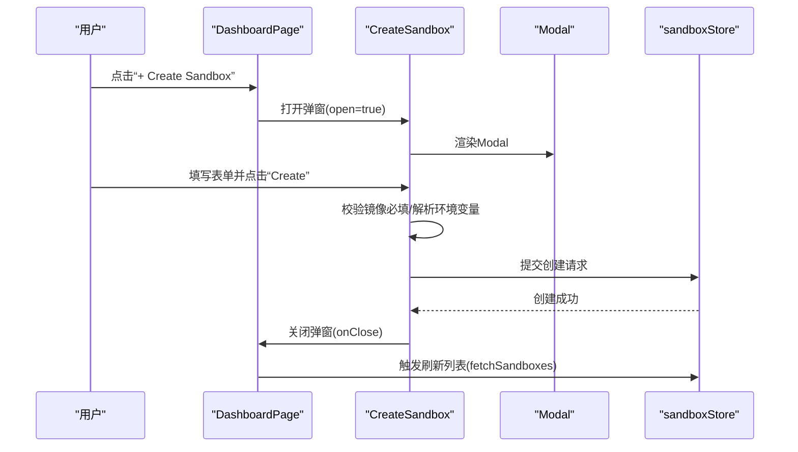
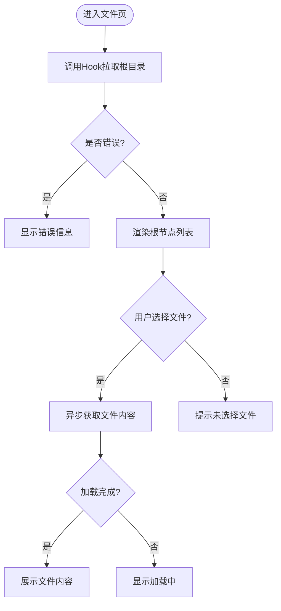
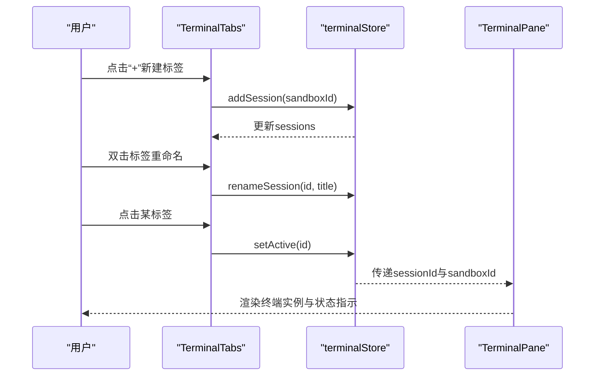
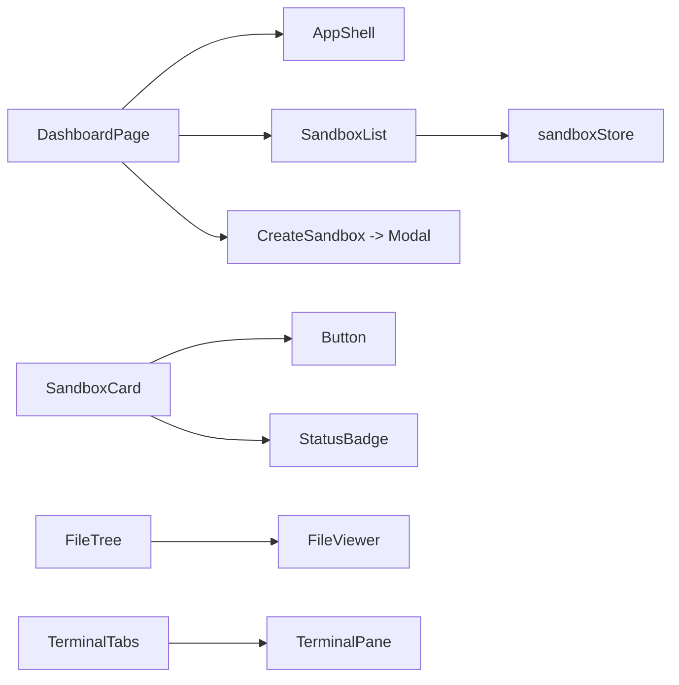

# 组件系统设计

<cite>
**本文引用的文件**
- [apps/frontend/src/App.tsx](file://apps/frontend/src/App.tsx)
- [apps/frontend/src/main.tsx](file://apps/frontend/src/main.tsx)
- [apps/frontend/src/components/layout/AppShell.tsx](file://apps/frontend/src/components/layout/AppShell.tsx)
- [apps/frontend/src/components/layout/Header.tsx](file://apps/frontend/src/components/layout/Header.tsx)
- [apps/frontend/src/components/common/Button.tsx](file://apps/frontend/src/components/common/Button.tsx)
- [apps/frontend/src/components/common/Modal.tsx](file://apps/frontend/src/components/common/Modal.tsx)
- [apps/frontend/src/components/common/StatusBadge.tsx](file://apps/frontend/src/components/common/StatusBadge.tsx)
- [apps/frontend/src/components/sandbox/CreateSandbox.tsx](file://apps/frontend/src/components/sandbox/CreateSandbox.tsx)
- [apps/frontend/src/components/sandbox/SandboxCard.tsx](file://apps/frontend/src/components/sandbox/SandboxCard.tsx)
- [apps/frontend/src/components/sandbox/SandboxList.tsx](file://apps/frontend/src/components/sandbox/SandboxList.tsx)
- [apps/frontend/src/components/files/FileTree.tsx](file://apps/frontend/src/components/files/FileTree.tsx)
- [apps/frontend/src/components/files/FileViewer.tsx](file://apps/frontend/src/components/files/FileViewer.tsx)
- [apps/frontend/src/components/terminal/TerminalPane.tsx](file://apps/frontend/src/components/terminal/TerminalPane.tsx)
- [apps/frontend/src/components/terminal/TerminalTabs.tsx](file://apps/frontend/src/components/terminal/TerminalTabs.tsx)
- [apps/frontend/src/pages/DashboardPage.tsx](file://apps/frontend/src/pages/DashboardPage.tsx)
- [apps/frontend/src/stores/sandboxStore.ts](file://apps/frontend/src/stores/sandboxStore.ts)
- [apps/frontend/src/hooks/useSandbox.ts](file://apps/frontend/src/hooks/useSandbox.ts)
- [apps/frontend/src/lib/utils.ts](file://apps/frontend/src/lib/utils.ts)
- [apps/frontend/src/styles/globals.css](file://apps/frontend/src/styles/globals.css)
</cite>

## 目录
1. [简介](#简介)
2. [项目结构](#项目结构)
3. [核心组件](#核心组件)
4. [架构总览](#架构总览)
5. [详细组件分析](#详细组件分析)
6. [依赖关系分析](#依赖关系分析)
7. [性能考量](#性能考量)
8. [故障排查指南](#故障排查指南)
9. [结论](#结论)
10. [附录](#附录)

## 简介
本设计文档面向Sandbox Manager前端组件系统，聚焦于组件层次结构与交互模式，覆盖布局组件（AppShell、Header）、业务组件（沙盒管理、文件操作、终端组件）与通用组件（Button、Modal、StatusBadge）。文档从props接口、状态管理、事件处理、组件间通信、复用与扩展、样式定制、性能优化、响应式与无障碍等维度进行系统化说明，并提供可视化图示与实践建议。

## 项目结构
前端采用按功能域分层的目录组织：components（通用/业务/布局）、pages（页面容器）、stores（状态管理）、hooks（自定义Hook）、api（后端接口封装）、styles（全局样式）。

图表来源
- [apps/frontend/src/main.tsx:1-12](file://apps/frontend/src/main.tsx#L1-L12)
- [apps/frontend/src/App.tsx:1-114](file://apps/frontend/src/App.tsx#L1-L114)
- [apps/frontend/src/pages/DashboardPage.tsx:1-54](file://apps/frontend/src/pages/DashboardPage.tsx#L1-L54)
- [apps/frontend/src/components/layout/AppShell.tsx:1-19](file://apps/frontend/src/components/layout/AppShell.tsx#L1-L19)
- [apps/frontend/src/components/layout/Header.tsx:1-28](file://apps/frontend/src/components/layout/Header.tsx#L1-L28)
- [apps/frontend/src/components/common/Button.tsx:1-56](file://apps/frontend/src/components/common/Button.tsx#L1-L56)
- [apps/frontend/src/components/common/Modal.tsx:1-44](file://apps/frontend/src/components/common/Modal.tsx#L1-L44)
- [apps/frontend/src/components/common/StatusBadge.tsx:1-40](file://apps/frontend/src/components/common/StatusBadge.tsx#L1-L40)
- [apps/frontend/src/components/sandbox/CreateSandbox.tsx:1-180](file://apps/frontend/src/components/sandbox/CreateSandbox.tsx#L1-L180)
- [apps/frontend/src/components/sandbox/SandboxCard.tsx:1-67](file://apps/frontend/src/components/sandbox/SandboxCard.tsx#L1-L67)
- [apps/frontend/src/components/sandbox/SandboxList.tsx:1-53](file://apps/frontend/src/components/sandbox/SandboxList.tsx#L1-L53)
- [apps/frontend/src/components/files/FileTree.tsx:1-55](file://apps/frontend/src/components/files/FileTree.tsx#L1-L55)
- [apps/frontend/src/components/files/FileViewer.tsx:1-68](file://apps/frontend/src/components/files/FileViewer.tsx#L1-L68)
- [apps/frontend/src/components/terminal/TerminalTabs.tsx:1-57](file://apps/frontend/src/components/terminal/TerminalTabs.tsx#L1-L57)
- [apps/frontend/src/components/terminal/TerminalPane.tsx:1-38](file://apps/frontend/src/components/terminal/TerminalPane.tsx#L1-L38)
- [apps/frontend/src/stores/sandboxStore.ts:1-63](file://apps/frontend/src/stores/sandboxStore.ts#L1-L63)
- [apps/frontend/src/hooks/useSandbox.ts:1-59](file://apps/frontend/src/hooks/useSandbox.ts#L1-L59)
- [apps/frontend/src/lib/utils.ts:1-23](file://apps/frontend/src/lib/utils.ts#L1-L23)

章节来源
- [apps/frontend/src/main.tsx:1-12](file://apps/frontend/src/main.tsx#L1-L12)
- [apps/frontend/src/App.tsx:1-114](file://apps/frontend/src/App.tsx#L1-L114)

## 核心组件
- 布局组件
  - AppShell：提供统一外壳，承载Header与主内容区，支持标题、返回按钮与右侧动作区域。
  - Header：展示标题与返回按钮，右侧放置操作按钮组。
- 通用组件
  - Button：支持多变体、尺寸、加载态与禁用态；透传原生button属性。
  - Modal：受控弹窗，支持Esc关闭、遮罩点击关闭、可选底部栏。
  - StatusBadge：根据状态映射不同样式与动画（运行中脉动、过程类旋转）。
- 业务组件
  - 沙盒：CreateSandbox（创建沙盒表单）、SandboxCard（卡片展示与操作）、SandboxList（列表渲染与骨架屏）。
  - 文件：FileTree（树形目录浏览）、FileViewer（文件内容查看）。
  - 终端：TerminalTabs（标签页管理）、TerminalPane（终端实例渲染）。
- 页面与状态
  - DashboardPage：聚合沙盒列表与创建弹窗，协调导航与动作。
  - sandboxStore：集中管理沙盒数据、加载与错误状态，提供CRUD与状态变更。
  - useSandbox：针对单个沙盒的实时拉取与轮询刷新。

章节来源
- [apps/frontend/src/components/layout/AppShell.tsx:1-19](file://apps/frontend/src/components/layout/AppShell.tsx#L1-L19)
- [apps/frontend/src/components/layout/Header.tsx:1-28](file://apps/frontend/src/components/layout/Header.tsx#L1-L28)
- [apps/frontend/src/components/common/Button.tsx:1-56](file://apps/frontend/src/components/common/Button.tsx#L1-L56)
- [apps/frontend/src/components/common/Modal.tsx:1-44](file://apps/frontend/src/components/common/Modal.tsx#L1-L44)
- [apps/frontend/src/components/common/StatusBadge.tsx:1-40](file://apps/frontend/src/components/common/StatusBadge.tsx#L1-L40)
- [apps/frontend/src/components/sandbox/CreateSandbox.tsx:1-180](file://apps/frontend/src/components/sandbox/CreateSandbox.tsx#L1-L180)
- [apps/frontend/src/components/sandbox/SandboxCard.tsx:1-67](file://apps/frontend/src/components/sandbox/SandboxCard.tsx#L1-L67)
- [apps/frontend/src/components/sandbox/SandboxList.tsx:1-53](file://apps/frontend/src/components/sandbox/SandboxList.tsx#L1-L53)
- [apps/frontend/src/components/files/FileTree.tsx:1-55](file://apps/frontend/src/components/files/FileTree.tsx#L1-L55)
- [apps/frontend/src/components/files/FileViewer.tsx:1-68](file://apps/frontend/src/components/files/FileViewer.tsx#L1-L68)
- [apps/frontend/src/components/terminal/TerminalTabs.tsx:1-57](file://apps/frontend/src/components/terminal/TerminalTabs.tsx#L1-L57)
- [apps/frontend/src/components/terminal/TerminalPane.tsx:1-38](file://apps/frontend/src/components/terminal/TerminalPane.tsx#L1-L38)
- [apps/frontend/src/pages/DashboardPage.tsx:1-54](file://apps/frontend/src/pages/DashboardPage.tsx#L1-L54)
- [apps/frontend/src/stores/sandboxStore.ts:1-63](file://apps/frontend/src/stores/sandboxStore.ts#L1-L63)
- [apps/frontend/src/hooks/useSandbox.ts:1-59](file://apps/frontend/src/hooks/useSandbox.ts#L1-L59)

## 架构总览
应用通过路由驱动页面，页面内组合布局与业务组件；通用组件被广泛复用；状态通过Zustand集中管理，业务Hook负责数据拉取与轮询；UI通过Tailwind进行样式组织。

图表来源
- [apps/frontend/src/App.tsx:9-30](file://apps/frontend/src/App.tsx#L9-L30)
- [apps/frontend/src/pages/DashboardPage.tsx:10-53](file://apps/frontend/src/pages/DashboardPage.tsx#L10-L53)
- [apps/frontend/src/components/layout/AppShell.tsx:11-18](file://apps/frontend/src/components/layout/AppShell.tsx#L11-L18)
- [apps/frontend/src/components/layout/Header.tsx:7-27](file://apps/frontend/src/components/layout/Header.tsx#L7-L27)
- [apps/frontend/src/components/sandbox/SandboxList.tsx:5-52](file://apps/frontend/src/components/sandbox/SandboxList.tsx#L5-L52)
- [apps/frontend/src/components/sandbox/SandboxCard.tsx:14-66](file://apps/frontend/src/components/sandbox/SandboxCard.tsx#L14-L66)
- [apps/frontend/src/components/common/Button.tsx:24-55](file://apps/frontend/src/components/common/Button.tsx#L24-L55)
- [apps/frontend/src/components/common/StatusBadge.tsx:19-39](file://apps/frontend/src/components/common/StatusBadge.tsx#L19-L39)
- [apps/frontend/src/components/common/Modal.tsx:11-43](file://apps/frontend/src/components/common/Modal.tsx#L11-L43)
- [apps/frontend/src/stores/sandboxStore.ts:16-62](file://apps/frontend/src/stores/sandboxStore.ts#L16-L62)
- [apps/frontend/src/hooks/useSandbox.ts:6-58](file://apps/frontend/src/hooks/useSandbox.ts#L6-L58)
- [apps/frontend/src/components/files/FileTree.tsx:11-54](file://apps/frontend/src/components/files/FileTree.tsx#L11-L54)
- [apps/frontend/src/components/files/FileViewer.tsx:9-67](file://apps/frontend/src/components/files/FileViewer.tsx#L9-L67)
- [apps/frontend/src/components/terminal/TerminalTabs.tsx:7-56](file://apps/frontend/src/components/terminal/TerminalTabs.tsx#L7-L56)
- [apps/frontend/src/components/terminal/TerminalPane.tsx:8-37](file://apps/frontend/src/components/terminal/TerminalPane.tsx#L8-L37)

## 详细组件分析

### 布局组件：AppShell 与 Header
- 设计要点
  - AppShell作为页面容器，统一高度与布局，内部嵌入Header与主内容区。
  - Header支持可选返回按钮与右侧动作区，便于在不同页面插入上下文相关操作。
- Props 接口
  - AppShell：title、onBack、actions、children。
  - Header：title、onBack、actions。
- 事件与状态
  - 返回按钮通过onBack回调交由父级处理（如页面级导航）。
- 复用性与扩展
  - 通过children与actions插槽实现灵活扩展；适合在各页面复用。

章节来源
- [apps/frontend/src/components/layout/AppShell.tsx:4-18](file://apps/frontend/src/components/layout/AppShell.tsx#L4-L18)
- [apps/frontend/src/components/layout/Header.tsx:1-27](file://apps/frontend/src/components/layout/Header.tsx#L1-L27)

### 通用组件：Button、Modal、StatusBadge
- Button
  - Props：variant（primary/secondary/danger/ghost）、size（sm/md/lg）、loading、disabled、className、children以及原生button属性透传。
  - 行为：loading时禁用并显示旋转指示；支持自定义样式合并。
- Modal
  - Props：open、onClose、title、children、footer。
  - 行为：Esc键关闭；遮罩点击关闭；键盘事件在打开时注册，关闭时清理。
- StatusBadge
  - Props：status（字符串）。
  - 行为：根据状态映射不同颜色与文案；运行中与就绪状态显示脉冲点；过程类状态显示旋转指示。

图表来源
- [apps/frontend/src/components/common/Button.tsx:4-9](file://apps/frontend/src/components/common/Button.tsx#L4-L9)
- [apps/frontend/src/components/common/Modal.tsx:3-9](file://apps/frontend/src/components/common/Modal.tsx#L3-L9)
- [apps/frontend/src/components/common/StatusBadge.tsx:3-5](file://apps/frontend/src/components/common/StatusBadge.tsx#L3-L5)

章节来源
- [apps/frontend/src/components/common/Button.tsx:11-55](file://apps/frontend/src/components/common/Button.tsx#L11-L55)
- [apps/frontend/src/components/common/Modal.tsx:11-43](file://apps/frontend/src/components/common/Modal.tsx#L11-L43)
- [apps/frontend/src/components/common/StatusBadge.tsx:19-39](file://apps/frontend/src/components/common/StatusBadge.tsx#L19-L39)

### 业务组件：沙盒管理
- CreateSandbox
  - 功能：创建沙盒的表单弹窗，包含名称、镜像选择/输入、超时分钟数、环境变量文本域。
  - 状态：本地表单状态（名称、镜像、超时、环境变量文本、提交中、错误信息），异步提交后关闭弹窗。
  - 交互：从镜像列表API拉取可用镜像，过滤“ready”状态；支持自定义镜像输入；提交前校验镜像必填。
- SandboxCard
  - 功能：展示单个沙盒信息与操作按钮（连接、暂停、恢复、删除）。
  - 状态：根据沙盒状态决定按钮可用性与文案；运行中启用连接；忙碌状态禁用删除。
  - 事件：调用父级传入的onDelete/onPause/onResume回调。
- SandboxList
  - 功能：渲染沙盒卡片网格；空态与骨架屏提示；读取store中的沙盒列表与加载状态。

图表来源
- [apps/frontend/src/pages/DashboardPage.tsx:19-27](file://apps/frontend/src/pages/DashboardPage.tsx#L19-L27)
- [apps/frontend/src/components/sandbox/CreateSandbox.tsx:40-71](file://apps/frontend/src/components/sandbox/CreateSandbox.tsx#L40-L71)
- [apps/frontend/src/stores/sandboxStore.ts:33-37](file://apps/frontend/src/stores/sandboxStore.ts#L33-L37)

章节来源
- [apps/frontend/src/components/sandbox/CreateSandbox.tsx:7-71](file://apps/frontend/src/components/sandbox/CreateSandbox.tsx#L7-L71)
- [apps/frontend/src/components/sandbox/SandboxCard.tsx:14-66](file://apps/frontend/src/components/sandbox/SandboxCard.tsx#L14-L66)
- [apps/frontend/src/components/sandbox/SandboxList.tsx:5-52](file://apps/frontend/src/components/sandbox/SandboxList.tsx#L5-L52)
- [apps/frontend/src/stores/sandboxStore.ts:16-62](file://apps/frontend/src/stores/sandboxStore.ts#L16-L62)

### 业务组件：文件操作
- FileTree
  - 功能：基于Hook useFileTree构建树形目录，支持展开/折叠、懒加载子节点、错误提示。
  - 数据流：首次渲染时拉取根节点；通过getChildren("/")获取顶层条目；递归渲染FileTreeNode。
- FileViewer
  - 功能：根据选中路径异步获取文件内容并展示；支持加载中、错误与空态提示。
  - 交互：当filePath为空或变化时触发重新加载。

图表来源
- [apps/frontend/src/components/files/FileTree.tsx:11-54](file://apps/frontend/src/components/files/FileTree.tsx#L11-L54)
- [apps/frontend/src/components/files/FileViewer.tsx:9-67](file://apps/frontend/src/components/files/FileViewer.tsx#L9-L67)

章节来源
- [apps/frontend/src/components/files/FileTree.tsx:11-54](file://apps/frontend/src/components/files/FileTree.tsx#L11-L54)
- [apps/frontend/src/components/files/FileViewer.tsx:9-67](file://apps/frontend/src/components/files/FileViewer.tsx#L9-L67)

### 业务组件：终端组件
- TerminalTabs
  - 功能：按沙盒ID筛选会话，支持新增、重命名（双击）、切换激活、关闭。
  - 状态：来自terminalStore；通过回调更新激活态与重命名。
- TerminalPane
  - 功能：挂载终端实例容器，显示连接状态（连接/重连/错误）与终端画布。

图表来源
- [apps/frontend/src/components/terminal/TerminalTabs.tsx:7-56](file://apps/frontend/src/components/terminal/TerminalTabs.tsx#L7-L56)
- [apps/frontend/src/components/terminal/TerminalPane.tsx:8-37](file://apps/frontend/src/components/terminal/TerminalPane.tsx#L8-L37)

章节来源
- [apps/frontend/src/components/terminal/TerminalTabs.tsx:7-56](file://apps/frontend/src/components/terminal/TerminalTabs.tsx#L7-L56)
- [apps/frontend/src/components/terminal/TerminalPane.tsx:8-37](file://apps/frontend/src/components/terminal/TerminalPane.tsx#L8-L37)

## 依赖关系分析
- 组件耦合
  - DashboardPage与AppShell/按钮/模态之间为父子关系，耦合度低，职责清晰。
  - SandboxList依赖sandboxStore，SandboxCard依赖Button与StatusBadge，形成“容器-展示-通用”的分层。
  - 文件与终端组件分别依赖各自Hook与Store，避免跨域耦合。
- 状态与数据流
  - 全局状态：sandboxStore集中维护沙盒列表与操作；useSandbox用于单沙盒刷新与轮询。
  - 本地状态：CreateSandbox与Modal等组件维持自身可见性与表单状态。
- 外部依赖
  - Tailwind用于样式；React Router用于路由；Zustand用于状态管理；自定义Hook封装API与缓存策略。

图表来源
- [apps/frontend/src/pages/DashboardPage.tsx:10-53](file://apps/frontend/src/pages/DashboardPage.tsx#L10-L53)
- [apps/frontend/src/components/sandbox/SandboxList.tsx:5-52](file://apps/frontend/src/components/sandbox/SandboxList.tsx#L5-L52)
- [apps/frontend/src/stores/sandboxStore.ts:16-62](file://apps/frontend/src/stores/sandboxStore.ts#L16-L62)
- [apps/frontend/src/components/files/FileTree.tsx:11-54](file://apps/frontend/src/components/files/FileTree.tsx#L11-L54)
- [apps/frontend/src/components/files/FileViewer.tsx:9-67](file://apps/frontend/src/components/files/FileViewer.tsx#L9-L67)
- [apps/frontend/src/components/terminal/TerminalTabs.tsx:7-56](file://apps/frontend/src/components/terminal/TerminalTabs.tsx#L7-L56)
- [apps/frontend/src/components/terminal/TerminalPane.tsx:8-37](file://apps/frontend/src/components/terminal/TerminalPane.tsx#L8-L37)

章节来源
- [apps/frontend/src/stores/sandboxStore.ts:16-62](file://apps/frontend/src/stores/sandboxStore.ts#L16-L62)
- [apps/frontend/src/hooks/useSandbox.ts:6-58](file://apps/frontend/src/hooks/useSandbox.ts#L6-L58)

## 性能考量
- 列表渲染
  - SandboxList在加载中使用骨架屏，减少白屏与布局抖动。
- 拉取策略
  - useSandbox对沙盒详情采用“总是拉取最新”，避免过期缓存导致的状态不一致。
- 轮询控制
  - 对“Creating/Pausing/Resuming”状态每3秒轮询一次，完成后清理定时器，降低资源占用。
- 事件清理
  - Modal在打开时注册Esc监听，在卸载时移除，避免内存泄漏。
- 样式体积
  - 使用Tailwind原子类，按需引入基础/组件/实用工具，减少冗余样式。

章节来源
- [apps/frontend/src/components/sandbox/SandboxList.tsx:8-22](file://apps/frontend/src/components/sandbox/SandboxList.tsx#L8-L22)
- [apps/frontend/src/hooks/useSandbox.ts:42-55](file://apps/frontend/src/hooks/useSandbox.ts#L42-L55)
- [apps/frontend/src/components/common/Modal.tsx:12-19](file://apps/frontend/src/components/common/Modal.tsx#L12-L19)
- [apps/frontend/src/styles/globals.css:1-23](file://apps/frontend/src/styles/globals.css#L1-L23)

## 故障排查指南
- 后端不可达
  - App在检测到后端不可达时，显示错误提示与重试按钮；仅在“/setup”路径允许继续渲染。
- 沙盒操作异常
  - sandboxStore在失败时设置错误消息；SandboxCard在忙碌状态禁用删除以避免并发问题。
- 文件加载失败
  - FileViewer捕获错误并显示错误信息；FileTree在错误时展示错误提示与简短错误文本。
- 终端连接问题
  - TerminalPane显示错误、重连与连接状态；建议检查WebSocket连接与沙盒会话有效性。

章节来源
- [apps/frontend/src/App.tsx:34-113](file://apps/frontend/src/App.tsx#L34-L113)
- [apps/frontend/src/stores/sandboxStore.ts:28-30](file://apps/frontend/src/stores/sandboxStore.ts#L28-L30)
- [apps/frontend/src/components/sandbox/SandboxCard.tsx:56-62](file://apps/frontend/src/components/sandbox/SandboxCard.tsx#L56-L62)
- [apps/frontend/src/components/files/FileViewer.tsx:27-30](file://apps/frontend/src/components/files/FileViewer.tsx#L27-L30)
- [apps/frontend/src/components/files/FileTree.tsx:20-27](file://apps/frontend/src/components/files/FileTree.tsx#L20-L27)
- [apps/frontend/src/components/terminal/TerminalPane.tsx:17-33](file://apps/frontend/src/components/terminal/TerminalPane.tsx#L17-L33)

## 结论
该组件系统以清晰的层次划分与稳定的交互模式为基础，通过通用组件提升复用性，通过Zustand与自定义Hook实现高效的数据与状态管理。布局组件与业务组件解耦良好，便于扩展新功能。建议在后续迭代中进一步完善类型约束、错误边界与可访问性增强，以提升整体稳定性与用户体验。

## 附录
- 组件使用示例（路径指引）
  - 在页面中引入AppShell与Header，将业务组件作为children传入。
  - 通过Button的variant/size/variant组合实现不同视觉与语义。
  - 使用Modal包裹复杂表单，结合onClose与footer实现标准对话框。
  - 在沙盒卡片中组合Button与StatusBadge，实现状态化操作。
  - 文件树与文件查看器配合使用，实现目录浏览与内容展示。
  - 终端标签页与终端面板配合使用，实现多会话管理与渲染。
- 样式定制指南
  - 通过Button的className与variants/size映射进行扩展；避免直接覆盖原子类。
  - Modal的footer与children区域可自由扩展复杂内容。
  - 使用Tailwind工具类进行响应式布局与主题色替换。
- 响应式与无障碍
  - 响应式：利用网格与flex布局在不同屏幕尺寸下自适应；文件与终端区域使用overflow与max-height控制滚动。
  - 无障碍：为按钮提供明确的aria-label或文本；Modal提供Esc关闭与遮罩点击关闭；确保键盘可达与焦点管理。