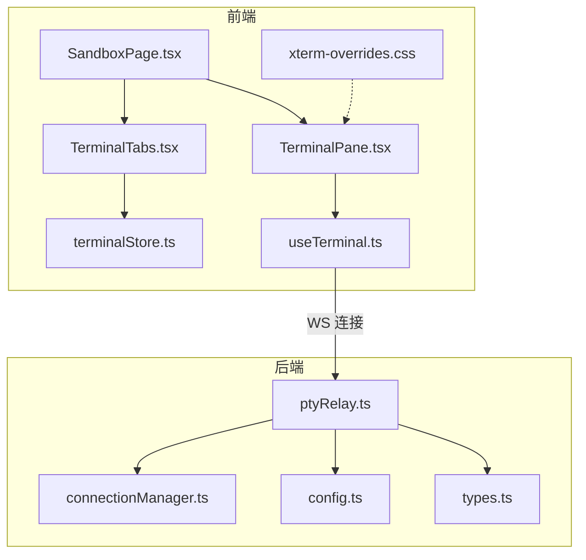
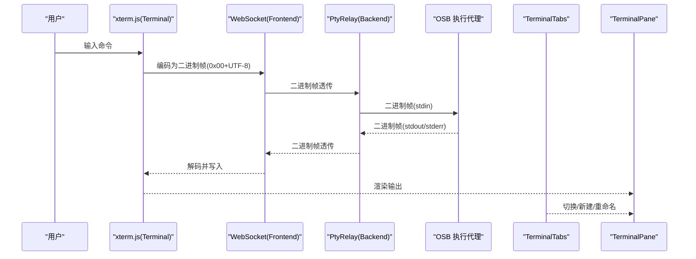
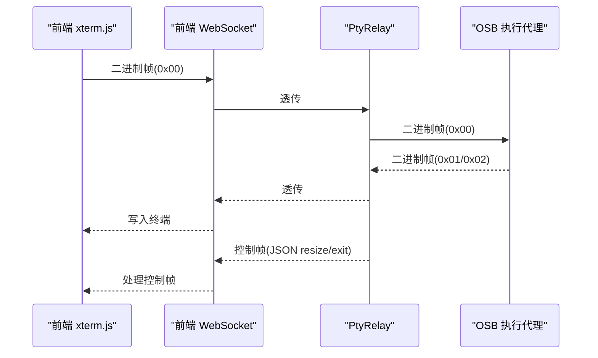
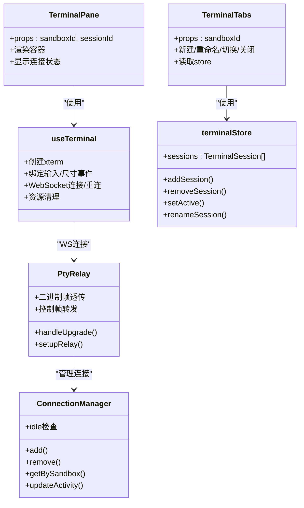

# 终端组件

<cite>
**本文引用的文件**
- [TerminalPane.tsx](file://apps/frontend/src/components/terminal/TerminalPane.tsx)
- [TerminalTabs.tsx](file://apps/frontend/src/components/terminal/TerminalTabs.tsx)
- [useTerminal.ts](file://apps/frontend/src/hooks/useTerminal.ts)
- [terminalStore.ts](file://apps/frontend/src/stores/terminalStore.ts)
- [SandboxPage.tsx](file://apps/frontend/src/pages/SandboxPage.tsx)
- [connectionManager.ts](file://apps/backend/src/websocket/connectionManager.ts)
- [ptyRelay.ts](file://apps/backend/src/websocket/ptyRelay.ts)
- [types.ts](file://apps/backend/src/websocket/types.ts)
- [config.ts](file://apps/backend/src/config.ts)
- [xterm-overrides.css](file://apps/frontend/src/styles/xterm-overrides.css)
- [utils.ts](file://apps/frontend/src/lib/utils.ts)
</cite>

## 目录
1. [简介](#简介)
2. [项目结构](#项目结构)
3. [核心组件](#核心组件)
4. [架构总览](#架构总览)
5. [详细组件分析](#详细组件分析)
6. [依赖关系分析](#依赖关系分析)
7. [性能考虑](#性能考虑)
8. [故障排查指南](#故障排查指南)
9. [结论](#结论)
10. [附录](#附录)

## 简介
本文件面向Sandbox Manager的终端组件，系统性阐述TerminalPane与TerminalTabs两大前端组件的实现机制，包括：
- 终端渲染机制与xterm.js集成
- 实时数据流处理（stdin/stdout/stderr）与控制帧
- 标签页管理、会话切换与状态维护
- WebSocket连接处理、二进制帧透传与会话生命周期管理
- 性能优化策略、内存管理与资源释放
- 配置选项、样式定制与功能扩展
- 会话持久化、自动重连与错误恢复

## 项目结构
终端组件位于前端应用中，采用“页面-组件-Hook-状态”的分层组织方式；后端通过WebSocket中继器完成与OSB执行代理的透明二进制透传。



图表来源
- [SandboxPage.tsx:120-136](file://apps/frontend/src/pages/SandboxPage.tsx#L120-L136)
- [TerminalTabs.tsx:1-56](file://apps/frontend/src/components/terminal/TerminalTabs.tsx#L1-L56)
- [TerminalPane.tsx:1-37](file://apps/frontend/src/components/terminal/TerminalPane.tsx#L1-L37)
- [useTerminal.ts:12-179](file://apps/frontend/src/hooks/useTerminal.ts#L12-L179)
- [terminalStore.ts:20-67](file://apps/frontend/src/stores/terminalStore.ts#L20-L67)
- [ptyRelay.ts:22-171](file://apps/backend/src/websocket/ptyRelay.ts#L22-L171)
- [connectionManager.ts:7-102](file://apps/backend/src/websocket/connectionManager.ts#L7-L102)
- [config.ts:48-71](file://apps/backend/src/config.ts#L48-L71)
- [types.ts:4-19](file://apps/backend/src/websocket/types.ts#L4-L19)
- [xterm-overrides.css:1-14](file://apps/frontend/src/styles/xterm-overrides.css#L1-L14)

章节来源
- [SandboxPage.tsx:120-136](file://apps/frontend/src/pages/SandboxPage.tsx#L120-L136)
- [TerminalPane.tsx:1-37](file://apps/frontend/src/components/terminal/TerminalPane.tsx#L1-L37)
- [TerminalTabs.tsx:1-56](file://apps/frontend/src/components/terminal/TerminalTabs.tsx#L1-L56)
- [useTerminal.ts:12-179](file://apps/frontend/src/hooks/useTerminal.ts#L12-L179)
- [terminalStore.ts:20-67](file://apps/frontend/src/stores/terminalStore.ts#L20-L67)
- [ptyRelay.ts:22-171](file://apps/backend/src/websocket/ptyRelay.ts#L22-L171)
- [connectionManager.ts:7-102](file://apps/backend/src/websocket/connectionManager.ts#L7-L102)
- [config.ts:48-71](file://apps/backend/src/config.ts#L48-L71)
- [types.ts:4-19](file://apps/backend/src/websocket/types.ts#L4-L19)
- [xterm-overrides.css:1-14](file://apps/frontend/src/styles/xterm-overrides.css#L1-L14)

## 核心组件
- TerminalPane：负责单个终端会话的渲染与交互，封装xterm实例、事件绑定、WebSocket连接与自动重连逻辑。
- TerminalTabs：负责同一沙箱下多个终端会话的标签页管理，支持新建、重命名、切换与关闭。
- useTerminal Hook：集中管理终端初始化、输入输出转发、窗口大小调整、连接状态与重连策略。
- terminalStore：Zustand状态存储，维护每个沙箱的会话列表、标题、激活态等。
- 后端PtyRelay：透明中继器，负责前端与OSB执行代理之间的二进制帧透传与控制消息转发。

章节来源
- [TerminalPane.tsx:8-37](file://apps/frontend/src/components/terminal/TerminalPane.tsx#L8-L37)
- [TerminalTabs.tsx:7-56](file://apps/frontend/src/components/terminal/TerminalTabs.tsx#L7-L56)
- [useTerminal.ts:12-179](file://apps/frontend/src/hooks/useTerminal.ts#L12-L179)
- [terminalStore.ts:20-67](file://apps/frontend/src/stores/terminalStore.ts#L20-L67)

## 架构总览
终端组件的端到端数据路径如下：
- 前端xterm.js将用户输入编码为二进制帧（stdin），并通过WebSocket发送至后端。
- 后端PtyRelay将二进制帧原样转发给OSB执行代理，同时将stdout/stderr与控制帧（resize/exit）回传前端。
- 前端收到数据后解码并写入xterm，实现实时交互。



图表来源
- [useTerminal.ts:127-144](file://apps/frontend/src/hooks/useTerminal.ts#L127-L144)
- [ptyRelay.ts:120-169](file://apps/backend/src/websocket/ptyRelay.ts#L120-L169)
- [TerminalTabs.tsx:7-56](file://apps/frontend/src/components/terminal/TerminalTabs.tsx#L7-L56)
- [TerminalPane.tsx:8-37](file://apps/frontend/src/components/terminal/TerminalPane.tsx#L8-L37)

## 详细组件分析

### TerminalPane 组件
- 职责：承载单个终端会话容器，显示连接状态指示，并通过Hook注入xterm实例与连接状态。
- 关键点：
  - 使用Hook useTerminal获取容器引用与连接状态。
  - 在容器顶部展示错误、重连与已连接状态提示。
  - 容器内由xterm.js负责渲染。

章节来源
- [TerminalPane.tsx:8-37](file://apps/frontend/src/components/terminal/TerminalPane.tsx#L8-L37)

### TerminalTabs 组件
- 职责：在同一沙箱内管理多个终端会话标签页，支持新建、重命名、切换与关闭。
- 关键点：
  - 从状态store读取当前沙箱的所有会话。
  - 新建：调用store添加新会话并设为激活。
  - 重命名：双击标签弹出输入框，更新标题。
  - 切换：点击标签设置对应会话为激活。
  - 关闭：点击×按钮移除会话，若无剩余会话则不激活任何标签。

章节来源
- [TerminalTabs.tsx:7-56](file://apps/frontend/src/components/terminal/TerminalTabs.tsx#L7-L56)
- [terminalStore.ts:20-67](file://apps/frontend/src/stores/terminalStore.ts#L20-L67)

### useTerminal Hook（终端核心）
- 职责：封装xterm.js实例创建、事件绑定、WebSocket连接、自动重连与资源清理。
- 终端渲染与插件：
  - 创建Terminal实例，加载FitAddon与WebLinksAddon。
  - 打开容器并进行初次适配。
- 数据流处理：
  - 输入转发：监听xterm输入事件，编码为二进制帧（0x00 + UTF-8）发送至后端。
  - 尺寸调整：监听xterm尺寸变化，发送JSON控制帧{"type":"resize","cols","rows"}。
  - 输出渲染：接收后端二进制帧（0x01/stdout、0x02/stderr），解码后写入终端。
  - 退出处理：接收{"type":"exit","code"}，在终端输出退出信息并断开连接。
- 连接与重连：
  - 使用当前协议选择ws/wss，目标URL为/api/sandboxes/{id}/pty。
  - 正常关闭（1000）不重连；异常关闭按指数退避+抖动计算延迟重连，上限30秒。
  - 连接成功后触发fitAddon.fit()以适配容器尺寸。
- 资源管理：
  - 组件卸载时清理定时器、关闭WebSocket、断开ResizeObserver、释放xterm与插件。
  - 设置disposed标志避免竞态。

```mermaid
flowchart TD
Start(["useTerminal 初始化"]) --> CreateTerm["创建 Terminal 与插件"]
CreateTerm --> OpenContainer["打开容器并初次适配"]
OpenContainer --> BindEvents["绑定输入/尺寸事件"]
BindEvents --> ConnectWS["建立 WebSocket 连接"]
ConnectWS --> OnOpen{"连接成功?"}
OnOpen --> |是| Fit["触发 FitAddon 适配"]
Fit --> OnMsg["处理消息"]
OnMsg --> TypeCheck{"消息类型?"}
TypeCheck --> |二进制帧| DecodeWrite["解码并写入终端"]
TypeCheck --> |字符串(JSON)| ParseExit{"是否 exit?"}
ParseExit --> |是| WriteExit["输出退出信息并断开"]
ParseExit --> |否| OtherText["写入文本"]
OnOpen --> |否| OnClose["异常关闭"]
OnClose --> CalcDelay["计算退避延迟"]
CalcDelay --> Reconnect["延时重连"]
Reconnect --> ConnectWS
```

图表来源
- [useTerminal.ts:12-179](file://apps/frontend/src/hooks/useTerminal.ts#L12-L179)

章节来源
- [useTerminal.ts:12-179](file://apps/frontend/src/hooks/useTerminal.ts#L12-L179)

### 后端 PtyRelay（二进制透传与控制帧）
- 职责：作为前端与OSB执行代理之间的透明中继，双向透传二进制帧与控制帧。
- 协议与帧格式：
  - 二进制帧：0x00 stdin（客户端→execd）、0x01 stdout、0x02 stderr（execd→客户端）。
  - 控制帧：JSON {"type":"resize"/"exit","cols"/"rows"/"code"}。
- 生命周期：
  - 建立前端WebSocket握手，解析execd代理URL并创建PTYSesssion。
  - 连接OSB执行代理WebSocket，建立双向中继。
  - 监听两端close/error事件，统一清理连接并记录日志。
- 空闲检测：
  - 后端ConnectionManager维护连接活动时间，超过配置阈值自动关闭空闲连接。



图表来源
- [ptyRelay.ts:120-169](file://apps/backend/src/websocket/ptyRelay.ts#L120-L169)
- [connectionManager.ts:92-100](file://apps/backend/src/websocket/connectionManager.ts#L92-L100)
- [types.ts:4-19](file://apps/backend/src/websocket/types.ts#L4-L19)

章节来源
- [ptyRelay.ts:22-171](file://apps/backend/src/websocket/ptyRelay.ts#L22-L171)
- [connectionManager.ts:7-102](file://apps/backend/src/websocket/connectionManager.ts#L7-L102)
- [types.ts:4-19](file://apps/backend/src/websocket/types.ts#L4-L19)

### 页面集成与会话可见性
- SandboxPage负责在同一沙箱内渲染多个TerminalPane，并通过绝对定位与visibility控制仅显示当前激活会话。
- 初始进入时若无会话，自动创建第一个会话。

章节来源
- [SandboxPage.tsx:27-32](file://apps/frontend/src/pages/SandboxPage.tsx#L27-L32)
- [SandboxPage.tsx:120-136](file://apps/frontend/src/pages/SandboxPage.tsx#L120-L136)

## 依赖关系分析



图表来源
- [TerminalPane.tsx:8-37](file://apps/frontend/src/components/terminal/TerminalPane.tsx#L8-L37)
- [TerminalTabs.tsx:7-56](file://apps/frontend/src/components/terminal/TerminalTabs.tsx#L7-L56)
- [useTerminal.ts:12-179](file://apps/frontend/src/hooks/useTerminal.ts#L12-L179)
- [terminalStore.ts:20-67](file://apps/frontend/src/stores/terminalStore.ts#L20-L67)
- [ptyRelay.ts:22-171](file://apps/backend/src/websocket/ptyRelay.ts#L22-L171)
- [connectionManager.ts:7-102](file://apps/backend/src/websocket/connectionManager.ts#L7-L102)

## 性能考虑
- 前端
  - 事件绑定：仅在组件挂载时绑定xterm输入与尺寸事件，卸载时统一dispose，避免内存泄漏。
  - ResizeObserver：监听容器尺寸变化，动态适配终端字符网格，减少闪烁。
  - 二进制帧：直接使用ArrayBuffer与Uint8Array，避免字符串转换成本。
  - 滚动缓冲：设置合理scrollback，平衡历史输出与内存占用。
  - 主题与字体：预设主题与等宽字体，减少渲染抖动。
- 后端
  - 透明中继：不解析二进制内容，降低CPU消耗。
  - 空闲检测：定期扫描空闲连接并关闭，释放资源。
  - 日志与调试：在调试模式下记录消息长度与预览，便于问题定位但避免过度打印。

章节来源
- [useTerminal.ts:146-150](file://apps/frontend/src/hooks/useTerminal.ts#L146-L150)
- [useTerminal.ts:102-114](file://apps/frontend/src/hooks/useTerminal.ts#L102-L114)
- [connectionManager.ts:18-28](file://apps/backend/src/websocket/connectionManager.ts#L18-L28)
- [ptyRelay.ts:132-144](file://apps/backend/src/websocket/ptyRelay.ts#L132-L144)

## 故障排查指南
- 连接失败
  - 检查后端服务是否启动，确认健康检查可达。
  - 查看前端控制台是否有WebSocket握手或连接错误。
  - 确认环境变量与配置项（如OSB地址、协议、超时）正确。
- 断线重连
  - 观察前端重连指示器与延迟是否符合指数退避策略。
  - 若频繁异常关闭，检查后端日志与空闲检测阈值。
- 输出异常
  - 确认二进制帧类型（0x01/0x02）与控制帧（resize/exit）是否正确转发。
  - 检查xterm主题与字体设置是否影响渲染。
- 资源泄漏
  - 确保组件卸载时WebSocket被关闭、定时器被清除、观察者断开、xterm dispose。
  - 检查store中的会话状态是否正确清理。

章节来源
- [useTerminal.ts:92-95](file://apps/frontend/src/hooks/useTerminal.ts#L92-L95)
- [useTerminal.ts:155-176](file://apps/frontend/src/hooks/useTerminal.ts#L155-L176)
- [ptyRelay.ts:146-166](file://apps/backend/src/websocket/ptyRelay.ts#L146-L166)
- [connectionManager.ts:48-66](file://apps/backend/src/websocket/connectionManager.ts#L48-L66)

## 结论
该终端组件通过xterm.js与WebSocket实现了高性能、低延迟的远程终端体验。前端负责渲染与交互，后端通过PtyRelay完成透明二进制透传与控制帧处理。配合标签页管理与自动重连机制，满足多会话场景下的稳定运行。建议在生产环境中结合日志监控与资源回收策略，持续优化用户体验与系统稳定性。

## 附录

### 配置选项与环境变量
- 前端
  - xterm主题与字体：可在useTerminal中调整Terminal构造参数。
  - 滚动缓冲：通过scrollback参数控制历史输出容量。
  - 字体与主题：可通过xterm-overrides.css覆盖默认样式。
- 后端
  - PTY空闲超时：PTY_IDLE_TIMEOUT_MS，默认5分钟。
  - OSB协议与密钥：OSB_PROTOCOL、OSB_API_KEY、OSB_SERVER_URL。
  - 请求超时：OSB_REQUEST_TIMEOUT_SECONDS。

章节来源
- [useTerminal.ts:102-114](file://apps/frontend/src/hooks/useTerminal.ts#L102-L114)
- [xterm-overrides.css:1-14](file://apps/frontend/src/styles/xterm-overrides.css#L1-L14)
- [config.ts:48-71](file://apps/backend/src/config.ts#L48-L71)

### 样式定制与扩展
- 主题与滚动条：通过xterm-overrides.css自定义滚动条宽度与颜色。
- 字体与字号：在useTerminal中修改Terminal构造参数。
- 插件扩展：可按需加载更多xterm插件（如搜索、粘贴板等）。

章节来源
- [xterm-overrides.css:1-14](file://apps/frontend/src/styles/xterm-overrides.css#L1-L14)
- [useTerminal.ts:102-119](file://apps/frontend/src/hooks/useTerminal.ts#L102-L119)

### 会话生命周期与状态维护
- 前端
  - store维护每个沙箱的会话列表与激活态，支持新建、重命名、切换与关闭。
  - 页面级根据激活态决定可见性，避免同时渲染多个终端实例。
- 后端
  - ConnectionManager跟踪连接创建时间与最后活跃时间，空闲超时自动清理。
  - PtyRelay在两端关闭或错误时统一清理，确保资源释放。

章节来源
- [terminalStore.ts:20-67](file://apps/frontend/src/stores/terminalStore.ts#L20-L67)
- [SandboxPage.tsx:120-136](file://apps/frontend/src/pages/SandboxPage.tsx#L120-L136)
- [connectionManager.ts:7-102](file://apps/backend/src/websocket/connectionManager.ts#L7-L102)
- [ptyRelay.ts:146-166](file://apps/backend/src/websocket/ptyRelay.ts#L146-L166)