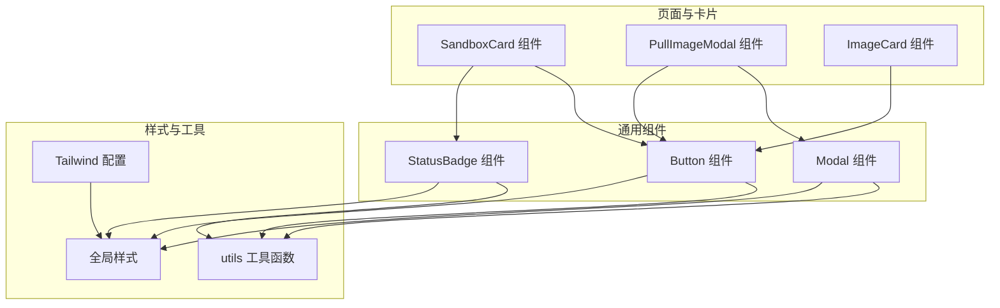
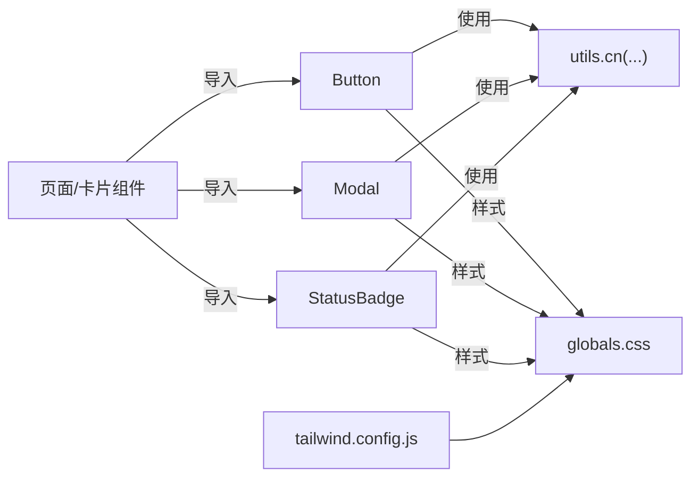
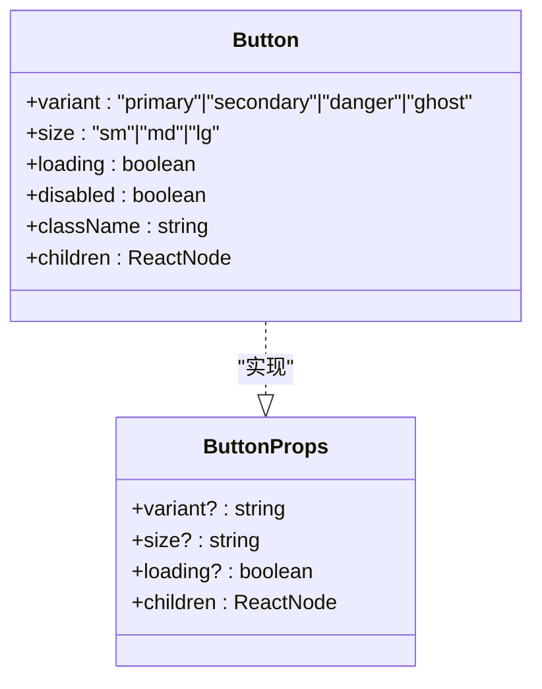
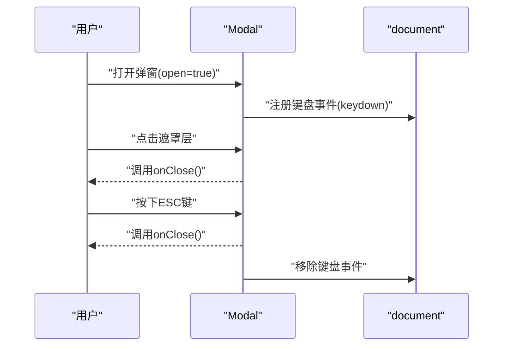
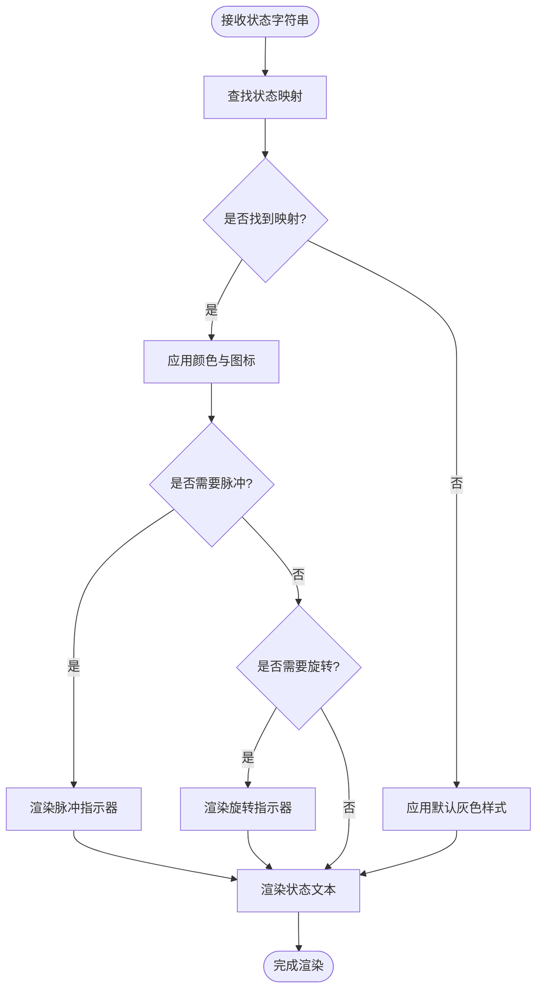
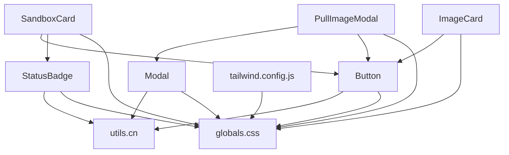

# 通用组件

<cite>
**本文引用的文件**
- [apps/frontend/src/components/common/Button.tsx](file://apps/frontend/src/components/common/Button.tsx)
- [apps/frontend/src/components/common/Modal.tsx](file://apps/frontend/src/components/common/Modal.tsx)
- [apps/frontend/src/components/common/StatusBadge.tsx](file://apps/frontend/src/components/common/StatusBadge.tsx)
- [apps/frontend/src/lib/utils.ts](file://apps/frontend/src/lib/utils.ts)
- [apps/frontend/src/styles/globals.css](file://apps/frontend/src/styles/globals.css)
- [apps/frontend/tailwind.config.js](file://apps/frontend/tailwind.config.js)
- [apps/frontend/src/components/sandbox/SandboxCard.tsx](file://apps/frontend/src/components/sandbox/SandboxCard.tsx)
- [apps/frontend/src/components/images/PullImageModal.tsx](file://apps/frontend/src/components/images/PullImageModal.tsx)
- [apps/frontend/src/components/images/ImageCard.tsx](file://apps/frontend/src/components/images/ImageCard.tsx)
</cite>

## 目录
1. [引言](#引言)
2. [项目结构](#项目结构)
3. [核心组件](#核心组件)
4. [架构总览](#架构总览)
5. [详细组件分析](#详细组件分析)
6. [依赖分析](#依赖分析)
7. [性能考量](#性能考量)
8. [故障排查指南](#故障排查指南)
9. [结论](#结论)
10. [附录](#附录)

## 引言
本设计文档聚焦于 Sandbox Manager 前端通用组件库中的三大基础组件：Button（按钮）、Modal（模态框）与 StatusBadge（状态徽章）。文档从设计原则、可复用性与扩展性出发，系统阐述各组件的样式变体、交互状态与事件处理机制，并结合真实使用场景说明其在页面中的组合方式。同时给出无障碍访问建议、性能优化与最佳实践，帮助团队在保持一致视觉与交互体验的同时，提升开发效率与可维护性。

## 项目结构
通用组件位于前端应用的公共组件目录中，采用按功能分组的组织方式，便于跨页面复用。样式系统基于 Tailwind CSS，通过全局样式与工具函数实现一致的外观与行为。

图表来源
- [apps/frontend/src/components/common/Button.tsx:1-56](file://apps/frontend/src/components/common/Button.tsx#L1-L56)
- [apps/frontend/src/components/common/Modal.tsx:1-44](file://apps/frontend/src/components/common/Modal.tsx#L1-L44)
- [apps/frontend/src/components/common/StatusBadge.tsx:1-40](file://apps/frontend/src/components/common/StatusBadge.tsx#L1-L40)
- [apps/frontend/src/components/sandbox/SandboxCard.tsx:1-67](file://apps/frontend/src/components/sandbox/SandboxCard.tsx#L1-L67)
- [apps/frontend/src/components/images/PullImageModal.tsx:1-99](file://apps/frontend/src/components/images/PullImageModal.tsx#L1-L99)
- [apps/frontend/src/components/images/ImageCard.tsx:1-75](file://apps/frontend/src/components/images/ImageCard.tsx#L1-L75)
- [apps/frontend/src/lib/utils.ts:1-23](file://apps/frontend/src/lib/utils.ts#L1-L23)
- [apps/frontend/tailwind.config.js:1-9](file://apps/frontend/tailwind.config.js#L1-L9)
- [apps/frontend/src/styles/globals.css:1-23](file://apps/frontend/src/styles/globals.css#L1-L23)

章节来源
- [apps/frontend/src/components/common/Button.tsx:1-56](file://apps/frontend/src/components/common/Button.tsx#L1-L56)
- [apps/frontend/src/components/common/Modal.tsx:1-44](file://apps/frontend/src/components/common/Modal.tsx#L1-L44)
- [apps/frontend/src/components/common/StatusBadge.tsx:1-40](file://apps/frontend/src/components/common/StatusBadge.tsx#L1-L40)
- [apps/frontend/src/lib/utils.ts:1-23](file://apps/frontend/src/lib/utils.ts#L1-L23)
- [apps/frontend/tailwind.config.js:1-9](file://apps/frontend/tailwind.config.js#L1-L9)
- [apps/frontend/src/styles/globals.css:1-23](file://apps/frontend/src/styles/globals.css#L1-L23)

## 核心组件
本节概述三大通用组件的设计目标与能力边界：
- Button：提供多变体、多尺寸与加载态的统一按钮入口，支持禁用与无障碍焦点管理。
- Modal：提供受控的弹窗容器，内置 ESC 键盘关闭与背景点击关闭，支持标题、内容与底部操作区。
- StatusBadge：根据状态字符串映射颜色与图标，展示运行时状态的可视化提示。

章节来源
- [apps/frontend/src/components/common/Button.tsx:1-56](file://apps/frontend/src/components/common/Button.tsx#L1-L56)
- [apps/frontend/src/components/common/Modal.tsx:1-44](file://apps/frontend/src/components/common/Modal.tsx#L1-L44)
- [apps/frontend/src/components/common/StatusBadge.tsx:1-40](file://apps/frontend/src/components/common/StatusBadge.tsx#L1-L40)

## 架构总览
通用组件作为页面与业务卡片的底层基础，通过 props 与事件回调解耦上层逻辑；样式通过 Tailwind 类名与全局样式统一风格；工具函数提供类名拼接与时间格式化等通用能力。

图表来源
- [apps/frontend/src/components/common/Button.tsx:1-56](file://apps/frontend/src/components/common/Button.tsx#L1-L56)
- [apps/frontend/src/components/common/Modal.tsx:1-44](file://apps/frontend/src/components/common/Modal.tsx#L1-L44)
- [apps/frontend/src/components/common/StatusBadge.tsx:1-40](file://apps/frontend/src/components/common/StatusBadge.tsx#L1-L40)
- [apps/frontend/src/lib/utils.ts:1-23](file://apps/frontend/src/lib/utils.ts#L1-L23)
- [apps/frontend/src/styles/globals.css:1-23](file://apps/frontend/src/styles/globals.css#L1-L23)
- [apps/frontend/tailwind.config.js:1-9](file://apps/frontend/tailwind.config.js#L1-L9)

## 详细组件分析

### Button 组件
- 设计原则
  - 单一职责：仅负责渲染按钮与处理交互事件，不包含业务逻辑。
  - 可复用性：通过变体与尺寸参数化外观，满足不同场景的视觉与交互需求。
  - 扩展性：支持透传原生 button 属性，便于接入表单、链接等场景。
- 样式变体
  - 变体：primary、secondary、danger、ghost 四种，分别对应主操作、次要操作、危险操作与轻量操作。
  - 尺寸：sm、md、lg 三档，控制内边距与文字大小。
  - 状态：默认、悬停、焦点、禁用与加载态。
- 交互状态与事件处理
  - 加载态：当 loading 为真时显示旋转指示器，同时禁用按钮。
  - 禁用态：disabled 或 loading 同时生效时禁用交互。
  - 焦点管理：保留浏览器默认焦点环与 ring 聚焦样式，保证可访问性。
- 使用示例与组合
  - 在 SandboxCard 中用于连接、暂停/恢复与删除等操作。
  - 在 PullImageModal 与 ImageCard 中用于提交与刷新等动作。
- 样式定制与主题适配
  - 通过 Tailwind 类名组合实现，可在父级容器或全局样式中调整主题色阶。
  - 如需新增变体，建议在组件内部维护一个变体映射表，避免散落的样式字串。

图表来源
- [apps/frontend/src/components/common/Button.tsx:4-9](file://apps/frontend/src/components/common/Button.tsx#L4-L9)
- [apps/frontend/src/components/common/Button.tsx:24-32](file://apps/frontend/src/components/common/Button.tsx#L24-L32)

章节来源
- [apps/frontend/src/components/common/Button.tsx:1-56](file://apps/frontend/src/components/common/Button.tsx#L1-L56)
- [apps/frontend/src/components/sandbox/SandboxCard.tsx:34-62](file://apps/frontend/src/components/sandbox/SandboxCard.tsx#L34-L62)
- [apps/frontend/src/components/images/PullImageModal.tsx:44-57](file://apps/frontend/src/components/images/PullImageModal.tsx#L44-L57)
- [apps/frontend/src/components/images/ImageCard.tsx:58-70](file://apps/frontend/src/components/images/ImageCard.tsx#L58-L70)

### Modal 组件
- 模态框结构
  - 容器：固定定位，z-index 较高，居中布局。
  - 遮罩层：半透明黑色背景，点击触发关闭。
  - 内容区：标题栏、内容区与可选底部操作区。
- 遮罩层处理
  - 点击遮罩层触发 onClose 关闭。
  - 支持 ESC 键盘事件监听，在打开时注册，关闭时清理。
- 事件处理机制
  - 受控渲染：open 为假时不渲染，避免无意义的 DOM。
  - 生命周期：打开时绑定键盘事件，卸载时移除，防止内存泄漏。
- 使用示例
  - PullImageModal 作为图像拉取流程的对话框。
  - SandboxCard 中的创建沙箱流程也以内嵌 Modal 形式呈现。

图表来源
- [apps/frontend/src/components/common/Modal.tsx:11-19](file://apps/frontend/src/components/common/Modal.tsx#L11-L19)
- [apps/frontend/src/components/common/Modal.tsx:23-42](file://apps/frontend/src/components/common/Modal.tsx#L23-L42)

章节来源
- [apps/frontend/src/components/common/Modal.tsx:1-44](file://apps/frontend/src/components/common/Modal.tsx#L1-L44)
- [apps/frontend/src/components/images/PullImageModal.tsx:43-97](file://apps/frontend/src/components/images/PullImageModal.tsx#L43-L97)
- [apps/frontend/src/components/sandbox/SandboxCard.tsx:73-87](file://apps/frontend/src/components/sandbox/SandboxCard.tsx#L73-L87)

### StatusBadge 组件
- 状态显示
  - 根据状态字符串映射到预设的颜色方案与图标。
  - 支持运行中与就绪状态的脉冲动画指示。
  - 支持创建、暂停、恢复、拉取过程中的旋转指示器。
- 颜色编码
  - 不同状态使用不同的背景与文本色，确保语义清晰。
- 动态更新
  - 通过外部状态驱动，组件内部不持有状态，适合在卡片或列表中频繁更新。
- 使用示例
  - SandboxCard 中展示沙箱当前状态。
  - 可在其他列表或详情页中复用，用于实时状态反馈。

图表来源
- [apps/frontend/src/components/common/StatusBadge.tsx:19-39](file://apps/frontend/src/components/common/StatusBadge.tsx#L19-L39)
- [apps/frontend/src/components/sandbox/SandboxCard.tsx:24](file://apps/frontend/src/components/sandbox/SandboxCard.tsx#L24)

章节来源
- [apps/frontend/src/components/common/StatusBadge.tsx:1-40](file://apps/frontend/src/components/common/StatusBadge.tsx#L1-L40)
- [apps/frontend/src/components/sandbox/SandboxCard.tsx:14-32](file://apps/frontend/src/components/sandbox/SandboxCard.tsx#L14-L32)

## 依赖分析
- 组件间关系
  - SandboxCard 同时依赖 Button 与 StatusBadge，形成“操作+状态”的典型 UI 组合。
  - PullImageModal 依赖 Modal 与 Button，作为业务流程的对话框载体。
  - ImageCard 依赖 Button，用于刷新与删除等动作。
- 外部依赖
  - 工具函数 cn 用于安全合并类名，避免空值与布尔值导致的样式异常。
  - Tailwind CSS 提供原子化样式，配合全局样式实现一致的排版与滚动条风格。
  - 全局样式覆盖浏览器默认滚动条样式，提升阅读体验。

图表来源
- [apps/frontend/src/components/sandbox/SandboxCard.tsx:1-67](file://apps/frontend/src/components/sandbox/SandboxCard.tsx#L1-L67)
- [apps/frontend/src/components/images/PullImageModal.tsx:1-99](file://apps/frontend/src/components/images/PullImageModal.tsx#L1-L99)
- [apps/frontend/src/components/images/ImageCard.tsx:1-75](file://apps/frontend/src/components/images/ImageCard.tsx#L1-L75)
- [apps/frontend/src/components/common/Button.tsx:1-56](file://apps/frontend/src/components/common/Button.tsx#L1-L56)
- [apps/frontend/src/components/common/Modal.tsx:1-44](file://apps/frontend/src/components/common/Modal.tsx#L1-L44)
- [apps/frontend/src/components/common/StatusBadge.tsx:1-40](file://apps/frontend/src/components/common/StatusBadge.tsx#L1-L40)
- [apps/frontend/src/lib/utils.ts:1-23](file://apps/frontend/src/lib/utils.ts#L1-L23)
- [apps/frontend/src/styles/globals.css:1-23](file://apps/frontend/src/styles/globals.css#L1-L23)
- [apps/frontend/tailwind.config.js:1-9](file://apps/frontend/tailwind.config.js#L1-L9)

章节来源
- [apps/frontend/src/lib/utils.ts:20-22](file://apps/frontend/src/lib/utils.ts#L20-L22)
- [apps/frontend/src/styles/globals.css:1-23](file://apps/frontend/src/styles/globals.css#L1-L23)
- [apps/frontend/tailwind.config.js:1-9](file://apps/frontend/tailwind.config.js#L1-L9)

## 性能考量
- 渲染开销
  - Button 与 StatusBadge 为纯展示组件，渲染成本低；Modal 在 open 为假时不渲染，减少不必要的 DOM。
- 事件绑定
  - Modal 的 ESC 监听在打开时注册，关闭时清理，避免重复绑定与内存泄漏。
- 样式体积
  - Tailwind 原子类按需生成，建议在生产环境启用 Tree Shaking 与 Purge，降低 CSS 体积。
- 图标与动画
  - 旋转与脉冲动画均为轻量 SVG，对性能影响较小；如需进一步优化，可考虑在长列表中延迟渲染或虚拟化。

## 故障排查指南
- 按钮无法点击
  - 检查是否传入 loading 或 disabled 导致禁用。
  - 确认父级容器未覆盖按钮区域。
- 模态框 ESC 无效
  - 确认 open 为真且未被外部逻辑提前关闭。
  - 检查是否有更高层级的事件拦截阻止了键盘事件冒泡。
- 状态徽章颜色异常
  - 确认传入的状态字符串与映射表一致，注意大小写与拼写。
  - 若状态不在映射表中，将回退到默认灰色样式。
- 样式错乱
  - 检查 Tailwind 配置与全局样式是否正确引入。
  - 确认未被局部样式覆盖关键类名。

章节来源
- [apps/frontend/src/components/common/Button.tsx:24-45](file://apps/frontend/src/components/common/Button.tsx#L24-L45)
- [apps/frontend/src/components/common/Modal.tsx:12-19](file://apps/frontend/src/components/common/Modal.tsx#L12-L19)
- [apps/frontend/src/components/common/StatusBadge.tsx:19-25](file://apps/frontend/src/components/common/StatusBadge.tsx#L19-L25)
- [apps/frontend/src/styles/globals.css:1-23](file://apps/frontend/src/styles/globals.css#L1-L23)

## 结论
通用组件库通过简洁的接口与一致的样式体系，实现了高复用与强扩展性。Button、Modal 与 StatusBadge 分别覆盖了交互入口、容器与状态展示三大核心场景。结合 Tailwind 与工具函数，团队可以在不牺牲一致性的情况下快速迭代界面。建议在后续版本中完善无障碍属性（如 aria-*）与国际化文案，持续优化性能与可维护性。

## 附录
- 无障碍访问建议
  - Button：保留默认焦点环，必要时补充 aria-disabled；为危险操作提供确认提示。
  - Modal：设置 role="dialog" 与 aria-modal="true"，确保标题与关闭按钮具备可读标签。
  - StatusBadge：为状态图标补充 aria-label，确保读屏器可正确播报。
- 样式定制与主题适配
  - 通过 Tailwind 主题扩展与 CSS 变量，集中管理品牌色与状态色。
  - 对常用尺寸与间距进行常量抽象，避免散落的像素值。
- 最佳实践
  - 将交互与状态分离，组件只负责渲染与事件透传。
  - 在列表场景中使用 key 与 memo 化，减少重渲染。
  - 对长列表中的图标与动画进行懒加载或条件渲染。