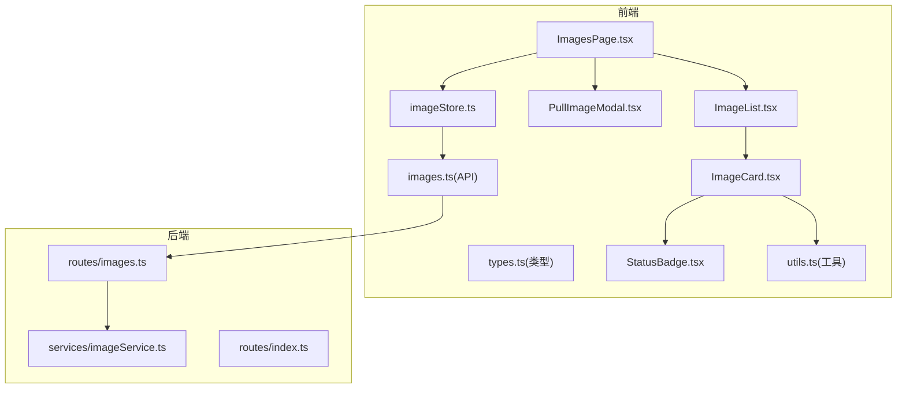
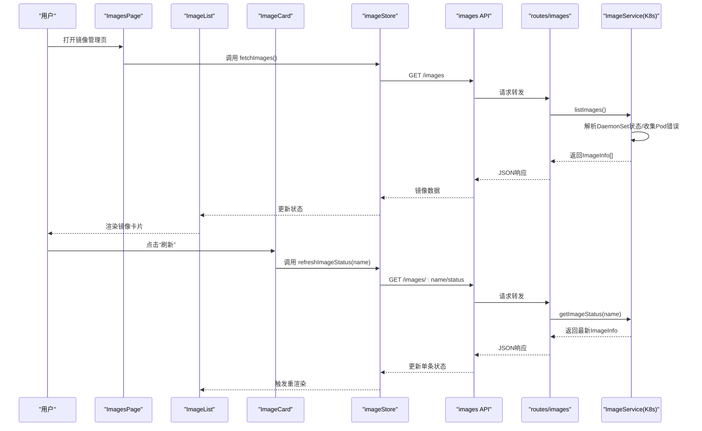
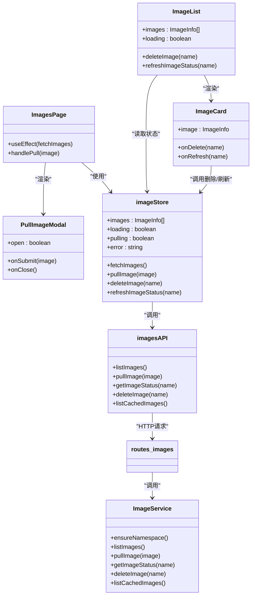

# 镜像管理组件

<cite>
**本文引用的文件**
- [ImageList.tsx](file://apps/frontend/src/components/images/ImageList.tsx)
- [ImageCard.tsx](file://apps/frontend/src/components/images/ImageCard.tsx)
- [PullImageModal.tsx](file://apps/frontend/src/components/images/PullImageModal.tsx)
- [imageStore.ts](file://apps/frontend/src/stores/imageStore.ts)
- [images.ts](file://apps/frontend/src/api/images.ts)
- [types.ts](file://apps/frontend/src/api/types.ts)
- [ImagesPage.tsx](file://apps/frontend/src/pages/ImagesPage.tsx)
- [imageService.ts](file://apps/backend/src/services/imageService.ts)
- [images.ts](file://apps/backend/src/routes/images.ts)
- [index.ts](file://apps/backend/src/routes/index.ts)
- [StatusBadge.tsx](file://apps/frontend/src/components/common/StatusBadge.tsx)
- [utils.ts](file://apps/frontend/src/lib/utils.ts)
</cite>

## 目录
1. [简介](#简介)
2. [项目结构](#项目结构)
3. [核心组件](#核心组件)
4. [架构总览](#架构总览)
5. [详细组件分析](#详细组件分析)
6. [依赖关系分析](#依赖关系分析)
7. [性能考虑](#性能考虑)
8. [故障排查指南](#故障排查指南)
9. [结论](#结论)
10. [附录](#附录)

## 简介
本设计文档聚焦于Sandbox Manager的镜像管理组件，系统性阐述以下方面：
- ImageList组件：镜像列表展示、加载占位、空态提示与卡片渲染。
- ImageCard组件：镜像信息显示、状态标识、删除确认与刷新操作。
- PullImageModal组件：镜像拉取对话框、预设镜像选择、输入校验、提交流程与错误处理。
- 业务逻辑与数据流：前端状态管理（Zustand）、后端服务（ImageService）与Kubernetes DaemonSet集成。
- 数据同步与状态更新：列表刷新、单条状态查询、删除后的本地状态更新。
- 使用示例、配置选项与自定义方法：如何在页面中集成、如何扩展预设镜像与错误提示。
- 缓存策略、网络优化与用户体验：命名空间隔离、Pod错误聚合、相对时间格式化、加载骨架屏等。

## 项目结构
镜像管理相关代码主要分布在前端组件与后端服务层：
- 前端组件：ImageList、ImageCard、PullImageModal，以及页面ImagesPage。
- 前端状态与API：imageStore、images API模块、类型定义。
- 后端服务：ImageService负责与Kubernetes交互；routes/images.ts提供REST接口。
- 公共组件与工具：StatusBadge用于状态徽章；utils提供相对时间格式化。

图表来源
- [ImagesPage.tsx:1-44](file://apps/frontend/src/pages/ImagesPage.tsx#L1-L44)
- [ImageList.tsx:1-51](file://apps/frontend/src/components/images/ImageList.tsx#L1-L51)
- [ImageCard.tsx:1-75](file://apps/frontend/src/components/images/ImageCard.tsx#L1-L75)
- [PullImageModal.tsx:1-99](file://apps/frontend/src/components/images/PullImageModal.tsx#L1-L99)
- [imageStore.ts:1-60](file://apps/frontend/src/stores/imageStore.ts#L1-L60)
- [images.ts:1-23](file://apps/frontend/src/api/images.ts#L1-L23)
- [types.ts:98-116](file://apps/frontend/src/api/types.ts#L98-L116)
- [StatusBadge.tsx:1-40](file://apps/frontend/src/components/common/StatusBadge.tsx#L1-L40)
- [utils.ts:5-18](file://apps/frontend/src/lib/utils.ts#L5-L18)
- [images.ts:1-78](file://apps/backend/src/routes/images.ts#L1-L78)
- [imageService.ts:95-385](file://apps/backend/src/services/imageService.ts#L95-L385)
- [index.ts:1-18](file://apps/backend/src/routes/index.ts#L1-L18)

章节来源
- [ImagesPage.tsx:1-44](file://apps/frontend/src/pages/ImagesPage.tsx#L1-L44)
- [ImageList.tsx:1-51](file://apps/frontend/src/components/images/ImageList.tsx#L1-L51)
- [imageStore.ts:1-60](file://apps/frontend/src/stores/imageStore.ts#L1-L60)
- [images.ts:1-23](file://apps/frontend/src/api/images.ts#L1-L23)
- [types.ts:98-116](file://apps/frontend/src/api/types.ts#L98-L116)
- [images.ts:1-78](file://apps/backend/src/routes/images.ts#L1-L78)
- [imageService.ts:95-385](file://apps/backend/src/services/imageService.ts#L95-L385)

## 核心组件
- ImageList：负责渲染镜像卡片网格，处理加载占位、空态提示与错误展示，并将删除与刷新动作传递给子组件。
- ImageCard：展示镜像名称、节点就绪情况、创建时间与错误消息，提供“刷新”和“删除”操作，删除采用二次确认。
- PullImageModal：提供镜像拉取对话框，支持预设镜像下拉与自定义输入，包含表单校验、提交状态与错误提示。
- imageStore：集中管理镜像列表、拉取状态、错误信息，封装API调用并维护本地状态。
- ImageService：后端服务，负责确保命名空间、创建/删除DaemonSet、解析状态、收集Pod错误信息并返回标准化的ImageInfo。

章节来源
- [ImageList.tsx:1-51](file://apps/frontend/src/components/images/ImageList.tsx#L1-L51)
- [ImageCard.tsx:1-75](file://apps/frontend/src/components/images/ImageCard.tsx#L1-L75)
- [PullImageModal.tsx:1-99](file://apps/frontend/src/components/images/PullImageModal.tsx#L1-L99)
- [imageStore.ts:1-60](file://apps/frontend/src/stores/imageStore.ts#L1-L60)
- [imageService.ts:95-385](file://apps/backend/src/services/imageService.ts#L95-L385)

## 架构总览
镜像管理采用前后端分离架构：
- 前端通过Zustand状态管理镜像列表与操作状态，调用API模块发起HTTP请求。
- 后端提供REST接口，ImageService通过kubectl命令与Kubernetes交互，以DaemonSet方式在所有节点上预拉取镜像。
- ImageCard中的状态徽章根据ImageInfo.status动态渲染，支持“pulling/ready/error”三种状态。

图表来源
- [ImagesPage.tsx:14-20](file://apps/frontend/src/pages/ImagesPage.tsx#L14-L20)
- [imageStore.ts:23-58](file://apps/frontend/src/stores/imageStore.ts#L23-L58)
- [images.ts:4-18](file://apps/frontend/src/api/images.ts#L4-L18)
- [images.ts:26-65](file://apps/backend/src/routes/images.ts#L26-L65)
- [imageService.ts:196-222](file://apps/backend/src/services/imageService.ts#L196-L222)
- [imageService.ts:299-317](file://apps/backend/src/services/imageService.ts#L299-L317)

## 详细组件分析

### ImageList 组件
职责与行为
- 加载态：当loading为真且无数据时，渲染网格骨架屏，提升感知速度。
- 空态：当无镜像数据时，显示“暂无预拉取镜像”的提示与说明图标。
- 正常态：遍历镜像数组，为每个镜像渲染一个ImageCard，并注入删除与刷新回调。

关键点
- 通过useImageStore读取images、loading、deleteImage、refreshImageStatus。
- 删除与刷新均以daemonSetName作为唯一键进行操作，保证精确更新。

章节来源
- [ImageList.tsx:4-50](file://apps/frontend/src/components/images/ImageList.tsx#L4-L50)
- [imageStore.ts:17-59](file://apps/frontend/src/stores/imageStore.ts#L17-L59)

### ImageCard 组件
职责与行为
- 展示镜像信息：显示原始镜像名（可截断）、显示名、节点就绪数/总数、创建时间（相对时间格式化）、错误消息。
- 状态标识：使用StatusBadge根据status渲染不同颜色与动画。
- 操作按钮：
  - 刷新：调用onRefresh传入daemonSetName。
  - 删除：二次确认（首次点击进入确认态，再次点击才真正删除），删除成功后由父组件触发列表更新。

交互细节
- 删除按钮采用悬停/失焦清除确认态，避免误触。
- 错误消息仅在存在时显示，保持界面简洁。

章节来源
- [ImageCard.tsx:13-74](file://apps/frontend/src/components/images/ImageCard.tsx#L13-L74)
- [StatusBadge.tsx:19-39](file://apps/frontend/src/components/common/StatusBadge.tsx#L19-L39)
- [utils.ts:5-18](file://apps/frontend/src/lib/utils.ts#L5-L18)

### PullImageModal 组件
职责与行为
- 提供镜像拉取对话框，支持两种输入方式：
  - 预设镜像下拉：包含固定列表，若用户选择“自定义”，则在下拉中显示当前值。
  - 自定义输入：允许用户输入任意镜像地址。
- 表单校验：必填检查，空字符串或空白字符将触发错误提示。
- 提交流程：设置提交中状态，调用onSubmit(image)，成功后关闭对话框；失败捕获异常并显示错误信息。
- Footer包含取消与拉取按钮，拉取按钮在提交中状态下显示加载态。

预设镜像
- 默认包含一组常用镜像，便于快速选择。

章节来源
- [PullImageModal.tsx:20-98](file://apps/frontend/src/components/images/PullImageModal.tsx#L20-L98)
- [images.ts:8-10](file://apps/frontend/src/api/images.ts#L8-L10)

### 状态管理与数据流（imageStore）
状态字段
- images：镜像列表。
- loading：是否正在加载。
- pulling：是否正在拉取。
- error：最近一次错误信息。

核心方法
- fetchImages：调用listImages API，成功后更新images，失败记录error。
- pullImage：调用pullImage API，成功后重新拉取列表并重置状态，失败记录error并抛出异常。
- deleteImage：调用deleteImage API，成功后从本地列表移除对应项。
- refreshImageStatus：调用getImageStatus API，成功后替换本地对应项。

章节来源
- [imageStore.ts:17-59](file://apps/frontend/src/stores/imageStore.ts#L17-L59)
- [images.ts:4-18](file://apps/frontend/src/api/images.ts#L4-L18)

### 后端服务与业务逻辑（ImageService）
命名空间与资源
- 确保opensandbox-images命名空间存在，避免重复创建。
- 通过DaemonSet在所有节点上运行initContainer执行镜像拉取，pause容器仅占位，资源极小。

状态解析
- 从DaemonSet状态计算nodesReady/nodesTotal。
- 优先从Pod容器状态提取错误原因（如ImagePullBackOff、ErrImagePull、CrashLoopBackOff），否则回退到DaemonSet条件消息。
- 返回标准化的ImageInfo对象，包含name、image、status、daemonSetName、createdAt、nodesReady、nodesTotal、message。

镜像拉取
- 将用户输入的镜像名进行安全化处理，生成合法的K8s资源名。
- 应用标签与注解，保留原始镜像名以便UI展示。
- 创建DaemonSet后立即返回“pulling”状态，后续通过getStatus刷新。

删除镜像
- 删除对应的DaemonSet即移除该镜像的预拉取缓存。

章节来源
- [imageService.ts:105-116](file://apps/backend/src/services/imageService.ts#L105-L116)
- [imageService.ts:196-222](file://apps/backend/src/services/imageService.ts#L196-L222)
- [imageService.ts:227-294](file://apps/backend/src/services/imageService.ts#L227-L294)
- [imageService.ts:299-317](file://apps/backend/src/services/imageService.ts#L299-L317)
- [imageService.ts:322-339](file://apps/backend/src/services/imageService.ts#L322-L339)

### API与路由
前端API
- listImages：GET /images
- pullImage：POST /images
- getImageStatus：GET /images/:name/status
- deleteImage：DELETE /images/:name
- listCachedImages：GET /images/cached

后端路由
- /images：GET返回所有预拉取镜像；POST创建新镜像拉取任务；DELETE删除指定镜像；/:name/status GET返回单个镜像状态；/:name DELETE删除镜像。

章节来源
- [images.ts:4-22](file://apps/frontend/src/api/images.ts#L4-L22)
- [images.ts:26-77](file://apps/backend/src/routes/images.ts#L26-L77)
- [index.ts:9-15](file://apps/backend/src/routes/index.ts#L9-L15)

## 依赖关系分析
组件与模块之间的依赖关系如下：

图表来源
- [ImagesPage.tsx:9-43](file://apps/frontend/src/pages/ImagesPage.tsx#L9-L43)
- [ImageList.tsx:4-50](file://apps/frontend/src/components/images/ImageList.tsx#L4-L50)
- [ImageCard.tsx:13-74](file://apps/frontend/src/components/images/ImageCard.tsx#L13-L74)
- [PullImageModal.tsx:20-98](file://apps/frontend/src/components/images/PullImageModal.tsx#L20-L98)
- [imageStore.ts:17-59](file://apps/frontend/src/stores/imageStore.ts#L17-L59)
- [images.ts:4-22](file://apps/frontend/src/api/images.ts#L4-L22)
- [images.ts:26-77](file://apps/backend/src/routes/images.ts#L26-L77)
- [imageService.ts:95-385](file://apps/backend/src/services/imageService.ts#L95-L385)

## 性能考虑
- 加载骨架屏：ImageList在加载时渲染骨架屏，减少白屏时间，提升感知性能。
- 本地状态更新：删除与刷新通过局部替换而非全量刷新，降低重渲染成本。
- 资源最小化：DaemonSet中的pause容器仅占位，initContainer执行拉取，资源占用极低。
- 相对时间格式化：使用utils.formatRelativeTime避免频繁计算，减少渲染开销。
- 命名空间隔离：统一在opensandbox-images命名空间管理镜像资源，避免与其他工作负载冲突。

章节来源
- [ImageList.tsx:7-22](file://apps/frontend/src/components/images/ImageList.tsx#L7-L22)
- [imageStore.ts:46-58](file://apps/frontend/src/stores/imageStore.ts#L46-L58)
- [utils.ts:5-18](file://apps/frontend/src/lib/utils.ts#L5-L18)
- [imageService.ts:254-269](file://apps/backend/src/services/imageService.ts#L254-L269)

## 故障排查指南
常见问题与处理建议
- 拉取失败（ImagePullBackOff/ErrImagePull/CrashLoopBackOff）：
  - 后端会从Pod容器状态提取错误原因并写入ImageInfo.message，前端在ImageCard中显示红色错误消息。
  - 建议检查镜像仓库凭证、网络连通性与镜像名称拼写。
- DaemonSet不存在：
  - getImageStatus在找不到资源时会抛出错误，前端应捕获并提示用户。
- 删除失败：
  - 若DaemonSet已被删除，后端会返回“not found”，前端应提示用户资源已不存在。
- 状态不更新：
  - 确认refreshImageStatus调用成功，检查本地状态替换逻辑是否生效。
- 预设镜像与自定义输入：
  - 当用户选择“自定义”时，下拉中会显示当前输入值，确保用户能正确识别所选镜像。

章节来源
- [imageService.ts:54-82](file://apps/backend/src/services/imageService.ts#L54-L82)
- [imageService.ts:307-312](file://apps/backend/src/services/imageService.ts#L307-L312)
- [ImageCard.tsx:53-55](file://apps/frontend/src/components/images/ImageCard.tsx#L53-L55)

## 结论
镜像管理组件通过清晰的分层设计实现了从UI到后端服务的完整闭环：
- 前端以组件为中心，结合Zustand状态管理，提供直观的镜像列表、卡片展示与拉取对话框。
- 后端以ImageService为核心，基于Kubernetes DaemonSet实现跨节点镜像预拉取，并通过Pod错误聚合提供准确的状态反馈。
- 通过骨架屏、状态徽章与错误消息等UI细节，显著提升了用户体验与可诊断性。

## 附录

### 使用示例
- 在页面中集成镜像管理：
  - 在ImagesPage中初始化并调用fetchImages，渲染ImageList与PullImageModal。
  - 通过useImageStore的pullImage与deleteImage完成镜像生命周期管理。
- 自定义预设镜像：
  - 可在PullImageModal的PRESET_IMAGES中添加更多默认镜像，便于团队复用。
- 自定义错误提示：
  - 可在PullImageModal中扩展错误消息的展示逻辑，例如增加更详细的错误分类与引导。

章节来源
- [ImagesPage.tsx:9-43](file://apps/frontend/src/pages/ImagesPage.tsx#L9-L43)
- [PullImageModal.tsx:11-18](file://apps/frontend/src/components/images/PullImageModal.tsx#L11-L18)
- [PullImageModal.tsx:60-62](file://apps/frontend/src/components/images/PullImageModal.tsx#L60-L62)

### 配置选项与最佳实践
- 配置项
  - 预设镜像列表：可在前端组件中维护，便于统一管理。
  - 状态徽章样式：通过StatusBadge的样式映射控制不同状态的视觉表现。
- 最佳实践
  - 在删除前进行二次确认，避免误删。
  - 定期刷新状态，确保UI与后端状态一致。
  - 对于大镜像或网络较差环境，建议先拉取至部分节点验证后再全量部署。

章节来源
- [PullImageModal.tsx:11-18](file://apps/frontend/src/components/images/PullImageModal.tsx#L11-L18)
- [StatusBadge.tsx:7-17](file://apps/frontend/src/components/common/StatusBadge.tsx#L7-L17)