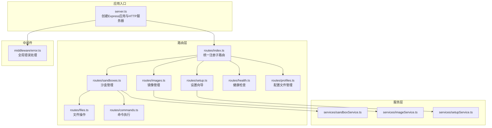
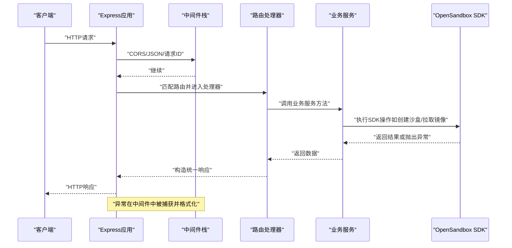
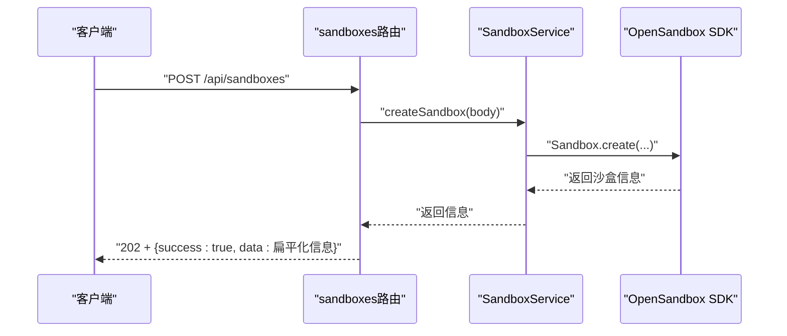
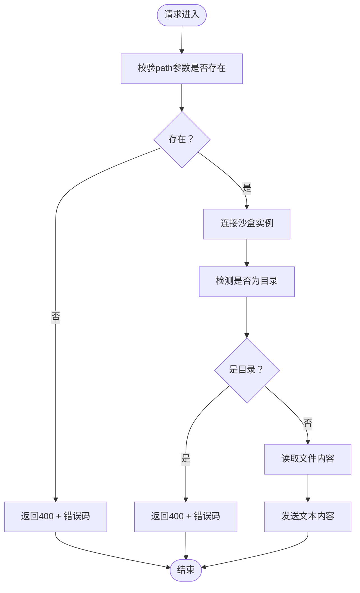
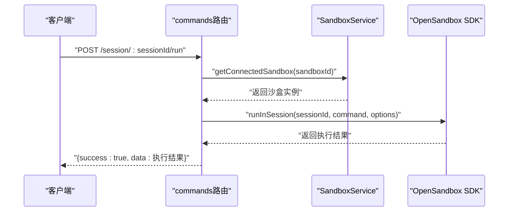
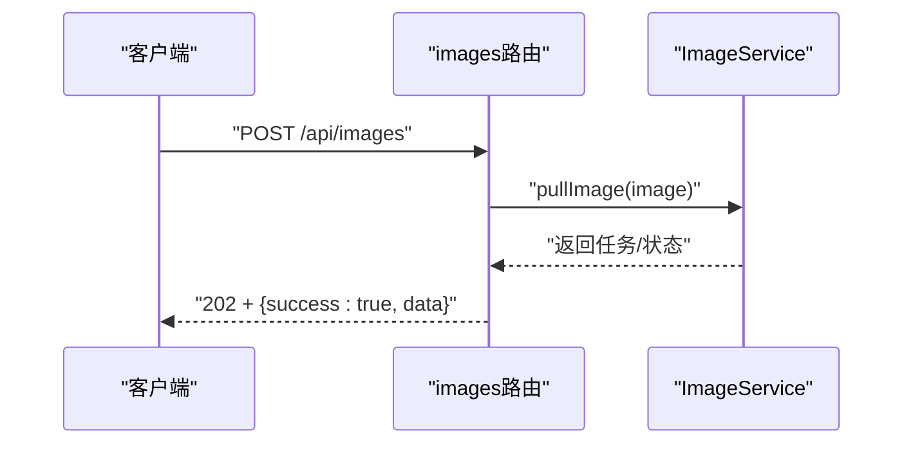
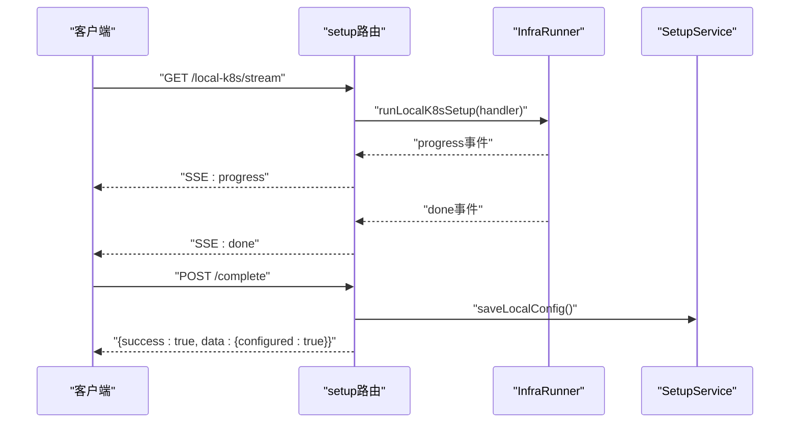
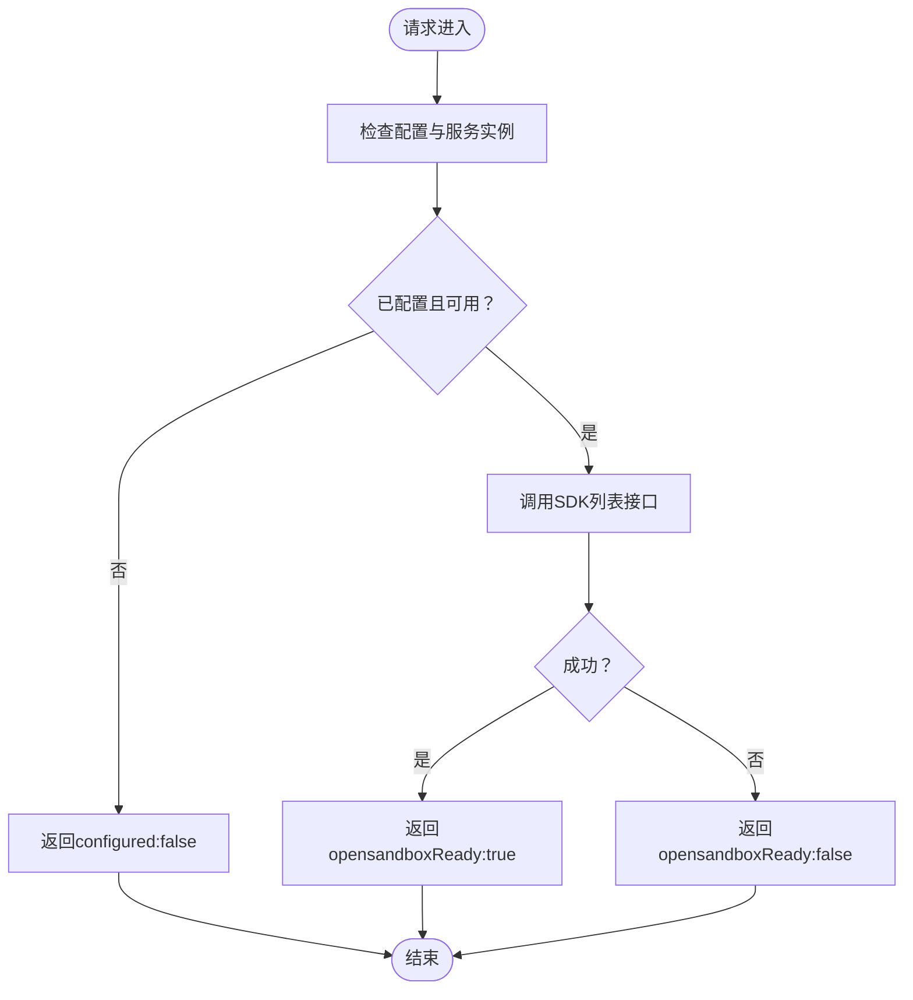
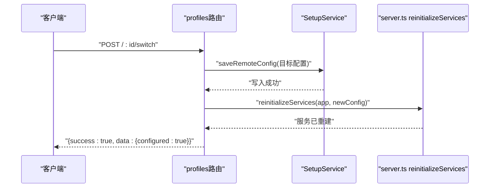
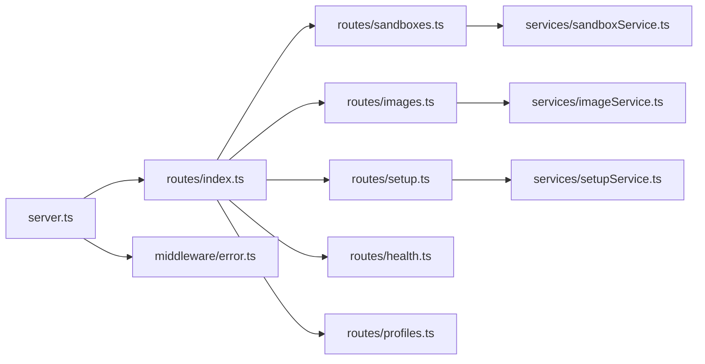

# API路由系统

<cite>
**本文引用的文件**
- [apps/backend/src/routes/index.ts](file://apps/backend/src/routes/index.ts)
- [apps/backend/src/routes/sandboxes.ts](file://apps/backend/src/routes/sandboxes.ts)
- [apps/backend/src/routes/files.ts](file://apps/backend/src/routes/files.ts)
- [apps/backend/src/routes/commands.ts](file://apps/backend/src/routes/commands.ts)
- [apps/backend/src/routes/setup.ts](file://apps/backend/src/routes/setup.ts)
- [apps/backend/src/routes/health.ts](file://apps/backend/src/routes/health.ts)
- [apps/backend/src/routes/images.ts](file://apps/backend/src/routes/images.ts)
- [apps/backend/src/routes/profiles.ts](file://apps/backend/src/routes/profiles.ts)
- [apps/backend/src/middleware/error.ts](file://apps/backend/src/middleware/error.ts)
- [apps/backend/src/server.ts](file://apps/backend/src/server.ts)
- [apps/backend/src/types/index.ts](file://apps/backend/src/types/index.ts)
- [apps/backend/src/config.ts](file://apps/backend/src/config.ts)
- [apps/backend/src/services/sandboxService.ts](file://apps/backend/src/services/sandboxService.ts)
- [apps/backend/src/services/imageService.ts](file://apps/backend/src/services/imageService.ts)
- [apps/backend/src/services/setupService.ts](file://apps/backend/src/services/setupService.ts)
</cite>

## 目录
1. [简介](#简介)
2. [项目结构](#项目结构)
3. [核心组件](#核心组件)
4. [架构总览](#架构总览)
5. [详细组件分析](#详细组件分析)
6. [依赖关系分析](#依赖关系分析)
7. [性能考虑](#性能考虑)
8. [故障排查指南](#故障排查指南)
9. [结论](#结论)
10. [附录：API调用示例与规范](#附录api调用示例与规范)

## 简介
本文件面向Sandbox Manager后端的API路由系统，系统性阐述REST API设计原则与实现细节，覆盖以下主题：
- 路由分层与职责划分：沙盒管理、文件操作、命令执行、镜像管理、设置向导、健康检查、配置文件管理等
- 中间件体系：错误处理、请求ID注入、CORS、日志记录、请求体解析
- API版本控制策略与错误响应格式、HTTP状态码规范
- 典型调用流程与示例，含请求参数、响应格式、错误处理
- 性能优化建议、安全防护与监控指标

## 项目结构
后端采用Express应用，通过统一入口注册路由，并在应用上下文中注入服务实例与配置信息。路由按功能域拆分到独立模块，便于维护与扩展。

图表来源
- [apps/backend/src/server.ts:36-90](file://apps/backend/src/server.ts#L36-L90)
- [apps/backend/src/routes/index.ts:9-18](file://apps/backend/src/routes/index.ts#L9-L18)
- [apps/backend/src/routes/sandboxes.ts:1-175](file://apps/backend/src/routes/sandboxes.ts#L1-L175)
- [apps/backend/src/routes/files.ts:1-327](file://apps/backend/src/routes/files.ts#L1-L327)
- [apps/backend/src/routes/commands.ts:1-95](file://apps/backend/src/routes/commands.ts#L1-L95)
- [apps/backend/src/routes/images.ts:1-78](file://apps/backend/src/routes/images.ts#L1-L78)
- [apps/backend/src/routes/setup.ts:1-139](file://apps/backend/src/routes/setup.ts#L1-L139)
- [apps/backend/src/routes/health.ts:1-52](file://apps/backend/src/routes/health.ts#L1-L52)
- [apps/backend/src/routes/profiles.ts:1-162](file://apps/backend/src/routes/profiles.ts#L1-L162)
- [apps/backend/src/middleware/error.ts:1-48](file://apps/backend/src/middleware/error.ts#L1-L48)
- [apps/backend/src/services/sandboxService.ts:1-148](file://apps/backend/src/services/sandboxService.ts#L1-L148)
- [apps/backend/src/services/imageService.ts:1-200](file://apps/backend/src/services/imageService.ts#L1-L200)
- [apps/backend/src/services/setupService.ts:1-147](file://apps/backend/src/services/setupService.ts#L1-L147)

章节来源
- [apps/backend/src/server.ts:36-90](file://apps/backend/src/server.ts#L36-L90)
- [apps/backend/src/routes/index.ts:9-18](file://apps/backend/src/routes/index.ts#L9-L18)

## 核心组件
- 应用与中间件
  - CORS与JSON解析：在应用启动时注入CORS与JSON解析中间件，限制请求体大小
  - 请求ID注入：为每个请求生成唯一ID，便于链路追踪
  - 全局错误处理：集中捕获异常，输出统一错误响应格式
- 服务初始化与热重载
  - 根据配置决定是否启用沙盒服务；支持运行时重新加载服务与配置
- 路由注册
  - 统一在入口注册各业务路由前缀，避免重复逻辑

章节来源
- [apps/backend/src/server.ts:36-90](file://apps/backend/src/server.ts#L36-L90)
- [apps/backend/src/middleware/error.ts:1-48](file://apps/backend/src/middleware/error.ts#L1-L48)
- [apps/backend/src/config.ts:48-71](file://apps/backend/src/config.ts#L48-L71)

## 架构总览
下图展示了从客户端到路由、服务与外部SDK的交互路径，以及错误处理贯穿始终的机制。

图表来源
- [apps/backend/src/server.ts:36-90](file://apps/backend/src/server.ts#L36-L90)
- [apps/backend/src/middleware/error.ts:1-48](file://apps/backend/src/middleware/error.ts#L1-L48)
- [apps/backend/src/routes/sandboxes.ts:96-105](file://apps/backend/src/routes/sandboxes.ts#L96-L105)
- [apps/backend/src/services/sandboxService.ts:112-123](file://apps/backend/src/services/sandboxService.ts#L112-L123)

## 详细组件分析

### 沙盒管理路由（/api/sandboxes）
- 功能概览
  - 列表查询、创建、详情、删除、暂停/恢复、端点URL生成
  - 子路由挂载：/:sandboxId/files、/:sandboxId/commands
  - 配置守卫：未完成设置时拒绝操作
- 关键实现要点
  - 数据归一化：将SDK返回的复杂状态结构扁平化为前端期望格式
  - 过滤过期沙盒：按到期时间过滤
  - 端点URL：根据协议自动推断scheme/host/port
- 典型流程（创建沙盒）

图表来源
- [apps/backend/src/routes/sandboxes.ts:96-105](file://apps/backend/src/routes/sandboxes.ts#L96-L105)
- [apps/backend/src/services/sandboxService.ts:74-88](file://apps/backend/src/services/sandboxService.ts#L74-L88)

章节来源
- [apps/backend/src/routes/sandboxes.ts:1-175](file://apps/backend/src/routes/sandboxes.ts#L1-L175)
- [apps/backend/src/services/sandboxService.ts:1-148](file://apps/backend/src/services/sandboxService.ts#L1-L148)

### 文件操作路由（/api/sandboxes/:sandboxId/files）
- 功能概览
  - 目录列表（优先搜索API，失败回退ls+stat）
  - 读取文本内容与二进制下载
  - 写入文件、创建目录、移动/重命名、删除文件/目录
- 关键实现要点
  - 目录列表算法：先用搜索API获取直接子项，再基于路径推断隐藏目录
  - 回退策略：当搜索API不可用时，使用ls -1Ap命令进行列举
  - 安全与校验：读取前检测是否为目录；必填字段缺失时返回400
- 典型流程（读取文件内容）

图表来源
- [apps/backend/src/routes/files.ts:47-69](file://apps/backend/src/routes/files.ts#L47-L69)

章节来源
- [apps/backend/src/routes/files.ts:1-327](file://apps/backend/src/routes/files.ts#L1-L327)

### 命令执行路由（/api/sandboxes/:sandboxId/commands）
- 功能概览
  - 单次命令执行（聚合响应）
  - Bash会话：创建会话、在会话内运行命令、删除会话
- 关键实现要点
  - 参数校验：缺少命令时返回400
  - 会话生命周期：基于会话ID复用命令通道，减少连接开销
- 典型流程（在会话内运行命令）

图表来源
- [apps/backend/src/routes/commands.ts:56-78](file://apps/backend/src/routes/commands.ts#L56-L78)
- [apps/backend/src/services/sandboxService.ts:112-123](file://apps/backend/src/services/sandboxService.ts#L112-L123)

章节来源
- [apps/backend/src/routes/commands.ts:1-95](file://apps/backend/src/routes/commands.ts#L1-L95)
- [apps/backend/src/services/sandboxService.ts:112-123](file://apps/backend/src/services/sandboxService.ts#L112-L123)

### 镜像管理路由（/api/images）
- 功能概览
  - 列出缓存镜像、列出所有预拉取镜像、拉取新镜像、查询镜像状态、删除镜像
- 关键实现要点
  - 拉取镜像：异步202响应，后续可通过状态接口轮询
  - 缓存镜像：通过Kubernetes DaemonSet状态汇总节点就绪数
- 典型流程（拉取镜像）

图表来源
- [apps/backend/src/routes/images.ts:37-53](file://apps/backend/src/routes/images.ts#L37-L53)
- [apps/backend/src/services/imageService.ts:196-200](file://apps/backend/src/services/imageService.ts#L196-L200)

章节来源
- [apps/backend/src/routes/images.ts:1-78](file://apps/backend/src/routes/images.ts#L1-L78)
- [apps/backend/src/services/imageService.ts:1-200](file://apps/backend/src/services/imageService.ts#L1-L200)

### 设置向导路由（/api/setup）
- 功能概览
  - 获取设置状态、测试远端连接、保存远端配置并热重载、本地K8s安装SSE流、完成本地安装
- 关键实现要点
  - 并发控制：同一时间仅允许一次设置或切换操作
  - SSE：使用Server-Sent Events推送安装进度，支持断开清理
  - 热重载：更新配置后重建服务实例并关闭活动终端连接
- 典型流程（本地K8s安装SSE）

图表来源
- [apps/backend/src/routes/setup.ts:69-120](file://apps/backend/src/routes/setup.ts#L69-L120)
- [apps/backend/src/routes/setup.ts:122-139](file://apps/backend/src/routes/setup.ts#L122-L139)
- [apps/backend/src/services/setupService.ts:128-145](file://apps/backend/src/services/setupService.ts#L128-L145)

章节来源
- [apps/backend/src/routes/setup.ts:1-139](file://apps/backend/src/routes/setup.ts#L1-L139)
- [apps/backend/src/services/setupService.ts:1-147](file://apps/backend/src/services/setupService.ts#L1-L147)

### 健康检查路由（/api/health）
- 功能概览
  - 返回服务状态、配置状态、OpenSandbox可达性、时间戳与运行时长
- 关键实现要点
  - 未配置：返回configured=false
  - 已配置：尝试调用SDK列表接口判断可达性
- 典型流程（健康检查）

图表来源
- [apps/backend/src/routes/health.ts:6-51](file://apps/backend/src/routes/health.ts#L6-L51)

章节来源
- [apps/backend/src/routes/health.ts:1-52](file://apps/backend/src/routes/health.ts#L1-L52)

### 配置文件管理路由（/api/profiles）
- 功能概览
  - 列举配置文件、创建、更新、删除、切换至某配置文件、测试连接
- 关键实现要点
  - 切换配置：写入环境变量与.ENV，热重载服务，关闭活动终端连接
  - 并发控制：同一时间仅允许一次切换操作
- 典型流程（切换配置文件）

图表来源
- [apps/backend/src/routes/profiles.ts:87-139](file://apps/backend/src/routes/profiles.ts#L87-L139)
- [apps/backend/src/server.ts:96-118](file://apps/backend/src/server.ts#L96-L118)
- [apps/backend/src/services/setupService.ts:108-123](file://apps/backend/src/services/setupService.ts#L108-L123)

章节来源
- [apps/backend/src/routes/profiles.ts:1-162](file://apps/backend/src/routes/profiles.ts#L1-L162)
- [apps/backend/src/server.ts:96-118](file://apps/backend/src/server.ts#L96-L118)
- [apps/backend/src/services/setupService.ts:108-123](file://apps/backend/src/services/setupService.ts#L108-L123)

## 依赖关系分析
- 路由与服务
  - 沙盒路由依赖SandboxService；文件/命令路由通过SandboxService获取已连接实例
  - 镜像路由依赖ImageService；设置路由依赖SetupService与InfraRunner
- 中间件与错误处理
  - 全局错误中间件位于路由之后，确保所有异常被统一捕获与格式化
- 配置与热重载
  - server.ts负责根据配置初始化服务；setup与profiles路由触发热重载以应用新配置

图表来源
- [apps/backend/src/routes/index.ts:9-18](file://apps/backend/src/routes/index.ts#L9-L18)
- [apps/backend/src/server.ts:36-90](file://apps/backend/src/server.ts#L36-L90)
- [apps/backend/src/middleware/error.ts:1-48](file://apps/backend/src/middleware/error.ts#L1-L48)
- [apps/backend/src/routes/sandboxes.ts:1-175](file://apps/backend/src/routes/sandboxes.ts#L1-L175)
- [apps/backend/src/routes/images.ts:1-78](file://apps/backend/src/routes/images.ts#L1-L78)
- [apps/backend/src/routes/setup.ts:1-139](file://apps/backend/src/routes/setup.ts#L1-L139)
- [apps/backend/src/routes/health.ts:1-52](file://apps/backend/src/routes/health.ts#L1-L52)
- [apps/backend/src/routes/profiles.ts:1-162](file://apps/backend/src/routes/profiles.ts#L1-L162)
- [apps/backend/src/services/sandboxService.ts:1-148](file://apps/backend/src/services/sandboxService.ts#L1-L148)
- [apps/backend/src/services/imageService.ts:1-200](file://apps/backend/src/services/imageService.ts#L1-L200)
- [apps/backend/src/services/setupService.ts:1-147](file://apps/backend/src/services/setupService.ts#L1-L147)

章节来源
- [apps/backend/src/routes/index.ts:9-18](file://apps/backend/src/routes/index.ts#L9-L18)
- [apps/backend/src/server.ts:36-90](file://apps/backend/src/server.ts#L36-L90)

## 性能考虑
- 连接复用与缓存
  - SandboxService对已连接沙盒实例使用LRU缓存，降低频繁连接成本
- 目录列举优化
  - 优先使用SDK搜索API，失败时回退到命令行列举，避免全量扫描
- 请求体大小限制
  - 后端限制JSON请求体大小，防止内存压力
- 会话复用
  - 命令执行支持会话模式，减少重复握手开销
- SSE与并发控制
  - 设置与切换操作使用标志位避免并发冲突，断开连接时及时清理资源

章节来源
- [apps/backend/src/services/sandboxService.ts:17-47](file://apps/backend/src/services/sandboxService.ts#L17-L47)
- [apps/backend/src/routes/files.ts:213-275](file://apps/backend/src/routes/files.ts#L213-L275)
- [apps/backend/src/server.ts:40-48](file://apps/backend/src/server.ts#L40-L48)
- [apps/backend/src/routes/commands.ts:37-53](file://apps/backend/src/routes/commands.ts#L37-L53)
- [apps/backend/src/routes/setup.ts:9-12](file://apps/backend/src/routes/setup.ts#L9-L12)
- [apps/backend/src/routes/profiles.ts:10-12](file://apps/backend/src/routes/profiles.ts#L10-L12)

## 故障排查指南
- 统一错误响应格式
  - 所有错误均返回包含success=false与error对象的响应，包含code、message与可选requestId
- 错误分类与映射
  - SDK异常映射到HTTP状态码（如超时、参数错误、内部错误等）
  - JSON解析失败映射为400
  - 其他未知错误映射为500
- 常见问题定位
  - 未配置：沙盒路由返回503提示需先完成设置
  - 连接失败：健康检查返回opensandboxReady=false
  - 参数缺失：文件/命令路由对必填字段进行校验并返回400
- 日志与追踪
  - 请求ID用于跨服务关联日志，错误中间件记录请求方法、路径、状态码与异常

章节来源
- [apps/backend/src/middleware/error.ts:1-48](file://apps/backend/src/middleware/error.ts#L1-L48)
- [apps/backend/src/routes/sandboxes.ts:34-45](file://apps/backend/src/routes/sandboxes.ts#L34-L45)
- [apps/backend/src/routes/health.ts:24-50](file://apps/backend/src/routes/health.ts#L24-L50)
- [apps/backend/src/routes/files.ts:53-62](file://apps/backend/src/routes/files.ts#L53-L62)
- [apps/backend/src/routes/commands.ts:19-22](file://apps/backend/src/routes/commands.ts#L19-L22)

## 结论
该API路由系统以清晰的分层与中间件机制为基础，围绕沙盒生命周期、文件与命令操作、镜像管理、设置向导与健康检查构建了完整的REST能力。通过统一的错误处理、请求ID追踪与服务热重载，系统在可维护性、可观测性与可扩展性方面具备良好基础。建议在生产环境中进一步完善鉴权与速率限制、接入API网关与监控告警体系。

## 附录：API调用示例与规范

### 统一响应与错误格式
- 成功响应
  - 结构：{ success: true, data?: any }
- 失败响应
  - 结构：{ success: false, error: { code: string, message: string, requestId?: string } }

章节来源
- [apps/backend/src/types/index.ts:3-11](file://apps/backend/src/types/index.ts#L3-L11)

### 版本控制策略
- 当前路由前缀为/api，未在路径中显式包含版本号
- 建议在新增不兼容变更时引入/api/v1等版本前缀，以保证向后兼容

### HTTP状态码规范
- 200 OK：常规成功响应
- 202 Accepted：异步任务提交成功（如镜像拉取）
- 204 No Content：删除成功但无返回体
- 400 Bad Request：参数缺失或非法
- 404 Not Found：资源不存在
- 409 Conflict：并发冲突（如设置/切换已在进行）
- 500 Internal Server Error：未知错误
- 502 Bad Gateway：SDK相关错误
- 503 Service Unavailable：OpenSandbox未配置
- 504 Gateway Timeout：SDK超时
- 509：自定义（Ready超时）

章节来源
- [apps/backend/src/middleware/error.ts:33-47](file://apps/backend/src/middleware/error.ts#L33-L47)
- [apps/backend/src/routes/sandboxes.ts:34-45](file://apps/backend/src/routes/sandboxes.ts#L34-L45)
- [apps/backend/src/routes/images.ts:37-53](file://apps/backend/src/routes/images.ts#L37-L53)
- [apps/backend/src/routes/setup.ts:71-74](file://apps/backend/src/routes/setup.ts#L71-L74)

### API调用示例与参数说明

- 沙盒管理
  - 创建沙盒
    - 方法与路径：POST /api/sandboxes
    - 请求体字段：image, name?, timeoutSeconds?, env?, metadata?, resource?, networkPolicy?
    - 响应：202 + { success: true, data: 沙盒信息（已扁平化） }
  - 获取沙盒详情
    - 方法与路径：GET /api/sandboxes/{sandboxId}
    - 响应：200 + { success: true, data: 沙盒信息 }
  - 删除沙盒
    - 方法与路径：DELETE /api/sandboxes/{sandboxId}
    - 响应：204
  - 暂停/恢复沙盒
    - 方法与路径：POST /api/sandboxes/{sandboxId}/pause 或 /resume
    - 响应：200 + { success: true }
  - 获取端点URL
    - 方法与路径：GET /api/sandboxes/{sandboxId}/endpoints/{port}
    - 响应：200 + { success: true, data: { url, scheme, host, port } }

- 文件操作
  - 列目录
    - 方法与路径：GET /api/sandboxes/{sandboxId}/files?path=...
    - 响应：200 + 目录条目数组
  - 读取文件内容
    - 方法与路径：GET /api/sandboxes/{sandboxId}/files/content?path=...
    - 响应：200 + 文本内容
  - 下载文件（二进制）
    - 方法与路径：GET /api/sandboxes/{sandboxId}/files/download?path=...
    - 响应：200 + application/octet-stream
  - 写入文件
    - 方法与路径：POST /api/sandboxes/{sandboxId}/files/write
    - 请求体字段：path, content, mode?
    - 响应：200
  - 创建目录
    - 方法与路径：POST /api/sandboxes/{sandboxId}/files/mkdir
    - 请求体字段：paths[], mode?
    - 响应：200
  - 移动/重命名
    - 方法与路径：POST /api/sandboxes/{sandboxId}/files/move
    - 请求体字段：entries[{ src, dest }]*
    - 响应：200
  - 删除文件
    - 方法与路径：DELETE /api/sandboxes/{sandboxId}/files?path=... 或数组
    - 响应：204
  - 删除目录
    - 方法与路径：DELETE /api/sandboxes/{sandboxId}/files/directories?path=... 或数组
    - 响应：204

- 命令执行
  - 单次命令
    - 方法与路径：POST /api/sandboxes/{sandboxId}/commands
    - 请求体字段：command, cwd?, timeoutSeconds?, envs?
    - 响应：200 + 执行结果
  - 创建会话
    - 方法与路径：POST /api/sandboxes/{sandboxId}/commands/session
    - 请求体字段：workingDirectory?
    - 响应：200 + { sessionId }
  - 在会话内运行命令
    - 方法与路径：POST /api/sandboxes/{sandboxId}/commands/session/{sessionId}/run
    - 请求体字段：command, cwd?, timeoutSeconds?
    - 响应：200 + 执行结果
  - 删除会话
    - 方法与路径：DELETE /api/sandboxes/{sandboxId}/commands/session/{sessionId}
    - 响应：204

- 镜像管理
  - 列出缓存镜像
    - 方法与路径：GET /api/images/cached
    - 响应：200 + 缓存镜像列表
  - 列出所有镜像
    - 方法与路径：GET /api/images
    - 响应：200 + 预拉取镜像列表
  - 拉取镜像
    - 方法与路径：POST /api/images
    - 请求体字段：image
    - 响应：202 + 拉取任务/状态
  - 查询镜像状态
    - 方法与路径：GET /api/images/{name}/status
    - 响应：200 + 状态信息
  - 删除镜像
    - 方法与路径：DELETE /api/images/{name}
    - 响应：204

- 设置向导
  - 获取设置状态
    - 方法与路径：GET /api/setup/status
    - 响应：200 + { configured, k8sMode?, osbServerUrl? }
  - 测试连接
    - 方法与路径：POST /api/setup/test-connection
    - 请求体字段：serverUrl, apiKey, protocol?
    - 响应：200 + { connected, error? }
  - 保存远端配置并热重载
    - 方法与路径：POST /api/setup/remote
    - 请求体字段：serverUrl, apiKey, protocol?
    - 响应：200 + { configured: true }
  - 本地K8s安装SSE流
    - 方法与路径：GET /api/setup/local-k8s/stream
    - 响应：200 + SSE事件（progress/done/error），断开时清理端口转发
  - 完成本地安装
    - 方法与路径：POST /api/setup/complete
    - 响应：200 + { configured: true }

- 健康检查
  - 方法与路径：GET /api/health
  - 响应：200 + { status, configured, opensandboxReady, timestamp, uptime }

- 配置文件管理
  - 列举配置文件
    - 方法与路径：GET /api/profiles
    - 响应：200 + { profiles, activeProfileId }
  - 创建配置文件
    - 方法与路径：POST /api/profiles
    - 请求体字段：name, serverUrl, apiKey, protocol?
    - 响应：201 + 新建配置文件
  - 更新配置文件
    - 方法与路径：PUT /api/profiles/{id}
    - 请求体字段：name?, serverUrl?, apiKey?, protocol?
    - 响应：200 + 更新后的配置文件
  - 删除配置文件
    - 方法与路径：DELETE /api/profiles/{id}
    - 响应：200 + { data: null }
  - 切换至配置文件
    - 方法与路径：POST /api/profiles/{id}/switch
    - 响应：200 + { configured: true }（同时关闭活动终端连接）
  - 测试连接（指定配置文件）
    - 方法与路径：POST /api/profiles/{id}/test
    - 响应：200 + { connected, error? }

章节来源
- [apps/backend/src/routes/sandboxes.ts:62-175](file://apps/backend/src/routes/sandboxes.ts#L62-L175)
- [apps/backend/src/routes/files.ts:19-207](file://apps/backend/src/routes/files.ts#L19-L207)
- [apps/backend/src/routes/commands.ts:12-95](file://apps/backend/src/routes/commands.ts#L12-L95)
- [apps/backend/src/routes/images.ts:14-78](file://apps/backend/src/routes/images.ts#L14-L78)
- [apps/backend/src/routes/setup.ts:17-139](file://apps/backend/src/routes/setup.ts#L17-L139)
- [apps/backend/src/routes/health.ts:6-51](file://apps/backend/src/routes/health.ts#L6-L51)
- [apps/backend/src/routes/profiles.ts:17-162](file://apps/backend/src/routes/profiles.ts#L17-L162)
- [apps/backend/src/types/index.ts:13-89](file://apps/backend/src/types/index.ts#L13-L89)