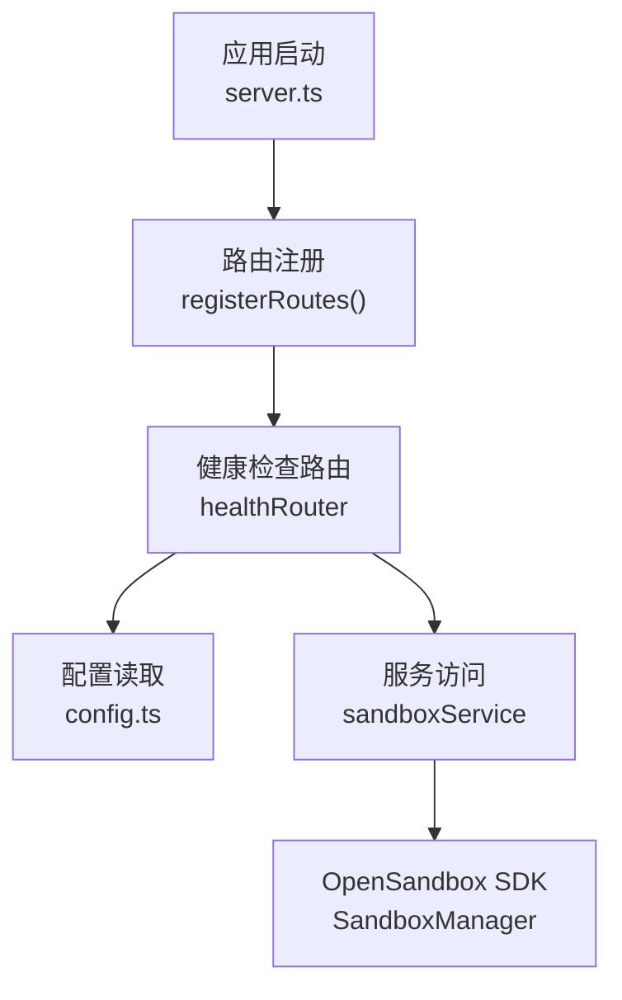
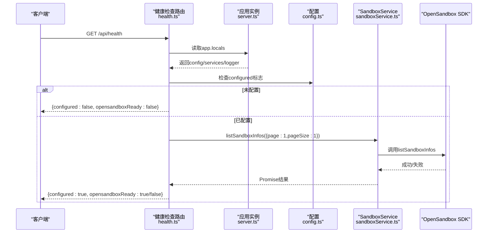
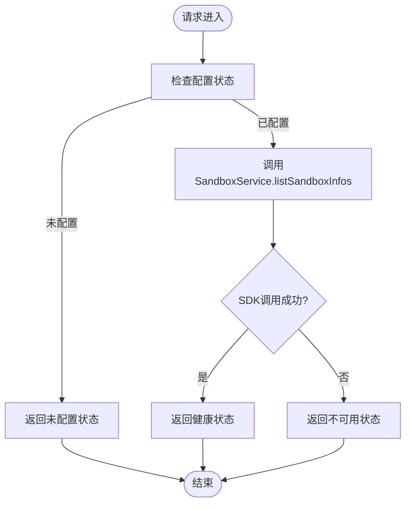
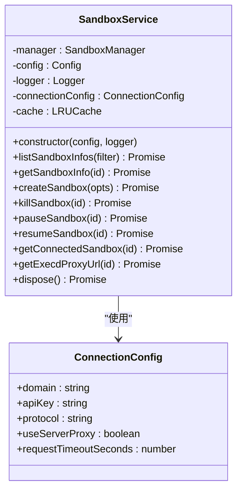
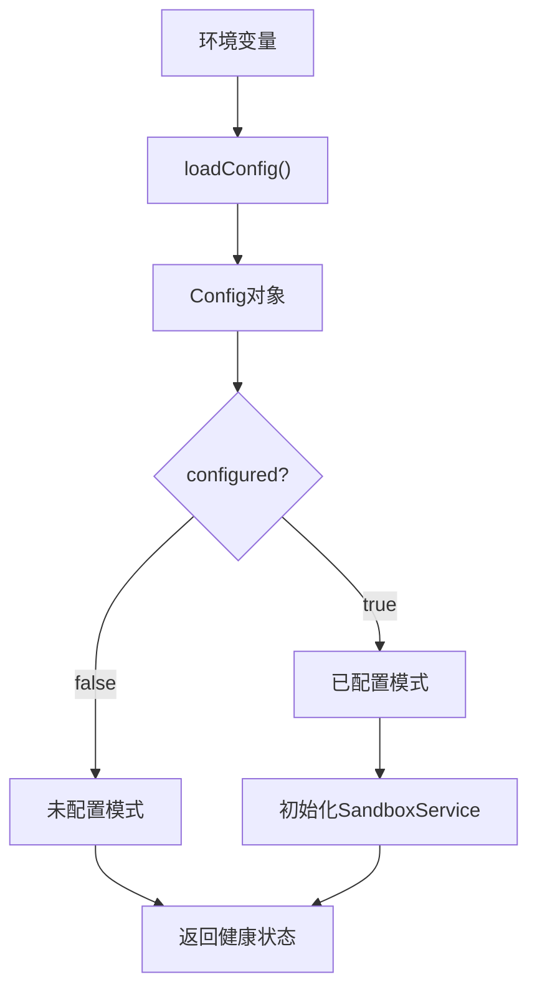
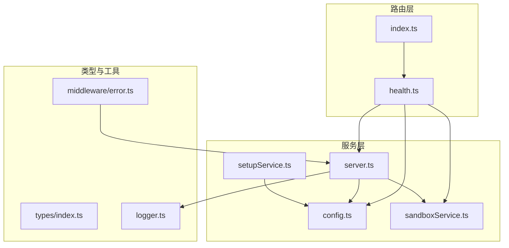

# 健康检查路由

<cite>
**本文档引用的文件**
- [apps/backend/src/routes/health.ts](file://apps/backend/src/routes/health.ts)
- [apps/backend/src/routes/index.ts](file://apps/backend/src/routes/index.ts)
- [apps/backend/src/server.ts](file://apps/backend/src/server.ts)
- [apps/backend/src/config.ts](file://apps/backend/src/config.ts)
- [apps/backend/src/services/sandboxService.ts](file://apps/backend/src/services/sandboxService.ts)
- [apps/backend/src/services/setupService.ts](file://apps/backend/src/services/setupService.ts)
- [apps/backend/src/middleware/error.ts](file://apps/backend/src/middleware/error.ts)
- [apps/backend/src/types/index.ts](file://apps/backend/src/types/index.ts)
- [apps/backend/src/logger.ts](file://apps/backend/src/logger.ts)
- [apps/frontend/src/api/types.ts](file://apps/frontend/src/api/types.ts)
- [apps/frontend/src/api/client.ts](file://apps/frontend/src/api/client.ts)
- [README.md](file://README.md)
</cite>

## 目录
1. [简介](#简介)
2. [项目结构](#项目结构)
3. [核心组件](#核心组件)
4. [架构概览](#架构概览)
5. [详细组件分析](#详细组件分析)
6. [依赖关系分析](#依赖关系分析)
7. [性能考虑](#性能考虑)
8. [故障排除指南](#故障排除指南)
9. [结论](#结论)
10. [附录](#附录)

## 简介
本文件为健康检查路由模块的技术文档，全面阐述系统健康状态监控的REST API实现。该模块提供服务可用性检查、依赖服务检测、资源使用情况查询等能力，支持对OpenSandbox后端服务的连通性验证，并返回标准化的健康状态数据结构。文档涵盖健康检查指标、检查频率控制、故障检测机制、健康状态评估算法、告警触发条件、恢复检测策略，以及具体的API调用示例和监控集成建议。

## 项目结构
健康检查路由位于后端Express应用中，通过统一的路由注册器挂载到/api/health路径下。其核心流程如下：
- 应用启动时加载配置并初始化服务
- 注册路由：将healthRouter挂载至/api/health
- 处理GET请求：根据配置状态和依赖服务可用性返回健康状态

**图表来源**
- [apps/backend/src/server.ts:36-90](file://apps/backend/src/server.ts#L36-L90)
- [apps/backend/src/routes/index.ts:9-15](file://apps/backend/src/routes/index.ts#L9-L15)
- [apps/backend/src/routes/health.ts:6-51](file://apps/backend/src/routes/health.ts#L6-L51)

**章节来源**
- [apps/backend/src/routes/index.ts:9-15](file://apps/backend/src/routes/index.ts#L9-L15)
- [apps/backend/src/server.ts:36-90](file://apps/backend/src/server.ts#L36-L90)

## 核心组件
健康检查路由的核心组件包括：
- 路由处理器：处理GET /api/health请求，返回标准化的健康状态响应
- 服务依赖：通过SandboxService调用OpenSandbox SDK进行连通性测试
- 配置驱动：基于Config中的configured标志判断是否已配置
- 响应模型：遵循统一的ApiResponse结构，包含success、data、error字段

健康检查返回的关键指标：
- status：健康状态字符串（当前固定为"ok"）
- configured：后端是否已完成配置
- opensandboxReady：OpenSandbox依赖服务是否可达
- timestamp：UTC时间戳
- uptime：进程运行时长（秒）

**章节来源**
- [apps/backend/src/routes/health.ts:6-51](file://apps/backend/src/routes/health.ts#L6-L51)
- [apps/backend/src/types/index.ts:3-11](file://apps/backend/src/types/index.ts#L3-L11)
- [apps/frontend/src/api/types.ts:65-71](file://apps/frontend/src/api/types.ts#L65-L71)

## 架构概览
健康检查的调用链路从HTTP请求到服务层再到外部依赖的完整流程如下：

**图表来源**
- [apps/backend/src/routes/health.ts:6-51](file://apps/backend/src/routes/health.ts#L6-L51)
- [apps/backend/src/server.ts:22-61](file://apps/backend/src/server.ts#L22-L61)
- [apps/backend/src/services/sandboxService.ts:49-56](file://apps/backend/src/services/sandboxService.ts#L49-L56)

## 详细组件分析

### 健康检查路由实现
健康检查路由采用条件分支逻辑：
- 未配置阶段：直接返回configured=false，opensandboxReady=false
- 已配置阶段：调用SandboxService.listSandboxInfos进行连通性测试
- 异常处理：捕获SDK调用异常，返回configured=true但opensandboxReady=false

**图表来源**
- [apps/backend/src/routes/health.ts:6-51](file://apps/backend/src/routes/health.ts#L6-L51)

**章节来源**
- [apps/backend/src/routes/health.ts:6-51](file://apps/backend/src/routes/health.ts#L6-L51)

### 服务依赖与SDK集成
SandboxService封装了OpenSandbox SDK的调用，提供LRU缓存和连接管理：
- ConnectionConfig：配置连接参数（域名、API密钥、协议、超时等）
- SandboxManager：管理沙箱操作
- LRU缓存：维护活跃的Sandbox实例，支持TTL过期和清理

**图表来源**
- [apps/backend/src/services/sandboxService.ts:11-47](file://apps/backend/src/services/sandboxService.ts#L11-L47)
- [apps/backend/src/services/sandboxService.ts:20-33](file://apps/backend/src/services/sandboxService.ts#L20-L33)

**章节来源**
- [apps/backend/src/services/sandboxService.ts:11-148](file://apps/backend/src/services/sandboxService.ts#L11-L148)

### 配置驱动的健康检查
配置系统通过环境变量驱动健康检查的行为：
- configured标志决定是否执行依赖服务检查
- osbServerUrl/osbApiKey决定OpenSandbox连接参数
- osbRequestTimeoutSeconds影响SDK调用超时

**图表来源**
- [apps/backend/src/config.ts:48-70](file://apps/backend/src/config.ts#L48-L70)
- [apps/backend/src/server.ts:50-56](file://apps/backend/src/server.ts#L50-L56)

**章节来源**
- [apps/backend/src/config.ts:3-23](file://apps/backend/src/config.ts#L3-L23)
- [apps/backend/src/config.ts:48-70](file://apps/backend/src/config.ts#L48-L70)

### 前端API集成
前端通过统一的API客户端发起健康检查请求：
- 使用fetch进行HTTP请求
- 自动处理JSON解析和错误抛出
- 支持重试和超时配置

**章节来源**
- [apps/frontend/src/api/client.ts:16-44](file://apps/frontend/src/api/client.ts#L16-L44)
- [apps/frontend/src/api/types.ts:65-71](file://apps/frontend/src/api/types.ts#L65-L71)

## 依赖关系分析
健康检查模块的依赖关系清晰且低耦合：

**图表来源**
- [apps/backend/src/routes/health.ts:1-52](file://apps/backend/src/routes/health.ts#L1-L52)
- [apps/backend/src/routes/index.ts:1-18](file://apps/backend/src/routes/index.ts#L1-L18)
- [apps/backend/src/server.ts:15-26](file://apps/backend/src/server.ts#L15-L26)

**章节来源**
- [apps/backend/src/routes/index.ts:1-18](file://apps/backend/src/routes/index.ts#L1-L18)
- [apps/backend/src/server.ts:15-26](file://apps/backend/src/server.ts#L15-L26)

## 性能考虑
健康检查的性能特征：
- O(1)复杂度：仅进行一次SDK调用，无数据库或文件系统IO
- 轻量级响应：返回JSON数据量小，网络开销低
- 缓存友好：SDK调用结果不缓存，避免过期状态
- 超时控制：受osbRequestTimeoutSeconds影响，默认5分钟

优化建议：
- 合理设置检查频率（建议>60秒），避免过度调用
- 在高并发场景下考虑限流策略
- 结合日志监控识别慢调用和异常模式

## 故障排除指南
常见问题及解决方案：

### 1. 未配置状态
**现象**：返回configured=false
**原因**：缺少OPENSANDBOX_SERVER_URL或OPENSANDBOX_API_KEY
**解决**：检查环境变量配置，确保两个必需变量都已设置

### 2. OpenSandbox不可达
**现象**：configured=true但opensandboxReady=false
**原因**：网络连接问题、认证失败、服务端异常
**解决**：
- 验证OpenSandbox Server地址和端口
- 检查API密钥有效性
- 确认网络连通性和防火墙设置

### 3. 超时问题
**现象**：请求超时或响应缓慢
**原因**：osbRequestTimeoutSeconds过小
**解决**：调整OPENSANDBOX_REQUEST_TIMEOUT_SECONDS环境变量

### 4. 错误处理
系统内置错误处理中间件会：
- 记录详细的错误日志
- 将SDK异常映射为适当的HTTP状态码
- 返回标准化的错误响应格式

**章节来源**
- [apps/backend/src/middleware/error.ts:4-48](file://apps/backend/src/middleware/error.ts#L4-L48)
- [apps/backend/src/services/setupService.ts:85-103](file://apps/backend/src/services/setupService.ts#L85-L103)

## 结论
健康检查路由模块实现了轻量、可靠的系统健康监控能力。通过配置驱动和依赖服务检测，能够准确反映后端服务的可用状态。模块设计简洁，扩展性强，可作为更复杂监控体系的基础组件。建议结合业务需求制定合理的检查频率和告警策略，以实现主动运维和快速故障响应。

## 附录

### API规范
- HTTP方法：GET
- URL模式：/api/health
- 请求参数：无
- 响应格式：标准ApiResponse结构

### 响应字段说明
- success：布尔值，请求处理是否成功
- data.status：健康状态字符串
- data.configured：后端是否已完成配置
- data.opensandboxReady：OpenSandbox服务是否可达
- data.timestamp：UTC时间戳
- data.uptime：进程运行时长（秒）

### 环境变量配置
- OPENSANDBOX_SERVER_URL：OpenSandbox Server地址
- OPENSANDBOX_API_KEY：API密钥
- OPENSANDBOX_PROTOCOL：连接协议（http/https）
- OPENSANDBOX_REQUEST_TIMEOUT_SECONDS：请求超时时间（秒）
- PORT：后端监听端口
- LOG_LEVEL：日志级别

**章节来源**
- [README.md:153-188](file://README.md#L153-L188)