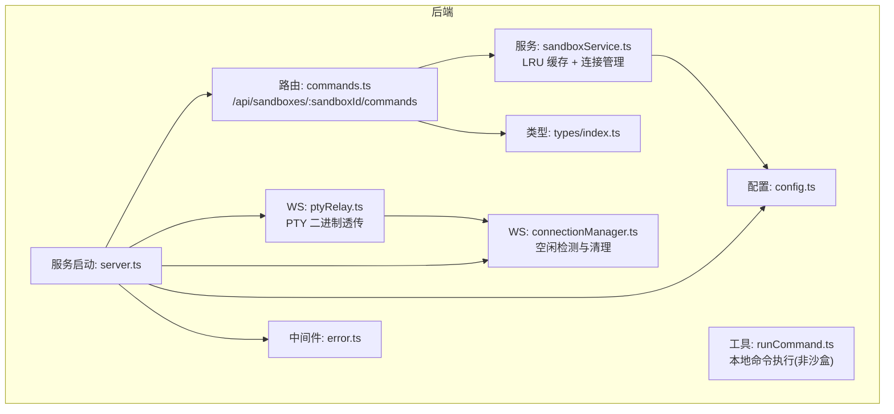
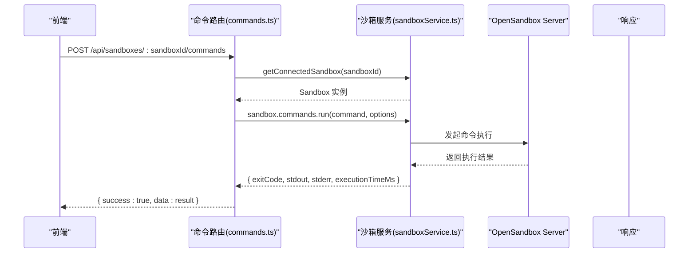
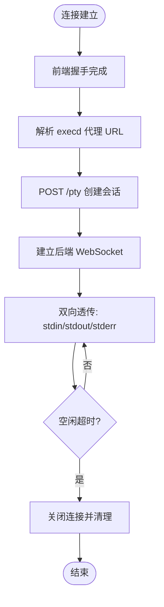
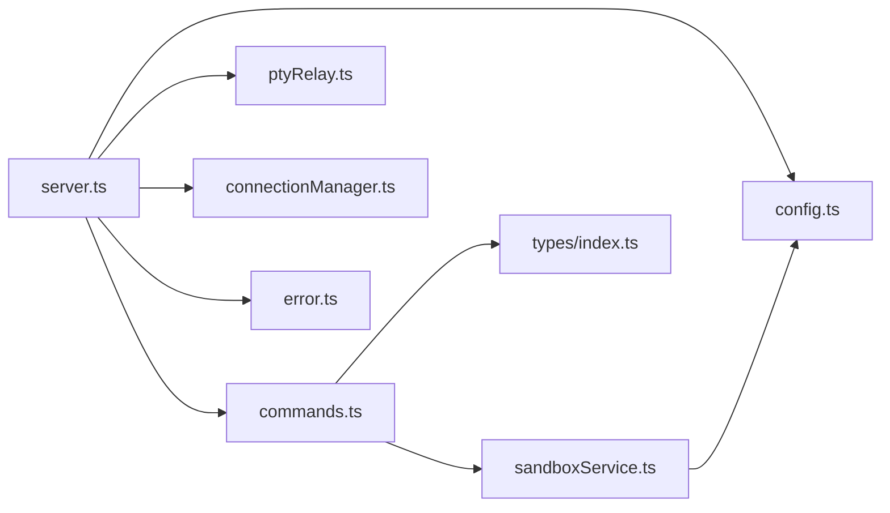

# 命令执行路由

<cite>
**本文引用的文件**
- [apps/backend/src/routes/commands.ts](file://apps/backend/src/routes/commands.ts)
- [apps/backend/src/services/sandboxService.ts](file://apps/backend/src/services/sandboxService.ts)
- [apps/backend/src/utils/runCommand.ts](file://apps/backend/src/utils/runCommand.ts)
- [apps/backend/src/websocket/ptyRelay.ts](file://apps/backend/src/websocket/ptyRelay.ts)
- [apps/backend/src/websocket/connectionManager.ts](file://apps/backend/src/websocket/connectionManager.ts)
- [apps/backend/src/types/index.ts](file://apps/backend/src/types/index.ts)
- [apps/backend/src/server.ts](file://apps/backend/src/server.ts)
- [apps/backend/src/config.ts](file://apps/backend/src/config.ts)
- [apps/backend/src/middleware/error.ts](file://apps/backend/src/middleware/error.ts)
- [apps/frontend/src/api/client.ts](file://apps/frontend/src/api/client.ts)
- [apps/frontend/src/api/types.ts](file://apps/frontend/src/api/types.ts)
- [README.md](file://README.md)
</cite>

## 目录
1. [简介](#简介)
2. [项目结构](#项目结构)
3. [核心组件](#核心组件)
4. [架构总览](#架构总览)
5. [详细组件分析](#详细组件分析)
6. [依赖关系分析](#依赖关系分析)
7. [性能考量](#性能考量)
8. [故障排查指南](#故障排查指南)
9. [结论](#结论)
10. [附录：API 规范与示例](#附录api-规范与示例)

## 简介
本技术文档聚焦于“命令执行路由”模块，系统性阐述基于 OpenSandbox 的沙盒内命令执行 REST API 实现，涵盖命令提交、会话式执行、会话生命周期管理、输出流处理、超时控制、安全沙箱与资源限制、并发控制策略，以及错误处理与性能监控方案。文档同时提供清晰的架构图、序列图与流程图，帮助开发者快速理解与集成。

## 项目结构
命令执行路由位于后端 Express 应用中，通过子路由挂载在沙箱资源下，配合 OpenSandbox SDK 与 PTY 通道实现命令执行与实时输出。

图表来源
- [apps/backend/src/routes/commands.ts:1-95](file://apps/backend/src/routes/commands.ts#L1-L95)
- [apps/backend/src/services/sandboxService.ts:1-148](file://apps/backend/src/services/sandboxService.ts#L1-L148)
- [apps/backend/src/utils/runCommand.ts:1-54](file://apps/backend/src/utils/runCommand.ts#L1-L54)
- [apps/backend/src/websocket/ptyRelay.ts:1-171](file://apps/backend/src/websocket/ptyRelay.ts#L1-L171)
- [apps/backend/src/websocket/connectionManager.ts:1-102](file://apps/backend/src/websocket/connectionManager.ts#L1-L102)
- [apps/backend/src/types/index.ts:1-89](file://apps/backend/src/types/index.ts#L1-L89)
- [apps/backend/src/config.ts:1-71](file://apps/backend/src/config.ts#L1-L71)
- [apps/backend/src/server.ts:1-119](file://apps/backend/src/server.ts#L1-L119)
- [apps/backend/src/middleware/error.ts:1-48](file://apps/backend/src/middleware/error.ts#L1-L48)

章节来源
- [apps/backend/src/routes/commands.ts:1-95](file://apps/backend/src/routes/commands.ts#L1-L95)
- [apps/backend/src/server.ts:1-119](file://apps/backend/src/server.ts#L1-L119)
- [README.md:114-176](file://README.md#L114-L176)

## 核心组件
- 命令路由控制器：负责接收命令请求、校验参数、调用沙箱命令执行接口、返回统一响应格式。
- 沙箱服务：封装 OpenSandbox SDK，提供连接缓存、会话管理、execd 代理地址解析等能力。
- 类型定义：统一请求体、响应体与错误结构，确保前后端契约一致。
- 错误处理中间件：将 SDK 异常映射为标准 HTTP 状态码与错误响应。
- PTY 中继：为交互式终端提供透明的二进制帧透传通道，支持会话创建、关闭与空闲回收。

章节来源
- [apps/backend/src/routes/commands.ts:1-95](file://apps/backend/src/routes/commands.ts#L1-L95)
- [apps/backend/src/services/sandboxService.ts:1-148](file://apps/backend/src/services/sandboxService.ts#L1-L148)
- [apps/backend/src/types/index.ts:1-89](file://apps/backend/src/types/index.ts#L1-L89)
- [apps/backend/src/middleware/error.ts:1-48](file://apps/backend/src/middleware/error.ts#L1-L48)
- [apps/backend/src/websocket/ptyRelay.ts:1-171](file://apps/backend/src/websocket/ptyRelay.ts#L1-L171)

## 架构总览
命令执行路径分为两类：
- REST 命令执行：一次性聚合输出，适合批处理与脚本执行。
- 会话式命令执行：通过 PTY 通道进行交互式会话，适合需要持续输入输出的场景。

图表来源
- [apps/backend/src/routes/commands.ts:13-35](file://apps/backend/src/routes/commands.ts#L13-L35)
- [apps/backend/src/services/sandboxService.ts:112-123](file://apps/backend/src/services/sandboxService.ts#L112-L123)

章节来源
- [apps/backend/src/routes/commands.ts:1-95](file://apps/backend/src/routes/commands.ts#L1-L95)
- [apps/backend/src/services/sandboxService.ts:1-148](file://apps/backend/src/services/sandboxService.ts#L1-L148)

## 详细组件分析

### 命令路由控制器（commands.ts）
- 路由设计
  - POST /api/sandboxes/:sandboxId/commands：一次性命令执行，返回聚合结果。
  - POST /api/sandboxes/:sandboxId/commands/session：创建 Bash 会话，返回 sessionId。
  - POST /api/sandboxes/:sandboxId/commands/session/:sessionId/run：在指定会话中执行命令。
  - DELETE /api/sandboxes/:sandboxId/commands/session/:sessionId：删除会话。
- 参数校验
  - 必填字段：command；缺失时返回 400 与错误码。
- 上下文与选项
  - workingDirectory、timeoutSeconds、envs 等通过请求体传递，透传至沙箱命令执行接口。
- 统一响应
  - 成功：{ success: true, data }；失败：{ success: false, error }。

章节来源
- [apps/backend/src/routes/commands.ts:1-95](file://apps/backend/src/routes/commands.ts#L1-L95)
- [apps/backend/src/types/index.ts:26-58](file://apps/backend/src/types/index.ts#L26-L58)

### 沙箱服务（sandboxService.ts）
- 连接与缓存
  - 使用 LRU 缓存保存已连接的 Sandbox 实例，默认最大 50，TTL 10 分钟；过期自动关闭并释放资源。
  - 提供 getConnectedSandbox(sandboxId) 获取实例，若缓存未命中则重新连接。
- execd 代理地址
  - 通过 getEndpoint(44772) 解析 execd 代理 URL 与路由头，用于 PTY 中继与会话式命令执行。
- 生命周期管理
  - kill/pause/resume 等操作会从缓存中移除对应实例，避免脏连接。
- 初始化与销毁
  - 构造函数建立连接配置与管理器；dispose 清理缓存并记录日志。

章节来源
- [apps/backend/src/services/sandboxService.ts:1-148](file://apps/backend/src/services/sandboxService.ts#L1-L148)
- [apps/backend/src/config.ts:1-71](file://apps/backend/src/config.ts#L1-L71)

### 本地命令执行工具（runCommand.ts）
- 用途
  - 在后端本地执行命令并捕获 stdout/stderr，支持超时与回调输出。
- 关键特性
  - 自动选择是否使用 shell（避免对 sh -c 的二次拆分）。
  - 超时触发 SIGTERM 并拒绝 Promise。
  - 输出回调可用于实时转发到前端或日志系统。
- 性能与安全
  - 仅用于后端内部工具链，不直接参与沙盒命令执行。

章节来源
- [apps/backend/src/utils/runCommand.ts:1-54](file://apps/backend/src/utils/runCommand.ts#L1-L54)

### PTY 中继与会话管理（ptyRelay.ts、connectionManager.ts）
- PTY 中继
  - 建立前端 WebSocket 与 OpenSandbox execd 的双向透明通道，支持二进制帧与 JSON 控制帧。
  - 步骤：握手 -> 解析 execd 代理 URL -> 创建会话 -> 建立后端 WS -> 双向透传 -> 错误与关闭处理。
- 会话管理
  - 维护连接表，记录连接 ID、沙箱 ID、会话 ID、创建时间与最后活动时间。
  - 定时检查空闲连接，超过阈值自动关闭，防止资源泄漏。
  - 支持按沙箱查询活跃连接，便于运维与审计。

图表来源
- [apps/backend/src/websocket/ptyRelay.ts:40-118](file://apps/backend/src/websocket/ptyRelay.ts#L40-L118)
- [apps/backend/src/websocket/connectionManager.ts:18-100](file://apps/backend/src/websocket/connectionManager.ts#L18-L100)

章节来源
- [apps/backend/src/websocket/ptyRelay.ts:1-171](file://apps/backend/src/websocket/ptyRelay.ts#L1-L171)
- [apps/backend/src/websocket/connectionManager.ts:1-102](file://apps/backend/src/websocket/connectionManager.ts#L1-L102)
- [apps/backend/src/config.ts:21-23](file://apps/backend/src/config.ts#L21-L23)

### 类型与错误处理（types/index.ts、middleware/error.ts）
- 统一响应结构
  - ApiResponse：包含 success、data 或 error 字段，error 包含 code、message、requestId。
- 请求体类型
  - RunCommandBody、RunInSessionBody：定义命令执行所需参数。
- 错误映射
  - 将 SDK 异常映射为 HTTP 状态码：如超时、参数错误、网关错误等。
  - 记录请求 ID 与上下文，便于追踪。

章节来源
- [apps/backend/src/types/index.ts:1-89](file://apps/backend/src/types/index.ts#L1-L89)
- [apps/backend/src/middleware/error.ts:1-48](file://apps/backend/src/middleware/error.ts#L1-L48)

## 依赖关系分析
- 路由依赖服务：commands.ts 通过 app.locals 注入的服务访问沙箱服务。
- 服务依赖配置：sandboxService.ts 依赖 config.ts 提供的连接参数。
- 中间件依赖日志：error.ts 依赖 pino 日志器输出结构化日志。
- PTY 依赖连接管理：ptyRelay.ts 依赖 connectionManager.ts 进行空闲检测与清理。

图表来源
- [apps/backend/src/routes/commands.ts:1-95](file://apps/backend/src/routes/commands.ts#L1-L95)
- [apps/backend/src/services/sandboxService.ts:1-148](file://apps/backend/src/services/sandboxService.ts#L1-L148)
- [apps/backend/src/server.ts:1-119](file://apps/backend/src/server.ts#L1-L119)
- [apps/backend/src/config.ts:1-71](file://apps/backend/src/config.ts#L1-L71)
- [apps/backend/src/middleware/error.ts:1-48](file://apps/backend/src/middleware/error.ts#L1-L48)
- [apps/backend/src/websocket/ptyRelay.ts:1-171](file://apps/backend/src/websocket/ptyRelay.ts#L1-L171)
- [apps/backend/src/websocket/connectionManager.ts:1-102](file://apps/backend/src/websocket/connectionManager.ts#L1-L102)

章节来源
- [apps/backend/src/server.ts:1-119](file://apps/backend/src/server.ts#L1-L119)

## 性能考量
- 连接复用与缓存
  - 通过 LRU 缓存减少重复连接开销，提升高频命令执行的吞吐。
- 超时与资源限制
  - 命令执行支持 timeoutSeconds；PTY 空闲超时可通过环境变量配置，避免僵尸连接占用资源。
- 输出流处理
  - 一次性命令执行返回聚合结果；PTY 通道采用二进制帧透传，降低协议开销与延迟。
- 并发控制
  - 通过连接数上限与空闲回收策略，限制并发 PTY 会话数量，防止资源耗尽。

章节来源
- [apps/backend/src/services/sandboxService.ts:17-44](file://apps/backend/src/services/sandboxService.ts#L17-L44)
- [apps/backend/src/config.ts:21-23](file://apps/backend/src/config.ts#L21-L23)
- [apps/backend/src/websocket/connectionManager.ts:18-28](file://apps/backend/src/websocket/connectionManager.ts#L18-L28)

## 故障排查指南
- 常见错误与定位
  - 400 缺少命令参数：检查请求体是否包含 command 字段。
  - 503 未配置 OpenSandbox：确认环境变量与配置文件已正确设置。
  - 502/504 网关或超时：检查 OpenSandbox Server 可达性与请求超时配置。
- 日志与追踪
  - 使用请求 ID（x-request-id）关联日志，定位具体请求链路。
- PTY 会话异常
  - 检查空闲超时设置与连接管理器的清理周期；确认 execd 代理 URL 解析成功。

章节来源
- [apps/backend/src/middleware/error.ts:1-48](file://apps/backend/src/middleware/error.ts#L1-L48)
- [apps/backend/src/config.ts:48-70](file://apps/backend/src/config.ts#L48-L70)
- [apps/backend/src/websocket/connectionManager.ts:92-100](file://apps/backend/src/websocket/connectionManager.ts#L92-L100)

## 结论
命令执行路由模块以 OpenSandbox 为核心，结合统一的类型定义、错误处理与 PTY 中继，实现了安全、可控且高性能的沙盒内命令执行能力。通过连接缓存、超时控制与空闲回收，系统在保证安全性的同时兼顾了并发与资源利用率。建议在生产环境中严格配置 OpenSandbox 凭据与网络策略，并结合监控与日志体系完善可观测性。

## 附录：API 规范与示例

### REST API 规范
- 基础路径
  - /api/sandboxes/:sandboxId/commands
- 统一响应
  - 成功：{ success: true, data: T }
  - 失败：{ success: false, error: { code, message, requestId? } }

章节来源
- [apps/backend/src/types/index.ts:3-11](file://apps/backend/src/types/index.ts#L3-L11)
- [apps/backend/src/routes/commands.ts:13-35](file://apps/backend/src/routes/commands.ts#L13-L35)

### 命令执行（一次性）
- 方法与路径
  - POST /api/sandboxes/:sandboxId/commands
- 请求体
  - command: string（必填）
  - cwd?: string（工作目录）
  - timeoutSeconds?: number（超时秒）
  - envs?: Record<string,string>（环境变量）
- 响应
  - data: { exitCode: number, stdout: string, stderr: string, executionTimeMs: number }

章节来源
- [apps/backend/src/routes/commands.ts:13-35](file://apps/backend/src/routes/commands.ts#L13-L35)
- [apps/backend/src/types/index.ts:26-31](file://apps/backend/src/types/index.ts#L26-L31)
- [apps/frontend/src/api/types.ts:42-47](file://apps/frontend/src/api/types.ts#L42-L47)

### 会话式命令执行
- 创建会话
  - POST /api/sandboxes/:sandboxId/commands/session
  - 请求体：workingDirectory?: string
  - 响应：{ sessionId: string }
- 在会话中执行命令
  - POST /api/sandboxes/:sandboxId/commands/session/:sessionId/run
  - 请求体：command: string（必填），cwd?: string，timeoutSeconds?: number
  - 响应：同一次性命令执行
- 删除会话
  - DELETE /api/sandboxes/:sandboxId/commands/session/:sessionId
  - 响应：204 No Content

章节来源
- [apps/backend/src/routes/commands.ts:37-94](file://apps/backend/src/routes/commands.ts#L37-L94)
- [apps/backend/src/types/index.ts:48-58](file://apps/backend/src/types/index.ts#L48-L58)

### PTY 交互式终端
- WebSocket 路径
  - WS /api/sandboxes/:id/pty
- 数据帧
  - 二进制帧：stdin（0x00）、stdout（0x01）、stderr（0x02）
  - 文本帧：JSON 控制消息（如 resize、exit）

章节来源
- [apps/backend/src/websocket/ptyRelay.ts:9-21](file://apps/backend/src/websocket/ptyRelay.ts#L9-L21)
- [apps/backend/src/server.ts:75-87](file://apps/backend/src/server.ts#L75-L87)

### 前端调用示例（概念性）
- 一次性命令执行
  - 方法：POST
  - URL：/api/sandboxes/{sandboxId}/commands
  - Body：{ command, cwd?, timeoutSeconds?, envs? }
  - 返回：{ success, data: { exitCode, stdout, stderr, executionTimeMs } }
- 会话式命令执行
  - 创建会话：POST /api/sandboxes/{sandboxId}/commands/session
  - 执行命令：POST /api/sandboxes/{sandboxId}/commands/session/{sessionId}/run
  - 删除会话：DELETE /api/sandboxes/{sandboxId}/commands/session/{sessionId}

章节来源
- [apps/frontend/src/api/client.ts:16-44](file://apps/frontend/src/api/client.ts#L16-L44)
- [apps/frontend/src/api/types.ts:42-47](file://apps/frontend/src/api/types.ts#L42-L47)