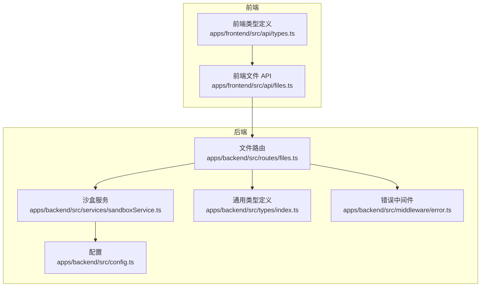
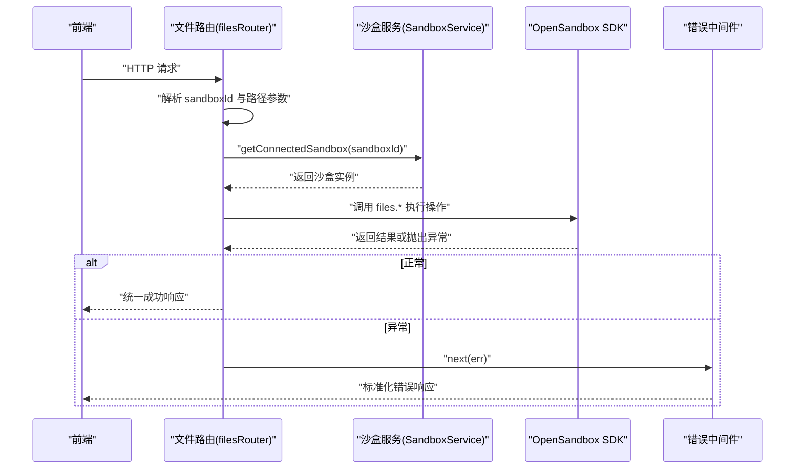
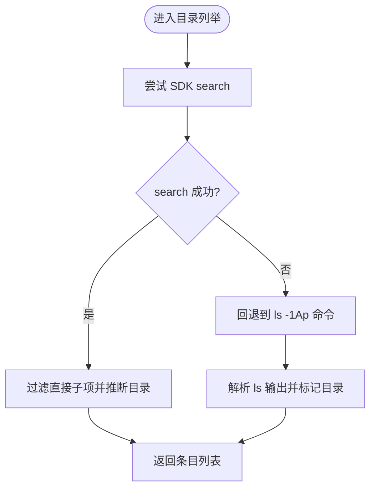
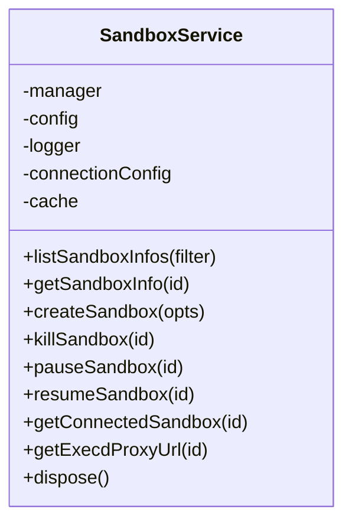
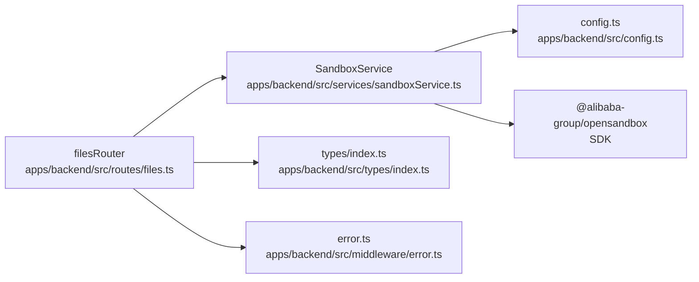

# 文件操作路由

<cite>
**本文引用的文件**
- [apps/backend/src/routes/files.ts](file://apps/backend/src/routes/files.ts)
- [apps/backend/src/services/sandboxService.ts](file://apps/backend/src/services/sandboxService.ts)
- [apps/backend/src/types/index.ts](file://apps/backend/src/types/index.ts)
- [apps/backend/src/middleware/error.ts](file://apps/backend/src/middleware/error.ts)
- [apps/backend/src/config.ts](file://apps/backend/src/config.ts)
- [apps/frontend/src/api/files.ts](file://apps/frontend/src/api/files.ts)
- [apps/frontend/src/api/types.ts](file://apps/frontend/src/api/types.ts)
</cite>

## 目录
1. [简介](#简介)
2. [项目结构](#项目结构)
3. [核心组件](#核心组件)
4. [架构总览](#架构总览)
5. [详细组件分析](#详细组件分析)
6. [依赖关系分析](#依赖关系分析)
7. [性能考量](#性能考量)
8. [故障排查指南](#故障排查指南)
9. [结论](#结论)
10. [附录：API 调用示例与规范](#附录api-调用示例与规范)

## 简介
本文件操作路由模块基于 OpenSandbox SDK 实现了沙盒内部文件系统的 REST API，覆盖目录列举、文件内容读取（文本与二进制）、文件写入、目录创建、文件移动/重命名、以及文件/目录删除等能力。模块同时内置了路径合法性校验、目录检测、命令注入转义、以及降级策略，确保在不同环境下稳定运行。本文档将从架构、数据流、处理逻辑、安全与性能等方面进行系统化说明，并提供 API 规范与调用示例。

## 项目结构
文件操作路由位于后端应用的路由层，通过 Express Router 暴露 REST 接口；业务逻辑委托给 SandboxService 获取已连接的沙盒实例，再由 OpenSandbox SDK 的 files 命名空间执行具体文件操作。

图表来源
- [apps/backend/src/routes/files.ts:1-327](file://apps/backend/src/routes/files.ts#L1-L327)
- [apps/backend/src/services/sandboxService.ts:1-148](file://apps/backend/src/services/sandboxService.ts#L1-L148)
- [apps/backend/src/types/index.ts:1-89](file://apps/backend/src/types/index.ts#L1-L89)
- [apps/backend/src/middleware/error.ts:1-48](file://apps/backend/src/middleware/error.ts#L1-L48)
- [apps/backend/src/config.ts:1-71](file://apps/backend/src/config.ts#L1-L71)
- [apps/frontend/src/api/files.ts:1-32](file://apps/frontend/src/api/files.ts#L1-L32)
- [apps/frontend/src/api/types.ts:1-146](file://apps/frontend/src/api/types.ts#L1-L146)

章节来源
- [apps/backend/src/routes/files.ts:1-327](file://apps/backend/src/routes/files.ts#L1-L327)
- [apps/backend/src/services/sandboxService.ts:1-148](file://apps/backend/src/services/sandboxService.ts#L1-L148)
- [apps/backend/src/types/index.ts:1-89](file://apps/backend/src/types/index.ts#L1-L89)
- [apps/frontend/src/api/files.ts:1-32](file://apps/frontend/src/api/files.ts#L1-L32)
- [apps/frontend/src/api/types.ts:1-146](file://apps/frontend/src/api/types.ts#L1-L146)

## 核心组件
- 文件路由（filesRouter）：提供 REST 接口，负责参数解析、输入校验、调用沙盒服务、返回统一响应格式。
- 沙盒服务（SandboxService）：管理 OpenSandbox 连接与缓存，提供 getConnectedSandbox 方法以复用连接。
- 统一响应类型（ApiResponse）：后端统一返回结构，包含 success、data 或 error 字段。
- 错误处理中间件：将 SDK 异常映射为 HTTP 状态码，输出标准化错误响应。
- 配置（Config）：加载环境变量，控制 OpenSandbox 连接参数与超时等。

章节来源
- [apps/backend/src/routes/files.ts:1-327](file://apps/backend/src/routes/files.ts#L1-L327)
- [apps/backend/src/services/sandboxService.ts:1-148](file://apps/backend/src/services/sandboxService.ts#L1-L148)
- [apps/backend/src/types/index.ts:1-89](file://apps/backend/src/types/index.ts#L1-L89)
- [apps/backend/src/middleware/error.ts:1-48](file://apps/backend/src/middleware/error.ts#L1-L48)
- [apps/backend/src/config.ts:1-71](file://apps/backend/src/config.ts#L1-L71)

## 架构总览
文件操作的典型调用链如下：
- 前端通过 HTTP 请求访问后端路由
- 路由层解析 sandboxId 与路径参数，进行基础校验
- 路由层调用 SandboxService 获取/连接沙盒实例
- 通过 OpenSandbox SDK 的 files 命名空间执行具体操作
- 返回统一响应格式；异常交由错误中间件处理

图表来源
- [apps/backend/src/routes/files.ts:1-327](file://apps/backend/src/routes/files.ts#L1-L327)
- [apps/backend/src/services/sandboxService.ts:112-123](file://apps/backend/src/services/sandboxService.ts#L112-L123)
- [apps/backend/src/middleware/error.ts:1-48](file://apps/backend/src/middleware/error.ts#L1-L48)

## 详细组件分析

### 文件路由（filesRouter）
- 路由前缀：/api/sandboxes/:sandboxId/files（在后端注册时使用）
- 支持的 HTTP 方法与路径：
  - GET /api/sandboxes/:sandboxId/files?path=...
  - GET /api/sandboxes/:sandboxId/files/content?path=...
  - GET /api/sandboxes/:sandboxId/files/download?path=...
  - POST /api/sandboxes/:sandboxId/files/write
  - POST /api/sandboxes/:sandboxId/files/mkdir
  - POST /api/sandboxes/:sandboxId/files/move
  - DELETE /api/sandboxes/:sandboxId/files/files?path=...
  - DELETE /api/sandboxes/:sandboxId/files/directories?path=...

- 关键处理逻辑
  - 参数提取：从 params 中获取 sandboxId，从 query/body 中获取 path/paths/entries 等。
  - 输入校验：对必填字段进行检查，如 path、content、paths、entries 等。
  - 目录检测：在读取内容前，通过命令检测目标是否为目录，避免误读目录。
  - 路径转义：对 shell 命令中的路径进行单引号转义，降低注入风险。
  - 降级策略：优先使用 SDK 的 search API 列举目录；失败时回退到 ls -1Ap 命令。
  - 统一响应：成功返回 { success: true, data: ... }，错误返回 { success: false, error: { code, message } }。

- 目录列举算法（search + ls 降级）
  - 使用 SDK search 获取递归结果，然后过滤仅直接子项，并推断缺失的目录。
  - 若 search 失败，则通过 ls -1Ap 命令列出条目，-p 会在目录名末尾添加斜杠，便于识别目录。

图表来源
- [apps/backend/src/routes/files.ts:213-275](file://apps/backend/src/routes/files.ts#L213-L275)
- [apps/backend/src/routes/files.ts:281-313](file://apps/backend/src/routes/files.ts#L281-L313)

章节来源
- [apps/backend/src/routes/files.ts:19-207](file://apps/backend/src/routes/files.ts#L19-L207)
- [apps/backend/src/routes/files.ts:213-326](file://apps/backend/src/routes/files.ts#L213-L326)

### 沙盒服务（SandboxService）
- 职责：管理 OpenSandbox 连接生命周期，提供 LRU 缓存复用连接，支持创建、暂停、恢复、终止沙盒。
- 关键点：
  - 连接配置来自环境变量（服务器地址、协议、API Key、代理、超时等）。
  - 缓存 TTL 为 10 分钟，容量上限 50；淘汰时会尝试关闭连接并记录日志。
  - 提供 getConnectedSandbox，用于后续文件/命令/PTY 操作。

图表来源
- [apps/backend/src/services/sandboxService.ts:11-147](file://apps/backend/src/services/sandboxService.ts#L11-L147)

章节来源
- [apps/backend/src/services/sandboxService.ts:1-148](file://apps/backend/src/services/sandboxService.ts#L1-L148)
- [apps/backend/src/config.ts:48-70](file://apps/backend/src/config.ts#L48-L70)

### 统一响应与错误处理
- 统一响应体结构：success、data（可选）、error（可选）。
- 错误映射规则：根据异常类型映射到合适的 HTTP 状态码，如 SDK 异常映射为 502/504，参数解析失败映射为 400，其他异常默认 500。
- 日志记录：错误中间件会记录请求 ID、方法、路径、状态码等信息，便于追踪。

章节来源
- [apps/backend/src/types/index.ts:3-11](file://apps/backend/src/types/index.ts#L3-L11)
- [apps/backend/src/middleware/error.ts:1-48](file://apps/backend/src/middleware/error.ts#L1-L48)

### 前端集成
- 前端通过封装的 request/fetch 方法调用后端接口，传入 sandboxId 与 path/paths/entries 等参数。
- 前端类型定义中包含 FileEntry 结构，用于接收后端返回的目录/文件条目。

章节来源
- [apps/frontend/src/api/files.ts:1-32](file://apps/frontend/src/api/files.ts#L1-L32)
- [apps/frontend/src/api/types.ts:27-33](file://apps/frontend/src/api/types.ts#L27-L33)

## 依赖关系分析
- filesRouter 依赖：
  - SandboxService：获取/连接沙盒实例
  - 类型定义：WriteFileBody、MkdirBody、MoveFilesBody、ApiResponse
  - 错误中间件：异常捕获与统一错误响应
- SandboxService 依赖：
  - OpenSandbox SDK：SandboxManager、Sandbox、ConnectionConfig
  - lru-cache：LRU 连接缓存
  - 配置：从环境变量加载连接参数

图表来源
- [apps/backend/src/routes/files.ts:1-6](file://apps/backend/src/routes/files.ts#L1-L6)
- [apps/backend/src/services/sandboxService.ts:1-7](file://apps/backend/src/services/sandboxService.ts#L1-L7)
- [apps/backend/src/types/index.ts:1-6](file://apps/backend/src/types/index.ts#L1-L6)
- [apps/backend/src/middleware/error.ts:1-10](file://apps/backend/src/middleware/error.ts#L1-L10)
- [apps/backend/src/config.ts:1-23](file://apps/backend/src/config.ts#L1-L23)

章节来源
- [apps/backend/src/routes/files.ts:1-6](file://apps/backend/src/routes/files.ts#L1-L6)
- [apps/backend/src/services/sandboxService.ts:1-7](file://apps/backend/src/services/sandboxService.ts#L1-L7)
- [apps/backend/src/types/index.ts:1-6](file://apps/backend/src/types/index.ts#L1-L6)
- [apps/backend/src/middleware/error.ts:1-10](file://apps/backend/src/middleware/error.ts#L1-L10)
- [apps/backend/src/config.ts:1-23](file://apps/backend/src/config.ts#L1-L23)

## 性能考量
- 连接复用：SandboxService 使用 LRU 缓存复用沙盒连接，减少重复建立连接的开销。
- 列表策略：优先使用 SDK search API，若失败则回退到 ls 命令；search 可能更高效且稳定。
- 输出类型选择：读取大文件时建议使用 /download（二进制流），避免文本解码带来的额外开销。
- 超时控制：OpenSandbox 请求超时可通过环境变量配置，默认值较高以适应长任务场景。

章节来源
- [apps/backend/src/services/sandboxService.ts:35-44](file://apps/backend/src/services/sandboxService.ts#L35-L44)
- [apps/backend/src/config.ts:60-61](file://apps/backend/src/config.ts#L60-L61)

## 故障排查指南
- 常见错误码与含义
  - MISSING_PATH：缺少 path 查询参数
  - IS_DIRECTORY：目标是目录而非文件
  - MISSING_FIELDS：缺少 path 或 content
  - MISSING_PATHS：缺少 paths 数组
  - MISSING_ENTRIES：缺少 entries 数组
  - HTTP_400/500/502/504：由错误中间件映射
- 排查步骤
  - 确认 sandboxId 是否正确、沙盒是否处于可连接状态
  - 检查 path 是否存在且未被路径遍历攻击（当前实现通过命令转义降低风险）
  - 对于目录列举失败，查看日志中 search 与 ls 的输出
  - 检查 OpenSandbox 服务器连通性与 API Key 权限
- 日志定位
  - 错误中间件会记录请求 ID、方法、路径、状态码与异常详情，便于定位问题

章节来源
- [apps/backend/src/routes/files.ts:53-106](file://apps/backend/src/routes/files.ts#L53-L106)
- [apps/backend/src/middleware/error.ts:18-31](file://apps/backend/src/middleware/error.ts#L18-L31)

## 结论
该文件操作路由模块通过统一的 REST 接口与 OpenSandbox SDK 集成，提供了稳定、可扩展的沙盒内文件系统能力。模块内置了路径转义、目录检测、降级策略与统一错误处理，兼顾安全性与可用性。结合连接缓存与合理的超时配置，可在生产环境中获得良好的性能表现。

## 附录：API 调用示例与规范

### 统一响应格式
- 成功响应：{ success: true, data: ... }
- 失败响应：{ success: false, error: { code: string, message: string, requestId?: string } }

章节来源
- [apps/backend/src/types/index.ts:3-11](file://apps/backend/src/types/index.ts#L3-L11)

### 目录列举
- 方法与路径：GET /api/sandboxes/:sandboxId/files?path=...
- 请求参数
  - path：目录路径（可选，默认根目录）
- 响应数据：数组，元素包含 name、path、isDir、size、modTime
- 安全与性能
  - 优先使用 SDK search，失败回退 ls 命令
  - 对 shell 命令中的路径进行转义

章节来源
- [apps/backend/src/routes/files.ts:20-44](file://apps/backend/src/routes/files.ts#L20-L44)
- [apps/backend/src/routes/files.ts:213-313](file://apps/backend/src/routes/files.ts#L213-L313)
- [apps/frontend/src/api/files.ts:4-6](file://apps/frontend/src/api/files.ts#L4-L6)
- [apps/frontend/src/api/types.ts:27-33](file://apps/frontend/src/api/types.ts#L27-L33)

### 读取文件内容（文本）
- 方法与路径：GET /api/sandboxes/:sandboxId/files/content?path=...
- 请求参数
  - path：文件路径（必填）
- 响应：纯文本内容
- 安全要点
  - 先判断是否为目录，避免误读目录
  - 对路径进行转义，防止命令注入

章节来源
- [apps/backend/src/routes/files.ts:47-69](file://apps/backend/src/routes/files.ts#L47-L69)
- [apps/frontend/src/api/files.ts:8-14](file://apps/frontend/src/api/files.ts#L8-L14)

### 下载文件（二进制）
- 方法与路径：GET /api/sandboxes/:sandboxId/files/download?path=...
- 请求参数
  - path：文件路径（必填）
- 响应：application/octet-stream（二进制字节流）
- 性能建议
  - 大文件优先使用此接口，避免文本解码开销

章节来源
- [apps/backend/src/routes/files.ts:72-94](file://apps/backend/src/routes/files.ts#L72-L94)
- [apps/frontend/src/api/files.ts:8-14](file://apps/frontend/src/api/files.ts#L8-L14)

### 写入文件
- 方法与路径：POST /api/sandboxes/:sandboxId/files/write
- 请求体
  - path：文件路径（必填）
  - content：文件内容（必填）
  - mode：文件权限（可选）
- 响应：统一成功响应
- 安全要点
  - 必填字段校验
  - 路径转义与目录检测

章节来源
- [apps/backend/src/routes/files.ts:97-115](file://apps/backend/src/routes/files.ts#L97-L115)
- [apps/backend/src/types/index.ts:33-37](file://apps/backend/src/types/index.ts#L33-L37)
- [apps/frontend/src/api/files.ts:16-21](file://apps/frontend/src/api/files.ts#L16-L21)

### 创建目录
- 方法与路径：POST /api/sandboxes/:sandboxId/files/mkdir
- 请求体
  - paths：目录路径数组（必填）
  - mode：目录权限（可选）
- 响应：统一成功响应
- 安全要点
  - 必填数组校验

章节来源
- [apps/backend/src/routes/files.ts:118-136](file://apps/backend/src/routes/files.ts#L118-L136)
- [apps/backend/src/types/index.ts:39-42](file://apps/backend/src/types/index.ts#L39-L42)
- [apps/frontend/src/api/files.ts:27-31](file://apps/frontend/src/api/files.ts#L27-L31)

### 移动/重命名文件
- 方法与路径：POST /api/sandboxes/:sandboxId/files/move
- 请求体
  - entries：数组，每个元素包含 src 与 dest（必填）
- 响应：统一成功响应
- 安全要点
  - 必填数组校验

章节来源
- [apps/backend/src/routes/files.ts:139-157](file://apps/backend/src/routes/files.ts#L139-L157)
- [apps/backend/src/types/index.ts:44-46](file://apps/backend/src/types/index.ts#L44-L46)
- [apps/frontend/src/api/files.ts:27-31](file://apps/frontend/src/api/files.ts#L27-L31)

### 删除文件
- 方法与路径：DELETE /api/sandboxes/:sandboxId/files/files?path=...
- 查询参数
  - path：文件路径或路径数组（必填）
- 响应：204 No Content
- 安全要点
  - 必填路径校验

章节来源
- [apps/backend/src/routes/files.ts:160-182](file://apps/backend/src/routes/files.ts#L160-L182)
- [apps/frontend/src/api/files.ts:23-25](file://apps/frontend/src/api/files.ts#L23-L25)

### 删除目录
- 方法与路径：DELETE /api/sandboxes/:sandboxId/files/directories?path=...
- 查询参数
  - path：目录路径或路径数组（必填）
- 响应：204 No Content
- 安全要点
  - 必填路径校验

章节来源
- [apps/backend/src/routes/files.ts:185-207](file://apps/backend/src/routes/files.ts#L185-L207)
- [apps/frontend/src/api/files.ts:23-25](file://apps/frontend/src/api/files.ts#L23-L25)

### 路径处理与安全
- 路径转义：对 shell 命令中的路径使用单引号包裹并转义内部单引号，降低注入风险。
- 目录检测：通过 test -d 命令判断目标是否为目录，避免误读目录。
- 路径遍历防护：当前实现通过命令转义与目录检测降低风险；建议在上层网关或中间件增加更严格的路径白名单/黑名单策略。

章节来源
- [apps/backend/src/routes/files.ts:285-286](file://apps/backend/src/routes/files.ts#L285-L286)
- [apps/backend/src/routes/files.ts:322-326](file://apps/backend/src/routes/files.ts#L322-L326)

### 编码与大文件传输
- 文本读取：返回 text/plain，适合小文本文件。
- 二进制下载：返回 application/octet-stream，适合大文件与二进制文件。
- 建议：大文件优先使用 /download 接口，避免不必要的文本解码与内存拷贝。

章节来源
- [apps/backend/src/routes/files.ts:65-66](file://apps/backend/src/routes/files.ts#L65-L66)
- [apps/backend/src/routes/files.ts:90-91](file://apps/backend/src/routes/files.ts#L90-L91)