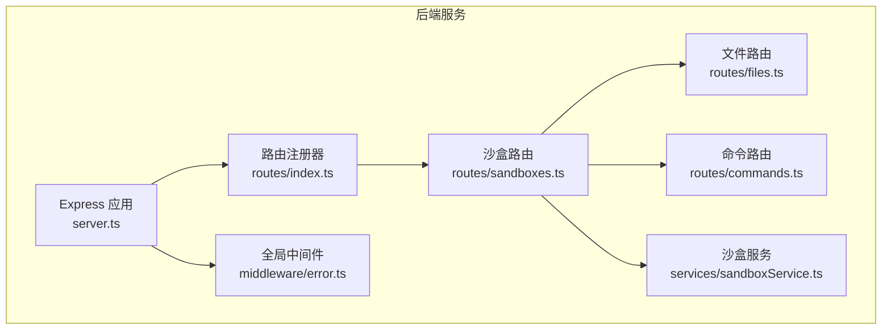
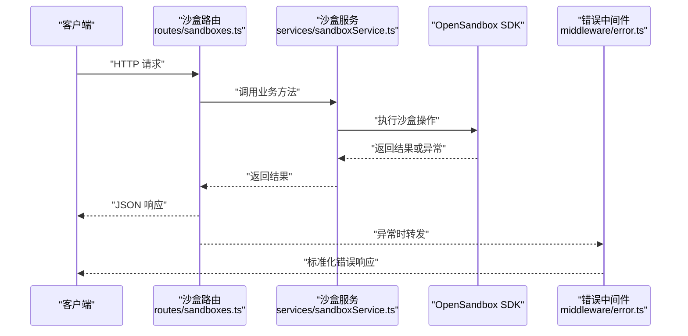
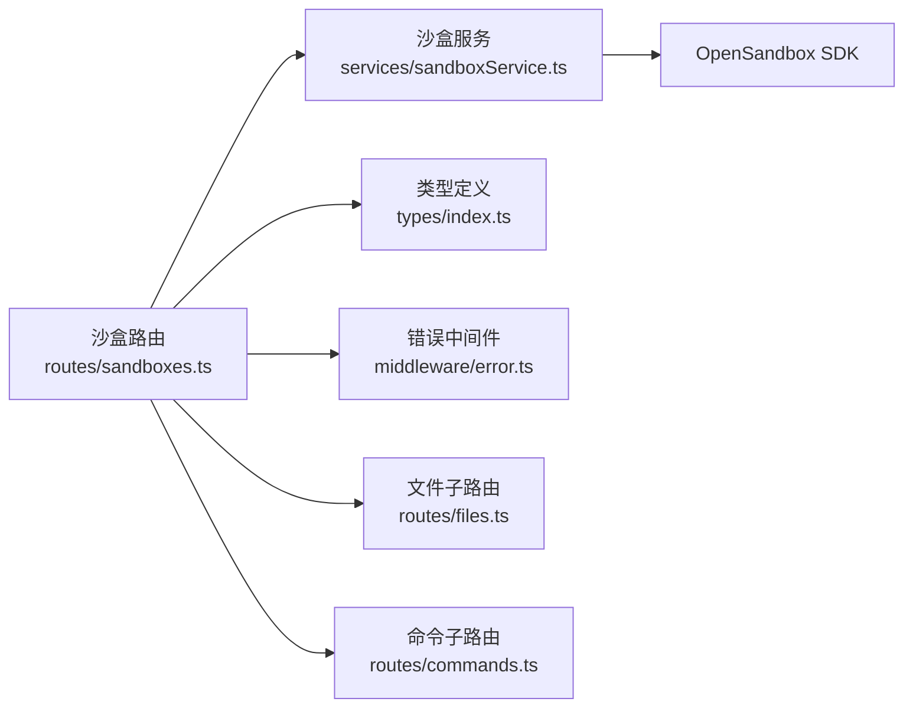

# 沙盒管理路由

<cite>
**本文引用的文件**
- [apps/backend/src/routes/sandboxes.ts](file://apps/backend/src/routes/sandboxes.ts)
- [apps/backend/src/services/sandboxService.ts](file://apps/backend/src/services/sandboxService.ts)
- [apps/backend/src/types/index.ts](file://apps/backend/src/types/index.ts)
- [apps/backend/src/middleware/error.ts](file://apps/backend/src/middleware/error.ts)
- [apps/backend/src/server.ts](file://apps/backend/src/server.ts)
- [apps/backend/src/routes/index.ts](file://apps/backend/src/routes/index.ts)
- [apps/backend/src/routes/files.ts](file://apps/backend/src/routes/files.ts)
- [apps/backend/src/routes/commands.ts](file://apps/backend/src/routes/commands.ts)
- [apps/backend/src/config.ts](file://apps/backend/src/config.ts)
- [apps/frontend/src/api/sandboxes.ts](file://apps/frontend/src/api/sandboxes.ts)
- [apps/frontend/src/stores/sandboxStore.ts](file://apps/frontend/src/stores/sandboxStore.ts)
</cite>

## 目录
1. [简介](#简介)
2. [项目结构](#项目结构)
3. [核心组件](#核心组件)
4. [架构总览](#架构总览)
5. [详细组件分析](#详细组件分析)
6. [依赖关系分析](#依赖关系分析)
7. [性能考虑](#性能考虑)
8. [故障排查指南](#故障排查指南)
9. [结论](#结论)
10. [附录：API 调用示例与规范](#附录api-调用示例与规范)

## 简介
本文件为“沙盒管理路由”模块的技术文档，聚焦于基于 OpenSandbox 的沙盒生命周期管理 REST API 实现。内容涵盖：
- 沙盒列表获取、创建、查询、删除、暂停、恢复等核心功能
- 路由参数与查询参数解析、请求体验证机制
- 沙盒状态规范化处理、过期沙盒过滤逻辑、分页查询实现
- 错误处理策略、状态码规范与性能优化建议
- 具体 API 调用示例（HTTP 方法、URL 模式、请求参数、响应格式）

## 项目结构
后端采用 Express 应用，路由通过统一注册器挂载到 /api 下，沙盒路由位于 /api/sandboxes。子路由 /files 与 /commands 通过沙盒 ID 进行资源绑定，支持文件操作与命令执行。

图表来源
- [apps/backend/src/server.ts:36-90](file://apps/backend/src/server.ts#L36-L90)
- [apps/backend/src/routes/index.ts:9-15](file://apps/backend/src/routes/index.ts#L9-L15)
- [apps/backend/src/routes/sandboxes.ts:57-59](file://apps/backend/src/routes/sandboxes.ts#L57-L59)
- [apps/backend/src/middleware/error.ts:5-31](file://apps/backend/src/middleware/error.ts#L5-L31)

章节来源
- [apps/backend/src/server.ts:36-90](file://apps/backend/src/server.ts#L36-L90)
- [apps/backend/src/routes/index.ts:9-15](file://apps/backend/src/routes/index.ts#L9-L15)

## 核心组件
- 沙盒路由层：负责参数解析、查询参数过滤、状态规范化、过期沙盒过滤、分页数据返回与错误转发。
- 沙盒服务层：封装 OpenSandbox SDK，提供创建、查询、暂停、恢复、终止、连接沙盒实例等能力，并内置 LRU 缓存。
- 类型系统：统一响应体结构、创建沙盒请求体、端点信息响应体等。
- 错误中间件：将 SDK 异常映射为 HTTP 状态码，统一输出结构化错误响应。
- 前端 API 客户端：提供沙盒 CRUD、端点查询等接口调用封装。

章节来源
- [apps/backend/src/routes/sandboxes.ts:16-32](file://apps/backend/src/routes/sandboxes.ts#L16-L32)
- [apps/backend/src/services/sandboxService.ts:11-47](file://apps/backend/src/services/sandboxService.ts#L11-L47)
- [apps/backend/src/types/index.ts:3-11](file://apps/backend/src/types/index.ts#L3-L11)
- [apps/backend/src/middleware/error.ts:5-31](file://apps/backend/src/middleware/error.ts#L5-L31)

## 架构总览
下图展示了从 HTTP 请求到 SDK 调用与响应返回的整体流程，以及错误处理路径。

图表来源
- [apps/backend/src/routes/sandboxes.ts:62-174](file://apps/backend/src/routes/sandboxes.ts#L62-L174)
- [apps/backend/src/services/sandboxService.ts:49-123](file://apps/backend/src/services/sandboxService.ts#L49-L123)
- [apps/backend/src/middleware/error.ts:5-31](file://apps/backend/src/middleware/error.ts#L5-L31)

## 详细组件分析

### 路由层：沙盒生命周期管理
- 路由前缀与子路由挂载
  - 基础路径：/api/sandboxes
  - 子路由：/:sandboxId/files、/:sandboxId/commands
- 中间件守卫
  - 在所有沙盒路由上添加守卫，若未配置 OpenSandbox，则直接返回 503
- 参数与查询解析
  - 路径参数：sandboxId
  - 查询参数：state（可多值）、page、pageSize
- 数据规范化与过滤
  - 将 SDK 返回的复杂状态对象扁平化为字符串状态
  - 过滤掉已过期的沙盒条目
- 分页与列表
  - 支持分页参数传入服务层，返回 items 与 pagination
- 端点查询
  - 获取指定端口的访问 URL，并拆解为 scheme/host/port

章节来源
- [apps/backend/src/routes/sandboxes.ts:34-45](file://apps/backend/src/routes/sandboxes.ts#L34-L45)
- [apps/backend/src/routes/sandboxes.ts:47-59](file://apps/backend/src/routes/sandboxes.ts#L47-L59)
- [apps/backend/src/routes/sandboxes.ts:61-93](file://apps/backend/src/routes/sandboxes.ts#L61-L93)
- [apps/backend/src/routes/sandboxes.ts:95-105](file://apps/backend/src/routes/sandboxes.ts#L95-L105)
- [apps/backend/src/routes/sandboxes.ts:107-116](file://apps/backend/src/routes/sandboxes.ts#L107-L116)
- [apps/backend/src/routes/sandboxes.ts:118-127](file://apps/backend/src/routes/sandboxes.ts#L118-L127)
- [apps/backend/src/routes/sandboxes.ts:129-138](file://apps/backend/src/routes/sandboxes.ts#L129-L138)
- [apps/backend/src/routes/sandboxes.ts:140-149](file://apps/backend/src/routes/sandboxes.ts#L140-L149)
- [apps/backend/src/routes/sandboxes.ts:151-174](file://apps/backend/src/routes/sandboxes.ts#L151-L174)

### 服务层：OpenSandbox SDK 封装
- 初始化与连接配置
  - 读取环境变量构建 ConnectionConfig
  - 创建 SandboxManager
- 缓存策略
  - LRU 缓存最近使用的 Sandbox 实例，超时自动清理并关闭连接
- 核心能力
  - 列表、详情、创建、终止、暂停、恢复
  - 获取已连接的 Sandbox 实例用于文件/命令操作
  - 获取 execd 代理地址用于 PTY 通道

章节来源
- [apps/backend/src/services/sandboxService.ts:20-47](file://apps/backend/src/services/sandboxService.ts#L20-L47)
- [apps/backend/src/services/sandboxService.ts:49-123](file://apps/backend/src/services/sandboxService.ts#L49-L123)
- [apps/backend/src/services/sandboxService.ts:129-138](file://apps/backend/src/services/sandboxService.ts#L129-L138)

### 类型系统：统一响应与请求体
- ApiResponse：统一成功/失败结构，包含 data 与可选 error
- CreateSandboxBody：创建沙盒所需字段
- SandboxEndpointResponse：端点 URL 解析后的结构

章节来源
- [apps/backend/src/types/index.ts:3-11](file://apps/backend/src/types/index.ts#L3-L11)
- [apps/backend/src/types/index.ts:13-24](file://apps/backend/src/types/index.ts#L13-L24)
- [apps/backend/src/types/index.ts:60-65](file://apps/backend/src/types/index.ts#L60-L65)

### 错误处理：异常到 HTTP 状态码映射
- 映射规则
  - SDK 异常：根据异常类型映射到 4xx/5xx
  - 特定异常：如超时、参数非法等
  - JSON 解析错误：400
  - 默认：500
- 输出结构
  - 包含 code、message、requestId

章节来源
- [apps/backend/src/middleware/error.ts:5-31](file://apps/backend/src/middleware/error.ts#L5-L31)
- [apps/backend/src/middleware/error.ts:33-47](file://apps/backend/src/middleware/error.ts#L33-L47)

### 子路由：文件与命令
- 文件路由
  - 目录列举、内容读取、二进制下载、写入、创建目录、移动/重命名、删除文件/目录
  - 提供两种列举策略：优先搜索 API，失败回退 ls+stat
- 命令路由
  - 单次命令执行、会话创建、在会话中运行命令、删除会话

章节来源
- [apps/backend/src/routes/files.ts:19-44](file://apps/backend/src/routes/files.ts#L19-L44)
- [apps/backend/src/routes/files.ts:46-94](file://apps/backend/src/routes/files.ts#L46-L94)
- [apps/backend/src/routes/files.ts:96-136](file://apps/backend/src/routes/files.ts#L96-L136)
- [apps/backend/src/routes/files.ts:138-157](file://apps/backend/src/routes/files.ts#L138-L157)
- [apps/backend/src/routes/files.ts:159-182](file://apps/backend/src/routes/files.ts#L159-L182)
- [apps/backend/src/routes/files.ts:184-207](file://apps/backend/src/routes/files.ts#L184-L207)
- [apps/backend/src/routes/files.ts:213-275](file://apps/backend/src/routes/files.ts#L213-L275)
- [apps/backend/src/routes/files.ts:281-313](file://apps/backend/src/routes/files.ts#L281-L313)
- [apps/backend/src/routes/commands.ts:12-35](file://apps/backend/src/routes/commands.ts#L12-L35)
- [apps/backend/src/routes/commands.ts:37-53](file://apps/backend/src/routes/commands.ts#L37-L53)
- [apps/backend/src/routes/commands.ts:55-78](file://apps/backend/src/routes/commands.ts#L55-L78)
- [apps/backend/src/routes/commands.ts:80-94](file://apps/backend/src/routes/commands.ts#L80-L94)

### 配置与初始化
- 环境变量驱动配置，决定 OpenSandbox 是否可用
- 服务初始化与重新初始化：根据配置创建/销毁服务实例

章节来源
- [apps/backend/src/config.ts:48-70](file://apps/backend/src/config.ts#L48-L70)
- [apps/backend/src/server.ts:50-61](file://apps/backend/src/server.ts#L50-L61)
- [apps/backend/src/server.ts:96-118](file://apps/backend/src/server.ts#L96-L118)

## 依赖关系分析
- 路由依赖服务层，服务层依赖 OpenSandbox SDK
- 路由层对查询参数进行预处理（状态过滤、分页），并将结果进行规范化
- 错误中间件作为全局兜底，确保异常被统一处理
- 子路由通过 mergeParams 继承父路由参数，形成资源嵌套

图表来源
- [apps/backend/src/routes/sandboxes.ts:1-8](file://apps/backend/src/routes/sandboxes.ts#L1-L8)
- [apps/backend/src/services/sandboxService.ts:1-10](file://apps/backend/src/services/sandboxService.ts#L1-L10)
- [apps/backend/src/types/index.ts:1-11](file://apps/backend/src/types/index.ts#L1-L11)
- [apps/backend/src/middleware/error.ts:1-10](file://apps/backend/src/middleware/error.ts#L1-L10)
- [apps/backend/src/routes/files.ts:1-7](file://apps/backend/src/routes/files.ts#L1-L7)
- [apps/backend/src/routes/commands.ts:1-5](file://apps/backend/src/routes/commands.ts#L1-L5)

## 性能考虑
- LRU 缓存
  - 缓存最近使用的 Sandbox 实例，减少重复连接开销；超时自动回收并关闭连接
- 列举策略
  - 优先使用 SDK 搜索 API，失败回退到 ls+stat，避免大规模 IO
- 分页与过滤
  - 服务层支持分页，前端仅拉取必要数据；后端过滤过期沙盒，减少无效渲染
- 请求体大小限制
  - 后端启用 JSON 解析并设置上限，防止过大请求导致内存压力

章节来源
- [apps/backend/src/services/sandboxService.ts:35-44](file://apps/backend/src/services/sandboxService.ts#L35-L44)
- [apps/backend/src/routes/files.ts:213-275](file://apps/backend/src/routes/files.ts#L213-L275)
- [apps/backend/src/server.ts:40-48](file://apps/backend/src/server.ts#L40-L48)

## 故障排查指南
- 未配置 OpenSandbox
  - 现象：所有沙盒路由返回 503
  - 处理：检查环境变量是否正确配置
- SDK 异常映射
  - 现象：特定异常映射到 400/404/502/504 等
  - 处理：查看错误 code 与 message，结合请求 ID 定位问题
- 请求体解析失败
  - 现象：400 错误
  - 处理：确认 JSON 格式与字段完整性
- 连接与超时
  - 现象：504（超时）
  - 处理：调整请求超时配置或缩短操作时间

章节来源
- [apps/backend/src/middleware/error.ts:33-47](file://apps/backend/src/middleware/error.ts#L33-L47)
- [apps/backend/src/server.ts:40-48](file://apps/backend/src/server.ts#L40-L48)

## 结论
该模块通过清晰的路由职责划分、完善的错误处理与缓存策略，提供了稳定可靠的沙盒生命周期管理能力。前端通过统一的 API 客户端与状态管理，实现了对沙盒列表、创建、查询、删除、暂停、恢复及端点查询的完整覆盖。建议在生产环境中配合监控与日志，持续观察 SDK 调用耗时与缓存命中率，进一步优化性能与稳定性。

## 附录：API 调用示例与规范

### 通用响应结构
- 成功响应：包含 success 与 data
- 失败响应：包含 success 与 error（含 code、message、requestId）

章节来源
- [apps/backend/src/types/index.ts:3-11](file://apps/backend/src/types/index.ts#L3-L11)

### 列表沙盒
- 方法与路径：GET /api/sandboxes
- 查询参数
  - state: 字符串数组（可多值），用于按状态过滤
  - page: 数字，当前页
  - pageSize: 数字，每页数量
- 响应
  - data.items: 沙盒数组（已规范化，且已过滤过期项）
  - data.pagination: 分页信息
- 示例（前端调用）
  - 使用 URLSearchParams 组装 state/page/pageSize

章节来源
- [apps/backend/src/routes/sandboxes.ts:61-93](file://apps/backend/src/routes/sandboxes.ts#L61-L93)
- [apps/frontend/src/api/sandboxes.ts:4-15](file://apps/frontend/src/api/sandboxes.ts#L4-L15)

### 创建沙盒
- 方法与路径：POST /api/sandboxes
- 请求体字段
  - image: 字符串，镜像名称
  - name: 可选，名称
  - timeoutSeconds: 可选，超时秒数
  - env: 可选，环境变量键值对
  - metadata: 可选，元数据键值对
  - resource: 可选，CPU/内存资源
  - networkPolicy: 可选，网络策略
- 响应
  - data: 规范化后的单个沙盒信息
- 状态码
  - 202：异步创建受理

章节来源
- [apps/backend/src/routes/sandboxes.ts:95-105](file://apps/backend/src/routes/sandboxes.ts#L95-L105)
- [apps/backend/src/types/index.ts:13-24](file://apps/backend/src/types/index.ts#L13-L24)

### 查询单个沙盒
- 方法与路径：GET /api/sandboxes/{sandboxId}
- 路径参数
  - sandboxId: 沙盒标识
- 响应
  - data: 规范化后的单个沙盒信息

章节来源
- [apps/backend/src/routes/sandboxes.ts:107-116](file://apps/backend/src/routes/sandboxes.ts#L107-L116)

### 删除沙盒
- 方法与路径：DELETE /api/sandboxes/{sandboxId}
- 路径参数
  - sandboxId: 沙盒标识
- 响应
  - 204：删除成功（无内容）

章节来源
- [apps/backend/src/routes/sandboxes.ts:118-127](file://apps/backend/src/routes/sandboxes.ts#L118-L127)

### 暂停沙盒
- 方法与路径：POST /api/sandboxes/{sandboxId}/pause
- 路径参数
  - sandboxId: 沙盒标识
- 响应
  - success: true

章节来源
- [apps/backend/src/routes/sandboxes.ts:129-138](file://apps/backend/src/routes/sandboxes.ts#L129-L138)

### 恢复沙盒
- 方法与路径：POST /api/sandboxes/{sandboxId}/resume
- 路径参数
  - sandboxId: 沙盒标识
- 响应
  - success: true

章节来源
- [apps/backend/src/routes/sandboxes.ts:140-149](file://apps/backend/src/routes/sandboxes.ts#L140-L149)

### 获取沙盒端点 URL
- 方法与路径：GET /api/sandboxes/{sandboxId}/endpoints/{port}
- 路径参数
  - sandboxId: 沙盒标识
  - port: 端口号
- 响应
  - data.url: 完整 URL
  - data.scheme: http 或 https
  - data.host: 主机名
  - data.port: 端口（http=80，https=443）

章节来源
- [apps/backend/src/routes/sandboxes.ts:151-174](file://apps/backend/src/routes/sandboxes.ts#L151-L174)
- [apps/backend/src/types/index.ts:60-65](file://apps/backend/src/types/index.ts#L60-L65)

### 前端集成要点
- 列表刷新：store 在创建/删除/暂停/恢复后同步更新本地状态
- 端点解析：后端返回 URL 并拆解为 scheme/host/port，便于前端直连

章节来源
- [apps/frontend/src/stores/sandboxStore.ts:21-62](file://apps/frontend/src/stores/sandboxStore.ts#L21-L62)
- [apps/frontend/src/api/sandboxes.ts:37-39](file://apps/frontend/src/api/sandboxes.ts#L37-L39)