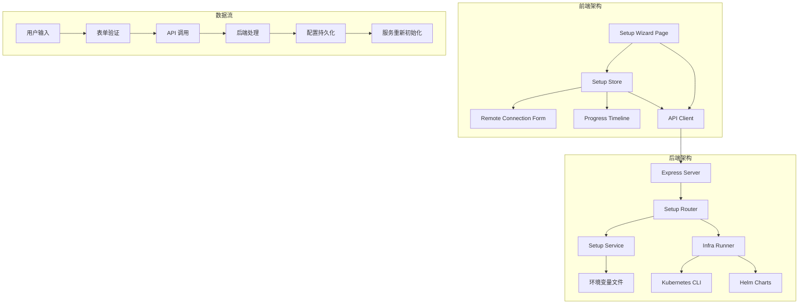
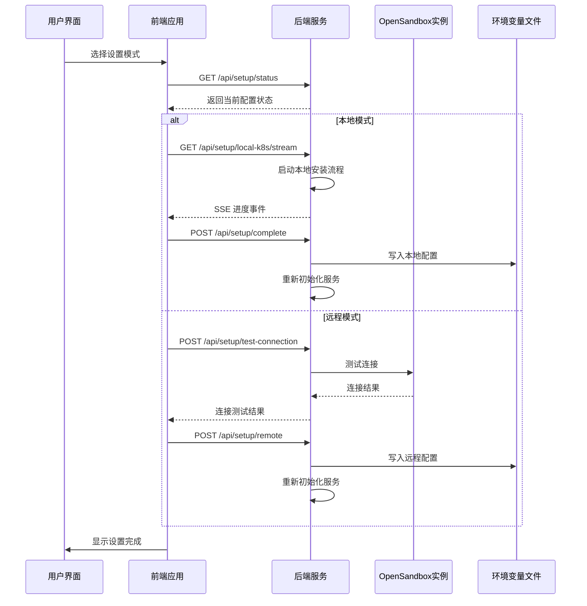
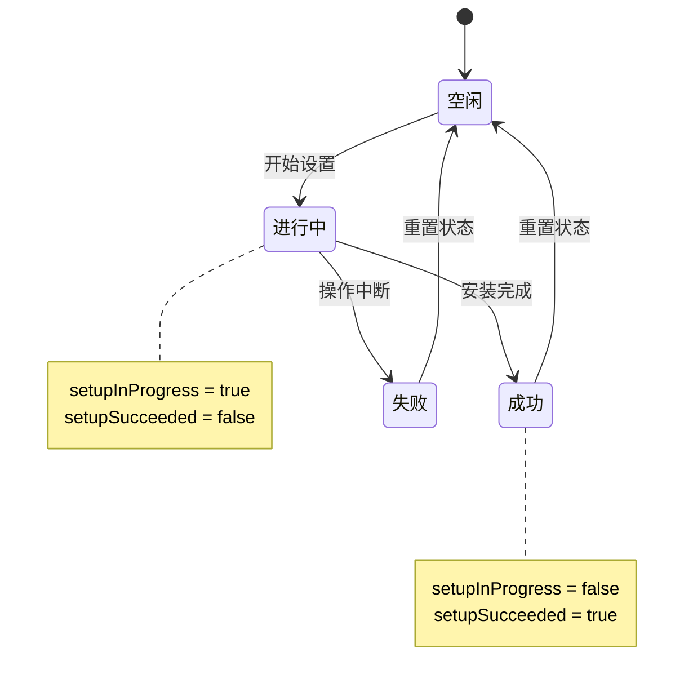
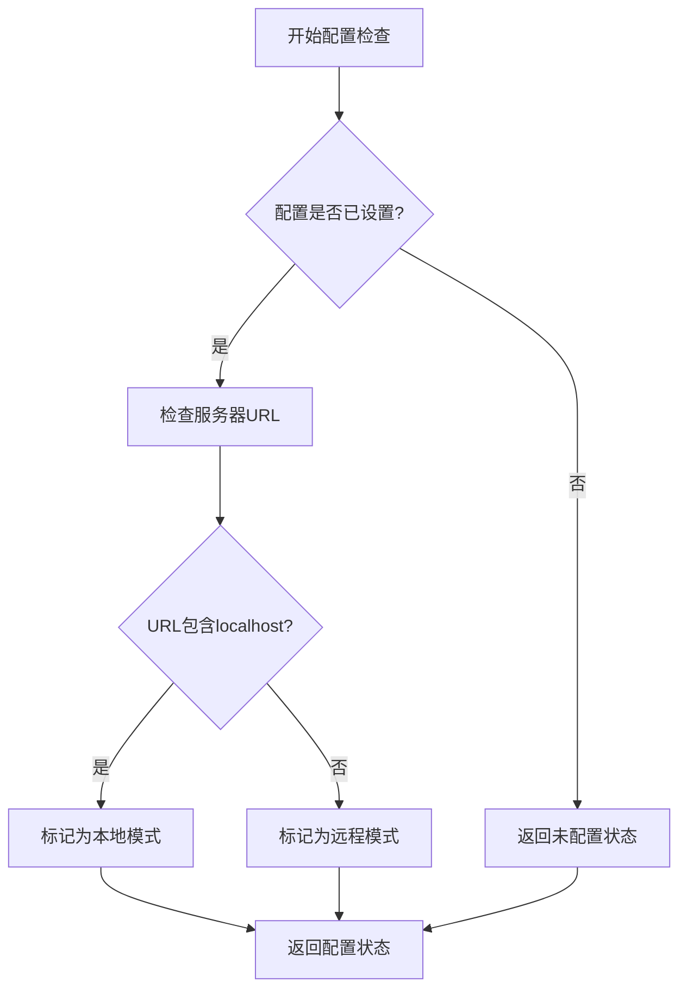
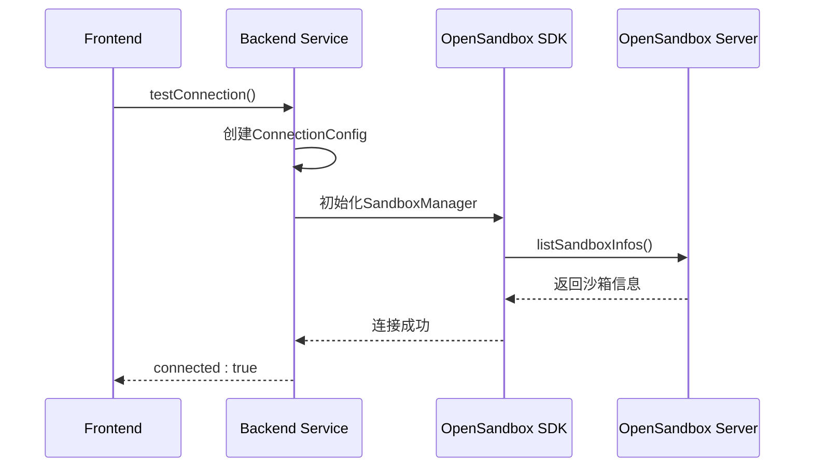
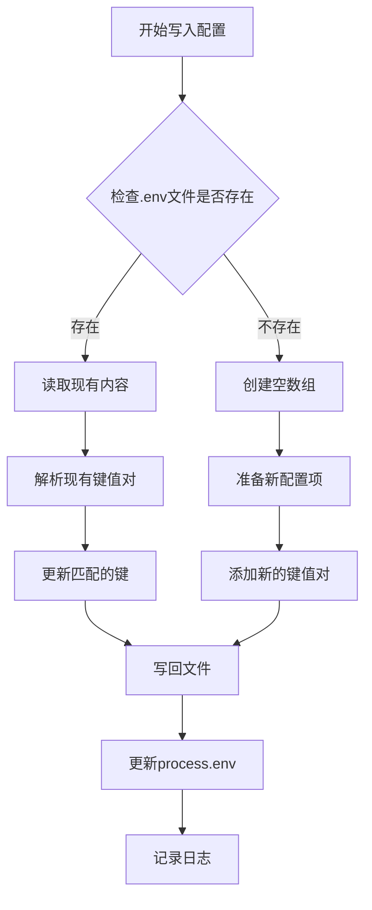
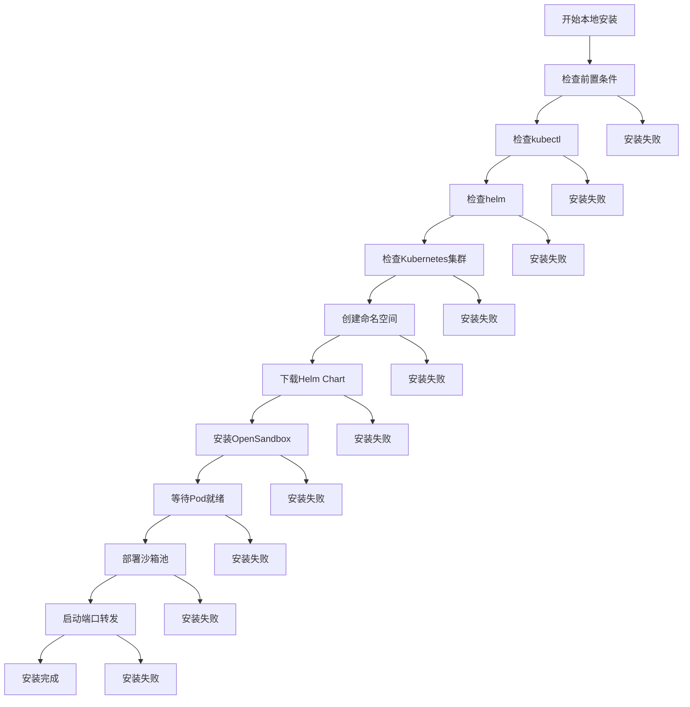
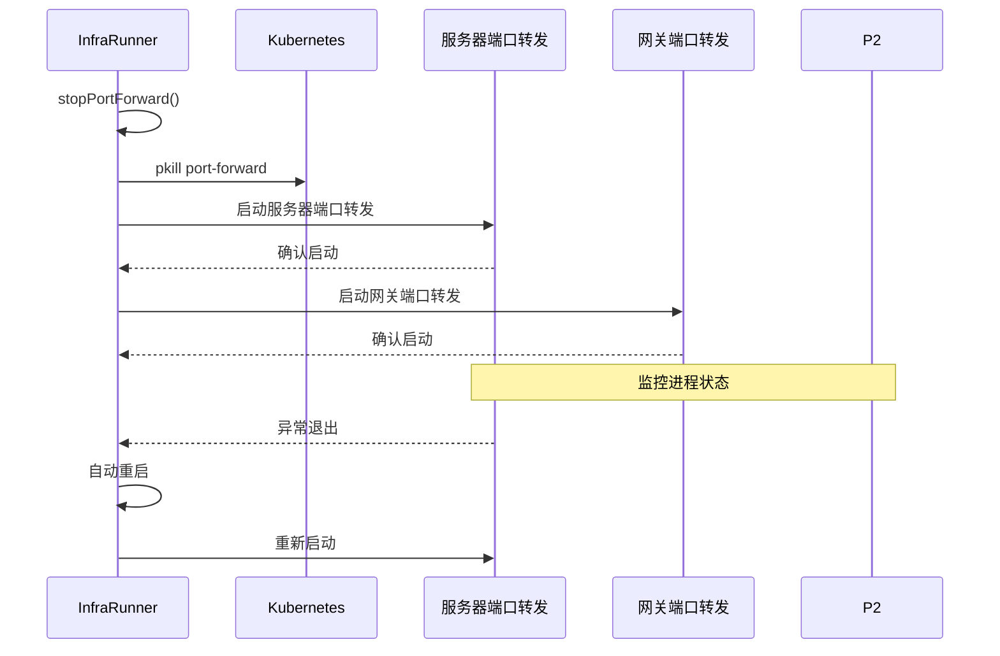
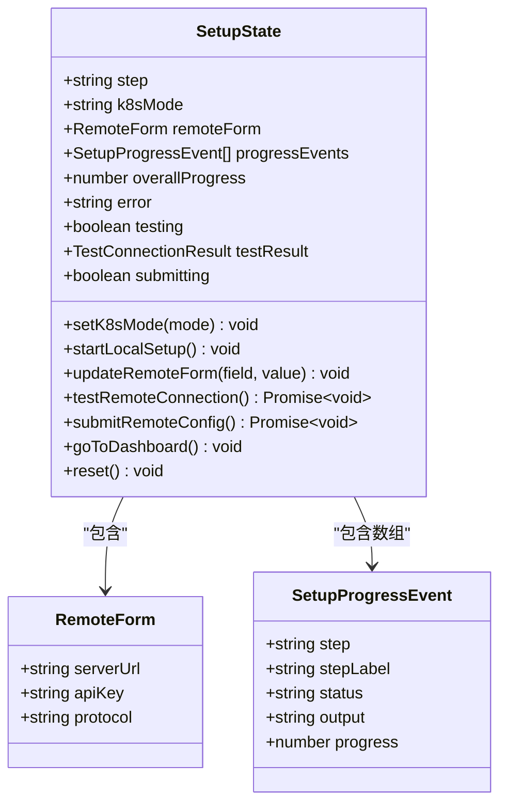
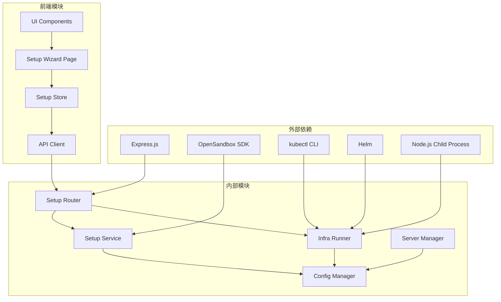

# 设置向导路由

<cite>
**本文档引用的文件**
- [apps/backend/src/routes/setup.ts](file://apps/backend/src/routes/setup.ts)
- [apps/backend/src/services/setupService.ts](file://apps/backend/src/services/setupService.ts)
- [apps/backend/src/services/infraRunner.ts](file://apps/backend/src/services/infraRunner.ts)
- [apps/backend/src/config.ts](file://apps/backend/src/config.ts)
- [apps/backend/src/server.ts](file://apps/backend/src/server.ts)
- [apps/frontend/src/api/setup.ts](file://apps/frontend/src/api/setup.ts)
- [apps/frontend/src/api/types.ts](file://apps/frontend/src/api/types.ts)
- [apps/frontend/src/stores/setupStore.ts](file://apps/frontend/src/stores/setupStore.ts)
- [apps/frontend/src/pages/SetupWizardPage.tsx](file://apps/frontend/src/pages/SetupWizardPage.tsx)
- [apps/frontend/src/components/setup/RemoteConnectionForm.tsx](file://apps/frontend/src/components/setup/RemoteConnectionForm.tsx)
- [apps/frontend/src/components/setup/ProgressTimeline.tsx](file://apps/frontend/src/components/setup/ProgressTimeline.tsx)
- [apps/frontend/src/components/setup/K8sModeCard.tsx](file://apps/frontend/src/components/setup/K8sModeCard.tsx)
</cite>

## 更新摘要
**变更内容**
- 新增SSE事件流支持，实现实时本地安装进度跟踪
- 完善设置向导状态管理，支持多步骤工作流
- 增强远程连接测试功能，提供连接状态验证
- 优化配置持久化机制，支持本地和远程配置
- 完善前端用户界面，提供直观的设置向导体验

## 目录
1. [简介](#简介)
2. [项目结构](#项目结构)
3. [核心组件](#核心组件)
4. [架构概览](#架构概览)
5. [详细组件分析](#详细组件分析)
6. [依赖关系分析](#依赖关系分析)
7. [性能考虑](#性能考虑)
8. [故障排除指南](#故障排除指南)
9. [结论](#结论)

## 简介

设置向导路由模块是 RabbitAI-Lab OpenSandbox 平台的核心配置组件，负责管理用户与 OpenSandbox 实例的连接设置。该模块提供了完整的设置向导功能，包括本地 Kubernetes 集群安装、远程 OpenSandbox 连接配置、连接状态检测和配置持久化等核心功能。

该模块采用前后端分离的设计模式，后端使用 Express.js 提供 REST API，前端使用 React 和 Zustand 状态管理库构建用户界面。整个系统支持两种部署模式：本地 Docker Kubernetes 集群和远程 OpenSandbox 实例连接。

**更新** 新增了SSE事件流支持，实现了实时的本地安装进度跟踪和完成状态管理。

## 项目结构

设置向导路由模块位于应用的后端和前端两个部分中，形成了完整的全栈解决方案：

**图表来源**
- [apps/backend/src/routes/setup.ts:1-151](file://apps/backend/src/routes/setup.ts#L1-L151)
- [apps/frontend/src/stores/setupStore.ts:1-157](file://apps/frontend/src/stores/setupStore.ts#L1-L157)

**章节来源**
- [apps/backend/src/routes/setup.ts:1-151](file://apps/backend/src/routes/setup.ts#L1-L151)
- [apps/frontend/src/stores/setupStore.ts:1-157](file://apps/frontend/src/stores/setupStore.ts#L1-L157)

## 核心组件

设置向导路由模块由多个核心组件组成，每个组件都有明确的职责和功能：

### 后端核心组件

1. **Setup Router** - 处理所有设置相关的 HTTP 请求，支持SSE事件流
2. **Setup Service** - 提供配置检查、连接测试和配置保存功能
3. **Infra Runner** - 执行本地 Kubernetes 集群安装和配置
4. **配置管理** - 基于环境变量的配置持久化机制

### 前端核心组件

1. **Setup Wizard Page** - 主要的设置向导界面
2. **Setup Store** - 状态管理和业务逻辑处理
3. **Remote Connection Form** - 远程连接配置表单
4. **Progress Timeline** - 安装进度可视化组件

**更新** 新增了SSE事件流处理和状态管理功能。

**章节来源**
- [apps/backend/src/services/setupService.ts:59-152](file://apps/backend/src/services/setupService.ts#L59-L152)
- [apps/backend/src/services/infraRunner.ts:95-538](file://apps/backend/src/services/infraRunner.ts#L95-L538)
- [apps/frontend/src/stores/setupStore.ts:41-157](file://apps/frontend/src/stores/setupStore.ts#L41-L157)

## 架构概览

设置向导路由模块采用了分层架构设计，确保了良好的可维护性和扩展性：

**更新** 新增了SSE事件流的实时进度跟踪机制。

**图表来源**
- [apps/backend/src/routes/setup.ts:19-151](file://apps/backend/src/routes/setup.ts#L19-L151)
- [apps/backend/src/services/setupService.ts:69-150](file://apps/backend/src/services/setupService.ts#L69-L150)

## 详细组件分析

### Setup Router 组件

Setup Router 是设置向导的核心入口点，负责处理所有与设置相关的 HTTP 请求。该组件实现了以下主要功能：

#### HTTP 端点定义

| 方法 | 路径 | 功能 | 请求体 | 响应体 |
|------|------|------|--------|--------|
| GET | `/api/setup/status` | 获取当前设置状态 | 无 | `{ configured: boolean, k8sMode?: string, osbServerUrl?: string }` |
| POST | `/api/setup/test-connection` | 测试远程连接 | `{ serverUrl, apiKey, protocol }` | `{ connected: boolean, error?: string }` |
| POST | `/api/setup/remote` | 保存远程配置 | `{ serverUrl, apiKey, protocol }` | `{ configured: boolean }` |
| GET | `/api/setup/local-k8s/stream` | 本地安装进度流（SSE） | 无 | SSE 事件流 |
| POST | `/api/setup/complete` | 完成本地安装 | 无 | `{ configured: boolean }` |

#### 连接状态管理

Router 实现了全局的设置状态管理，防止并发操作：

**更新** 新增了SSE事件流的连接状态管理，确保流式操作的并发安全。

**图表来源**
- [apps/backend/src/routes/setup.ts:11-14](file://apps/backend/src/routes/setup.ts#L11-L14)
- [apps/backend/src/routes/setup.ts:77-121](file://apps/backend/src/routes/setup.ts#L77-L121)

**章节来源**
- [apps/backend/src/routes/setup.ts:19-151](file://apps/backend/src/routes/setup.ts#L19-L151)

### Setup Service 组件

Setup Service 提供了设置向导的核心业务逻辑，包括配置检查、连接测试和配置持久化等功能。

#### 配置验证逻辑

**图表来源**
- [apps/backend/src/services/setupService.ts:69-81](file://apps/backend/src/services/setupService.ts#L69-L81)

#### 连接测试机制

Setup Service 使用 OpenSandbox SDK 进行连接测试：

**更新** 连接测试增加了10秒超时控制，提高了稳定性。

**图表来源**
- [apps/backend/src/services/setupService.ts:86-104](file://apps/backend/src/services/setupService.ts#L86-L104)

#### 配置持久化机制

配置持久化通过写入 .env 文件实现，支持增量更新：

**图表来源**
- [apps/backend/src/services/setupService.ts:28-57](file://apps/backend/src/services/setupService.ts#L28-L57)
- [apps/backend/src/services/setupService.ts:129-150](file://apps/backend/src/services/setupService.ts#L129-L150)

**章节来源**
- [apps/backend/src/services/setupService.ts:59-152](file://apps/backend/src/services/setupService.ts#L59-L152)

### Infra Runner 组件

Infra Runner 负责执行本地 Kubernetes 集群的完整安装流程，这是一个复杂的多步骤过程。

#### 安装流程步骤

**更新** 新增了详细的安装步骤权重分配，总权重为100%，提供精确的进度计算。

**图表来源**
- [apps/backend/src/services/infraRunner.ts:105-138](file://apps/backend/src/services/infraRunner.ts#L105-L138)

#### 端口转发机制

Infra Runner 实现了智能的端口转发管理：

**图表来源**
- [apps/backend/src/services/infraRunner.ts:506-510](file://apps/backend/src/services/infraRunner.ts#L506-L510)

**章节来源**
- [apps/backend/src/services/infraRunner.ts:95-538](file://apps/backend/src/services/infraRunner.ts#L95-L538)

### 前端组件分析

#### Setup Store 状态管理

Setup Store 使用 Zustand 实现了复杂的状态管理逻辑：

**更新** 新增了完整的设置向导状态管理，支持多步骤工作流和实时进度跟踪。

**图表来源**
- [apps/frontend/src/stores/setupStore.ts:21-39](file://apps/frontend/src/stores/setupStore.ts#L21-L39)

#### 用户界面组件

前端提供了直观的用户界面组件：

1. **K8sModeCard** - 用于选择部署模式的卡片组件
2. **RemoteConnectionForm** - 远程连接配置表单
3. **ProgressTimeline** - 安装进度时间线显示
4. **SetupWizardPage** - 主要的设置向导页面

**章节来源**
- [apps/frontend/src/stores/setupStore.ts:41-157](file://apps/frontend/src/stores/setupStore.ts#L41-L157)
- [apps/frontend/src/components/setup/RemoteConnectionForm.tsx:1-124](file://apps/frontend/src/components/setup/RemoteConnectionForm.tsx#L1-L124)
- [apps/frontend/src/components/setup/ProgressTimeline.tsx:1-92](file://apps/frontend/src/components/setup/ProgressTimeline.tsx#L1-L92)
- [apps/frontend/src/pages/SetupWizardPage.tsx:1-128](file://apps/frontend/src/pages/SetupWizardPage.tsx#L1-L128)

## 依赖关系分析

设置向导路由模块的依赖关系体现了清晰的分层架构：

**更新** 新增了SSE事件流处理和前端状态管理的依赖关系。

**图表来源**
- [apps/backend/src/routes/setup.ts:1-7](file://apps/backend/src/routes/setup.ts#L1-L7)
- [apps/frontend/src/api/setup.ts:1-73](file://apps/frontend/src/api/setup.ts#L1-L73)

**章节来源**
- [apps/backend/src/config.ts:1-71](file://apps/backend/src/config.ts#L1-L71)
- [apps/backend/src/server.ts:96-119](file://apps/backend/src/server.ts#L96-L119)

## 性能考虑

设置向导路由模块在设计时充分考虑了性能优化：

### 并发控制
- 全局设置状态标志防止并发操作
- SSE 连接的优雅断开处理
- 端口转发进程的自动重启机制

### 资源管理
- 子进程的生命周期管理
- 环境变量文件的原子写入
- 服务的按需初始化和销毁

### 错误恢复
- 网络超时的合理设置（10秒）
- Helm 安装的超时控制（6分钟）
- 端口转发的自动重连机制

**更新** 新增了SSE事件流的性能优化，包括缓存控制和连接保持。

## 故障排除指南

### 常见问题及解决方案

#### 连接测试失败
**症状**: 远程连接测试显示失败
**可能原因**:
- 服务器URL格式不正确
- API密钥无效或过期
- 网络连接问题
- 服务器防火墙阻拦

**解决步骤**:
1. 验证服务器URL格式
2. 检查API密钥的有效性
3. 确认网络连通性
4. 检查服务器防火墙设置

#### 本地安装失败
**症状**: 本地Kubernetes安装过程中断
**可能原因**:
- kubectl命令不可用
- Helm未正确安装
- Kubernetes集群不可达
- 端口冲突

**解决步骤**:
1. 安装并配置kubectl
2. 确保Helm正确安装
3. 检查Docker Desktop Kubernetes状态
4. 关闭占用8080端口的程序

#### 配置持久化失败
**症状**: 配置更改后重启失效
**可能原因**:
- .env文件权限问题
- 文件写入异常
- 进程环境变量未更新

**解决步骤**:
1. 检查.env文件权限
2. 验证磁盘空间充足
3. 重启后端服务

**更新** 新增了SSE事件流连接失败的故障排除指南。

#### SSE事件流连接失败
**症状**: 本地安装进度无法显示
**可能原因**:
- 网络连接中断
- 服务器负载过高
- 浏览器SSE支持问题

**解决步骤**:
1. 检查网络连接稳定性
2. 刷新页面重新建立连接
3. 尝试不同的浏览器
4. 检查服务器资源使用情况

**章节来源**
- [apps/backend/src/services/setupService.ts:98-104](file://apps/backend/src/services/setupService.ts#L98-L104)
- [apps/backend/src/services/infraRunner.ts:150-175](file://apps/backend/src/services/infraRunner.ts#L150-L175)

## 结论

设置向导路由模块是一个设计精良、功能完整的配置管理系统。它成功地将复杂的后端操作封装为简洁的API接口，并通过直观的前端界面为用户提供流畅的配置体验。

### 主要优势

1. **模块化设计**: 清晰的分层架构便于维护和扩展
2. **用户体验**: 完整的进度反馈和错误处理
3. **可靠性**: 并发控制和错误恢复机制
4. **安全性**: 配置信息的安全存储和传输
5. **可扩展性**: 支持多种部署模式和配置选项
6. **实时性**: SSE事件流提供即时的安装进度反馈

**更新** 新增了SSE事件流支持，显著提升了用户体验和系统响应性。

### 技术亮点

- **SSE 实时通信**: 提供流畅的安装进度反馈
- **智能配置管理**: 自动检测和持久化配置
- **健壮的错误处理**: 全面的异常捕获和用户提示
- **服务动态重载**: 配置变更后的无缝服务切换
- **多步骤工作流**: 完整的设置向导状态管理

该模块为 RabbitAI-Lab OpenSandbox 平台提供了坚实的基础，确保用户能够快速、安全地完成平台配置。