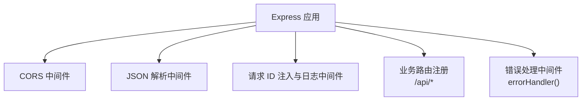
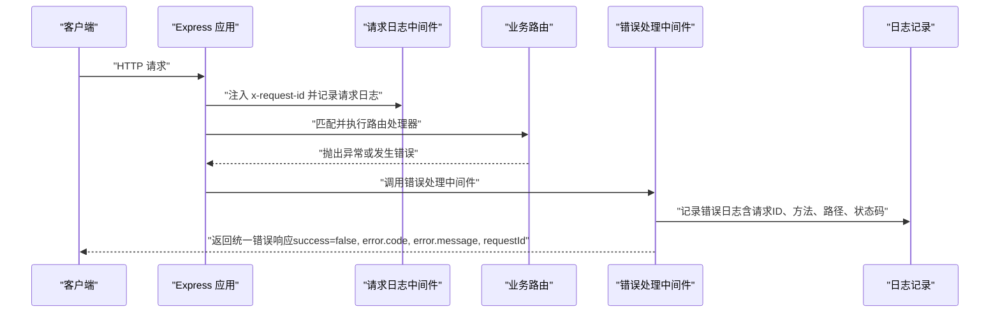
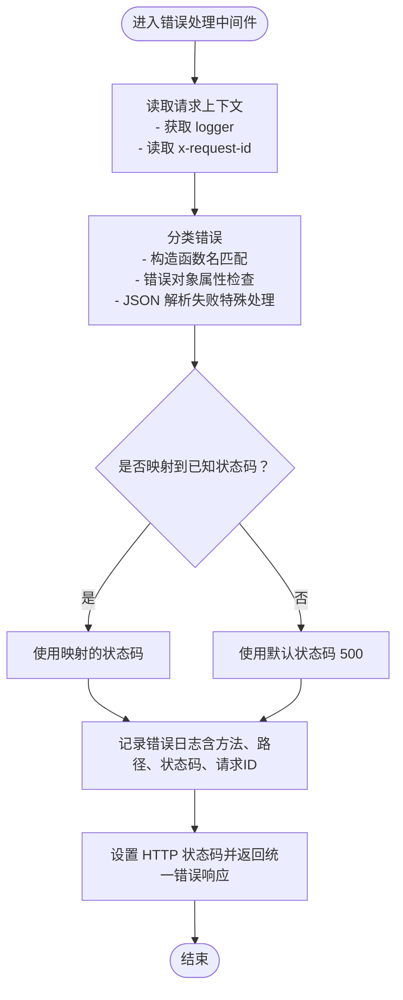
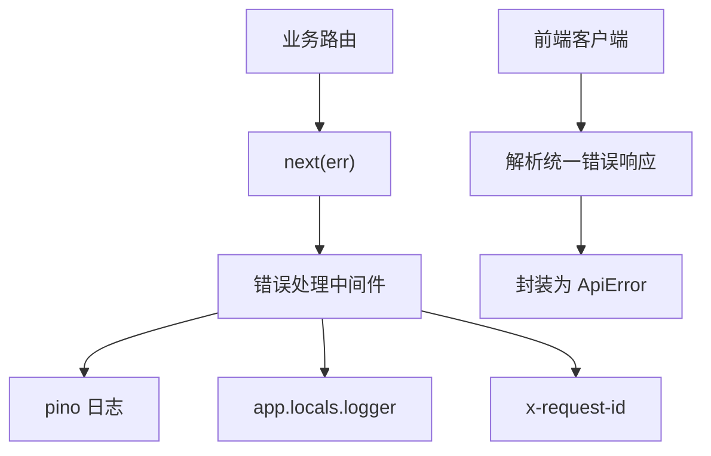

# 错误处理中间件

<cite>
**本文引用的文件**
- [apps/backend/src/middleware/error.ts](file://apps/backend/src/middleware/error.ts)
- [apps/backend/src/server.ts](file://apps/backend/src/server.ts)
- [apps/backend/src/logger.ts](file://apps/backend/src/logger.ts)
- [apps/backend/src/types/index.ts](file://apps/backend/src/types/index.ts)
- [apps/backend/src/routes/index.ts](file://apps/backend/src/routes/index.ts)
- [apps/backend/src/routes/sandboxes.ts](file://apps/backend/src/routes/sandboxes.ts)
- [apps/backend/src/routes/commands.ts](file://apps/backend/src/routes/commands.ts)
- [apps/backend/src/routes/files.ts](file://apps/backend/src/routes/files.ts)
- [apps/backend/src/config.ts](file://apps/backend/src/config.ts)
- [apps/backend/src/websocket/connectionManager.ts](file://apps/backend/src/websocket/connectionManager.ts)
- [apps/frontend/src/api/client.ts](file://apps/frontend/src/api/client.ts)
</cite>

## 目录
1. [简介](#简介)
2. [项目结构](#项目结构)
3. [核心组件](#核心组件)
4. [架构总览](#架构总览)
5. [详细组件分析](#详细组件分析)
6. [依赖关系分析](#依赖关系分析)
7. [性能考量](#性能考量)
8. [故障排查指南](#故障排查指南)
9. [结论](#结论)
10. [附录](#附录)

## 简介
本文件聚焦于后端错误处理中间件的设计与实现，系统性阐述全局错误捕获、错误分类、统一响应格式、日志记录、请求追踪（Request ID）等机制；说明错误中间件在 Express 应用中的执行顺序、错误类型映射与 HTTP 状态码策略；讨论错误信息安全性与敏感信息过滤、调试信息控制；并提供典型错误响应示例与监控、日志分析、故障诊断的最佳实践。

## 项目结构
后端采用 Express 框架，错误处理中间件作为最后一个中间件注册，确保所有未处理异常都会被统一拦截与转换为一致的响应格式。请求生命周期中，先进行 CORS、JSON 解析、请求 ID 注入与日志记录，再注册业务路由，最后挂载错误处理中间件。

图表来源
- [apps/backend/src/server.ts: 36-68:36-68](file://apps/backend/src/server.ts#L36-L68)

章节来源
- [apps/backend/src/server.ts: 36-68:36-68](file://apps/backend/src/server.ts#L36-L68)
- [apps/backend/src/routes/index.ts: 9-15:9-15](file://apps/backend/src/routes/index.ts#L9-L15)

## 核心组件
- 全局错误处理中间件：负责捕获未处理异常，基于错误类型与属性推断 HTTP 状态码，记录结构化日志，并返回统一的错误响应体。
- 请求 ID 注入与日志中间件：为每个请求生成唯一标识，贯穿请求生命周期，便于日志聚合与问题定位。
- 统一响应模型：前后端约定统一的响应结构，包含 success、data、error 字段，其中 error 包含 code、message、requestId。
- 前端错误解析器：将后端统一错误响应转换为前端可识别的 ApiError 类型，便于 UI 层统一处理。

章节来源
- [apps/backend/src/middleware/error.ts: 5-31:5-31](file://apps/backend/src/middleware/error.ts#L5-L31)
- [apps/backend/src/server.ts: 44-48:44-48](file://apps/backend/src/server.ts#L44-L48)
- [apps/backend/src/types/index.ts: 3-11:3-11](file://apps/backend/src/types/index.ts#L3-L11)
- [apps/frontend/src/api/client.ts: 5-14:5-14](file://apps/frontend/src/api/client.ts#L5-L14)

## 架构总览
下图展示了从请求进入应用到错误处理中间件拦截并返回统一错误响应的整体流程。

图表来源
- [apps/backend/src/server.ts: 44-48:44-48](file://apps/backend/src/server.ts#L44-L48)
- [apps/backend/src/middleware/error.ts: 5-31:5-31](file://apps/backend/src/middleware/error.ts#L5-L31)

## 详细组件分析

### 错误处理中间件（errorHandler）
- 执行顺序：必须注册在所有路由之后，作为最后一个中间件，确保任何未捕获异常都会被拦截。
- 日志记录：使用 pino 记录错误上下文，包含错误对象、HTTP 方法、路径、请求 ID、状态码，便于审计与排障。
- 统一响应：返回 JSON，字段包含 success=false、error.code（形如 "HTTP_XXX"）、error.message、requestId。
- 错误分类与状态码映射：通过构造函数名与错误对象属性进行分类，优先判断 SDK 异常与特定异常类型，其次处理 JSON 解析失败等常见场景，默认回退为 500。

图表来源
- [apps/backend/src/middleware/error.ts: 5-47:5-47](file://apps/backend/src/middleware/error.ts#L5-L47)

章节来源
- [apps/backend/src/middleware/error.ts: 5-31:5-31](file://apps/backend/src/middleware/error.ts#L5-L31)
- [apps/backend/src/middleware/error.ts: 33-47:33-47](file://apps/backend/src/middleware/error.ts#L33-L47)

### 请求 ID 注入与日志中间件
- 在每个请求到达时生成或复用 x-request-id，便于跨服务链路追踪。
- 记录请求级日志，包含方法与路径，便于快速定位请求来源。

章节来源
- [apps/backend/src/server.ts: 44-48:44-48](file://apps/backend/src/server.ts#L44-L48)

### 统一响应模型与前端解析
- 后端统一响应结构包含 success、data、error 三部分；error 中包含 code、message、requestId。
- 前端将后端错误响应转换为 ApiError，保留 code、message、statusCode，便于 UI 层统一处理与提示。

章节来源
- [apps/backend/src/types/index.ts: 3-11:3-11](file://apps/backend/src/types/index.ts#L3-L11)
- [apps/frontend/src/api/client.ts: 5-14:5-14](file://apps/frontend/src/api/client.ts#L5-L14)
- [apps/frontend/src/api/client.ts: 38-41:38-41](file://apps/frontend/src/api/client.ts#L38-L41)

### 路由层错误传播与局部错误处理
- 多数路由在 try/catch 中执行业务逻辑，遇到错误时调用 next(err)，交由全局错误中间件统一处理。
- 部分路由在参数校验阶段直接返回 4xx 错误，不进入 next(err) 流程，避免被全局中间件覆盖语义化的状态码。

章节来源
- [apps/backend/src/routes/sandboxes.ts: 90-92:90-92](file://apps/backend/src/routes/sandboxes.ts#L90-L92)
- [apps/backend/src/routes/sandboxes.ts: 96-104:96-104](file://apps/backend/src/routes/sandboxes.ts#L96-L104)
- [apps/backend/src/routes/commands.ts: 19-22:19-22](file://apps/backend/src/routes/commands.ts#L19-L22)
- [apps/backend/src/routes/files.ts: 53-62:53-62](file://apps/backend/src/routes/files.ts#L53-L62)

### 错误分类与状态码映射规则
- SDK 异常：当错误具备 statusCode 或构造函数名为特定 SDK 异常类型时，使用其 statusCode；若缺失则回退为 502。
- 特定异常类型：如准备超时异常映射为 504；参数非法映射为 400；内部异常映射为 502。
- JSON 解析失败：当错误对象包含 type="entity.parse.failed" 时映射为 400。
- 默认回退：其他未识别错误统一映射为 500。

章节来源
- [apps/backend/src/middleware/error.ts: 33-47:33-47](file://apps/backend/src/middleware/error.ts#L33-L47)

### 安全性与敏感信息控制
- 错误消息：默认使用错误对象 message 字段；若为空则回退为通用“Internal Server Error”，避免泄露内部细节。
- 调试信息：日志中包含错误对象与上下文，但不包含敏感数据；生产环境建议关闭过细的日志级别，仅保留必要字段。
- 请求 ID：贯穿请求生命周期，便于审计与定位，同时避免在响应体中直接暴露。

章节来源
- [apps/backend/src/middleware/error.ts: 16-21:16-21](file://apps/backend/src/middleware/error.ts#L16-L21)
- [apps/backend/src/logger.ts: 3-14:3-14](file://apps/backend/src/logger.ts#L3-L14)

### 错误响应示例（按类型）
以下示例展示不同错误类型的响应形态（字段与含义以统一响应模型为准）：
- 参数错误（400）
  - 结构：success=false，error.code=形如 "HTTP_400"，error.message=具体错误信息，requestId=请求 ID
  - 触发场景：命令执行缺少必要参数、文件操作缺少路径等
- SDK 异常（502）
  - 结构：success=false，error.code=形如 "HTTP_502"，error.message=SDK 返回的错误信息，requestId=请求 ID
  - 触发场景：与远端服务交互失败
- 准备超时（504）
  - 结构：success=false，error.code=形如 "HTTP_504"，error.message=超时信息，requestId=请求 ID
  - 触发场景：资源准备或初始化超时
- JSON 解析失败（400）
  - 结构：success=false，error.code=形如 "HTTP_400"，error.message=解析失败信息，requestId=请求 ID
  - 触发场景：请求体格式不正确
- 未知错误（500）
  - 结构：success=false，error.code=形如 "HTTP_500"，error.message=通用错误信息，requestId=请求 ID
  - 触发场景：未被显式分类的异常

章节来源
- [apps/backend/src/middleware/error.ts: 33-47:33-47](file://apps/backend/src/middleware/error.ts#L33-L47)
- [apps/backend/src/routes/commands.ts: 19-22:19-22](file://apps/backend/src/routes/commands.ts#L19-L22)
- [apps/backend/src/routes/files.ts: 53-62:53-62](file://apps/backend/src/routes/files.ts#L53-L62)

## 依赖关系分析
- 错误处理中间件依赖：
  - pino 日志库用于结构化日志输出
  - Express 应用上下文 app.locals 提供 logger 实例
  - 请求头 x-request-id 用于请求追踪
- 与路由的关系：
  - 路由层通过 next(err) 将异常传递给错误处理中间件
  - 部分路由在参数校验阶段直接返回 4xx，不进入 next(err)
- 与前端的关系：
  - 前端根据统一响应模型解析错误，封装为 ApiError

图表来源
- [apps/backend/src/middleware/error.ts: 11-12:11-12](file://apps/backend/src/middleware/error.ts#L11-L12)
- [apps/backend/src/server.ts: 59-61:59-61](file://apps/backend/src/server.ts#L59-L61)
- [apps/frontend/src/api/client.ts: 38-41:38-41](file://apps/frontend/src/api/client.ts#L38-L41)

章节来源
- [apps/backend/src/middleware/error.ts: 11-12:11-12](file://apps/backend/src/middleware/error.ts#L11-L12)
- [apps/backend/src/server.ts: 59-61:59-61](file://apps/backend/src/server.ts#L59-L61)
- [apps/frontend/src/api/client.ts: 38-41:38-41](file://apps/frontend/src/api/client.ts#L38-L41)

## 性能考量
- 错误处理中间件本身开销极低，主要成本在于日志写入与 JSON 序列化；建议在生产环境使用异步日志传输或批量写入策略。
- 对于频繁发生的 4xx 错误（如参数校验失败），应优先在路由层尽早返回，减少后续处理链路的负担。
- 对于 5xx 错误，建议结合熔断与限流策略，避免雪崩效应。

## 故障排查指南
- 使用请求 ID 进行日志检索：在日志系统中按 x-request-id 关联一次完整的请求链路。
- 分类定位：
  - 4xx：优先检查路由层的参数校验与业务前置条件
  - 502：检查与外部服务的连接与鉴权
  - 504：检查资源准备、初始化耗时与超时配置
  - 500：检查未捕获异常与第三方 SDK 的异常传播
- 日志字段解读：
  - method/path：定位具体接口
  - statusCode：确认错误映射是否符合预期
  - requestId：串联前后端日志
- 建议的排查步骤：
  1) 在日志系统中按 requestId 过滤该次请求的所有日志
  2) 查看错误处理中间件记录的错误上下文
  3) 回溯到对应路由层，确认是否有自定义 4xx 响应被覆盖
  4) 检查上游服务与网络连通性

章节来源
- [apps/backend/src/middleware/error.ts: 18-21:18-21](file://apps/backend/src/middleware/error.ts#L18-L21)
- [apps/backend/src/server.ts: 44-48:44-48](file://apps/backend/src/server.ts#L44-L48)

## 结论
本项目的错误处理中间件通过“统一响应模型 + 结构化日志 + 请求 ID 追踪”的组合，实现了高一致性与可诊断性的错误处理能力。配合路由层的早期校验与错误传播策略，能够有效提升系统的稳定性与可观测性。建议在生产环境中严格控制日志级别与敏感信息输出，并建立完善的告警与根因分析流程。

## 附录
- 配置项参考（与错误处理相关）
  - LOG_LEVEL：日志级别，影响日志输出量与性能
  - OPENSANDBOX_*：与 SDK 交互相关的配置，异常多源于此
  - CORS_ORIGIN：跨域配置，异常多为 403/404，需结合路由层处理

章节来源
- [apps/backend/src/config.ts: 48-70:48-70](file://apps/backend/src/config.ts#L48-L70)
- [apps/backend/src/websocket/connectionManager.ts: 18-28:18-28](file://apps/backend/src/websocket/connectionManager.ts#L18-L28)