# PTY中继机制

<cite>
**本文档引用的文件**
- [ptyRelay.ts](file://apps/backend/src/websocket/ptyRelay.ts)
- [connectionManager.ts](file://apps/backend/src/websocket/connectionManager.ts)
- [types.ts](file://apps/backend/src/websocket/types.ts)
- [useTerminal.ts](file://apps/frontend/src/hooks/useTerminal.ts)
- [TerminalPane.tsx](file://apps/frontend/src/components/terminal/TerminalPane.tsx)
- [server.ts](file://apps/backend/src/server.ts)
- [config.ts](file://apps/backend/src/config.ts)
- [sandboxService.ts](file://apps/backend/src/services/sandboxService.ts)
- [index.ts](file://apps/backend/src/index.ts)
</cite>

## 目录
1. [简介](#简介)
2. [项目结构](#项目结构)
3. [核心组件](#核心组件)
4. [架构概览](#架构概览)
5. [详细组件分析](#详细组件分析)
6. [依赖关系分析](#依赖关系分析)
7. [性能考虑](#性能考虑)
8. [故障排除指南](#故障排除指南)
9. [结论](#结论)

## 简介

PTY中继机制是Sandbox-Manager项目中的核心功能模块，负责在前端xterm.js终端与后端OpenSandbox Server Proxy之间建立透明的数据传输通道。该机制实现了完整的双向通信管道，支持标准输入输出重定向、进程退出通知以及终端尺寸调整等功能。

本技术文档深入解析了PTY中继的完整数据流，包括从用户输入到操作系统执行的完整路径，详细说明了二进制协议格式和JSON控制消息的实现细节，并提供了handleUpgrade方法的完整实现流程分析。

## 项目结构

Sandbox-Manager采用前后端分离的架构设计，PTY中继机制主要涉及以下关键目录和文件：

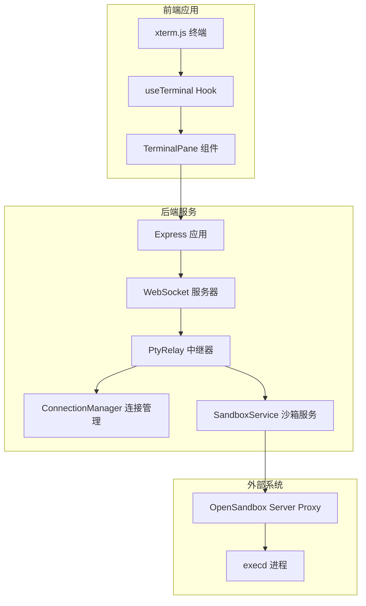

**图表来源**
- [server.ts:36-90](file://apps/backend/src/server.ts#L36-L90)
- [ptyRelay.ts:22-38](file://apps/backend/src/websocket/ptyRelay.ts#L22-L38)

**章节来源**
- [server.ts:1-119](file://apps/backend/src/server.ts#L1-L119)
- [index.ts:1-66](file://apps/backend/src/index.ts#L1-L66)

## 核心组件

### PTY中继器 (PtyRelay)

PtyRelay是整个系统的核心组件，负责处理WebSocket升级、建立双向数据通道以及错误处理。其主要职责包括：

- **握手完成**: 完成前端WebSocket连接的握手过程
- **代理URL解析**: 从SandboxService获取execd代理URL
- **PTY会话创建**: 通过HTTP请求创建新的PTY会话
- **双向中继建立**: 建立前端到后端、后端到前端的双向数据传输通道

### 连接管理器 (ConnectionManager)

ConnectionManager负责管理所有活跃的PTY连接，提供连接生命周期管理、空闲检测和资源清理功能。

### 类型定义

系统使用TypeScript接口定义了关键的数据结构：
- `PtyControlMessage`: JSON控制消息格式
- `ActivePtyConnection`: 活跃连接状态信息

**章节来源**
- [ptyRelay.ts:9-21](file://apps/backend/src/websocket/ptyRelay.ts#L9-L21)
- [connectionManager.ts:7-16](file://apps/backend/src/websocket/connectionManager.ts#L7-L16)
- [types.ts:4-19](file://apps/backend/src/websocket/types.ts#L4-L19)

## 架构概览

PTY中继机制的完整数据流向如下：

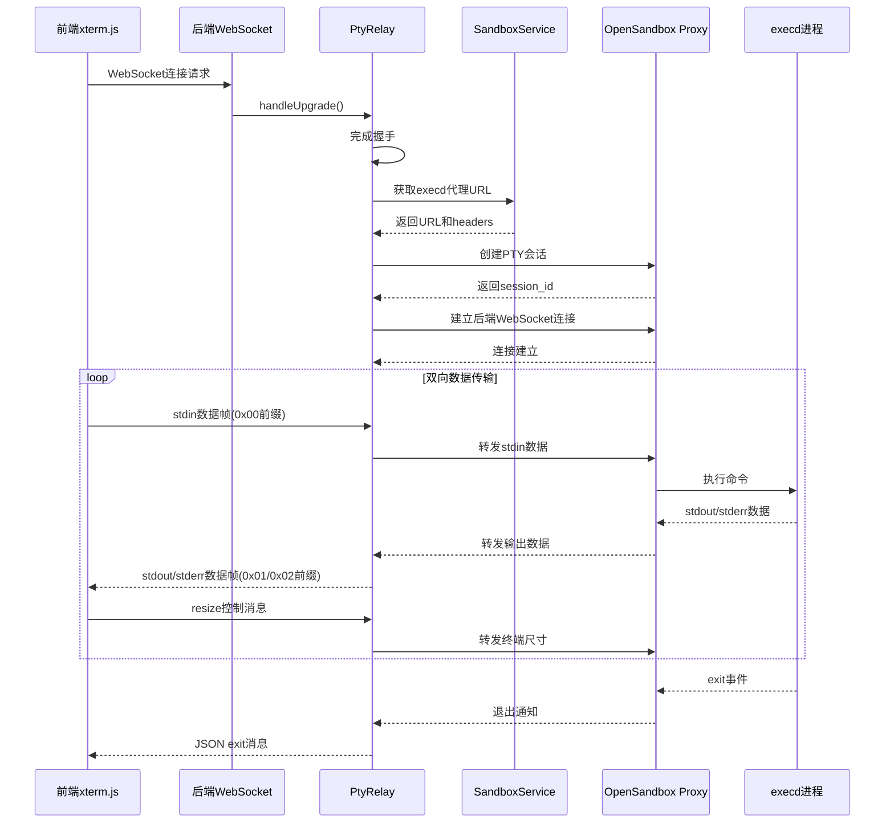

**图表来源**
- [ptyRelay.ts:40-118](file://apps/backend/src/websocket/ptyRelay.ts#L40-L118)
- [useTerminal.ts:25-95](file://apps/frontend/src/hooks/useTerminal.ts#L25-L95)

## 详细组件分析

### 二进制协议格式

系统实现了自定义的二进制协议，用于高效传输终端数据：

#### 数据帧格式

| 前缀字节 | 数据类型 | 描述 |
|---------|----------|------|
| 0x00 | stdin | 用户输入数据，UTF-8编码 |
| 0x01 | stdout | 标准输出数据，UTF-8编码 |
| 0x02 | stderr | 错误输出数据，UTF-8编码 |

#### 协议实现细节

前端使用TextEncoder将字符串数据转换为UTF-8字节数组，并在数组开头添加相应的前缀字节：

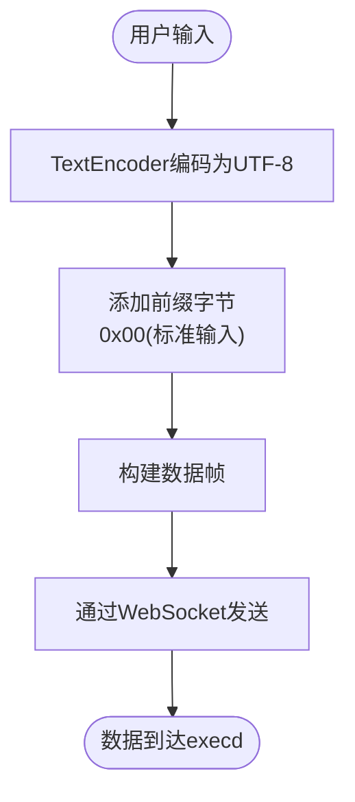

**图表来源**
- [useTerminal.ts:127-137](file://apps/frontend/src/hooks/useTerminal.ts#L127-L137)

后端接收到数据帧后，根据前缀字节进行相应的处理：

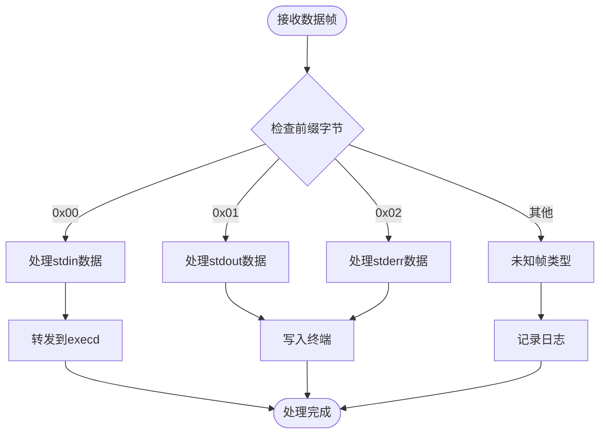

**图表来源**
- [useTerminal.ts:48-77](file://apps/frontend/src/hooks/useTerminal.ts#L48-L77)

**章节来源**
- [ptyRelay.ts:16-21](file://apps/backend/src/websocket/ptyRelay.ts#L16-L21)
- [useTerminal.ts:51-61](file://apps/frontend/src/hooks/useTerminal.ts#L51-L61)

### JSON控制消息格式

系统支持两种JSON控制消息，用于处理终端交互的关键事件：

#### resize事件

resize事件用于通知execd进程终端窗口尺寸的变化：

```typescript
{
  "type": "resize",
  "cols": number,
  "rows": number
}
```

前端在终端尺寸变化时自动发送此消息，确保execd能够正确调整输出格式。

#### exit事件

exit事件用于通知客户端进程已结束：

```typescript
{
  "type": "exit",
  "code": number
}
```

当execd进程退出时，系统会发送此消息，前端收到后会在终端显示退出信息并断开连接。

**章节来源**
- [types.ts:4-9](file://apps/backend/src/websocket/types.ts#L4-L9)
- [useTerminal.ts:64-76](file://apps/frontend/src/hooks/useTerminal.ts#L64-L76)

### handleUpgrade方法完整实现流程

handleUpgrade方法是PTY中继机制的核心入口点，负责完整的连接建立流程：

#### 步骤1：完成前端WebSocket握手

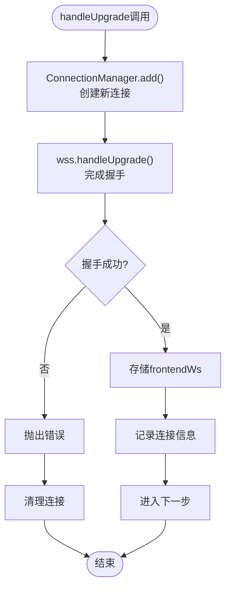

**图表来源**
- [ptyRelay.ts:54-66](file://apps/backend/src/websocket/ptyRelay.ts#L54-L66)

#### 步骤2：解析execd代理URL

系统通过SandboxService获取execd代理的访问URL和必要的认证头信息：

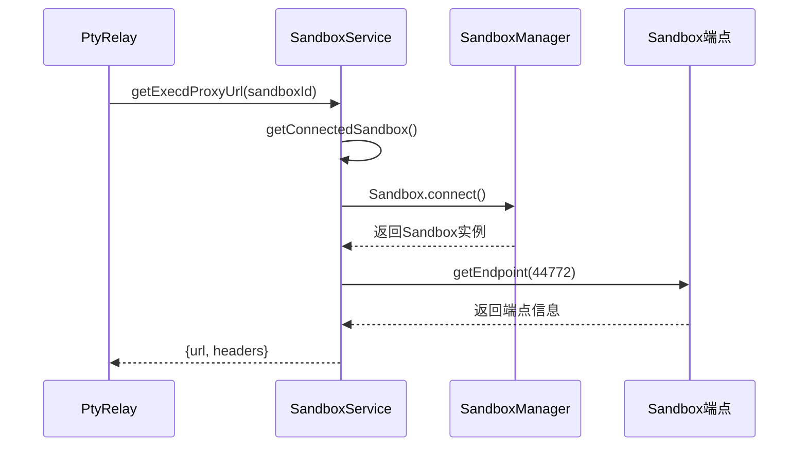

**图表来源**
- [ptyRelay.ts:70-72](file://apps/backend/src/websocket/ptyRelay.ts#L70-L72)
- [sandboxService.ts:129-138](file://apps/backend/src/services/sandboxService.ts#L129-L138)

#### 步骤3：创建PTY会话

通过HTTP POST请求在execd上创建新的PTY会话：

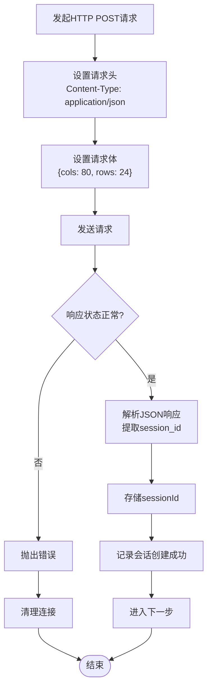

**图表来源**
- [ptyRelay.ts:74-93](file://apps/backend/src/websocket/ptyRelay.ts#L74-L93)

#### 步骤4：建立后端WebSocket连接

使用获取到的URL和认证头信息连接到execd的WebSocket端点：

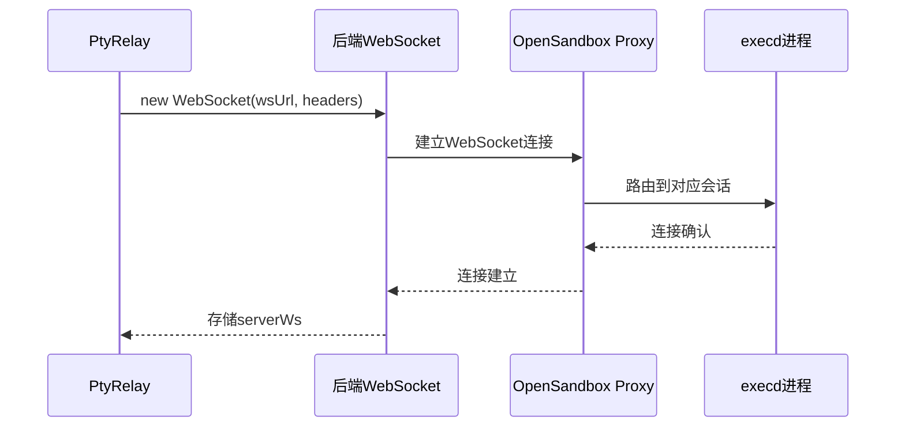

**图表来源**
- [ptyRelay.ts:95-106](file://apps/backend/src/websocket/ptyRelay.ts#L95-L106)

#### 步骤5：建立双向中继

最后建立双向数据传输通道，实现透明的数据转发：

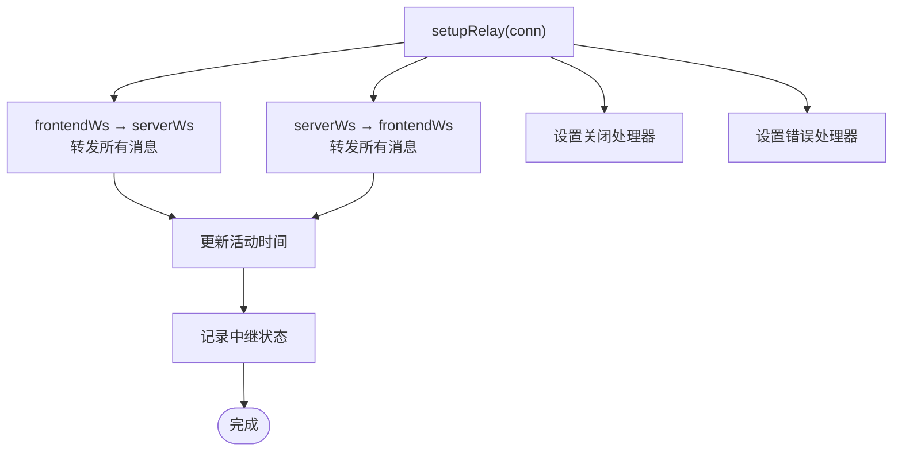

**图表来源**
- [ptyRelay.ts:120-169](file://apps/backend/src/websocket/ptyRelay.ts#L120-L169)

**章节来源**
- [ptyRelay.ts:40-118](file://apps/backend/src/websocket/ptyRelay.ts#L40-L118)

### 前端xterm.js集成

前端使用xterm.js库实现终端功能，通过自定义Hook管理WebSocket连接和数据传输：

#### 终端初始化

前端在组件挂载时创建Terminal实例，配置主题、字体和插件：

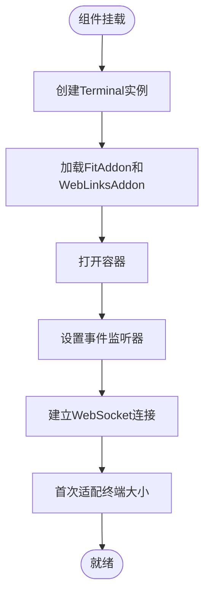

**图表来源**
- [useTerminal.ts:101-125](file://apps/frontend/src/hooks/useTerminal.ts#L101-L125)

#### 数据处理流程

前端对不同类型的数据进行不同的处理：

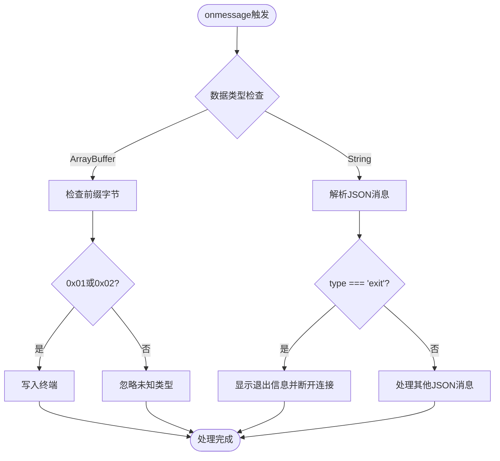

**图表来源**
- [useTerminal.ts:48-77](file://apps/frontend/src/hooks/useTerminal.ts#L48-L77)

**章节来源**
- [useTerminal.ts:12-179](file://apps/frontend/src/hooks/useTerminal.ts#L12-L179)
- [TerminalPane.tsx:8-37](file://apps/frontend/src/components/terminal/TerminalPane.tsx#L8-L37)

## 依赖关系分析

系统采用清晰的分层架构，各组件之间的依赖关系如下：

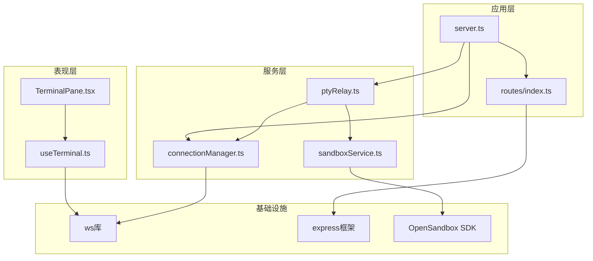

**图表来源**
- [server.ts:15-26](file://apps/backend/src/server.ts#L15-L26)
- [ptyRelay.ts:1-8](file://apps/backend/src/websocket/ptyRelay.ts#L1-L8)

### 关键依赖关系

1. **PtyRelay依赖关系**:
   - 依赖ConnectionManager进行连接管理
   - 依赖SandboxService获取execd代理URL
   - 依赖配置系统获取运行参数

2. **ConnectionManager依赖关系**:
   - 使用Map存储连接状态
   - 依赖配置系统进行空闲检测
   - 依赖日志系统进行调试输出

3. **SandboxService依赖关系**:
   - 依赖OpenSandbox SDK进行沙箱操作
   - 使用LRU缓存管理连接状态
   - 提供execd代理URL解析功能

**章节来源**
- [server.ts:50-54](file://apps/backend/src/server.ts#L50-L54)
- [ptyRelay.ts:22-38](file://apps/backend/src/websocket/ptyRelay.ts#L22-L38)

## 性能考虑

### 连接池管理

系统使用LRU缓存管理Sandbox连接，限制最大缓存数量为50个，超时时间为10分钟。这种设计平衡了内存使用和连接复用效率。

### 空闲连接检测

ConnectionManager提供定时检查机制，每60秒扫描一次连接状态，超过配置的空闲超时时间（默认5分钟）的连接会被自动清理。

### 内存优化策略

1. **事件监听器清理**: 在组件卸载时正确清理所有事件监听器，防止内存泄漏
2. **WebSocket资源管理**: 确保连接关闭时释放相关资源
3. **数据缓冲区管理**: 使用Uint8Array进行高效的数据处理

### 网络优化

1. **透明中继**: PtyRelay采用透明模式转发数据，避免额外的协议开销
2. **批量处理**: 对于高频数据传输，系统尽量减少不必要的对象创建
3. **错误恢复**: 实现指数退避重连机制，提高网络不稳定情况下的可靠性

## 故障排除指南

### 常见问题及解决方案

#### WebSocket连接失败

**症状**: 前端终端无法连接到后端

**可能原因**:
1. OpenSandbox未正确配置
2. 网络连接异常
3. 认证头缺失

**排查步骤**:
1. 检查环境变量配置
2. 验证OpenSandbox服务可用性
3. 查看后端日志中的错误信息

#### PTY会话创建失败

**症状**: 连接建立但无法创建会话

**可能原因**:
1. execd服务不可用
2. 权限不足
3. 请求超时

**排查步骤**:
1. 检查execd服务状态
2. 验证API密钥有效性
3. 调整请求超时配置

#### 数据传输异常

**症状**: 终端显示乱码或数据丢失

**可能原因**:
1. 编码不匹配
2. 帧格式错误
3. 网络中断

**排查步骤**:
1. 验证UTF-8编码设置
2. 检查前缀字节完整性
3. 监控网络连接稳定性

### 日志分析

系统提供了详细的日志记录，包括：
- 连接建立和断开事件
- 数据传输统计信息
- 错误和异常信息
- 性能指标监控

**章节来源**
- [ptyRelay.ts:110-117](file://apps/backend/src/websocket/ptyRelay.ts#L110-L117)
- [connectionManager.ts:92-99](file://apps/backend/src/websocket/connectionManager.ts#L92-L99)

## 结论

PTY中继机制通过精心设计的架构和协议，实现了高效的终端远程访问功能。系统的主要优势包括：

1. **透明传输**: 采用二进制协议确保数据传输的高效性和准确性
2. **双向中继**: 建立完整的双向通信通道，支持实时交互
3. **健壮性**: 完善的错误处理和连接管理机制
4. **可扩展性**: 清晰的分层架构便于功能扩展和维护

该机制为Sandbox-Manager提供了强大的终端访问能力，使得用户可以通过浏览器界面直接与沙箱环境进行交互，大大提升了用户体验和系统的实用性。