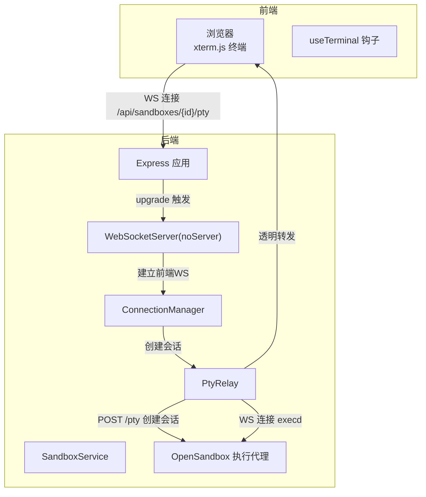
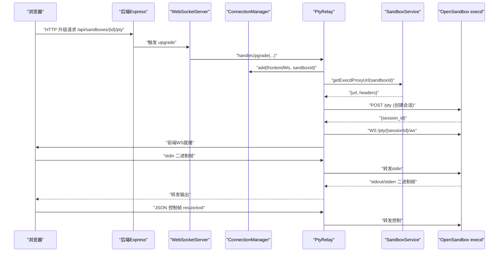

# WebSocket类型与协议

<cite>
**本文引用的文件**
- [apps/backend/src/websocket/types.ts](file://apps/backend/src/websocket/types.ts)
- [apps/backend/src/websocket/connectionManager.ts](file://apps/backend/src/websocket/connectionManager.ts)
- [apps/backend/src/websocket/ptyRelay.ts](file://apps/backend/src/websocket/ptyRelay.ts)
- [apps/backend/src/server.ts](file://apps/backend/src/server.ts)
- [apps/backend/src/config.ts](file://apps/backend/src/config.ts)
- [apps/backend/src/services/sandboxService.ts](file://apps/backend/src/services/sandboxService.ts)
- [apps/frontend/src/hooks/useTerminal.ts](file://apps/frontend/src/hooks/useTerminal.ts)
- [apps/frontend/src/stores/terminalStore.ts](file://apps/frontend/src/stores/terminalStore.ts)
</cite>

## 目录
1. [简介](#简介)
2. [项目结构](#项目结构)
3. [核心组件](#核心组件)
4. [架构总览](#架构总览)
5. [详细组件分析](#详细组件分析)
6. [依赖关系分析](#依赖关系分析)
7. [性能考虑](#性能考虑)
8. [故障排查指南](#故障排查指南)
9. [结论](#结论)
10. [附录](#附录)

## 简介
本文件面向WebSocket类型定义与协议规范，系统化阐述ActivePtyConnection接口的结构与约束、WebSocket消息协议（二进制帧与文本帧）、控制消息协议（resize与exit）、错误码与异常处理、协议版本兼容性与扩展建议，并提供协议交互示例与调试方法。目标读者既包括后端开发者，也包括前端终端集成工程师与运维人员。

## 项目结构
本项目采用前后端分离的微服务架构，后端通过Express提供REST API与WebSocket升级能力，前端使用xterm.js在浏览器中渲染终端。WebSocket终端会话由后端的PtyRelay进行透明转发，连接生命周期由ConnectionManager管理。



图表来源
- [apps/backend/src/server.ts:75-87](file://apps/backend/src/server.ts#L75-L87)
- [apps/backend/src/websocket/ptyRelay.ts:40-118](file://apps/backend/src/websocket/ptyRelay.ts#L40-L118)
- [apps/backend/src/websocket/connectionManager.ts:30-46](file://apps/backend/src/websocket/connectionManager.ts#L30-L46)
- [apps/backend/src/services/sandboxService.ts:129-138](file://apps/backend/src/services/sandboxService.ts#L129-L138)

章节来源
- [apps/backend/src/server.ts:36-90](file://apps/backend/src/server.ts#L36-L90)
- [apps/backend/src/websocket/ptyRelay.ts:9-21](file://apps/backend/src/websocket/ptyRelay.ts#L9-L21)

## 核心组件
- ActivePtyConnection：后端对一次终端会话的抽象，包含连接标识、沙箱标识、两端WebSocket、会话ID、时间戳等。
- PtyRelay：PTy中继器，负责握手、会话创建、双向透明转发、错误处理与关闭清理。
- ConnectionManager：连接管理器，维护连接表、空闲检测、活动更新、批量关闭等。
- SandboxService：与OpenSandbox执行代理交互，解析execd代理URL并携带认证头。
- 前端useTerminal：负责与后端WebSocket通信，编码二进制帧与JSON控制帧，解码输出帧并处理退出事件。

章节来源
- [apps/backend/src/websocket/types.ts:11-19](file://apps/backend/src/websocket/types.ts#L11-L19)
- [apps/backend/src/websocket/ptyRelay.ts:22-38](file://apps/backend/src/websocket/ptyRelay.ts#L22-L38)
- [apps/backend/src/websocket/connectionManager.ts:7-16](file://apps/backend/src/websocket/connectionManager.ts#L7-L16)
- [apps/backend/src/services/sandboxService.ts:112-138](file://apps/backend/src/services/sandboxService.ts#L112-L138)
- [apps/frontend/src/hooks/useTerminal.ts:12-95](file://apps/frontend/src/hooks/useTerminal.ts#L12-L95)

## 架构总览
WebSocket终端会话从浏览器发起，经由后端HTTP升级为WebSocket，随后后端通过SandboxService解析execd代理地址，创建PTy会话并通过WS连接到执行代理，最终实现前端与OSB执行进程之间的透明转发。



图表来源
- [apps/backend/src/server.ts:75-87](file://apps/backend/src/server.ts#L75-L87)
- [apps/backend/src/websocket/ptyRelay.ts:40-118](file://apps/backend/src/websocket/ptyRelay.ts#L40-L118)
- [apps/backend/src/services/sandboxService.ts:129-138](file://apps/backend/src/services/sandboxService.ts#L129-L138)

## 详细组件分析

### ActivePtyConnection 接口
ActivePtyConnection用于描述一次终端会话的后端状态，字段与约束如下：
- connectionId: 字符串，唯一标识本次会话，用于日志追踪与管理。
- sandboxId: 字符串，关联的沙箱标识。
- frontendWs: 前端WebSocket实例，用于向浏览器发送输出与接收输入。
- serverWs: 后端到执行代理的WebSocket实例，可能为null（尚未建立）。
- sessionId: 字符串或null，执行代理侧的会话ID，用于后续控制与转发。
- createdAt: 数字（毫秒时间戳），会话创建时间。
- lastActivityAt: 数字（毫秒时间戳），最近活动时间，用于空闲检测。

字段类型与用途说明
- connectionId/sandboxId/sessionId：字符串，作为键值索引与跨组件传递。
- frontendWs/serverWs：WebSocket实例，承载二进制与文本帧。
- createdAt/lastActivityAt：数字，便于计算空闲超时与日志记录。

约束条件
- serverWs初始为null，待后端WS连接成功后赋值。
- lastActivityAt需在每次消息收发后更新，确保空闲检测准确。
- 当任一端关闭或出错时，应调用ConnectionManager.remove清理资源并关闭另一端。

章节来源
- [apps/backend/src/websocket/types.ts:11-19](file://apps/backend/src/websocket/types.ts#L11-L19)
- [apps/backend/src/websocket/connectionManager.ts:30-46](file://apps/backend/src/websocket/connectionManager.ts#L30-L46)
- [apps/backend/src/websocket/ptyRelay.ts:120-169](file://apps/backend/src/websocket/ptyRelay.ts#L120-L169)

### WebSocket 消息协议规范

二进制帧格式（透明转发）
- 类型字节 + 负载
  - 0x00 + UTF-8字节：stdin输入（浏览器→执行代理）
  - 0x01 + 字节流：stdout输出（执行代理→浏览器）
  - 0x02 + 字节流：stderr输出（执行代理→浏览器）

文本帧格式（控制消息）
- JSON对象，包含type字段：
  - resize：调整终端行列数
    - type: "resize"
    - cols: number（列数）
    - rows: number（行数）
  - exit：进程退出
    - type: "exit"
    - code: number（退出码）

事件类型定义
- 输出事件：stdout/stderr（二进制帧）
- 输入事件：stdin（二进制帧）
- 控制事件：resize/exit（文本帧）

章节来源
- [apps/backend/src/websocket/ptyRelay.ts:15-21](file://apps/backend/src/websocket/ptyRelay.ts#L15-L21)
- [apps/frontend/src/hooks/useTerminal.ts:139-144](file://apps/frontend/src/hooks/useTerminal.ts#L139-L144)

### 控制消息协议详解

resize消息
- 作用：通知执行代理调整PTY缓冲区大小，以便正确换行与显示。
- 结构：{"type":"resize","cols":N,"rows":N}
- 参数约束：
  - cols/rows必须为正整数，通常来自xterm的onResize回调。
  - 建议在终端初始化后立即发送一次默认尺寸（如80×24）。

exit消息
- 作用：通知执行代理终止会话或进程。
- 结构：{"type":"exit","code":N}
- 参数约束：
  - code为数值型退出码，通常由执行代理返回。
  - 前端收到exit后会提示用户并断开连接。

章节来源
- [apps/backend/src/websocket/types.ts:4-9](file://apps/backend/src/websocket/types.ts#L4-L9)
- [apps/frontend/src/hooks/useTerminal.ts:139-144](file://apps/frontend/src/hooks/useTerminal.ts#L139-L144)
- [apps/frontend/src/hooks/useTerminal.ts:67-72](file://apps/frontend/src/hooks/useTerminal.ts#L67-L72)

### 错误码规范与异常处理机制

后端异常处理
- 握手超时：10秒内未完成升级则拒绝连接。
- OpenSandbox未配置：直接拒绝PTy会话。
- PTY会话创建失败：HTTP响应非2xx时抛出错误并清理连接。
- 双端关闭：任一端close事件触发时，后端主动移除连接并关闭另一端。
- 双端错误：任一端error事件触发时，后端清理连接并记录日志。

前端异常处理
- 连接错误：捕获onerror并设置错误状态。
- 自动重连：非正常关闭时按指数退避+抖动重连，上限30秒。
- 退出提示：收到exit控制帧后在终端输出提示并断开连接。

章节来源
- [apps/backend/src/websocket/ptyRelay.ts:58-66](file://apps/backend/src/websocket/ptyRelay.ts#L58-L66)
- [apps/backend/src/websocket/ptyRelay.ts:110-117](file://apps/backend/src/websocket/ptyRelay.ts#L110-L117)
- [apps/backend/src/websocket/ptyRelay.ts:147-166](file://apps/backend/src/websocket/ptyRelay.ts#L147-L166)
- [apps/frontend/src/hooks/useTerminal.ts:92-95](file://apps/frontend/src/hooks/useTerminal.ts#L92-L95)
- [apps/frontend/src/hooks/useTerminal.ts:85-90](file://apps/frontend/src/hooks/useTerminal.ts#L85-L90)

### 协议版本兼容性与扩展建议

当前协议版本
- 二进制帧：stdin(0x00)/stdout(0x01)/stderr(0x02)，无版本字段。
- 文本帧：resize/exit两类控制消息，无版本字段。
- 兼容性策略：新增字段建议向后兼容（例如新增可选字段），不破坏现有解析逻辑。

扩展建议
- 引入协议版本号字段（如version: number），便于未来演进。
- 增加心跳帧（ping/pong）与超时检测，提升鲁棒性。
- 支持多标签页/多会话复用同一会话ID，避免重复创建。
- 增加会话保活与断线重连策略（如自动发送resize保持窗口一致）。

章节来源
- [apps/backend/src/websocket/ptyRelay.ts:15-21](file://apps/backend/src/websocket/ptyRelay.ts#L15-L21)

### 实际协议交互示例

典型流程
- 浏览器打开终端，连接后端WS。
- 后端创建execd会话并建立到执行代理的WS。
- 浏览器发送stdin二进制帧（0x00 + UTF-8）。
- 执行代理返回stdout/stderr二进制帧（0x01/0x02 + 数据）。
- 浏览器调整终端大小时发送resize JSON控制帧。
- 执行代理结束进程时发送exit JSON控制帧，前端提示并断开。

章节来源
- [apps/frontend/src/hooks/useTerminal.ts:127-144](file://apps/frontend/src/hooks/useTerminal.ts#L127-L144)
- [apps/backend/src/websocket/ptyRelay.ts:124-144](file://apps/backend/src/websocket/ptyRelay.ts#L124-L144)

## 依赖关系分析

```mermaid
classDiagram
class ActivePtyConnection {
+string connectionId
+string sandboxId
+WebSocket frontendWs
+WebSocket serverWs
+string sessionId
+number createdAt
+number lastActivityAt
}
class ConnectionManager {
+add(frontendWs, sandboxId) ActivePtyConnection
+remove(connectionId) void
+get(connectionId) ActivePtyConnection
+getBySandbox(sandboxId) ActivePtyConnection[]
+updateActivity(connectionId) void
+closeAll() void
}
class PtyRelay {
+handleUpgrade(wss, req, socket, head, sandboxId) Promise<void>
-setupRelay(conn) void
}
class SandboxService {
+getExecdProxyUrl(sandboxId) Promise<{url, headers}>
+getConnectedSandbox(sandboxId) Promise<Sandbox>
}
class WebSocket {
}
ActivePtyConnection --> WebSocket : "持有"
ConnectionManager --> ActivePtyConnection : "管理"
PtyRelay --> ConnectionManager : "使用"
PtyRelay --> SandboxService : "调用"
PtyRelay --> WebSocket : "转发"
```

图表来源
- [apps/backend/src/websocket/types.ts:11-19](file://apps/backend/src/websocket/types.ts#L11-L19)
- [apps/backend/src/websocket/connectionManager.ts:7-16](file://apps/backend/src/websocket/connectionManager.ts#L7-L16)
- [apps/backend/src/websocket/ptyRelay.ts:22-38](file://apps/backend/src/websocket/ptyRelay.ts#L22-L38)
- [apps/backend/src/services/sandboxService.ts:129-138](file://apps/backend/src/services/sandboxService.ts#L129-L138)

## 性能考虑
- 透明转发：PtyRelay对二进制帧不做解析，仅透传，降低CPU开销。
- 日志采样：后端对消息长度与前缀进行采样记录，避免日志膨胀。
- 空闲检测：基于lastActivityAt定期扫描，超时自动清理，释放资源。
- 前端重连：指数退避+抖动，避免雪崩效应。
- 缓冲区：xterm默认scrollback较大，注意内存占用；必要时限制或分页。

章节来源
- [apps/backend/src/websocket/ptyRelay.ts:135-140](file://apps/backend/src/websocket/ptyRelay.ts#L135-L140)
- [apps/backend/src/websocket/connectionManager.ts:92-100](file://apps/backend/src/websocket/connectionManager.ts#L92-L100)
- [apps/frontend/src/hooks/useTerminal.ts:102-114](file://apps/frontend/src/hooks/useTerminal.ts#L102-L114)

## 故障排查指南

常见问题定位
- 握手失败：检查upgrade路径是否匹配，确认sandboxId有效。
- OpenSandbox未配置：后端启动时若未配置OSB，PTy路由会被拒绝。
- 会话创建失败：查看execd返回状态码与响应体，确认网络与认证头。
- 无法收到输出：确认serverWs已建立且处于OPEN状态。
- 重连频繁：检查前端指数退避逻辑与后端空闲超时配置。

关键日志位置
- 后端：upgrade、会话创建、relay活动、关闭与错误事件均有日志。
- 前端：连接状态、消息接收、错误与重连。

章节来源
- [apps/backend/src/server.ts:75-87](file://apps/backend/src/server.ts#L75-L87)
- [apps/backend/src/websocket/ptyRelay.ts:68-93](file://apps/backend/src/websocket/ptyRelay.ts#L68-L93)
- [apps/backend/src/websocket/ptyRelay.ts:147-166](file://apps/backend/src/websocket/ptyRelay.ts#L147-L166)
- [apps/frontend/src/hooks/useTerminal.ts:35-46](file://apps/frontend/src/hooks/useTerminal.ts#L35-L46)
- [apps/frontend/src/hooks/useTerminal.ts:85-90](file://apps/frontend/src/hooks/useTerminal.ts#L85-L90)

## 结论
本文档系统化梳理了WebSocket类型与协议，明确了ActivePtyConnection接口结构、二进制帧与文本帧规范、控制消息语义、错误处理与异常恢复策略，并提供了架构图、序列图与流程图帮助理解。建议在生产环境中结合日志与监控完善可观测性，并按需引入心跳、版本号与多会话复用等增强特性。

## 附录

### 配置项与环境变量
- PTY空闲超时：PTY_IDLE_TIMEOUT_MS（毫秒）
- OpenSandbox服务器URL与密钥：OPENSANDBOX_SERVER_URL、OPENSANDBOX_API_KEY
- 协议与代理：OPENSANDBOX_PROTOCOL、OPENSANDBOX_USE_SERVER_PROXY
- 请求超时：OPENSANDBOX_REQUEST_TIMEOUT_SECONDS

章节来源
- [apps/backend/src/config.ts:21-23](file://apps/backend/src/config.ts#L21-L23)
- [apps/backend/src/config.ts:48-70](file://apps/backend/src/config.ts#L48-L70)