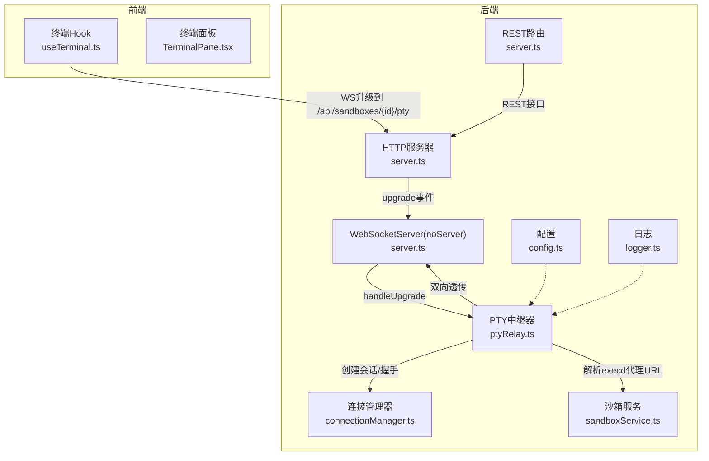
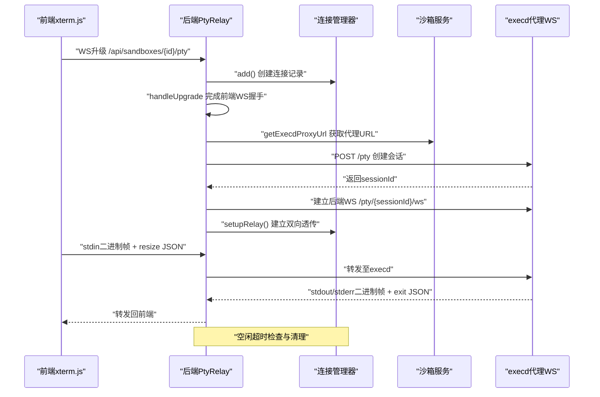
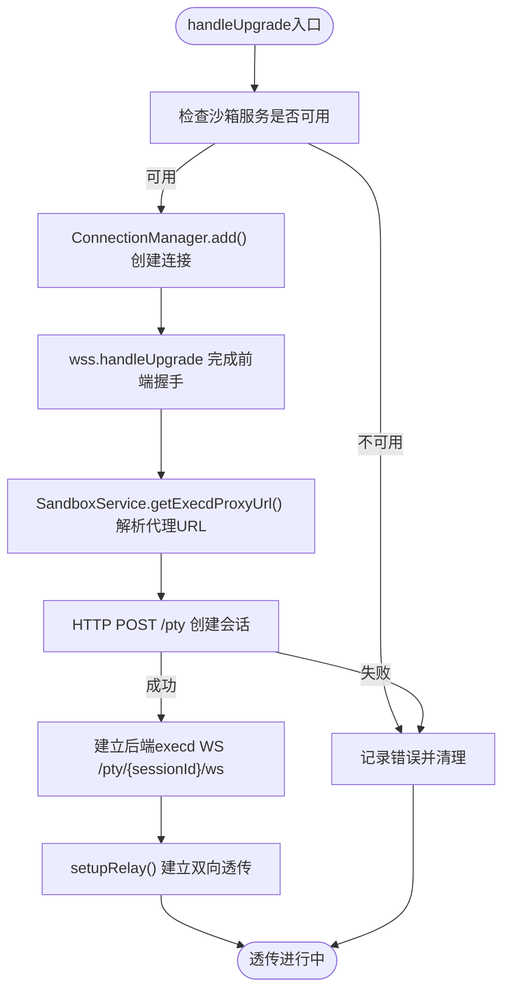
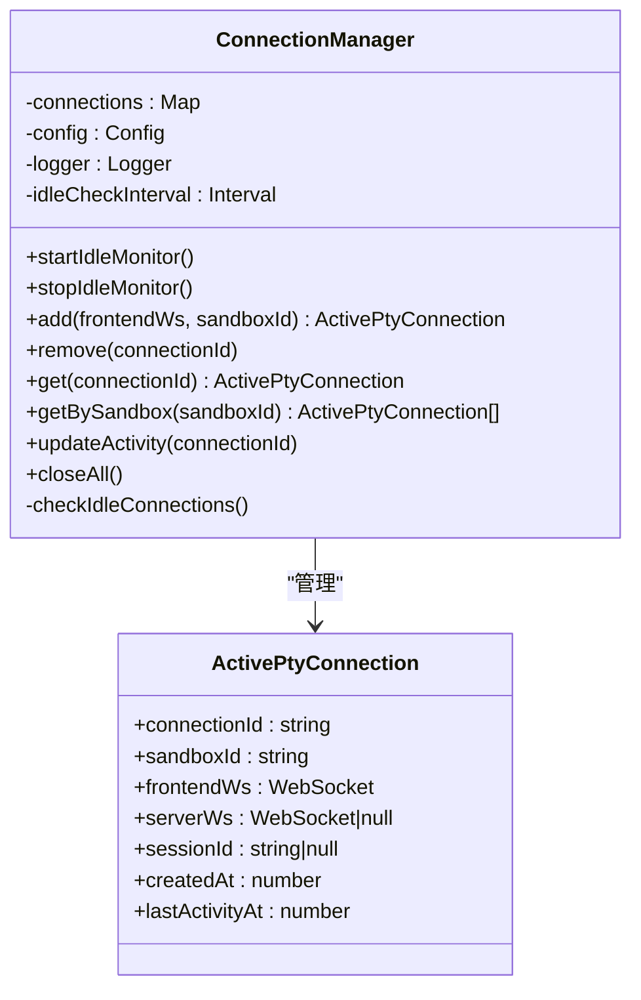
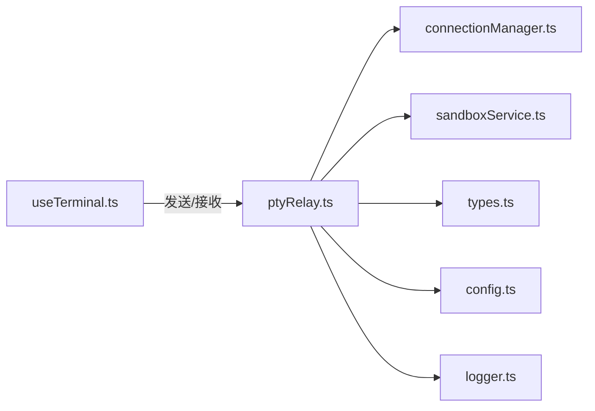

# WebSocket通信系统

<cite>
**本文引用的文件**
- [connectionManager.ts](file://apps/backend/src/websocket/connectionManager.ts)
- [ptyRelay.ts](file://apps/backend/src/websocket/ptyRelay.ts)
- [types.ts](file://apps/backend/src/websocket/types.ts)
- [server.ts](file://apps/backend/src/server.ts)
- [config.ts](file://apps/backend/src/config.ts)
- [logger.ts](file://apps/backend/src/logger.ts)
- [useTerminal.ts](file://apps/frontend/src/hooks/useTerminal.ts)
- [TerminalPane.tsx](file://apps/frontend/src/components/terminal/TerminalPane.tsx)
- [error.ts](file://apps/backend/src/middleware/error.ts)
- [index.ts](file://apps/backend/src/types/index.ts)
</cite>

## 目录
1. [简介](#简介)
2. [项目结构](#项目结构)
3. [核心组件](#核心组件)
4. [架构总览](#架构总览)
5. [详细组件分析](#详细组件分析)
6. [依赖关系分析](#依赖关系分析)
7. [性能考量](#性能考量)
8. [故障排查指南](#故障排查指南)
9. [结论](#结论)
10. [附录](#附录)

## 简介
本技术文档聚焦于Sandbox Manager后端的WebSocket通信系统，重点阐述PTY中继机制的实现原理与连接管理策略。文档涵盖：
- 二进制帧透传与数据流控制
- 会话状态管理与空闲清理
- 连接建立流程、心跳检测机制、自动重连逻辑、连接超时处理
- WebSocket消息协议（消息格式、事件类型、错误码）
- 具体代码示例路径（以源码片段路径代替具体代码）
- 性能监控指标、连接池管理策略与故障诊断方法

## 项目结构
后端采用Express + ws的混合架构：REST路由由Express提供，WebSocket升级与处理由ws独立管理；通过noServer模式在HTTP服务器上拦截升级请求，交由PtyRelay完成握手与会话建立。

图表来源
- [server.ts:72-87](file://apps/backend/src/server.ts#L72-L87)
- [ptyRelay.ts:40-118](file://apps/backend/src/websocket/ptyRelay.ts#L40-L118)
- [connectionManager.ts:30-46](file://apps/backend/src/websocket/connectionManager.ts#L30-L46)
- [config.ts:48-70](file://apps/backend/src/config.ts#L48-L70)
- [logger.ts:1-17](file://apps/backend/src/logger.ts#L1-L17)

章节来源
- [server.ts:36-90](file://apps/backend/src/server.ts#L36-L90)

## 核心组件
- 连接管理器（ConnectionManager）：维护前端WebSocket与后端execd之间的双向连接，记录会话ID、创建时间与最后活动时间，并提供空闲检查与批量关闭能力。
- PTY中继器（PtyRelay）：负责WebSocket升级、PTYSesssion创建、execd代理URL解析、双向透明透传与错误处理。
- 类型定义（types.ts）：定义PTYS控制消息与活跃连接结构。
- 配置（config.ts）：暴露PTY空闲超时等关键参数。
- 前端终端Hook（useTerminal.ts）：实现二进制帧编解码、JSON控制帧发送、自动重连与UI状态反馈。

章节来源
- [connectionManager.ts:7-102](file://apps/backend/src/websocket/connectionManager.ts#L7-L102)
- [ptyRelay.ts:22-171](file://apps/backend/src/websocket/ptyRelay.ts#L22-L171)
- [types.ts:4-19](file://apps/backend/src/websocket/types.ts#L4-L19)
- [config.ts:21-23](file://apps/backend/src/config.ts#L21-L23)
- [useTerminal.ts:12-179](file://apps/frontend/src/hooks/useTerminal.ts#L12-L179)

## 架构总览
WebSocket通信链路分为三层：
- 前端xterm.js通过二进制帧与JSON控制帧与后端交互
- 后端PtyRelay完成升级、会话创建与execd代理URL解析
- 双向透明透传：前端输入→execd，execd输出→前端显示

图表来源
- [server.ts:76-87](file://apps/backend/src/server.ts#L76-L87)
- [ptyRelay.ts:40-118](file://apps/backend/src/websocket/ptyRelay.ts#L40-L118)
- [connectionManager.ts:18-28](file://apps/backend/src/websocket/connectionManager.ts#L18-L28)

## 详细组件分析

### PTY中继机制（PtyRelay）
- 升级流程
  - 在HTTP upgrade事件中匹配路径，调用handleUpgrade完成前端WebSocket握手与连接记录创建。
  - 解析execd代理URL与headers，创建PTYSesssion并建立后端execd WebSocket。
- 二进制帧透传
  - 前端stdin使用0x00前缀，stdout使用0x01，stderr使用0x02，后端直接透传原始二进制帧。
- 控制帧
  - resize：JSON文本帧，包含cols/rows。
  - exit：JSON文本帧，包含退出码。
- 错误处理
  - 握手超时、会话创建失败、WS错误均触发清理流程。

图表来源
- [ptyRelay.ts:40-118](file://apps/backend/src/websocket/ptyRelay.ts#L40-L118)
- [connectionManager.ts:30-46](file://apps/backend/src/websocket/connectionManager.ts#L30-L46)
- [sandboxService.ts:129-138](file://apps/backend/src/services/sandboxService.ts#L129-L138)

章节来源
- [ptyRelay.ts:9-21](file://apps/backend/src/websocket/ptyRelay.ts#L9-L21)
- [ptyRelay.ts:40-118](file://apps/backend/src/websocket/ptyRelay.ts#L40-L118)
- [ptyRelay.ts:120-169](file://apps/backend/src/websocket/ptyRelay.ts#L120-L169)

### 连接管理策略（ConnectionManager）
- 会话状态管理
  - 记录connectionId、sandboxId、frontendWs、serverWs、sessionId、createdAt、lastActivityAt。
  - 每次消息到达更新lastActivityAt，用于空闲检测。
- 空闲检测
  - 启动定时器每分钟扫描一次，若超过ptyIdleTimeoutMs未活动则主动关闭并清理。
- 并发连接管理
  - 使用Map存储所有活跃连接，支持按sandboxId查询、批量关闭等操作。

图表来源
- [connectionManager.ts:7-102](file://apps/backend/src/websocket/connectionManager.ts#L7-L102)
- [types.ts:11-19](file://apps/backend/src/websocket/types.ts#L11-L19)

章节来源
- [connectionManager.ts:7-102](file://apps/backend/src/websocket/connectionManager.ts#L7-L102)
- [config.ts:21-23](file://apps/backend/src/config.ts#L21-L23)

### WebSocket消息协议
- 二进制帧
  - 0x00 + UTF-8字节：stdin（前端→execd）
  - 0x01 + 字节：stdout（execd→前端）
  - 0x02 + 字节：stderr（execd→前端）
- 文本帧（控制）
  - resize：{"type":"resize","cols":N,"rows":N}
  - exit：{"type":"exit","code":N}

前端实现要点
- 发送stdin：将输入字符串编码为UTF-8，拼接0x00前缀后发送。
- 接收stdout/stderr：读取ArrayBuffer，判断首字节为0x01或0x02，解码后写入终端。
- 接收exit：解析JSON，提示进程退出码并断开连接。
- 自动重连：非正常关闭时按指数退避+抖动重连，最多延迟30秒。

章节来源
- [ptyRelay.ts:15-21](file://apps/backend/src/websocket/ptyRelay.ts#L15-L21)
- [useTerminal.ts:48-95](file://apps/frontend/src/hooks/useTerminal.ts#L48-L95)
- [useTerminal.ts:127-144](file://apps/frontend/src/hooks/useTerminal.ts#L127-L144)

### 连接建立流程与超时处理
- 升级路径匹配：/api/sandboxes/{id}/pty
- 前端WS握手：10秒超时，超时销毁socket
- execd会话创建：POST /pty，失败抛错并清理
- 后端WS建立：基于代理URL与headers，建立/execd/pty/{sessionId}/ws
- 双向透传：消息到达即转发，错误与关闭事件触发清理

章节来源
- [server.ts:76-87](file://apps/backend/src/server.ts#L76-L87)
- [ptyRelay.ts:58-66](file://apps/backend/src/websocket/ptyRelay.ts#L58-L66)
- [ptyRelay.ts:74-93](file://apps/backend/src/websocket/ptyRelay.ts#L74-L93)
- [ptyRelay.ts:95-106](file://apps/backend/src/websocket/ptyRelay.ts#L95-L106)

### 心跳检测机制
当前实现未显式实现心跳（ping/pong）。建议在后端WS层启用ping/pong并结合lastActivityAt进行更严格的空闲检测，以提升稳定性与资源回收效率。

章节来源
- [ptyRelay.ts:120-169](file://apps/backend/src/websocket/ptyRelay.ts#L120-L169)
- [connectionManager.ts:92-100](file://apps/backend/src/websocket/connectionManager.ts#L92-L100)

### 自动重连逻辑
- 前端策略：非正常关闭时，按attempt×2的指数退避，上限30秒，加入50%-100%抖动，避免雪崩效应。
- 后端策略：无自动重连，仅在前端再次发起连接时重建会话。

章节来源
- [useTerminal.ts:79-90](file://apps/frontend/src/hooks/useTerminal.ts#L79-L90)

## 依赖关系分析
- 组件耦合
  - PtyRelay依赖SandboxService解析execd代理URL，依赖ConnectionManager管理连接生命周期。
  - ConnectionManager依赖Config与Logger，提供空闲检测与日志记录。
  - 前端useTerminal依赖xterm生态与浏览器WebSocket API。
- 外部依赖
  - ws：WebSocket服务器与客户端
  - @alibaba-group/opensandbox：OpenSandbox SDK，用于获取execd代理URL与会话管理
  - pino：结构化日志

图表来源
- [ptyRelay.ts:22-38](file://apps/backend/src/websocket/ptyRelay.ts#L22-L38)
- [connectionManager.ts:7-16](file://apps/backend/src/websocket/connectionManager.ts#L7-L16)
- [config.ts:48-70](file://apps/backend/src/config.ts#L48-L70)
- [logger.ts:1-17](file://apps/backend/src/logger.ts#L1-L17)
- [useTerminal.ts:12-179](file://apps/frontend/src/hooks/useTerminal.ts#L12-L179)

章节来源
- [ptyRelay.ts:22-38](file://apps/backend/src/websocket/ptyRelay.ts#L22-L38)
- [connectionManager.ts:7-16](file://apps/backend/src/websocket/connectionManager.ts#L7-L16)
- [useTerminal.ts:12-179](file://apps/frontend/src/hooks/useTerminal.ts#L12-L179)

## 性能考量
- 二进制帧透传
  - 采用原始二进制帧，避免额外序列化开销，降低CPU与内存占用。
- 数据流控制
  - 前端resize事件触发JSON控制帧，后端根据cols/rows调整execd会话大小，减少渲染压力。
- 连接池与缓存
  - 后端通过LRU缓存Sandbox实例，减少重复连接成本；前端无连接池，但可考虑复用已断开连接的WS对象以减少握手次数。
- 空闲清理
  - 每分钟扫描空闲连接，超时关闭，释放资源。
- 日志与可观测性
  - 结构化日志记录关键事件，便于定位问题；可在PtyRelay中增加消息统计与延迟观测点。

章节来源
- [ptyRelay.ts:15-21](file://apps/backend/src/websocket/ptyRelay.ts#L15-L21)
- [useTerminal.ts:139-144](file://apps/frontend/src/hooks/useTerminal.ts#L139-L144)
- [connectionManager.ts:18-28](file://apps/backend/src/websocket/connectionManager.ts#L18-L28)
- [sandboxService.ts:35-44](file://apps/backend/src/services/sandboxService.ts#L35-L44)

## 故障排查指南
- 常见错误与定位
  - OpenSandbox未配置：升级阶段抛出“OpenSandbox not configured”，检查环境变量与配置加载。
  - WebSocket握手超时：前端10秒超时，检查网络与反向代理配置。
  - PTY会话创建失败：检查execd代理URL与headers，确认会话端点可达。
  - WS错误/关闭：前后端任一端错误或关闭均触发清理，查看日志中的connectionId与reason。
- 前端重连
  - 非正常关闭时自动重连，观察重连次数与延迟，确认网络波动或后端异常。
- 后端清理
  - 空闲超时清理：检查ptyIdleTimeoutMs配置，确认长时间无活动的会话被正确关闭。
- 错误码映射
  - REST错误统一由中间件处理，SDK异常映射为HTTP状态码，便于前端识别。

章节来源
- [ptyRelay.ts:50-52](file://apps/backend/src/websocket/ptyRelay.ts#L50-L52)
- [ptyRelay.ts:64-66](file://apps/backend/src/websocket/ptyRelay.ts#L64-L66)
- [ptyRelay.ts:87-89](file://apps/backend/src/websocket/ptyRelay.ts#L87-L89)
- [ptyRelay.ts:147-166](file://apps/backend/src/websocket/ptyRelay.ts#L147-L166)
- [error.ts:33-47](file://apps/backend/src/middleware/error.ts#L33-L47)

## 结论
该WebSocket通信系统通过PtyRelay实现透明的二进制帧透传与JSON控制帧处理，结合ConnectionManager的会话状态管理与空闲清理，提供了稳定高效的终端会话通道。前端实现了完善的自动重连与UI反馈，后端具备清晰的错误处理与可观测性。建议后续增强心跳检测与连接池策略，进一步提升稳定性与资源利用率。

## 附录
- 关键实现路径参考
  - PTY中继建立与透传：[ptyRelay.ts:40-118](file://apps/backend/src/websocket/ptyRelay.ts#L40-L118)，[ptyRelay.ts:120-169](file://apps/backend/src/websocket/ptyRelay.ts#L120-L169)
  - 连接管理与空闲检测：[connectionManager.ts:30-46](file://apps/backend/src/websocket/connectionManager.ts#L30-L46)，[connectionManager.ts:92-100](file://apps/backend/src/websocket/connectionManager.ts#L92-L100)
  - 升级与握手：[server.ts:76-87](file://apps/backend/src/server.ts#L76-L87)
  - 前端二进制帧编解码与重连：[useTerminal.ts:48-95](file://apps/frontend/src/hooks/useTerminal.ts#L48-L95)，[useTerminal.ts:127-144](file://apps/frontend/src/hooks/useTerminal.ts#L127-L144)
  - 类型定义：[types.ts:4-19](file://apps/backend/src/websocket/types.ts#L4-L19)
  - 配置项：[config.ts:21-23](file://apps/backend/src/config.ts#L21-L23)，[config.ts:68](file://apps/backend/src/config.ts#L68)
  - REST错误处理：[error.ts:5-31](file://apps/backend/src/middleware/error.ts#L5-L31)