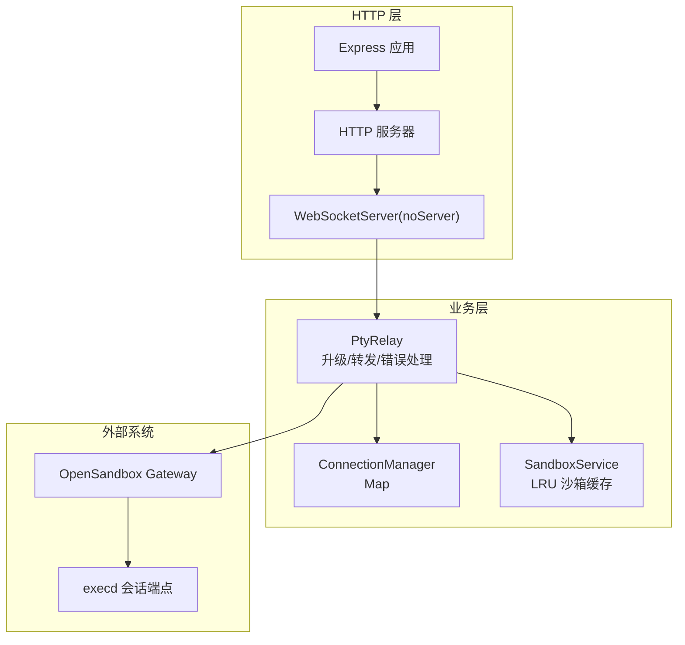
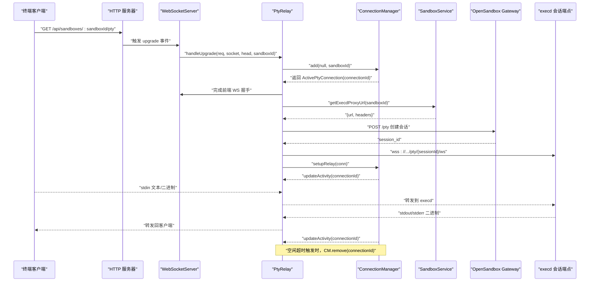
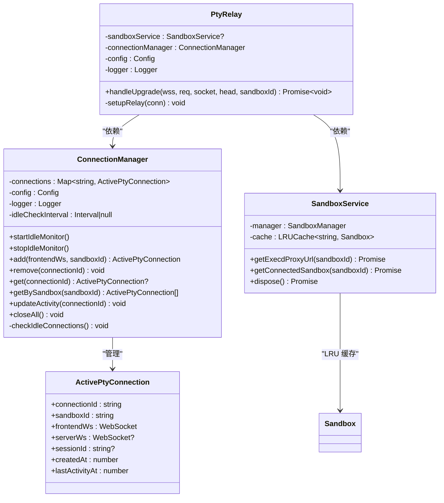

# 连接管理策略

<cite>
**本文引用的文件**
- [connectionManager.ts](file://apps/backend/src/websocket/connectionManager.ts)
- [types.ts](file://apps/backend/src/websocket/types.ts)
- [ptyRelay.ts](file://apps/backend/src/websocket/ptyRelay.ts)
- [server.ts](file://apps/backend/src/server.ts)
- [config.ts](file://apps/backend/src/config.ts)
- [logger.ts](file://apps/backend/src/logger.ts)
- [sandboxService.ts](file://apps/backend/src/services/sandboxService.ts)
</cite>

## 目录
1. [简介](#简介)
2. [项目结构](#项目结构)
3. [核心组件](#核心组件)
4. [架构总览](#架构总览)
5. [详细组件分析](#详细组件分析)
6. [依赖关系分析](#依赖关系分析)
7. [性能考量](#性能考量)
8. [故障排查指南](#故障排查指南)
9. [结论](#结论)

## 简介
本技术文档围绕 WebSocket 连接管理策略展开，重点阐述：
- 连接生命周期管理：从握手到建立、活动状态跟踪、空闲超时检测与自动清理
- ActivePtyConnection 数据结构及其字段职责与管理方式
- 连接池管理策略：最大连接数限制、LRU 缓存淘汰（用于沙箱实例而非前端连接）、内存使用优化
- 连接状态监控：活动时间更新、心跳检测、异常连接清理
- 具体代码示例路径：连接添加/移除、活动状态更新、连接池维护等核心操作
- 超时处理、错误恢复机制与性能监控指标

## 项目结构
后端采用 Express + ws 的混合架构，WebSocket 升级由 HTTP 服务器在 “/api/sandboxes/:sandboxId/pty” 路径上完成，随后通过 PtyRelay 建立双向转发通道，并由 ConnectionManager 统一管理连接生命周期。

图表来源
- [server.ts:72-87](file://apps/backend/src/server.ts#L72-L87)
- [ptyRelay.ts:40-118](file://apps/backend/src/websocket/ptyRelay.ts#L40-L118)
- [connectionManager.ts:7-16](file://apps/backend/src/websocket/connectionManager.ts#L7-L16)
- [sandboxService.ts:17-44](file://apps/backend/src/services/sandboxService.ts#L17-L44)

章节来源
- [server.ts:36-90](file://apps/backend/src/server.ts#L36-L90)

## 核心组件
- ConnectionManager：负责连接的增删查、活动时间更新、空闲检查与清理
- ActivePtyConnection：前端 WebSocket、后端 execd WebSocket、会话标识、创建与最后活动时间等
- PtyRelay：完成 WebSocket 升级、建立 execd 会话、双向转发、错误与关闭事件处理
- SandboxService：LRU 缓存沙箱实例，避免重复连接；提供 execd 代理 URL 与请求头
- 配置与日志：超时阈值、日志级别、错误处理与可观测性

章节来源
- [connectionManager.ts:7-102](file://apps/backend/src/websocket/connectionManager.ts#L7-L102)
- [types.ts:11-19](file://apps/backend/src/websocket/types.ts#L11-L19)
- [ptyRelay.ts:22-171](file://apps/backend/src/websocket/ptyRelay.ts#L22-L171)
- [sandboxService.ts:11-148](file://apps/backend/src/services/sandboxService.ts#L11-L148)
- [config.ts:21-23](file://apps/backend/src/config.ts#L21-L23)
- [logger.ts:1-17](file://apps/backend/src/logger.ts#L1-L17)

## 架构总览
下图展示了从 HTTP 升级到 PTY 会话建立、消息转发与连接清理的完整流程。

图表来源
- [server.ts:75-87](file://apps/backend/src/server.ts#L75-L87)
- [ptyRelay.ts:40-118](file://apps/backend/src/websocket/ptyRelay.ts#L40-L118)
- [ptyRelay.ts:120-169](file://apps/backend/src/websocket/ptyRelay.ts#L120-L169)
- [connectionManager.ts:18-100](file://apps/backend/src/websocket/connectionManager.ts#L18-L100)

## 详细组件分析

### ActivePtyConnection 数据结构与管理
- 字段说明
  - connectionId：连接唯一标识，用于 Map 索引与日志追踪
  - sandboxId：所属沙箱标识，用于按沙箱查询连接集合
  - frontendWs：前端 WebSocket 实例，承载 xterm.js 与后端之间的通信
  - serverWs：后端 execd WebSocket 实例，承载后端与 OSB/execd 的通信
  - sessionId：execd 会话标识，用于构造后端 WS 地址
  - createdAt：连接创建时间戳，用于统计与调试
  - lastActivityAt：最近活动时间戳，用于空闲检测与心跳更新
- 生命周期管理
  - 添加：ConnectionManager.add 在 Map 中注册连接并启动空闲监控
  - 更新：PtyRelay 在消息收发时调用 updateActivity 更新 lastActivityAt
  - 清理：空闲超时或任一侧关闭/错误时，ConnectionManager.remove 关闭两端 WS 并删除映射
- 空闲检测
  - 定时器每分钟扫描一次，若 lastActivityAt 超过配置的 ptyIdleTimeoutMs，则主动移除连接

章节来源
- [types.ts:11-19](file://apps/backend/src/websocket/types.ts#L11-L19)
- [connectionManager.ts:30-46](file://apps/backend/src/websocket/connectionManager.ts#L30-L46)
- [connectionManager.ts:80-83](file://apps/backend/src/websocket/connectionManager.ts#L80-L83)
- [connectionManager.ts:92-100](file://apps/backend/src/websocket/connectionManager.ts#L92-L100)
- [ptyRelay.ts:125-144](file://apps/backend/src/websocket/ptyRelay.ts#L125-L144)

### 连接池管理策略
- 前端连接池
  - 使用 Map 存储 ActivePtyConnection，键为 connectionId，值为连接对象
  - 最大连接数：未设置硬上限，但受系统资源与并发控制影响
  - 内存使用优化：仅保存必要字段；空闲监控停止条件：当连接数归零时停止定时器
- 沙箱实例缓存（LRU）
  - SandboxService 使用 lru-cache，最大容量 50，TTL 10 分钟
  - 淘汰时自动关闭被驱逐的沙箱连接，避免资源泄漏
  - 该 LRU 用于“沙箱实例”，不直接参与前端连接池

章节来源
- [connectionManager.ts:8](file://apps/backend/src/websocket/connectionManager.ts#L8)
- [connectionManager.ts:23-28](file://apps/backend/src/websocket/connectionManager.ts#L23-L28)
- [sandboxService.ts:35-44](file://apps/backend/src/services/sandboxService.ts#L35-L44)

### 连接状态监控与心跳检测
- 活动时间更新
  - 前端到后端：收到前端消息即更新 lastActivityAt
  - 后端到前端：收到后端消息即更新 lastActivityAt
- 心跳检测
  - 代码中未实现专用的心跳帧协议；通过消息收发驱动 lastActivityAt 更新
- 异常连接清理
  - 任一侧 close 或 error 事件发生时，立即移除连接
  - 空闲超时触发时，自动移除连接

章节来源
- [ptyRelay.ts:125-144](file://apps/backend/src/websocket/ptyRelay.ts#L125-L144)
- [ptyRelay.ts:147-166](file://apps/backend/src/websocket/ptyRelay.ts#L147-L166)
- [connectionManager.ts:92-100](file://apps/backend/src/websocket/connectionManager.ts#L92-L100)

### 具体代码示例路径（核心操作）
- 连接添加
  - 路径：[connectionManager.ts:add:30-46](file://apps/backend/src/websocket/connectionManager.ts#L30-L46)
  - 行为：生成 connectionId，初始化 createdAt/lastActivityAt，写入 Map，启动空闲监控
- 连接移除
  - 路径：[connectionManager.ts:remove:48-66](file://apps/backend/src/websocket/connectionManager.ts#L48-L66)
  - 行为：关闭两端 WS，删除 Map 条目，停止空闲监控（当连接数为 0）
- 活动状态更新
  - 路径：[connectionManager.ts:updateActivity:80-83](file://apps/backend/src/websocket/connectionManager.ts#L80-L83)
  - 触发：PtyRelay 收到消息时调用
- 连接池维护（LRU）
  - 路径：[sandboxService.ts:getConnectedSandbox:112-123](file://apps/backend/src/services/sandboxService.ts#L112-L123)
  - 行为：命中缓存则直接返回；未命中则连接并写入缓存；TTL 到期或显式删除时自动清理
- 空闲超时处理
  - 路径：[connectionManager.ts:startIdleMonitor/checkIdleConnections:18-28](file://apps/backend/src/websocket/connectionManager.ts#L18-L28), [connectionManager.ts:92-100](file://apps/backend/src/websocket/connectionManager.ts#L92-L100)
  - 配置：[config.ts:ptyIdleTimeoutMs](file://apps/backend/src/config.ts#L68)

章节来源
- [connectionManager.ts:30-66](file://apps/backend/src/websocket/connectionManager.ts#L30-L66)
- [connectionManager.ts:80-100](file://apps/backend/src/websocket/connectionManager.ts#L80-L100)
- [sandboxService.ts:112-123](file://apps/backend/src/services/sandboxService.ts#L112-L123)
- [config.ts:68](file://apps/backend/src/config.ts#L68)

### 错误恢复机制
- 握手超时：upgrade 处理中设置 10 秒超时，失败则记录错误并销毁底层 socket
- 会话创建失败：POST /pty 返回非 OK 时抛出错误并移除连接
- 任一侧关闭/错误：立即移除连接，避免悬挂状态
- 日志与可观测性：关键事件均记录上下文（如 sandboxId、connectionId、错误详情）

章节来源
- [ptyRelay.ts:58-66](file://apps/backend/src/websocket/ptyRelay.ts#L58-L66)
- [ptyRelay.ts:87-89](file://apps/backend/src/websocket/ptyRelay.ts#L87-L89)
- [ptyRelay.ts:110-117](file://apps/backend/src/websocket/ptyRelay.ts#L110-L117)
- [ptyRelay.ts:147-166](file://apps/backend/src/websocket/ptyRelay.ts#L147-L166)

### 性能监控指标建议
- 连接数：当前活跃连接数量（Map.size）
- 空闲超时次数：checkIdleConnections 中的移除计数
- 握手失败率：upgrade 超时与会话创建失败的计数
- 会话创建耗时：POST /pty 的响应时间
- 双向转发速率：基于消息长度与频率统计
- LRU 淘汰次数：LRU cache 的 dispose 回调计数

章节来源
- [connectionManager.ts:43](file://apps/backend/src/websocket/connectionManager.ts#L43)
- [connectionManager.ts:96](file://apps/backend/src/websocket/connectionManager.ts#L96)
- [sandboxService.ts:38-43](file://apps/backend/src/services/sandboxService.ts#L38-L43)

## 依赖关系分析

图表来源
- [connectionManager.ts:7-102](file://apps/backend/src/websocket/connectionManager.ts#L7-L102)
- [ptyRelay.ts:22-38](file://apps/backend/src/websocket/ptyRelay.ts#L22-L38)
- [sandboxService.ts:11-44](file://apps/backend/src/services/sandboxService.ts#L11-L44)
- [types.ts:11-19](file://apps/backend/src/websocket/types.ts#L11-L19)

## 性能考量
- 连接池大小
  - 前端连接池无硬上限，建议结合系统资源与并发峰值进行压测，动态调整
- 空闲超时
  - 默认 300000ms（5 分钟），可根据业务场景调整
- LRU 沙箱缓存
  - 容量 50，TTL 10 分钟，平衡内存占用与连接复用
- 日志开销
  - debug 级别会输出消息预览，生产环境建议降低日志级别
- 转发效率
  - 透明二进制转发，避免额外序列化开销；注意大包分片与背压处理

章节来源
- [config.ts:68](file://apps/backend/src/config.ts#L68)
- [sandboxService.ts:35-44](file://apps/backend/src/services/sandboxService.ts#L35-L44)
- [logger.ts:3-14](file://apps/backend/src/logger.ts#L3-L14)

## 故障排查指南
- 握手失败
  - 现象：upgrade 超时或会话创建失败
  - 排查：检查 OSB 配置、网络连通性、API Key、请求超时设置
  - 参考路径：[ptyRelay.ts:58-66](file://apps/backend/src/websocket/ptyRelay.ts#L58-L66), [ptyRelay.ts:87-89](file://apps/backend/src/websocket/ptyRelay.ts#L87-L89)
- 连接无法清理
  - 现象：连接数持续增长
  - 排查：确认空闲监控是否运行、lastActivityAt 是否被正确更新、是否有异常关闭未触发 remove
  - 参考路径：[connectionManager.ts:18-28](file://apps/backend/src/websocket/connectionManager.ts#L18-L28), [connectionManager.ts:92-100](file://apps/backend/src/websocket/connectionManager.ts#L92-L100)
- LRU 缓存问题
  - 现象：频繁重建沙箱连接
  - 排查：确认 TTL 设置、缓存命中率、驱逐回调是否正常执行
  - 参考路径：[sandboxService.ts:35-44](file://apps/backend/src/services/sandboxService.ts#L35-L44)
- 日志定位
  - 使用 connectionId/sandboxId 上下文快速定位问题
  - 参考路径：[connectionManager.ts:43](file://apps/backend/src/websocket/connectionManager.ts#L43), [ptyRelay.ts:110-117](file://apps/backend/src/websocket/ptyRelay.ts#L110-L117)

章节来源
- [ptyRelay.ts:58-66](file://apps/backend/src/websocket/ptyRelay.ts#L58-L66)
- [ptyRelay.ts:87-89](file://apps/backend/src/websocket/ptyRelay.ts#L87-L89)
- [connectionManager.ts:18-28](file://apps/backend/src/websocket/connectionManager.ts#L18-L28)
- [connectionManager.ts:92-100](file://apps/backend/src/websocket/connectionManager.ts#L92-L100)
- [sandboxService.ts:35-44](file://apps/backend/src/services/sandboxService.ts#L35-L44)

## 结论
本文档系统梳理了 WebSocket 连接管理策略，覆盖连接生命周期、数据结构、监控与清理机制，并给出了关键代码路径以便快速定位与扩展。建议在生产环境中：
- 明确空闲超时阈值并结合业务场景调优
- 监控连接数与 LRU 淘汰率，防止内存压力
- 通过日志上下文与指标体系快速定位异常
- 对大流量场景评估转发链路与背压处理