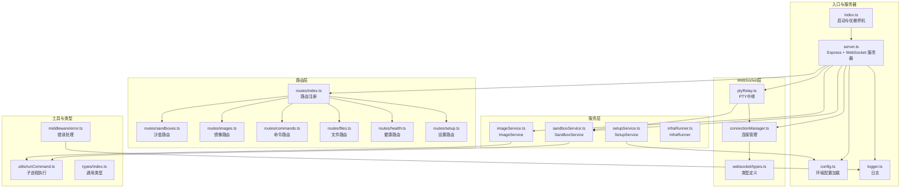
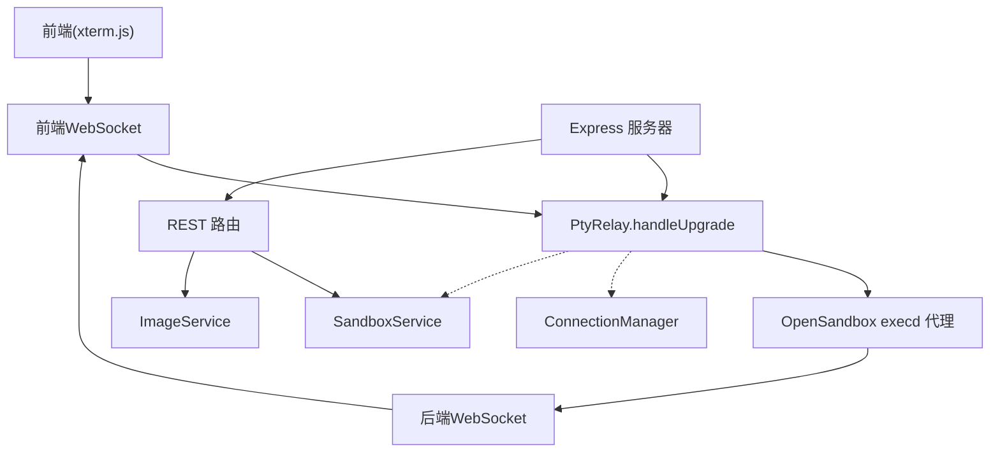
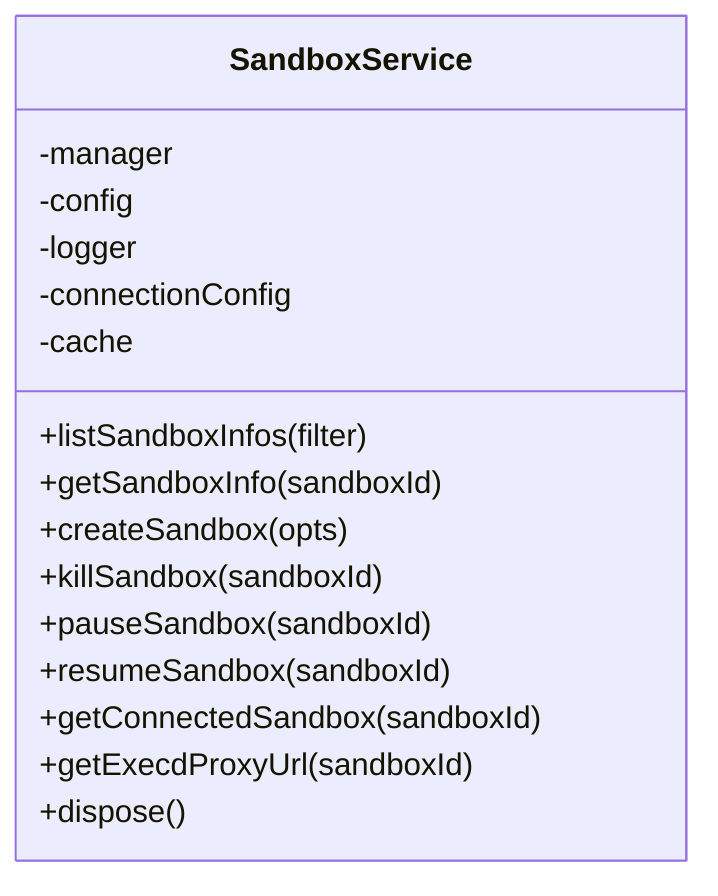
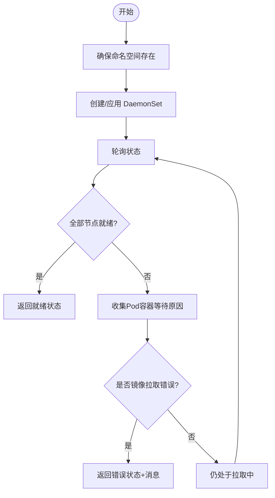
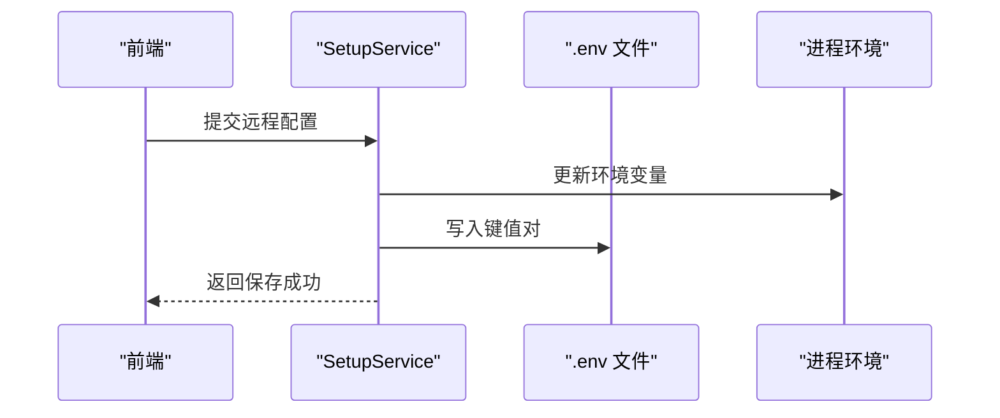
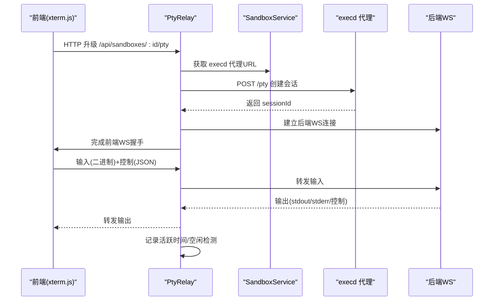
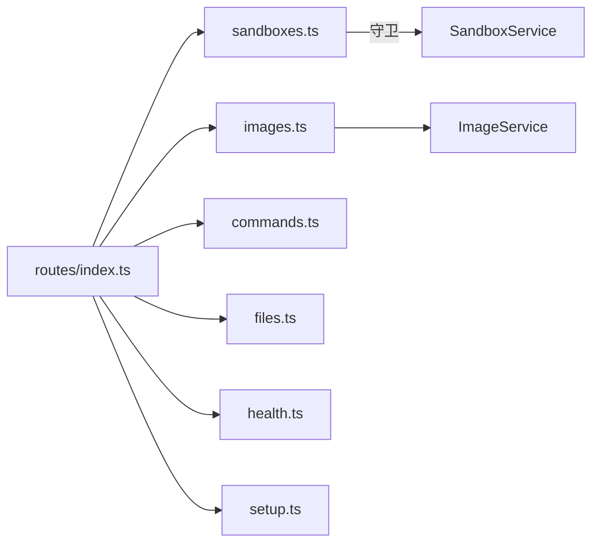
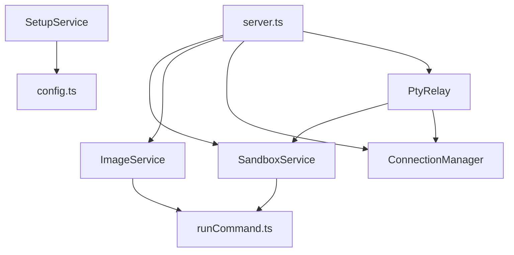

# 后端服务详解

<cite>
**本文引用的文件**
- [apps/backend/src/index.ts](file://apps/backend/src/index.ts)
- [apps/backend/src/server.ts](file://apps/backend/src/server.ts)
- [apps/backend/src/config.ts](file://apps/backend/src/config.ts)
- [apps/backend/src/logger.ts](file://apps/backend/src/logger.ts)
- [apps/backend/src/middleware/error.ts](file://apps/backend/src/middleware/error.ts)
- [apps/backend/src/services/sandboxService.ts](file://apps/backend/src/services/sandboxService.ts)
- [apps/backend/src/services/imageService.ts](file://apps/backend/src/services/imageService.ts)
- [apps/backend/src/services/setupService.ts](file://apps/backend/src/services/setupService.ts)
- [apps/backend/src/services/infraRunner.ts](file://apps/backend/src/services/infraRunner.ts)
- [apps/backend/src/websocket/connectionManager.ts](file://apps/backend/src/websocket/connectionManager.ts)
- [apps/backend/src/websocket/ptyRelay.ts](file://apps/backend/src/websocket/ptyRelay.ts)
- [apps/backend/src/websocket/types.ts](file://apps/backend/src/websocket/types.ts)
- [apps/backend/src/routes/index.ts](file://apps/backend/src/routes/index.ts)
- [apps/backend/src/routes/sandboxes.ts](file://apps/backend/src/routes/sandboxes.ts)
- [apps/backend/src/routes/images.ts](file://apps/backend/src/routes/images.ts)
- [apps/backend/src/routes/commands.ts](file://apps/backend/src/routes/commands.ts)
- [apps/backend/src/routes/files.ts](file://apps/backend/src/routes/files.ts)
- [apps/backend/src/routes/health.ts](file://apps/backend/src/routes/health.ts)
- [apps/backend/src/routes/setup.ts](file://apps/backend/src/routes/setup.ts)
- [apps/backend/src/types/index.ts](file://apps/backend/src/types/index.ts)
- [apps/backend/src/utils/runCommand.ts](file://apps/backend/src/utils/runCommand.ts)
</cite>

## 目录
1. [简介](#简介)
2. [项目结构](#项目结构)
3. [核心组件](#核心组件)
4. [架构总览](#架构总览)
5. [详细组件分析](#详细组件分析)
6. [依赖关系分析](#依赖关系分析)
7. [性能考虑](#性能考虑)
8. [故障排查指南](#故障排查指南)
9. [结论](#结论)
10. [附录](#附录)

## 简介
本文件面向Sandbox Manager后端服务，系统性阐述核心服务模块与基础设施：SandboxService的沙盒生命周期管理与LRU缓存优化、ImageService的镜像预拉取与状态管理、SetupService的系统配置流程；同时深入解析WebSocket通信中的PTY中继机制、连接管理策略与会话生命周期；并说明REST API路由体系的设计与实现要点（沙盒管理、文件操作、命令执行、镜像管理、健康检查与设置向导）。文档提供调用关系图、数据流图、类图与最佳实践建议，帮助开发者快速理解与扩展。

## 项目结构
后端采用Express + WebSocket架构，按职责分层组织：
- 入口与启动：应用入口负责加载配置、初始化日志、创建HTTP服务器与WebSocket升级处理，并在本地K8s模式下自动建立端口转发。
- 服务层：SandboxService负责与OpenSandbox SDK交互并维护LRU缓存；ImageService通过K8s DaemonSet实现镜像预拉取与状态查询；SetupService提供配置保存与连通性测试；InfraRunner用于本地K8s端口转发。
- 路由层：REST路由按功能拆分，统一注册到根路径前缀/api下。
- WebSocket层：ConnectionManager管理前端与后端WS连接，PtyRelay完成透明双向中继。
- 中间件与工具：全局错误处理、请求ID注入、日志记录、命令执行封装。

图表来源
- [apps/backend/src/index.ts:1-66](file://apps/backend/src/index.ts#L1-L66)
- [apps/backend/src/server.ts:36-90](file://apps/backend/src/server.ts#L36-L90)
- [apps/backend/src/config.ts:48-71](file://apps/backend/src/config.ts#L48-L71)
- [apps/backend/src/services/sandboxService.ts:11-47](file://apps/backend/src/services/sandboxService.ts#L11-L47)
- [apps/backend/src/services/imageService.ts:95-116](file://apps/backend/src/services/imageService.ts#L95-L116)
- [apps/backend/src/services/setupService.ts:58-80](file://apps/backend/src/services/setupService.ts#L58-L80)
- [apps/backend/src/websocket/connectionManager.ts:7-28](file://apps/backend/src/websocket/connectionManager.ts#L7-L28)
- [apps/backend/src/websocket/ptyRelay.ts:22-38](file://apps/backend/src/websocket/ptyRelay.ts#L22-L38)
- [apps/backend/src/routes/index.ts:8-16](file://apps/backend/src/routes/index.ts#L8-L16)
- [apps/backend/src/middleware/error.ts:4-31](file://apps/backend/src/middleware/error.ts#L4-L31)
- [apps/backend/src/utils/runCommand.ts:7-54](file://apps/backend/src/utils/runCommand.ts#L7-L54)
- [apps/backend/src/types/index.ts:3-11](file://apps/backend/src/types/index.ts#L3-L11)

章节来源
- [apps/backend/src/index.ts:1-66](file://apps/backend/src/index.ts#L1-L66)
- [apps/backend/src/server.ts:36-90](file://apps/backend/src/server.ts#L36-L90)
- [apps/backend/src/config.ts:48-71](file://apps/backend/src/config.ts#L48-L71)

## 核心组件
- SandboxService：封装OpenSandbox SDK，提供沙盒列表、创建、终止、暂停/恢复、端点获取与LRU连接缓存；缓存命中时复用连接，未命中则重新连接并写入缓存；超时与逐出回调确保资源回收。
- ImageService：通过K8s DaemonSet实现镜像预拉取，提供列表、状态查询、删除与节点缓存镜像枚举；对Pod容器等待原因进行聚合，增强错误诊断。
- SetupService：提供本地K8s默认配置与远程OpenSandbox配置保存，支持连通性测试；更新进程环境变量以便即时生效。
- ConnectionManager：维护前端WebSocket与后端execd WS之间的映射，记录会话ID、创建时间与最后活跃时间；周期性清理空闲连接。
- PtyRelay：实现透明二进制中继，定义控制帧格式（resize/exit），完成前端WS握手、会话创建、后端WS连接与双向转发。
- 错误处理：根据SDK异常类型映射HTTP状态码，统一输出结构化错误响应。
- 配置管理：从环境变量加载配置，支持本地K8s模式与远程模式切换。

章节来源
- [apps/backend/src/services/sandboxService.ts:11-148](file://apps/backend/src/services/sandboxService.ts#L11-L148)
- [apps/backend/src/services/imageService.ts:95-386](file://apps/backend/src/services/imageService.ts#L95-L386)
- [apps/backend/src/services/setupService.ts:58-147](file://apps/backend/src/services/setupService.ts#L58-L147)
- [apps/backend/src/websocket/connectionManager.ts:7-102](file://apps/backend/src/websocket/connectionManager.ts#L7-L102)
- [apps/backend/src/websocket/ptyRelay.ts:22-171](file://apps/backend/src/websocket/ptyRelay.ts#L22-L171)
- [apps/backend/src/middleware/error.ts:4-48](file://apps/backend/src/middleware/error.ts#L4-L48)
- [apps/backend/src/config.ts:3-71](file://apps/backend/src/config.ts#L3-L71)

## 架构总览
后端以Express承载REST API，以WebSocket承载PTY会话。HTTP层负责配置、沙盒与镜像管理；WebSocket层负责终端会话的透明中继。服务层通过LRU缓存与K8s DaemonSet提升性能与可用性。

图表来源
- [apps/backend/src/server.ts:72-89](file://apps/backend/src/server.ts#L72-L89)
- [apps/backend/src/websocket/ptyRelay.ts:40-118](file://apps/backend/src/websocket/ptyRelay.ts#L40-L118)
- [apps/backend/src/websocket/connectionManager.ts:30-78](file://apps/backend/src/websocket/connectionManager.ts#L30-L78)
- [apps/backend/src/services/sandboxService.ts:129-138](file://apps/backend/src/services/sandboxService.ts#L129-L138)

## 详细组件分析

### SandboxService 沙盒生命周期与LRU缓存
- 连接配置：基于环境变量构建OpenSandbox连接参数，支持协议、API Key、代理与超时。
- LRU缓存：最大容量50，10分钟TTL；逐出时尝试关闭连接，避免资源泄露。
- 生命周期方法：list/get/create/kill/pause/resume；getConnectedSandbox优先从缓存获取，缺失则新建连接并写入缓存。
- 端点获取：通过已连接实例查询execd端点，构造访问URL与必要头部，供PTY中继使用。

图表来源
- [apps/backend/src/services/sandboxService.ts:11-148](file://apps/backend/src/services/sandboxService.ts#L11-L148)

章节来源
- [apps/backend/src/services/sandboxService.ts:11-148](file://apps/backend/src/services/sandboxService.ts#L11-L148)

### ImageService 镜像管理
- 命名规范：将镜像引用转换为K8s合法名称，限制长度并加前缀；显示名从路径末段提取。
- 预拉取：通过DaemonSet在所有节点上执行initContainer拉取，以pause容器占位，最小化资源占用。
- 状态解析：结合DaemonSet状态与Pod容器等待原因，区分“拉取中/就绪/错误”，错误时返回具体原因。
- 列表与删除：列出受管DaemonSet，删除指定名称的DaemonSet；节点镜像缓存枚举用于运维诊断。

图表来源
- [apps/backend/src/services/imageService.ts:227-294](file://apps/backend/src/services/imageService.ts#L227-L294)
- [apps/backend/src/services/imageService.ts:196-222](file://apps/backend/src/services/imageService.ts#L196-L222)
- [apps/backend/src/services/imageService.ts:319-339](file://apps/backend/src/services/imageService.ts#L319-L339)

章节来源
- [apps/backend/src/services/imageService.ts:95-386](file://apps/backend/src/services/imageService.ts#L95-L386)

### SetupService 系统配置服务
- 连通性测试：使用临时ConnectionConfig与SandboxManager验证远端可用性与鉴权。
- 配置持久化：将关键键值写入后端工作目录下的.env文件，保留其他行，更新或追加对应键；同步更新进程环境变量。
- 本地K8s默认配置：写入开发用默认值，便于本地调试。

图表来源
- [apps/backend/src/services/setupService.ts:108-123](file://apps/backend/src/services/setupService.ts#L108-L123)
- [apps/backend/src/services/setupService.ts:128-145](file://apps/backend/src/services/setupService.ts#L128-L145)

章节来源
- [apps/backend/src/services/setupService.ts:58-147](file://apps/backend/src/services/setupService.ts#L58-L147)

### WebSocket 与PTY中继机制
- 升级流程：HTTP升级到WS，匹配/api/sandboxes/:id/pty路径；校验后创建前端WS并完成握手。
- 会话创建：通过execd代理URL发起HTTP POST创建PTY会话，获取sessionId。
- 双向中继：前端stdin→后端WS发送原始二进制；后端WS→前端转发stdout/stderr与控制帧(JSON)。
- 连接管理：记录连接ID、会话ID、创建与活跃时间；空闲超时清理；任一侧关闭/报错均触发清理。

图表来源
- [apps/backend/src/websocket/ptyRelay.ts:40-118](file://apps/backend/src/websocket/ptyRelay.ts#L40-L118)
- [apps/backend/src/websocket/ptyRelay.ts:120-171](file://apps/backend/src/websocket/ptyRelay.ts#L120-L171)
- [apps/backend/src/websocket/connectionManager.ts:18-100](file://apps/backend/src/websocket/connectionManager.ts#L18-L100)
- [apps/backend/src/services/sandboxService.ts:129-138](file://apps/backend/src/services/sandboxService.ts#L129-L138)

章节来源
- [apps/backend/src/websocket/ptyRelay.ts:22-171](file://apps/backend/src/websocket/ptyRelay.ts#L22-L171)
- [apps/backend/src/websocket/connectionManager.ts:7-102](file://apps/backend/src/websocket/connectionManager.ts#L7-L102)

### API 路由系统
- 注册：统一在routes/index.ts中挂载/api/...前缀路由。
- 沙盒路由：支持分页、过滤状态、创建、查询、删除、暂停/恢复、端点查询；内部对SDK返回做扁平化适配。
- 镜像路由：支持列出节点缓存镜像、列出受管镜像、拉取镜像、查询状态、删除镜像。
- 命令与文件：作为沙盒子路由挂载，后续可扩展更多操作。
- 健康与设置：提供健康检查与设置向导相关接口。

图表来源
- [apps/backend/src/routes/index.ts:8-16](file://apps/backend/src/routes/index.ts#L8-L16)
- [apps/backend/src/routes/sandboxes.ts:34-45](file://apps/backend/src/routes/sandboxes.ts#L34-L45)
- [apps/backend/src/routes/images.ts:14-34](file://apps/backend/src/routes/images.ts#L14-L34)

章节来源
- [apps/backend/src/routes/index.ts:8-16](file://apps/backend/src/routes/index.ts#L8-L16)
- [apps/backend/src/routes/sandboxes.ts:1-175](file://apps/backend/src/routes/sandboxes.ts#L1-L175)
- [apps/backend/src/routes/images.ts:1-78](file://apps/backend/src/routes/images.ts#L1-L78)

### 中间件与错误处理
- 请求ID注入：每个请求生成唯一ID，便于跨服务追踪。
- 统一错误处理：根据异常类型映射HTTP状态码，输出统一结构体，包含请求ID与错误信息。
- 日志：在请求进入与错误发生处记录上下文信息。

章节来源
- [apps/backend/src/server.ts:44-48](file://apps/backend/src/server.ts#L44-L48)
- [apps/backend/src/middleware/error.ts:4-48](file://apps/backend/src/middleware/error.ts#L4-L48)

### 配置管理
- 环境变量驱动：端口、运行环境、OpenSandbox地址/协议/API Key、CORS、日志级别、PTY空闲超时等。
- 加载逻辑：严格校验必填项，整数字段进行解析与异常处理；未配置时服务降级为设置模式。

章节来源
- [apps/backend/src/config.ts:3-71](file://apps/backend/src/config.ts#L3-L71)

## 依赖关系分析
- 低耦合高内聚：服务层与路由层通过AppServices解耦；WebSocket层独立于REST路由。
- 外部依赖：OpenSandbox SDK、ws、lru-cache、K8s CLI；通过runCommand封装外部命令调用。
- 循环依赖：无直接循环；ConnectionManager与PtyRelay相互协作但不互相导入。
- 并发与资源：SandboxService的LRU缓存与ImageService的DaemonSet并发执行，需注意资源上限与超时控制。

图表来源
- [apps/backend/src/server.ts:50-57](file://apps/backend/src/server.ts#L50-L57)
- [apps/backend/src/websocket/ptyRelay.ts:22-38](file://apps/backend/src/websocket/ptyRelay.ts#L22-L38)
- [apps/backend/src/services/sandboxService.ts:11-47](file://apps/backend/src/services/sandboxService.ts#L11-L47)
- [apps/backend/src/services/imageService.ts:95-116](file://apps/backend/src/services/imageService.ts#L95-L116)
- [apps/backend/src/utils/runCommand.ts:7-54](file://apps/backend/src/utils/runCommand.ts#L7-L54)
- [apps/backend/src/services/setupService.ts:58-80](file://apps/backend/src/services/setupService.ts#L58-L80)

## 性能考虑
- LRU缓存：SandboxService的LRU缓存减少重复连接开销；建议监控缓存命中率与内存占用，按负载调整max与ttl。
- DaemonSet预拉取：ImageService通过DaemonSet在节点侧预热镜像，显著降低首次启动延迟；建议结合集群规模与存储能力评估。
- WebSocket空闲清理：ConnectionManager的定时扫描避免僵尸连接堆积；ptyIdleTimeoutMs应结合业务场景调优。
- 超时与重试：SandboxService与SetupService的请求超时参数需与网络状况匹配；长时间任务建议异步化并提供进度反馈。
- 日志与可观测性：统一请求ID与结构化日志，配合错误分类统计，有助于定位热点与瓶颈。

## 故障排查指南
- OpenSandbox未配置：沙盒路由守卫返回503，需先完成设置向导；可通过SetupService保存配置并重启服务。
- PTY连接失败：检查execd代理URL解析、会话创建响应与后端WS连接状态；查看PtyRelay错误日志与ConnectionManager清理记录。
- 镜像拉取错误：查看ImageService的状态解析与Pod容器等待原因，定位镜像仓库权限、网络或镜像名问题。
- 健康检查：访问/api/health确认服务可用；若不可用，检查端口、CORS与中间件链路。
- 优雅停机：应用监听SIGTERM/SIGINT，停止端口转发与WebSocket连接，避免资源泄漏。

章节来源
- [apps/backend/src/routes/sandboxes.ts:34-45](file://apps/backend/src/routes/sandboxes.ts#L34-L45)
- [apps/backend/src/websocket/ptyRelay.ts:110-118](file://apps/backend/src/websocket/ptyRelay.ts#L110-L118)
- [apps/backend/src/services/imageService.ts:54-93](file://apps/backend/src/services/imageService.ts#L54-L93)
- [apps/backend/src/index.ts:48-66](file://apps/backend/src/index.ts#L48-L66)

## 结论
本后端服务围绕OpenSandbox平台提供了完整的沙盒生命周期管理、镜像预拉取与配置向导能力，并以WebSocket实现高性能的PTY中继。通过LRU缓存、DaemonSet预热与空闲连接清理等策略，在保证用户体验的同时兼顾了资源效率。建议在生产环境中结合监控指标持续优化缓存参数、超时阈值与日志级别，并完善告警与自动恢复机制。

## 附录
- 使用模式
  - 设置向导：通过/api/setup保存配置，随后沙盒路由可用。
  - 创建沙盒：POST /api/sandboxes，接收202与沙盒信息。
  - 终端会话：升级/api/sandboxes/:id/pty，建立透明中继通道。
  - 镜像管理：POST /api/images 拉取镜像，GET /api/images/cached 查看节点缓存。
- 最佳实践
  - 将敏感配置放入环境变量，避免硬编码。
  - 对长耗时操作采用异步化与分页策略。
  - 在本地K8s模式下启用端口转发，确保execd可达。
  - 定期清理过期沙盒与空闲连接，防止资源泄漏。