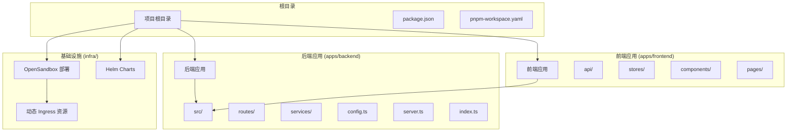
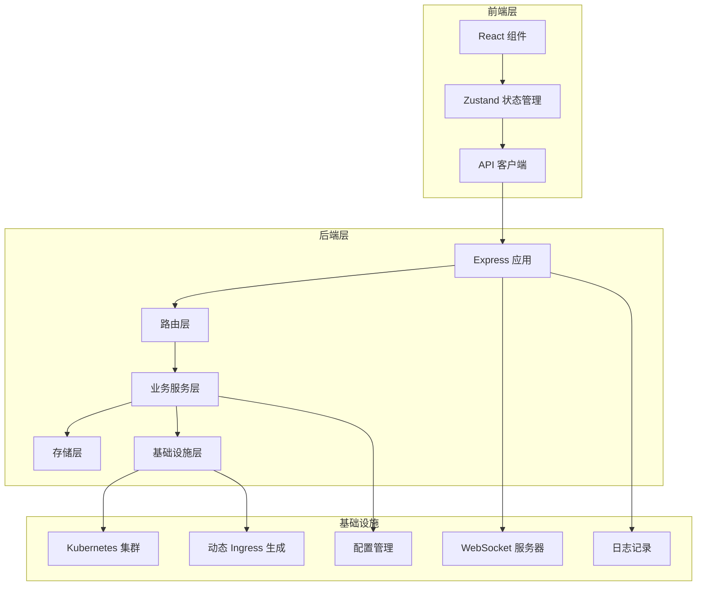
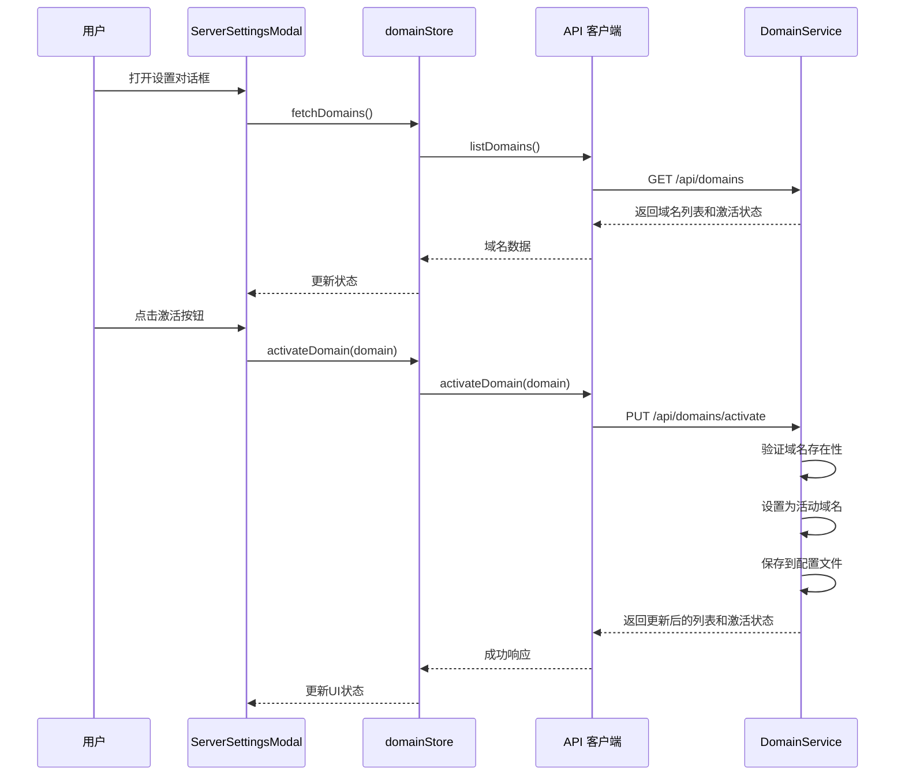
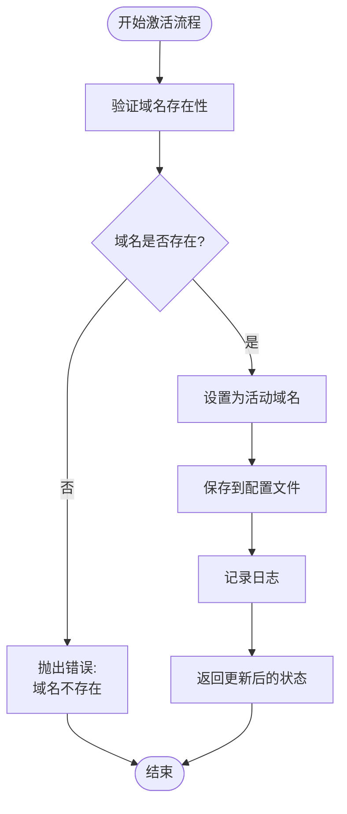
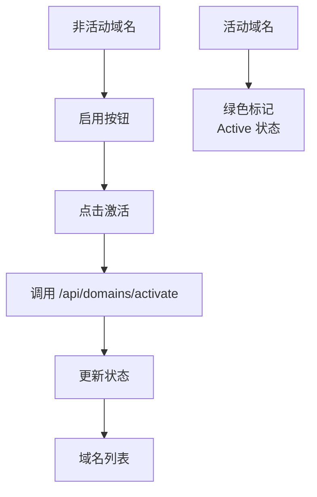
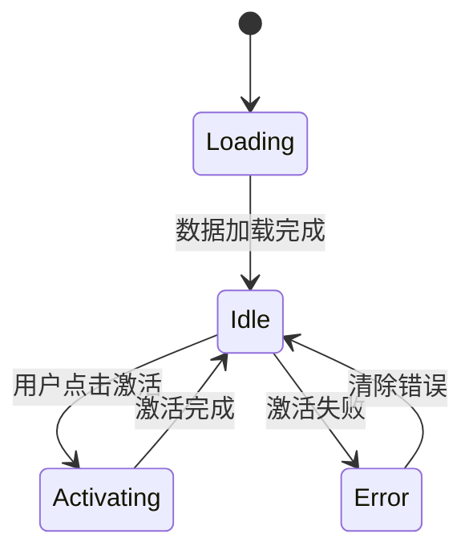
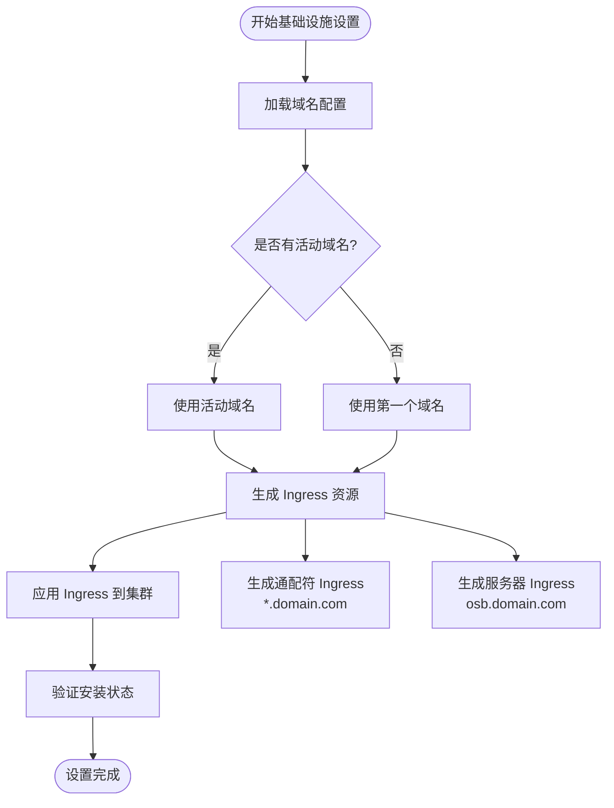
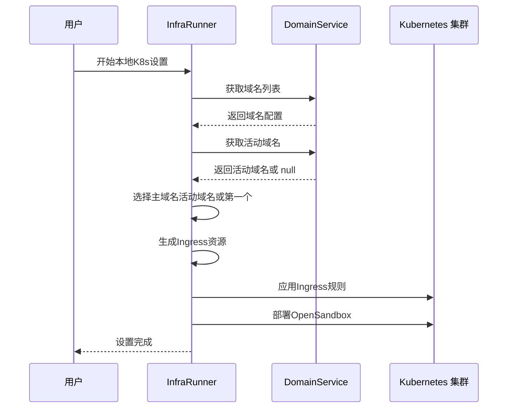
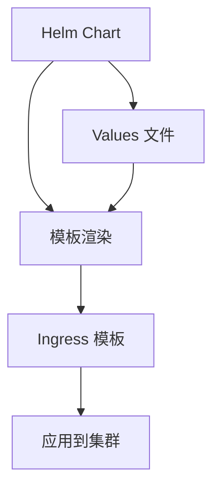
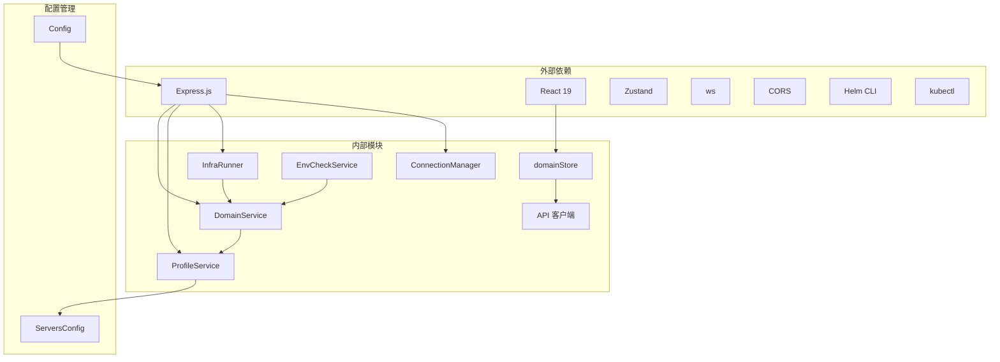

# 域名管理系统

<cite>
**本文档中引用的文件**
- [apps/backend/src/index.ts](file://apps/backend/src/index.ts)
- [apps/backend/src/server.ts](file://apps/backend/src/server.ts)
- [apps/backend/src/routes/domains.ts](file://apps/backend/src/routes/domains.ts)
- [apps/backend/src/services/domainService.ts](file://apps/backend/src/services/domainService.ts)
- [apps/backend/src/services/profileService.ts](file://apps/backend/src/services/profileService.ts)
- [apps/backend/src/services/infraRunner.ts](file://apps/backend/src/services/infraRunner.ts)
- [apps/backend/src/services/envCheckService.ts](file://apps/backend/src/services/envCheckService.ts)
- [apps/backend/src/routes/index.ts](file://apps/backend/src/routes/index.ts)
- [apps/frontend/src/stores/domainStore.ts](file://apps/frontend/src/stores/domainStore.ts)
- [apps/frontend/src/api/domains.ts](file://apps/frontend/src/api/domains.ts)
- [apps/frontend/src/components/settings/ServerSettingsModal.tsx](file://apps/frontend/src/components/settings/ServerSettingsModal.tsx)
- [apps/frontend/src/api/client.ts](file://apps/frontend/src/api/client.ts)
- [apps/backend/src/config.ts](file://apps/backend/src/config.ts)
- [apps/backend/src/websocket/connectionManager.ts](file://apps/backend/src/websocket/connectionManager.ts)
- [infra/helm/sandbox-platform/templates/ingress.yaml](file://infra/helm/sandbox-platform/templates/ingress.yaml)
- [infra/opensandbox/sandbox-ingress.yaml](file://infra/opensandbox/sandbox-ingress.yaml)
- [infra/opensandbox/server-ingress.yaml](file://infra/opensandbox/server-ingress.yaml)
- [README.md](file://README.md)
</cite>

## 更新摘要
**所做更改**
- 新增域名激活系统功能，支持设置当前活动域名
- 后端新增 getActiveDomain/activateDomain 方法和 /api/domains/activate API 端点
- 前端新增域名激活 UI 和状态管理，支持域名激活状态显示
- 基础设施运行器对激活域名的支持，用于动态生成 Ingress 资源
- 增强 ProfileService，支持 activeDomain 字段的持久化存储

## 目录
1. [简介](#简介)
2. [项目结构](#项目结构)
3. [核心组件](#核心组件)
4. [架构概览](#架构概览)
5. [详细组件分析](#详细组件分析)
6. [域名激活系统](#域名激活系统)
7. [基础设施自动化](#基础设施自动化)
8. [依赖关系分析](#依赖关系分析)
9. [性能考虑](#性能考虑)
10. [故障排除指南](#故障排除指南)
11. [结论](#结论)

## 简介

域名管理系统是基于 OpenSandbox 的 Kubernetes AI 沙箱管理平台的重要组成部分，专门负责管理允许访问沙箱的域名白名单。该系统通过 Web UI 提供直观的界面来添加、删除和管理域名规则，支持通配符匹配和精确域名匹配，并集成了完整的基础设施自动化功能。

系统采用前后端分离架构，后端使用 Express.js 提供 REST API，前端使用 React + TypeScript 构建用户界面。所有域名配置都存储在本地的 `servers.json` 文件中，确保配置的持久性和可靠性。新增的域名激活功能允许用户设置当前活动域名，该域名将作为默认的访问入口和基础设施配置的基础。

## 项目结构

该项目采用 Monorepo 结构，包含独立的前端和后端应用程序，以及完整的基础设施配置：



**图表来源**
- [README.md:114-140](file://README.md#L114-L140)

**章节来源**
- [README.md:114-140](file://README.md#L114-L140)

## 核心组件

域名管理系统的核心组件包括：

### 后端服务层
- **DomainService**: 处理域名相关的业务逻辑，包括验证、存储、检索和激活管理
- **ProfileService**: 管理服务器配置和域名白名单的持久化存储，支持 activeDomain 字段
- **InfraRunner**: 新增的基础设施运行器，负责K8s安装和Ingress资源生成，支持激活域名
- **Express 路由**: 提供 REST API 接口用于域名管理操作，包括新的激活端点
- **EnvCheckService**: 环境检查服务，验证域名配置状态

### 前端状态管理层
- **domainStore**: 使用 Zustand 管理域名状态，处理异步操作，支持 activeDomain 状态
- **ServerSettingsModal**: 主要的用户界面组件，提供域名管理功能和激活状态显示
- **API 客户端**: 封装 HTTP 请求，处理错误响应，支持激活域名 API

### WebSocket 连接管理
- **ConnectionManager**: 管理 PTY WebSocket 连接，支持空闲超时检测
- **PtyRelay**: 实现终端连接的中继功能

### 基础设施自动化
- **动态 Ingress 生成**: 根据域名配置自动生成Kubernetes Ingress资源，支持激活域名
- **Helm Chart 集成**: 支持通过Helm部署OpenSandbox平台
- **环境检查**: 验证Ingress Nginx控制器和域名配置状态

**章节来源**
- [apps/backend/src/services/domainService.ts:1-109](file://apps/backend/src/services/domainService.ts#L1-L109)
- [apps/backend/src/services/profileService.ts:1-245](file://apps/backend/src/services/profileService.ts#L1-L245)
- [apps/backend/src/services/infraRunner.ts:1-555](file://apps/backend/src/services/infraRunner.ts#L1-L555)
- [apps/frontend/src/stores/domainStore.ts:1-89](file://apps/frontend/src/stores/domainStore.ts#L1-L89)

## 架构概览

系统采用分层架构设计，清晰分离关注点，并集成了完整的基础设施自动化：



**图表来源**
- [apps/backend/src/server.ts:36-90](file://apps/backend/src/server.ts#L36-L90)
- [apps/backend/src/index.ts:1-34](file://apps/backend/src/index.ts#L1-L34)

## 详细组件分析

### DomainService 分析

DomainService 是域名管理的核心业务逻辑组件，负责处理所有域名相关的操作，包括新增的激活功能：

```mermaid
classDiagram
class DomainService {
-logger : Logger
-profileService : ProfileService
+listDomains() : string[]
+addDomain(domain : string) : string[]
+removeDomain(domain : string) : string[]
+updateDomains(domains : string[]) : string[]
+getActiveDomain() : string | null
+activateDomain(domain : string) : { domains : string[]; activeDomain : string }
}
class ProfileService {
-logger : Logger
-configPath : string
+loadServersConfig() : ServersConfig
+saveServersConfig(config : ServersConfig) : void
+ensureProfile(data : CreateProfileData) : ServerProfile
}
class ServersConfig {
+profiles : ServerProfile[]
+activeProfileId : string
+allowedDomains : string[]
+activeDomain : string | null
}
class InfraRunner {
-logger : Logger
+runLocalK8sSetup(eventSink : EventSink) : Promise~void~
+generateIngressResources(domains : string[]) : string[]
}
DomainService --> ProfileService : "使用"
ProfileService --> ServersConfig : "管理"
InfraRunner --> DomainService : "依赖"
```

**图表来源**
- [apps/backend/src/services/domainService.ts:5-109](file://apps/backend/src/services/domainService.ts#L5-L109)
- [apps/backend/src/services/profileService.ts:54-245](file://apps/backend/src/services/profileService.ts#L54-L245)
- [apps/backend/src/services/infraRunner.ts:95-555](file://apps/backend/src/services/infraRunner.ts#L95-L555)

#### 域名验证逻辑

系统实现了严格的域名验证机制，支持通配符域名：


**图表来源**
- [apps/backend/src/services/domainService.ts:19-38](file://apps/backend/src/services/domainService.ts#L19-L38)

**章节来源**
- [apps/backend/src/services/domainService.ts:14-109](file://apps/backend/src/services/domainService.ts#L14-L109)

### 前端用户界面分析

ServerSettingsModal 是域名管理的主要用户界面组件，提供了完整的域名管理功能，包括新增的激活状态显示：



**图表来源**
- [apps/frontend/src/components/settings/ServerSettingsModal.tsx:414-423](file://apps/frontend/src/components/settings/ServerSettingsModal.tsx#L414-L423)
- [apps/frontend/src/stores/domainStore.ts:76-86](file://apps/frontend/src/stores/domainStore.ts#L76-L86)

**章节来源**
- [apps/frontend/src/components/settings/ServerSettingsModal.tsx:390-436](file://apps/frontend/src/components/settings/ServerSettingsModal.tsx#L390-L436)
- [apps/frontend/src/stores/domainStore.ts:21-89](file://apps/frontend/src/stores/domainStore.ts#L21-L89)

### API 路由设计

系统提供了完整的 REST API 来支持域名管理操作，包括新增的激活功能：

| 方法 | 路径 | 描述 | 请求体 | 响应 |
|------|------|------|--------|------|
| GET | `/api/domains` | 获取所有允许的域名和活动域名 | 无 | `{ success: true, data: { domains: string[], activeDomain: string | null } }` |
| POST | `/api/domains` | 添加新域名 | `{ domain: string }` | `{ success: true, data: string[] }` |
| DELETE | `/api/domains/:domain` | 删除指定域名 | 无 | `{ success: true, data: string[] }` |
| PUT | `/api/domains` | 批量更新域名列表 | `{ domains: string[] }` | `{ success: true, data: string[] }` |
| PUT | `/api/domains/activate` | 设置活动域名 | `{ domain: string }` | `{ success: true, data: { domains: string[], activeDomain: string } }` |

**章节来源**
- [apps/backend/src/routes/domains.ts:11-98](file://apps/backend/src/routes/domains.ts#L11-L98)

## 域名激活系统

### 激活功能概述

域名激活系统允许用户设置当前活动域名，该域名将成为默认的访问入口和基础设施配置的基础。系统通过以下方式实现：



**图表来源**
- [apps/backend/src/services/domainService.ts:95-107](file://apps/backend/src/services/domainService.ts#L95-L107)

### 前端激活 UI

前端界面提供了直观的域名激活功能，包括激活状态的视觉反馈：



**图表来源**
- [apps/frontend/src/components/settings/ServerSettingsModal.tsx:414-423](file://apps/frontend/src/components/settings/ServerSettingsModal.tsx#L414-L423)

**章节来源**
- [apps/backend/src/services/domainService.ts:90-107](file://apps/backend/src/services/domainService.ts#L90-L107)
- [apps/frontend/src/components/settings/ServerSettingsModal.tsx:414-423](file://apps/frontend/src/components/settings/ServerSettingsModal.tsx#L414-L423)

### 状态管理增强

domainStore 现在支持活动域名状态管理：



**图表来源**
- [apps/frontend/src/stores/domainStore.ts:24-89](file://apps/frontend/src/stores/domainStore.ts#L24-L89)

**章节来源**
- [apps/frontend/src/stores/domainStore.ts:10-22](file://apps/frontend/src/stores/domainStore.ts#L10-L22)

## 基础设施自动化

### 动态 Ingress 资源生成

新增的基础设施自动化功能能够根据域名配置动态生成 Kubernetes Ingress 资源，支持激活域名：



**图表来源**
- [apps/backend/src/services/infraRunner.ts:314-318](file://apps/backend/src/services/infraRunner.ts#L314-L318)

### InfraRunner 服务

InfraRunner 是基础设施自动化的核心组件，负责完整的K8s安装和配置流程，现在支持激活域名：



**图表来源**
- [apps/backend/src/services/infraRunner.ts:314-318](file://apps/backend/src/services/infraRunner.ts#L314-L318)

**章节来源**
- [apps/backend/src/services/infraRunner.ts:310-555](file://apps/backend/src/services/infraRunner.ts#L310-L555)

### Helm Chart 集成

系统支持通过Helm部署OpenSandbox平台，自动配置Ingress规则，支持激活域名：



**图表来源**
- [infra/helm/sandbox-platform/templates/ingress.yaml:1-43](file://infra/helm/sandbox-platform/templates/ingress.yaml#L1-L43)

**章节来源**
- [infra/helm/sandbox-platform/templates/ingress.yaml:1-43](file://infra/helm/sandbox-platform/templates/ingress.yaml#L1-L43)

## 依赖关系分析

系统的关键依赖关系如下：



**图表来源**
- [apps/backend/src/server.ts:8-13](file://apps/backend/src/server.ts#L8-L13)
- [apps/frontend/src/stores/domainStore.ts:1-19](file://apps/frontend/src/stores/domainStore.ts#L1-L19)

**章节来源**
- [apps/backend/src/server.ts:36-90](file://apps/backend/src/server.ts#L36-L90)
- [apps/frontend/src/api/client.ts:16-44](file://apps/frontend/src/api/client.ts#L16-L44)

## 性能考虑

### 存储优化
- 使用原子性写入：通过临时文件 + 重命名的方式确保配置文件的原子性更新
- 内存缓存：ProfileService 在内存中缓存配置，减少磁盘 I/O 操作
- 增量更新：批量更新时只进行一次文件写入操作
- 活动域名缓存：DomainService 缓存活动域名状态，减少重复查询

### 网络优化
- CORS 配置：灵活的跨域策略，支持开发和生产环境的不同需求
- 请求限制：JSON 请求体大小限制为 1MB，防止恶意请求
- 连接池：WebSocket 连接管理器支持连接池和空闲超时检测
- 激活状态缓存：前端缓存活动域名状态，减少重复请求

### 前端性能
- 状态管理：使用 Zustand 提供轻量级的状态管理，避免不必要的重新渲染
- 异步加载：域名列表采用异步加载，提升用户体验
- 错误边界：完善的错误处理机制，防止应用崩溃
- 激活状态优化：UI 根据活动域名状态进行条件渲染，提升响应速度

### 基础设施性能
- 动态资源生成：根据实际域名配置生成最小化Ingress资源
- 流水线执行：基础设施设置采用步骤化流水线，支持进度跟踪
- 资源复用：支持多个域名共享相同的Ingress控制器
- 激活域名优先：优先使用活动域名生成 Ingress 资源，提高效率

## 故障排除指南

### 常见问题及解决方案

#### 1. 域名验证失败
**症状**: 添加域名时报错 "无效的域名格式"
**原因**: 域名不符合正则表达式要求
**解决方法**: 
- 确保域名只包含字母数字和连字符
- 通配符只能出现在域名开头，如 `*.example.com`
- 避免连续的连字符

#### 2. 激活域名失败
**症状**: 激活域名时报错 "域名不存在"
**原因**: 尝试激活的域名不在域名列表中
**解决方法**:
- 确保域名已经添加到域名列表
- 检查域名拼写是否正确
- 验证域名格式是否有效

#### 3. 配置文件损坏
**症状**: 应用启动时报错或域名配置丢失
**原因**: `servers.json` 文件格式不正确或被意外修改
**解决方法**:
- 检查文件格式是否为有效的 JSON
- 确认 `allowedDomains` 和 `activeDomain` 字段存在
- 重启应用以触发默认配置恢复

#### 4. WebSocket 连接问题
**症状**: 终端无法连接或连接频繁断开
**原因**: PTY 连接超时或网络不稳定
**解决方法**:
- 检查 `PTY_IDLE_TIMEOUT_MS` 配置
- 确认防火墙设置允许 WebSocket 连接
- 查看日志中的连接信息

#### 5. Ingress 资源应用失败
**症状**: 域名配置后无法通过Ingress访问
**原因**: Kubernetes Ingress控制器未正确配置
**解决方法**:
- 检查 Ingress Nginx 控制器状态
- 验证域名解析配置
- 查看 Ingress 资源的应用状态

#### 6. 基础设施设置失败
**症状**: 本地K8s安装过程中断
**原因**: 网络问题或依赖工具缺失
**解决方法**:
- 确认 kubectl 和 Helm 工具可用
- 检查网络连接和代理设置
- 查看设置过程中的错误输出

**章节来源**
- [apps/backend/src/services/domainService.ts:24-27](file://apps/backend/src/services/domainService.ts#L24-L27)
- [apps/backend/src/websocket/connectionManager.ts:92-100](file://apps/backend/src/websocket/connectionManager.ts#L92-L100)
- [apps/backend/src/services/infraRunner.ts:150-175](file://apps/backend/src/services/infraRunner.ts#L150-L175)

## 结论

域名管理系统经过重大升级，现已发展为一个功能完整的基础设施自动化平台，具有以下特点：

### 优势
- **完整的自动化流程**: 从域名配置到Ingress资源生成的全自动化
- **动态资源配置**: 根据域名配置动态生成Kubernetes资源
- **通配符支持**: 完整支持通配符域名和多域名配置
- **活动域名管理**: 新增的域名激活功能，支持设置默认访问入口
- **基础设施集成**: 深度集成Kubernetes和Helm部署流程
- **用户友好界面**: 直观的Web界面，支持批量操作和实时验证

### 新增功能
- **DomainService 激活功能**: 新增 `getActiveDomain()` 和 `activateDomain()` 方法
- **InfraRunner 服务**: 实现完整的K8s安装和配置自动化，支持激活域名
- **动态 Ingress 生成**: 自动生成符合域名配置的Ingress资源
- **环境检查服务**: 验证域名配置和Ingress控制器状态
- **Helm Chart 集成**: 支持通过Helm部署OpenSandbox平台
- **前端激活 UI**: 提供直观的域名激活状态显示和交互

### 扩展建议
- **权限控制**: 可以添加基于角色的访问控制
- **审计日志**: 记录所有域名变更操作的历史
- **导入导出**: 支持批量导入和导出域名配置
- **监控告警**: 添加域名变更的实时通知功能
- **多集群支持**: 支持管理多个Kubernetes集群的域名配置
- **域名组管理**: 支持创建和管理域名组，便于批量操作

该系统为 OpenSandbox 平台提供了强大的基础设施自动化能力，通过智能的域名管理和动态资源生成，大大简化了Kubernetes环境的部署和维护工作，为AI应用的安全运行提供了坚实的基础。新增的域名激活功能进一步提升了系统的易用性和实用性，使用户能够更直观地管理域名配置和访问入口。