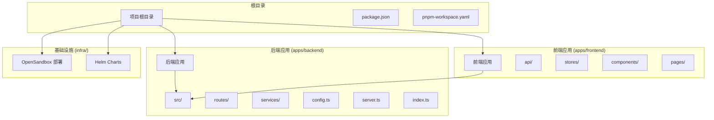
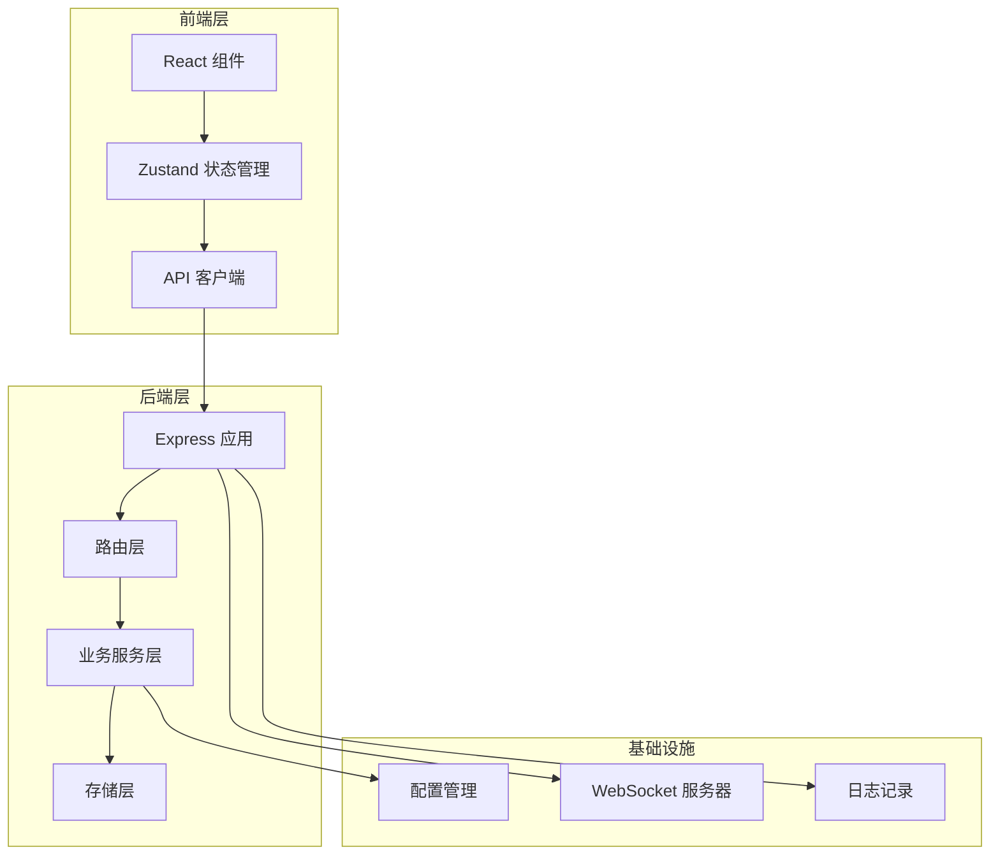
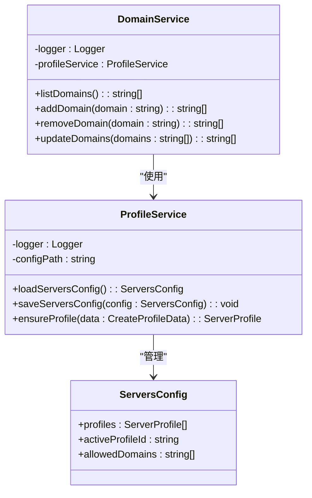
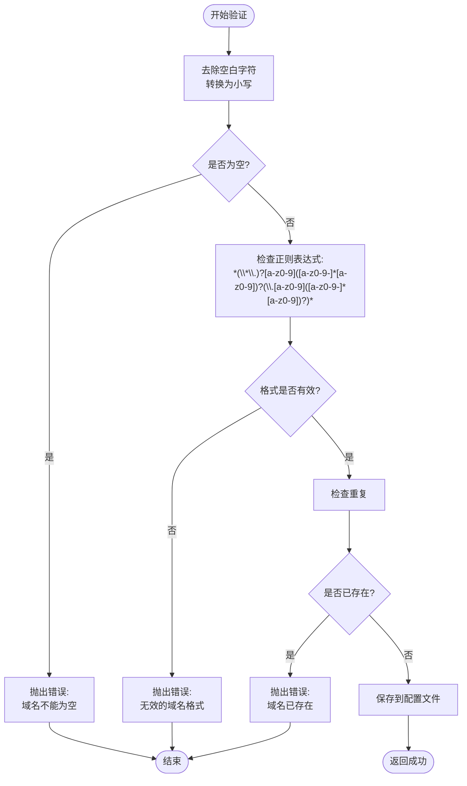
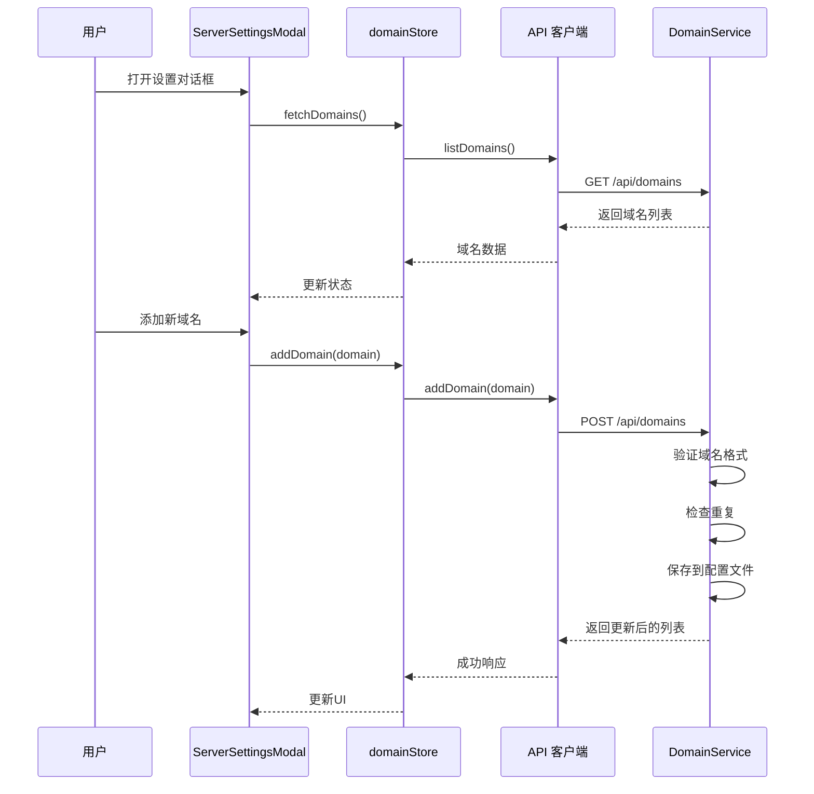
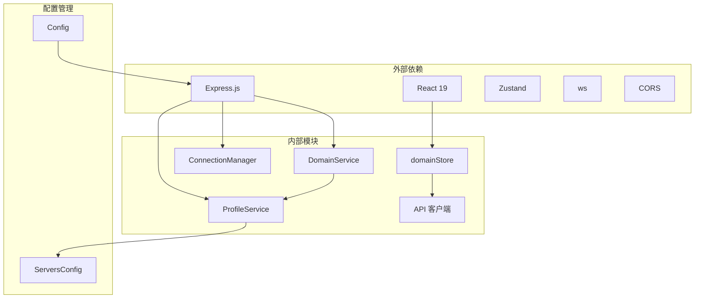

# 域名管理系统

<cite>
**本文档中引用的文件**
- [apps/backend/src/index.ts](file://apps/backend/src/index.ts)
- [apps/backend/src/server.ts](file://apps/backend/src/server.ts)
- [apps/backend/src/routes/domains.ts](file://apps/backend/src/routes/domains.ts)
- [apps/backend/src/services/domainService.ts](file://apps/backend/src/services/domainService.ts)
- [apps/backend/src/services/profileService.ts](file://apps/backend/src/services/profileService.ts)
- [apps/backend/src/routes/index.ts](file://apps/backend/src/routes/index.ts)
- [apps/frontend/src/stores/domainStore.ts](file://apps/frontend/src/stores/domainStore.ts)
- [apps/frontend/src/api/domains.ts](file://apps/frontend/src/api/domains.ts)
- [apps/frontend/src/components/settings/ServerSettingsModal.tsx](file://apps/frontend/src/components/settings/ServerSettingsModal.tsx)
- [apps/frontend/src/api/client.ts](file://apps/frontend/src/api/client.ts)
- [apps/backend/src/config.ts](file://apps/backend/src/config.ts)
- [apps/backend/src/websocket/connectionManager.ts](file://apps/backend/src/websocket/connectionManager.ts)
- [README.md](file://README.md)
</cite>

## 目录
1. [简介](#简介)
2. [项目结构](#项目结构)
3. [核心组件](#核心组件)
4. [架构概览](#架构概览)
5. [详细组件分析](#详细组件分析)
6. [依赖关系分析](#依赖关系分析)
7. [性能考虑](#性能考虑)
8. [故障排除指南](#故障排除指南)
9. [结论](#结论)

## 简介

域名管理系统是基于 OpenSandbox 的 Kubernetes AI 沙箱管理平台的一部分，专门负责管理允许访问沙箱的域名白名单。该系统通过 Web UI 提供直观的界面来添加、删除和管理域名规则，支持通配符匹配和精确域名匹配。

系统采用前后端分离架构，后端使用 Express.js 提供 REST API，前端使用 React + TypeScript 构建用户界面。所有域名配置都存储在本地的 `servers.json` 文件中，确保配置的持久性和可靠性。

## 项目结构

该项目采用 Monorepo 结构，包含独立的前端和后端应用程序：

**图表来源**
- [README.md:114-140](file://README.md#L114-L140)

**章节来源**
- [README.md:114-140](file://README.md#L114-L140)

## 核心组件

域名管理系统的核心组件包括：

### 后端服务层
- **DomainService**: 处理域名相关的业务逻辑，包括验证、存储和检索
- **ProfileService**: 管理服务器配置和域名白名单的持久化存储
- **Express 路由**: 提供 REST API 接口用于域名管理操作

### 前端状态管理层
- **domainStore**: 使用 Zustand 管理域名状态，处理异步操作
- **ServerSettingsModal**: 主要的用户界面组件，提供域名管理功能
- **API 客户端**: 封装 HTTP 请求，处理错误响应

### WebSocket 连接管理
- **ConnectionManager**: 管理 PTY WebSocket 连接，支持空闲超时检测
- **PtyRelay**: 实现终端连接的中继功能

**章节来源**
- [apps/backend/src/services/domainService.ts:1-82](file://apps/backend/src/services/domainService.ts#L1-L82)
- [apps/backend/src/services/profileService.ts:1-244](file://apps/backend/src/services/profileService.ts#L1-L244)
- [apps/frontend/src/stores/domainStore.ts:1-72](file://apps/frontend/src/stores/domainStore.ts#L1-L72)

## 架构概览

系统采用分层架构设计，清晰分离关注点：

**图表来源**
- [apps/backend/src/server.ts:36-90](file://apps/backend/src/server.ts#L36-L90)
- [apps/backend/src/index.ts:1-34](file://apps/backend/src/index.ts#L1-L34)

## 详细组件分析

### DomainService 分析

DomainService 是域名管理的核心业务逻辑组件，负责处理所有域名相关的操作：

**图表来源**
- [apps/backend/src/services/domainService.ts:5-82](file://apps/backend/src/services/domainService.ts#L5-L82)
- [apps/backend/src/services/profileService.ts:54-244](file://apps/backend/src/services/profileService.ts#L54-L244)

#### 域名验证逻辑

系统实现了严格的域名验证机制：

**图表来源**
- [apps/backend/src/services/domainService.ts:19-38](file://apps/backend/src/services/domainService.ts#L19-L38)

**章节来源**
- [apps/backend/src/services/domainService.ts:14-80](file://apps/backend/src/services/domainService.ts#L14-L80)

### 前端用户界面分析

ServerSettingsModal 是域名管理的主要用户界面组件：

**图表来源**
- [apps/frontend/src/components/settings/ServerSettingsModal.tsx:135-151](file://apps/frontend/src/components/settings/ServerSettingsModal.tsx#L135-L151)
- [apps/frontend/src/stores/domainStore.ts:36-68](file://apps/frontend/src/stores/domainStore.ts#L36-L68)

**章节来源**
- [apps/frontend/src/components/settings/ServerSettingsModal.tsx:135-151](file://apps/frontend/src/components/settings/ServerSettingsModal.tsx#L135-L151)
- [apps/frontend/src/stores/domainStore.ts:21-71](file://apps/frontend/src/stores/domainStore.ts#L21-L71)

### API 路由设计

系统提供了完整的 REST API 来支持域名管理操作：

| 方法 | 路径 | 描述 | 请求体 | 响应 |
|------|------|------|--------|------|
| GET | `/api/domains` | 获取所有允许的域名 | 无 | `{ success: true, data: string[] }` |
| POST | `/api/domains` | 添加新域名 | `{ domain: string }` | `{ success: true, data: string[] }` |
| DELETE | `/api/domains/:domain` | 删除指定域名 | 无 | `{ success: true, data: string[] }` |
| PUT | `/api/domains` | 批量更新域名列表 | `{ domains: string[] }` | `{ success: true, data: string[] }` |

**章节来源**
- [apps/backend/src/routes/domains.ts:11-77](file://apps/backend/src/routes/domains.ts#L11-L77)

## 依赖关系分析

系统的关键依赖关系如下：

**图表来源**
- [apps/backend/src/server.ts:8-13](file://apps/backend/src/server.ts#L8-L13)
- [apps/frontend/src/stores/domainStore.ts:1-19](file://apps/frontend/src/stores/domainStore.ts#L1-L19)

**章节来源**
- [apps/backend/src/server.ts:36-90](file://apps/backend/src/server.ts#L36-L90)
- [apps/frontend/src/api/client.ts:16-44](file://apps/frontend/src/api/client.ts#L16-L44)

## 性能考虑

### 存储优化
- 使用原子性写入：通过临时文件 + 重命名的方式确保配置文件的原子性更新
- 内存缓存：ProfileService 在内存中缓存配置，减少磁盘 I/O 操作
- 增量更新：批量更新时只进行一次文件写入操作

### 网络优化
- CORS 配置：灵活的跨域策略，支持开发和生产环境的不同需求
- 请求限制：JSON 请求体大小限制为 1MB，防止恶意请求
- 连接池：WebSocket 连接管理器支持连接池和空闲超时检测

### 前端性能
- 状态管理：使用 Zustand 提供轻量级的状态管理，避免不必要的重新渲染
- 异步加载：域名列表采用异步加载，提升用户体验
- 错误边界：完善的错误处理机制，防止应用崩溃

## 故障排除指南

### 常见问题及解决方案

#### 1. 域名验证失败
**症状**: 添加域名时报错 "无效的域名格式"
**原因**: 域名不符合正则表达式要求
**解决方法**: 
- 确保域名只包含字母数字和连字符
- 通配符只能出现在域名开头，如 `*.example.com`
- 避免连续的连字符

#### 2. 配置文件损坏
**症状**: 应用启动时报错或域名配置丢失
**原因**: `servers.json` 文件格式不正确或被意外修改
**解决方法**:
- 检查文件格式是否为有效的 JSON
- 确认 `allowedDomains` 字段存在且为数组类型
- 重启应用以触发默认配置恢复

#### 3. WebSocket 连接问题
**症状**: 终端无法连接或连接频繁断开
**原因**: PTY 连接超时或网络不稳定
**解决方法**:
- 检查 `PTY_IDLE_TIMEOUT_MS` 配置
- 确认防火墙设置允许 WebSocket 连接
- 查看日志中的连接信息

**章节来源**
- [apps/backend/src/services/domainService.ts:24-27](file://apps/backend/src/services/domainService.ts#L24-L27)
- [apps/backend/src/websocket/connectionManager.ts:92-100](file://apps/backend/src/websocket/connectionManager.ts#L92-L100)

## 结论

域名管理系统是一个设计精良的配置管理工具，具有以下特点：

### 优势
- **简洁明了**: API 设计简单直观，易于理解和使用
- **安全可靠**: 严格的输入验证和错误处理机制
- **持久化存储**: 配置持久化到本地文件，确保数据安全
- **用户友好**: 直观的 Web 界面，支持批量操作和实时验证

### 扩展建议
- **权限控制**: 可以添加基于角色的访问控制
- **审计日志**: 记录所有域名变更操作的历史
- **导入导出**: 支持批量导入和导出域名配置
- **监控告警**: 添加域名变更的实时通知功能

该系统为 OpenSandbox 平台提供了重要的安全控制机制，通过细粒度的域名白名单管理，确保只有授权的域名可以访问沙箱环境，为 AI 应用的安全运行提供了坚实的基础。