# 多服务器配置管理

<cite>
**本文档引用的文件**
- [apps/backend/src/index.ts](file://apps/backend/src/index.ts)
- [apps/backend/src/server.ts](file://apps/backend/src/server.ts)
- [apps/backend/src/config.ts](file://apps/backend/src/config.ts)
- [apps/backend/src/routes/index.ts](file://apps/backend/src/routes/index.ts)
- [apps/backend/src/routes/sandboxes.ts](file://apps/backend/src/routes/sandboxes.ts)
- [apps/backend/src/services/sandboxService.ts](file://apps/backend/src/services/sandboxService.ts)
- [apps/backend/src/services/setupService.ts](file://apps/backend/src/services/setupService.ts)
- [apps/backend/src/websocket/connectionManager.ts](file://apps/backend/src/websocket/connectionManager.ts)
- [apps/backend/src/websocket/ptyRelay.ts](file://apps/backend/src/websocket/ptyRelay.ts)
- [apps/backend/src/websocket/types.ts](file://apps/backend/src/websocket/types.ts)
- [apps/frontend/src/App.tsx](file://apps/frontend/src/App.tsx)
- [apps/frontend/src/pages/SetupWizardPage.tsx](file://apps/frontend/src/pages/SetupWizardPage.tsx)
- [apps/frontend/src/stores/sandboxStore.ts](file://apps/frontend/src/stores/sandboxStore.ts)
- [apps/frontend/src/api/client.ts](file://apps/frontend/src/api/client.ts)
- [README.md](file://README.md)
</cite>

## 目录
1. [简介](#简介)
2. [项目结构](#项目结构)
3. [核心组件](#核心组件)
4. [架构概览](#架构概览)
5. [详细组件分析](#详细组件分析)
6. [依赖关系分析](#依赖关系分析)
7. [性能考虑](#性能考虑)
8. [故障排除指南](#故障排除指南)
9. [结论](#结论)

## 简介

多服务器配置管理系统是一个基于 OpenSandbox 的 Kubernetes AI 沙箱管理平台。该系统允许用户通过 Web 界面创建、管理和隔离的沙箱环境，并使用 Web 终端进行实时交互。

该系统采用前后端分离架构，后端使用 Express + WebSocket + OpenSandbox SDK，前端使用 React + TypeScript + Zustand 状态管理。系统支持本地和远程两种 Kubernetes 配置模式，提供完整的沙箱生命周期管理功能。

## 项目结构

项目采用 pnpm monorepo 结构，包含独立的前端和后端应用：

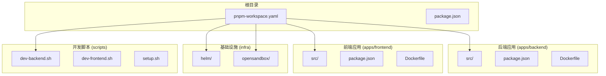

**图表来源**
- [README.md:114-140](file://README.md#L114-L140)

**章节来源**
- [README.md:114-140](file://README.md#L114-L140)

## 核心组件

### 配置管理系统

系统通过环境变量驱动配置，支持多种部署场景：

| 配置项 | 类型 | 默认值 | 描述 |
|--------|------|--------|------|
| OPENSANDBOX_SERVER_URL | string | localhost:8080 | OpenSandbox 服务器地址 |
| OPENSANDBOX_API_KEY | string | (空) | OpenSandbox API 密钥 |
| OPENSANDBOX_PROTOCOL | "http" \| "https" | http | 连接协议 |
| PORT | number | 3000 | 后端监听端口 |
| CORS_ORIGIN | string | * | CORS 允许来源 |
| LOG_LEVEL | string | info | 日志级别 |
| PTY_IDLE_TIMEOUT_MS | number | 300000 | PTY 空闲超时 |

### 服务发现与连接管理

系统实现了智能的服务发现机制，能够根据配置自动选择合适的连接策略：

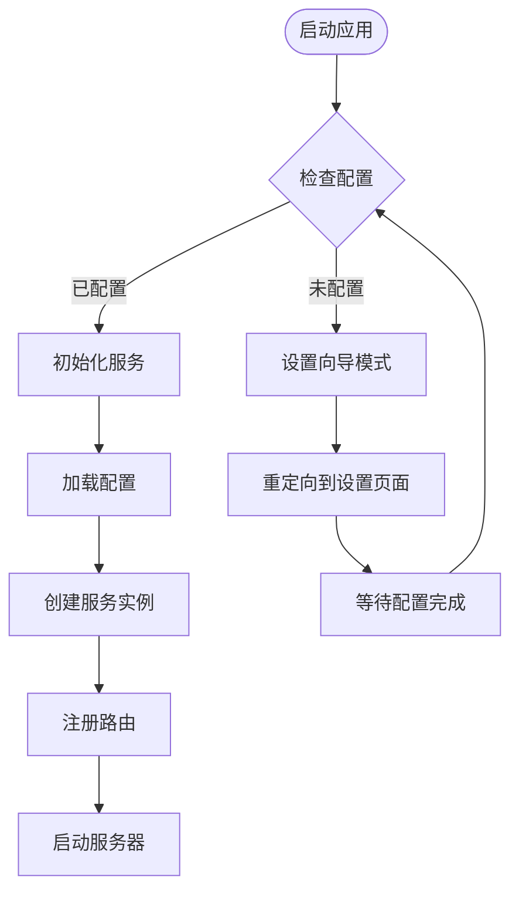

**图表来源**
- [apps/backend/src/index.ts:1-34](file://apps/backend/src/index.ts#L1-L34)
- [apps/backend/src/server.ts:36-90](file://apps/backend/src/server.ts#L36-L90)

**章节来源**
- [apps/backend/src/config.ts:48-71](file://apps/backend/src/config.ts#L48-L71)
- [apps/backend/src/server.ts:36-90](file://apps/backend/src/server.ts#L36-L90)

## 架构概览

系统采用分层架构设计，包含表示层、业务逻辑层、数据访问层和基础设施层：

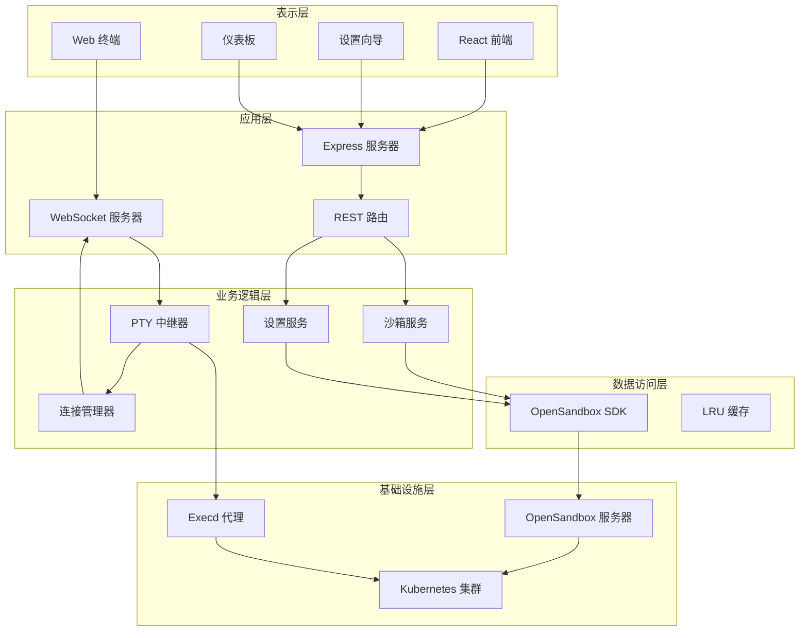

**图表来源**
- [apps/backend/src/server.ts:15-26](file://apps/backend/src/server.ts#L15-L26)
- [apps/backend/src/services/sandboxService.ts:11-47](file://apps/backend/src/services/sandboxService.ts#L11-L47)
- [apps/backend/src/websocket/ptyRelay.ts:22-38](file://apps/backend/src/websocket/ptyRelay.ts#L22-L38)

## 详细组件分析

### 沙箱服务管理

沙箱服务是系统的核心组件，负责与 OpenSandbox SDK 交互并管理沙箱生命周期：

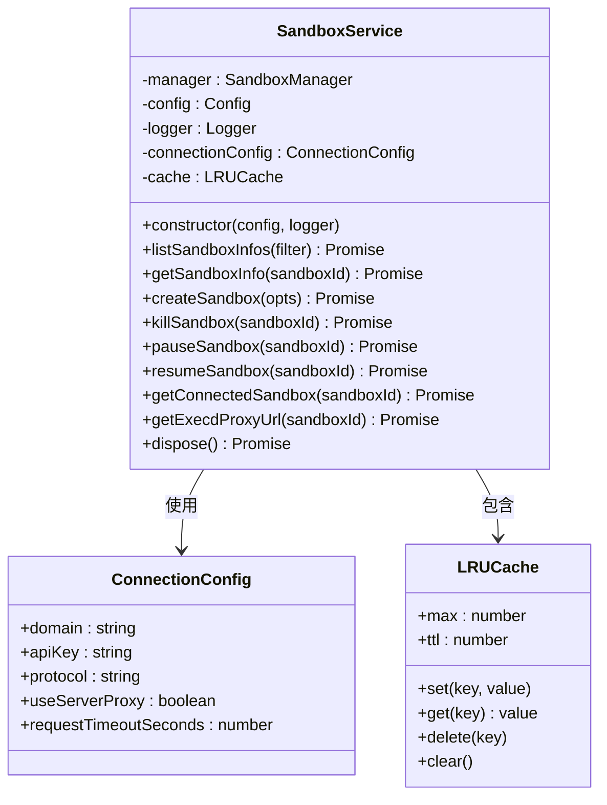

**图表来源**
- [apps/backend/src/services/sandboxService.ts:11-148](file://apps/backend/src/services/sandboxService.ts#L11-L148)

#### 沙箱生命周期管理

系统提供完整的沙箱生命周期管理功能：

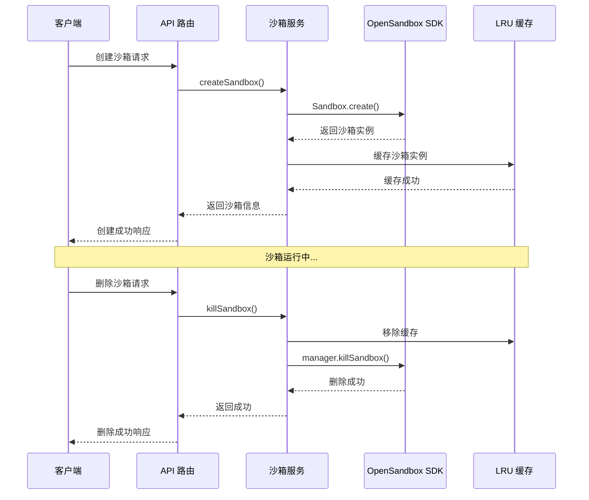

**图表来源**
- [apps/backend/src/routes/sandboxes.ts:95-127](file://apps/backend/src/routes/sandboxes.ts#L95-L127)
- [apps/backend/src/services/sandboxService.ts:62-94](file://apps/backend/src/services/sandboxService.ts#L62-L94)

**章节来源**
- [apps/backend/src/services/sandboxService.ts:11-148](file://apps/backend/src/services/sandboxService.ts#L11-L148)
- [apps/backend/src/routes/sandboxes.ts:95-175](file://apps/backend/src/routes/sandboxes.ts#L95-L175)

### PTY 终端中继系统

PTY 终端中继系统是系统的关键组件，实现了透明的二进制帧转发：

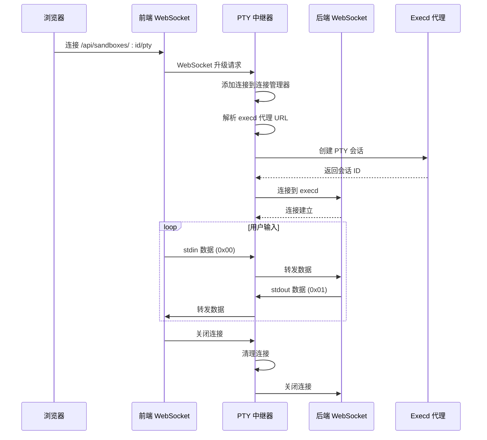

**图表来源**
- [apps/backend/src/websocket/ptyRelay.ts:40-118](file://apps/backend/src/websocket/ptyRelay.ts#L40-L118)
- [apps/backend/src/websocket/connectionManager.ts:30-46](file://apps/backend/src/websocket/connectionManager.ts#L30-L46)

#### 连接管理与空闲监控

系统实现了智能的连接管理机制：

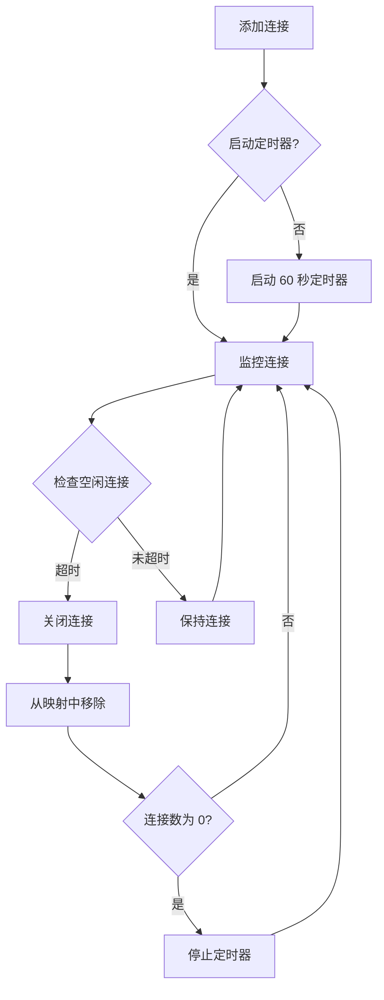

**图表来源**
- [apps/backend/src/websocket/connectionManager.ts:85-100](file://apps/backend/src/websocket/connectionManager.ts#L85-L100)

**章节来源**
- [apps/backend/src/websocket/ptyRelay.ts:1-171](file://apps/backend/src/websocket/ptyRelay.ts#L1-L171)
- [apps/backend/src/websocket/connectionManager.ts:1-102](file://apps/backend/src/websocket/connectionManager.ts#L1-L102)

### 设置向导系统

设置向导提供了灵活的配置选项，支持本地和远程两种部署模式：

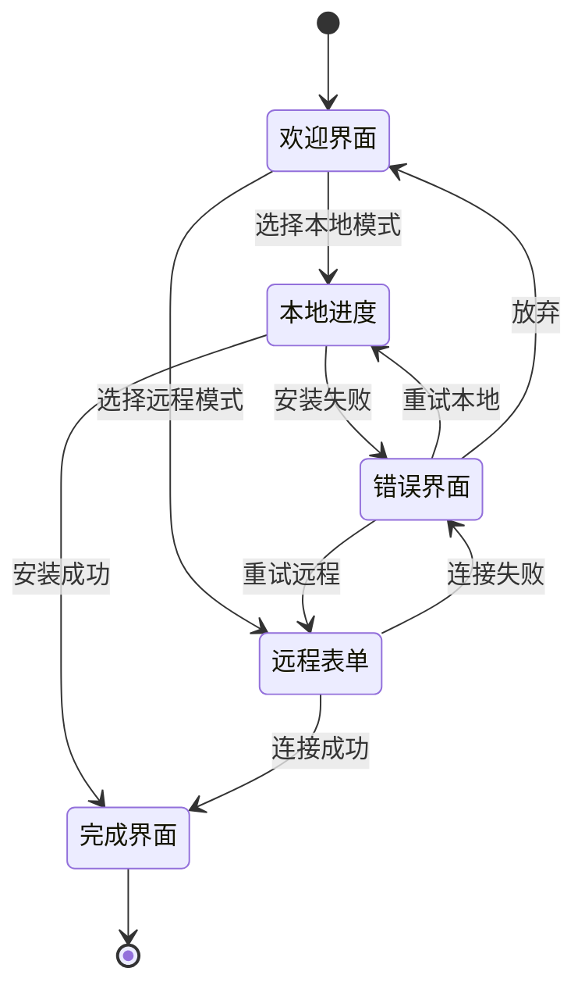

**图表来源**
- [apps/frontend/src/pages/SetupWizardPage.tsx:20-62](file://apps/frontend/src/pages/SetupWizardPage.tsx#L20-L62)

#### 远程连接测试

系统提供了远程连接测试功能，确保配置正确性：

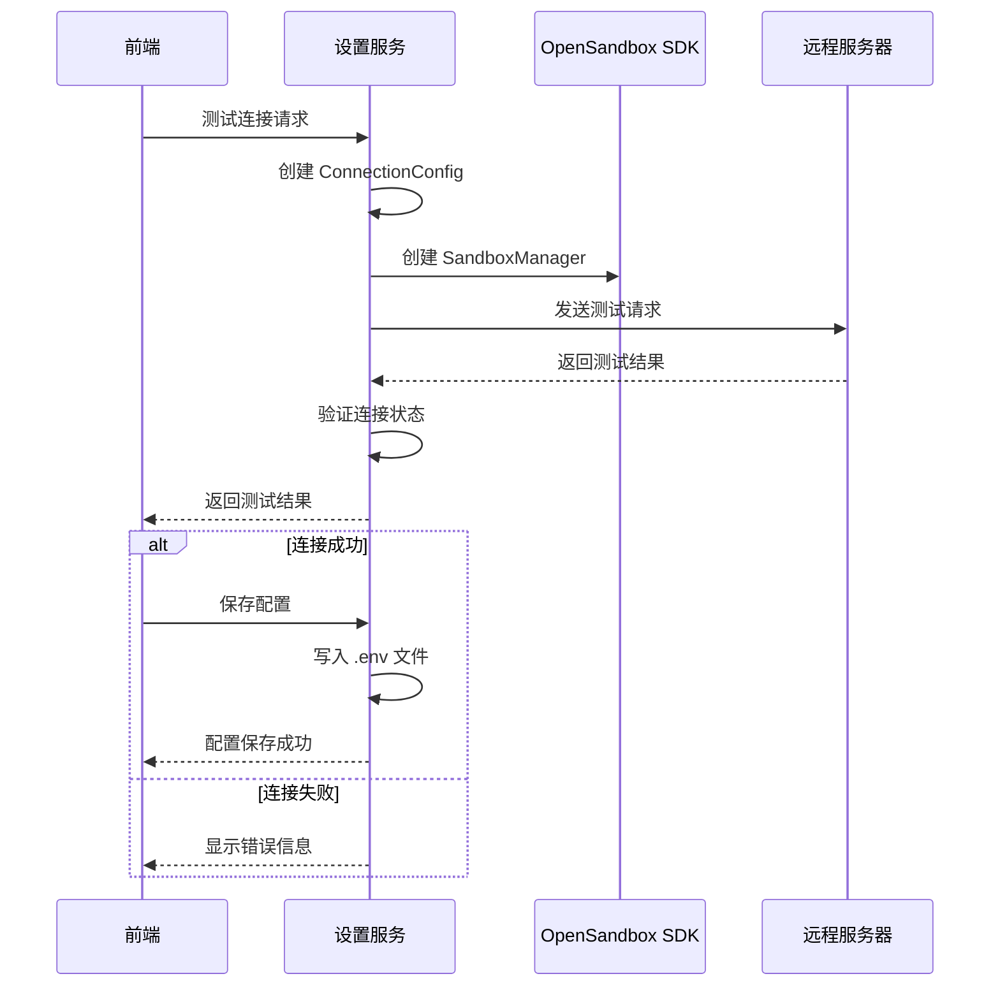

**图表来源**
- [apps/backend/src/services/setupService.ts:86-104](file://apps/backend/src/services/setupService.ts#L86-L104)
- [apps/backend/src/services/setupService.ts:109-124](file://apps/backend/src/services/setupService.ts#L109-L124)

**章节来源**
- [apps/frontend/src/pages/SetupWizardPage.tsx:1-128](file://apps/frontend/src/pages/SetupWizardPage.tsx#L1-L128)
- [apps/backend/src/services/setupService.ts:59-152](file://apps/backend/src/services/setupService.ts#L59-L152)

### 前端状态管理

前端使用 Zustand 实现轻量级状态管理：

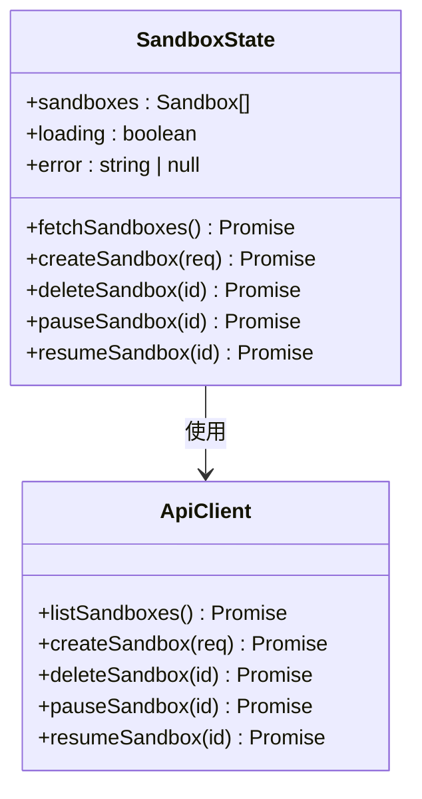

**图表来源**
- [apps/frontend/src/stores/sandboxStore.ts:5-14](file://apps/frontend/src/stores/sandboxStore.ts#L5-L14)

**章节来源**
- [apps/frontend/src/stores/sandboxStore.ts:1-63](file://apps/frontend/src/stores/sandboxStore.ts#L1-L63)

## 依赖关系分析

系统依赖关系清晰，模块间耦合度低：

```mermaid
graph TB
subgraph "外部依赖"
Express[express@^4.18.0]
WebSocket[ws@^8.13.0]
OpenSandbox[@alibaba-group/opensandbox]
LRU[lru-cache]
Cors[cors]
end
subgraph "内部模块"
Config[配置模块]
Server[服务器模块]
Routes[路由模块]
Services[服务模块]
WebSocket[WebSocket 模块]
end
subgraph "前端依赖"
React[react@^19.0.0]
Zustand[zustand]
Xterm[xterm.js]
end
Express --> Routes
Express --> Server
Server --> Services
Server --> WebSocket
Services --> OpenSandbox
Services --> LRU
WebSocket --> WebSocket
Routes --> Config
React --> Zustand
React --> Xterm
Zustand --> ApiClient
```

**图表来源**
- [apps/backend/src/server.ts:1-14](file://apps/backend/src/server.ts#L1-L14)
- [apps/backend/src/services/sandboxService.ts:1-9](file://apps/backend/src/services/sandboxService.ts#L1-L9)

**章节来源**
- [apps/backend/src/server.ts:1-14](file://apps/backend/src/server.ts#L1-L14)
- [apps/backend/src/services/sandboxService.ts:1-9](file://apps/backend/src/services/sandboxService.ts#L1-L9)

## 性能考虑

### 缓存策略

系统实现了多层缓存机制以提升性能：

1. **LRU 缓存**：沙箱实例缓存，最大 50 个，10 分钟 TTL
2. **连接缓存**：PTC 连接缓存，避免重复建立连接
3. **HTTP 缓存**：API 响应缓存，减少重复请求

### 连接池管理

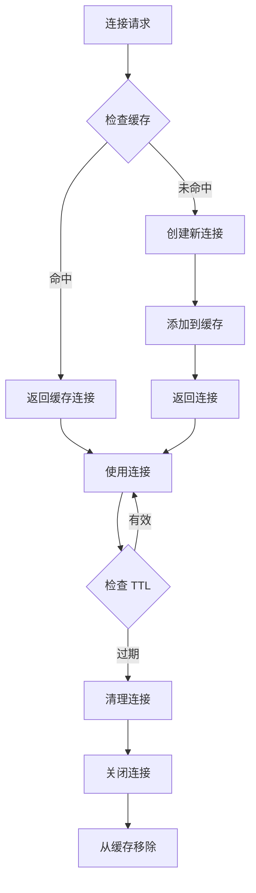

### 资源优化

- **内存管理**：LRU 缓存自动清理过期资源
- **网络优化**：WebSocket 复用连接，减少握手开销
- **CPU 优化**：空闲连接自动断开，释放系统资源

## 故障排除指南

### 常见问题诊断

#### 1. OpenSandbox 未配置

**症状**：访问沙箱相关 API 返回 503 错误

**解决方案**：
1. 检查环境变量配置
2. 运行设置向导完成配置
3. 验证 OpenSandbox 服务器连通性

#### 2. PTY 连接失败

**症状**：终端无法连接，显示连接超时

**解决方案**：
1. 检查 execd 代理服务状态
2. 验证沙箱实例是否正常运行
3. 检查防火墙和网络配置

#### 3. 远程连接测试失败

**症状**：设置向导显示连接失败

**解决方案**：
1. 验证服务器地址和端口
2. 检查 API 密钥有效性
3. 确认网络连通性

### 日志分析

系统提供详细的日志记录，便于问题诊断：

- **调试日志**：详细的操作流程记录
- **信息日志**：关键事件和状态变更
- **警告日志**：潜在问题和异常情况
- **错误日志**：具体错误信息和堆栈跟踪

**章节来源**
- [apps/backend/src/routes/sandboxes.ts:34-45](file://apps/backend/src/routes/sandboxes.ts#L34-L45)
- [apps/backend/src/websocket/ptyRelay.ts:110-118](file://apps/backend/src/websocket/ptyRelay.ts#L110-L118)

## 结论

多服务器配置管理系统提供了一个完整、可扩展的沙箱管理解决方案。系统的主要优势包括：

1. **灵活的部署模式**：支持本地和远程两种部署方式
2. **高性能架构**：多层缓存和连接复用机制
3. **完整的生命周期管理**：从创建到销毁的全链路支持
4. **用户友好的界面**：直观的 Web 界面和设置向导
5. **强大的扩展性**：模块化设计便于功能扩展

系统适用于需要隔离计算环境的 AI 开发场景，能够有效管理多个用户的沙箱资源，提供安全可靠的计算环境。