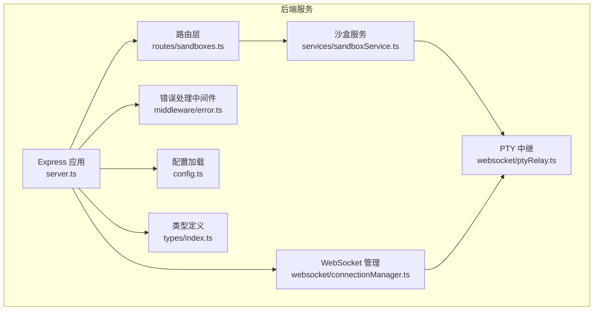
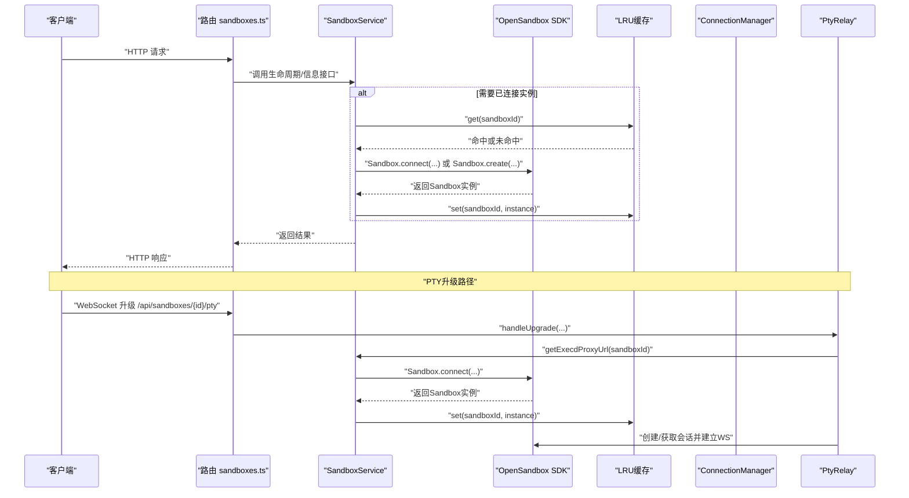
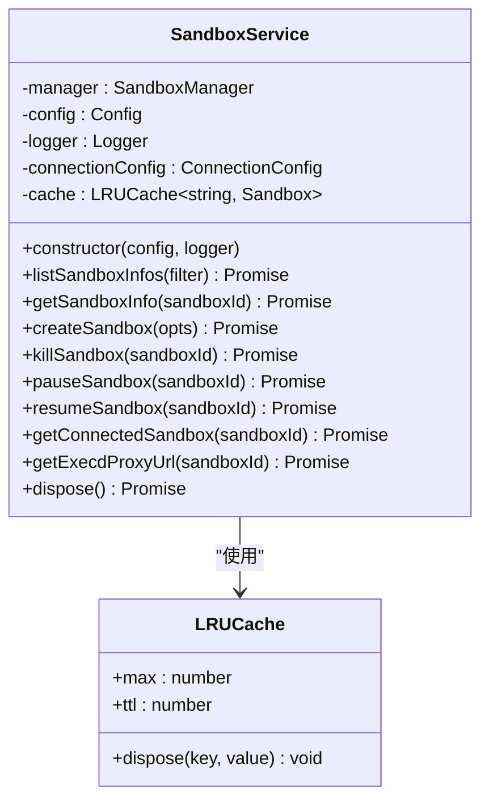
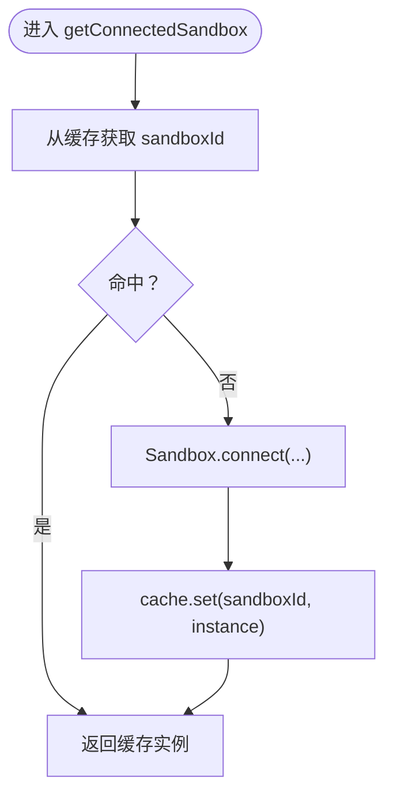
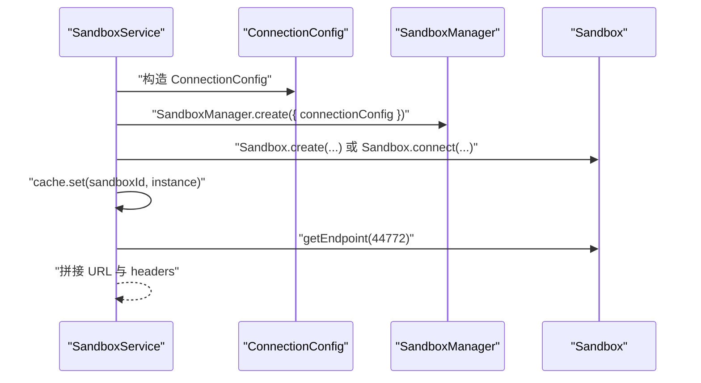
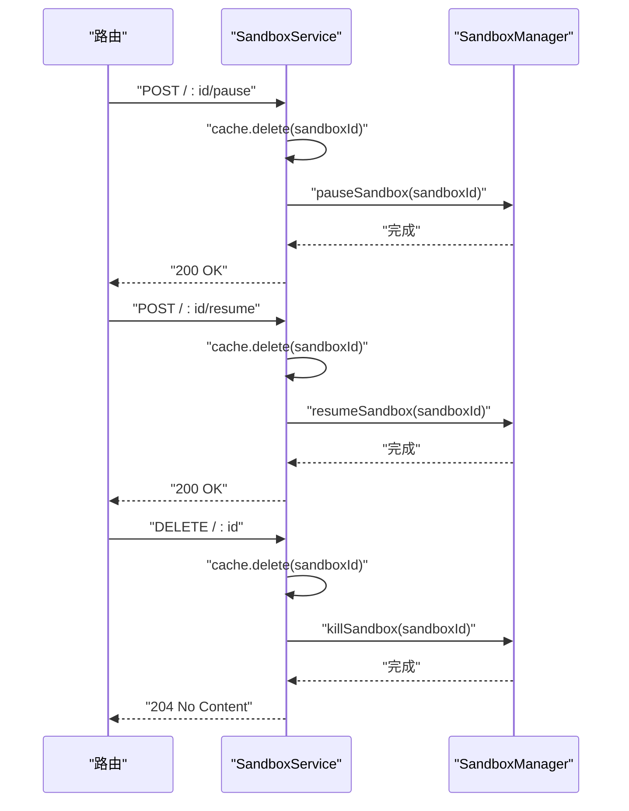
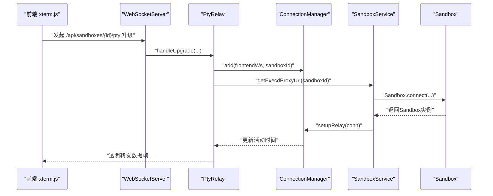
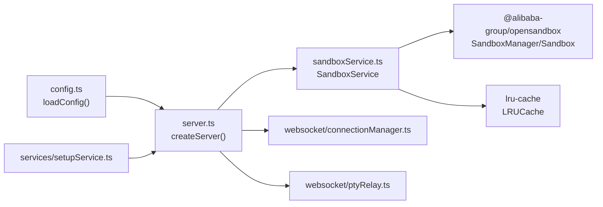

# 沙盒服务模块

<cite>
**本文档引用的文件**
- [sandboxService.ts](file://apps/backend/src/services/sandboxService.ts)
- [config.ts](file://apps/backend/src/config.ts)
- [types/index.ts](file://apps/backend/src/types/index.ts)
- [routes/sandboxes.ts](file://apps/backend/src/routes/sandboxes.ts)
- [middleware/error.ts](file://apps/backend/src/middleware/error.ts)
- [websocket/connectionManager.ts](file://apps/backend/src/websocket/connectionManager.ts)
- [websocket/ptyRelay.ts](file://apps/backend/src/websocket/ptyRelay.ts)
- [server.ts](file://apps/backend/src/server.ts)
- [services/setupService.ts](file://apps/backend/src/services/setupService.ts)
</cite>

## 目录
1. [简介](#简介)
2. [项目结构](#项目结构)
3. [核心组件](#核心组件)
4. [架构总览](#架构总览)
5. [详细组件分析](#详细组件分析)
6. [依赖关系分析](#依赖关系分析)
7. [性能考量](#性能考量)
8. [故障排查指南](#故障排查指南)
9. [结论](#结论)
10. [附录](#附录)

## 简介
本文件面向Sandbox Manager后端的沙盒服务模块，系统性阐述SandboxService类的设计与实现，涵盖：
- 沙盒生命周期管理：创建、暂停、恢复、销毁
- LRU缓存机制：容量、TTL、驱逐策略与资源回收
- 连接管理策略：与OpenSandbox SDK的集成、ConnectionConfig配置、PTy会话代理
- 缓存策略与TTL过期处理：命中率优化与内存管理
- 错误处理与性能优化建议

该文档旨在帮助开发者快速理解并正确使用沙盒服务模块，同时提供最佳实践与排障指引。

## 项目结构
后端采用Express + WebSocket架构，沙盒服务位于apps/backend/src/services目录，路由在apps/backend/src/routes，WebSocket相关逻辑在apps/backend/src/websocket，配置与类型定义分别在apps/backend/src/config.ts与apps/backend/src/types/index.ts。

图表来源
- [server.ts:36-90](file://apps/backend/src/server.ts#L36-L90)
- [routes/sandboxes.ts:9-175](file://apps/backend/src/routes/sandboxes.ts#L9-L175)
- [sandboxService.ts:11-148](file://apps/backend/src/services/sandboxService.ts#L11-L148)
- [websocket/ptyRelay.ts:22-171](file://apps/backend/src/websocket/ptyRelay.ts#L22-L171)
- [websocket/connectionManager.ts:7-102](file://apps/backend/src/websocket/connectionManager.ts#L7-L102)
- [config.ts:48-71](file://apps/backend/src/config.ts#L48-L71)
- [types/index.ts:1-89](file://apps/backend/src/types/index.ts#L1-L89)

章节来源
- [server.ts:36-90](file://apps/backend/src/server.ts#L36-L90)
- [routes/sandboxes.ts:9-175](file://apps/backend/src/routes/sandboxes.ts#L9-L175)
- [config.ts:48-71](file://apps/backend/src/config.ts#L48-L71)

## 核心组件
- SandboxService：封装OpenSandbox SDK的SandboxManager与Sandbox实例，提供REST接口所需的沙盒生命周期操作，并通过LRU缓存复用已连接的Sandbox实例。
- ConnectionConfig：基于环境变量构建OpenSandbox连接配置，支持协议、超时、代理等参数。
- PtyRelay：负责前端xterm.js与OpenSandbox execd之间的透明双向转发，建立后端到服务器的WebSocket通道。
- ConnectionManager：维护活跃的PTY连接，按空闲超时进行清理。
- 路由sandboxes：提供沙盒列表、创建、查询、删除、暂停、恢复、端点URL获取等REST接口；在未配置OpenSandbox时返回503。
- 错误处理：根据SDK异常类型映射为合适的HTTP状态码。

章节来源
- [sandboxService.ts:11-148](file://apps/backend/src/services/sandboxService.ts#L11-L148)
- [config.ts:48-71](file://apps/backend/src/config.ts#L48-L71)
- [websocket/ptyRelay.ts:22-171](file://apps/backend/src/websocket/ptyRelay.ts#L22-L171)
- [websocket/connectionManager.ts:7-102](file://apps/backend/src/websocket/connectionManager.ts#L7-L102)
- [routes/sandboxes.ts:9-175](file://apps/backend/src/routes/sandboxes.ts#L9-L175)
- [middleware/error.ts:5-48](file://apps/backend/src/middleware/error.ts#L5-L48)

## 架构总览
下图展示了从HTTP请求到OpenSandbox SDK调用、LRU缓存与WebSocket中继的整体流程。

图表来源
- [routes/sandboxes.ts:95-174](file://apps/backend/src/routes/sandboxes.ts#L95-L174)
- [sandboxService.ts:112-138](file://apps/backend/src/services/sandboxService.ts#L112-L138)
- [websocket/ptyRelay.ts:40-118](file://apps/backend/src/websocket/ptyRelay.ts#L40-L118)

## 详细组件分析

### SandboxService 类设计与实现
SandboxService是沙盒服务的核心，负责：
- 初始化ConnectionConfig与SandboxManager
- 提供沙盒生命周期操作：创建、暂停、恢复、销毁
- 提供getConnectedSandbox以复用已连接实例
- 提供getExecdProxyUrl用于构建PTY WebSocket URL
- 使用LRU缓存管理Sandbox实例，含TTL与驱逐回调

关键实现要点：
- 连接配置：ConnectionConfig从环境变量读取服务器地址、协议、API Key、是否使用服务端代理、请求超时等。
- 缓存策略：LRU最大容量为50，TTL为10分钟；驱逐时尝试关闭Sandbox实例并记录日志。
- 生命周期操作：kill/pause/resume在调用SDK前先从缓存删除对应键，确保后续访问重新连接。
- PTY代理URL：通过Sandbox实例获取execd端点，拼接协议与主机，附加必要头部。

图表来源
- [sandboxService.ts:11-148](file://apps/backend/src/services/sandboxService.ts#L11-L148)

章节来源
- [sandboxService.ts:11-148](file://apps/backend/src/services/sandboxService.ts#L11-L148)

### LRU缓存机制与TTL驱逐
- 容量与TTL：最大50个条目，TTL 10分钟。适合中等并发场景，避免过多活跃连接占用内存。
- 驱逐策略：当缓存满或TTL到期时触发dispose回调，尝试关闭Sandbox实例并记录日志，防止资源泄漏。
- 访问模式：getConnectedSandbox优先从缓存获取，未命中则通过Sandbox.connect建立新连接并写入缓存。

图表来源
- [sandboxService.ts:112-123](file://apps/backend/src/services/sandboxService.ts#L112-L123)

章节来源
- [sandboxService.ts:35-44](file://apps/backend/src/services/sandboxService.ts#L35-L44)
- [sandboxService.ts:112-123](file://apps/backend/src/services/sandboxService.ts#L112-L123)

### 连接管理策略与OpenSandbox集成
- ConnectionConfig配置项：
  - domain：OpenSandbox服务器地址
  - apiKey：可选API Key
  - protocol：http/https
  - useServerProxy：是否使用服务端代理
  - requestTimeoutSeconds：请求超时秒数
- SandboxManager.create：基于ConnectionConfig创建管理器
- Sandbox.create/connect：创建或连接沙盒实例，随后写入缓存
- getExecdProxyUrl：获取execd代理URL与必要头部，供PTY中继使用

图表来源
- [sandboxService.ts:20-47](file://apps/backend/src/services/sandboxService.ts#L20-L47)
- [sandboxService.ts:75-87](file://apps/backend/src/services/sandboxService.ts#L75-L87)
- [sandboxService.ts:112-138](file://apps/backend/src/services/sandboxService.ts#L112-L138)

章节来源
- [sandboxService.ts:20-47](file://apps/backend/src/services/sandboxService.ts#L20-L47)
- [config.ts:48-71](file://apps/backend/src/config.ts#L48-L71)

### 沙盒生命周期管理
- 创建：Sandbox.create，设置默认超时600秒，写入缓存后返回信息。
- 暂停/恢复：调用SDK pause/resume，同时从缓存删除键，确保下次访问重建连接。
- 销毁：killSandbox，从缓存删除后调用SDK销毁。
- 查询：listSandboxInfos/getSandboxInfo直接委托给SandboxManager。

图表来源
- [routes/sandboxes.ts:129-149](file://apps/backend/src/routes/sandboxes.ts#L129-L149)
- [sandboxService.ts:90-106](file://apps/backend/src/services/sandboxService.ts#L90-L106)

章节来源
- [routes/sandboxes.ts:129-149](file://apps/backend/src/routes/sandboxes.ts#L129-L149)
- [sandboxService.ts:90-106](file://apps/backend/src/services/sandboxService.ts#L90-L106)

### PTY中继与连接管理
- 连接管理：ConnectionManager维护Map，记录每个连接的前端WebSocket、后端WebSocket、会话ID、创建时间与最后活动时间；按ptyIdleTimeoutMs定期检查并清理空闲连接。
- PTY中继：PtyRelay在WebSocket升级时，解析execd代理URL，创建后端到OpenSandbox的WebSocket，透明转发二进制帧与JSON控制帧，处理关闭与错误事件。

图表来源
- [websocket/ptyRelay.ts:40-118](file://apps/backend/src/websocket/ptyRelay.ts#L40-L118)
- [websocket/connectionManager.ts:30-100](file://apps/backend/src/websocket/connectionManager.ts#L30-L100)
- [routes/sandboxes.ts:151-174](file://apps/backend/src/routes/sandboxes.ts#L151-L174)

章节来源
- [websocket/ptyRelay.ts:22-171](file://apps/backend/src/websocket/ptyRelay.ts#L22-L171)
- [websocket/connectionManager.ts:7-102](file://apps/backend/src/websocket/connectionManager.ts#L7-L102)
- [routes/sandboxes.ts:151-174](file://apps/backend/src/routes/sandboxes.ts#L151-L174)

### REST路由与错误处理
- 路由sandboxes：提供列表、创建、详情、删除、暂停、恢复、端点URL等接口；在未配置OpenSandbox时返回503。
- 错误处理：根据SDK异常类型映射HTTP状态码，如SandboxApiException映射502，SandboxReadyTimeoutException映射504，InvalidArgumentException映射400等。

章节来源
- [routes/sandboxes.ts:9-175](file://apps/backend/src/routes/sandboxes.ts#L9-L175)
- [middleware/error.ts:5-48](file://apps/backend/src/middleware/error.ts#L5-L48)

## 依赖关系分析
- SandboxService依赖OpenSandbox SDK的SandboxManager与Sandbox，以及lru-cache库。
- 服务初始化：server.ts根据配置决定是否启用SandboxService；未配置时提供占位null，便于路由层统一处理。
- 重初始化：setupService在配置变更后调用reinitializeServices，释放旧服务并创建新服务，确保配置生效。

图表来源
- [config.ts:48-71](file://apps/backend/src/config.ts#L48-L71)
- [server.ts:50-54](file://apps/backend/src/server.ts#L50-L54)
- [sandboxService.ts:11-148](file://apps/backend/src/services/sandboxService.ts#L11-L148)
- [services/setupService.ts:94-146](file://apps/backend/src/services/setupService.ts#L94-L146)

章节来源
- [server.ts:50-54](file://apps/backend/src/server.ts#L50-L54)
- [services/setupService.ts:94-146](file://apps/backend/src/services/setupService.ts#L94-L146)

## 性能考量
- 缓存容量与TTL：当前max=50、ttl=10分钟，适用于中等并发。若并发较高，可考虑增大max并缩短TTL以降低内存占用；若连接复用率高，可适当延长TTL。
- 驱逐回调：确保evicted实例被关闭，避免连接泄漏。建议监控缓存命中率与驱逐频率，动态调整参数。
- PTY空闲清理：ptyIdleTimeoutMs默认5分钟，可根据业务场景调整，避免长时间空闲连接占用资源。
- 请求超时：osbRequestTimeoutSeconds默认300秒，需结合网络与集群延迟合理设置。
- 并发控制：路由层对OpenSandbox未配置时直接返回503，避免无效请求堆积。

[本节为通用性能建议，不直接分析具体文件]

## 故障排查指南
- OpenSandbox未配置：路由sandboxes在未配置时返回503，检查环境变量OPENSANDBOX_SERVER_URL与OPENSANDBOX_API_KEY。
- SDK异常映射：错误处理中间件将SDK异常映射为HTTP状态码，便于前端识别与提示。
- PTY连接失败：检查getExecdProxyUrl返回的URL与headers，确认OpenSandbox网关可达；查看PtyRelay日志定位握手与会话创建阶段的问题。
- 缓存驱逐频繁：若驱逐频率过高，可能需要提高max或延长TTL；同时检查是否存在大量短连接未复用。

章节来源
- [routes/sandboxes.ts:34-45](file://apps/backend/src/routes/sandboxes.ts#L34-L45)
- [middleware/error.ts:5-48](file://apps/backend/src/middleware/error.ts#L5-L48)
- [websocket/ptyRelay.ts:70-118](file://apps/backend/src/websocket/ptyRelay.ts#L70-L118)
- [sandboxService.ts:35-44](file://apps/backend/src/services/sandboxService.ts#L35-L44)

## 结论
SandboxService通过LRU缓存与OpenSandbox SDK紧密集成，提供了完整的沙盒生命周期管理能力，并通过PtyRelay与ConnectionManager实现了高效的终端交互与连接管理。合理的缓存参数与错误处理策略能够显著提升系统的稳定性与性能。建议在生产环境中持续监控缓存命中率、驱逐频率与PTY连接空闲情况，按需调整配置以获得最佳体验。

[本节为总结性内容，不直接分析具体文件]

## 附录

### OpenSandbox SDK 集成要点
- ConnectionConfig字段：domain、apiKey、protocol、useServerProxy、requestTimeoutSeconds
- SandboxManager.create：基于ConnectionConfig创建管理器
- Sandbox.create/connect：创建或连接沙盒实例
- Sandbox.getEndpoint/getEndpointUrl：获取端点URL
- Sandbox.close：在缓存驱逐时调用以释放资源

章节来源
- [sandboxService.ts:20-47](file://apps/backend/src/services/sandboxService.ts#L20-L47)
- [sandboxService.ts:75-87](file://apps/backend/src/services/sandboxService.ts#L75-L87)
- [sandboxService.ts:112-138](file://apps/backend/src/services/sandboxService.ts#L112-L138)

### 环境变量与配置
- OPENSANDBOX_SERVER_URL：OpenSandbox服务器地址
- OPENSANDBOX_API_KEY：API Key
- OPENSANDBOX_PROTOCOL：http/https
- OPENSANDBOX_USE_SERVER_PROXY：是否使用服务端代理
- OPENSANDBOX_REQUEST_TIMEOUT_SECONDS：请求超时秒数
- PORT、NODE_ENV、CORS_ORIGIN、LOG_LEVEL、PTY_IDLE_TIMEOUT_MS：其他运行时配置

章节来源
- [config.ts:48-71](file://apps/backend/src/config.ts#L48-L71)

### 最佳实践与示例路径
- 沙盒创建最佳实践：参考createSandbox参数与默认超时设置，避免过长或过短的超时导致资源浪费或频繁超时。
- 错误处理策略：参考errorHandler对SDK异常的分类映射，确保前端能正确显示错误信息。
- 性能优化技巧：调整LRU缓存max与ttl，监控驱逐频率；合理设置ptyIdleTimeoutMs；优化请求超时与重试策略。
- 缓存命中率优化建议：提升连接复用率（避免频繁创建/销毁），减少不必要的短连接；在高并发场景适当增大max并缩短TTL以平衡内存与延迟。

[本节提供实践建议与示例路径，不直接展示具体代码片段]