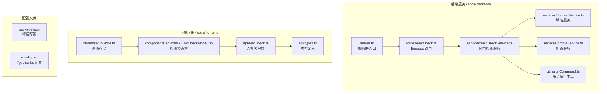
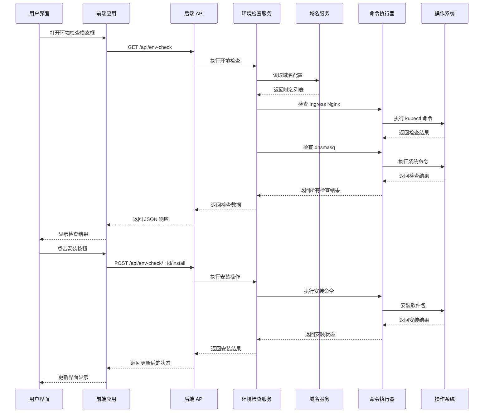
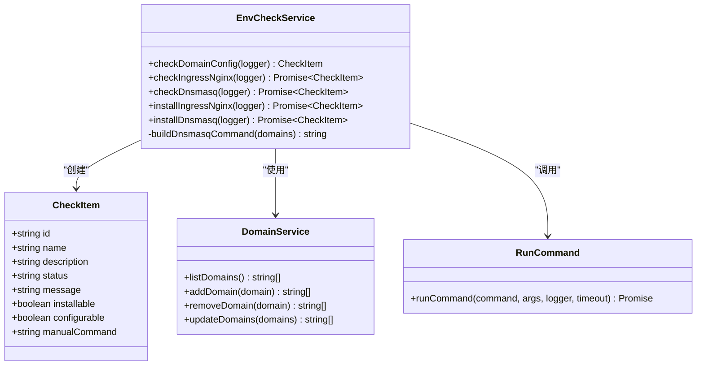
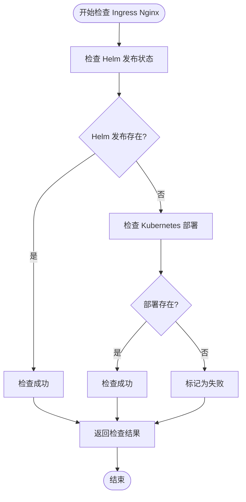
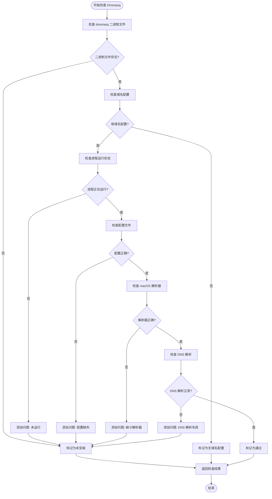
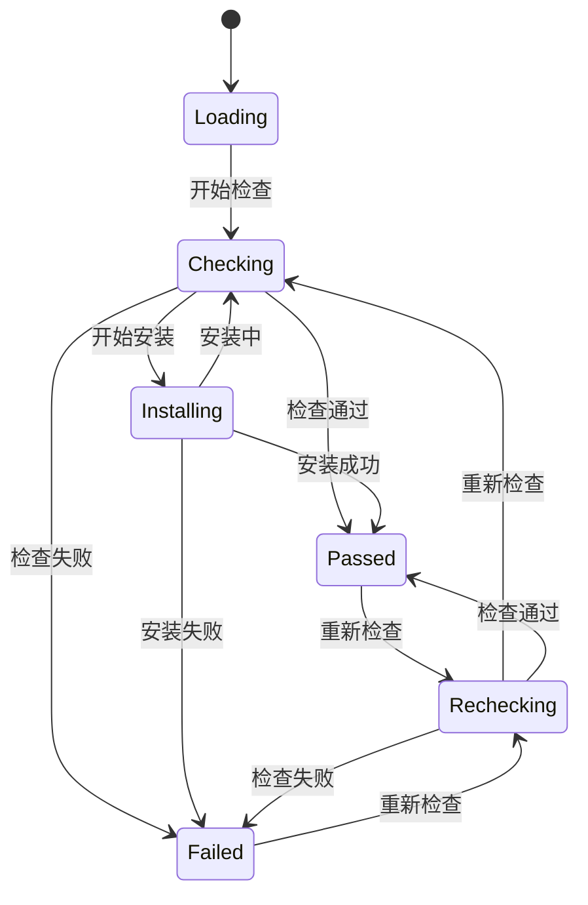
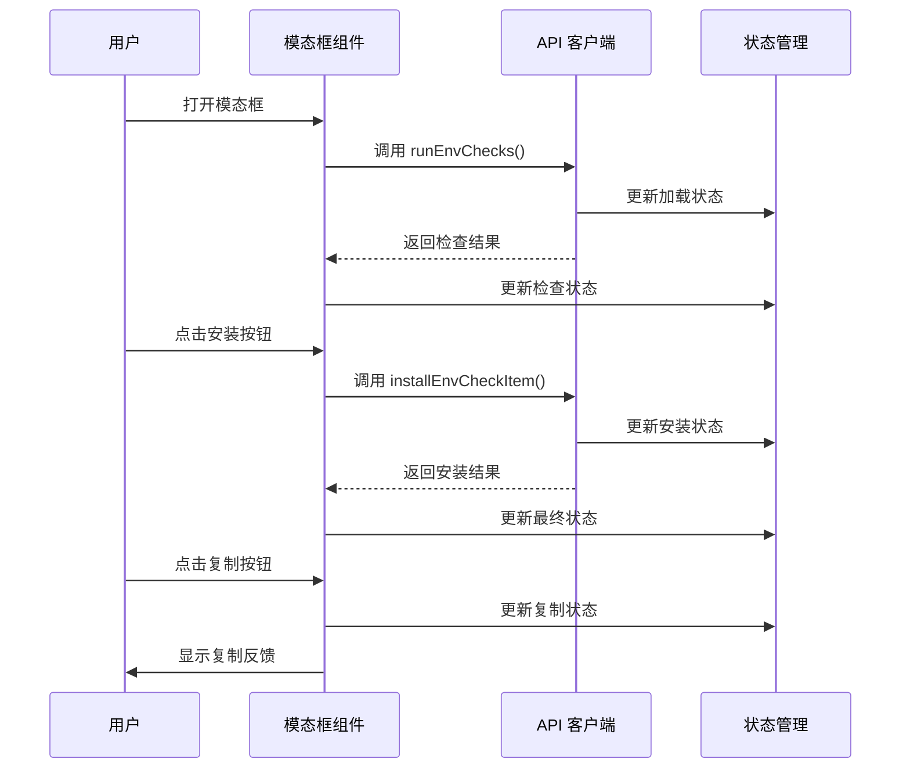
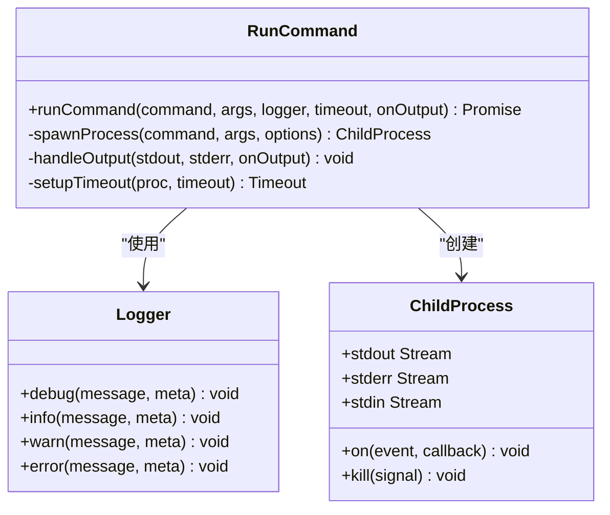
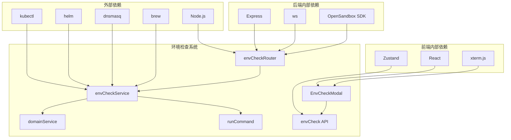

# 环境检查系统

<cite>
**本文档引用的文件**
- [apps/backend/src/routes/envCheck.ts](file://apps/backend/src/routes/envCheck.ts)
- [apps/backend/src/services/envCheckService.ts](file://apps/backend/src/services/envCheckService.ts)
- [apps/backend/src/services/domainService.ts](file://apps/backend/src/services/domainService.ts)
- [apps/backend/src/services/profileService.ts](file://apps/backend/src/services/profileService.ts)
- [apps/backend/src/utils/runCommand.ts](file://apps/backend/src/utils/runCommand.ts)
- [apps/backend/src/server.ts](file://apps/backend/src/server.ts)
- [apps/backend/src/routes/index.ts](file://apps/backend/src/routes/index.ts)
- [apps/frontend/src/components/envcheck/EnvCheckModal.tsx](file://apps/frontend/src/components/envcheck/EnvCheckModal.tsx)
- [apps/frontend/src/api/envCheck.ts](file://apps/frontend/src/api/envCheck.ts)
- [apps/frontend/src/api/types.ts](file://apps/frontend/src/api/types.ts)
- [apps/frontend/src/stores/setupStore.ts](file://apps/frontend/src/stores/setupStore.ts)
- [README.md](file://README.md)
</cite>

## 目录
1. [简介](#简介)
2. [项目结构](#项目结构)
3. [核心组件](#核心组件)
4. [架构概览](#架构概览)
5. [详细组件分析](#详细组件分析)
6. [依赖关系分析](#依赖关系分析)
7. [性能考虑](#性能考虑)
8. [故障排除指南](#故障排除指南)
9. [结论](#结论)

## 简介

环境检查系统是 Sandbox Manager 平台中的一个关键功能模块，负责检测和配置沙箱运行所需的环境依赖。该系统主要检查两个核心组件：Kubernetes Ingress Nginx 控制器和本地 DNS 解析器 dnsmasq，确保用户能够成功访问和管理沙箱环境。

该系统采用前后端分离的架构设计，后端使用 Express.js 提供 REST API 接口，前端使用 React 构建用户界面。系统支持自动检测环境状态、显示详细的诊断信息，并提供一键安装功能来简化环境配置过程。

## 项目结构

环境检查系统位于 Sandbox Manager 项目的完整目录结构中，主要包含以下关键组件：

**图表来源**
- [apps/backend/src/routes/envCheck.ts:1-50](file://apps/backend/src/routes/envCheck.ts#L1-L50)
- [apps/backend/src/services/envCheckService.ts:1-415](file://apps/backend/src/services/envCheckService.ts#L1-L415)
- [apps/frontend/src/components/envcheck/EnvCheckModal.tsx:1-235](file://apps/frontend/src/components/envcheck/EnvCheckModal.tsx#L1-L235)

**章节来源**
- [README.md:114-140](file://README.md#L114-L140)

## 核心组件

环境检查系统由多个相互协作的核心组件构成，每个组件都有明确的职责和功能：

### 后端服务组件

1. **环境检查路由 (envCheckRouter)**: 处理环境检查相关的 HTTP 请求
2. **环境检查服务 (envCheckService)**: 核心业务逻辑，执行具体的检查和安装操作
3. **域名服务 (domainService)**: 管理允许访问的域名配置
4. **命令执行工具 (runCommand)**: 提供安全的命令执行机制

### 前端组件

1. **环境检查模态框**: 用户界面组件，展示检查结果和提供操作选项
2. **API 客户端**: 前端与后端通信的接口封装
3. **类型定义**: TypeScript 类型声明，确保类型安全

**章节来源**
- [apps/backend/src/routes/envCheck.ts:15-49](file://apps/backend/src/routes/envCheck.ts#L15-L49)
- [apps/backend/src/services/envCheckService.ts:6-15](file://apps/backend/src/services/envCheckService.ts#L6-L15)
- [apps/frontend/src/components/envcheck/EnvCheckModal.tsx:28-78](file://apps/frontend/src/components/envcheck/EnvCheckModal.tsx#L28-L78)

## 架构概览

环境检查系统采用分层架构设计，实现了清晰的关注点分离：

**图表来源**
- [apps/backend/src/routes/envCheck.ts:16-49](file://apps/backend/src/routes/envCheck.ts#L16-L49)
- [apps/backend/src/services/envCheckService.ts:45-91](file://apps/backend/src/services/envCheckService.ts#L45-L91)
- [apps/frontend/src/components/envcheck/EnvCheckModal.tsx:35-73](file://apps/frontend/src/components/envcheck/EnvCheckModal.tsx#L35-L73)

## 详细组件分析

### 环境检查服务 (envCheckService)

环境检查服务是系统的核心业务逻辑实现，负责执行具体的环境检查和安装操作：

#### 检查项目结构

**图表来源**
- [apps/backend/src/services/envCheckService.ts:6-15](file://apps/backend/src/services/envCheckService.ts#L6-L15)
- [apps/backend/src/services/envCheckService.ts:17-43](file://apps/backend/src/services/envCheckService.ts#L17-L43)
- [apps/backend/src/services/domainService.ts:5-17](file://apps/backend/src/services/domainService.ts#L5-L17)
- [apps/backend/src/utils/runCommand.ts:7-53](file://apps/backend/src/utils/runCommand.ts#L7-L53)

#### Ingress Nginx 检查流程

**图表来源**
- [apps/backend/src/services/envCheckService.ts:45-91](file://apps/backend/src/services/envCheckService.ts#L45-L91)

#### Dnsmasq 检查流程

**图表来源**
- [apps/backend/src/services/envCheckService.ts:195-297](file://apps/backend/src/services/envCheckService.ts#L195-L297)

**章节来源**
- [apps/backend/src/services/envCheckService.ts:17-43](file://apps/backend/src/services/envCheckService.ts#L17-L43)
- [apps/backend/src/services/envCheckService.ts:45-91](file://apps/backend/src/services/envCheckService.ts#L45-L91)
- [apps/backend/src/services/envCheckService.ts:195-297](file://apps/backend/src/services/envCheckService.ts#L195-L297)

### 前端用户界面组件

前端环境检查模态框提供了直观的用户界面来展示检查结果和操作选项：

#### 界面状态管理

**图表来源**
- [apps/frontend/src/components/envcheck/EnvCheckModal.tsx:97-120](file://apps/frontend/src/components/envcheck/EnvCheckModal.tsx#L97-L120)

#### 用户交互流程

**图表来源**
- [apps/frontend/src/components/envcheck/EnvCheckModal.tsx:35-73](file://apps/frontend/src/components/envcheck/EnvCheckModal.tsx#L35-L73)
- [apps/frontend/src/api/envCheck.ts:4-10](file://apps/frontend/src/api/envCheck.ts#L4-L10)

**章节来源**
- [apps/frontend/src/components/envcheck/EnvCheckModal.tsx:28-78](file://apps/frontend/src/components/envcheck/EnvCheckModal.tsx#L28-L78)
- [apps/frontend/src/api/envCheck.ts:1-11](file://apps/frontend/src/api/envCheck.ts#L1-L11)

### 命令执行工具

命令执行工具提供了安全的系统命令执行机制，支持超时控制和输出监控：

#### 命令执行架构

**图表来源**
- [apps/backend/src/utils/runCommand.ts:7-53](file://apps/backend/src/utils/runCommand.ts#L7-L53)

**章节来源**
- [apps/backend/src/utils/runCommand.ts:1-54](file://apps/backend/src/utils/runCommand.ts#L1-L54)

## 依赖关系分析

环境检查系统的依赖关系体现了清晰的分层架构和模块化设计：

**图表来源**
- [apps/backend/src/server.ts:36-90](file://apps/backend/src/server.ts#L36-L90)
- [apps/backend/src/routes/index.ts:11-19](file://apps/backend/src/routes/index.ts#L11-L19)

### 关键依赖关系

1. **后端服务依赖**: 环境检查服务依赖于域名服务和命令执行工具
2. **前端组件依赖**: 模态框组件依赖于 API 客户端和类型定义
3. **系统依赖**: 需要 kubectl、helm、dnsmasq 等系统工具支持

**章节来源**
- [apps/backend/src/services/envCheckService.ts:1-5](file://apps/backend/src/services/envCheckService.ts#L1-L5)
- [apps/frontend/src/components/envcheck/EnvCheckModal.tsx:1-6](file://apps/frontend/src/components/envcheck/EnvCheckModal.tsx#L1-L6)

## 性能考虑

环境检查系统在设计时充分考虑了性能优化和用户体验：

### 异步操作优化

1. **并发检查**: 系统可以同时执行多个检查任务，提高整体响应速度
2. **超时控制**: 每个命令执行都有合理的超时时间，避免长时间阻塞
3. **渐进式加载**: 前端采用渐进式加载策略，先显示基本信息再加载详细内容

### 内存和资源管理

1. **流式输出**: 命令执行采用流式输出处理，避免大量内存占用
2. **状态缓存**: 前端组件合理缓存检查结果，减少重复请求
3. **资源清理**: 安装过程中及时清理临时资源和错误状态

### 网络优化

1. **批量请求**: 支持一次性获取所有检查结果，减少网络往返
2. **错误重试**: 对于临时性网络错误提供合理的重试机制
3. **连接复用**: 后端使用连接池管理数据库和外部服务连接

## 故障排除指南

环境检查系统提供了完善的错误处理和故障排除机制：

### 常见问题及解决方案

#### Ingress Nginx 安装失败

**问题症状**: 检查结果显示 Ingress Nginx 未安装，安装过程报错

**可能原因**:
1. Helm 仓库访问失败
2. Kubernetes 集群权限不足
3. 网络连接问题
4. 超时设置过短

**解决步骤**:
1. 检查 Helm 仓库连通性
2. 验证 Kubernetes 集群认证配置
3. 增加超时时间重新尝试
4. 查看详细的错误日志

#### Dnsmasq 配置问题

**问题症状**: Dnsmasq 显示已安装但配置不正确

**可能原因**:
1. 域名配置文件写入失败
2. macOS 解析器文件权限问题
3. 服务重启失败
4. DNS 解析测试失败

**解决步骤**:
1. 手动检查配置文件内容
2. 验证 /etc/resolver 目录权限
3. 手动重启 dnsmasq 服务
4. 使用 dig 命令测试 DNS 解析

#### 命令执行超时

**问题症状**: 环境检查或安装过程在中间阶段超时

**可能原因**:
1. 系统负载过高
2. 网络延迟过大
3. 命令执行时间过长
4. 资源限制

**解决步骤**:
1. 检查系统资源使用情况
2. 增加超时时间设置
3. 分析具体卡住的命令
4. 优化系统性能

### 调试和日志

系统提供了多层次的日志记录机制：

1. **前端日志**: 用户界面显示基本的状态信息和错误提示
2. **后端日志**: 详细的服务器端日志记录，包括命令执行输出
3. **系统日志**: 操作系统级别的日志，用于深入调试

**章节来源**
- [apps/backend/src/services/envCheckService.ts:85-88](file://apps/backend/src/services/envCheckService.ts#L85-L88)
- [apps/backend/src/services/envCheckService.ts:291-294](file://apps/backend/src/services/envCheckService.ts#L291-L294)

## 结论

环境检查系统是 Sandbox Manager 平台的重要组成部分，它通过自动化的方式确保用户能够成功配置和使用沙箱环境。系统的设计体现了以下特点：

### 设计优势

1. **模块化架构**: 清晰的分层设计使得各组件职责明确，易于维护和扩展
2. **用户友好**: 直观的界面设计和详细的状态反馈提升了用户体验
3. **安全性**: 严格的权限控制和输入验证确保了系统的安全性
4. **可靠性**: 完善的错误处理和超时机制提高了系统的稳定性

### 技术亮点

1. **异步处理**: 采用异步编程模式，避免阻塞用户界面
2. **类型安全**: 完整的 TypeScript 类型定义确保了代码质量
3. **状态管理**: 合理的状态管理机制保证了数据的一致性
4. **错误恢复**: 提供多种错误恢复策略，提升系统韧性

### 未来改进方向

1. **性能优化**: 可以考虑引入缓存机制进一步提升检查速度
2. **监控集成**: 添加更详细的监控指标和告警机制
3. **国际化**: 支持多语言界面，扩大用户覆盖范围
4. **自动化**: 进一步自动化环境配置过程，减少手动干预

环境检查系统为 Sandbox Manager 平台的成功运行奠定了坚实的基础，通过持续的优化和改进，它将继续为用户提供可靠的环境配置体验。