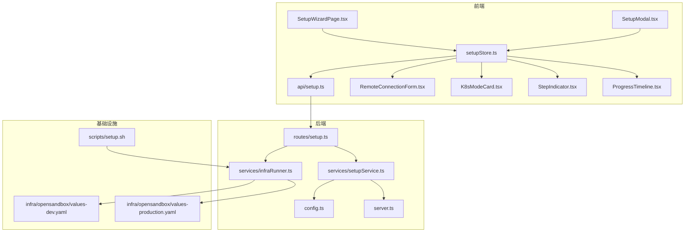
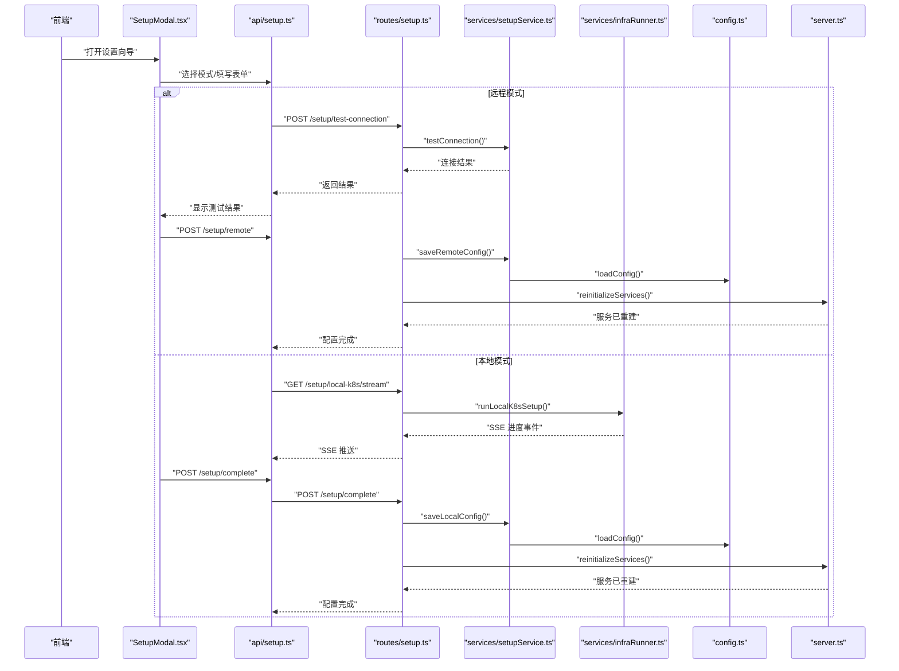
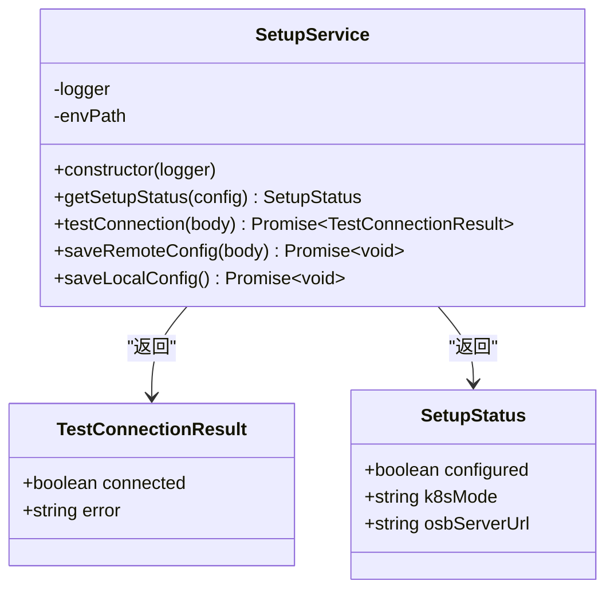
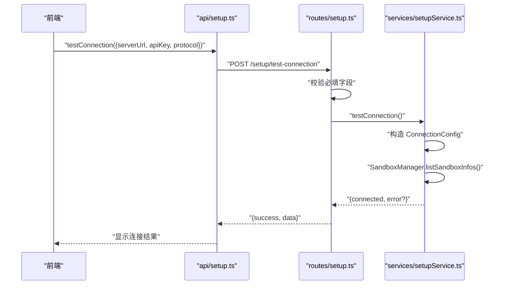
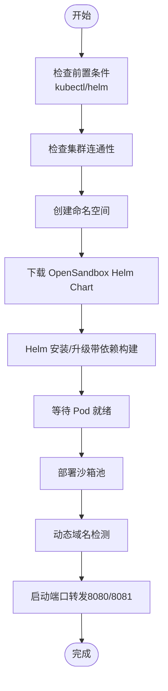
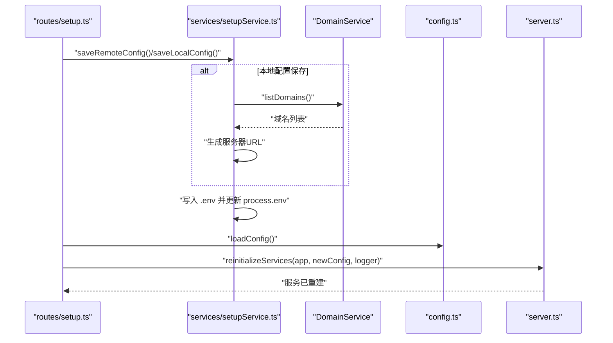
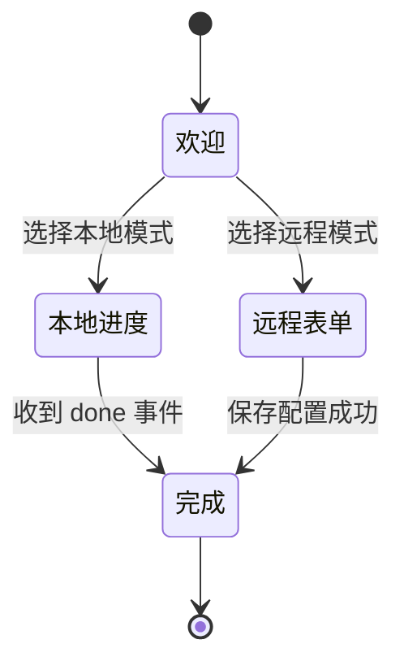
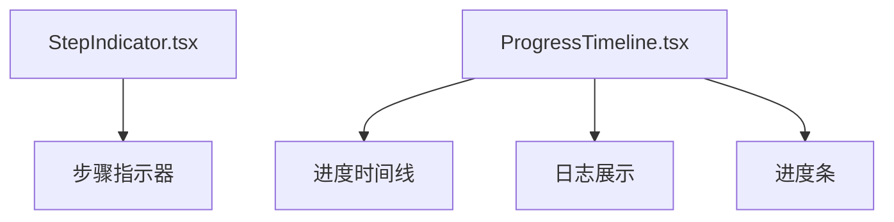
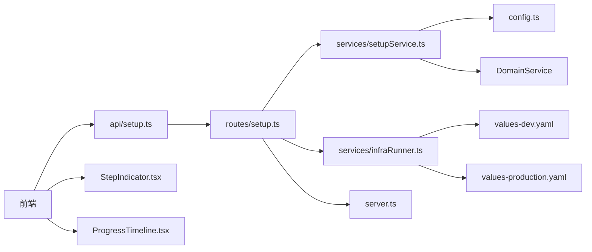

# 设置服务模块

<cite>
**本文引用的文件**
- [apps/backend/src/services/setupService.ts](file://apps/backend/src/services/setupService.ts)
- [apps/backend/src/routes/setup.ts](file://apps/backend/src/routes/setup.ts)
- [apps/backend/src/config.ts](file://apps/backend/src/config.ts)
- [apps/backend/src/services/infraRunner.ts](file://apps/backend/src/services/infraRunner.ts)
- [apps/backend/src/server.ts](file://apps/backend/src/server.ts)
- [apps/frontend/src/pages/SetupWizardPage.tsx](file://apps/frontend/src/pages/SetupWizardPage.tsx)
- [apps/frontend/src/components/setup/SetupModal.tsx](file://apps/frontend/src/components/setup/SetupModal.tsx)
- [apps/frontend/src/stores/setupStore.ts](file://apps/frontend/src/stores/setupStore.ts)
- [apps/frontend/src/api/setup.ts](file://apps/frontend/src/api/setup.ts)
- [apps/frontend/src/components/setup/RemoteConnectionForm.tsx](file://apps/frontend/src/components/setup/RemoteConnectionForm.tsx)
- [apps/frontend/src/components/setup/K8sModeCard.tsx](file://apps/frontend/src/components/setup/K8sModeCard.tsx)
- [apps/frontend/src/components/setup/StepIndicator.tsx](file://apps/frontend/src/components/setup/StepIndicator.tsx)
- [apps/frontend/src/components/setup/ProgressTimeline.tsx](file://apps/frontend/src/components/setup/ProgressTimeline.tsx)
- [apps/frontend/src/api/types.ts](file://apps/frontend/src/api/types.ts)
- [apps/backend/src/types/index.ts](file://apps/backend/src/types/index.ts)
- [infra/opensandbox/values-dev.yaml](file://infra/opensandbox/values-dev.yaml)
- [infra/opensandbox/values-production.yaml](file://infra/opensandbox/values-production.yaml)
- [scripts/setup.sh](file://scripts/setup.sh)
</cite>

## 更新摘要
**所做更改**
- 新增 SetupModal 组件，提供模态框形式的设置向导界面
- 增强设置向导功能，支持 4 步骤的多步骤向导流程
- 改进本地和远程两种设置模式的用户界面
- 新增动态域名检测和配置功能
- 优化健康检查机制和错误处理策略

## 目录
1. [简介](#简介)
2. [项目结构](#项目结构)
3. [核心组件](#核心组件)
4. [架构总览](#架构总览)
5. [详细组件分析](#详细组件分析)
6. [依赖关系分析](#依赖关系分析)
7. [性能考量](#性能考量)
8. [故障排除指南](#故障排除指南)
9. [结论](#结论)
10. [附录](#附录)

## 简介
本技术文档聚焦于 Sandbox Manager 的"设置服务模块"，系统性阐述 SetupService 类的实现细节与工作流，涵盖系统配置验证、OpenSandbox 连接测试、环境变量管理、设置向导的端到端流程（前端状态机、后端路由与 SSE 流）、配置持久化策略、安全注意事项（敏感信息处理、配置加密存储、访问控制），以及配置迁移与故障排除建议。文档以代码级分析为基础，辅以可视化图示，帮助开发者与运维人员快速理解与维护该模块。

**更新** 新增完整的 SetupModal 组件，提供模态框形式的设置向导界面，支持本地和远程两种设置模式，包含 4 个步骤的多步骤向导界面，动态域名检测和配置，以及改进的健康检查机制。

## 项目结构
设置服务模块横跨前后端与基础设施脚本，主要涉及以下文件与职责：
- 后端服务层：SetupService 负责配置读取、连接测试、本地/远程配置保存与 .env 写入；InfraRunner 负责本地 Kubernetes 安装流水线与端口转发；Server 负责服务重建与配置热更新。
- 后端路由层：setup 路由提供状态查询、连接测试、远程配置保存、本地安装 SSE 流与完成步骤等接口。
- 前端页面与状态：SetupWizardPage 和 SetupModal 提供两种设置向导界面；setupStore 维护向导状态与事件流；RemoteConnectionForm 提供远程连接表单与测试按钮；K8sModeCard 选择本地/远程模式；StepIndicator 和 ProgressTimeline 提供步骤指示器和进度时间线。
- 配置与类型：config.ts 定义配置结构与加载逻辑；前端 api/types.ts 定义 Setup 相关类型；values-dev.yaml/values-production.yaml 描述 Helm 值模板。

**图表来源**
- [apps/frontend/src/pages/SetupWizardPage.tsx:20-128](file://apps/frontend/src/pages/SetupWizardPage.tsx#L20-L128)
- [apps/frontend/src/components/setup/SetupModal.tsx:26-166](file://apps/frontend/src/components/setup/SetupModal.tsx#L26-L166)
- [apps/frontend/src/stores/setupStore.ts:41-157](file://apps/frontend/src/stores/setupStore.ts#L41-L157)
- [apps/frontend/src/api/setup.ts:33-73](file://apps/frontend/src/api/setup.ts#L33-L73)
- [apps/frontend/src/components/setup/RemoteConnectionForm.tsx:5-124](file://apps/frontend/src/components/setup/RemoteConnectionForm.tsx#L5-L124)
- [apps/frontend/src/components/setup/K8sModeCard.tsx:11-36](file://apps/frontend/src/components/setup/K8sModeCard.tsx#L11-L36)
- [apps/frontend/src/components/setup/StepIndicator.tsx:6-57](file://apps/frontend/src/components/setup/StepIndicator.tsx#L6-L57)
- [apps/frontend/src/components/setup/ProgressTimeline.tsx:9-92](file://apps/frontend/src/components/setup/ProgressTimeline.tsx#L9-L92)
- [apps/backend/src/routes/setup.ts:17-151](file://apps/backend/src/routes/setup.ts#L17-L151)
- [apps/backend/src/services/setupService.ts:58-152](file://apps/backend/src/services/setupService.ts#L58-L152)
- [apps/backend/src/services/infraRunner.ts:26-538](file://apps/backend/src/services/infraRunner.ts#L26-L538)
- [apps/backend/src/config.ts:48-71](file://apps/backend/src/config.ts#L48-L71)
- [apps/backend/src/server.ts:96-119](file://apps/backend/src/server.ts#L96-L119)
- [infra/opensandbox/values-dev.yaml:1-34](file://infra/opensandbox/values-dev.yaml#L1-L34)
- [infra/opensandbox/values-production.yaml:1-44](file://infra/opensandbox/values-production.yaml#L1-L44)
- [scripts/setup.sh:1-52](file://scripts/setup.sh#L1-L52)

**章节来源**
- [apps/backend/src/routes/setup.ts:17-151](file://apps/backend/src/routes/setup.ts#L17-L151)
- [apps/backend/src/services/setupService.ts:58-152](file://apps/backend/src/services/setupService.ts#L58-L152)
- [apps/backend/src/services/infraRunner.ts:26-538](file://apps/backend/src/services/infraRunner.ts#L26-L538)
- [apps/backend/src/config.ts:48-71](file://apps/backend/src/config.ts#L48-L71)
- [apps/backend/src/server.ts:96-119](file://apps/backend/src/server.ts#L96-L119)
- [apps/frontend/src/pages/SetupWizardPage.tsx:20-128](file://apps/frontend/src/pages/SetupWizardPage.tsx#L20-L128)
- [apps/frontend/src/components/setup/SetupModal.tsx:26-166](file://apps/frontend/src/components/setup/SetupModal.tsx#L26-L166)
- [apps/frontend/src/stores/setupStore.ts:41-157](file://apps/frontend/src/stores/setupStore.ts#L41-L157)
- [apps/frontend/src/api/setup.ts:33-73](file://apps/frontend/src/api/setup.ts#L33-L73)
- [apps/frontend/src/components/setup/RemoteConnectionForm.tsx:5-124](file://apps/frontend/src/components/setup/RemoteConnectionForm.tsx#L5-L124)
- [apps/frontend/src/components/setup/K8sModeCard.tsx:11-36](file://apps/frontend/src/components/setup/K8sModeCard.tsx#L11-L36)
- [apps/frontend/src/components/setup/StepIndicator.tsx:6-57](file://apps/frontend/src/components/setup/StepIndicator.tsx#L6-L57)
- [apps/frontend/src/components/setup/ProgressTimeline.tsx:9-92](file://apps/frontend/src/components/setup/ProgressTimeline.tsx#L9-L92)
- [infra/opensandbox/values-dev.yaml:1-34](file://infra/opensandbox/values-dev.yaml#L1-L34)
- [infra/opensandbox/values-production.yaml:1-44](file://infra/opensandbox/values-production.yaml#L1-L44)
- [scripts/setup.sh:1-52](file://scripts/setup.sh#L1-L52)

## 核心组件
- SetupService：封装配置状态查询、远程连接测试、本地/远程配置写入 .env 与进程环境变量更新。
- InfraRunner：执行本地 Kubernetes 安装流水线，生成进度事件并通过 SSE 推送。
- setup 路由：提供 /setup/status、/setup/test-connection、/setup/remote、/setup/local-k8s/stream、/setup/complete 等端点。
- 前端设置向导：通过 Zustand 状态机驱动，支持远程连接测试、本地安装进度流、完成态跳转。新增 SetupModal 组件提供模态框形式的设置向导。
- 步骤指示器：StepIndicator 组件提供 4 步骤的视觉指示器。
- 进度时间线：ProgressTimeline 组件提供详细的安装进度展示。

关键职责与边界：
- SetupService 仅负责配置持久化与连接测试，不直接处理 UI 逻辑。
- 路由层负责输入校验、并发保护、SSE 事件推送与错误包装。
- 前端负责用户交互、表单校验、实时进度展示与最终完成态。

**章节来源**
- [apps/backend/src/services/setupService.ts:58-152](file://apps/backend/src/services/setupService.ts#L58-L152)
- [apps/backend/src/routes/setup.ts:17-151](file://apps/backend/src/routes/setup.ts#L17-L151)
- [apps/backend/src/services/infraRunner.ts:26-538](file://apps/backend/src/services/infraRunner.ts#L26-L538)
- [apps/frontend/src/stores/setupStore.ts:41-157](file://apps/frontend/src/stores/setupStore.ts#L41-L157)
- [apps/frontend/src/components/setup/SetupModal.tsx:26-166](file://apps/frontend/src/components/setup/SetupModal.tsx#L26-L166)
- [apps/frontend/src/components/setup/StepIndicator.tsx:6-57](file://apps/frontend/src/components/setup/StepIndicator.tsx#L6-L57)
- [apps/frontend/src/components/setup/ProgressTimeline.tsx:9-92](file://apps/frontend/src/components/setup/ProgressTimeline.tsx#L9-L92)

## 架构总览
设置服务模块采用"前端状态机 + 后端路由 + 服务层"的分层设计。远程模式下，前端先进行连接测试，成功后再提交配置；本地模式下，前端通过 SSE 实时接收后端 InfraRunner 的安装进度事件，完成后端保存本地配置并触发服务重建。新增的 SetupModal 组件提供模态框形式的设置向导，增强了用户体验。

**图表来源**
- [apps/frontend/src/components/setup/SetupModal.tsx:26-166](file://apps/frontend/src/components/setup/SetupModal.tsx#L26-L166)
- [apps/frontend/src/api/setup.ts:33-73](file://apps/frontend/src/api/setup.ts#L33-L73)
- [apps/backend/src/routes/setup.ts:25-151](file://apps/backend/src/routes/setup.ts#L25-L151)
- [apps/backend/src/services/setupService.ts:85-152](file://apps/backend/src/services/setupService.ts#L85-L152)
- [apps/backend/src/services/infraRunner.ts:105-138](file://apps/backend/src/services/infraRunner.ts#L105-L138)
- [apps/backend/src/config.ts:48-71](file://apps/backend/src/config.ts#L48-L71)
- [apps/backend/src/server.ts:96-119](file://apps/backend/src/server.ts#L96-L119)

## 详细组件分析

### SetupService 类分析
SetupService 是设置服务的核心，负责：
- 获取当前配置状态：根据配置中的服务器地址与密钥判断是否已配置，并推断本地/远程模式。
- 远程连接测试：基于 OpenSandbox SDK 构造连接配置并尝试列举沙箱信息，捕获异常并返回可读错误。
- 保存远程配置：将服务器地址、API Key、协议写入 .env 并同步更新进程环境变量。
- 保存本地配置：写入本地默认值（动态域名检测、localhost:8080、开发用 API Key、HTTP 协议、禁用代理）并同步更新进程环境变量。

**更新** 新增动态域名检测功能，通过 DomainService 获取可用域名列表，自动生成合适的服务器 URL。

**图表来源**
- [apps/backend/src/services/setupService.ts:58-152](file://apps/backend/src/services/setupService.ts#L58-L152)

实现要点与复杂度：
- 状态查询：O(1)，字符串包含判断。
- 连接测试：一次远端 API 调用，时间取决于网络与远端响应。
- 写 .env：按行扫描与覆盖，最坏 O(n) 行数；追加新键 O(k) 键数。
- 进程环境变量更新：O(1) 次赋值。

错误处理与边界：
- 连接测试失败会记录警告日志并返回错误消息，便于前端展示。
- 写 .env 保留注释与空行，仅更新匹配键或追加新键，避免破坏现有配置。

**章节来源**
- [apps/backend/src/services/setupService.ts:58-152](file://apps/backend/src/services/setupService.ts#L58-L152)

### 远程连接测试流程
远程连接测试在后端路由中进行参数校验，随后调用 SetupService 的 testConnection 方法。该方法使用 OpenSandbox SDK 创建连接配置并尝试列举沙箱信息，捕获异常并返回统一格式的结果对象。

**图表来源**
- [apps/frontend/src/api/setup.ts:17-19](file://apps/frontend/src/api/setup.ts#L17-L19)
- [apps/backend/src/routes/setup.ts:27-45](file://apps/backend/src/routes/setup.ts#L27-L45)
- [apps/backend/src/services/setupService.ts:83-104](file://apps/backend/src/services/setupService.ts#L83-L104)

**章节来源**
- [apps/backend/src/routes/setup.ts:27-45](file://apps/backend/src/routes/setup.ts#L27-L45)
- [apps/backend/src/services/setupService.ts:83-104](file://apps/backend/src/services/setupService.ts#L83-L104)

### 本地 Kubernetes 安装流水线（SSE）
本地安装通过 InfraRunner 执行一系列步骤（前置检查、集群连通性、命名空间、下载 Helm Chart、Helm 安装/升级、等待 Pod 就绪、部署沙箱池、启动端口转发），并将每一步的状态与输出通过 SSE 推送给前端。前端使用 setupStore 订阅事件并在完成时调用完成接口保存本地配置并重建服务。

**更新** 新增动态域名检测功能，在保存本地配置时自动检测可用域名并生成相应的服务器 URL。

**图表来源**
- [apps/backend/src/services/infraRunner.ts:140-538](file://apps/backend/src/services/infraRunner.ts#L140-L538)
- [apps/backend/src/services/setupService.ts:126-150](file://apps/backend/src/services/setupService.ts#L126-L150)

**章节来源**
- [apps/backend/src/services/infraRunner.ts:105-138](file://apps/backend/src/services/infraRunner.ts#L105-L138)
- [apps/backend/src/routes/setup.ts:75-151](file://apps/backend/src/routes/setup.ts#L75-L151)
- [apps/frontend/src/stores/setupStore.ts:61-157](file://apps/frontend/src/stores/setupStore.ts#L61-L157)

### 配置持久化与服务重建
- 远程配置保存：SetupService 将服务器地址、API Key、协议写入 .env 并同步更新进程环境变量；随后路由层重新加载配置并重建服务。
- 本地配置保存：在本地安装完成后，保存本地默认值（包含动态域名检测）并重建服务。
- 服务重建：server.ts 中的 reinitializeServices 会释放旧服务并创建新服务实例，确保新配置生效。

**更新** 本地配置保存时集成动态域名检测，通过 DomainService 获取可用域名列表，自动生成合适的服务器 URL。

**图表来源**
- [apps/backend/src/services/setupService.ts:106-150](file://apps/backend/src/services/setupService.ts#L106-L150)
- [apps/backend/src/routes/setup.ts:47-151](file://apps/backend/src/routes/setup.ts#L47-L151)
- [apps/backend/src/config.ts:48-71](file://apps/backend/src/config.ts#L48-L71)
- [apps/backend/src/server.ts:96-119](file://apps/backend/src/server.ts#L96-L119)

**章节来源**
- [apps/backend/src/services/setupService.ts:106-150](file://apps/backend/src/services/setupService.ts#L106-L150)
- [apps/backend/src/routes/setup.ts:47-151](file://apps/backend/src/routes/setup.ts#L47-L151)
- [apps/backend/src/server.ts:96-119](file://apps/backend/src/server.ts#L96-L119)

### 前端设置向导与状态机
前端通过 setupStore 维护向导步骤、进度事件、整体进度与错误状态。新增的 SetupModal 组件提供模态框形式的设置向导，支持键盘事件处理（ESC 键阻止安装期间关闭）。RemoteConnectionForm 提供协议切换、URL 与 API Key 输入、连接测试与提交按钮。SetupWizardPage 提供完整的设置向导页面。StepIndicator 和 ProgressTimeline 提供步骤指示器和进度时间线。

**更新** 新增 SetupModal 组件，提供模态框形式的设置向导界面，支持 ESC 键处理和安装过程中的交互保护。

**图表来源**
- [apps/frontend/src/pages/SetupWizardPage.tsx:20-128](file://apps/frontend/src/pages/SetupWizardPage.tsx#L20-L128)
- [apps/frontend/src/components/setup/SetupModal.tsx:26-166](file://apps/frontend/src/components/setup/SetupModal.tsx#L26-L166)
- [apps/frontend/src/stores/setupStore.ts:41-157](file://apps/frontend/src/stores/setupStore.ts#L41-L157)
- [apps/frontend/src/components/setup/RemoteConnectionForm.tsx:5-124](file://apps/frontend/src/components/setup/RemoteConnectionForm.tsx#L5-L124)
- [apps/frontend/src/components/setup/StepIndicator.tsx:6-57](file://apps/frontend/src/components/setup/StepIndicator.tsx#L6-L57)
- [apps/frontend/src/components/setup/ProgressTimeline.tsx:9-92](file://apps/frontend/src/components/setup/ProgressTimeline.tsx#L9-L92)

**章节来源**
- [apps/frontend/src/pages/SetupWizardPage.tsx:20-128](file://apps/frontend/src/pages/SetupWizardPage.tsx#L20-L128)
- [apps/frontend/src/components/setup/SetupModal.tsx:26-166](file://apps/frontend/src/components/setup/SetupModal.tsx#L26-L166)
- [apps/frontend/src/stores/setupStore.ts:41-157](file://apps/frontend/src/stores/setupStore.ts#L41-L157)
- [apps/frontend/src/components/setup/RemoteConnectionForm.tsx:5-124](file://apps/frontend/src/components/setup/RemoteConnectionForm.tsx#L5-L124)
- [apps/frontend/src/components/setup/StepIndicator.tsx:6-57](file://apps/frontend/src/components/setup/StepIndicator.tsx#L6-L57)
- [apps/frontend/src/components/setup/ProgressTimeline.tsx:9-92](file://apps/frontend/src/components/setup/ProgressTimeline.tsx#L9-L92)

### 步骤指示器与进度展示
新增的 StepIndicator 组件提供 4 步骤的视觉指示器，支持完成、当前和未完成状态的不同样式。ProgressTimeline 组件提供详细的安装进度展示，包括整体进度条、步骤状态图标、输出日志展开/收起功能。

**更新** 新增 StepIndicator 和 ProgressTimeline 组件，提供更直观的设置向导进度展示。

**图表来源**
- [apps/frontend/src/components/setup/StepIndicator.tsx:6-57](file://apps/frontend/src/components/setup/StepIndicator.tsx#L6-L57)
- [apps/frontend/src/components/setup/ProgressTimeline.tsx:9-92](file://apps/frontend/src/components/setup/ProgressTimeline.tsx#L9-L92)

**章节来源**
- [apps/frontend/src/components/setup/StepIndicator.tsx:6-57](file://apps/frontend/src/components/setup/StepIndicator.tsx#L6-L57)
- [apps/frontend/src/components/setup/ProgressTimeline.tsx:9-92](file://apps/frontend/src/components/setup/ProgressTimeline.tsx#L9-L92)

## 依赖关系分析
- SetupService 依赖 OpenSandbox SDK（SandboxManager、ConnectionConfig）与 Node 文件系统能力，新增依赖 DomainService 进行动态域名检测。
- 路由层依赖 SetupService 与 InfraRunner，并在本地模式下使用 SSE。
- 前端依赖 setupStore 与 api/setup.ts，后者封装了对后端 REST 与 SSE 的调用，新增依赖 StepIndicator 和 ProgressTimeline 组件。
- 配置加载依赖 process.env，config.ts 在缺失或非法环境变量时抛出错误，确保运行期一致性。
- 服务重建依赖 server.ts 的 reinitializeServices，保证配置变更后服务可用。

**图表来源**
- [apps/frontend/src/api/setup.ts:1-73](file://apps/frontend/src/api/setup.ts#L1-L73)
- [apps/backend/src/routes/setup.ts:1-151](file://apps/backend/src/routes/setup.ts#L1-L151)
- [apps/backend/src/services/setupService.ts:1-152](file://apps/backend/src/services/setupService.ts#L1-L152)
- [apps/backend/src/services/infraRunner.ts:1-538](file://apps/backend/src/services/infraRunner.ts#L1-L538)
- [apps/backend/src/config.ts:1-71](file://apps/backend/src/config.ts#L1-L71)
- [apps/backend/src/server.ts:1-119](file://apps/backend/src/server.ts#L1-L119)
- [apps/frontend/src/components/setup/StepIndicator.tsx:1-57](file://apps/frontend/src/components/setup/StepIndicator.tsx#L1-L57)
- [apps/frontend/src/components/setup/ProgressTimeline.tsx:1-92](file://apps/frontend/src/components/setup/ProgressTimeline.tsx#L1-L92)
- [infra/opensandbox/values-dev.yaml:1-34](file://infra/opensandbox/values-dev.yaml#L1-L34)
- [infra/opensandbox/values-production.yaml:1-44](file://infra/opensandbox/values-production.yaml#L1-L44)

**章节来源**
- [apps/backend/src/config.ts:32-71](file://apps/backend/src/config.ts#L32-L71)
- [apps/backend/src/server.ts:96-119](file://apps/backend/src/server.ts#L96-L119)

## 性能考量
- 连接测试超时：SetupService 使用较短请求超时（10 秒），避免阻塞前端交互。
- Helm 安装耗时：本地安装包含 Chart 下载、依赖构建与 Helm 安装/升级，总耗时较长，需通过 SSE 提供实时反馈。
- 端口转发稳定性：InfraRunner 对端口转发进程进行监控与自动重启，提升本地体验。
- 动态域名检测：DomainService 的域名检测操作相对轻量，不会显著影响整体性能。
- 日志与可观测性：路由层与服务层均记录关键事件，便于定位问题。

## 故障排除指南
常见问题与排查步骤：
- 远程连接失败
  - 检查 serverUrl 与 protocol 是否正确，确认 API Key 有效。
  - 查看后端日志中的连接测试错误信息。
  - 参考路径：[apps/backend/src/services/setupService.ts:83-104](file://apps/backend/src/services/setupService.ts#L83-L104)
- 本地安装卡住
  - 查看 SSE 事件流中的具体步骤与输出，定位失败阶段。
  - 确认 kubectl 与 helm 已正确安装且版本兼容。
  - 检查动态域名检测是否正常工作。
  - 参考路径：[apps/backend/src/services/infraRunner.ts:140-538](file://apps/backend/src/services/infraRunner.ts#L140-L538)
- 配置未生效
  - 确认 .env 已写入并 process.env 已更新。
  - 检查动态域名检测生成的服务器 URL 是否正确。
  - 触发服务重建，确保新配置被加载。
  - 参考路径：[apps/backend/src/services/setupService.ts:106-150](file://apps/backend/src/services/setupService.ts#L106-L150)、[apps/backend/src/server.ts:96-119](file://apps/backend/src/server.ts#L96-L119)
- 设置向导界面问题
  - 检查 SetupModal 的 ESC 键处理是否正常。
  - 确认步骤指示器和进度时间线组件正常渲染。
  - 参考路径：[apps/frontend/src/components/setup/SetupModal.tsx:37-47](file://apps/frontend/src/components/setup/SetupModal.tsx#L37-L47)、[apps/frontend/src/components/setup/StepIndicator.tsx:6-57](file://apps/frontend/src/components/setup/StepIndicator.tsx#L6-L57)
- 开发环境端口转发
  - 使用脚本启动端口转发，避免手动操作遗漏。
  - 参考路径：[scripts/setup.sh:32-41](file://scripts/setup.sh#L32-L41)

**章节来源**
- [apps/backend/src/services/setupService.ts:83-150](file://apps/backend/src/services/setupService.ts#L83-L150)
- [apps/backend/src/services/infraRunner.ts:140-538](file://apps/backend/src/services/infraRunner.ts#L140-L538)
- [apps/backend/src/server.ts:96-119](file://apps/backend/src/server.ts#L96-L119)
- [apps/frontend/src/components/setup/SetupModal.tsx:37-47](file://apps/frontend/src/components/setup/SetupModal.tsx#L37-L47)
- [apps/frontend/src/components/setup/StepIndicator.tsx:6-57](file://apps/frontend/src/components/setup/StepIndicator.tsx#L6-L57)
- [scripts/setup.sh:32-41](file://scripts/setup.sh#L32-L41)

## 结论
设置服务模块通过清晰的分层设计与完善的错误处理，提供了从远程连接测试到本地 Kubernetes 安装的完整配置体验。新增的 SetupModal 组件进一步提升了用户体验，支持模态框形式的设置向导和键盘事件处理。SetupService 专注于配置持久化与连接验证，InfraRunner 负责复杂的本地安装流程并通过 SSE 提供实时反馈，前端通过状态机与表单组件优化用户体验。结合配置热重建、动态域名检测与日志记录，系统在功能完整性与可维护性方面表现良好。

## 附录

### 配置管理与安全考虑
- 敏感信息处理
  - API Key 通过后端路由与 SetupService 写入 .env 并同步更新进程环境变量，避免在前端持久化敏感数据。
  - 连接测试与保存均在后端执行，减少敏感信息泄露风险。
  - 参考路径：[apps/backend/src/services/setupService.ts:106-150](file://apps/backend/src/services/setupService.ts#L106-L150)
- 配置加密存储
  - 当前实现未内置加密存储；建议在生产环境中引入密钥管理服务（如 KMS 或 Vault）对敏感配置进行加密存储与解密加载。
- 访问控制机制
  - 后端路由层对设置相关接口进行必要的输入校验与并发控制（如本地安装的互斥标志），防止重复或冲突操作。
  - SetupModal 组件提供 ESC 键处理，防止在安装过程中意外关闭。
  - 参考路径：[apps/backend/src/routes/setup.ts:11-14](file://apps/backend/src/routes/setup.ts#L11-L14)、[apps/frontend/src/components/setup/SetupModal.tsx:37-47](file://apps/frontend/src/components/setup/SetupModal.tsx#L37-L47)

**章节来源**
- [apps/backend/src/services/setupService.ts:106-150](file://apps/backend/src/services/setupService.ts#L106-L150)
- [apps/backend/src/routes/setup.ts:11-14](file://apps/backend/src/routes/setup.ts#L11-L14)
- [apps/frontend/src/components/setup/SetupModal.tsx:37-47](file://apps/frontend/src/components/setup/SetupModal.tsx#L37-L47)

### 配置迁移指南
- 从远程迁移到本地
  - 先在远程模式下完成连接测试与配置保存，再通过本地安装流程完成迁移。
  - 参考路径：[apps/backend/src/routes/setup.ts:27-45](file://apps/backend/src/routes/setup.ts#L27-L45)、[apps/backend/src/routes/setup.ts:123-151](file://apps/backend/src/routes/setup.ts#L123-L151)
- 从本地迁移到远程
  - 本地安装完成后，使用远程连接测试与保存接口切换到远程模式。
  - 参考路径：[apps/frontend/src/components/setup/RemoteConnectionForm.tsx:5-124](file://apps/frontend/src/components/setup/RemoteConnectionForm.tsx#L5-L124)、[apps/backend/src/routes/setup.ts:47-73](file://apps/backend/src/routes/setup.ts#L47-L73)
- 动态域名检测配置
  - 系统会自动检测可用域名并生成服务器 URL，无需手动配置。
  - 参考路径：[apps/backend/src/services/setupService.ts:126-150](file://apps/backend/src/services/setupService.ts#L126-L150)
- 生产环境 Helm 值调整
  - 根据生产环境需求修改 values-production.yaml，启用网关模式与安全运行时等特性。
  - 参考路径：[infra/opensandbox/values-production.yaml:1-44](file://infra/opensandbox/values-production.yaml#L1-L44)

**章节来源**
- [apps/backend/src/routes/setup.ts:27-45](file://apps/backend/src/routes/setup.ts#L27-L45)
- [apps/backend/src/routes/setup.ts:123-151](file://apps/backend/src/routes/setup.ts#L123-L151)
- [apps/frontend/src/components/setup/RemoteConnectionForm.tsx:5-124](file://apps/frontend/src/components/setup/RemoteConnectionForm.tsx#L5-L124)
- [apps/backend/src/services/setupService.ts:126-150](file://apps/backend/src/services/setupService.ts#L126-L150)
- [infra/opensandbox/values-production.yaml:1-44](file://infra/opensandbox/values-production.yaml#L1-L44)

### API 定义与类型参考
- Setup 相关类型定义
  - SetupStatus、TestConnectionBody、TestConnectionResult、SetupProgressEvent 等类型在前端与后端均有对应声明，确保前后端一致。
  - 新增 SetupProgressEvent 类型，包含步骤标识、标签、状态、输出和进度信息。
  - 参考路径：[apps/frontend/src/api/types.ts:73-157](file://apps/frontend/src/api/types.ts#L73-L157)、[apps/backend/src/types/index.ts:1-11](file://apps/backend/src/types/index.ts#L1-L11)
- 响应体结构
  - 统一的 ApiResponse 包裹 success、data 与 error 字段，便于前端统一处理。
  - 参考路径：[apps/backend/src/types/index.ts:3-11](file://apps/backend/src/types/index.ts#L3-L11)
- 设置向导状态
  - WizardStep 类型定义了完整的设置向导步骤流程。
  - 参考路径：[apps/frontend/src/stores/setupStore.ts:13](file://apps/frontend/src/stores/setupStore.ts#L13)

**章节来源**
- [apps/frontend/src/api/types.ts:73-157](file://apps/frontend/src/api/types.ts#L73-L157)
- [apps/backend/src/types/index.ts:3-11](file://apps/backend/src/types/index.ts#L3-L11)
- [apps/frontend/src/stores/setupStore.ts:13](file://apps/frontend/src/stores/setupStore.ts#L13)

### 新增组件功能说明
- SetupModal 组件
  - 提供模态框形式的设置向导界面，支持 ESC 键处理和安装过程中的交互保护。
  - 集成步骤指示器、进度时间线和完成状态展示。
  - 参考路径：[apps/frontend/src/components/setup/SetupModal.tsx:26-166](file://apps/frontend/src/components/setup/SetupModal.tsx#L26-L166)
- StepIndicator 组件
  - 提供 4 步骤的视觉指示器，支持完成、当前和未完成状态的不同样式。
  - 参考路径：[apps/frontend/src/components/setup/StepIndicator.tsx:6-57](file://apps/frontend/src/components/setup/StepIndicator.tsx#L6-L57)
- ProgressTimeline 组件
  - 提供详细的安装进度展示，包括整体进度条、步骤状态图标、输出日志展开/收起功能。
  - 参考路径：[apps/frontend/src/components/setup/ProgressTimeline.tsx:9-92](file://apps/frontend/src/components/setup/ProgressTimeline.tsx#L9-L92)

**章节来源**
- [apps/frontend/src/components/setup/SetupModal.tsx:26-166](file://apps/frontend/src/components/setup/SetupModal.tsx#L26-L166)
- [apps/frontend/src/components/setup/StepIndicator.tsx:6-57](file://apps/frontend/src/components/setup/StepIndicator.tsx#L6-L57)
- [apps/frontend/src/components/setup/ProgressTimeline.tsx:9-92](file://apps/frontend/src/components/setup/ProgressTimeline.tsx#L9-L92)