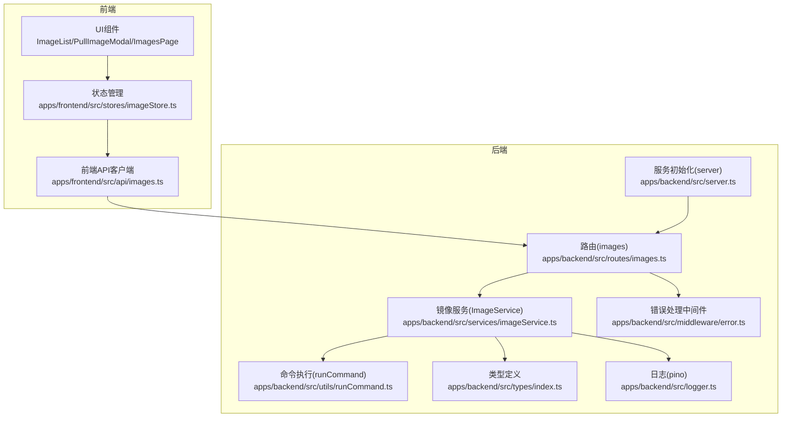
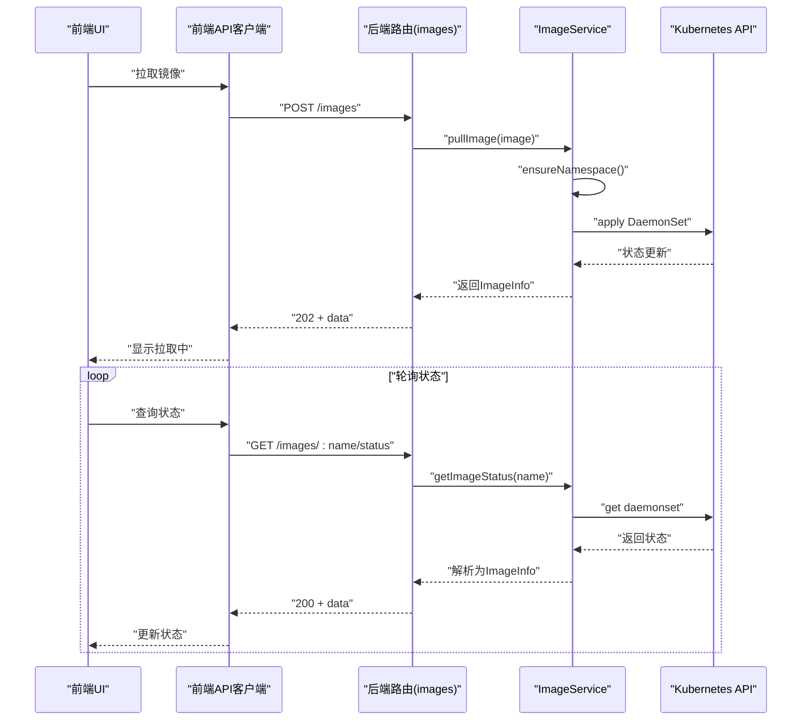
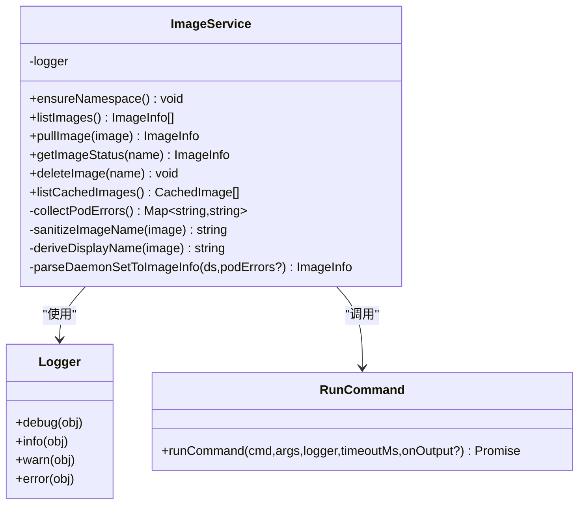
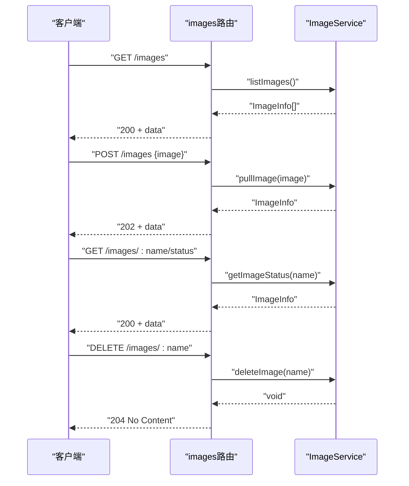
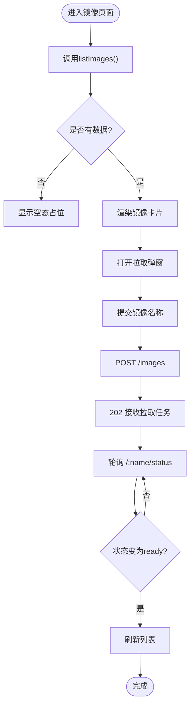
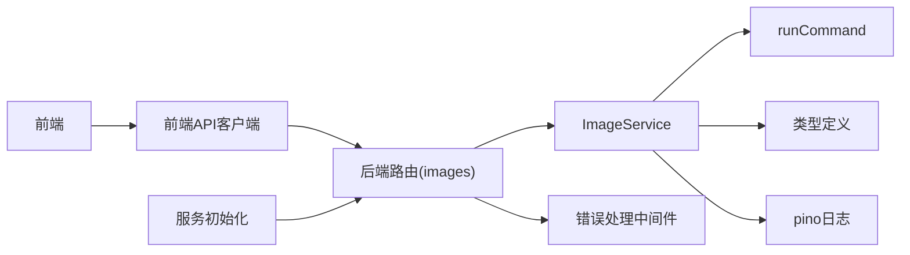

# 镜像服务模块

<cite>
**本文引用的文件**
- [apps/backend/src/services/imageService.ts](file://apps/backend/src/services/imageService.ts)
- [apps/backend/src/routes/images.ts](file://apps/backend/src/routes/images.ts)
- [apps/backend/src/types/index.ts](file://apps/backend/src/types/index.ts)
- [apps/backend/src/utils/runCommand.ts](file://apps/backend/src/utils/runCommand.ts)
- [apps/backend/src/logger.ts](file://apps/backend/src/logger.ts)
- [apps/backend/src/server.ts](file://apps/backend/src/server.ts)
- [apps/backend/src/middleware/error.ts](file://apps/backend/src/middleware/error.ts)
- [apps/frontend/src/api/images.ts](file://apps/frontend/src/api/images.ts)
- [apps/frontend/src/stores/imageStore.ts](file://apps/frontend/src/stores/imageStore.ts)
- [apps/frontend/src/components/images/ImageList.tsx](file://apps/frontend/src/components/images/ImageList.tsx)
- [apps/frontend/src/components/images/PullImageModal.tsx](file://apps/frontend/src/components/images/PullImageModal.tsx)
- [apps/frontend/src/pages/ImagesPage.tsx](file://apps/frontend/src/pages/ImagesPage.tsx)
- [README.md](file://README.md)
</cite>

## 目录
1. [简介](#简介)
2. [项目结构](#项目结构)
3. [核心组件](#核心组件)
4. [架构总览](#架构总览)
5. [详细组件分析](#详细组件分析)
6. [依赖关系分析](#依赖关系分析)
7. [性能考虑](#性能考虑)
8. [故障排查指南](#故障排查指南)
9. [结论](#结论)
10. [附录](#附录)

## 简介
本文件面向Sandbox Manager的镜像服务模块，聚焦于后端ImageService类的实现与前后端协作流程，涵盖镜像列表获取、镜像拉取、镜像删除、状态查询、缓存镜像查看等能力。文档同时解释与OpenSandbox镜像管理API的交互方式（通过Kubernetes DaemonSet预拉取镜像）、认证机制、API调用参数与响应处理，并给出镜像命名规范、版本控制策略、存储优化建议、安全扫描建议以及存储空间管理方案。

## 项目结构
镜像服务模块横跨后端Express路由、服务层、工具层与前端API客户端、状态管理与UI组件：

- 后端
  - 路由：/images 相关REST接口
  - 服务：ImageService（封装镜像生命周期管理）
  - 工具：runCommand（执行kubectl命令）
  - 类型：ImageInfo、CachedImage等
  - 日志：pino日志
  - 错误处理：统一中间件
  - 服务注入：server.ts中将ImageService注入到全局上下文
- 前端
  - API客户端：封装对后端/images接口的请求
  - 状态管理：Zustand store维护镜像列表、拉取状态与错误
  - UI组件：镜像列表、拉取镜像弹窗、页面容器

图表来源
- [apps/backend/src/routes/images.ts:1-78](file://apps/backend/src/routes/images.ts#L1-L78)
- [apps/backend/src/services/imageService.ts:1-386](file://apps/backend/src/services/imageService.ts#L1-L386)
- [apps/backend/src/utils/runCommand.ts:1-54](file://apps/backend/src/utils/runCommand.ts#L1-L54)
- [apps/backend/src/types/index.ts:67-89](file://apps/backend/src/types/index.ts#L67-L89)
- [apps/backend/src/logger.ts:1-17](file://apps/backend/src/logger.ts#L1-L17)
- [apps/backend/src/middleware/error.ts:1-48](file://apps/backend/src/middleware/error.ts#L1-L48)
- [apps/backend/src/server.ts:36-90](file://apps/backend/src/server.ts#L36-L90)
- [apps/frontend/src/api/images.ts:1-23](file://apps/frontend/src/api/images.ts#L1-L23)
- [apps/frontend/src/stores/imageStore.ts:1-60](file://apps/frontend/src/stores/imageStore.ts#L1-L60)
- [apps/frontend/src/components/images/ImageList.tsx:1-51](file://apps/frontend/src/components/images/ImageList.tsx#L1-L51)
- [apps/frontend/src/components/images/PullImageModal.tsx:1-99](file://apps/frontend/src/components/images/PullImageModal.tsx#L1-L99)
- [apps/frontend/src/pages/ImagesPage.tsx:1-43](file://apps/frontend/src/pages/ImagesPage.tsx#L1-L43)

章节来源
- [apps/backend/src/routes/images.ts:1-78](file://apps/backend/src/routes/images.ts#L1-L78)
- [apps/backend/src/services/imageService.ts:1-386](file://apps/backend/src/services/imageService.ts#L1-L386)
- [apps/backend/src/utils/runCommand.ts:1-54](file://apps/backend/src/utils/runCommand.ts#L1-L54)
- [apps/backend/src/types/index.ts:67-89](file://apps/backend/src/types/index.ts#L67-L89)
- [apps/backend/src/logger.ts:1-17](file://apps/backend/src/logger.ts#L1-L17)
- [apps/backend/src/middleware/error.ts:1-48](file://apps/backend/src/middleware/error.ts#L1-L48)
- [apps/backend/src/server.ts:36-90](file://apps/backend/src/server.ts#L36-L90)
- [apps/frontend/src/api/images.ts:1-23](file://apps/frontend/src/api/images.ts#L1-L23)
- [apps/frontend/src/stores/imageStore.ts:1-60](file://apps/frontend/src/stores/imageStore.ts#L1-L60)
- [apps/frontend/src/components/images/ImageList.tsx:1-51](file://apps/frontend/src/components/images/ImageList.tsx#L1-L51)
- [apps/frontend/src/components/images/PullImageModal.tsx:1-99](file://apps/frontend/src/components/images/PullImageModal.tsx#L1-L99)
- [apps/frontend/src/pages/ImagesPage.tsx:1-43](file://apps/frontend/src/pages/ImagesPage.tsx#L1-L43)

## 核心组件
- ImageService：负责命名空间确保、镜像列表获取、镜像拉取（创建DaemonSet）、镜像状态查询、镜像删除、节点缓存镜像列表等。
- images路由：提供REST接口，将请求转发至ImageService并返回标准响应格式。
- 前端API与状态管理：封装请求、维护加载/错误状态、刷新镜像状态。
- 类型系统：统一的响应体结构、镜像信息结构、缓存镜像结构。

章节来源
- [apps/backend/src/services/imageService.ts:95-386](file://apps/backend/src/services/imageService.ts#L95-L386)
- [apps/backend/src/routes/images.ts:1-78](file://apps/backend/src/routes/images.ts#L1-L78)
- [apps/backend/src/types/index.ts:3-11](file://apps/backend/src/types/index.ts#L3-L11)
- [apps/frontend/src/api/images.ts:1-23](file://apps/frontend/src/api/images.ts#L1-L23)
- [apps/frontend/src/stores/imageStore.ts:1-60](file://apps/frontend/src/stores/imageStore.ts#L1-L60)

## 架构总览
镜像服务采用“后端服务 + Kubernetes DaemonSet”的模式实现镜像预拉取。后端通过kubectl命令行与集群交互，前端通过REST接口进行管理操作。

图表来源
- [apps/backend/src/routes/images.ts:36-65](file://apps/backend/src/routes/images.ts#L36-L65)
- [apps/backend/src/services/imageService.ts:227-317](file://apps/backend/src/services/imageService.ts#L227-L317)
- [apps/frontend/src/api/images.ts:8-14](file://apps/frontend/src/api/images.ts#L8-L14)

## 详细组件分析

### ImageService类
- 命名空间与标签
  - 使用固定命名空间与受控标签，便于识别与清理。
- 镜像名称规范化
  - sanitizeImageName：将镜像引用转换为有效的K8s资源名；deriveDisplayName：提取显示名。
- Pod错误收集
  - collectPodErrors：从init容器与普通容器的等待原因中提取错误，用于丰富状态信息。
- 解析DaemonSet为镜像信息
  - parseDaemonSetToImageInfo：根据Desired/Ready/Unavailable与条件消息推断状态，必要时结合Pod错误。
- 核心方法
  - ensureNamespace：确保命名空间存在。
  - listImages：列出受控的DaemonSet并解析为镜像信息。
  - pullImage：生成DaemonSet清单并apply，返回初始状态。
  - getImageStatus：按名称查询DaemonSet并解析状态。
  - deleteImage：删除指定的DaemonSet。
  - listCachedImages：遍历节点镜像列表，聚合缓存镜像信息。

图表来源
- [apps/backend/src/services/imageService.ts:95-386](file://apps/backend/src/services/imageService.ts#L95-L386)
- [apps/backend/src/logger.ts:1-17](file://apps/backend/src/logger.ts#L1-L17)
- [apps/backend/src/utils/runCommand.ts:7-53](file://apps/backend/src/utils/runCommand.ts#L7-L53)

章节来源
- [apps/backend/src/services/imageService.ts:12-93](file://apps/backend/src/services/imageService.ts#L12-L93)
- [apps/backend/src/services/imageService.ts:105-116](file://apps/backend/src/services/imageService.ts#L105-L116)
- [apps/backend/src/services/imageService.ts:196-222](file://apps/backend/src/services/imageService.ts#L196-L222)
- [apps/backend/src/services/imageService.ts:227-294](file://apps/backend/src/services/imageService.ts#L227-L294)
- [apps/backend/src/services/imageService.ts:299-317](file://apps/backend/src/services/imageService.ts#L299-L317)
- [apps/backend/src/services/imageService.ts:322-339](file://apps/backend/src/services/imageService.ts#L322-L339)
- [apps/backend/src/services/imageService.ts:344-384](file://apps/backend/src/services/imageService.ts#L344-L384)

### 路由与API交互
- GET /images：返回已预拉取的镜像列表。
- POST /images：提交镜像名称，触发拉取（返回202）。
- GET /images/:name/status：查询指定镜像的拉取状态。
- DELETE /images/:name：删除指定镜像的DaemonSet。
- GET /images/cached：返回节点侧缓存的镜像列表。

图表来源
- [apps/backend/src/routes/images.ts:14-77](file://apps/backend/src/routes/images.ts#L14-L77)
- [apps/backend/src/services/imageService.ts:196-339](file://apps/backend/src/services/imageService.ts#L196-L339)

章节来源
- [apps/backend/src/routes/images.ts:1-78](file://apps/backend/src/routes/images.ts#L1-L78)

### 前端集成
- API客户端：封装对后端/images接口的请求，返回Promise。
- 状态管理：Zustand store维护镜像列表、加载与错误状态，支持拉取、删除、刷新状态。
- UI组件：镜像列表展示、拉取镜像弹窗（含预设镜像与自定义输入）、页面容器。

图表来源
- [apps/frontend/src/pages/ImagesPage.tsx:9-42](file://apps/frontend/src/pages/ImagesPage.tsx#L9-L42)
- [apps/frontend/src/components/images/ImageList.tsx:4-50](file://apps/frontend/src/components/images/ImageList.tsx#L4-L50)
- [apps/frontend/src/components/images/PullImageModal.tsx:20-41](file://apps/frontend/src/components/images/PullImageModal.tsx#L20-L41)
- [apps/frontend/src/api/images.ts:4-22](file://apps/frontend/src/api/images.ts#L4-L22)
- [apps/frontend/src/stores/imageStore.ts:17-59](file://apps/frontend/src/stores/imageStore.ts#L17-L59)

章节来源
- [apps/frontend/src/api/images.ts:1-23](file://apps/frontend/src/api/images.ts#L1-L23)
- [apps/frontend/src/stores/imageStore.ts:1-60](file://apps/frontend/src/stores/imageStore.ts#L1-L60)
- [apps/frontend/src/components/images/ImageList.tsx:1-51](file://apps/frontend/src/components/images/ImageList.tsx#L1-L51)
- [apps/frontend/src/components/images/PullImageModal.tsx:1-99](file://apps/frontend/src/components/images/PullImageModal.tsx#L1-L99)
- [apps/frontend/src/pages/ImagesPage.tsx:1-43](file://apps/frontend/src/pages/ImagesPage.tsx#L1-L43)

### 与OpenSandbox镜像管理API的交互
- 当前实现不直接调用OpenSandbox镜像API，而是通过在集群内创建DaemonSet的方式，在所有节点上预拉取镜像，从而提升后续沙箱启动速度。
- OpenSandbox SDK在沙箱服务中使用，用于创建/管理沙箱实例，而非镜像管理。
- 认证机制
  - 后端通过环境变量配置OpenSandbox Server地址、协议与API Key，用于SDK连接。
  - 镜像服务模块本身通过kubectl与集群交互，未显式使用OpenSandbox API Key。

章节来源
- [apps/backend/src/services/sandboxService.ts:20-47](file://apps/backend/src/services/sandboxService.ts#L20-L47)
- [README.md:57-67](file://README.md#L57-L67)

## 依赖关系分析
- ImageService依赖runCommand执行kubectl命令，依赖pino日志记录，依赖类型定义。
- 路由层依赖服务层，错误中间件统一处理异常。
- 前端通过API客户端与后端通信，状态管理与UI组件解耦。

图表来源
- [apps/backend/src/server.ts:36-90](file://apps/backend/src/server.ts#L36-L90)
- [apps/backend/src/routes/images.ts:1-78](file://apps/backend/src/routes/images.ts#L1-L78)
- [apps/backend/src/services/imageService.ts:1-3](file://apps/backend/src/services/imageService.ts#L1-L3)
- [apps/backend/src/utils/runCommand.ts:1-54](file://apps/backend/src/utils/runCommand.ts#L1-L54)
- [apps/backend/src/middleware/error.ts:1-48](file://apps/backend/src/middleware/error.ts#L1-L48)

章节来源
- [apps/backend/src/server.ts:36-90](file://apps/backend/src/server.ts#L36-L90)
- [apps/backend/src/middleware/error.ts:1-48](file://apps/backend/src/middleware/error.ts#L1-L48)

## 性能考虑
- 预拉取策略
  - 通过DaemonSet在所有节点预拉取镜像，减少首次启动延迟。
  - 建议优先拉取高频镜像，避免无谓占用带宽与磁盘。
- 资源限制
  - DaemonSet中的pause容器设置极小CPU/内存请求与限制，降低资源占用。
- 命令超时与重试
  - runCommand提供超时控制，避免长时间阻塞；建议在前端轮询时设置合理间隔与最大重试次数。
- 状态解析
  - 结合DaemonSet状态与Pod错误原因，快速定位失败场景，减少无效重试。
- 存储优化
  - 定期清理不再使用的DaemonSet与旧版本镜像，释放节点存储空间。

[本节为通用性能建议，无需特定文件引用]

## 故障排查指南
- 常见错误与处理
  - DaemonSet不存在：getImageStatus在找不到资源时抛出明确错误，前端应提示用户重新拉取。
  - kubectl命令失败：ensureNamespace与apply均会抛错，检查集群连接与权限。
  - 状态解析异常：collectPodErrors非致命，不影响整体流程，但可能缺失具体错误信息。
- 日志与追踪
  - 后端使用pino记录请求与错误，包含请求ID，便于问题定位。
  - 错误中间件统一输出标准错误响应，包含请求ID与HTTP状态码。
- 前端体验
  - 拉取过程中显示加载状态与错误提示；状态轮询失败时给出重试建议。

章节来源
- [apps/backend/src/services/imageService.ts:307-312](file://apps/backend/src/services/imageService.ts#L307-L312)
- [apps/backend/src/services/imageService.ts:112-115](file://apps/backend/src/services/imageService.ts#L112-L115)
- [apps/backend/src/services/imageService.ts:187-190](file://apps/backend/src/services/imageService.ts#L187-L190)
- [apps/backend/src/middleware/error.ts:14-31](file://apps/backend/src/middleware/error.ts#L14-L31)
- [apps/backend/src/logger.ts:1-17](file://apps/backend/src/logger.ts#L1-L17)

## 结论
镜像服务模块通过DaemonSet实现镜像预拉取，配合后端REST接口与前端状态管理，形成完整的镜像生命周期管理闭环。该方案与OpenSandbox镜像API解耦，直接利用Kubernetes能力，具备良好的可运维性与扩展性。建议结合业务实际，制定镜像命名规范、版本控制策略与存储清理策略，持续优化拉取性能与节点资源占用。

[本节为总结性内容，无需特定文件引用]

## 附录

### 镜像命名规范与版本控制策略
- 命名规范
  - 使用稳定的组织/仓库/镜像名与语义化版本标签，避免使用latest作为默认首选。
  - 在DaemonSet名称与标签中保留原始镜像引用，便于回溯与审计。
- 版本控制
  - 对热点镜像建立版本矩阵，定期评估与替换过时版本。
  - 通过标签策略（如语义化版本）统一管理不同用途的镜像变体。

[本节为最佳实践建议，无需特定文件引用]

### 存储优化与空间管理
- 清理策略
  - 定期删除不再需要的DaemonSet，释放节点镜像缓存。
  - 对重复或冗余镜像进行归并与去重。
- 监控与告警
  - 监控节点磁盘使用率，设置阈值告警并自动清理。
- 分层缓存
  - 将基础镜像与应用镜像分层管理，优先缓存基础层以提升命中率。

[本节为通用建议，无需特定文件引用]

### 安全扫描建议
- 镜像扫描
  - 在CI阶段对镜像进行静态扫描，发现高危漏洞后再推送至仓库。
- 运行时隔离
  - 通过沙箱与网络策略限制镜像运行时访问，降低供应链风险。
- 凭证管理
  - 使用私有仓库时，妥善管理凭据与访问令牌，避免泄露。

[本节为通用建议，无需特定文件引用]