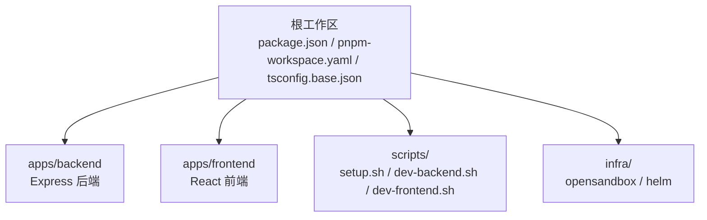
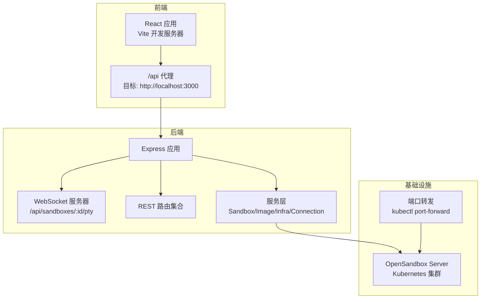
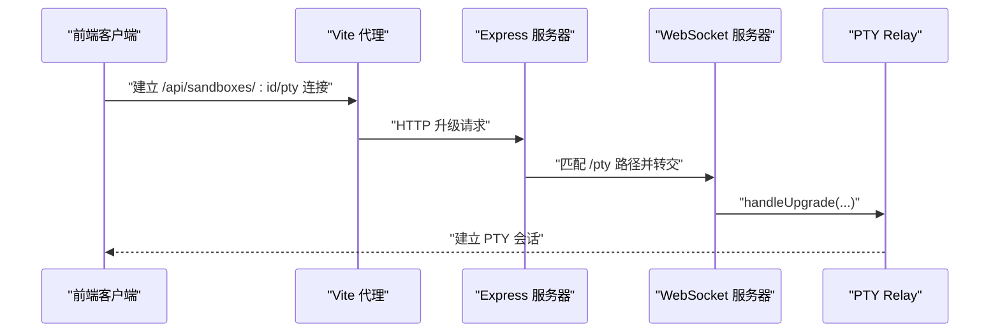
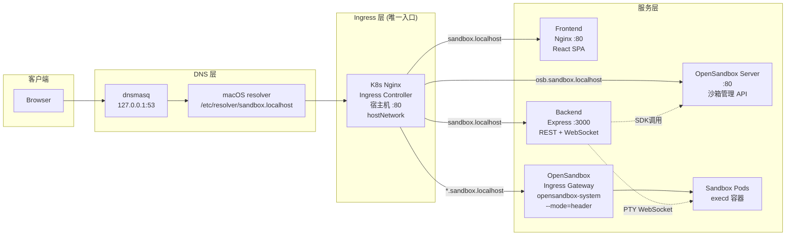
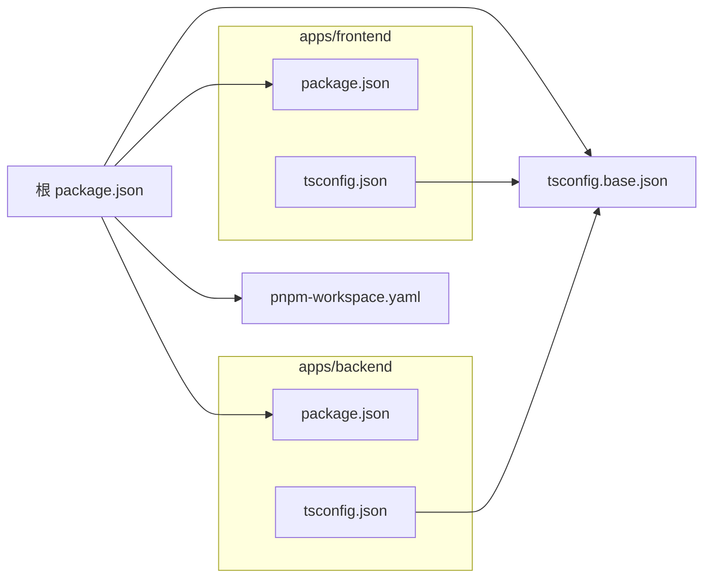

# 开发指南

<cite>
**本文引用的文件**
- [README.md](file://README.md)
- [docs/system-architecture.md](file://docs/system-architecture.md)
- [.github/workflows/build-and-push.yml](file://.github/workflows/build-and-push.yml)
- [infra/helm/sandbox-platform/values-production.yaml](file://infra/helm/sandbox-platform/values-production.yaml)
- [apps/backend/src/routes/index.ts](file://apps/backend/src/routes/index.ts)
- [apps/backend/src/routes/sandboxes.ts](file://apps/backend/src/routes/sandboxes.ts)
- [apps/backend/src/routes/files.ts](file://apps/backend/src/routes/files.ts)
- [apps/backend/src/routes/commands.ts](file://apps/backend/src/routes/commands.ts)
- [apps/backend/src/routes/setup.ts](file://apps/backend/src/routes/setup.ts)
- [apps/backend/src/routes/envCheck.ts](file://apps/backend/src/routes/envCheck.ts)
- [apps/backend/src/services/setupService.ts](file://apps/backend/src/services/setupService.ts)
- [apps/backend/src/services/envCheckService.ts](file://apps/backend/src/services/envCheckService.ts)
- [apps/backend/src/services/domainService.ts](file://apps/backend/src/services/domainService.ts)
- [package.json](file://package.json)
- [pnpm-workspace.yaml](file://pnpm-workspace.yaml)
- [tsconfig.base.json](file://tsconfig.base.json)
- [apps/backend/package.json](file://apps/backend/package.json)
- [apps/backend/src/index.ts](file://apps/backend/src/index.ts)
- [apps/backend/src/server.ts](file://apps/backend/src/server.ts)
- [apps/backend/src/config.ts](file://apps/backend/src/config.ts)
- [apps/backend/src/logger.ts](file://apps/backend/src/logger.ts)
- [apps/backend/src/middleware/error.ts](file://apps/backend/src/middleware/error.ts)
- [apps/backend/src/services/sandboxService.ts](file://apps/backend/src/services/sandboxService.ts)
- [apps/backend/src/services/imageService.ts](file://apps/backend/src/services/imageService.ts)
- [apps/backend/src/services/infraRunner.ts](file://apps/backend/src/services/infraRunner.ts)
- [apps/backend/src/websocket/connectionManager.ts](file://apps/backend/src/websocket/connectionManager.ts)
- [apps/backend/src/websocket/ptyRelay.ts](file://apps/backend/src/websocket/ptyRelay.ts)
- [apps/backend/src/utils/runCommand.ts](file://apps/backend/src/utils/runCommand.ts)
- [apps/backend/Dockerfile](file://apps/backend/Dockerfile)
- [apps/backend/tsconfig.json](file://apps/backend/tsconfig.json)
- [apps/frontend/package.json](file://apps/frontend/package.json)
- [apps/frontend/vite.config.ts](file://apps/frontend/vite.config.ts)
- [apps/frontend/tailwind.config.js](file://apps/frontend/tailwind.config.js)
- [apps/frontend/postcss.config.js](file://apps/frontend/postcss.config.js)
- [apps/frontend/tsconfig.json](file://apps/frontend/tsconfig.json)
- [apps/frontend/Dockerfile](file://apps/frontend/Dockerfile)
- [scripts/setup.sh](file://scripts/setup.sh)
- [scripts/dev-backend.sh](file://scripts/dev-backend.sh)
- [scripts/dev-frontend.sh](file://scripts/dev-frontend.sh)
</cite>

## 更新摘要
**所做更改**
- 新增完整的CI/CD流水线说明，包括GitHub Actions工作流和镜像发布策略
- 新增生产部署指南，涵盖Helm Chart部署、DNS配置和域名解析
- 新增详细的API文档，包含所有REST接口和WebSocket端点
- 新增环境变量参考表，提供完整的配置参数说明
- 新增系统架构详解，包含三条Ingress路由和DNS解析流程
- 更新开发工具链配置，新增CI/CD和生产环境相关内容

## 目录
1. [简介](#简介)
2. [项目结构](#项目结构)
3. [核心组件](#核心组件)
4. [架构总览](#架构总览)
5. [CI/CD流水线](#cicd流水线)
6. [生产部署](#生产部署)
7. [API文档](#api文档)
8. [环境变量参考](#环境变量参考)
9. [详细组件分析](#详细组件分析)
10. [依赖关系分析](#依赖关系分析)
11. [性能考虑](#性能考虑)
12. [故障排查指南](#故障排查指南)
13. [结论](#结论)
14. [附录](#附录)

## 简介
本开发指南面向参与 Sandbox Manager 平台开发的工程师，覆盖从开发环境搭建、IDE 设置、调试配置、代码格式化、贡献流程、monorepo 结构与工具链、到CI/CD流水线、生产部署、API文档和环境变量参考的完整开发实践。Sandbox Manager 是基于 OpenSandbox 的 Kubernetes AI 沙箱管理平台，提供 Web UI 创建与管理隔离沙箱、Web 终端实时交互的能力。

## 项目结构
项目采用 pnpm monorepo 工作区，根目录通过 workspace 管理前后端两个应用包，配合统一的 TypeScript 基础配置与脚本命令，实现一致的开发体验与构建流程。

- 根级工作区与脚本
  - 根 package.json 提供统一的开发与构建脚本，通过 pnpm workspace 在 apps/* 下的子包间进行筛选执行。
  - pnpm-workspace.yaml 声明工作区范围为 apps/*。
  - tsconfig.base.json 提供全局 TypeScript 编译选项，确保前后端共享一致的编译行为。

- 应用层
  - apps/backend：Express 后端服务，提供 REST API 与 PTY WebSocket 终端能力，集成 OpenSandbox SDK。
  - apps/frontend：React 前端应用，使用 Zustand 状态管理、Tailwind CSS 样式体系与 Vite 开发服务器。

- 基础设施与脚本
  - infra/opensandbox：OpenSandbox 安装与卸载脚本及 Helm values。
  - infra/helm/sandbox-platform：平台自身 Helm Chart（生产部署）。
  - scripts/：本地开发辅助脚本，一键安装基础设施、启动后端/前端与端口转发。



**图表来源**
- [package.json:1-20](file://package.json#L1-L20)
- [pnpm-workspace.yaml:1-3](file://pnpm-workspace.yaml#L1-L3)
- [tsconfig.base.json:1-16](file://tsconfig.base.json#L1-L16)

**章节来源**
- [README.md:202-228](file://README.md#L202-L228)
- [package.json:1-20](file://package.json#L1-L20)
- [pnpm-workspace.yaml:1-3](file://pnpm-workspace.yaml#L1-L3)
- [tsconfig.base.json:1-16](file://tsconfig.base.json#L1-L16)

## 核心组件
- 后端服务
  - 服务器与路由：Express 应用、CORS 中间件、JSON 解析、请求日志与错误处理；WebSocket 升级处理 PTY 终端连接。
  - 服务层：SandboxService（封装 OpenSandbox SDK）、ImageService、InfraRunner（本地 K8s 端口转发）、ConnectionManager（WS 连接管理）。
  - 配置与日志：环境变量驱动的 Config 加载、Pino 日志记录。
  - 中间件与工具：统一错误处理中间件、命令执行工具。

- 前端应用
  - 构建与开发：Vite 开发服务器、React + TypeScript、Tailwind CSS、PostCSS 自动前缀。
  - 代理与别名：/api 代理至后端、路径别名 @ 指向 src。
  - 状态与组件：Zustand 状态管理、页面与通用组件（终端、文件树、沙箱卡片等）。

- 开发脚本
  - setup.sh：安装 OpenSandbox、pnpm 安装、生成 .env、启动端口转发。
  - dev-backend.sh / dev-frontend.sh：健康检查后启动对应服务。

**章节来源**
- [apps/backend/src/server.ts:1-119](file://apps/backend/src/server.ts#L1-L119)
- [apps/backend/src/config.ts:1-71](file://apps/backend/src/config.ts#L1-L71)
- [apps/backend/src/index.ts:1-66](file://apps/backend/src/index.ts#L1-L66)
- [apps/frontend/vite.config.ts:1-22](file://apps/frontend/vite.config.ts#L1-L22)
- [apps/frontend/tsconfig.json:1-15](file://apps/frontend/tsconfig.json#L1-L15)
- [scripts/setup.sh:1-52](file://scripts/setup.sh#L1-L52)
- [scripts/dev-backend.sh:1-17](file://scripts/dev-backend.sh#L1-L17)
- [scripts/dev-frontend.sh:1-17](file://scripts/dev-frontend.sh#L1-L17)

## 架构总览
下图展示了本地开发时的端到端数据流：前端通过 Vite 代理访问后端 REST 与 WebSocket；后端经由 OpenSandbox Server 完成沙箱生命周期管理与文件/命令操作；本地 K8s 模式下自动进行端口转发以连通集群内服务。



**图表来源**
- [apps/frontend/vite.config.ts:12-20](file://apps/frontend/vite.config.ts#L12-L20)
- [apps/backend/src/server.ts:75-87](file://apps/backend/src/server.ts#L75-L87)
- [apps/backend/src/index.ts:28-44](file://apps/backend/src/index.ts#L28-L44)

## CI/CD流水线
项目通过 GitHub Actions 自动构建 Docker 镜像并推送至 GitHub Container Registry (GHCR)。部署时只需从 GHCR 拉取镜像即可。

### 工作流配置
推送代码到 `main` 分支或创建 `v*` 标签时，自动触发构建：

| 触发条件 | 镜像标签 |
|----------|---------|
| Push `main` | `latest`, `sha-<commit>` |
| Push tag `v0.1.0` | `v0.1.0`, `latest`, `sha-<commit>` |

### 镜像配置
- Backend: `ghcr.io/rabbitai-lab/sandbox-manager/backend`
- Frontend: `ghcr.io/rabbitai-lab/sandbox-manager/frontend`

### 构建步骤
1. 检出代码并设置 Docker Buildx
2. 登录 GHCR Registry
3. 生成镜像元数据（分支、标签、SHA）
4. 构建并推送后端镜像
5. 构建并推送前端镜像

**章节来源**
- [README.md:241-257](file://README.md#L241-L257)
- [.github/workflows/build-and-push.yml:1-80](file://.github/workflows/build-and-push.yml#L1-L80)

## 生产部署
项目通过 GitHub Actions 自动构建 Docker 镜像并推送至 GitHub Container Registry (GHCR)。部署时只需从 GHCR 拉取镜像即可。

### 前置条件
- **Kubernetes 集群**（任意可用的 K8s 集群）
- **kubectl** 和 **helm**
- **Nginx Ingress Controller** 已安装（监听宿主机 80 端口，hostNetwork 模式）

### 部署步骤
1. **部署 sandbox-platform**
```bash
helm install sandbox-platform infra/helm/sandbox-platform \
  -f infra/helm/sandbox-platform/values-ghcr.yaml \
  --wait --timeout 120s
```

2. **配置 DNS 解析**
本地开发环境（macOS + dnsmasq）：
```bash
# dnsmasq 配置 (/etc/dnsmasq.d/sandbox-domains.conf)
address=/sandbox.localhost/127.0.0.1

# macOS resolver (/etc/resolver/sandbox.localhost)
nameserver 127.0.0.1
```

3. **访问平台**
```bash
# 本地开发
open http://sandbox.localhost

# 生产环境
open https://sandbox.rabbitai-lab.com
```

### 生产配置
生产环境使用专用 values 文件：
- `infra/helm/sandbox-platform/values-production.yaml`
- 支持副本数、资源限制、自动扩缩容配置

### 更新与卸载
```bash
# 升级部署
helm upgrade sandbox-platform infra/helm/sandbox-platform \
  -f infra/helm/sandbox-platform/values-ghcr.yaml \
  --wait --timeout 120s

# 卸载
helm uninstall sandbox-platform
bash infra/opensandbox/uninstall.sh
```

**章节来源**
- [README.md:241-327](file://README.md#L241-L327)
- [infra/helm/sandbox-platform/values-production.yaml:1-27](file://infra/helm/sandbox-platform/values-production.yaml#L1-L27)

## API文档
平台提供完整的 REST API 和 WebSocket 接口，支持沙箱生命周期管理、文件操作、命令执行和实时终端交互。

### 健康检查
- **GET** `/api/health` - 健康检查

### 沙箱管理
- **GET** `/api/sandboxes` - 列出所有沙箱
- **POST** `/api/sandboxes` - 创建沙箱
- **GET** `/api/sandboxes/:id` - 获取沙箱详情
- **DELETE** `/api/sandboxes/:id` - 删除沙箱
- **POST** `/api/sandboxes/:id/pause` - 暂停沙箱
- **POST** `/api/sandboxes/:id/resume` - 恢复沙箱
- **GET** `/api/sandboxes/:id/endpoints/:port` - 获取沙箱端点

### 文件操作
- **GET** `/api/sandboxes/:id/files` - 列出目录文件
- **GET** `/api/sandboxes/:id/files/content` - 读取文件内容
- **PUT** `/api/sandboxes/:id/files/content` - 写入文件
- **POST** `/api/sandboxes/:id/files/write` - 写入文件（批量）
- **POST** `/api/sandboxes/:id/files/mkdir` - 创建目录
- **POST** `/api/sandboxes/:id/files/move` - 移动/重命名文件
- **DELETE** `/api/sandboxes/:id/files/files` - 删除文件
- **DELETE** `/api/sandboxes/:id/files/directories` - 删除目录

### 命令执行
- **POST** `/api/sandboxes/:id/commands` - 执行命令
- **POST** `/api/sandboxes/:id/commands/session` - 创建 bash 会话
- **POST** `/api/sandboxes/:id/commands/session/:sessionId/run` - 在会话中执行命令
- **DELETE** `/api/sandboxes/:id/commands/session/:sessionId` - 删除会话

### WebSocket 终端
- **WS** `/api/sandboxes/:id/pty` - PTY WebSocket 终端连接

### 设置与环境检查
- **GET** `/api/setup/status` - 获取设置状态
- **POST** `/api/setup/test-connection` - 测试连接
- **POST** `/api/setup/remote` - 配置远程 OpenSandbox
- **GET** `/api/setup/local-k8s/stream` - 本地K8s设置流
- **POST** `/api/setup/complete` - 完成本地K8s设置
- **GET** `/api/env-check` - 环境检查
- **POST** `/api/env-check/:id/install` - 安装组件

**章节来源**
- [README.md:329-346](file://README.md#L329-L346)
- [apps/backend/src/routes/index.ts:1-22](file://apps/backend/src/routes/index.ts#L1-L22)
- [apps/backend/src/routes/sandboxes.ts:1-175](file://apps/backend/src/routes/sandboxes.ts#L1-L175)
- [apps/backend/src/routes/files.ts:1-327](file://apps/backend/src/routes/files.ts#L1-L327)
- [apps/backend/src/routes/commands.ts:1-95](file://apps/backend/src/routes/commands.ts#L1-L95)
- [apps/backend/src/routes/setup.ts:1-153](file://apps/backend/src/routes/setup.ts#L1-L153)
- [apps/backend/src/routes/envCheck.ts:1-50](file://apps/backend/src/routes/envCheck.ts#L1-L50)

## 环境变量参考
平台支持丰富的环境变量配置，通过环境变量驱动配置，支持动态重初始化。

### 核心配置
| 变量 | 默认值 | 说明 |
|------|--------|------|
| `OPENSANDBOX_SERVER_URL` | `localhost:8080` | OpenSandbox Server 地址 |
| `OPENSANDBOX_API_KEY` | (空) | OpenSandbox API 密钥 |
| `OPENSANDBOX_PROTOCOL` | `http` | 连接协议 |
| `OPENSANDBOX_USE_SERVER_PROXY` | `false` | 是否使用服务器代理 |

### 服务器配置
| 变量 | 默认值 | 说明 |
|------|--------|------|
| `PORT` | `3000` | 后端监听端口 |
| `CORS_ORIGIN` | `*` | CORS 允许来源 |
| `LOG_LEVEL` | `info` | 日志级别 (debug/info/warn/error) |

### PTY 配置
| 变量 | 默认值 | 说明 |
|------|--------|------|
| `PTY_IDLE_TIMEOUT_MS` | `300000` | PTY 空闲超时 (毫秒) |

### OpenSandbox 配置
| 变量 | 默认值 | 说明 |
|------|--------|------|
| `OPENSANDBOX_MAX_CONCURRENT_REQUESTS` | `10` | 最大并发请求数 |
| `OPENSANDBOX_REQUEST_TIMEOUT_MS` | `30000` | 请求超时时间 (毫秒) |
| `OPENSANDBOX_CACHE_TTL_MS` | `60000` | 缓存 TTL (毫秒) |

**章节来源**
- [README.md:353-364](file://README.md#L353-L364)
- [apps/backend/src/config.ts:1-71](file://apps/backend/src/config.ts#L1-L71)

## 详细组件分析

### 后端服务器与升级流程
后端通过 HTTP 升级事件将特定路径的 WebSocket 请求交由 PTY Relay 处理，实现二进制帧透传的终端交互。



**图表来源**
- [apps/backend/src/server.ts:75-87](file://apps/backend/src/server.ts#L75-L87)
- [apps/backend/src/websocket/ptyRelay.ts](file://apps/backend/src/websocket/ptyRelay.ts)

**章节来源**
- [apps/backend/src/server.ts:1-119](file://apps/backend/src/server.ts#L1-L119)

### 配置加载与重初始化
后端通过环境变量加载配置，支持在未完全配置时进入"设置模式"，并在配置变更后动态重初始化服务。


**图表来源**
- [apps/backend/src/config.ts:48-70](file://apps/backend/src/config.ts#L48-L70)
- [apps/backend/src/server.ts:96-118](file://apps/backend/src/server.ts#L96-L118)
- [apps/backend/src/index.ts:28-44](file://apps/backend/src/index.ts#L28-L44)

**章节来源**
- [apps/backend/src/config.ts:1-71](file://apps/backend/src/config.ts#L1-L71)
- [apps/backend/src/server.ts:96-118](file://apps/backend/src/server.ts#L96-L118)
- [apps/backend/src/index.ts:1-66](file://apps/backend/src/index.ts#L1-L66)

### 前端开发工具链
- Vite：开发服务器、代理配置、路径别名。
- React + TypeScript：类型安全与现代化语法。
- Tailwind CSS + PostCSS：原子化样式与自动前缀。
- 路径别名：@ 指向 src，提升导入可读性。

**章节来源**
- [apps/frontend/vite.config.ts:1-22](file://apps/frontend/vite.config.ts#L1-L22)
- [apps/frontend/tailwind.config.js:1-9](file://apps/frontend/tailwind.config.js#L1-L9)
- [apps/frontend/postcss.config.js:1-7](file://apps/frontend/postcss.config.js#L1-L7)
- [apps/frontend/tsconfig.json:1-15](file://apps/frontend/tsconfig.json#L1-L15)

### 系统架构详解
平台采用三层 Ingress 路由架构，通过 HTTP Host 头精确匹配流量到不同服务。



**图表来源**
- [README.md:9-44](file://README.md#L9-L44)
- [docs/system-architecture.md:5-40](file://docs/system-architecture.md#L5-L40)

**章节来源**
- [README.md:5-91](file://README.md#L5-L91)
- [docs/system-architecture.md:1-249](file://docs/system-architecture.md#L1-L249)

## 依赖关系分析
- 工作区与包管理
  - 根 package.json 使用 pnpm workspace 脚本在子包间分发命令。
  - pnpm-workspace.yaml 限定工作区范围为 apps/*。
  - tsconfig.base.json 作为全局编译基线，前后端各自扩展。

- 前端依赖
  - React 生态、Zustand 状态管理、Tailwind CSS、Vite。
  - 开发依赖：@vitejs/plugin-react、tailwindcss、postcss、autoprefixer、typescript、vite。

- 后端依赖
  - Express、ws、cors、dotenv、pino、lru-cache、uuid、OpenSandbox SDK。
  - 开发依赖：tsx、typescript、@types/*。



**图表来源**
- [package.json:1-20](file://package.json#L1-L20)
- [pnpm-workspace.yaml:1-3](file://pnpm-workspace.yaml#L1-L3)
- [tsconfig.base.json:1-16](file://tsconfig.base.json#L1-L16)
- [apps/frontend/package.json:1-32](file://apps/frontend/package.json#L1-L32)
- [apps/backend/package.json:1-32](file://apps/backend/package.json#L1-L32)
- [apps/frontend/tsconfig.json:1-15](file://apps/frontend/tsconfig.json#L1-L15)
- [apps/backend/tsconfig.json:1-13](file://apps/backend/tsconfig.json#L1-L13)

**章节来源**
- [package.json:1-20](file://package.json#L1-L20)
- [pnpm-workspace.yaml:1-3](file://pnpm-workspace.yaml#L1-L3)
- [tsconfig.base.json:1-16](file://tsconfig.base.json#L1-L16)
- [apps/frontend/package.json:1-32](file://apps/frontend/package.json#L1-L32)
- [apps/backend/package.json:1-32](file://apps/backend/package.json#L1-L32)

## 性能考虑
- PTY 空闲超时：通过环境变量控制空闲连接关闭时间，避免资源泄露。
- 日志级别：在开发阶段可调低日志级别以提升可观测性，生产环境建议收敛。
- 代理与网络：Vite 代理仅用于开发，生产构建后由反向代理统一处理。
- 缓存与并发：后端对 OpenSandbox SDK 的调用可通过缓存与超时参数优化响应时间。
- 自动扩缩容：生产环境支持基于 CPU 使用率的自动扩缩容。

**章节来源**
- [apps/backend/src/config.ts:68](file://apps/backend/src/config.ts#L68)
- [apps/backend/src/config.ts:66](file://apps/backend/src/config.ts#L66)
- [apps/frontend/vite.config.ts:12-20](file://apps/frontend/vite.config.ts#L12-L20)
- [infra/helm/sandbox-platform/values-production.yaml:22-27](file://infra/helm/sandbox-platform/values-production.yaml#L22-L27)

## 故障排查指南
- OpenSandbox 未就绪
  - 确认已执行安装脚本并完成命名空间与 CRD 部署。
  - 使用端口转发命令将集群内服务暴露到本地。
  - 参考一键脚本自动完成安装与端口转发。

- 后端无法启动或不可达
  - 检查 .env 配置是否正确（OPENSANDBOX_SERVER_URL、OPENSANDBOX_API_KEY、PORT）。
  - 确认端口转发已运行且 OpenSandbox Server 可访问。
  - 使用健康检查接口验证后端状态。

- 前端代理失败
  - 确认后端已启动并监听 3000 端口。
  - 检查 Vite 代理配置是否指向正确的后端地址。
  - 清理缓存并重启开发服务器。

- 本地 K8s 模式异常
  - 若使用本地 K8s，确认端口转发自动启动或手动执行。
  - 如端口转发冲突，调整本地端口并更新配置。

- CI/CD 构建失败
  - 检查 GitHub Actions 工作流权限配置。
  - 确认 Docker 镜像标签生成规则正确。
  - 验证 GHCR 登录凭据有效性。

- 生产部署问题
  - 检查 Ingress Nginx 控制器状态。
  - 验证 DNS 解析配置正确性。
  - 确认 Helm Chart 配置文件完整。

**章节来源**
- [README.md:30-80](file://README.md#L30-L80)
- [scripts/setup.sh:14-41](file://scripts/setup.sh#L14-L41)
- [scripts/dev-backend.sh:8-12](file://scripts/dev-backend.sh#L8-L12)
- [apps/backend/src/index.ts:28-44](file://apps/backend/src/index.ts#L28-L44)
- [.github/workflows/build-and-push.yml:1-80](file://.github/workflows/build-and-push.yml#L1-L80)

## 结论
本指南提供了 Sandbox Manager 从环境准备到日常开发、调试与运维的全链路实践。遵循 monorepo 工作区与工具链约定，结合统一的配置与日志策略，可显著提升开发效率与系统稳定性。新增的CI/CD流水线和生产部署指南进一步完善了平台的交付流程，建议在团队内固化贡献流程与代码审查标准，持续完善测试与性能优化策略。

## 附录

### 开发环境配置与 IDE 建议
- 前端
  - 使用 Vite 开发服务器，配置 /api 代理至后端。
  - 启用路径别名 @，提升导入一致性。
  - Tailwind CSS 与 PostCSS 自动前缀，确保样式构建稳定。
- 后端
  - 使用 tsx watch 进行开发热更新。
  - 通过 dotenv 加载环境变量，确保配置项齐全。
  - Pino 日志输出便于本地排错。

**章节来源**
- [apps/frontend/vite.config.ts:1-22](file://apps/frontend/vite.config.ts#L1-L22)
- [apps/frontend/tailwind.config.js:1-9](file://apps/frontend/tailwind.config.js#L1-L9)
- [apps/frontend/postcss.config.js:1-7](file://apps/frontend/postcss.config.js#L1-L7)
- [apps/backend/package.json:7-9](file://apps/backend/package.json#L7-L9)
- [apps/backend/package.json:14-20](file://apps/backend/package.json#L14-L20)

### 调试配置
- 后端
  - 使用 tsx watch 监听文件变化并自动重启。
  - 通过环境变量调整日志级别与 PTY 超时。
- 前端
  - Vite 开发服务器自动热更新，代理 /api 至后端。
  - 如需断点调试，可在浏览器开发者工具中设置断点。

**章节来源**
- [apps/backend/package.json:7](file://apps/backend/package.json#L7)
- [apps/backend/src/config.ts:66-68](file://apps/backend/src/config.ts#L66-L68)
- [apps/frontend/vite.config.ts:12-20](file://apps/frontend/vite.config.ts#L12-L20)

### 代码格式化与规范
- TypeScript 编译
  - 使用 tsconfig.base.json 作为基础配置，前后端各自扩展。
  - 前端启用 jsx 与 DOM 类库，后端启用 ESNext 模块解析。
- 前端样式
  - Tailwind CSS 与 PostCSS 自动前缀，确保跨浏览器兼容。
- 建议
  - 团队内统一 ESLint + Prettier 规则，结合 Git Hooks 在提交前强制校验。

**章节来源**
- [tsconfig.base.json:1-16](file://tsconfig.base.json#L1-L16)
- [apps/frontend/tsconfig.json:1-15](file://apps/frontend/tsconfig.json#L1-L15)
- [apps/backend/tsconfig.json:1-13](file://apps/backend/tsconfig.json#L1-L13)
- [apps/frontend/tailwind.config.js:1-9](file://apps/frontend/tailwind.config.js#L1-L9)
- [apps/frontend/postcss.config.js:1-7](file://apps/frontend/postcss.config.js#L1-L7)

### 代码贡献流程
- 分支策略
  - 主分支保护，功能开发在特性分支进行。
- 提交规范
  - 使用简短清晰的提交信息，必要时附带变更摘要。
- 代码审查
  - 提交 Pull Request，至少一名维护者审查并批准。
  - 关注点：功能正确性、性能影响、日志与错误处理、配置健壮性。
- 测试要求
  - 新增功能需配套单元测试与必要的集成测试。
  - 前端组件测试建议覆盖关键交互与状态切换。
  - 后端接口与服务层测试建议覆盖正常路径与异常路径。

**章节来源**
- [README.md:15-26](file://README.md#L15-L26)

### monorepo 工作区与管理
- 工作区定义
  - pnpm-workspace.yaml 声明 apps/* 为工作区包。
- 脚本分发
  - 根 package.json 通过 pnpm --filter 在子包执行 dev/build。
- 构建顺序
  - 根级构建按顺序构建所有包，确保依赖一致。

**章节来源**
- [pnpm-workspace.yaml:1-3](file://pnpm-workspace.yaml#L1-L3)
- [package.json:8-13](file://package.json#L8-L13)

### 开发工具链配置
- pnpm
  - 版本要求：>= 9，根 engines 指定 Node >= 20。
- Vite（前端）
  - 代理 /api 至后端，路径别名 @ 指向 src。
- TypeScript（全局）
  - 基于 tsconfig.base.json，前后端分别扩展。
- Docker（可选）
  - apps/*/Dockerfile 支持容器化部署。

**章节来源**
- [package.json:15-18](file://package.json#L15-L18)
- [apps/frontend/vite.config.ts:7-11](file://apps/frontend/vite.config.ts#L7-L11)
- [tsconfig.base.json:1-16](file://tsconfig.base.json#L1-L16)
- [apps/backend/Dockerfile](file://apps/backend/Dockerfile)
- [apps/frontend/Dockerfile](file://apps/frontend/Dockerfile)

### 单元测试与集成测试策略
- 单元测试
  - 后端：针对服务层（SandboxService、ImageService）与工具函数（runCommand）编写测试，覆盖成功与失败场景。
  - 前端：针对 hooks（useTerminal、useSandbox、useFileTree）与组件（TerminalPane、FileTree、SandboxCard）编写测试。
- 集成测试
  - 端到端：从前端发起请求到后端路由与 WebSocket，再到 OpenSandbox Server，验证完整链路。
  - 配置变更：模拟配置重初始化流程，验证服务重建与连接迁移。
- 建议
  - 使用最小化测试集覆盖关键路径，结合覆盖率报告持续改进。

**章节来源**
- [apps/backend/src/services/sandboxService.ts](file://apps/backend/src/services/sandboxService.ts)
- [apps/backend/src/services/imageService.ts](file://apps/backend/src/services/imageService.ts)
- [apps/backend/src/websocket/connectionManager.ts](file://apps/backend/src/websocket/connectionManager.ts)
- [apps/backend/src/websocket/ptyRelay.ts](file://apps/backend/src/websocket/ptyRelay.ts)
- [apps/backend/src/utils/runCommand.ts](file://apps/backend/src/utils/runCommand.ts)
- [apps/backend/src/server.ts:96-118](file://apps/backend/src/server.ts#L96-L118)

### 代码审查与质量保证
- 审查清单
  - 功能完整性与边界条件。
  - 错误处理与日志记录是否充分。
  - 配置健壮性与默认值合理性。
  - 性能与资源占用（PTY 超时、缓存策略）。
- 质量工具
  - ESLint + Prettier 固化风格。
  - SonarQube 或同类静态分析工具（建议在 CI 中启用）。

**章节来源**
- [apps/backend/src/middleware/error.ts](file://apps/backend/src/middleware/error.ts)
- [apps/backend/src/config.ts:48-70](file://apps/backend/src/config.ts#L48-L70)

### 新功能开发最佳实践与架构原则
- 架构原则
  - 单一职责：服务层专注业务逻辑，路由层专注协议与参数。
  - 配置即代码：通过环境变量驱动配置，支持动态重初始化。
  - 无状态与幂等：WebSocket 与路由尽量设计为幂等，便于重连与恢复。
- 最佳实践
  - 新增路由时同步补充错误处理与日志埋点。
  - 对外暴露的 API 明确输入输出约束，必要时增加校验。
  - 终端相关功能优先保证空闲超时与资源回收。
  - 在本地 K8s 模式下提供自动端口转发与提示信息。

**章节来源**
- [apps/backend/src/server.ts:36-89](file://apps/backend/src/server.ts#L36-L89)
- [apps/backend/src/config.ts:48-70](file://apps/backend/src/config.ts#L48-L70)
- [apps/backend/src/index.ts:28-44](file://apps/backend/src/index.ts#L28-L44)

### 环境检查与设置向导
平台提供完整的环境检查与设置向导，支持自动检测和安装必要的基础设施组件。

#### 环境检查项目
- **域名白名单配置**：检查允许访问的域名列表
- **Ingress Nginx 控制器**：验证 Kubernetes Ingress Nginx 安装状态
- **本地 DNS 解析**：检查 dnsmasq 配置和 DNS 解析功能

#### 设置向导流程
1. **远程 OpenSandbox 配置**：通过 API 测试连接并保存配置
2. **本地 Kubernetes 设置**：通过 SSE 流程自动化安装和配置
3. **环境验证**：完成配置后的环境检查

**章节来源**
- [apps/backend/src/routes/envCheck.ts:1-50](file://apps/backend/src/routes/envCheck.ts#L1-L50)
- [apps/backend/src/routes/setup.ts:1-153](file://apps/backend/src/routes/setup.ts#L1-L153)
- [apps/backend/src/services/envCheckService.ts:1-415](file://apps/backend/src/services/envCheckService.ts#L1-L415)
- [apps/backend/src/services/setupService.ts:1-154](file://apps/backend/src/services/setupService.ts#L1-L154)
- [apps/backend/src/services/domainService.ts:1-109](file://apps/backend/src/services/domainService.ts#L1-L109)