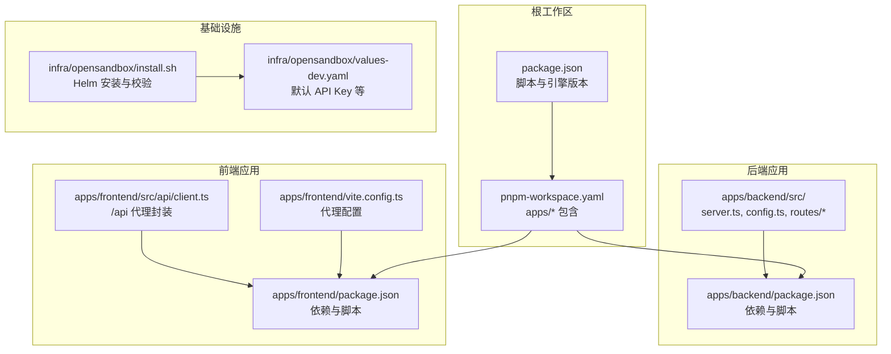
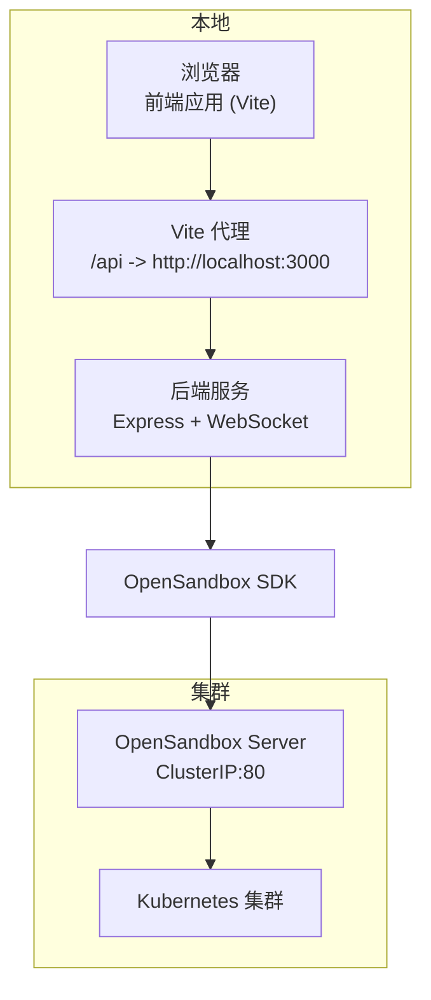
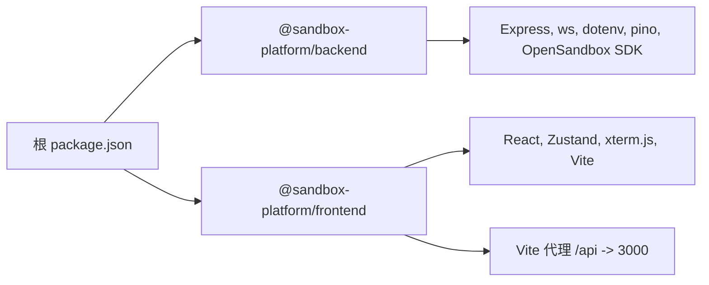

# 快速开始

<cite>
**本文引用的文件**
- [README.md](file://README.md)
- [package.json](file://package.json)
- [pnpm-workspace.yaml](file://pnpm-workspace.yaml)
- [scripts/setup.sh](file://scripts/setup.sh)
- [scripts/dev-backend.sh](file://scripts/dev-backend.sh)
- [scripts/dev-frontend.sh](file://scripts/dev-frontend.sh)
- [apps/backend/package.json](file://apps/backend/package.json)
- [apps/frontend/package.json](file://apps/frontend/package.json)
- [apps/backend/src/config.ts](file://apps/backend/src/config.ts)
- [apps/backend/src/server.ts](file://apps/backend/src/server.ts)
- [apps/backend/src/routes/health.ts](file://apps/backend/src/routes/health.ts)
- [apps/backend/.env.example](file://apps/backend/.env.example)
- [apps/frontend/vite.config.ts](file://apps/frontend/vite.config.ts)
- [apps/frontend/src/api/client.ts](file://apps/frontend/src/api/client.ts)
- [infra/opensandbox/install.sh](file://infra/opensandbox/install.sh)
- [infra/opensandbox/values-dev.yaml](file://infra/opensandbox/values-dev.yaml)
</cite>

## 目录
1. [简介](#简介)
2. [项目结构](#项目结构)
3. [前置条件与环境准备](#前置条件与环境准备)
4. [OpenSandbox 基础设施安装](#opensandbox-基础设施安装)
5. [端口转发配置](#端口转发配置)
6. [环境变量配置](#环境变量配置)
7. [后端与前端开发服务器启动](#后端与前端开发服务器启动)
8. [健康检查与访问应用](#健康检查与访问应用)
9. [架构概览](#架构概览)
10. [依赖关系分析](#依赖关系分析)
11. [性能与并发特性](#性能与并发特性)
12. [故障排除指南](#故障排除指南)
13. [结论](#结论)

## 简介
本指南面向初学者，帮助你在本地快速搭建并运行基于 OpenSandbox 的 Kubernetes AI 沙箱管理平台。你将完成环境准备、安装 OpenSandbox 基础设施、建立端口转发、配置环境变量、启动后端与前端开发服务器，并通过健康检查验证服务状态。

## 项目结构
项目采用 pnpm workspace 的 monorepo 结构，分为后端（Express + WebSocket）与前端（React + Zustand + xterm.js）两个应用，以及 OpenSandbox 基础设施安装脚本与 Helm Chart。

图表来源
- [package.json:1-20](file://package.json#L1-L20)
- [pnpm-workspace.yaml:1-3](file://pnpm-workspace.yaml#L1-L3)
- [apps/backend/package.json:1-32](file://apps/backend/package.json#L1-L32)
- [apps/frontend/package.json:1-32](file://apps/frontend/package.json#L1-L32)
- [apps/backend/src/server.ts:1-119](file://apps/backend/src/server.ts#L1-L119)
- [apps/frontend/vite.config.ts:1-22](file://apps/frontend/vite.config.ts#L1-L22)
- [apps/frontend/src/api/client.ts:1-45](file://apps/frontend/src/api/client.ts#L1-L45)
- [infra/opensandbox/install.sh:1-132](file://infra/opensandbox/install.sh#L1-L132)
- [infra/opensandbox/values-dev.yaml:1-34](file://infra/opensandbox/values-dev.yaml#L1-L34)

章节来源
- [README.md:114-140](file://README.md#L114-L140)
- [package.json:1-20](file://package.json#L1-L20)
- [pnpm-workspace.yaml:1-3](file://pnpm-workspace.yaml#L1-L3)

## 前置条件与环境准备
- Node.js：版本要求见根工作区 engines 字段
- pnpm：版本要求见根工作区 engines 字段
- Docker Desktop（含内置 Kubernetes）或任意可用的 K8s 集群
- kubectl 与 helm（脚本会尝试安装 helm）

验证集群连通性：
- 使用 kubectl cluster-info 确认集群可用

章节来源
- [README.md:15-26](file://README.md#L15-L26)
- [package.json:15-18](file://package.json#L15-L18)

## OpenSandbox 基础设施安装
推荐使用提供的安装脚本一键完成：
- 执行安装脚本，自动完成：
  - 检查 kubectl / helm 依赖
  - 创建命名空间 opensandbox-system 与 opensandbox
  - 通过 Helm 安装 OpenSandbox Controller 与 Server
  - 部署沙箱资源池（Pool CRD）

如需手动操作，可参考安装脚本中的各阶段说明与 Helm Chart 来源逻辑。

章节来源
- [README.md:28-41](file://README.md#L28-L41)
- [infra/opensandbox/install.sh:15-84](file://infra/opensandbox/install.sh#L15-L84)
- [infra/opensandbox/install.sh:42-63](file://infra/opensandbox/install.sh#L42-L63)

## 端口转发配置
安装完成后，需要将 OpenSandbox Server 的 80 端口映射到本机 8080，以便后端服务访问：
- 命令示例：kubectl port-forward svc/opensandbox-server 8080:80 -n opensandbox-system
- 保持该终端运行，或使用脚本自动启动与检测

端口转发是后续开发的关键，确保后端能通过 OPENSANDBOX_SERVER_URL 访问到 OpenSandbox Server。

章节来源
- [README.md:42-48](file://README.md#L42-L48)
- [scripts/setup.sh:32-41](file://scripts/setup.sh#L32-L41)
- [scripts/dev-backend.sh:7-12](file://scripts/dev-backend.sh#L7-L12)

## 环境变量配置
后端通过环境变量驱动配置，建议从示例文件复制并按需修改：
- 复制示例文件：cp apps/backend/.env.example apps/backend/.env
- 关键变量（来自示例与配置加载逻辑）：
  - OPENSANDBOX_SERVER_URL：指向本地 8080 端口
  - OPENSANDBOX_API_KEY：来自 values-dev.yaml 的默认值
  - PORT：后端监听端口
  - CORS_ORIGIN：跨域来源
  - LOG_LEVEL：日志级别
- 更多可选变量（来自配置加载逻辑）：
  - OPENSANDBOX_PROTOCOL：http 或 https
  - OPENSANDBOX_USE_SERVER_PROXY：是否使用后端代理
  - OPENSANDBOX_REQUEST_TIMEOUT_SECONDS：请求超时（秒）
  - PTY_IDLE_TIMEOUT_MS：PTY 空闲超时（毫秒）

章节来源
- [README.md:50-65](file://README.md#L50-L65)
- [apps/backend/.env.example:1-11](file://apps/backend/.env.example#L1-L11)
- [apps/backend/src/config.ts:48-70](file://apps/backend/src/config.ts#L48-L70)
- [infra/opensandbox/values-dev.yaml:21](file://infra/opensandbox/values-dev.yaml#L21)

## 后端与前端开发服务器启动
- 后端开发服务器
  - 方式一：根脚本 pnpm dev:backend
  - 方式二：进入 apps/backend 执行 dev 脚本（已由脚本注入 OPENSANDBOX_SERVER_URL）
  - 端口：默认 3000（可通过 PORT 修改）
- 前端开发服务器
  - 方式一：根脚本 pnpm dev:frontend
  - 方式二：进入 apps/frontend 执行 dev 脚本
  - 端口：默认 5173；Vite 将 /api 代理到后端 3000 端口

章节来源
- [README.md:69-89](file://README.md#L69-L89)
- [package.json:8-13](file://package.json#L8-L13)
- [apps/backend/package.json:6-10](file://apps/backend/package.json#L6-L10)
- [apps/frontend/package.json:6-10](file://apps/frontend/package.json#L6-L10)
- [apps/frontend/vite.config.ts:12-21](file://apps/frontend/vite.config.ts#L12-L21)

## 健康检查与访问应用
- 健康检查
  - 后端健康端点：GET /api/health
  - 建议使用 curl 或浏览器访问：curl http://localhost:3000/api/health
  - 响应中包含 configured 与 opensandboxReady 状态，用于判断 OpenSandbox 连通性
- 访问应用
  - 浏览器打开 http://localhost:5173
  - 功能包括：沙箱列表、创建沙箱、沙箱详情页、Web 终端交互、浏览沙箱文件系统

章节来源
- [README.md:75-97](file://README.md#L75-L97)
- [apps/backend/src/routes/health.ts:1-52](file://apps/backend/src/routes/health.ts#L1-L52)

## 架构概览
下图展示了本地开发链路中各组件的交互关系与数据流。

图表来源
- [apps/frontend/vite.config.ts:12-21](file://apps/frontend/vite.config.ts#L12-L21)
- [apps/backend/src/server.ts:72-87](file://apps/backend/src/server.ts#L72-L87)
- [apps/backend/src/config.ts:48-70](file://apps/backend/src/config.ts#L48-L70)
- [infra/opensandbox/install.sh:121-124](file://infra/opensandbox/install.sh#L121-L124)

## 依赖关系分析
- 工作区与包管理
  - 根 package.json 定义了 dev、build 脚本与 Node/pnpm 版本约束
  - pnpm-workspace.yaml 指定 apps/* 为工作区包
- 后端依赖
  - Express、ws、OpenSandbox SDK、dotenv、pino 等
- 前端依赖
  - React、Zustand、xterm.js、TailwindCSS、Vite 等
- 前端代理
  - Vite 将 /api 请求代理至后端 3000 端口，WebSocket 也随代理升级

图表来源
- [package.json:1-20](file://package.json#L1-L20)
- [pnpm-workspace.yaml:1-3](file://pnpm-workspace.yaml#L1-L3)
- [apps/backend/package.json:11-21](file://apps/backend/package.json#L11-L21)
- [apps/frontend/package.json:11-20](file://apps/frontend/package.json#L11-L20)
- [apps/frontend/vite.config.ts:12-21](file://apps/frontend/vite.config.ts#L12-L21)

章节来源
- [package.json:1-20](file://package.json#L1-L20)
- [pnpm-workspace.yaml:1-3](file://pnpm-workspace.yaml#L1-L3)
- [apps/backend/package.json:11-21](file://apps/backend/package.json#L11-L21)
- [apps/frontend/package.json:11-20](file://apps/frontend/package.json#L11-L20)
- [apps/frontend/vite.config.ts:12-21](file://apps/frontend/vite.config.ts#L12-L21)

## 性能与并发特性
- 后端并发模型
  - HTTP 与 WebSocket 并行运行，支持多终端会话
  - PTY 空闲超时可配置，避免资源长期占用
- 前端代理
  - Vite 代理支持 WebSocket 升级，保证终端实时交互
- OpenSandbox SDK
  - 通过配置项控制请求超时与代理行为，提升稳定性

章节来源
- [apps/backend/src/server.ts:72-87](file://apps/backend/src/server.ts#L72-L87)
- [apps/backend/src/config.ts:68](file://apps/backend/src/config.ts#L68)
- [apps/frontend/vite.config.ts:17](file://apps/frontend/vite.config.ts#L17)

## 故障排除指南
- 依赖未安装
  - 确认 Node.js 与 pnpm 版本满足根工作区要求
  - 确认 kubectl 与 helm 可用；若缺少 helm，脚本会尝试安装
- 集群不可达
  - 若 kubectl cluster-info 失败，检查 Docker Desktop 的 Kubernetes 是否开启
- OpenSandbox 未就绪
  - 安装脚本会等待 Pod 就绪；若失败，使用 kubectl get pods -n opensandbox-system 排查
- 端口转发缺失
  - 后端启动前会检查 localhost:8080；若不可达，请先执行 port-forward
  - 前端启动前会检查 localhost:3000/api/health；若不可达，请先启动后端
- 环境变量错误
  - 确保 OPENSANDBOX_SERVER_URL 与 OPENSANDBOX_API_KEY 与 values-dev.yaml 一致
  - 如需 HTTPS 或自定义超时，可在环境变量中覆盖对应字段
- 健康检查异常
  - 响应中 configured=false 表示尚未配置 OpenSandbox
  - configured=true 但 opensandboxReady=false 表示已配置但无法访问，检查端口转发与 API Key

章节来源
- [scripts/setup.sh:10-12](file://scripts/setup.sh#L10-L12)
- [scripts/dev-backend.sh:7-12](file://scripts/dev-backend.sh#L7-L12)
- [scripts/dev-frontend.sh:7-12](file://scripts/dev-frontend.sh#L7-L12)
- [apps/backend/src/config.ts:32-46](file://apps/backend/src/config.ts#L32-L46)
- [apps/backend/src/routes/health.ts:9-22](file://apps/backend/src/routes/health.ts#L9-L22)
- [infra/opensandbox/install.sh:86-93](file://infra/opensandbox/install.sh#L86-L93)

## 结论
按照本指南完成环境准备、基础设施安装、端口转发与环境变量配置后，你将可以顺利启动后端与前端开发服务器，并通过健康检查验证服务状态。随后即可在浏览器中访问应用，进行沙箱的创建、管理和终端交互。