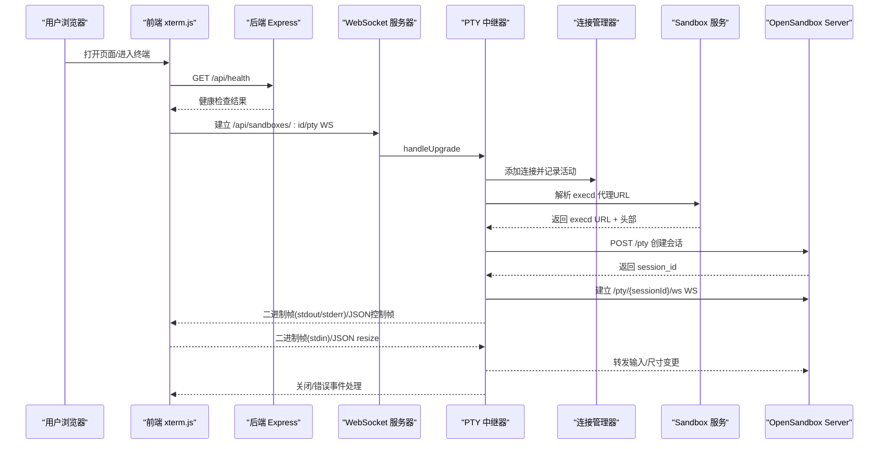
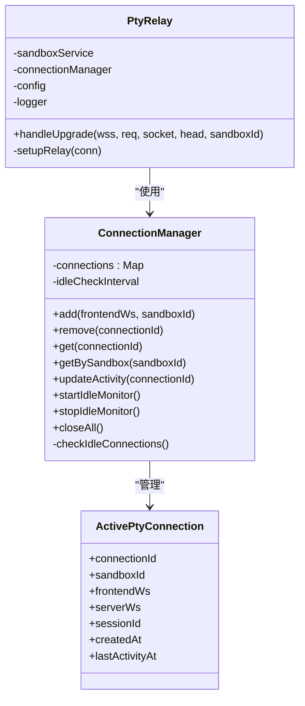
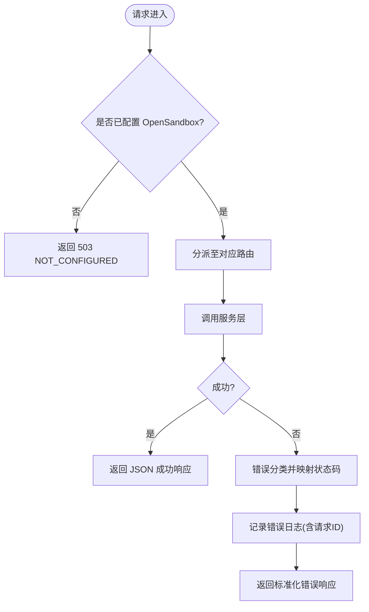
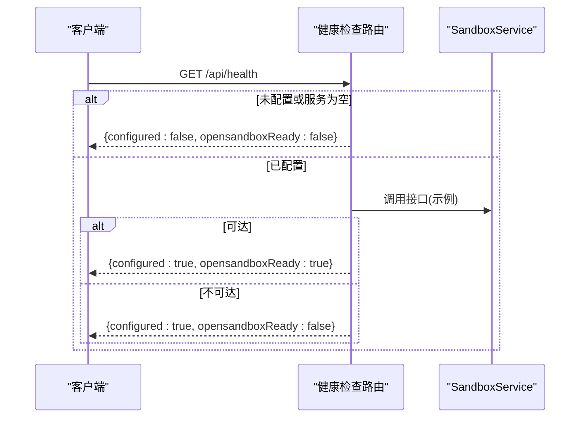
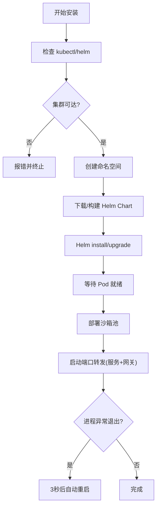
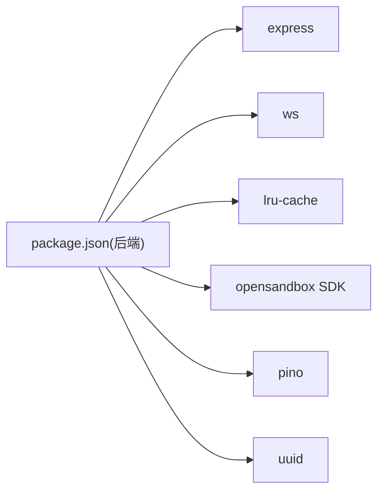
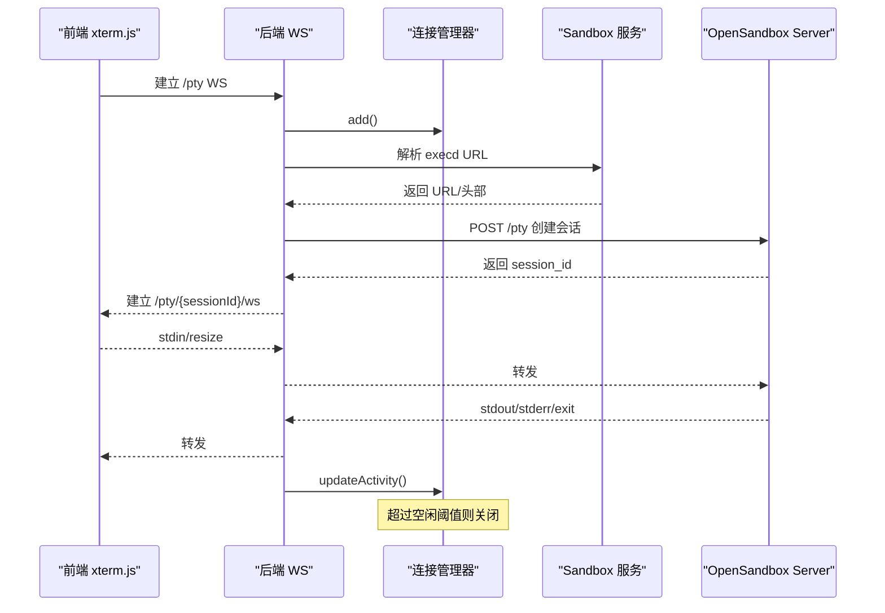

# 故障排除

<cite>
**本文引用的文件**
- [README.md](file://README.md)
- [apps/backend/src/config.ts](file://apps/backend/src/config.ts)
- [apps/backend/src/logger.ts](file://apps/backend/src/logger.ts)
- [apps/backend/src/middleware/error.ts](file://apps/backend/src/middleware/error.ts)
- [apps/backend/src/server.ts](file://apps/backend/src/server.ts)
- [apps/backend/src/websocket/connectionManager.ts](file://apps/backend/src/websocket/connectionManager.ts)
- [apps/backend/src/websocket/ptyRelay.ts](file://apps/backend/src/websocket/ptyRelay.ts)
- [apps/backend/src/routes/sandboxes.ts](file://apps/backend/src/routes/sandboxes.ts)
- [apps/backend/src/routes/health.ts](file://apps/backend/src/routes/health.ts)
- [apps/backend/src/services/infraRunner.ts](file://apps/backend/src/services/infraRunner.ts)
- [apps/backend/package.json](file://apps/backend/package.json)
- [apps/frontend/src/hooks/useTerminal.ts](file://apps/frontend/src/hooks/useTerminal.ts)
- [apps/frontend/src/components/terminal/TerminalPane.tsx](file://apps/frontend/src/components/terminal/TerminalPane.tsx)
- [scripts/setup.sh](file://scripts/setup.sh)
- [scripts/dev-backend.sh](file://scripts/dev-backend.sh)
- [infra/helm/sandbox-platform/templates/backend-deployment.yaml](file://infra/helm/sandbox-platform/templates/backend-deployment.yaml)
</cite>

## 目录
1. [简介](#简介)
2. [项目结构](#项目结构)
3. [核心组件](#核心组件)
4. [架构总览](#架构总览)
5. [详细组件分析](#详细组件分析)
6. [依赖关系分析](#依赖关系分析)
7. [性能考虑](#性能考虑)
8. [故障排除指南](#故障排除指南)
9. [结论](#结论)
10. [附录](#附录)

## 简介
本指南面向Sandbox Manager的开发者与运维人员，聚焦于开发与生产环境中的常见问题定位与解决。内容覆盖：环境配置与依赖、构建失败、性能问题（内存/CPU/网络）、日志系统使用、WebSocket连接问题、Kubernetes部署问题，以及生产应急处理与常见错误码解释。

## 项目结构
Sandbox Manager采用前后端分离的monorepo结构，后端基于Express + WebSocket，前端基于React + xterm.js，通过WebSocket二进制帧实现终端交互；后端与OpenSandbox Server通过HTTP与WS双向中继，形成“前端终端→后端WS→OpenSandbox Server”的完整链路。

```mermaid
graph TB
subgraph "前端"
FE["React 应用<br/>xterm.js 终端"]
end
subgraph "后端"
BE["Express 服务器"]
WSS["WebSocket 服务器"]
CM["连接管理器"]
PR["PTY 中继器"]
SVC["Sandbox 服务"]
end
subgraph "基础设施"
OSB["OpenSandbox Server/Controller"]
K8S["Kubernetes 集群"]
end
FE --> |"HTTP API"| BE
FE --> |"WS /pty"| WSS
WSS --> PR
PR --> CM
PR --> SVC
SVC --> OSB
OSB --> K8S
```

图表来源
- [apps/backend/src/server.ts:36-90](file://apps/backend/src/server.ts#L36-L90)
- [apps/backend/src/websocket/ptyRelay.ts:22-171](file://apps/backend/src/websocket/ptyRelay.ts#L22-L171)
- [apps/backend/src/websocket/connectionManager.ts:7-102](file://apps/backend/src/websocket/connectionManager.ts#L7-L102)
- [apps/backend/src/routes/sandboxes.ts:1-175](file://apps/backend/src/routes/sandboxes.ts#L1-L175)

章节来源
- [README.md:114-140](file://README.md#L114-L140)

## 核心组件
- 配置加载：从环境变量读取端口、OpenSandbox地址、日志级别、PTY空闲超时等，缺失必填项会抛错。
- 日志系统：基于pino，支持debug模式彩色输出；错误中间件统一记录请求错误并返回标准化错误响应。
- 错误处理：根据异常类型映射HTTP状态码，便于前端与监控系统识别。
- WebSocket中继：透明转发二进制帧与JSON控制帧，维护连接生命周期与空闲清理。
- 健康检查：返回配置状态、可达性与运行时信息。
- 基础设施安装：封装本地K8s安装、Helm部署、端口转发与自动重启逻辑。

章节来源
- [apps/backend/src/config.ts:48-71](file://apps/backend/src/config.ts#L48-L71)
- [apps/backend/src/logger.ts:1-17](file://apps/backend/src/logger.ts#L1-L17)
- [apps/backend/src/middleware/error.ts:1-48](file://apps/backend/src/middleware/error.ts#L1-L48)
- [apps/backend/src/websocket/ptyRelay.ts:22-171](file://apps/backend/src/websocket/ptyRelay.ts#L22-L171)
- [apps/backend/src/websocket/connectionManager.ts:7-102](file://apps/backend/src/websocket/connectionManager.ts#L7-L102)
- [apps/backend/src/routes/health.ts:1-52](file://apps/backend/src/routes/health.ts#L1-L52)

## 架构总览
下图展示从浏览器到OpenSandbox Server的完整调用链路，包括HTTP REST与WebSocket PTY路径。

图表来源
- [apps/backend/src/server.ts:75-87](file://apps/backend/src/server.ts#L75-L87)
- [apps/backend/src/websocket/ptyRelay.ts:40-118](file://apps/backend/src/websocket/ptyRelay.ts#L40-L118)
- [apps/backend/src/websocket/connectionManager.ts:30-90](file://apps/backend/src/websocket/connectionManager.ts#L30-L90)
- [apps/backend/src/routes/health.ts:6-51](file://apps/backend/src/routes/health.ts#L6-L51)

## 详细组件分析

### 组件A：WebSocket 连接管理与PTY中继
- 连接管理器负责：
  - 新增/移除连接、按沙箱聚合查询、更新最后活跃时间、周期性空闲检查与关闭。
  - 在无连接时停止定时器，避免资源浪费。
- PTY中继器负责：
  - 完成前端WS握手、解析execd代理URL、创建PTY会话、建立后端WS并双向转发。
  - 对二进制帧进行类型区分（stdin/stdout/stderr），对JSON帧进行控制（resize/exit）。
  - 记录调试日志与错误，确保异常时清理连接。

图表来源
- [apps/backend/src/websocket/connectionManager.ts:7-102](file://apps/backend/src/websocket/connectionManager.ts#L7-L102)
- [apps/backend/src/websocket/ptyRelay.ts:22-171](file://apps/backend/src/websocket/ptyRelay.ts#L22-L171)

章节来源
- [apps/backend/src/websocket/connectionManager.ts:7-102](file://apps/backend/src/websocket/connectionManager.ts#L7-L102)
- [apps/backend/src/websocket/ptyRelay.ts:22-171](file://apps/backend/src/websocket/ptyRelay.ts#L22-L171)

### 组件B：REST API与错误处理
- 路由层：
  - 提供沙箱列表、创建、删除、暂停/恢复、端点获取等REST接口。
  - 在未配置OpenSandbox时，拦截所有沙箱操作并返回503。
- 错误处理中间件：
  - 将SDK异常映射为HTTP状态码（如502/504等）。
  - 记录请求ID、方法、路径、状态码，统一返回标准化错误体。

图表来源
- [apps/backend/src/routes/sandboxes.ts:34-45](file://apps/backend/src/routes/sandboxes.ts#L34-L45)
- [apps/backend/src/middleware/error.ts:5-47](file://apps/backend/src/middleware/error.ts#L5-L47)

章节来源
- [apps/backend/src/routes/sandboxes.ts:34-175](file://apps/backend/src/routes/sandboxes.ts#L34-L175)
- [apps/backend/src/middleware/error.ts:1-48](file://apps/backend/src/middleware/error.ts#L1-L48)

### 组件C：健康检查与服务初始化
- 健康检查：
  - 若未配置或服务不可达，返回相应状态字段；可达时返回正常。
- 服务初始化：
  - 根据配置决定是否实例化SandboxService；升级配置时重新初始化服务与连接管理器。

图表来源
- [apps/backend/src/routes/health.ts:6-51](file://apps/backend/src/routes/health.ts#L6-L51)
- [apps/backend/src/server.ts:96-118](file://apps/backend/src/server.ts#L96-L118)

章节来源
- [apps/backend/src/routes/health.ts:1-52](file://apps/backend/src/routes/health.ts#L1-L52)
- [apps/backend/src/server.ts:36-118](file://apps/backend/src/server.ts#L36-L118)

### 组件D：基础设施安装与端口转发
- 本地K8s安装流水线：
  - 检查依赖(kubectl/helm)、集群连通性、命名空间、下载Helm Chart、安装/升级控制器、等待Pod就绪、部署沙箱池、启动端口转发。
- 端口转发：
  - 支持自动重启，异常退出后3秒重试；记录启动与错误日志。

图表来源
- [apps/backend/src/services/infraRunner.ts:155-487](file://apps/backend/src/services/infraRunner.ts#L155-L487)

章节来源
- [apps/backend/src/services/infraRunner.ts:155-487](file://apps/backend/src/services/infraRunner.ts#L155-L487)

## 依赖关系分析
- 后端依赖：
  - OpenSandbox SDK、Express、ws、pino、lru-cache、uuid等。
  - 通过package.json声明运行时与开发依赖。
- 前端依赖：
  - @xterm/xterm、addons、Tailwind CSS等，用于终端渲染与UI样式。

图表来源
- [apps/backend/package.json:11-31](file://apps/backend/package.json#L11-L31)

章节来源
- [apps/backend/package.json:11-31](file://apps/backend/package.json#L11-L31)

## 性能考虑
- 日志级别与输出：
  - debug模式启用彩色美化输出，适合开发；生产建议使用info/warn/error以降低I/O开销。
- PTY空闲超时：
  - 通过环境变量设置空闲阈值，避免僵尸连接占用资源。
- WebSocket中继：
  - 使用二进制帧直通，减少序列化成本；注意前端resize事件频率与后端转发压力。
- 健康检查探针：
  - 后端Deployment配置了存活/就绪探针，建议结合业务健康端点评估。

章节来源
- [apps/backend/src/logger.ts:1-17](file://apps/backend/src/logger.ts#L1-L17)
- [apps/backend/src/config.ts:68](file://apps/backend/src/config.ts#L68)
- [apps/backend/src/websocket/ptyRelay.ts:120-171](file://apps/backend/src/websocket/ptyRelay.ts#L120-L171)
- [infra/helm/sandbox-platform/templates/backend-deployment.yaml:28-42](file://infra/helm/sandbox-platform/templates/backend-deployment.yaml#L28-L42)

## 故障排除指南

### 环境配置问题
- 症状
  - 启动时报缺少环境变量或端口/协议不正确。
- 排查步骤
  - 检查后端环境变量是否齐全（如OPENSANDBOX_SERVER_URL、OPENSANDBOX_API_KEY、PORT、LOG_LEVEL等）。
  - 确认CORS允许来源与协议（http/https）。
- 解决方案
  - 补充或修正apps/backend/.env中的配置项。
  - 如使用本地K8s，确保端口转发已启动且可访问。

章节来源
- [apps/backend/src/config.ts:32-71](file://apps/backend/src/config.ts#L32-L71)
- [README.md:57-67](file://README.md#L57-L67)
- [scripts/dev-backend.sh:8-12](file://scripts/dev-backend.sh#L8-L12)

### 依赖冲突与构建失败
- 症状
  - pnpm安装失败、版本不兼容、TypeScript编译报错。
- 排查步骤
  - 确认Node.js版本满足要求（>=20）与pnpm版本（>=9）。
  - 清理缓存并重新安装依赖。
- 解决方案
  - 使用提供的脚本一键安装基础设施与依赖。
  - 如Helm依赖构建失败，检查网络与权限，必要时手动执行依赖构建。

章节来源
- [README.md:15-21](file://README.md#L15-L21)
- [scripts/setup.sh:14-21](file://scripts/setup.sh#L14-L21)
- [apps/backend/src/services/infraRunner.ts:302-317](file://apps/backend/src/services/infraRunner.ts#L302-L317)

### 构建与启动失败
- 症状
  - 后端无法启动、端口被占用、健康检查失败。
- 排查步骤
  - 检查端口占用与防火墙设置。
  - 使用健康检查端点验证后端状态。
- 解决方案
  - 修改PORT或释放端口；确保OpenSandbox可达；查看日志定位具体错误。

章节来源
- [apps/backend/src/routes/health.ts:6-51](file://apps/backend/src/routes/health.ts#L6-L51)
- [apps/backend/src/server.ts:36-90](file://apps/backend/src/server.ts#L36-L90)

### 性能问题排查
- 内存泄漏检测
  - 使用Node.js内置分析工具生成heap快照，定位大对象与长生命周期引用。
- CPU使用率分析
  - 采集火焰图，关注WebSocket握手、中继转发与HTTP路由处理热点。
- 网络延迟优化
  - 减少不必要的日志输出（debug→info），合并resize事件，优化前端渲染节流。
  - 检查端口转发与集群网络策略，避免额外跳数。

章节来源
- [apps/backend/src/logger.ts:1-17](file://apps/backend/src/logger.ts#L1-L17)
- [apps/backend/src/websocket/ptyRelay.ts:120-171](file://apps/backend/src/websocket/ptyRelay.ts#L120-L171)

### 日志系统使用
- 日志级别配置
  - 通过LOG_LEVEL切换debug/info/warn/error；debug模式启用彩色美化输出。
- 日志分析技巧
  - 结合请求ID（x-request-id）串联请求全链路日志；关注错误中间件记录的关键字段。
- 关键指标监控
  - 健康检查端点返回的configured、opensandboxReady、uptime等可用于监控面板。

章节来源
- [apps/backend/src/logger.ts:1-17](file://apps/backend/src/logger.ts#L1-L17)
- [apps/backend/src/middleware/error.ts:11-31](file://apps/backend/src/middleware/error.ts#L11-L31)
- [apps/backend/src/routes/health.ts:6-51](file://apps/backend/src/routes/health.ts#L6-L51)

### WebSocket连接问题
- 连接建立失败
  - 检查/pty路径匹配、握手超时（默认10秒）、后端WS服务器是否正确初始化。
- 会话中断
  - 前端实现指数退避重连；后端空闲超时触发清理；确认execd代理URL解析与会话创建成功。
- 数据传输异常
  - 核对二进制帧类型（stdin=0x00、stdout=0x01、stderr=0x02）与JSON控制帧格式；检查后端日志中relay调试信息。

图表来源
- [apps/backend/src/websocket/ptyRelay.ts:40-118](file://apps/backend/src/websocket/ptyRelay.ts#L40-L118)
- [apps/backend/src/websocket/connectionManager.ts:92-100](file://apps/backend/src/websocket/connectionManager.ts#L92-L100)
- [apps/frontend/src/hooks/useTerminal.ts:25-95](file://apps/frontend/src/hooks/useTerminal.ts#L25-L95)

章节来源
- [apps/backend/src/websocket/ptyRelay.ts:40-118](file://apps/backend/src/websocket/ptyRelay.ts#L40-L118)
- [apps/backend/src/websocket/connectionManager.ts:92-100](file://apps/backend/src/websocket/connectionManager.ts#L92-L100)
- [apps/frontend/src/hooks/useTerminal.ts:25-95](file://apps/frontend/src/hooks/useTerminal.ts#L25-L95)

### Kubernetes部署问题
- Pod启动失败
  - 检查Deployment健康探针（liveness/readiness）与资源限制；查看Pod事件与容器日志。
- 服务发现异常
  - 确认Service与Ingress配置；验证端口转发是否生效。
- 资源限制问题
  - 调整requests/limits，避免频繁OOM或调度失败。

章节来源
- [infra/helm/sandbox-platform/templates/backend-deployment.yaml:28-42](file://infra/helm/sandbox-platform/templates/backend-deployment.yaml#L28-L42)

### 生产环境应急处理与恢复策略
- 应急流程
  - 快速定位：查看健康检查、错误日志与请求ID；确认OpenSandbox可达性。
  - 降级：临时禁用高负载功能（如大量并发终端），优先保障核心API。
  - 回滚：回退到上一个稳定镜像版本，修复后再灰度发布。
- 恢复策略
  - 自动重启：利用Deployment探针与K8s自愈能力。
  - 人工干预：必要时重建Pod或调整资源配置。

章节来源
- [apps/backend/src/routes/health.ts:6-51](file://apps/backend/src/routes/health.ts#L6-L51)
- [apps/backend/src/middleware/error.ts:11-31](file://apps/backend/src/middleware/error.ts#L11-L31)

### 常见错误码与含义
- HTTP_500：未知内部错误，需查看日志与堆栈。
- HTTP_400：请求参数无效或JSON解析失败。
- HTTP_502：OpenSandbox相关异常或上游错误。
- HTTP_503：尚未完成初始化配置，无法执行沙箱操作。
- HTTP_504：OpenSandbox准备超时或上游无响应。

章节来源
- [apps/backend/src/middleware/error.ts:33-47](file://apps/backend/src/middleware/error.ts#L33-L47)
- [apps/backend/src/routes/sandboxes.ts:34-45](file://apps/backend/src/routes/sandboxes.ts#L34-L45)

## 结论
通过明确的配置项、完善的日志与错误处理、清晰的WebSocket中继与连接管理，以及可观察的健康检查与Kubernetes部署模板，Sandbox Manager具备良好的可运维性。建议在开发阶段开启debug日志，在生产阶段收敛到info级别，并配合探针与告警体系实现快速定位与恢复。

## 附录
- 快速验证
  - 后端健康检查：[apps/backend/src/routes/health.ts:6-51](file://apps/backend/src/routes/health.ts#L6-L51)
  - 端口转发脚本：[scripts/dev-backend.sh:8-12](file://scripts/dev-backend.sh#L8-L12)
  - 一键安装脚本：[scripts/setup.sh:14-21](file://scripts/setup.sh#L14-L21)